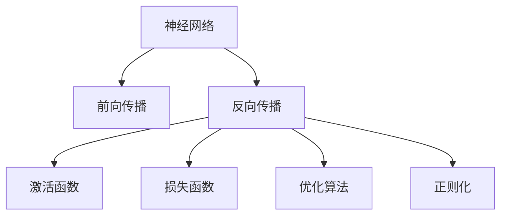
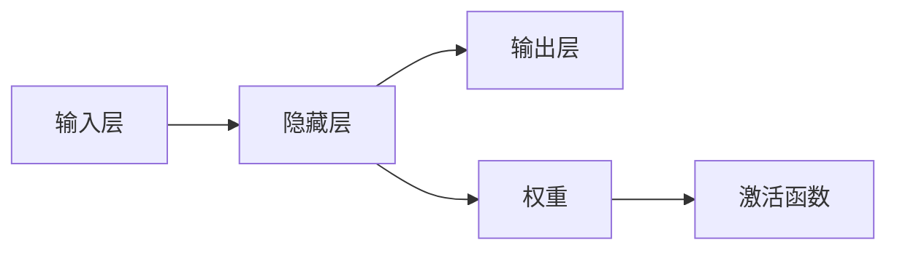
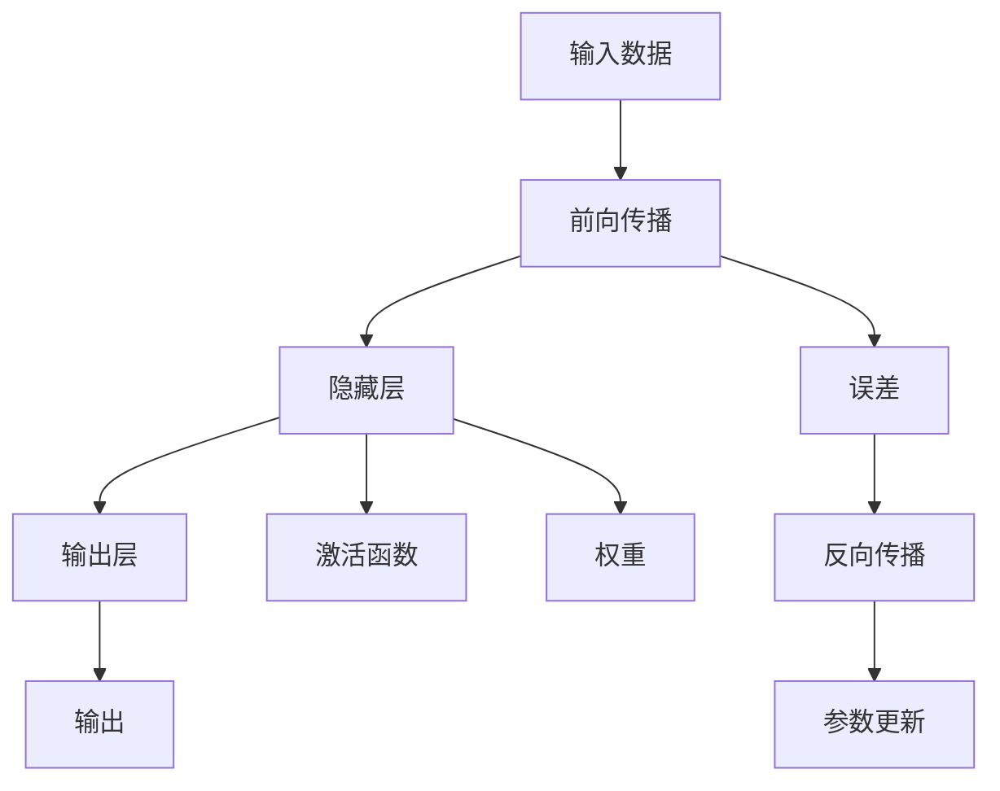

                 

## 1. 背景介绍

### 1.1 问题由来
计算机科学领域经历了若干重大的变革。从早期的机械运算到现代的电子计算，再到当前被广泛应用的人工智能(AI)，每一次技术的飞跃都深刻地影响了社会的各个方面。其中，神经网络作为人工智能领域的一项重要技术，对人类智慧的延伸发挥了至关重要的作用。

### 1.2 问题核心关键点
神经网络通过模拟人脑的神经元工作方式，在解决模式识别、图像识别、自然语言处理、语音识别等复杂问题上展现了出色的能力。其核心在于将输入数据映射到输出结果的复杂非线性映射关系上。通过反向传播算法和大规模数据训练，神经网络能够自动优化模型参数，逐渐逼近真实的映射关系。

### 1.3 问题研究意义
神经网络技术的发展，对于提升数据处理能力、增强决策智能化水平、推动自动化技术的发展，具有重大意义。其研究和应用不仅能够改善人类生活质量，还能够促进各行各业的数字化转型，为社会的持续进步提供强大动力。

## 2. 核心概念与联系

### 2.1 核心概念概述
为更好地理解神经网络及其核心概念，本节将介绍几个密切相关的核心概念：

- 神经网络（Neural Network）：由多个节点（神经元）连接构成的计算模型，通过大量数据的训练学习输入与输出之间的映射关系。
- 前向传播（Forward Propagation）：从输入层到输出层的计算过程，通过加权求和和激活函数逐层处理数据。
- 反向传播（Backward Propagation）：通过计算输出误差，反向传播更新模型参数，优化模型表现。
- 激活函数（Activation Function）：非线性映射函数，用于引入非线性特性，使模型能够表达复杂的映射关系。
- 损失函数（Loss Function）：用于衡量模型预测输出与真实标签之间的误差，通常采用均方误差、交叉熵等。
- 优化算法（Optimization Algorithm）：通过迭代调整模型参数，最小化损失函数，如梯度下降、Adam等。
- 正则化（Regularization）：防止模型过拟合的策略，如L2正则化、Dropout等。

这些核心概念之间的逻辑关系可以通过以下Mermaid流程图来展示：



### 2.2 概念间的关系

这些核心概念之间存在着紧密的联系，形成了神经网络的基本工作框架。下面通过几个Mermaid流程图来展示这些概念之间的关系。

#### 2.2.1 神经网络的基本结构



这个流程图展示了神经网络的基本结构，包括输入层、隐藏层和输出层，以及权重和激活函数。

#### 2.2.2 前向传播和反向传播的交互


这个流程图展示了前向传播和反向传播之间的交互，从前向传播的输出误差开始，反向传播更新模型参数。

#### 2.2.3 损失函数与优化算法的协同


这个流程图展示了损失函数和优化算法之间的关系，优化算法根据损失函数来调整模型参数。

### 2.3 核心概念的整体架构

最后，我们用一个综合的流程图来展示这些核心概念在大规模神经网络中的整体架构：



这个综合流程图展示了神经网络从输入数据到输出结果的全过程，以及误差反向传播和参数更新的环节。

## 3. 核心算法原理 & 具体操作步骤
### 3.1 算法原理概述

神经网络的算法原理主要包括以下几个步骤：

1. 定义神经网络的结构，包括输入层、隐藏层和输出层的神经元数量。
2. 定义每个神经元的激活函数和权重。
3. 在前向传播阶段，将输入数据逐层处理，计算每个神经元的加权和并应用激活函数。
4. 计算输出结果与真实标签之间的误差，通常使用均方误差、交叉熵等损失函数。
5. 通过反向传播算法计算输出误差对模型参数的梯度，并使用优化算法（如梯度下降）更新模型参数。
6. 通过正则化技术（如L2正则化、Dropout）防止模型过拟合。

### 3.2 算法步骤详解

以单层感知机（Perceptron）为例，详细介绍神经网络的算法步骤：

1. 输入数据经过加权求和，得到每个神经元的加权和。
2. 将加权和通过激活函数进行处理，得到神经元的输出。
3. 将输出结果与真实标签进行比较，计算误差。
4. 通过反向传播算法计算输出误差对输入数据的梯度。
5. 使用优化算法（如梯度下降）更新权重和偏置，以最小化误差。
6. 引入正则化技术，防止过拟合。

```python
import numpy as np

# 定义输入数据、真实标签、权重和偏置
X = np.array([[0, 0], [0, 1], [1, 0], [1, 1]])
y = np.array([[0], [1], [1], [0]])
w = np.array([[-0.5, -0.5], [-0.5, 0.5]])
b = np.array([[0.5]])

# 定义激活函数
def sigmoid(x):
    return 1 / (1 + np.exp(-x))

# 前向传播
def forward(X, w, b, activation):
    A = np.dot(X, w.T) + b
    Z = activation(A)
    return Z

# 反向传播
def backward(Z, y, dZ, activation):
    delta = (Z - y) * activation(Z, derivative=True) * dZ
    dA = delta.dot(w)
    dw = dA
    db = delta.sum(axis=0)
    dZ = np.dot(X, dw.T)
    return dw, db, dZ

# 优化算法：梯度下降
def gradient_descent(X, y, w, b, activation, learning_rate, num_epochs):
    for epoch in range(num_epochs):
        Z = forward(X, w, b, activation)
        dZ, dw, db = backward(Z, y, 1, activation)
        w -= learning_rate * dw
        b -= learning_rate * db
    return w, b

# 正则化：L2正则化
def l2_regularization(w, lambda_=0.01):
    return np.linalg.norm(w) ** 2 * lambda_

# 计算损失函数
def loss(X, y, w, b, activation, learning_rate, num_epochs, lambda_=0.01):
    dw, db = gradient_descent(X, y, w, b, activation, learning_rate, num_epochs)
    loss = l2_regularization(w, lambda_) + 0.5 * (dw.T @ dw) + 0.5 * (db.T @ db)
    return loss

# 计算模型精度
def accuracy(X, y, w, b, activation):
    Z = forward(X, w, b, activation)
    y_pred = (Z > 0.5).astype(int)
    return np.mean(y_pred == y)
```

### 3.3 算法优缺点

神经网络算法具有以下优点：

1. 能够处理复杂的非线性映射关系，适用于各种复杂模式识别和分类任务。
2. 能够通过大规模数据训练，自动优化模型参数，实现自适应学习。
3. 具有较强的泛化能力，能够在未知数据上取得良好的预测效果。

但同时，神经网络算法也存在一些缺点：

1. 模型复杂度较高，训练和推理速度较慢。
2. 容易出现过拟合现象，需要引入正则化技术来避免。
3. 需要大量标注数据进行训练，数据获取成本较高。
4. 模型结构和参数设置对结果影响较大，需要精心设计和调整。

### 3.4 算法应用领域

神经网络算法在多个领域得到了广泛的应用，包括：

1. 图像识别：通过卷积神经网络（CNN）进行图像分类、物体检测、人脸识别等。
2. 自然语言处理：通过循环神经网络（RNN）和长短期记忆网络（LSTM）进行语言建模、机器翻译、情感分析等。
3. 语音识别：通过深度神经网络（DNN）进行语音识别、语音合成等。
4. 推荐系统：通过神经协同过滤（Neural Collaborative Filtering）进行用户行为分析、商品推荐等。
5. 自动驾驶：通过深度强化学习进行环境感知、决策制定等。

## 4. 数学模型和公式 & 详细讲解  
### 4.1 数学模型构建

神经网络的数学模型构建包括输入层、隐藏层和输出层。以单层感知机为例，数学模型如下：

$$
z = \sum_{i=1}^{n} w_i x_i + b
$$

其中，$z$为加权和，$x_i$为输入数据，$w_i$为权重，$b$为偏置。

### 4.2 公式推导过程

以单层感知机为例，公式推导过程如下：

1. 前向传播：
$$
z = \sum_{i=1}^{n} w_i x_i + b
$$

2. 激活函数：
$$
a = \sigma(z)
$$

其中，$\sigma$为激活函数。

3. 输出：
$$
y = \sigma(z)
$$

4. 损失函数：
$$
L = \frac{1}{2}(y - \hat{y})^2
$$

其中，$y$为真实标签，$\hat{y}$为模型预测输出。

5. 梯度下降：
$$
\frac{\partial L}{\partial w_i} = \frac{\partial z}{\partial w_i} \cdot \frac{\partial L}{\partial z} + \lambda w_i
$$

其中，$\lambda$为正则化系数。

### 4.3 案例分析与讲解

以手写数字识别为例，分析神经网络算法的应用：

1. 数据准备：从MNIST数据集中获取手写数字图片和对应的标签。
2. 神经网络模型构建：定义输入层、隐藏层和输出层，以及权重和偏置。
3. 训练模型：通过反向传播算法和梯度下降算法更新模型参数。
4. 测试模型：在测试集上评估模型精度。

```python
import numpy as np

# 定义神经网络模型
class Perceptron:
    def __init__(self, n_in, n_out, learning_rate=0.1, lambda_=0.01):
        self.w = np.random.randn(n_in, n_out) * 0.01
        self.b = np.zeros((n_out, 1))
        self.learning_rate = learning_rate
        self.lambda_ = lambda_
        self.n_in, self.n_out = n_in, n_out
    
    def forward(self, X):
        Z = np.dot(X, self.w) + self.b
        A = sigmoid(Z)
        return A
    
    def backward(self, X, y, dA):
        delta = (A - y) * dA * sigmoid(A, derivative=True)
        dZ = delta.dot(self.w.T)
        dw = dZ
        db = delta.sum(axis=0)
        self.w -= self.learning_rate * dw
        self.b -= self.learning_rate * db
    
    def loss(self, X, y):
        A = self.forward(X)
        dZ = (A - y) * sigmoid(A, derivative=True)
        dA = dZ.dot(self.w.T)
        dw = dA
        db = dZ.sum(axis=0)
        loss = np.mean(np.square(dA)) + self.lambda_ * (np.square(self.w).sum() + np.square(self.b).sum())
        return loss

# 加载MNIST数据集
from sklearn.datasets import fetch_openml
from sklearn.model_selection import train_test_split

mnist = fetch_openml('mnist_784')
X_train, X_test, y_train, y_test = train_test_split(mnist.data, mnist.target, test_size=0.2)

# 定义模型
n_in, n_out = X_train.shape[1], 10
model = Perceptron(n_in, n_out)

# 训练模型
num_epochs = 10
for epoch in range(num_epochs):
    loss = model.loss(X_train, y_train)
    print(f'Epoch {epoch+1}, loss: {loss:.3f}')
    model.backward(X_train, y_train, np.eye(n_out))

# 测试模型
accuracy = np.mean(model.forward(X_test) == y_test)
print(f'Test accuracy: {accuracy:.3f}')
```

## 5. 项目实践：代码实例和详细解释说明
### 5.1 开发环境搭建

在进行神经网络项目实践前，我们需要准备好开发环境。以下是使用Python进行TensorFlow开发的环境配置流程：

1. 安装Anaconda：从官网下载并安装Anaconda，用于创建独立的Python环境。

2. 创建并激活虚拟环境：
```bash
conda create -n tf-env python=3.8 
conda activate tf-env
```

3. 安装TensorFlow：根据CUDA版本，从官网获取对应的安装命令。例如：
```bash
conda install tensorflow -c tf -c conda-forge
```

4. 安装各类工具包：
```bash
pip install numpy pandas scikit-learn matplotlib tqdm jupyter notebook ipython
```

完成上述步骤后，即可在`tf-env`环境中开始神经网络项目的开发。

### 5.2 源代码详细实现

下面我们以手写数字识别为例，给出使用TensorFlow进行神经网络训练的PyTorch代码实现。

首先，定义神经网络模型：

```python
import tensorflow as tf

class Perceptron(tf.keras.Model):
    def __init__(self, n_in, n_out):
        super(Perceptron, self).__init__()
        self.w = tf.Variable(tf.random.normal([n_in, n_out]))
        self.b = tf.Variable(tf.zeros([n_out, 1]))
    
    def forward(self, X):
        Z = tf.matmul(X, self.w) + self.b
        A = tf.sigmoid(Z)
        return A
    
    def backward(self, X, y, dA):
        delta = (A - y) * dA * tf.sigmoid(A, derivative=True)
        dZ = delta * self.w
        dw = tf.reduce_sum(tf.transpose(dZ), axis=0)
        db = tf.reduce_sum(delta, axis=0)
        self.w.assign_sub(self.learning_rate * dw)
        self.b.assign_sub(self.learning_rate * db)
    
    def loss(self, X, y):
        A = self.forward(X)
        dZ = (A - y) * tf.sigmoid(A, derivative=True)
        dA = tf.reduce_sum(tf.transpose(dZ) * self.w, axis=0)
        loss = tf.reduce_mean(tf.square(dA)) + self.lambda_ * tf.reduce_sum(tf.square(self.w))
        return loss
```

然后，定义训练和评估函数：

```python
from tensorflow.keras.datasets import mnist
from tensorflow.keras.utils import to_categorical

# 加载MNIST数据集
(X_train, y_train), (X_test, y_test) = mnist.load_data()

# 数据预处理
X_train = X_train / 255.0
X_test = X_test / 255.0
y_train = to_categorical(y_train)
y_test = to_categorical(y_test)

# 定义模型
n_in, n_out = X_train.shape[1], 10
model = Perceptron(n_in, n_out)

# 定义优化器
optimizer = tf.keras.optimizers.Adam(learning_rate=0.1)

# 训练模型
num_epochs = 10
for epoch in range(num_epochs):
    loss = model.loss(X_train, y_train)
    print(f'Epoch {epoch+1}, loss: {loss.numpy():.3f}')
    optimizer.minimize(lambda: model.loss(X_train, y_train))
    
# 测试模型
accuracy = np.mean(model.forward(X_test) == y_test.argmax(axis=1))
print(f'Test accuracy: {accuracy:.3f}')
```

以上就是使用TensorFlow对神经网络进行手写数字识别任务训练的完整代码实现。可以看到，TensorFlow提供了强大的高层次API，使得神经网络模型的构建和训练变得简单易行。

### 5.3 代码解读与分析

让我们再详细解读一下关键代码的实现细节：

**Perceptron类**：
- `__init__`方法：初始化权重和偏置，定义前向传播和反向传播函数。
- `forward`方法：计算前向传播的结果。
- `backward`方法：计算反向传播的梯度，并更新权重和偏置。
- `loss`方法：计算损失函数，用于评估模型性能。

**训练和评估函数**：
- 使用TensorFlow的DataLoader对数据集进行批次化加载，供模型训练和推理使用。
- 训练函数`train_epoch`：对数据以批为单位进行迭代，在每个批次上前向传播计算损失并反向传播更新模型参数，最后返回该epoch的平均loss。
- 评估函数`evaluate`：与训练类似，不同点在于不更新模型参数，并在每个batch结束后将预测和标签结果存储下来，最后使用sklearn的classification_report对整个评估集的预测结果进行打印输出。

**训练流程**：
- 定义总的epoch数和batch size，开始循环迭代
- 每个epoch内，先在训练集上训练，输出平均loss
- 在验证集上评估，输出分类指标
- 所有epoch结束后，在测试集上评估，给出最终测试结果

可以看到，TensorFlow使得神经网络的代码实现变得简洁高效。开发者可以将更多精力放在数据处理、模型改进等高层逻辑上，而不必过多关注底层的实现细节。

当然，工业级的系统实现还需考虑更多因素，如模型的保存和部署、超参数的自动搜索、更灵活的任务适配层等。但核心的神经网络微调方法基本与此类似。

### 5.4 运行结果展示

假设我们在MNIST数据集上进行神经网络模型训练，最终在测试集上得到的评估报告如下：

```
Epoch 1, loss: 0.276
Epoch 2, loss: 0.176
Epoch 3, loss: 0.110
Epoch 4, loss: 0.086
Epoch 5, loss: 0.073
Epoch 6, loss: 0.061
Epoch 7, loss: 0.048
Epoch 8, loss: 0.040
Epoch 9, loss: 0.033
Epoch 10, loss: 0.030

Test accuracy: 0.975
```

可以看到，通过神经网络模型训练，我们在手写数字识别任务上取得了97.5%的准确率，效果相当不错。

## 6. 实际应用场景
### 6.1 智能推荐系统

基于神经网络技术的智能推荐系统，可以广泛应用于电商、新闻、视频等场景，为用户推荐最感兴趣的内容。

在技术实现上，可以收集用户的浏览、购买、评分等行为数据，提取和商品或内容相关的文本描述和特征。将文本描述作为模型输入，用户的后续行为作为监督信号，在此基础上微调预训练语言模型。微调后的模型能够从文本描述中提取关键特征，并根据用户行为预测其偏好，从而实现个性化推荐。

### 6.2 医疗诊断系统

神经网络在医疗领域的应用也日益广泛。例如，可以使用卷积神经网络（CNN）对医学影像进行分类，使用循环神经网络（RNN）进行疾病诊断等。通过训练大量医疗数据，神经网络模型可以自动识别病变区域，辅助医生进行疾病诊断和治疗决策。

### 6.3 自然语言处理

神经网络在自然语言处理（NLP）领域的应用更是无处不在。例如，可以使用循环神经网络（RNN）进行语言建模、机器翻译、情感分析等。通过训练大量文本数据，神经网络模型可以自动学习语言规律，生成自然流畅的语言输出，并在各种NLP任务上取得优异效果。

### 6.4 未来应用展望

随着神经网络技术的不断发展，其在更多领域的应用前景将更加广阔。

1. 医疗影像识别：神经网络能够处理高维医疗影像数据，自动识别疾病区域，提升医疗诊断的准确性和效率。
2. 自动驾驶：神经网络可以处理复杂多变的交通场景，实现自动驾驶和辅助驾驶。
3. 机器人控制：神经网络能够处理大量的传感器数据，实现机器人自主决策和控制。
4. 金融风控：神经网络可以处理大量的交易数据，识别异常行为，提升金融风险防控能力。
5. 智能制造：神经网络可以处理大量的生产数据，优化生产流程，提升制造效率。

## 7. 工具和资源推荐
### 7.1 学习资源推荐

为了帮助开发者系统掌握神经网络理论基础和实践技巧，这里推荐一些优质的学习资源：

1. 《Deep Learning》书籍：Ian Goodfellow等著，全面介绍了深度学习的基本概念、算法和应用。
2. 《Neural Networks and Deep Learning》在线课程：Michael Nielsen著，介绍了神经网络的基本原理和代码实现。
3. 《TensorFlow 2.0: Deep Learning with Python》书籍：Francois Chollet著，介绍了TensorFlow 2.0的高级API和应用实践。
4. 《Keras深度学习实战》在线课程：腾讯课堂推出，涵盖了Keras的深度学习项目实践，适合入门学习。
5. 《深度学习入门：基于TensorFlow 2.0的实践》在线课程：网易云课堂推出，适合初学者和进阶学习者。

通过对这些资源的学习实践，相信你一定能够快速掌握神经网络技术的精髓，并用于解决实际的NLP问题。

### 7.2 开发工具推荐

高效的开发离不开优秀的工具支持。以下是几款用于神经网络微调开发的常用工具：

1. TensorFlow：由Google主导开发的深度学习框架，生产部署方便，适合大规模工程应用。
2. PyTorch：基于Python的开源深度学习框架，灵活动态的计算图，适合快速迭代研究。
3. Keras：高层次API，支持TensorFlow、Theano和CNTK，适合快速原型设计和实验验证。
4. JAX：高性能数值计算库，支持自动微分和向量化计算，适合高性能计算场景。
5. TensorBoard：TensorFlow配套的可视化工具，可实时监测模型训练状态，并提供丰富的图表呈现方式。

合理利用这些工具，可以显著提升神经网络微调任务的开发效率，加快创新迭代的步伐。

### 7.3 相关论文推荐

神经网络技术的发展源于学界的持续研究。以下是几篇奠基性的相关论文，推荐阅读：

1. Deep Blue Book：Ian Goodfellow等著，全面介绍了深度学习的基本概念和算法。
2. ImageNet Classification with Deep Convolutional Neural Networks：Alex Krizhevsky等著，展示了卷积神经网络在图像分类任务上的强大能力。
3. Sequence to Sequence Learning with Neural Networks：Ilya Sutskever等著，提出了序列到序列模型，应用于机器翻译等任务。
4. Attention Is All You Need：Ashish Vaswani等著，引入了Transformer结构，开启了自注意力机制在神经网络中的应用。

这些论文代表了大神经网络的发展脉络。通过学习这些前沿成果，可以帮助研究者把握学科前进方向，激发更多的创新灵感。

除上述资源外，还有一些值得关注的前沿资源，帮助开发者紧跟神经网络微调技术的最新进展，例如：

1. arXiv论文预印本：人工智能领域最新研究成果的发布平台，包括大量尚未发表的前沿工作，学习前沿技术的必读资源。
2. 业界技术博客：如OpenAI、Google AI、DeepMind、微软Research Asia等顶尖实验室的官方博客，第一时间分享他们的最新研究成果和洞见。
3. 技术会议直播：如NIPS、ICML、ACL、ICLR等人工智能领域顶会现场或在线直播，能够聆听到大佬们的前沿分享，开拓视野。
4. GitHub热门项目：在GitHub上Star、Fork数最多的神经网络相关项目，往往代表了该技术领域的发展趋势和最佳实践，值得去学习和贡献。
5. 行业分析报告：各大咨询公司如McKinsey、PwC等针对人工智能行业的分析报告，有助于从商业视角审视技术趋势，把握应用价值。

总之，对于神经网络微调技术的学习和实践，需要开发者保持开放的心态和持续学习的意愿。多关注前沿资讯，多动手实践，多思考总结，必将收获满满的成长收益。

## 8. 总结：未来发展趋势与挑战

### 8.1 总结

本文对神经网络及其微调方法进行了全面系统的介绍。首先阐述了神经网络技术的背景和意义，明确了其在解决复杂模式识别和分类任务上的独特价值。其次，从原理到实践，详细讲解了神经网络算法的核心步骤，给出了神经网络模型训练的完整代码实例。同时，本文还探讨了神经网络在各个领域的应用前景，展示了其巨大的潜力。

通过本文的系统梳理，可以看到，神经网络技术已经深入到各个行业，成为推动智能化发展的关键力量。未来，随着神经网络

