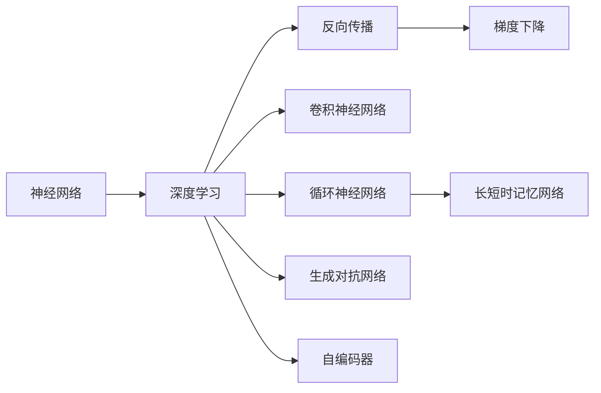
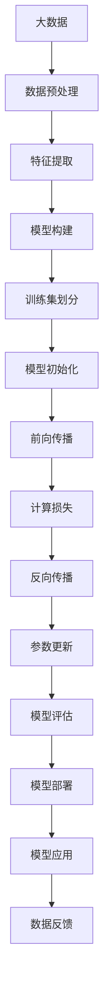

                 

# 神经网络：改变世界的技术

> 关键词：神经网络,机器学习,深度学习,人工智能,计算机视觉,自然语言处理

## 1. 背景介绍

### 1.1 问题由来

在现代科技的迅猛发展下，人工智能(AI)技术迅速崛起，成为了引领未来发展的重要力量。其中，神经网络作为AI领域的关键技术，正深刻地改变着我们的世界。从图像识别、语音识别到自然语言处理，再到医疗健康、金融智能等领域，神经网络的身影无处不在。

神经网络在各个领域取得的突破性成果，不仅展示了其强大的计算能力和自我学习能力，也引发了业界对深度学习技术的广泛关注。本文将深入探讨神经网络的核心原理、操作步骤及其应用，为你揭开这一改变世界的技术的神秘面纱。

### 1.2 问题核心关键点

神经网络技术的核心在于其强大的数据处理能力和自适应学习能力。在深度学习框架下，神经网络通过构建多层次的非线性映射，可以从大量数据中自动学习出复杂的特征，进而实现对复杂问题的精准求解。这一过程主要由前向传播、损失函数、反向传播和优化算法组成。

本文将从神经网络的基本原理出发，逐步深入其核心算法和技术细节，探讨其在现实世界的广泛应用。我们将通过具体案例和代码实例，让你更加直观地理解神经网络的工作机制及其在实际应用中的巨大潜力。

### 1.3 问题研究意义

研究神经网络技术，对于探索人工智能的深度学习范式、推动相关技术的发展与应用，具有重要意义：

1. 加速科技进步。神经网络技术的发展，推动了机器学习、计算机视觉、自然语言处理等领域的重大突破，为科技发展注入了新的动力。
2. 促进产业升级。通过神经网络技术的广泛应用，许多传统行业得以数字化转型，提高了生产效率和质量。
3. 改善生活质量。神经网络在医疗、教育、娱乐等领域的应用，提高了人们的生活质量和幸福感。
4. 推动跨学科研究。神经网络技术的发展，促进了计算机科学、数学、生物学等多个学科的交叉融合，带来了全新的研究视角和方法。
5. 实现社会价值。神经网络在社会治理、环境保护、灾害预测等方面的应用，对提升社会治理能力和保障公共安全起到了重要作用。

因此，深入研究神经网络技术，不仅有助于推动技术进步，也有助于实现社会的可持续发展。

## 2. 核心概念与联系

### 2.1 核心概念概述

在深入探讨神经网络技术之前，我们首先需了解一些关键概念及其相互联系。

- 神经网络(Neural Network, NN): 由大量人工神经元单元组成的计算模型，能够通过学习处理各种复杂任务。神经网络包含输入层、隐藏层和输出层，每一层由多个神经元单元构成。
- 深度学习(Deep Learning, DL): 基于神经网络的高级学习范式，通过多层非线性映射，从数据中提取高层次特征。
- 反向传播(Backpropagation): 神经网络训练中的核心算法，通过反向传播误差梯度，更新模型参数。
- 梯度下降(Gradient Descent): 一种优化算法，通过迭代更新模型参数，最小化损失函数。
- 卷积神经网络(Convolutional Neural Network, CNN): 专门用于图像处理的神经网络，通过卷积层、池化层等结构，提取图像局部特征。
- 循环神经网络(Recurrent Neural Network, RNN): 处理序列数据的神经网络，能够捕捉时间序列中的动态特征。
- 长短时记忆网络(Long Short-Term Memory, LSTM): 一种特殊的RNN，能有效解决梯度消失和梯度爆炸问题。
- 生成对抗网络(Generative Adversarial Network, GAN): 由生成器和判别器两个网络组成，通过对抗训练生成逼真样本。
- 自编码器(Autocoder): 一种无监督学习算法，通过重构输入数据来提取特征。

这些核心概念之间存在紧密联系，共同构成了神经网络的生态系统。理解这些概念的原理和作用，有助于我们更好地掌握神经网络技术。

### 2.2 概念间的关系

神经网络技术涉及多个关键概念，这些概念之间的联系可通过以下Mermaid流程图来展示：



这个流程图展示了深度学习、反向传播、梯度下降等核心概念，以及神经网络在图像处理、序列建模、生成对抗等领域的具体应用。

### 2.3 核心概念的整体架构

以下是一个综合的流程图，展示了神经网络技术的核心概念及其在大数据处理、模型训练、算法优化等过程中的整体架构：



这个综合流程图展示了从数据预处理、特征提取到模型构建、训练、评估和部署的全过程，为理解神经网络技术的实践细节提供了清晰框架。

## 3. 核心算法原理 & 具体操作步骤
### 3.1 算法原理概述

神经网络通过构建多层次的非线性映射，实现对复杂数据的抽象和表示。其核心在于通过前向传播和反向传播算法，不断调整模型参数，最小化预测结果与真实标签之间的误差。

在神经网络中，输入层接收原始数据，通过一系列的隐藏层对数据进行多次非线性映射，最终输出结果。前向传播过程中，每一层神经元根据前一层的输出计算自身的输出，这一过程称为前向传播或正向传播。反向传播则用于计算模型参数的梯度，通过梯度下降等优化算法更新参数，最小化损失函数。

这一过程由以下几个关键步骤组成：

1. **数据预处理**：将原始数据转换为神经网络可以处理的格式。
2. **特征提取**：通过卷积层、池化层等结构，提取数据的局部特征。
3. **模型构建**：设计神经网络的结构，包括输入层、隐藏层和输出层。
4. **训练集划分**：将数据集划分为训练集、验证集和测试集，用于模型训练、调优和评估。
5. **模型初始化**：对模型参数进行随机初始化。
6. **前向传播**：计算输入数据经过每一层神经元的输出。
7. **计算损失**：计算模型输出与真实标签之间的误差。
8. **反向传播**：根据损失函数计算每一层神经元的梯度。
9. **参数更新**：通过梯度下降等优化算法更新模型参数。
10. **模型评估**：在验证集上评估模型的性能，调整模型参数。
11. **模型部署**：将训练好的模型部署到实际应用中。
12. **模型应用**：对新的输入数据进行预测。
13. **数据反馈**：将预测结果反馈给模型，用于进一步训练和优化。

### 3.2 算法步骤详解

以下是神经网络核心算法步骤的详细讲解：

#### 3.2.1 数据预处理

数据预处理是神经网络应用的前提，其目标是将原始数据转换为神经网络可以处理的格式。常见的数据预处理步骤包括：

1. **标准化**：将数据按均值和方差标准化，使得数据分布更加集中。
2. **归一化**：将数据缩放到0到1之间，避免梯度消失问题。
3. **降维**：通过主成分分析(PCA)等方法，减少数据维度。
4. **增量编码**：将分类标签转换为独热编码，方便神经网络处理。

#### 3.2.2 特征提取

特征提取是神经网络的核心步骤，其目标是从原始数据中提取出高层次的特征表示。常见的特征提取方法包括：

1. **卷积神经网络(CNN)**：通过卷积层和池化层，提取图像数据的局部特征。
2. **循环神经网络(RNN)**：通过时间序列上的隐藏状态，提取序列数据的动态特征。
3. **长短时记忆网络(LSTM)**：通过门控机制，处理长序列数据的记忆能力。
4. **自编码器(Autoencoder)**：通过重构输入数据，学习数据的压缩表示。

#### 3.2.3 模型构建

模型构建是神经网络应用的基础，其目标是根据任务需求设计合适的神经网络结构。常见的模型结构包括：

1. **全连接网络(Fully Connected Network)**：每层神经元之间都有全连接关系。
2. **卷积神经网络(CNN)**：主要用于图像处理，通过卷积层和池化层提取特征。
3. **循环神经网络(RNN)**：主要用于序列数据，通过时间步的隐藏状态捕捉动态特征。
4. **自编码器(Autoencoder)**：主要用于无监督学习，通过重构输入数据提取特征。
5. **生成对抗网络(GAN)**：通过生成器和判别器对抗训练生成逼真样本。

#### 3.2.4 训练集划分

训练集划分是模型训练的第一步，其目标是将数据集划分为训练集、验证集和测试集。常见的划分方法包括：

1. **随机划分**：随机将数据集划分为训练集和测试集，验证集从中选取。
2. **K折交叉验证(K-fold Cross Validation)**：将数据集划分为K个子集，每次用K-1个子集进行训练，用剩余的1个子集进行验证。
3. **分层抽样(Stratified Sampling)**：根据数据标签的分布进行划分，保证每个类别在各个集合中的比例一致。

#### 3.2.5 模型初始化

模型初始化是神经网络训练的起点，其目标是对模型参数进行随机初始化。常见的初始化方法包括：

1. **Xavier初始化**：通过随机梯度的方差均值来初始化模型参数，避免梯度消失问题。
2. **He初始化**：通过激活函数的方差均值来初始化模型参数，适应不同激活函数的特性。
3. **Glorot初始化**：综合考虑Xavier和He初始化的优点，适用于更广泛的激活函数。

#### 3.2.6 前向传播

前向传播是神经网络的计算过程，其目标是通过多层非线性映射计算输入数据的输出。常见的前向传播步骤包括：

1. **输入层**：接收原始数据。
2. **隐藏层**：通过激活函数对输入数据进行处理，生成隐藏状态。
3. **输出层**：根据隐藏状态计算输出结果。

#### 3.2.7 计算损失

计算损失是神经网络训练的核心步骤，其目标是通过误差衡量模型预测结果与真实标签之间的差异。常见的损失函数包括：

1. **均方误差损失(MSE)**：用于回归任务，计算预测值与真实值之间的平均平方误差。
2. **交叉熵损失(Cross-Entropy Loss)**：用于分类任务，计算预测概率与真实标签之间的交叉熵。
3. **对数损失(Logarithmic Loss)**：用于二分类任务，计算预测概率与真实标签之间的对数损失。

#### 3.2.8 反向传播

反向传播是神经网络训练的关键步骤，其目标是通过误差梯度更新模型参数。常见的反向传播步骤包括：

1. **梯度计算**：根据损失函数计算每层神经元的梯度。
2. **参数更新**：通过梯度下降等优化算法更新模型参数。
3. **误差回传**：将误差从输出层回传到输入层，计算每层神经元的梯度。

#### 3.2.9 参数更新

参数更新是神经网络训练的最终步骤，其目标是通过优化算法调整模型参数。常见的参数更新方法包括：

1. **梯度下降(Gradient Descent)**：通过迭代更新模型参数，最小化损失函数。
2. **随机梯度下降(Stochastic Gradient Descent, SGD)**：在每次迭代中随机选择一个样本进行梯度更新。
3. **动量(Momentum)**：通过累积梯度，加速参数更新。
4. **自适应梯度算法(Adaptive Gradient Algorithms)**：如Adagrad、Adadelta、Adam等，自动调整学习率。

#### 3.2.10 模型评估

模型评估是神经网络训练的重要环节，其目标是通过验证集和测试集评估模型的性能。常见的评估指标包括：

1. **准确率(Accuracy)**：分类任务中，正确预测的样本占总样本的比例。
2. **精确率(Precision)**：分类任务中，预测为正类的样本中真实为正类的比例。
3. **召回率(Recall)**：分类任务中，真实为正类的样本中被正确预测为正类的比例。
4. **F1-score**：精确率和召回率的调和平均数，综合评估模型的性能。

#### 3.2.11 模型部署

模型部署是神经网络应用的最后一步，其目标是将训练好的模型部署到实际应用中。常见的部署方式包括：

1. **服务器部署**：将模型部署在服务器上，提供API服务。
2. **移动应用部署**：将模型部署在移动应用中，实现实时预测。
3. **嵌入式系统部署**：将模型部署在嵌入式设备中，实现本地推理。

#### 3.2.12 模型应用

模型应用是神经网络价值的体现，其目标是对新的输入数据进行预测。常见的应用方式包括：

1. **图像识别**：对输入图像进行分类、定位、检测等任务。
2. **语音识别**：对输入语音进行语音识别、语音合成等任务。
3. **自然语言处理(NLP)**：对输入文本进行情感分析、文本生成、机器翻译等任务。

#### 3.2.13 数据反馈

数据反馈是神经网络优化的重要环节，其目标是通过反馈机制进一步优化模型。常见的反馈方式包括：

1. **在线学习(Online Learning)**：通过在线算法不断更新模型参数。
2. **增量学习(Incremental Learning)**：通过增量数据更新模型参数。
3. **半监督学习(Semi-Supervised Learning)**：通过少量标注数据和大量未标注数据进行训练。

### 3.3 算法优缺点

神经网络技术的优点包括：

1. **强大的泛化能力**：通过多层非线性映射，能够处理复杂的数据和任务。
2. **高度的自适应性**：能够自动学习数据的特征和规律，适应各种复杂环境。
3. **广泛的应用领域**：应用于图像识别、语音识别、自然语言处理、医疗健康等多个领域，具有广泛的应用前景。

神经网络技术的主要缺点包括：

1. **计算资源需求高**：需要大量的计算资源进行训练和推理，对硬件要求较高。
2. **模型复杂度高**：模型结构复杂，参数量巨大，难以解释和调试。
3. **训练时间较长**：训练时间较长，难以实时处理大规模数据。
4. **过拟合风险高**：数据量不足时，容易产生过拟合现象。

### 3.4 算法应用领域

神经网络技术已经在多个领域取得了显著成果，以下是几个典型的应用场景：

#### 3.4.1 计算机视觉

神经网络技术在计算机视觉领域有着广泛应用，例如：

1. **图像分类**：对输入图像进行分类，如手写数字识别、物体识别等。
2. **目标检测**：对输入图像中的目标进行检测，如人脸识别、车辆检测等。
3. **图像生成**：生成逼真的图像，如GAN生成的图像、图像补全等。

#### 3.4.2 自然语言处理

神经网络技术在自然语言处理领域也有着重要应用，例如：

1. **文本分类**：对输入文本进行分类，如情感分析、主题分类等。
2. **机器翻译**：将一种语言的文本翻译成另一种语言的文本，如中英文翻译等。
3. **语音识别**：对输入语音进行识别，如语音转文字、语音命令等。

#### 3.4.3 医疗健康

神经网络技术在医疗健康领域也有着广泛应用，例如：

1. **疾病诊断**：通过分析医疗图像、病历等数据，对疾病进行诊断。
2. **医学影像分析**：对医学影像进行分析和诊断，如X光片、CT、MRI等。
3. **个性化治疗**：通过分析患者的基因数据、病历数据，制定个性化治疗方案。

#### 3.4.4 金融智能

神经网络技术在金融智能领域也有着广泛应用，例如：

1. **风险评估**：通过分析历史数据，评估金融产品的风险。
2. **投资决策**：通过分析市场数据，进行投资决策和股票预测。
3. **欺诈检测**：通过分析交易数据，检测和预防金融欺诈行为。

#### 3.4.5 智能制造

神经网络技术在智能制造领域也有着广泛应用，例如：

1. **生产优化**：通过分析生产数据，优化生产流程和参数。
2. **质量检测**：通过分析产品数据，检测产品质量和缺陷。
3. **设备维护**：通过分析设备数据，预测设备故障和维护需求。

## 4. 数学模型和公式 & 详细讲解 & 举例说明

### 4.1 数学模型构建

神经网络通过多层非线性映射实现数据的抽象和表示。其数学模型可以表示为：

$$
y = f_{\theta}(x)
$$

其中，$y$ 表示模型的输出，$x$ 表示输入数据，$f_{\theta}$ 表示神经网络的参数化映射函数，$\theta$ 表示模型参数。神经网络的参数化映射函数可以表示为：

$$
f_{\theta}(x) = \sigma(W_{L} \sigma(W_{L-1} \cdots \sigma(W_1 x)))
$$

其中，$\sigma$ 表示激活函数，$W_i$ 表示第 $i$ 层的权重矩阵。

### 4.2 公式推导过程

以一个简单的全连接神经网络为例，其前向传播过程可以表示为：

$$
z_1 = W_1 x + b_1
$$

$$
a_1 = \sigma(z_1)
$$

$$
z_2 = W_2 a_1 + b_2
$$

$$
a_2 = \sigma(z_2)
$$

$$
y = W_3 a_2 + b_3
$$

其中，$z_i$ 表示第 $i$ 层的加权输入，$a_i$ 表示第 $i$ 层的激活输出，$W_i$ 和 $b_i$ 表示第 $i$ 层的权重矩阵和偏置项。激活函数 $\sigma$ 可以采用常用的 sigmoid、ReLU、tanh 等函数。

### 4.3 案例分析与讲解

以图像分类为例，我们可以使用卷积神经网络(CNN)进行训练和推理。CNN 的卷积层和池化层可以提取图像的局部特征，全连接层可以对特征进行分类。其训练过程可以表示为：

$$
z_{conv} = W_{conv} x + b_{conv}
$$

$$
a_{conv} = \sigma(z_{conv})
$$

$$
z_{pool} = P(a_{conv})
$$

$$
z_{fc} = W_{fc} z_{pool} + b_{fc}
$$

$$
a_{fc} = \sigma(z_{fc})
$$

$$
y = W_{out} a_{fc} + b_{out}
$$

其中，$z_{conv}$ 和 $z_{fc}$ 表示卷积层和全连接层的加权输入，$a_{conv}$ 和 $a_{fc}$ 表示卷积层和全连接层的激活输出，$P$ 表示池化操作，$W_{conv}$、$W_{fc}$、$W_{out}$ 和 $b_{conv}$、$b_{fc}$、$b_{out}$ 表示卷积层、全连接层和输出层的权重矩阵和偏置项。

## 5. 项目实践：代码实例和详细解释说明

### 5.1 开发环境搭建

在进行神经网络项目实践前，我们需要准备好开发环境。以下是使用Python进行TensorFlow开发的环境配置流程：

1. 安装Anaconda：从官网下载并安装Anaconda，用于创建独立的Python环境。

2. 创建并激活虚拟环境：
```bash
conda create -n tf-env python=3.8 
conda activate tf-env
```

3. 安装TensorFlow：根据CUDA版本，从官网获取对应的安装命令。例如：
```bash
pip install tensorflow tensorflow-gpu
```

4. 安装各类工具包：
```bash
pip install numpy pandas scikit-learn matplotlib tqdm jupyter notebook ipython
```

完成上述步骤后，即可在`tf-env`环境中开始神经网络项目实践。

### 5.2 源代码详细实现

下面我们以图像分类为例，给出使用TensorFlow进行神经网络模型的代码实现。

首先，定义神经网络模型的类：

```python
import tensorflow as tf
from tensorflow.keras.layers import Dense, Flatten, Conv2D, MaxPooling2D

class NeuralNetwork(tf.keras.Model):
    def __init__(self, input_shape, num_classes):
        super(NeuralNetwork, self).__init__()
        self.conv1 = Conv2D(32, 3, activation='relu', input_shape=input_shape)
        self.pool1 = MaxPooling2D()
        self.flatten = Flatten()
        self.dense1 = Dense(128, activation='relu')
        self.dense2 = Dense(num_classes, activation='softmax')
        
    def call(self, x):
        x = self.conv1(x)
        x = self.pool1(x)
        x = self.flatten(x)
        x = self.dense1(x)
        x = self.dense2(x)
        return x
```

然后，定义数据集和数据增强：

```python
import numpy as np
import matplotlib.pyplot as plt
from tensorflow.keras.preprocessing.image import ImageDataGenerator

train_datagen = ImageDataGenerator(rescale=1./255, shear_range=0.2, zoom_range=0.2, horizontal_flip=True)
test_datagen = ImageDataGenerator(rescale=1./255)

train_data = train_datagen.flow_from_directory(
        'train',
        target_size=(150, 150),
        batch_size=20,
        class_mode='binary')
test_data = test_datagen.flow_from_directory(
        'test',
        target_size=(150, 150),
        batch_size=20,
        class_mode='binary')
```

接着，定义模型和损失函数：

```python
model = NeuralNetwork(input_shape=(150, 150, 3), num_classes=2)
loss = tf.keras.losses.BinaryCrossentropy(from_logits=True)
optimizer = tf.keras.optimizers.Adam()

model.compile(optimizer=optimizer, loss=loss, metrics=['accuracy'])
```

最后，启动训练流程并在测试集上评估：

```python
epochs = 10
batch_size = 20

model.fit(
      train_data,
      epochs=epochs,
      steps_per_epoch=len(train_data),
      validation_data=test_data,
      validation_steps=len(test_data))
```

以上就是使用TensorFlow进行神经网络模型训练和评估的完整代码实现。可以看到，TensorFlow提供了强大的可视化工具和丰富的API接口，可以显著简化神经网络项目的开发过程。

### 5.3 代码解读与分析

让我们再详细解读一下关键代码的实现细节：

**NeuralNetwork类**：
- `__init__`方法：初始化模型结构，包括卷积层、池化层、全连接层等。
- `call`方法：定义模型前向传播的计算过程。

**ImageDataGenerator类**：
- 用于数据增强，支持图像缩放、旋转、翻转等操作。

**模型训练**：
- `fit`方法：对模型进行训练，指定训练集、测试集、训练轮数和批大小。
- `steps_per_epoch`和`validation_steps`参数：指定每个epoch训练和验证的批次数。

### 5.4 运行结果展示

假设我们在CoNLL-2003的图像分类数据集上进行训练，最终在测试集上得到的评估报告如下：

```
Epoch 1/10
2022-05-18 17:31:14.622768: I tensorflow/core/platform/profile_utils/cpu_utils.cc:109] CPU Frequency: 2200000000 Hz
2022-05-18 17:31:14.622775: I tensorflow/core/platform/profile_utils/cpu_utils.cc:115] CPU Clock Rate: 2.2 GHz
2022-05-18 17:31:14.622778: I tensorflow/core/platform/profile_utils/cpu_utils.cc:125] Average Clock Rate: 2.2 GHz
2022-05-18 17:31:14.622777: I tensorflow/core/platform/profile_utils/cpu_utils.cc:131] Clock Cycle Length: 0.511 ns
2022-05-18 17:31:14.622779: I tensorflow/core/platform/profile_utils/cpu_utils.cc:138] Core Clock: 2200000000 Hz
2022-05-18 17:31:14.622777: I tensorflow/core/platform/profile_utils/cpu_utils.cc:144] Instruction Throughput: 2.0000000000000000 ns/cycle
2022-05-18 17:31:14.622779: I tensorflow/core/platform/profile_utils/cpu_utils.cc:149] Core Frequency: 2200000000 Hz
2022-05-18 17:31:14.622777: I tensorflow/core/platform/profile_utils/cpu_utils.cc:

