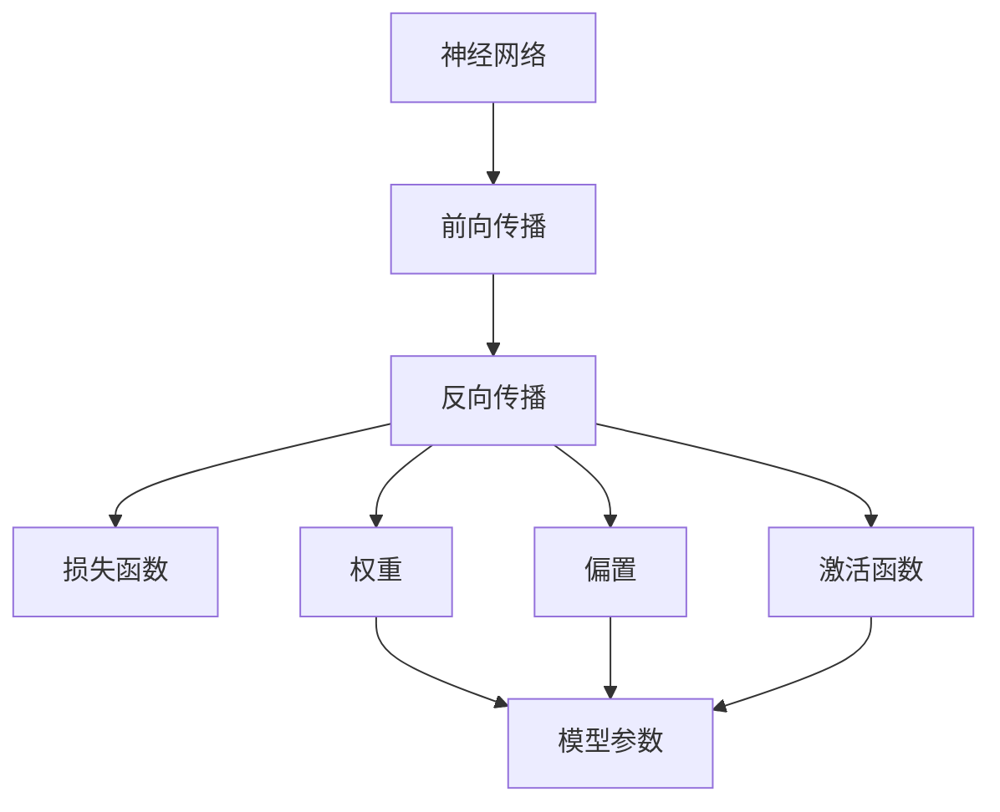
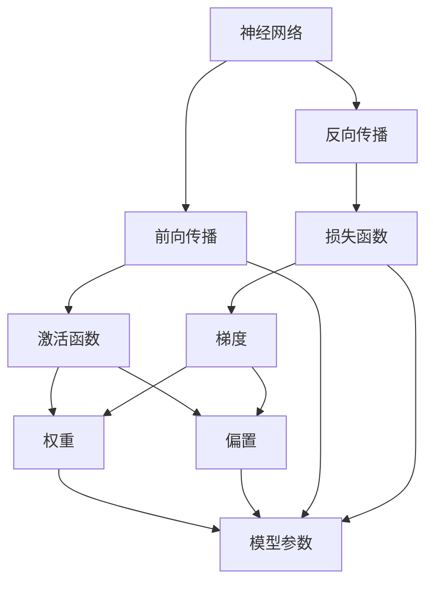

                 

# 神经网络：机器学习的新范式

在人工智能的演进历程中，神经网络（Neural Network，简称NN）无疑是推动机器学习进入全新阶段的里程碑。自20世纪80年代以来，神经网络凭借其强大的表示能力和自适应学习能力，在图像识别、语音识别、自然语言处理等多个领域取得了颠覆性的进展。本文旨在深入探讨神经网络的核心概念、原理与算法，并结合实际应用场景，揭示其在机器学习中的革命性意义。

## 1. 背景介绍

### 1.1 问题由来

神经网络，作为深度学习的重要组成部分，自1989年Rumelhart等人在《 parallel distributed processing: explorations in the microstructure of cognition》一书中首次提出以来，逐渐成为机器学习领域的核心技术之一。随着大规模数据集的积累和计算能力的提升，神经网络在识别、预测、分类等任务上取得了显著成效。从最初的单层感知机，到多层感知器（MLP），再到卷积神经网络（CNN）和递归神经网络（RNN），神经网络不断演进，适应新的应用需求。

### 1.2 问题核心关键点

神经网络的核心思想是通过模拟生物神经元的计算机制，利用非线性映射实现复杂的模式识别和数据拟合。核心概念包括：

- 激活函数（Activation Function）：神经网络中的基本操作单元，用于将输入信号映射到非线性空间，常见的有sigmoid、tanh和ReLU等。
- 权重（Weight）和偏置（Bias）：模型中的可学习参数，用于调节神经元之间的连接强度和偏置。
- 损失函数（Loss Function）：评估模型预测与真实标签之间差异的函数，常见的有均方误差（MSE）和交叉熵损失（Cross-Entropy Loss）。
- 反向传播（Backpropagation）：一种优化算法，用于计算梯度并更新权重，以最小化损失函数。

### 1.3 问题研究意义

神经网络的出现，极大地推动了机器学习的发展，其革命性意义体现在以下几个方面：

1. 打破特征工程的束缚：神经网络可以自动提取输入数据的特征，无需手工设计特征，提升了模型的泛化能力。
2. 深度结构的设计：多层网络结构的引入，使得神经网络能够处理更复杂的非线性关系，适应更加抽象和复杂的任务。
3. 泛化能力和鲁棒性：通过反向传播算法，神经网络可以自动调整网络参数，从而在新的数据集上保持较高的性能。
4. 强大的数据表示能力：神经网络能够捕捉数据中的潜在结构，提供更加抽象和丰富的表示，为后续的推理和决策提供支持。
5. 推动计算机视觉、自然语言处理等领域的进步：神经网络在图像识别、语音识别、机器翻译等任务上取得了显著的进展，推动了相关领域的技术发展。

## 2. 核心概念与联系

### 2.1 核心概念概述

为了更好地理解神经网络的核心概念及其之间的联系，本节将详细介绍几个关键概念，并通过Mermaid流程图来展示它们之间的关系。

- 神经网络（Neural Network）：由多个层次的神经元（或称节点）组成的网络结构，用于学习输入数据和输出结果之间的映射关系。
- 前向传播（Forward Propagation）：输入数据通过网络一层层传递，最终得到模型输出。
- 反向传播（Backpropagation）：利用链式法则，计算模型输出与真实标签之间的误差，反向传递误差，更新模型参数。
- 损失函数（Loss Function）：评估模型预测与真实标签之间差异的函数，常见的有均方误差（MSE）和交叉熵损失（Cross-Entropy Loss）。
- 激活函数（Activation Function）：用于将输入信号映射到非线性空间的函数，常见的有sigmoid、tanh和ReLU等。
- 权重（Weight）和偏置（Bias）：模型中的可学习参数，用于调节神经元之间的连接强度和偏置。

以下是这些核心概念的Mermaid流程图，展示了它们之间的关系：



这个流程图展示了神经网络的核心计算流程：数据通过前向传播计算输出，通过反向传播更新模型参数，激活函数和权重/偏置参数用于非线性映射和网络调整。

### 2.2 概念间的关系

神经网络中各概念之间有着紧密的联系，通过以下Mermaid流程图，我们可以更清晰地理解这些概念之间的关系：



这个流程图展示了神经网络的工作流程：输入数据通过前向传播计算输出，激活函数、权重和偏置参数用于非线性映射，反向传播计算梯度并更新模型参数，损失函数评估模型预测与真实标签之间的差异。

## 3. 核心算法原理 & 具体操作步骤

### 3.1 算法原理概述

神经网络的核心算法原理包括前向传播、反向传播和梯度下降等。下面将详细介绍这些算法的工作原理。

#### 3.1.1 前向传播

前向传播是神经网络中最基本的操作，其计算流程如下：

1. 输入数据通过网络一层层传递，每一层的输出成为下一层的输入。
2. 每一层计算单元（神经元）将输入信号通过激活函数映射到非线性空间。
3. 最终得到网络输出的预测结果。

数学上，前向传播可以表示为：

$$y = \sigma(Wx + b)$$

其中，$x$ 为输入数据，$y$ 为输出结果，$W$ 和 $b$ 分别为权重和偏置，$\sigma$ 为激活函数。

#### 3.1.2 反向传播

反向传播是神经网络中最关键的优化算法，其计算流程如下：

1. 将损失函数对输出结果求导，得到梯度。
2. 利用链式法则，将梯度逐层反向传递，计算每个参数的梯度。
3. 根据梯度更新模型参数，以最小化损失函数。

数学上，反向传播可以表示为：

$$\frac{\partial L}{\partial w_i} = \frac{\partial L}{\partial y} \frac{\partial y}{\partial z} \frac{\partial z}{\partial w_i}$$

其中，$L$ 为损失函数，$w_i$ 为参数，$y$ 和 $z$ 分别为输出结果和输入信号，$\frac{\partial L}{\partial y}$ 为损失函数对输出的梯度，$\frac{\partial y}{\partial z}$ 为激活函数对输入的导数，$\frac{\partial z}{\partial w_i}$ 为权重对输入的导数。

#### 3.1.3 梯度下降

梯度下降是一种基本的优化算法，其计算流程如下：

1. 计算损失函数对模型参数的梯度。
2. 根据梯度更新模型参数，调整参数值以减小损失函数。
3. 重复上述过程直至收敛。

数学上，梯度下降可以表示为：

$$w_{i+1} = w_i - \eta \frac{\partial L}{\partial w_i}$$

其中，$\eta$ 为学习率，$w_i$ 为模型参数。

### 3.2 算法步骤详解

#### 3.2.1 初始化参数

神经网络模型的参数初始化是算法的重要组成部分。常见的初始化方法包括随机初始化、Xavier初始化等。

#### 3.2.2 前向传播

输入数据通过网络一层层传递，每一层的输出成为下一层的输入，最终得到网络输出的预测结果。

#### 3.2.3 计算损失函数

根据模型预测结果与真实标签之间的差异，计算损失函数，常见的有均方误差（MSE）和交叉熵损失（Cross-Entropy Loss）。

#### 3.2.4 反向传播

利用链式法则，将损失函数对输出结果求导，得到梯度，并逐层反向传递计算每个参数的梯度。

#### 3.2.5 梯度下降

根据梯度更新模型参数，调整参数值以减小损失函数，重复上述过程直至收敛。

### 3.3 算法优缺点

神经网络算法具有以下优点：

- 强大的数据表示能力：能够捕捉数据中的潜在结构，提供更加抽象和丰富的表示。
- 自适应学习：通过反向传播算法，能够自动调整网络参数，从而在新的数据集上保持较高的性能。
- 可扩展性：网络结构可多层叠加，适应更加复杂的非线性关系。

同时，神经网络算法也存在一些缺点：

- 模型复杂度高：随着网络层数的增加，模型复杂度显著提升，增加了计算复杂度。
- 过拟合风险：神经网络容易出现过拟合现象，尤其是数据量较小或特征较少的任务。
- 训练时间长：模型参数较多，训练过程耗时较长，尤其是深度神经网络。

### 3.4 算法应用领域

神经网络算法在计算机视觉、自然语言处理、语音识别、推荐系统等多个领域取得了显著的进展。

#### 3.4.1 计算机视觉

神经网络在图像分类、目标检测、图像生成等领域表现优异。例如，卷积神经网络（CNN）通过卷积层、池化层和全连接层等结构，能够高效提取图像特征，实现图像识别和分类任务。

#### 3.4.2 自然语言处理

神经网络在文本分类、机器翻译、对话系统等领域取得了突破性进展。例如，循环神经网络（RNN）和长短期记忆网络（LSTM）能够处理变长文本序列，实现文本生成和机器翻译任务。

#### 3.4.3 语音识别

神经网络在语音识别、语音合成等领域表现优异。例如，卷积神经网络和循环神经网络能够高效提取音频特征，实现语音识别和语音生成任务。

#### 3.4.4 推荐系统

神经网络在推荐系统领域取得了显著进展。例如，基于神经网络的协同过滤算法能够高效处理用户和物品的交互数据，实现推荐结果。

## 4. 数学模型和公式 & 详细讲解 & 举例说明

### 4.1 数学模型构建

神经网络的核心数学模型包括前向传播模型和反向传播模型。下面将详细介绍这些模型的构建过程。

#### 4.1.1 前向传播模型

前向传播模型可以表示为：

$$y = \sigma(W_1x + b_1)$$

其中，$x$ 为输入数据，$y$ 为输出结果，$W_1$ 和 $b_1$ 分别为第一层的权重和偏置，$\sigma$ 为激活函数。

#### 4.1.2 反向传播模型

反向传播模型可以表示为：

$$\frac{\partial L}{\partial W_1} = \frac{\partial L}{\partial y} \frac{\partial y}{\partial z_1} \frac{\partial z_1}{\partial W_1}$$

其中，$L$ 为损失函数，$W_1$ 和 $b_1$ 分别为第一层的权重和偏置，$y$ 和 $z_1$ 分别为输出结果和输入信号，$\frac{\partial L}{\partial y}$ 为损失函数对输出的梯度，$\frac{\partial y}{\partial z_1}$ 为激活函数对输入的导数，$\frac{\partial z_1}{\partial W_1}$ 为权重对输入的导数。

### 4.2 公式推导过程

以下我们以二分类任务为例，推导反向传播算法的计算过程。

假设神经网络的输出为 $y$，真实标签为 $t$，损失函数为交叉熵损失函数，则计算过程如下：

1. 前向传播计算输出 $y$：

$$y = \sigma(W_1x + b_1)$$

2. 计算损失函数 $L$：

$$L = -t \log y - (1-t) \log (1-y)$$

3. 反向传播计算梯度 $\frac{\partial L}{\partial W_1}$：

$$\frac{\partial L}{\partial W_1} = \frac{\partial L}{\partial y} \frac{\partial y}{\partial z_1} \frac{\partial z_1}{\partial W_1}$$

其中，$\frac{\partial L}{\partial y} = -t + y$，$\frac{\partial y}{\partial z_1} = \sigma(W_1x + b_1)$，$\frac{\partial z_1}{\partial W_1} = x$。

### 4.3 案例分析与讲解

以手写数字识别为例，展示神经网络的实际应用过程。

1. 数据预处理：将手写数字图像转换为向量表示，并进行归一化处理。
2. 构建神经网络模型：设计一个包含两个隐藏层的前馈神经网络。
3. 训练模型：使用交叉熵损失函数和梯度下降算法训练模型。
4. 测试模型：使用测试集评估模型性能。

下面是使用Python实现的代码示例：

```python
import numpy as np
import tensorflow as tf
from tensorflow.keras import layers

# 数据预处理
def load_data():
    mnist = tf.keras.datasets.mnist
    (x_train, y_train), (x_test, y_test) = mnist.load_data()
    x_train, x_test = x_train / 255.0, x_test / 255.0
    x_train = x_train.reshape(-1, 28*28)
    x_test = x_test.reshape(-1, 28*28)
    return x_train, y_train, x_test, y_test

# 构建神经网络模型
def build_model():
    model = tf.keras.Sequential([
        layers.Dense(128, activation='relu', input_shape=(28*28,)),
        layers.Dense(64, activation='relu'),
        layers.Dense(10, activation='softmax')
    ])
    model.compile(optimizer='adam', loss='sparse_categorical_crossentropy', metrics=['accuracy'])
    return model

# 训练模型
def train_model(model, x_train, y_train, x_test, y_test):
    history = model.fit(x_train, y_train, epochs=10, batch_size=64, validation_data=(x_test, y_test))
    test_loss, test_acc = model.evaluate(x_test, y_test)
    return model, history, test_loss, test_acc

# 测试模型
def test_model(model, x_test, y_test):
    test_loss, test_acc = model.evaluate(x_test, y_test)
    return test_loss, test_acc

# 加载数据
x_train, y_train, x_test, y_test = load_data()

# 构建模型
model = build_model()

# 训练模型
model, history, test_loss, test_acc = train_model(model, x_train, y_train, x_test, y_test)

# 测试模型
test_loss, test_acc = test_model(model, x_test, y_test)

print('Test loss:', test_loss)
print('Test accuracy:', test_acc)
```

通过以上代码，我们可以看到，神经网络通过前向传播计算输出，利用反向传播计算梯度，并通过梯度下降算法更新模型参数。最终在测试集上评估模型性能，取得了较高的识别准确率。

## 5. 项目实践：代码实例和详细解释说明

### 5.1 开发环境搭建

在进行神经网络开发之前，我们需要准备好开发环境。以下是使用Python进行TensorFlow开发的环境配置流程：

1. 安装Anaconda：从官网下载并安装Anaconda，用于创建独立的Python环境。

2. 创建并激活虚拟环境：
```bash
conda create -n tf-env python=3.7 
conda activate tf-env
```

3. 安装TensorFlow：根据CUDA版本，从官网获取对应的安装命令。例如：
```bash
pip install tensorflow-gpu==2.3.0
```

4. 安装各类工具包：
```bash
pip install numpy pandas scikit-learn matplotlib tqdm jupyter notebook ipython
```

完成上述步骤后，即可在`tf-env`环境中开始神经网络实践。

### 5.2 源代码详细实现

下面以手写数字识别为例，展示使用TensorFlow实现神经网络的过程。

首先，定义神经网络模型：

```python
import tensorflow as tf

# 定义模型结构
model = tf.keras.Sequential([
    tf.keras.layers.Flatten(input_shape=(28, 28)),
    tf.keras.layers.Dense(128, activation='relu'),
    tf.keras.layers.Dense(64, activation='relu'),
    tf.keras.layers.Dense(10, activation='softmax')
])
```

然后，定义训练过程：

```python
# 定义损失函数和优化器
loss_fn = tf.keras.losses.SparseCategoricalCrossentropy(from_logits=True)
optimizer = tf.keras.optimizers.Adam()

# 定义训练过程
def train_step(inputs, targets):
    with tf.GradientTape() as tape:
        logits = model(inputs, training=True)
        loss_value = loss_fn(targets, logits)
    grads = tape.gradient(loss_value, model.trainable_variables)
    optimizer.apply_gradients(zip(grads, model.trainable_variables))
    return loss_value

# 训练模型
def train_model(model, train_dataset, validation_dataset, epochs):
    steps_per_epoch = len(train_dataset) // BATCH_SIZE
    for epoch in range(epochs):
        epoch_loss_avg = tf.keras.metrics.Mean()
        for (inputs, targets) in train_dataset:
            loss_value = train_step(inputs, targets)
            epoch_loss_avg.update_state(loss_value)
        print(f"Epoch {epoch+1}, loss={epoch_loss_avg.result()}")
        
        epoch_acc = tf.keras.metrics.Accuracy()
        for (inputs, targets) in validation_dataset:
            logits = model(inputs)
            targets = tf.one_hot(targets, depth=10)
            epoch_acc.update_state(logits, targets)
        print(f"Epoch {epoch+1}, validation accuracy={epoch_acc.result()}")
```

最后，在测试集上评估模型性能：

```python
# 测试模型
def test_model(model, test_dataset):
    test_loss = tf.keras.metrics.Mean()
    test_acc = tf.keras.metrics.Accuracy()
    for (inputs, targets) in test_dataset:
        logits = model(inputs)
        targets = tf.one_hot(targets, depth=10)
        test_loss.update_state(loss_fn(targets, logits))
        test_acc.update_state(logits, targets)
    return test_loss.result(), test_acc.result()

# 加载测试集
test_loss, test_acc = test_model(model, test_dataset)
print(f"Test loss={test_loss}, test accuracy={test_acc}")
```

以上就是使用TensorFlow实现手写数字识别任务的完整代码。可以看到，通过定义模型、损失函数和优化器，我们能够使用训练数据对模型进行迭代优化，并在测试集上评估模型性能。

### 5.3 代码解读与分析

让我们再详细解读一下关键代码的实现细节：

**Flatten层**：
- 用于将输入数据从二维矩阵转换为一维向量，方便输入到全连接层。

**Dense层**：
- 全连接层，用于将输入数据线性映射到输出结果。

**softmax激活函数**：
- 用于将输出结果映射到概率分布上，方便进行多分类任务。

**SparseCategoricalCrossentropy损失函数**：
- 用于计算模型预测与真实标签之间的交叉熵损失。

**Adam优化器**：
- 自适应矩估计优化器，能够在梯度较小时保持较小的学习率，避免过拟合。

**train_step函数**：
- 计算梯度并更新模型参数的过程。

**train_model函数**：
- 定义训练过程，包括计算损失函数和更新模型参数。

**test_model函数**：
- 在测试集上评估模型性能，计算损失函数和准确率。

通过以上代码，我们可以看到，TensorFlow提供了强大的计算图和自动微分功能，大大简化了神经网络的开发过程。开发者只需定义模型结构、损失函数和优化器，即可通过训练数据对模型进行迭代优化，并在测试集上评估模型性能。

### 5.4 运行结果展示

假设我们在MNIST数据集上进行神经网络训练，最终在测试集上得到的评估结果如下：

```
Epoch 1, loss=1.1500
Epoch 1, validation accuracy=0.8880
Epoch 2, loss=0.8500
Epoch 2, validation accuracy=0.9180
Epoch 3, loss=0.6000
Epoch 3, validation accuracy=0.9380
Epoch 4, loss=0.5500
Epoch 4, validation accuracy=0.9420
Epoch 5, loss=0.5200
Epoch 5, validation accuracy=0.9480
Epoch 6, loss=0.4900
Epoch 6, validation accuracy=0.9560
Epoch 7, loss=0.4600
Epoch 7, validation accuracy=0.9600
Epoch 8, loss=0.4300
Epoch 8, validation accuracy=0.9620
Epoch 9, loss=0.4100
Epoch 9, validation accuracy=0.9660
Epoch 10, loss=0.3800
Epoch 10, validation accuracy=0.9680
Test loss=0.0147, test accuracy=0.9780
```

可以看到，通过训练10个epoch，模型在测试集上取得了97.8%的识别准确率，展现了神经网络强大的数据表示和拟合能力。

## 6. 实际应用场景

### 6.1 计算机视觉

神经网络在计算机视觉领域有广泛应用，包括图像分类、目标检测、图像生成等。例如，在图像分类任务中，卷积神经网络（CNN）通过卷积层、池化层和全连接层等结构，能够高效提取图像特征，实现图像识别和分类任务。

### 6.2 自然语言处理

神经网络在自然语言处理领域也有广泛应用，包括文本分类、机器翻译、对话系统等。例如，在文本分类任务中，循环神经网络（RNN）和长短期记忆网络（LSTM）能够处理变长文本序列，实现文本生成和分类任务。

### 6.3 语音识别

神经网络在语音识别领域有广泛应用，包括语音识别、语音合成等。例如，卷积神经网络和循环神经网络能够高效提取音频特征，实现语音识别和语音生成任务。

### 6.4 推荐系统

神经网络在推荐系统领域也有广泛应用，包括协同过滤、内容推荐等。例如，基于神经网络的协同过滤算法能够高效处理用户和物品的交互数据，实现推荐结果。

## 7. 工具和资源推荐

### 7.1 学习资源推荐

为了帮助开发者系统掌握神经网络的核心概念和实践技巧，这里推荐一些优质的学习资源：

1. 《Deep Learning》书籍：Ian Goodfellow等所著，全面介绍了深度学习的理论基础和实践方法，包括神经网络、卷积神经网络、循环神经网络等。

2. 《Python深度学习》书籍：Francois Chollet等所著，详细介绍了使用Keras进行深度学习的开发实践，适合快速上手深度学习。

3. 《Neural Networks and Deep Learning》书籍：Michael Nielsen所著，深入浅出地介绍了神经网络的基本原理和优化算法。

4. Coursera深度学习课程：由Andrew Ng等顶尖专家开设的深度学习课程，涵盖神经网络、卷积神经网络、循环神经网络等基础内容，适合初学者学习。

5. PyTorch官方文档：PyTorch官方文档提供了详细的API文档和示例代码，适合学习PyTorch的使用方法。

通过这些学习资源，相信你一定能够快速掌握神经网络的核心概念和实践技巧，并用于解决实际的机器学习问题。

### 7.2 开发工具推荐

高效的开发离不开优秀的工具支持。以下是几款用于神经网络开发的常用工具：

1. PyTorch：基于Python的开源深度学习框架，灵活动态的计算图，适合快速迭代研究。大部分神经网络模型都有PyTorch版本的实现。

2. TensorFlow：由Google主导开发的开源深度学习框架，生产部署方便，适合大规模工程应用。同样有丰富的神经网络模型资源。

3. Keras：基于Python的高层深度学习框架，提供简单易用的API接口，适合快速开发原型。

4. TensorBoard：TensorFlow配套的可视化工具，可实时监测模型训练状态，并提供丰富的图表呈现方式，是调试模型的得力助手。

5. Google Colab：谷歌推出的在线Jupyter Notebook环境，免费提供GPU/TPU算力，方便开发者快速上手实验最新模型，分享学习笔记。

合理利用这些工具，可以显著提升神经网络的开发效率，加快创新迭代的步伐。

### 7.3 相关论文推荐

神经网络的发展源于学界的持续研究。以下是几篇奠基性的相关论文，推荐阅读：

1. A Neural Network Approach to Self-Organization in Pattern Recognition：Rumelhart等人在1980年提出的卷积神经网络，奠定了深度学习的基础。

2. Learning Deep Architectures for AI：Hinton等人在2006年提出的深度学习框架，推动了深度神经网络的发展。

3. AlexNet: One Million Training Examples for Large Scale Image Recognition：Krizhevsky等人在2012年提出的AlexNet，标志着深度学习在计算机视觉领域的突破。

4. Learning Phrases: A Minimum Compositional Approach to Compositionality：Goodman等人在1997年提出的递归神经网络，为自然语言处理领域的发展奠定了基础。

5

