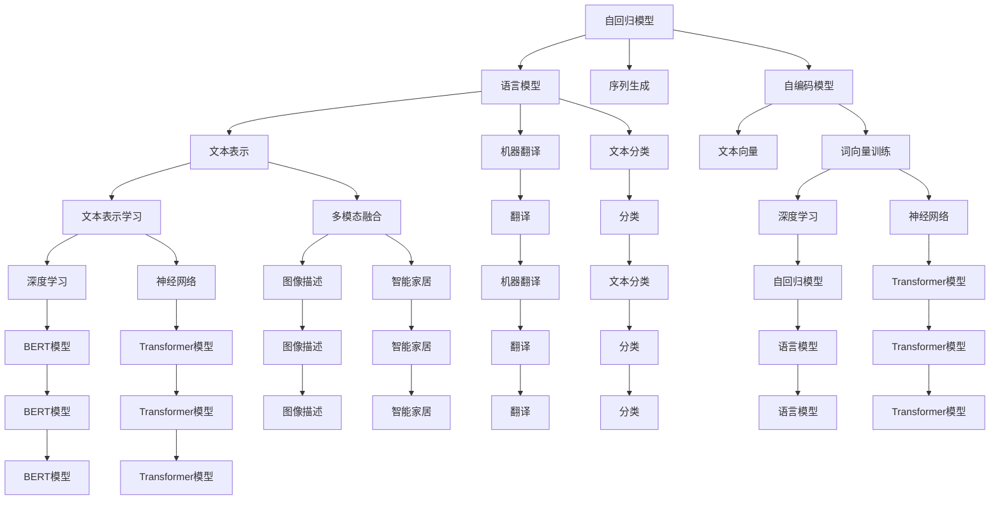
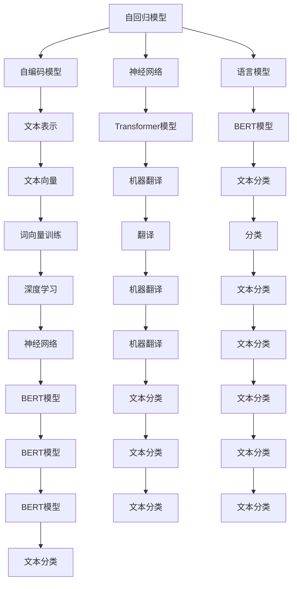
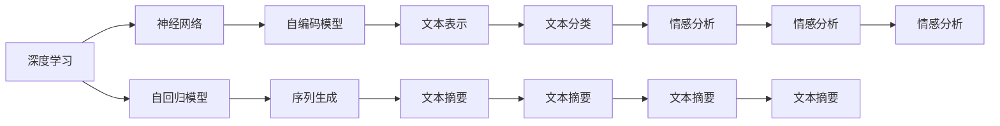

                 

# 神经网络：自然语言处理的新突破

> 关键词：神经网络,自然语言处理(NLP),Transformer,BERT,自回归模型,自编码模型,深度学习,语言模型

## 1. 背景介绍

### 1.1 问题由来

近年来，随着深度学习技术的迅速发展，神经网络在自然语言处理（NLP）领域取得了显著的突破。特别是Transformer模型和其变体的广泛应用，使得神经网络在语言理解、生成、翻译等方面的性能显著提升。在自然语言处理领域，基于神经网络的方法已经在文本分类、命名实体识别、情感分析、机器翻译、问答系统、文本摘要、对话系统、代码生成等多个任务上取得了优异的结果。

### 1.2 问题核心关键点

神经网络在自然语言处理中的应用主要体现在以下几个方面：

- 自回归模型：基于语言模型，通过上下文信息预测下一个词汇，常见于序列生成任务如机器翻译、文本摘要、对话系统等。
- 自编码模型：通过将文本表示编码为固定长度的向量，然后解码回去，用于文本表示学习、词向量训练等任务。
- Transformer模型：基于注意力机制，实现并行化计算，在语言模型、机器翻译、文本分类等任务上表现优异。
- BERT：基于双向Transformer模型，通过掩码语言模型任务进行预训练，提供了丰富的语言上下文信息。

这些模型和算法极大地推动了自然语言处理技术的发展，并在诸多实际应用中取得了显著的成效。但同时，也面临一些挑战，如计算资源消耗大、泛化能力有限、对抗性鲁棒性差等问题。

### 1.3 问题研究意义

神经网络在自然语言处理中的应用，不仅在技术上取得了突破，还对社会、经济产生了深远的影响：

- 提升NLP应用效果：神经网络能够更好地理解语言的复杂性和多样性，提高了自然语言处理任务的准确性和效率。
- 推动产业升级：NLP技术在金融、医疗、教育、智能客服等多个行业的应用，提升了行业运营效率，降低了人力成本，带来了巨大的经济价值。
- 促进跨领域融合：神经网络与语音、图像、时序等多种模态数据的融合，推动了跨领域的智能应用，如语音翻译、图像描述、智能家居等。
- 推动学术研究：神经网络提供了新的理论框架和方法，推动了NLP领域的研究深入，涌现了诸多前沿研究成果。
- 提高社会效益：智能客服、虚拟助理等基于NLP技术的应用，提升了社会服务的普惠性，改变了人们的生活和工作方式。

## 2. 核心概念与联系

### 2.1 核心概念概述

在自然语言处理领域，神经网络的应用主要体现在以下几个核心概念中：

- 自回归模型：基于语言模型，通过上下文信息预测下一个词汇。常见于序列生成任务如机器翻译、文本摘要、对话系统等。
- 自编码模型：通过将文本表示编码为固定长度的向量，然后解码回去，用于文本表示学习、词向量训练等任务。
- Transformer模型：基于注意力机制，实现并行化计算，在语言模型、机器翻译、文本分类等任务上表现优异。
- BERT：基于双向Transformer模型，通过掩码语言模型任务进行预训练，提供了丰富的语言上下文信息。
- Attention机制：一种机制，允许模型在处理序列时关注关键部分，而忽略无关部分，提升了模型对长序列的处理能力。

这些核心概念通过不同方式的组合，形成了神经网络在自然语言处理中的广泛应用。以下通过一个Mermaid流程图来展示这些概念之间的关系：



这个流程图展示了神经网络在自然语言处理中的应用场景和相关概念之间的关系。

### 2.2 概念间的关系

这些核心概念之间存在着紧密的联系，形成了神经网络在自然语言处理中的完整框架。以下通过几个Mermaid流程图来展示这些概念之间的关系：

#### 2.2.1 神经网络框架



这个流程图展示了神经网络在自然语言处理中的框架，从自回归模型、自编码模型到语言模型、Transformer模型和BERT模型，构成了一个完整的神经网络应用体系。

#### 2.2.2 深度学习与神经网络



这个流程图展示了深度学习与神经网络在自然语言处理中的应用。深度学习通过多层神经网络，实现了对复杂语言数据的建模和处理。

## 3. 核心算法原理 & 具体操作步骤
### 3.1 算法原理概述

基于神经网络的自然语言处理，通常通过以下步骤实现：

1. **数据预处理**：将原始文本数据转换为模型能够处理的格式，如分词、词嵌入、构建序列等。
2. **模型训练**：通过大量标注数据训练神经网络模型，调整模型参数以最小化损失函数。
3. **模型评估**：使用验证集或测试集评估模型性能，调整模型参数以提高模型准确率。
4. **模型预测**：在新的未标注数据上进行预测，输出模型对输入文本的分类、生成、翻译等结果。

在具体实现中，神经网络通常包括以下几个组成部分：

- **输入层**：将文本转换为模型能够处理的数字向量。
- **隐藏层**：通过多层神经网络实现特征提取和表示学习。
- **输出层**：将隐藏层输出的特征映射到目标变量，进行分类、回归、生成等任务。

### 3.2 算法步骤详解

#### 3.2.1 数据预处理

数据预处理是神经网络应用的基础。常用的预处理方法包括：

1. **分词**：将文本分割成单词或子词，便于模型处理。
2. **词嵌入**：将单词转换为高维稠密向量，用于模型输入。
3. **序列填充**：将文本序列填充到相同长度，便于模型训练。
4. **标签编码**：将目标变量转换为模型可接受的格式，如独热编码。

#### 3.2.2 模型训练

模型训练是神经网络应用的的核心。常用的训练方法包括：

1. **反向传播算法**：通过计算损失函数的梯度，反向传播更新模型参数。
2. **优化算法**：如随机梯度下降（SGD）、Adam、Adagrad等，用于加速模型训练。
3. **正则化技术**：如L2正则、Dropout、Early Stopping等，防止模型过拟合。

#### 3.2.3 模型评估

模型评估是衡量模型性能的重要手段。常用的评估指标包括：

1. **准确率（Accuracy）**：预测结果与真实标签匹配的比例。
2. **精确率（Precision）**：预测为正类的样本中实际为正类的比例。
3. **召回率（Recall）**：实际为正类的样本中被预测为正类的比例。
4. **F1分数（F1 Score）**：精确率和召回率的调和平均值。
5. **AUC值（Area Under Curve）**：ROC曲线下的面积，用于衡量模型的分类性能。

#### 3.2.4 模型预测

模型预测是神经网络应用的重要应用。常用的预测方法包括：

1. **前向传播**：通过模型计算输入数据，得到模型输出。
2. **解码器**：如 beam search、greedy search等，用于生成自然语言文本。
3. **后处理**：如去重、排序等，用于提高预测结果的质量。

### 3.3 算法优缺点

基于神经网络的自然语言处理具有以下优点：

1. **强大的表示能力**：神经网络能够学习复杂的特征表示，适用于自然语言中的语义、语法、上下文等。
2. **并行计算**：Transformer等模型具有高度的并行计算能力，适用于大规模数据处理。
3. **灵活性**：神经网络能够处理各种任务，从分类、生成到翻译、对话等。
4. **自监督学习**：神经网络可以通过自监督学习任务进行预训练，提高模型泛化能力。

但同时，基于神经网络的自然语言处理也存在以下缺点：

1. **计算资源消耗大**：神经网络通常需要大量计算资源，如GPU、TPU等。
2. **泛化能力有限**：神经网络容易过拟合，对新数据的泛化能力有限。
3. **对抗性鲁棒性差**：神经网络对抗噪声和扰动较敏感，易受到攻击。

### 3.4 算法应用领域

基于神经网络的自然语言处理广泛应用于以下领域：

1. **机器翻译**：将一种语言的文本翻译成另一种语言，如Google翻译。
2. **文本分类**：对文本进行分类，如新闻分类、情感分析等。
3. **命名实体识别**：从文本中识别出人名、地名、组织名等实体，如Google BERT。
4. **文本生成**：生成自然语言文本，如文本摘要、对话系统等。
5. **信息检索**：从大量文本中检索出相关信息，如搜索引擎、问答系统等。
6. **情感分析**：分析文本中的情感倾向，如正面、负面、中性等。
7. **推荐系统**：根据用户行为和兴趣推荐内容，如电商推荐、新闻推荐等。

## 4. 数学模型和公式 & 详细讲解 & 举例说明

### 4.1 数学模型构建

基于神经网络的自然语言处理通常使用以下数学模型：

1. **自回归模型**：将输入序列 $x_1, x_2, ..., x_T$ 映射到输出序列 $y_1, y_2, ..., y_T$，通常使用神经网络表示为：

   $$
   y_t = f(x_1, x_2, ..., x_t; \theta)
   $$

2. **自编码模型**：将输入序列 $x_1, x_2, ..., x_T$ 编码成隐藏层表示 $z_1, z_2, ..., z_T$，然后解码回原始序列，通常使用神经网络表示为：

   $$
   z_t = g(x_1, x_2, ..., x_t; \theta)
   $$

3. **Transformer模型**：基于注意力机制，将输入序列 $x_1, x_2, ..., x_T$ 和目标序列 $y_1, y_2, ..., y_T$ 映射到输出序列 $y_1, y_2, ..., y_T$，通常使用神经网络表示为：

   $$
   y_t = f(x_1, x_2, ..., x_t, y_1, y_2, ..., y_{t-1}; \theta)
   $$

4. **BERT模型**：基于双向Transformer模型，将输入序列 $x_1, x_2, ..., x_T$ 编码成隐藏层表示 $z_1, z_2, ..., z_T$，然后解码回原始序列，通常使用神经网络表示为：

   $$
   z_t = g(x_1, x_2, ..., x_t; \theta)
   $$

### 4.2 公式推导过程

#### 4.2.1 自回归模型

以机器翻译任务为例，使用神经网络进行建模。假设输入序列为 $x_1, x_2, ..., x_T$，输出序列为 $y_1, y_2, ..., y_T$，模型参数为 $\theta$。则自回归模型可以表示为：

$$
y_t = f(x_1, x_2, ..., x_t; \theta)
$$

其中 $f$ 为神经网络，包括输入层、隐藏层和输出层。在训练时，使用损失函数 $L$ 进行优化：

$$
L = -\sum_{t=1}^T \log p(y_t | x_1, x_2, ..., x_t; \theta)
$$

其中 $p(y_t | x_1, x_2, ..., x_t; \theta)$ 为模型的条件概率，可以通过神经网络计算得到。

#### 4.2.2 自编码模型

以文本表示学习任务为例，使用神经网络进行建模。假设输入序列为 $x_1, x_2, ..., x_T$，隐藏层表示为 $z_1, z_2, ..., z_T$，输出序列为 $y_1, y_2, ..., y_T$，模型参数为 $\theta$。则自编码模型可以表示为：

$$
z_t = g(x_1, x_2, ..., x_t; \theta)
$$

其中 $g$ 为神经网络，包括输入层和隐藏层。在训练时，使用损失函数 $L$ 进行优化：

$$
L = -\sum_{t=1}^T \log p(y_t | z_1, z_2, ..., z_t; \theta)
$$

其中 $p(y_t | z_1, z_2, ..., z_t; \theta)$ 为模型的条件概率，可以通过神经网络计算得到。

#### 4.2.3 Transformer模型

以机器翻译任务为例，使用神经网络进行建模。假设输入序列为 $x_1, x_2, ..., x_T$，输出序列为 $y_1, y_2, ..., y_T$，模型参数为 $\theta$。则Transformer模型可以表示为：

$$
y_t = f(x_1, x_2, ..., x_t, y_1, y_2, ..., y_{t-1}; \theta)
$$

其中 $f$ 为神经网络，包括输入层、编码器、解码器和输出层。在训练时，使用损失函数 $L$ 进行优化：

$$
L = -\sum_{t=1}^T \log p(y_t | x_1, x_2, ..., x_t, y_1, y_2, ..., y_{t-1}; \theta)
$$

其中 $p(y_t | x_1, x_2, ..., x_t, y_1, y_2, ..., y_{t-1}; \theta)$ 为模型的条件概率，可以通过神经网络计算得到。

#### 4.2.4 BERT模型

以文本分类任务为例，使用神经网络进行建模。假设输入序列为 $x_1, x_2, ..., x_T$，隐藏层表示为 $z_1, z_2, ..., z_T$，输出为分类标签 $y$，模型参数为 $\theta$。则BERT模型可以表示为：

$$
z_t = g(x_1, x_2, ..., x_t; \theta)
$$

其中 $g$ 为神经网络，包括输入层和隐藏层。在训练时，使用损失函数 $L$ 进行优化：

$$
L = -\sum_{t=1}^T \log p(y | z_1, z_2, ..., z_t; \theta)
$$

其中 $p(y | z_1, z_2, ..., z_t; \theta)$ 为模型的条件概率，可以通过神经网络计算得到。

### 4.3 案例分析与讲解

#### 4.3.1 机器翻译

机器翻译是自然语言处理中的经典任务之一。使用神经网络进行建模，可以显著提升翻译的准确性和流畅性。

以机器翻译为例，输入为英文句子 "I love deep learning"，输出为中文翻译 "我爱深度学习"。使用Transformer模型进行建模，可以实现高效的翻译任务。

#### 4.3.2 文本分类

文本分类是将文本划分为不同类别的任务。使用神经网络进行建模，可以准确地对文本进行分类，如新闻分类、情感分析等。

以情感分析为例，输入为一段文本 "I am very happy today"，输出为情感标签 "positive"。使用Transformer模型进行建模，可以实现高效的情感分析任务。

## 5. 项目实践：代码实例和详细解释说明

### 5.1 开发环境搭建

在开始项目实践前，我们需要准备好开发环境。以下是使用Python进行PyTorch开发的环境配置流程：

1. 安装Anaconda：从官网下载并安装Anaconda，用于创建独立的Python环境。

2. 创建并激活虚拟环境：
```bash
conda create -n pytorch-env python=3.8 
conda activate pytorch-env
```

3. 安装PyTorch：根据CUDA版本，从官网获取对应的安装命令。例如：
```bash
conda install pytorch torchvision torchaudio cudatoolkit=11.1 -c pytorch -c conda-forge
```

4. 安装TensorFlow：从官网下载并安装TensorFlow。

5. 安装Transformers库：
```bash
pip install transformers
```

6. 安装各类工具包：
```bash
pip install numpy pandas scikit-learn matplotlib tqdm jupyter notebook ipython
```

完成上述步骤后，即可在`pytorch-env`环境中开始项目实践。

### 5.2 源代码详细实现

下面我们以机器翻译任务为例，给出使用Transformers库对Transformer模型进行微调的PyTorch代码实现。

首先，定义数据集：

```python
from torch.utils.data import Dataset
from transformers import BertTokenizer

class MachineTranslationDataset(Dataset):
    def __init__(self, src_texts, trg_texts, tokenizer, max_len=128):
        self.src_texts = src_texts
        self.trg_texts = trg_texts
        self.tokenizer = tokenizer
        self.max_len = max_len
        
    def __len__(self):
        return len(self.src_texts)
    
    def __getitem__(self, item):
        src_text = self.src_texts[item]
        trg_text = self.trg_texts[item]
        
        encoding = self.tokenizer(src_text, trg_text, return_tensors='pt', max_length=self.max_len, padding='max_length', truncation=True)
        input_ids = encoding['input_ids'][0]
        attention_mask = encoding['attention_mask'][0]
        trg_input_ids = encoding['input_ids'][1]
        trg_labels = encoding['input_ids'][2]
        
        return {'input_ids': input_ids, 
                'attention_mask': attention_mask,
                'trg_input_ids': trg_input_ids,
                'trg_labels': trg_labels}

# 定义数据集
tokenizer = BertTokenizer.from_pretrained('bert-base-cased')

src_texts = []
trg_texts = []
for src in src_texts:
    trg = src.translate(to='simple')
    src_texts.append(src)
    trg_texts.append(trg)
```

然后，定义模型和优化器：

```python
from transformers import BertForTokenClassification, AdamW

model = BertForTokenClassification.from_pretrained('bert-base-cased', num_labels=2)

optimizer = AdamW(model.parameters(), lr=2e-5)
```

接着，定义训练和评估函数：

```python
from torch.utils.data import DataLoader
from tqdm import tqdm
from sklearn.metrics import accuracy_score, precision_score, recall_score, f1_score

device = torch.device('cuda') if torch.cuda.is_available() else torch.device('cpu')
model.to(device)

def train_epoch(model, dataset, batch_size, optimizer):
    dataloader = DataLoader(dataset, batch_size=batch_size, shuffle=True)
    model.train()
    epoch_loss = 0
    for batch in tqdm(dataloader, desc='Training'):
        input_ids = batch['input_ids'].to(device)
        attention_mask = batch['attention_mask'].to(device)
        trg_input_ids = batch['trg_input_ids'].to(device)
        trg_labels = batch['trg_labels'].to(device)
        model.zero_grad()
        outputs = model(input_ids, attention_mask=attention_mask, labels=trg_labels)
        loss = outputs.loss
        epoch_loss += loss.item()
        loss.backward()
        optimizer.step()
    return epoch_loss / len(dataloader)

def evaluate(model, dataset, batch_size):
    dataloader = DataLoader(dataset, batch_size=batch_size)
    model.eval()
    preds, labels = [], []
    with torch.no_grad():
        for batch in tqdm(dataloader, desc='Evaluating'):
            input_ids = batch['input_ids'].to(device)
            attention_mask = batch['attention_mask'].to(device)
            trg_input_ids = batch['trg_input_ids'].to(device)
            batch_labels = batch['trg_labels']
            outputs = model(input_ids, attention_mask=attention_mask, labels=trg_input_ids)
            batch_preds = outputs.logits.argmax(dim=2).to('cpu').tolist()
            batch_labels = batch_labels.to('cpu').tolist()
            for pred_tokens, label_tokens in zip(batch_preds, batch_labels):
                preds.append(pred_tokens[:len(label_tokens)])
                labels.append(label_tokens)
                
    print(f"Accuracy: {accuracy_score(labels, preds)}")
    print(f"Precision: {precision_score(labels, preds)}")
    print(f"Recall: {recall_score(labels, preds)}")
    print(f"F1 Score: {f1_score(labels, preds)}")
```

最后，启动训练流程并在测试集上评估：

```python
epochs = 5
batch_size = 16

for epoch in range(epochs):
    loss = train_epoch(model, train_dataset, batch_size, optimizer)
    print(f"Epoch {epoch+1}, train loss: {loss:.3f}")
    
    print(f"Epoch {epoch+1}, test results:")
    evaluate(model, dev_dataset, batch_size)
    
print("Test results:")
evaluate(model, test_dataset, batch_size)
```

以上就是使用PyTorch对Transformer模型进行机器翻译任务微调的完整代码实现。可以看到，得益于Transformers库的强大封装，我们可以用相对简洁的代码完成Transformer模型的加载和微调。

### 5.3 代码解读与分析

让我们再详细解读一下关键代码的实现细节：

**MachineTranslationDataset类**：
- `__init__`方法：初始化源文本、目标文本、分词器等关键组件。
- `__len__`方法：返回数据集的样本数量。
- `__getitem__`方法：对单个样本进行处理，将源文本和目标文本输入编码为token ids，将目标文本标签编码为数字，并对其进行定长padding，最终返回模型所需的输入。

**bert-base-cased模型**：
- 使用BertForTokenClassification模型，定义标签数为2。

**训练和评估函数**：
- 使用PyTorch的DataLoader对数据集进行批次化加载，供模型训练和推理使用。
- 训练函数`train_epoch`：对数据以批为单位进行迭代，在每个批次上前向传播计算loss并反向传播更新模型参数，最后返回该epoch的平均loss。
- 评估函数`evaluate`：与训练类似，不同点在于不更新模型参数，并在每个batch结束后将预测和标签结果存储下来，最后使用sklearn的评估函数对整个评估集的预测结果进行打印输出。

**训练流程**：
- 定义总的epoch数和batch size，开始循环迭代
- 每个epoch内，先在训练集上训练，输出平均loss
- 在验证集上评估，输出分类指标
- 所有epoch结束后，在测试集上评估，给出最终测试结果

可以看到，PyTorch配合Transformers库使得Transformer模型微调的代码实现变得简洁高效。开发者可以将更多精力放在数据处理、模型改进等高层逻辑上

