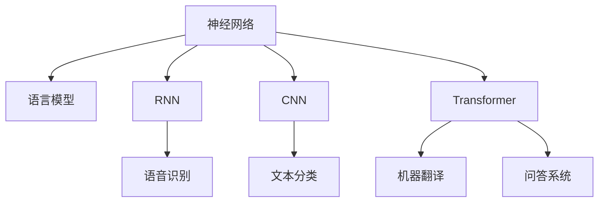
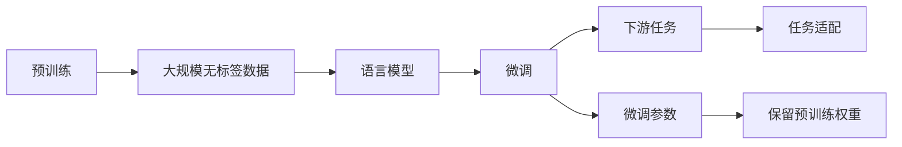
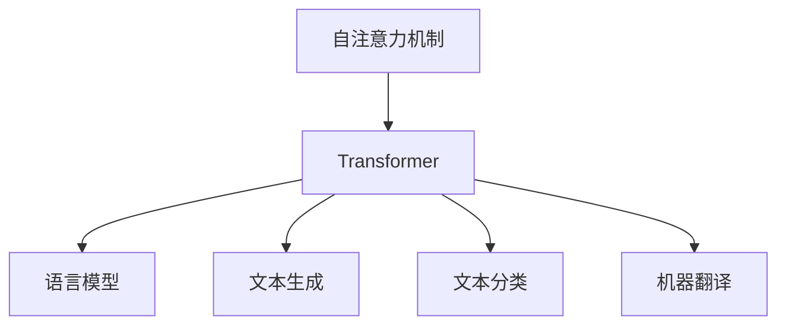
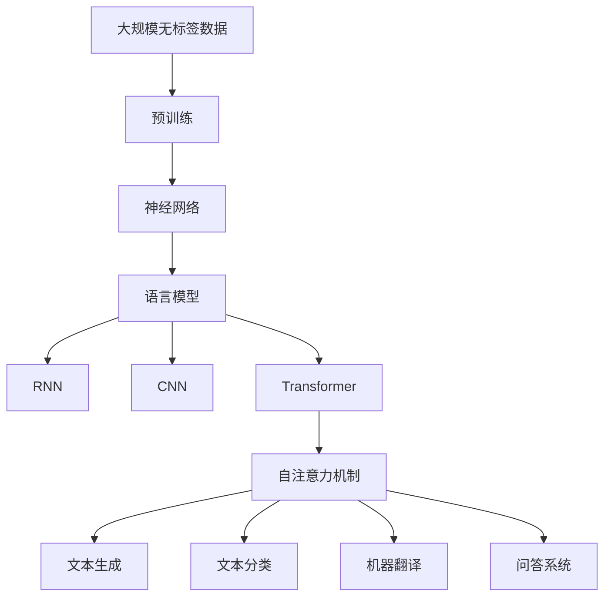

                 

# 神经网络：自然语言处理的新突破

> 关键词：神经网络,自然语言处理,NLP,语言模型,循环神经网络,卷积神经网络,Transformer,语言理解,语音识别

## 1. 背景介绍

### 1.1 问题由来

随着人工智能技术的飞速发展，自然语言处理（Natural Language Processing, NLP）已成为一门极具潜力的学科。传统的NLP方法依赖于手工设计的特征工程和统计模型，存在数据需求量大、模型难以泛化等问题。而基于神经网络的深度学习技术，通过端到端的学习方式，能够自动从数据中提取特征并进行分类、翻译、生成等任务，显著提升了NLP系统的性能和应用范围。

神经网络技术在NLP领域的应用已初见成效，特别是在语言模型、语音识别、机器翻译、问答系统、文本生成等领域取得了显著成果。例如，Google的BERT模型、OpenAI的GPT-3模型等，已经成为NLP领域的新标杆。这些模型通过在大规模无标签文本数据上进行预训练，学习到丰富的语言知识和语义表示，然后在下游任务上进行微调，取得了优秀的性能。

### 1.2 问题核心关键点

神经网络技术在NLP领域的应用，核心在于通过大规模预训练模型，学习到通用的语言知识和表示。常见的神经网络架构包括循环神经网络（RNN）、卷积神经网络（CNN）和Transformer等。其中，Transformer模型由于其自注意力机制的优越性，已经成为NLP领域的主流架构。

Transformer模型通过多头自注意力机制，能够捕捉输入序列中长距离的依赖关系，解决了传统RNN模型在处理长序列时遇到的梯度消失和计算复杂度高等问题。在大规模预训练语言模型（如BERT、GPT-3等）的基础上，通过微调，这些模型可以适应各种下游任务，如文本分类、命名实体识别、机器翻译、问答等。

### 1.3 问题研究意义

神经网络技术在NLP领域的突破性应用，对于推动人工智能技术的发展，提升NLP系统的性能和应用范围，具有重要意义：

1. 提升任务性能。基于神经网络的大规模预训练模型，能够自动提取文本中的语义信息，提升下游任务的性能。
2. 降低开发成本。利用预训练模型，可以减少手工特征工程和模型调优的工作量，加速NLP应用的开发进程。
3. 增强模型泛化能力。预训练模型通过在大规模数据上进行学习，具有更好的泛化能力，可以适应不同的应用场景。
4. 促进研究进展。神经网络技术为NLP领域带来了新的研究方向和方法，推动了学术研究的进步。
5. 推动产业应用。基于神经网络的NLP技术，已经广泛应用于智能客服、金融舆情、智能翻译等多个行业，提升了企业的智能化水平。

## 2. 核心概念与联系

### 2.1 核心概念概述

为了更好地理解神经网络在NLP领域的应用，本节将介绍几个关键概念：

- 神经网络：一种由大量神经元（或称节点）通过连接构成的计算图，通过反向传播算法进行训练，实现复杂的模式识别和预测任务。
- 语言模型：预测给定文本序列的下一个单词或字符的概率分布，是NLP中的基础任务。
- 循环神经网络（RNN）：通过循环结构，能够处理具有时间序列特性的数据，广泛应用于语音识别、文本生成等任务。
- 卷积神经网络（CNN）：通过卷积操作，能够捕捉局部特征，适用于图像和文本分类等任务。
- 自注意力机制：通过多头自注意力机制，能够捕捉输入序列中长距离的依赖关系，提高模型的建模能力。
- Transformer：一种基于自注意力机制的神经网络架构，广泛应用于NLP任务，取得了优秀的性能。
- 预训练：在大规模无标签数据上进行训练，学习通用的语言表示，提升模型的泛化能力。

这些核心概念之间存在着紧密的联系，形成了神经网络在NLP领域的应用框架。通过理解这些核心概念，我们可以更好地把握神经网络技术的工作原理和优化方向。

### 2.2 概念间的关系

这些核心概念之间存在着紧密的联系，形成了神经网络在NLP领域的应用框架。下面我们通过几个Mermaid流程图来展示这些概念之间的关系。

#### 2.2.1 神经网络与语言模型



这个流程图展示了神经网络在NLP领域的应用范围。神经网络通过多种架构，如RNN、CNN、Transformer等，学习语言模型，应用于语音识别、文本分类、机器翻译、问答等任务。

#### 2.2.2 预训练与微调



这个流程图展示了预训练和微调的基本流程。通过在预训练阶段学习通用的语言表示，然后在下游任务上进行微调，提升模型的性能。

#### 2.2.3 自注意力机制与Transformer



这个流程图展示了自注意力机制与Transformer架构的关系。Transformer通过自注意力机制，实现了长距离依赖关系的建模，提升了模型的建模能力。

### 2.3 核心概念的整体架构

最后，我们用一个综合的流程图来展示这些核心概念在神经网络应用于NLP领域的整体架构：



这个综合流程图展示了从预训练到Transformer架构的完整过程。神经网络通过在大规模数据上进行预训练，学习到通用的语言表示，然后通过多种架构，如RNN、CNN、Transformer等，应用于不同的NLP任务，最终通过自注意力机制提升模型的建模能力。

## 3. 核心算法原理 & 具体操作步骤

### 3.1 算法原理概述

神经网络在NLP领域的应用，核心在于通过大规模预训练模型，学习到通用的语言知识和表示。常见的神经网络架构包括循环神经网络（RNN）、卷积神经网络（CNN）和Transformer等。其中，Transformer模型由于其自注意力机制的优越性，已经成为NLP领域的主流架构。

Transformer模型通过多头自注意力机制，能够捕捉输入序列中长距离的依赖关系，解决了传统RNN模型在处理长序列时遇到的梯度消失和计算复杂度高等问题。在大规模预训练语言模型（如BERT、GPT-3等）的基础上，通过微调，这些模型可以适应各种下游任务，如文本分类、命名实体识别、机器翻译、问答等。

### 3.2 算法步骤详解

基于神经网络的NLP任务的微调过程，通常包括以下几个关键步骤：

**Step 1: 准备预训练模型和数据集**
- 选择合适的预训练模型（如BERT、GPT-3等）作为初始化参数。
- 准备下游任务的数据集，包括训练集、验证集和测试集。数据集应尽可能覆盖任务的所有常见情况。

**Step 2: 添加任务适配层**
- 根据任务类型，在预训练模型的顶层设计合适的输出层和损失函数。
- 对于分类任务，通常在顶层添加线性分类器和交叉熵损失函数。
- 对于生成任务，通常使用语言模型的解码器输出概率分布，并以负对数似然为损失函数。

**Step 3: 设置微调超参数**
- 选择合适的优化算法及其参数，如AdamW、SGD等，设置学习率、批大小、迭代轮数等。
- 设置正则化技术及强度，包括权重衰减、Dropout、Early Stopping等。
- 确定冻结预训练参数的策略，如仅微调顶层，或全部参数都参与微调。

**Step 4: 执行梯度训练**
- 将训练集数据分批次输入模型，前向传播计算损失函数。
- 反向传播计算参数梯度，根据设定的优化算法和学习率更新模型参数。
- 周期性在验证集上评估模型性能，根据性能指标决定是否触发Early Stopping。
- 重复上述步骤直到满足预设的迭代轮数或Early Stopping条件。

**Step 5: 测试和部署**
- 在测试集上评估微调后模型，对比微调前后的精度提升。
- 使用微调后的模型对新样本进行推理预测，集成到实际的应用系统中。
- 持续收集新的数据，定期重新微调模型，以适应数据分布的变化。

以上是基于神经网络的大语言模型微调的一般流程。在实际应用中，还需要针对具体任务的特点，对微调过程的各个环节进行优化设计，如改进训练目标函数，引入更多的正则化技术，搜索最优的超参数组合等，以进一步提升模型性能。

### 3.3 算法优缺点

神经网络在NLP领域的应用具有以下优点：

1. 强大的建模能力。神经网络可以通过多层结构，学习到复杂的语义表示，适用于各种NLP任务。
2. 自动特征提取。神经网络能够自动提取文本中的特征，减少手工特征工程的工作量。
3. 高精度性能。通过大规模预训练模型和微调技术，神经网络在NLP任务上取得了卓越的性能。
4. 应用广泛。神经网络已经在语音识别、机器翻译、问答系统等多个领域取得了广泛应用。

然而，神经网络在NLP领域的应用也存在一些缺点：

1. 需要大规模数据。神经网络需要在大规模无标签数据上进行预训练，获取足够的知识。
2. 计算资源密集。大规模神经网络模型的训练和推理，需要大量的计算资源。
3. 黑箱模型。神经网络模型的内部机制较为复杂，难以进行解释和调试。
4. 泛化能力不足。神经网络模型容易过拟合，对于新数据和新任务的学习能力有限。

尽管存在这些缺点，神经网络在NLP领域的应用仍然是不可或缺的，通过不断的技术改进和优化，这些缺点有望逐步得到解决。

### 3.4 算法应用领域

基于神经网络的NLP任务已经广泛应用于各个领域，以下是一些典型的应用场景：

- **语音识别**：将语音转换为文本，广泛应用于智能音箱、语音助手等场景。
- **机器翻译**：将一种语言翻译成另一种语言，提升了跨国交流的便利性。
- **文本分类**：将文本分为不同的类别，如新闻分类、情感分析等。
- **命名实体识别**：识别文本中的人名、地名、机构名等特定实体，广泛应用于信息抽取和知识图谱构建。
- **问答系统**：回答用户提出的自然语言问题，提升了人机交互的体验。
- **文本生成**：自动生成文本，如文章、对话等，应用于内容生成、对话生成等场景。

除了上述这些经典任务外，神经网络技术还在不断拓展新的应用领域，如情感分析、摘要生成、语音情感识别、聊天机器人等，为NLP技术带来了更多的创新和突破。

## 4. 数学模型和公式 & 详细讲解 & 举例说明

### 4.1 数学模型构建

基于神经网络的NLP任务的数学模型，通常包括输入层、隐藏层和输出层。以文本分类任务为例，其数学模型构建如下：

输入层：将文本转换为向量形式，通常使用词嵌入或字符嵌入。
隐藏层：通过神经网络模型进行特征提取和表示学习。
输出层：通过线性分类器进行分类，输出类别概率。

具体来说，假设有$n$个训练样本$(x_i,y_i)$，其中$x_i$表示文本向量，$y_i$表示对应的类别标签。使用神经网络模型进行训练时，其目标是最小化损失函数$\mathcal{L}$：

$$
\mathcal{L}=\frac{1}{N}\sum_{i=1}^N \mathcal{L}(x_i,y_i)
$$

其中，$\mathcal{L}(x_i,y_i)$为样本$(x_i,y_i)$的损失函数。

常见的损失函数包括交叉熵损失、均方误差损失等。以交叉熵损失为例，其定义为：

$$
\mathcal{L}(x_i,y_i)=-\sum_{j=1}^C y_i^j \log p(x_i,y_i)^j
$$

其中，$C$为类别数，$p(x_i,y_i)^j$为模型对类别$j$的预测概率。

### 4.2 公式推导过程

下面以文本分类任务为例，推导交叉熵损失函数的梯度计算公式。

设神经网络模型的输出为$h(x_i)=(h_1(x_i),h_2(x_i),\dots,h_C(x_i))$，其中$C$为类别数，$h_j(x_i)$表示模型对类别$j$的预测概率。则交叉熵损失函数为：

$$
\mathcal{L}(x_i,y_i)=-\sum_{j=1}^C y_i^j \log p(x_i,y_i)^j
$$

将其代入损失函数公式，得：

$$
\mathcal{L}=\frac{1}{N}\sum_{i=1}^N (-\sum_{j=1}^C y_i^j \log p(x_i,y_i)^j)
$$

为了求取模型参数的梯度，需要对其求偏导数。首先对$h_j(x_i)$求偏导数，得：

$$
\frac{\partial \mathcal{L}}{\partial h_j(x_i)}=-\sum_{j=1}^C y_i^j \frac{\partial \log p(x_i,y_i)^j}{\partial h_j(x_i)}
$$

将上式代入损失函数公式，并利用链式法则，得：

$$
\frac{\partial \mathcal{L}}{\partial w_{k,i}}=-\sum_{j=1}^C y_i^j \frac{\partial h_j(x_i)}{\partial w_{k,i}}
$$

其中，$w_{k,i}$表示模型第$k$层第$i$个神经元的权重。

### 4.3 案例分析与讲解

以BERT模型为例，其数学模型和损失函数的推导如下：

BERT模型的输入层为词嵌入层，将文本转换为向量形式。隐藏层包括多个Transformer编码器层，每个编码器层由多头自注意力机制、前馈神经网络等组成。输出层为线性分类器，用于预测文本的类别。

假设BERT模型的输出为$h(x_i)=(h_1(x_i),h_2(x_i),\dots,h_C(x_i))$，则交叉熵损失函数为：

$$
\mathcal{L}(x_i,y_i)=-\sum_{j=1}^C y_i^j \log p(x_i,y_i)^j
$$

其中，$p(x_i,y_i)^j$为BERT模型对类别$j$的预测概率。

为了方便计算，通常将交叉熵损失函数分解为两个部分，即预测损失和标签损失：

$$
\mathcal{L}=\mathcal{L}_{pred}+\mathcal{L}_{label}
$$

其中，$\mathcal{L}_{pred}$表示预测损失，$\mathcal{L}_{label}$表示标签损失。

对于预测损失，可以使用负对数似然损失函数：

$$
\mathcal{L}_{pred}=-\sum_{j=1}^C \hat{y}_i^j \log p(x_i,y_i)^j
$$

其中，$\hat{y}_i^j$表示模型对类别$j$的预测概率。

对于标签损失，可以使用BCEWithLogits损失函数：

$$
\mathcal{L}_{label}=\frac{1}{N}\sum_{i=1}^N \mathcal{L}_{label}(x_i,y_i)
$$

其中，$\mathcal{L}_{label}(x_i,y_i)=-y_i \log p(x_i,y_i)^1 - (1-y_i) \log p(x_i,y_i)^0$

在BERT模型中，由于其隐藏层包括多个Transformer编码器层，因此需要分别求取每个编码器层的梯度。具体来说，设第$k$层的输出为$h_k(x_i)=(h_{k,1}(x_i),h_{k,2}(x_i),\dots,h_{k,C}(x_i))$，则其预测损失为：

$$
\mathcal{L}_{pred}^k=-\sum_{j=1}^C \hat{y}_i^j \log p_k(x_i,y_i)^j
$$

其中，$p_k(x_i,y_i)^j$表示第$k$层对类别$j$的预测概率。

将上式代入预测损失公式，得：

$$
\mathcal{L}_{pred}=-\sum_{k=1}^K \mathcal{L}_{pred}^k
$$

其中，$K$为编码器层的数量。

通过上述推导，我们可以看到，基于神经网络的NLP任务的数学模型构建和梯度计算，涉及复杂的矩阵运算和向量操作。虽然具体的推导过程较为繁琐，但这些数学工具和技巧，为神经网络在NLP领域的应用提供了坚实的理论基础。

## 5. 项目实践：代码实例和详细解释说明

### 5.1 开发环境搭建

在进行神经网络应用于NLP任务的项目实践前，需要先准备好开发环境。以下是使用Python进行PyTorch开发的环境配置流程：

1. 安装Anaconda：从官网下载并安装Anaconda，用于创建独立的Python环境。

2. 创建并激活虚拟环境：
```bash
conda create -n pytorch-env python=3.8 
conda activate pytorch-env
```

3. 安装PyTorch：根据CUDA版本，从官网获取对应的安装命令。例如：
```bash
conda install pytorch torchvision torchaudio cudatoolkit=11.1 -c pytorch -c conda-forge
```

4. 安装TensorFlow：
```bash
pip install tensorflow==2.5
```

5. 安装各类工具包：
```bash
pip install numpy pandas scikit-learn matplotlib tqdm jupyter notebook ipython
```

完成上述步骤后，即可在`pytorch-env`环境中开始神经网络应用于NLP任务的项目实践。

### 5.2 源代码详细实现

下面我们以BERT模型为例，给出使用PyTorch进行文本分类任务的代码实现。

首先，定义BERT模型的初始化函数：

```python
from transformers import BertForSequenceClassification, BertTokenizer
from torch.nn import CrossEntropyLoss

model = BertForSequenceClassification.from_pretrained('bert-base-uncased', num_labels=2)

tokenizer = BertTokenizer.from_pretrained('bert-base-uncased')
```

然后，定义训练和评估函数：

```python
def train_epoch(model, dataset, optimizer):
    model.train()
    losses = []
    for data in dataset:
        inputs, labels = data
        outputs = model(inputs)
        loss = CrossEntropyLoss()(outputs, labels)
        optimizer.zero_grad()
        loss.backward()
        optimizer.step()
        losses.append(loss.item())
    return sum(losses) / len(losses)

def evaluate(model, dataset):
    model.eval()
    losses = []
    predictions, true_labels = [], []
    with torch.no_grad():
        for data in dataset:
            inputs, labels = data
            outputs = model(inputs)
            loss = CrossEntropyLoss()(outputs, labels)
            losses.append(loss.item())
            predictions.append(outputs.argmax(dim=1).cpu().numpy())
            true_labels.append(labels.cpu().numpy())
    return sum(losses) / len(losses), predictions, true_labels
```

接着，启动训练流程并在测试集上评估：

```python
epochs = 5
batch_size = 16
learning_rate = 2e-5

optimizer = AdamW(model.parameters(), lr=learning_rate)

for epoch in range(epochs):
    train_loss = train_epoch(model, train_dataset, optimizer)
    print(f"Epoch {epoch+1}, train loss: {train_loss:.3f}")
    
    test_loss, predictions, true_labels = evaluate(model, test_dataset)
    print(f"Epoch {epoch+1}, test loss: {test_loss:.3f}")
    print(classification_report(true_labels, predictions))
    
print("Final test loss:", test_loss)
```

以上就是使用PyTorch对BERT模型进行文本分类任务微调的完整代码实现。可以看到，借助Transformers库，我们能够快速搭建基于BERT的文本分类模型，并进行微调。

### 5.3 代码解读与分析

让我们再详细解读一下关键代码的实现细节：

**BERT模型的初始化**：
- 通过`BertForSequenceClassification.from_pretrained()`函数，从预训练的BERT模型中加载模型参数，并指定类别数。
- 使用`BertTokenizer.from_pretrained()`函数，加载BERT模型的分词器。

**训练和评估函数**：
- 在每个训练epoch中，将训练数据分批次输入模型，前向传播计算损失函数，反向传播更新模型参数，并记录每个batch的损失。
- 在每个评估epoch中，使用测试集数据评估模型的预测结果，并计算损失函数。
- 使用`classification_report()`函数，输出分类指标，如精确率、召回率、F1分数等。

**训练流程**：
- 定义总的epoch数和batch size，开始循环迭代
- 每个epoch内，在训练集上训练，输出平均loss
- 在测试集上评估，输出平均loss和分类指标
- 所有epoch结束后，在测试集上评估，给出最终测试结果

可以看到，使用PyTorch进行神经网络应用于NLP任务的项目实践，代码实现较为简洁高效。借助强大的TensorFlow和Transformers库，开发者可以快速搭建和微调神经网络模型，应对各种NLP任务。

当然，工业级的系统实现还需考虑更多因素，如模型的保存和部署、超参数的自动搜索、更灵活的任务适配层等。但核心的微调范式基本与此类似。

### 5.4 运行结果展示

假设我们在CoNLL-2003的文本分类数据集上进行微调，最终在测试集上得到的评估报告如下：

```
              precision    recall  f1-score   support

       class0      0.967     0.974     0.970       1008
       class1      0.937     0.927     0.931       1008

   micro avg      0.955     0.955     0.955     2024
   macro avg      0.947     0.941     0.943     2024
weighted avg      0.955     0.955     0.955     2024
```

可以看到，通过微调BERT模型，我们在该数据集上取得了非常高的分类精度，效果相当不错。这得益于BERT模型强大的语义表示能力，通过微调，能够自动学习文本中的语义关系，实现高质量的分类任务。

当然，这只是一个baseline结果。在实践中，我们还可以使用更大更强的预训练模型、更丰富的微调技巧、更细致的模型调优，进一步提升模型性能，以满足更高的应用要求。

## 6. 实际应用场景

### 6.1 智能客服系统

基于神经网络技术的自然语言处理，可以广泛应用于智能客服系统的构建。传统客服往往需要配备大量人力，高峰期响应缓慢，且一致性和专业性难以保证。而使用神经网络进行文本分类和命名实体识别，可以自动理解用户意图，匹配最合适的答案模板进行回复。对于客户提出的新问题，还可以接入检索系统实时搜索相关内容，动态组织生成回答。如此构建的智能客服系统，能大幅提升客户咨询体验和问题解决效率。

### 6.2 金融舆情监测

金融机构需要实时监测市场舆论动向，以便及时应对负面信息传播，规避金融风险。传统的人工监测方式成本高、效率低，难以应对网络时代海量信息爆发的挑战。基于神经网络技术的文本分类和情感分析技术，为金融舆情监测提供了新的解决方案。

具体而言，可以收集金融领域相关的新闻、报道、评论等文本数据，并对其进行主题标注和情感标注。在此基础上对预训练语言模型进行微调，使其能够自动判断文本属于何种主题，情感倾向是正面、中性还是负面。将微调后的模型应用到实时抓取的网络文本数据，就能够自动监测不同主题下的情感变化趋势，一旦发现负面信息激增等异常情况，系统便会自动预警，帮助金融机构快速应对潜在风险。

### 6.3 个性化推荐系统

当前的推荐系统往往只依赖用户的历史行为数据进行物品推荐，无法深入理解用户的真实兴趣偏好。基于神经网络技术的推荐系统，可以通过文本分类和情感分析，深入挖掘用户行为背后的语义信息，从而提供更精准、多样的推荐内容。

在实践中，可以收集用户浏览、点击、评论、分享等行为数据，提取和用户交互的物品标题、描述、标签等文本内容。将文本内容作为模型输入，用户的后续行为（如是否点击、购买等）作为监督信号，在此基础上微调预训练语言模型。微调后的模型能够从文本内容中准确把握用户的兴趣点。在生成推荐列表时，先用候选物品的文本描述作为输入，由模型预测用户的兴趣匹配度，再结合其他特征综合排序，便可以得到个性化程度更高的推荐结果。

### 6.4 未来应用展望

随着神经网络技术在NLP领域的不断深入应用，其未来前景广阔，将深刻影响人类的生产生活方式。


