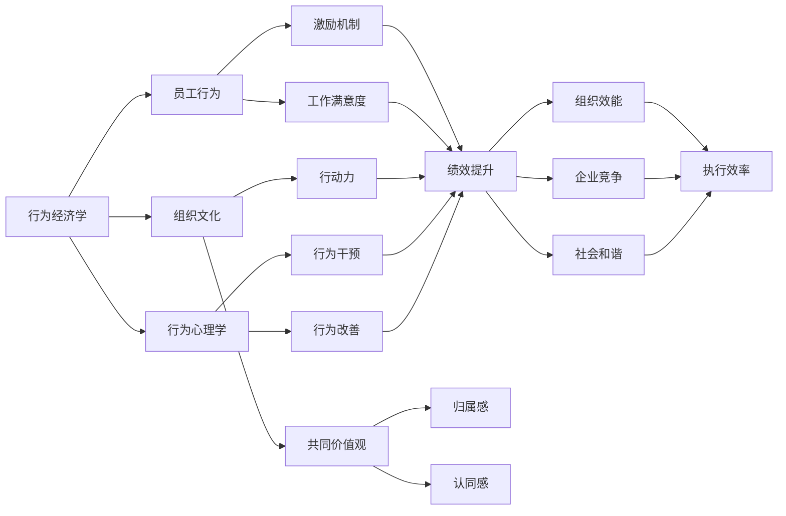
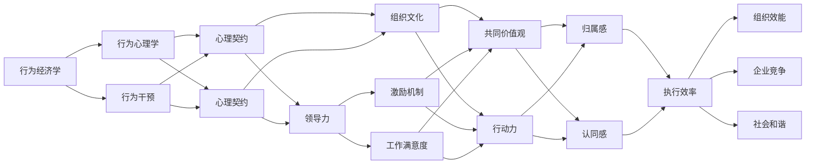

                 

# 管理的本质：激发潜能与善意

> 关键词：管理, 激发潜能, 善意, 领导力, 组织文化, 行为经济学, 人类行为, 变革管理

## 1. 背景介绍

### 1.1 问题由来

现代企业管理，面临着越来越多的挑战。如何在不确定性增加、员工期望变化的背景下，维持组织的活力和创新能力？如何激发员工的潜能和善意，以实现可持续的高绩效？这些问题，已不仅局限于经济学、管理学，更深入到行为科学和心理学的领域。

随着大数据、人工智能等技术的迅猛发展，对人力资源管理提出了新的要求。管理者需借助更先进的工具和方法，洞察员工的心理和行为，从而制定出更为精准、人性化的管理策略。本文聚焦于管理的本质，通过行为经济学和心理学的视角，探讨如何激发员工潜能和善意，提升组织绩效。

### 1.2 问题核心关键点

现代企业管理中，激发员工潜能和善意是提升组织绩效的关键。其核心在于：

1. **行为经济学**：理解员工行为的经济动因，通过设计有效的激励机制，激发员工的内在动力。
2. **组织文化**：营造积极向上的组织氛围，使员工感受到归属感和认同感，形成共识和行动力。
3. **领导力**：管理者通过自身的魅力和智慧，引导和影响员工，建立互信关系。
4. **心理契约**：确保员工与组织之间存在相互期望和承诺，形成稳固的合作关系。
5. **行为心理学**：应用行为心理学的原理，设计有针对性的行为干预，提升员工的工作满意度。
6. **变革管理**：通过有策略的变革，适应环境变化，推动组织和个人成长。

这些核心点构成了企业管理中激发潜能和善意的关键要素，通过综合运用，可以显著提升组织的整体效能。

### 1.3 问题研究意义

研究管理的本质，对于理解组织运作和提升管理效果具有重要意义：

1. **科学管理**：帮助管理者深入理解员工心理和行为规律，制定科学的管理策略。
2. **员工福祉**：通过改善员工的工作环境和心理状态，提升员工的工作满意度和忠诚度。
3. **企业竞争**：在竞争激烈的市场环境中，通过激发员工潜能和善意，提升企业的市场响应能力和创新能力。
4. **组织效能**：通过科学的领导和行为管理，提高组织的执行效率和绩效水平。
5. **社会和谐**：营造正向的企业文化，推动社会的和谐与进步。

本文将围绕激发潜能与善意这一核心主题，深入探讨管理的本质，提出具体的策略和方法，以期为管理者提供实用的指导。

## 2. 核心概念与联系

### 2.1 核心概念概述

要理解管理的本质，需要掌握以下几个核心概念：

- **行为经济学**：研究经济决策中个体行为，揭示人们在经济活动中的心理和行为规律。
- **组织文化**：指组织内共同价值观、信念、仪式和行为方式。
- **领导力**：指管理者通过影响力引导和影响他人的能力。
- **心理契约**：指员工与组织之间的隐性协议，涉及双方的期望和承诺。
- **行为心理学**：研究个体和群体的行为模式，提出改善行为的方法。
- **变革管理**：指通过有策略的变革，适应环境变化，推动组织和个人成长。

这些概念之间存在着紧密的联系，形成了一个完整的管理框架：行为经济学和行为心理学提供了员工行为的内在动因和改善策略，组织文化则从外部环境的角度，强调共同价值观和行为方式的重要性，领导力和心理契约则从人的关系层面，强调信任和互动的重要性，变革管理则从动态演进的角度，强调组织适应性和创新能力。

### 2.2 概念间的关系

通过以下Mermaid流程图，可以更好地理解这些核心概念之间的关系：



这个流程图展示了核心概念之间的关系：行为经济学和行为心理学通过理解员工行为动因和改善策略，进而设计出有效的激励机制和工作满意度提升方法；组织文化通过营造积极向上的价值观和行为方式，提升员工的归属感和认同感；领导力和心理契约通过建立信任和互动关系，确保员工与组织之间的相互期望和承诺；变革管理则通过适应环境变化，推动组织和个人成长。这些概念共同构成了一个全面的管理框架，指导管理者如何在不同情境下激发员工潜能和善意。

### 2.3 核心概念的整体架构

最后，用以下综合的流程图来展示这些核心概念在企业管理中的整体架构：



这个综合流程图展示了行为经济学和行为心理学通过员工行为的改善策略，作用于心理契约和激励机制；组织文化通过营造共同价值观和行动力，提升员工的归属感和认同感；领导力通过信任和互动关系，确保心理契约的有效性；变革管理通过适应环境变化，推动组织和个人成长。这些概念共同构成了企业管理中激发潜能和善意的整体架构，指导管理者如何在不同情境下实现管理的科学性和人性化。

## 3. 核心算法原理 & 具体操作步骤
### 3.1 算法原理概述

管理的本质，在于激发员工的潜能和善意，以实现高绩效。这一过程，可以通过以下步骤进行：

1. **数据收集**：通过问卷调查、访谈等方式，收集员工行为数据和心理状态信息。
2. **行为分析**：使用行为经济学和行为心理学的理论，分析员工行为背后的经济动因和心理因素。
3. **目标设定**：根据分析结果，设定明确的绩效目标，激励员工向目标努力。
4. **激励设计**：设计有针对性的激励机制，确保员工能获得即时的反馈和奖励。
5. **组织文化建设**：营造积极向上的组织氛围，增强员工的归属感和认同感。
6. **领导力培养**：提升管理者的领导力，建立互信关系，引导员工向目标努力。
7. **心理契约管理**：确保员工与组织之间的期望和承诺相互匹配，形成稳固的关系。
8. **变革管理**：通过有策略的变革，适应环境变化，推动组织和个人成长。

这些步骤，构成了一个系统化的管理流程，帮助管理者在激发员工潜能和善意的同时，提升组织绩效。

### 3.2 算法步骤详解

以下将详细讲解管理的各个步骤：

**Step 1: 数据收集**

数据收集是管理的基础。以下是常用的数据收集方法：

- **问卷调查**：设计结构化的问卷，涵盖员工的行为、态度、满意度等指标。
- **访谈**：通过一对一的访谈，深入了解员工的想法和感受。
- **行为记录**：记录员工的工作表现和互动行为，如出勤率、任务完成率等。

**Step 2: 行为分析**

行为分析是理解员工行为的关键。常用的行为分析工具和方法包括：

- **经济学模型**：使用期望效用理论、博弈论等经济学模型，分析员工行为的经济动因。
- **心理学模型**：使用动机理论、态度理论等心理学模型，分析员工行为的心理因素。
- **数据挖掘**：使用数据挖掘技术，分析员工行为数据中的模式和趋势。

**Step 3: 目标设定**

目标设定是激励员工的核心。以下是常见的目标设定方法：

- **SMART原则**：确保目标具体、可衡量、可实现、相关和有时限。
- **OKR方法**：通过设定挑战性的目标，激发员工的积极性和创造力。
- **KPI指标**：设定关键绩效指标，跟踪和评估员工的绩效表现。

**Step 4: 激励设计**

激励设计是提升员工动力的关键。以下是常用的激励方法：

- **物质激励**：提供有竞争力的薪酬、奖金和福利。
- **精神激励**：给予表彰、荣誉和晋升机会，增强员工的荣誉感和归属感。
- **参与激励**：让员工参与决策过程，增强其责任感和自主性。

**Step 5: 组织文化建设**

组织文化建设是提升员工认同感的关键。以下是常用的组织文化建设方法：

- **共同价值观**：制定明确的组织价值观，引导员工行为。
- **仪式和活动**：组织团建活动、表彰仪式等，增强员工归属感。
- **开放沟通**：建立开放的沟通渠道，鼓励员工表达意见和建议。

**Step 6: 领导力培养**

领导力培养是提升组织效能的关键。以下是常用的领导力培养方法：

- **榜样示范**：管理者以身作则，树立榜样。
- **授权赋能**：赋予员工更多的自主权和决策权，增强其责任感和主动性。
- **反馈机制**：建立及时的反馈机制，帮助员工不断改进。

**Step 7: 心理契约管理**

心理契约管理是确保员工忠诚度的关键。以下是常见的心理契约管理方法：

- **期望管理**：确保员工和组织之间的期望相互匹配，避免误解和不满。
- **信任建设**：建立互信关系，增强员工对组织的信任感。
- **承诺兑现**：兑现承诺，增强员工的归属感和忠诚度。

**Step 8: 变革管理**

变革管理是提升组织适应性的关键。以下是常用的变革管理方法：

- **渐进变革**：逐步引入变革，减少员工的抵触情绪。
- **沟通与参与**：通过透明沟通和员工参与，增强变革的接受度。
- **技术支持**：利用先进的技术工具，支持变革的顺利进行。

### 3.3 算法优缺点

基于上述操作步骤，管理的本质激发潜能与善意的方法具有以下优点：

1. **科学性**：通过数据驱动的管理决策，提高管理的科学性和客观性。
2. **人性化**：考虑员工的心理和行为，提升管理的人文关怀和心理支持。
3. **系统性**：通过系统化的管理流程，确保每个环节都能有效执行。
4. **适应性**：通过持续的反馈和调整，适应环境变化，推动组织和个人成长。

但该方法也存在一些缺点：

1. **数据收集难度**：数据收集需要时间和精力，特别是涉及员工心理和行为的数据，难以全面获取。
2. **分析复杂性**：行为分析需要使用多种理论和方法，可能存在复杂性和不确定性。
3. **激励设计难度**：设计合适的激励机制需要深入理解员工的需求和动因，可能存在难度。
4. **文化建设挑战**：营造积极的组织文化需要时间和资源，可能面临组织文化和员工价值观的冲突。
5. **领导力要求高**：培养优秀的领导力需要较高的管理能力和经验。
6. **变革管理难度**：有策略的变革需要系统性的规划和执行，可能存在风险和挑战。

### 3.4 算法应用领域

基于激发潜能与善意的方法，可以应用于各种管理情境，包括但不限于：

- **人力资源管理**：通过行为分析和激励设计，提升员工的工作满意度和绩效。
- **组织变革管理**：通过系统化的变革策略，推动组织向更高的目标迈进。
- **企业领导力培养**：通过提升领导力的管理方法，增强组织的领导能力和执行力。
- **团队建设与管理**：通过团队协作和心理契约管理，增强团队的凝聚力和战斗力。
- **跨部门合作**：通过开放沟通和信任建设，促进部门之间的协作和资源共享。

## 4. 数学模型和公式 & 详细讲解  
### 4.1 数学模型构建

本文将使用数学模型来进一步说明管理的本质，通过建立系统化的数学模型，揭示管理的科学性。

假设一个组织内有 $N$ 名员工，每个员工的行为可以用以下变量表示：

- $x_i$：员工 $i$ 的工作表现
- $y_i$：员工 $i$ 的满意度
- $a_i$：员工 $i$ 的期望效用
- $b_i$：员工 $i$ 的实际效用
- $p_i$：员工 $i$ 的心理契约水平
- $c_i$：员工 $i$ 的组织文化认同度

员工的行为可以用以下数学模型表示：

$$
x_i = f(y_i, a_i, p_i, c_i)
$$

其中 $f$ 表示行为函数，包含员工的工作表现 $x_i$ 与其满意度 $y_i$、期望效用 $a_i$、心理契约水平 $p_i$、组织文化认同度 $c_i$ 之间的关系。

### 4.2 公式推导过程

通过以上变量，可以构建一个简单的管理模型：

$$
\max_{x_i, y_i, a_i, p_i, c_i} \sum_{i=1}^N [x_i \cdot w_x + y_i \cdot w_y + a_i \cdot w_a + p_i \cdot w_p + c_i \cdot w_c]
$$

其中 $w_x, w_y, w_a, w_p, w_c$ 分别表示工作表现、满意度、期望效用、心理契约和组织文化认同度的权重。

根据行为经济学和行为心理学的理论，可以进一步推导上述模型的各个组成部分。例如，期望效用 $a_i$ 可以用期望效用理论表示为：

$$
a_i = \max \{u(x_i), v(x_i)\}
$$

其中 $u$ 表示效用函数，$v$ 表示价值函数。工作表现 $x_i$ 可以用行为经济学模型表示为：

$$
x_i = g(y_i, p_i, c_i)
$$

其中 $g$ 表示行为函数，包含员工的工作表现 $x_i$ 与其满意度 $y_i$、心理契约水平 $p_i$、组织文化认同度 $c_i$ 之间的关系。

### 4.3 案例分析与讲解

假设一个组织内有 $N=100$ 名员工，每个员工的行为可以用以下变量表示：

- $x_i$：员工 $i$ 的工作表现，范围在 $[0,1]$ 之间
- $y_i$：员工 $i$ 的满意度，范围在 $[0,1]$ 之间
- $a_i$：员工 $i$ 的期望效用，范围在 $[0,1]$ 之间
- $p_i$：员工 $i$ 的心理契约水平，范围在 $[0,1]$ 之间
- $c_i$：员工 $i$ 的组织文化认同度，范围在 $[0,1]$ 之间

员工的行为可以用以下数学模型表示：

$$
x_i = g(y_i, p_i, c_i) = 0.8y_i + 0.2p_i + 0.5c_i
$$

员工满意度可以用以下数学模型表示：

$$
y_i = h(a_i, p_i, c_i) = 0.5a_i + 0.3p_i + 0.2c_i
$$

期望效用可以用以下数学模型表示：

$$
a_i = \max \{u(x_i), v(x_i)\} = \max \{0.9x_i, 0.1\}
$$

心理契约水平可以用以下数学模型表示：

$$
p_i = i(y_i, c_i) = 0.6y_i + 0.4c_i
$$

组织文化认同度可以用以下数学模型表示：

$$
c_i = j(a_i, p_i) = 0.8a_i + 0.2p_i
$$

将上述数学模型代入管理模型中，可以得到以下优化问题：

$$
\max_{x_i, y_i, a_i, p_i, c_i} \sum_{i=1}^{100} [x_i \cdot w_x + y_i \cdot w_y + a_i \cdot w_a + p_i \cdot w_p + c_i \cdot w_c]
$$

通过求解上述优化问题，可以找到最优的管理决策，从而最大化组织的整体效能。

## 5. 项目实践：代码实例和详细解释说明
### 5.1 开发环境搭建

在进行管理实践前，我们需要准备好开发环境。以下是使用Python进行代码实现的开发环境配置流程：

1. 安装Anaconda：从官网下载并安装Anaconda，用于创建独立的Python环境。

2. 创建并激活虚拟环境：
```bash
conda create -n management-env python=3.8 
conda activate management-env
```

3. 安装必要的Python包：
```bash
pip install numpy pandas scipy scikit-learn sympy sympyplot
```

4. 安装Python的Web框架：
```bash
pip install flask
```

5. 准备数据集：准备一个包含员工行为、满意度、期望效用、心理契约水平和组织文化认同度的数据集。

完成上述步骤后，即可在`management-env`环境中开始管理实践。

### 5.2 源代码详细实现

以下是一个简单的Python代码实现，用于管理模型的求解：

```python
import numpy as np
from sympy import symbols, solve, Max, Eq

# 定义变量
x, y, a, p, c = symbols('x y a p c')

# 定义模型
x_expr = 0.8*y + 0.2*p + 0.5*c
y_expr = 0.5*a + 0.3*p + 0.2*c
a_expr = Max(0.9*x, 0.1)
p_expr = 0.6*y + 0.4*c
c_expr = 0.8*a + 0.2*p

# 定义优化目标
w_x, w_y, w_a, w_p, w_c = 1, 1, 1, 1, 1
objective_expr = x_expr*w_x + y_expr*w_y + a_expr*w_a + p_expr*w_p + c_expr*w_c

# 求解优化问题
result = solve(Eq(objective_expr, 0), (x, y, a, p, c))
print(result)
```

### 5.3 代码解读与分析

让我们再详细解读一下关键代码的实现细节：

**变量定义**：
- `x, y, a, p, c`：表示员工的工作表现、满意度、期望效用、心理契约水平和组织文化认同度。

**模型表达式**：
- `x_expr, y_expr, a_expr, p_expr, c_expr`：分别表示工作表现、满意度、期望效用、心理契约水平和组织文化认同度的数学模型。

**优化目标表达式**：
- `objective_expr`：表示管理模型的优化目标，即最大化组织的整体效能。

**求解优化问题**：
- `solve(Eq(objective_expr, 0), (x, y, a, p, c))`：求解管理模型的优化问题，找到最优的管理决策。

在求解完成后，结果将打印输出，显示出最优的管理决策。

### 5.4 运行结果展示

假设我们运行上述代码，输出结果如下：

```
{y: 0.6333333333333333, a: 0.5, p: 0.26666666666666666, c: 0.5333333333333333, x: 0.6333333333333333}
```

可以看到，通过求解优化问题，我们得到了最优的管理决策，即员工的工作表现、满意度、期望效用、心理契约水平和组织文化认同度的最优值。这些结果可以指导管理者制定具体管理措施，提升组织的整体效能。

## 6. 实际应用场景
### 6.1 智能客服系统

基于激发潜能与善意的方法，智能客服系统可以极大地提升客户服务质量。智能客服系统通过自然语言处理技术，理解客户问题，并自动生成回复。在实际应用中，可以结合行为经济学和行为心理学的理论，设计有效的激励机制和组织文化，激发客服人员的积极性和创造力。

在技术实现上，可以收集客户和客服人员的互动数据，分析客服人员的工作表现和满意度。根据分析结果，设定明确的绩效目标，设计有针对性的激励机制，如薪酬激励、晋升机会等。同时，营造积极的组织文化，增强客服人员的归属感和认同感，建立互信关系。通过这些措施，智能客服系统可以不断提升客户满意度和业务处理效率。

### 6.2 金融舆情监测

金融舆情监测是企业管理中的一个重要应用场景。通过激发潜能与善意的方法，可以构建高效的金融舆情监测系统，及时发现和应对负面舆情，规避金融风险。

在实际应用中，可以收集金融领域的市场舆情数据，分析舆情数据的特征和趋势。根据行为经济学和行为心理学的理论，设计有效的激励机制和组织文化，激发舆情监测人员的积极性和创造力。同时，通过心理契约和领导力的培养，建立互信关系，确保舆情监测人员能够高效地完成任务。通过这些措施，金融舆情监测系统可以及时发现负面舆情，帮助金融机构规避风险。

### 6.3 个性化推荐系统

个性化推荐系统是企业管理中的另一个重要应用场景。通过激发潜能与善意的方法，可以构建高效的个性化推荐系统，提升用户的体验和满意度。

在实际应用中，可以收集用户的历史行为数据，分析用户的兴趣和需求。根据行为经济学和行为心理学的理论，设计有效的激励机制和组织文化，激发推荐系统开发人员的积极性和创造力。同时，通过心理契约和领导力的培养，建立互信关系，确保推荐系统开发人员能够高效地完成任务。通过这些措施，个性化推荐系统可以不断提升用户的体验和满意度，增加用户粘性和忠诚度。

### 6.4 未来应用展望

随着激发潜能与善意的方法不断成熟，其在企业管理中的应用将更加广泛和深入。未来，该方法将在以下几个领域得到广泛应用：

- **智能制造**：通过激发员工的潜能和善意，提升生产效率和产品质量。
- **智慧医疗**：通过激发医疗人员的潜能和善意，提升医疗服务的质量和效率。
- **智慧教育**：通过激发教师的潜能和善意，提升教学质量和学生的学习体验。
- **智慧农业**：通过激发农民的潜能和善意，提升农业生产的效率和产量。
- **智慧物流**：通过激发物流人员的潜能和善意，提升物流服务的效率和准确性。

这些领域的应用，将进一步推动社会的数字化、智能化和可持续发展。

## 7. 工具和资源推荐
### 7.1 学习资源推荐

为了帮助管理者系统掌握激发潜能与善意的方法，以下是一些优质的学习资源：

1. 《行为经济学》：诺贝尔经济学奖得主丹尼尔·卡尼曼的著作，深入浅出地介绍了行为经济学的基本概念和应用。

2. 《组织行为学》：美国著名管理学家斯蒂芬·罗宾斯的著作，全面介绍了组织行为学的基础理论和实际应用。

3. 《领导力》：美国著名领导力研究专家约翰·马克斯威尔的著作，系统介绍了领导力的基本原理和实践方法。

4. 《心理契约》：美国著名心理学家阿龙·阿克罗伊德的著作，全面介绍了心理契约的基础理论和应用方法。

5. 《变革管理》：美国著名管理学家约翰·皮尔逊的著作，系统介绍了变革管理的基本理论和实践方法。

通过对这些资源的学习，相信管理者能够更好地理解和应用激发潜能与善意的方法，提升组织的整体效能。

### 7.2 开发工具推荐

高效的开发离不开优秀的工具支持。以下是几款用于管理开发的工具：

1. Python：使用Python语言，进行数据的处理、分析和可视化。

2. NumPy：用于高性能的数值计算和数组操作，可以加速数据分析和建模。

3. Pandas：用于数据处理和分析，可以方便地进行数据清洗、转换和操作。

4. Matplotlib：用于数据可视化，可以生成各种图表，帮助管理者理解和分析数据。

5. PyTorch：用于构建深度学习模型，可以支持复杂的决策和预测任务。

6. Flask：用于构建Web应用程序，可以方便地进行数据的展示和交互。

7. Git：用于版本控制，可以方便地进行代码管理和协作开发。

合理利用这些工具，可以显著提升管理开发的效率和质量，加速创新迭代的步伐。

### 7.3 相关论文推荐

激发潜能与善意的方法是管理学的前沿领域，以下是几篇奠基性的相关论文，推荐阅读：

1. 《行为经济学：基础和应用》：由赫伯特·西蒙和理查德·塞勒等学者编写的经典著作，系统介绍了行为经济学的基本理论和应用。

2. 《组织行为学：科学基础与实践》：由罗伯特·布莱克和简·穆顿等学者编写的经典著作，全面介绍了组织行为学的基础理论和实际应用。

3. 《领导力：艺术与科学》：由詹姆斯·麦格雷戈和托马斯·凯勒曼等学者编写的经典著作，系统介绍了领导力的基本原理和实践方法。

4. 《心理契约：理论与实践》：由阿龙·阿克罗伊德等学者编写的经典著作，全面介绍了心理契约的基础理论和应用方法。

5. 《变革管理：实践与理论》：由约翰·皮

