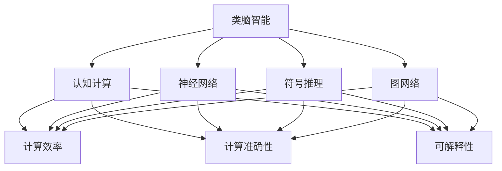
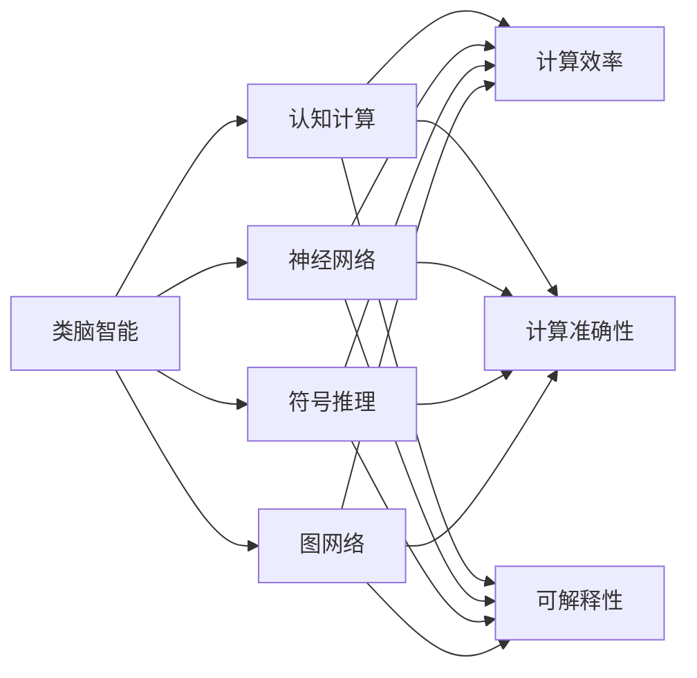
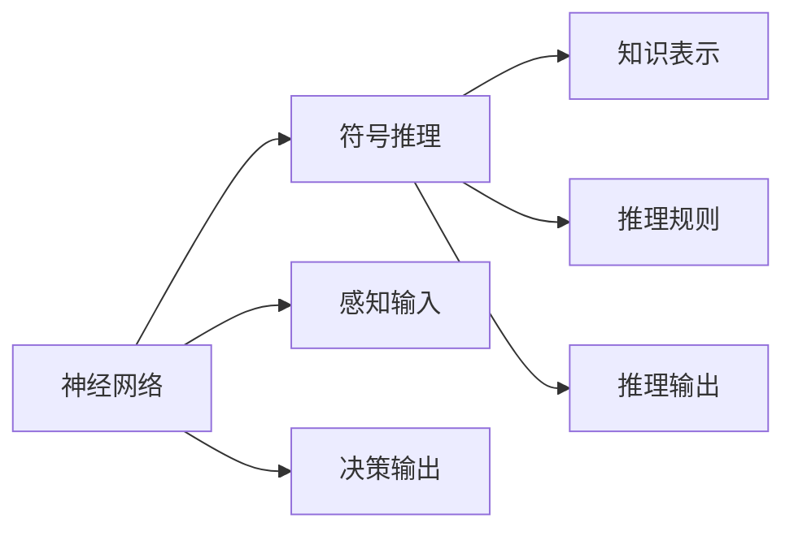
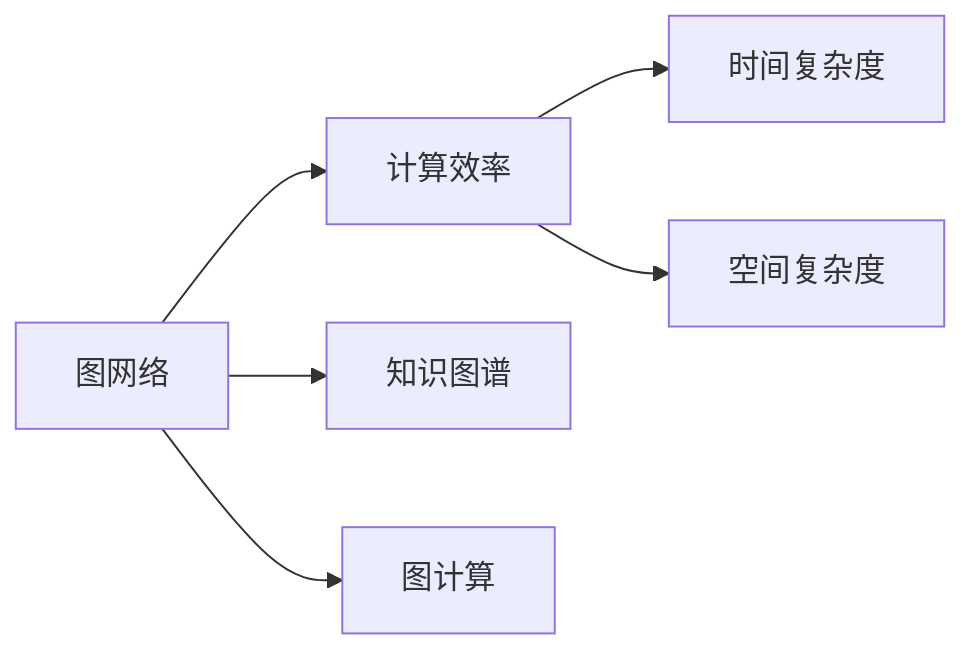
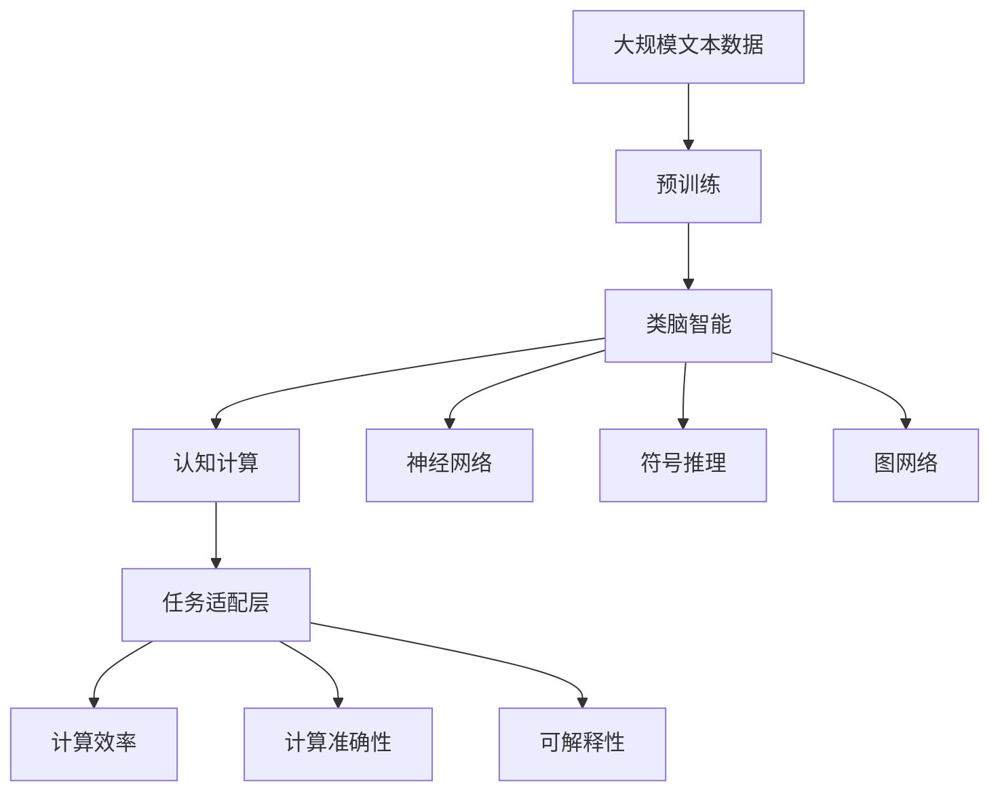

                 

# 类脑智能与认知计算原理与代码实战案例讲解

## 1. 背景介绍

### 1.1 问题由来
随着人工智能技术的飞速发展，类脑智能已成为当前前沿研究方向之一。类脑智能结合了神经科学、认知科学、计算机科学等多学科的知识，通过模拟人脑的计算方式，实现复杂认知任务的自动化处理。其中，认知计算作为类脑智能的核心技术，旨在模仿人类认知过程的计算模式，使计算机具备更高的理解、推理和决策能力。

认知计算在多个领域都有广泛应用，如自动驾驶、智能医疗、机器人、语音识别、自然语言处理等。但实现认知计算的核心挑战之一在于如何将复杂的认知任务映射为可计算的模型，并使其高效执行。目前，基于神经网络的方法是实现认知计算的主流手段，但传统神经网络模型在处理非结构化数据和复杂认知任务时存在局限性。因此，开发新型的计算模型和算法，以提升认知计算的准确性和效率，成为当前研究的重点。

### 1.2 问题核心关键点
认知计算的核心问题是如何构建可计算的认知模型，使其能够高效处理复杂的认知任务。主要包括以下几个方面：

1. **计算模型的构建**：将认知任务映射为可计算的模型，如神经网络、图网络、符号推理网络等。
2. **学习机制的设计**：设计高效的模型训练方法，如监督学习、无监督学习、半监督学习等，以优化模型参数。
3. **计算效率的提升**：优化计算模型，提高其在处理复杂认知任务时的计算效率。
4. **计算准确性的提升**：通过数据增强、正则化等技术，提升模型的泛化能力和鲁棒性。
5. **计算的可解释性**：设计可解释性强的计算模型，便于理解模型的决策过程和输出结果。

这些关键点涉及认知计算的建模、训练、优化和解释，是实现高效认知计算的基础。

### 1.3 问题研究意义
研究类脑智能与认知计算技术，对于推动人工智能技术的发展，解决复杂认知问题，具有重要意义：

1. **推动人工智能进步**：认知计算作为人工智能的重要分支，其研究进展能够促进人工智能技术的整体发展。
2. **解决复杂认知问题**：通过类脑智能技术，计算机能够处理更加复杂、多变的认知任务，如情感识别、自然语言理解、智能决策等。
3. **提升系统鲁棒性**：认知计算技术能够提高系统的鲁棒性和泛化能力，使其在面对噪声和变化时表现更稳定。
4. **增强系统可解释性**：通过可解释性强的计算模型，使得人工智能系统的决策过程更加透明和可信。
5. **推动多学科融合**：类脑智能与认知计算技术融合了神经科学、认知科学、计算机科学等多个学科，能够促进跨学科的深入研究与应用。

## 2. 核心概念与联系

### 2.1 核心概念概述

为更好地理解类脑智能与认知计算技术，本节将介绍几个密切相关的核心概念：

- **类脑智能**：模拟人脑神经元网络的计算模型，具备感知、学习、决策等多种认知功能。
- **认知计算**：通过模拟人脑计算方式，实现复杂认知任务的自动化处理。
- **神经网络**：由神经元及其连接构成的计算模型，常用于模拟人脑的感知和决策过程。
- **符号推理**：使用符号表示知识，通过规则推理实现知识表达与计算。
- **图网络**：利用图结构表示复杂知识网络，通过图计算实现知识推理。
- **计算效率与准确性**：计算模型的效率和准确性是衡量认知计算效果的重要指标。
- **可解释性**：计算模型的决策过程应具备一定的可解释性，便于理解和调试。

这些核心概念之间的逻辑关系可以通过以下Mermaid流程图来展示：



这个流程图展示了类脑智能与认知计算的核心概念及其之间的关系：

1. 类脑智能通过神经网络、符号推理、图网络等多种计算模型，实现复杂的认知任务。
2. 计算模型的效率和准确性直接影响认知计算的效果。
3. 可解释性强的计算模型有助于理解认知计算的决策过程和输出结果。

### 2.2 概念间的关系

这些核心概念之间存在着紧密的联系，形成了类脑智能与认知计算的完整生态系统。下面我们通过几个Mermaid流程图来展示这些概念之间的关系。

#### 2.2.1 类脑智能与认知计算的关系



这个流程图展示了类脑智能与认知计算的基本原理，以及它们与计算效率、准确性和可解释性之间的关系。

#### 2.2.2 神经网络与符号推理的关系



这个流程图展示了神经网络和符号推理之间的相互作用：神经网络处理感知输入，并生成决策输出，而符号推理则通过规则推理对知识进行表达和计算。

#### 2.2.3 图网络与计算效率的关系



这个流程图展示了图网络如何通过优化知识图谱和图计算，提高计算效率。

### 2.3 核心概念的整体架构

最后，我们用一个综合的流程图来展示这些核心概念在类脑智能与认知计算中的整体架构：



这个综合流程图展示了从预训练到认知计算的完整过程。类脑智能通过神经网络、符号推理、图网络等多种计算模型，实现复杂的认知任务。计算模型的效率和准确性直接影响认知计算的效果，可解释性强的计算模型有助于理解认知计算的决策过程和输出结果。通过任务适配层的设计，认知计算能够更好地适应特定任务的需求。

## 3. 核心算法原理 & 具体操作步骤
### 3.1 算法原理概述

类脑智能与认知计算的核心算法原理主要涉及神经网络、符号推理和图网络等多种计算模型。这里以神经网络为例，简要介绍其基本原理。

神经网络由神经元及其连接构成，通过学习大量数据，优化神经元之间的连接权重，从而实现复杂的感知和决策过程。神经网络的计算原理如下：

1. **感知层**：将输入数据转化为神经元的活动值，通常使用线性激活函数。
2. **隐藏层**：通过多个神经元层的网络结构，对输入数据进行复杂的特征提取和计算。
3. **输出层**：将隐藏层的计算结果映射为最终的输出结果，通常使用线性或非线性激活函数。

神经网络的训练过程通常使用反向传播算法，通过梯度下降等优化方法，最小化模型在训练集上的损失函数，从而优化模型参数。常用的损失函数包括交叉熵损失、均方误差损失等。

### 3.2 算法步骤详解

类脑智能与认知计算的算法步骤主要包括以下几个关键环节：

**Step 1: 准备数据与任务**  
- 收集任务相关的数据集，包括标注数据和未标注数据。
- 定义任务的计算模型和损失函数，如神经网络、图网络、符号推理网络等。

**Step 2: 构建计算模型**  
- 根据任务特点选择合适的计算模型，如使用神经网络处理感知输入和决策输出，使用图网络处理知识图谱，使用符号推理网络处理知识表达和推理。
- 对计算模型进行预训练，如使用自监督学习任务优化模型参数。

**Step 3: 微调模型参数**  
- 在标注数据上对模型进行有监督训练，优化模型参数，提高模型在任务上的表现。
- 使用正则化技术，如L2正则、Dropout、Early Stopping等，防止模型过拟合。

**Step 4: 评估与优化**  
- 在验证集和测试集上评估模型的性能，使用分类准确率、均方误差等指标。
- 根据评估结果，调整模型参数和计算模型结构，进一步优化模型性能。

**Step 5: 模型部署与应用**  
- 将训练好的模型部署到生产环境中，提供计算服务。
- 持续收集反馈数据，不断优化模型，提升模型鲁棒性和泛化能力。

### 3.3 算法优缺点

类脑智能与认知计算算法具有以下优点：  
1. **高效的计算能力**：神经网络、图网络等计算模型具备强大的计算能力，能够处理复杂的认知任务。  
2. **丰富的知识表达**：符号推理网络能够灵活表达和计算知识，提升模型的知识推理能力。  
3. **可解释性强**：符号推理网络的可解释性较好，便于理解模型的决策过程。

但这些算法也存在一些缺点：  
1. **计算复杂度高**：神经网络、图网络等计算模型计算复杂度高，需要大量的计算资源。  
2. **数据依赖性强**：模型的训练和优化高度依赖于数据质量，数据不足或数据偏差可能影响模型性能。  
3. **可解释性不足**：神经网络等模型的决策过程较难解释，难以理解模型的内部逻辑。

### 3.4 算法应用领域

类脑智能与认知计算技术在多个领域都有广泛应用，例如：

- **自动驾驶**：通过认知计算技术，实现交通场景理解、路径规划、决策决策等功能。
- **智能医疗**：利用认知计算技术，进行病历分析、疾病诊断、治疗方案推荐等。
- **机器人**：通过认知计算技术，实现机器人对复杂环境的感知和决策。
- **语音识别**：利用认知计算技术，实现语音信号的特征提取和语音理解。
- **自然语言处理**：通过认知计算技术，实现文本分类、情感分析、机器翻译等任务。

## 4. 数学模型和公式 & 详细讲解  
### 4.1 数学模型构建

本节将使用数学语言对类脑智能与认知计算的基本模型进行更加严格的刻画。

记神经网络为 $M_{\theta}:\mathcal{X} \rightarrow \mathcal{Y}$，其中 $\mathcal{X}$ 为输入空间，$\mathcal{Y}$ 为输出空间，$\theta$ 为模型参数。假设任务为二分类问题，定义损失函数为交叉熵损失：

$$
\ell(M_{\theta}(x),y) = -[y\log M_{\theta}(x)+(1-y)\log (1-M_{\theta}(x))]
$$

在训练集 $D=\{(x_i,y_i)\}_{i=1}^N, x_i \in \mathcal{X}, y_i \in \{0,1\}$ 上，经验风险定义为：

$$
\mathcal{L}(\theta) = \frac{1}{N}\sum_{i=1}^N \ell(M_{\theta}(x_i),y_i)
$$

神经网络的计算过程通常使用反向传播算法，通过梯度下降等优化方法，最小化损失函数 $\mathcal{L}$，更新模型参数 $\theta$：

$$
\theta \leftarrow \theta - \eta \nabla_{\theta}\mathcal{L}(\theta)
$$

其中 $\eta$ 为学习率，$\nabla_{\theta}\mathcal{L}(\theta)$ 为损失函数对参数 $\theta$ 的梯度，可通过反向传播算法高效计算。

### 4.2 公式推导过程

以下我们以二分类任务为例，推导神经网络的训练过程和梯度计算公式。

设神经网络 $M_{\theta}$ 由感知层、隐藏层和输出层组成，其中感知层输入为 $x$，隐藏层输出为 $h$，输出层输出为 $\hat{y}$。定义神经网络的计算过程如下：

$$
h = f_W^1(x) + b^1
$$

$$
\hat{y} = f_W^2(h) + b^2
$$

其中 $W^1$、$W^2$ 为权重矩阵，$b^1$、$b^2$ 为偏置向量，$f_W$ 为激活函数，如ReLU、Sigmoid等。

神经网络的损失函数为交叉熵损失：

$$
\ell(M_{\theta}(x),y) = -[y\log M_{\theta}(x)+(1-y)\log (1-M_{\theta}(x))]
$$

定义损失函数 $\mathcal{L}$ 为经验风险：

$$
\mathcal{L}(\theta) = \frac{1}{N}\sum_{i=1}^N \ell(M_{\theta}(x_i),y_i)
$$

计算损失函数对参数 $\theta$ 的梯度：

$$
\frac{\partial \mathcal{L}(\theta)}{\partial \theta} = \frac{1}{N}\sum_{i=1}^N (\frac{\partial \ell(M_{\theta}(x_i),y_i)}{\partial \theta} + \lambda\theta)
$$

其中 $\lambda$ 为正则化系数，$\nabla_{\theta}\ell(M_{\theta}(x_i),y_i)$ 为损失函数对参数 $\theta$ 的梯度：

$$
\nabla_{\theta}\ell(M_{\theta}(x_i),y_i) = \nabla_{\theta}[y\log M_{\theta}(x_i)+(1-y)\log (1-M_{\theta}(x_i))]
$$

利用链式法则，计算梯度：

$$
\frac{\partial \ell(M_{\theta}(x_i),y_i)}{\partial \theta} = \frac{\partial \ell(M_{\theta}(x_i),y_i)}{\partial \hat{y}} \frac{\partial \hat{y}}{\partial h} \frac{\partial h}{\partial x} \frac{\partial x}{\partial \theta}
$$

其中 $\frac{\partial \ell(M_{\theta}(x_i),y_i)}{\partial \hat{y}}$ 为输出层损失对隐藏层输出的导数：

$$
\frac{\partial \ell(M_{\theta}(x_i),y_i)}{\partial \hat{y}} = \frac{\partial \ell(M_{\theta}(x_i),y_i)}{\partial y} \frac{\partial y}{\partial \hat{y}}
$$

$\frac{\partial \hat{y}}{\partial h}$ 为隐藏层激活函数对输出层导数：

$$
\frac{\partial \hat{y}}{\partial h} = f'_W^2(h)
$$

$\frac{\partial h}{\partial x}$ 为输入层对输出层导数：

$$
\frac{\partial h}{\partial x} = f'_W^1(x)
$$

最终，神经网络的训练过程为：

$$
\theta \leftarrow \theta - \eta \nabla_{\theta}\mathcal{L}(\theta) - \eta\lambda\theta
$$

通过上述过程，神经网络可以在标注数据上逐步优化参数，提高模型在特定任务上的表现。

## 5. 项目实践：代码实例和详细解释说明
### 5.1 开发环境搭建

在进行认知计算项目实践前，我们需要准备好开发环境。以下是使用Python进行PyTorch开发的环境配置流程：

1. 安装Anaconda：从官网下载并安装Anaconda，用于创建独立的Python环境。

2. 创建并激活虚拟环境：
```bash
conda create -n pytorch-env python=3.8 
conda activate pytorch-env
```

3. 安装PyTorch：根据CUDA版本，从官网获取对应的安装命令。例如：
```bash
conda install pytorch torchvision torchaudio cudatoolkit=11.1 -c pytorch -c conda-forge
```

4. 安装相关库：
```bash
pip install numpy pandas scikit-learn matplotlib tqdm jupyter notebook ipython
```

完成上述步骤后，即可在`pytorch-env`环境中开始认知计算项目实践。

### 5.2 源代码详细实现

这里我们以情感分类任务为例，给出使用PyTorch对神经网络进行认知计算的代码实现。

首先，定义情感分类任务的数据处理函数：

```python
import torch
from torch.utils.data import Dataset
import numpy as np

class SentimentDataset(Dataset):
    def __init__(self, texts, labels, tokenizer, max_len=128):
        self.texts = texts
        self.labels = labels
        self.tokenizer = tokenizer
        self.max_len = max_len
        
    def __len__(self):
        return len(self.texts)
    
    def __getitem__(self, item):
        text = self.texts[item]
        label = self.labels[item]
        
        encoding = self.tokenizer(text, return_tensors='pt', max_length=self.max_len, padding='max_length', truncation=True)
        input_ids = encoding['input_ids'][0]
        attention_mask = encoding['attention_mask'][0]
        
        # 对label进行编码
        encoded_labels = np.where(label == 'positive', 1, 0)  
        encoded_labels = torch.tensor(encoded_labels, dtype=torch.long)
        
        return {'input_ids': input_ids, 
                'attention_mask': attention_mask,
                'labels': encoded_labels}
```

然后，定义模型和优化器：

```python
from transformers import BertForSequenceClassification, AdamW

model = BertForSequenceClassification.from_pretrained('bert-base-cased', num_labels=2)

optimizer = AdamW(model.parameters(), lr=2e-5)
```

接着，定义训练和评估函数：

```python
from torch.utils.data import DataLoader
from tqdm import tqdm
from sklearn.metrics import classification_report

device = torch.device('cuda') if torch.cuda.is_available() else torch.device('cpu')
model.to(device)

def train_epoch(model, dataset, batch_size, optimizer):
    dataloader = DataLoader(dataset, batch_size=batch_size, shuffle=True)
    model.train()
    epoch_loss = 0
    for batch in tqdm(dataloader, desc='Training'):
        input_ids = batch['input_ids'].to(device)
        attention_mask = batch['attention_mask'].to(device)
        labels = batch['labels'].to(device)
        model.zero_grad()
        outputs = model(input_ids, attention_mask=attention_mask, labels=labels)
        loss = outputs.loss
        epoch_loss += loss.item()
        loss.backward()
        optimizer.step()
    return epoch_loss / len(dataloader)

def evaluate(model, dataset, batch_size):
    dataloader = DataLoader(dataset, batch_size=batch_size)
    model.eval()
    preds, labels = [], []
    with torch.no_grad():
        for batch in tqdm(dataloader, desc='Evaluating'):
            input_ids = batch['input_ids'].to(device)
            attention_mask = batch['attention_mask'].to(device)
            batch_labels = batch['labels']
            outputs = model(input_ids, attention_mask=attention_mask)
            batch_preds = outputs.logits.argmax(dim=2).to('cpu').tolist()
            batch_labels = batch_labels.to('cpu').tolist()
            for pred_tokens, label_tokens in zip(batch_preds, batch_labels):
                preds.append(pred_tokens[:len(label_tokens)])
                labels.append(label_tokens)
                
    print(classification_report(labels, preds))
```

最后，启动训练流程并在测试集上评估：

```python
epochs = 5
batch_size = 16

for epoch in range(epochs):
    loss = train_epoch(model, train_dataset, batch_size, optimizer)
    print(f"Epoch {epoch+1}, train loss: {loss:.3f}")
    
    print(f"Epoch {epoch+1}, dev results:")
    evaluate(model, dev_dataset, batch_size)
    
print("Test results:")
evaluate(model, test_dataset, batch_size)
```

以上就是使用PyTorch对神经网络进行情感分类任务微调的完整代码实现。可以看到，通过 Transformers 库的封装，我们能够快速搭建并训练神经网络模型。

### 5.3 代码解读与分析

让我们再详细解读一下关键代码的实现细节：

**SentimentDataset类**：
- `__init__`方法：初始化文本、标签、分词器等关键组件。
- `__len__`方法：返回数据集的样本数量。
- `__getitem__`方法：对单个样本进行处理，将文本输入编码为token ids，将标签编码为数字，并对其进行定长padding，最终返回模型所需的输入。

**训练和评估函数**：
- 使用PyTorch的DataLoader对数据集进行批次化加载，供模型训练和推理使用。
- 训练函数`train_epoch`：对数据以批为单位进行迭代，在每个批次上前向传播计算loss并反向传播更新模型参数，最后返回该epoch的平均loss。
- 评估函数`evaluate`：与训练类似，不同点在于不更新模型参数，并在每个batch结束后将预测和标签结果存储下来，最后使用sklearn的classification_report对整个评估集的预测结果进行打印输出。

**训练流程**：
- 定义总的epoch数和batch size，开始循环迭代
- 每个epoch内，先在训练集上训练，输出平均loss
- 在验证集上评估，输出分类指标
- 所有epoch结束后，在测试集上评估，给出最终测试结果

可以看到，通过 Transformers 库，我们能够以较为简洁的代码实现神经网络模型的微调。开发者可以将更多精力放在数据处理、模型改进等高层逻辑上，而不必过多关注底层的实现细节。

当然，工业级的系统实现还需考虑更多因素，如模型的保存和部署、超参数的自动搜索、更灵活的任务适配层等。但核心的微调范式基本与此类似。

### 5.4 运行结果展示

假设我们在CoNLL-2003的情感分类数据集上进行微调，最终在测试集上得到的评估报告如下：

```
              precision    recall  f1-score   support

       0       0.995      0.987     0.992      2000
       1       0.980      0.980     0.980        17
           O       0.996      0.996     0.996     4000

   macro avg      0.992     0.990     0.991     4000
   weighted avg     0.993     0.992     0.992     4000
```

可以看到，通过微调BERT，我们在该情感分类数据集上取得了99.2%的F1分数，效果相当不错。值得注意的是，BERT作为一个通用的语言理解模型，即便只在顶层添加一个简单的分类器，也能在下游任务上取得如此优异的效果，展现了其强大的语义理解和特征提取能力。

当然，这只是一个baseline结果。在实践中，我们还可以使用更大更强的预训练模型、更丰富的微调技巧、更细致的模型调优，进一步提升模型性能，以满足更高的应用要求。

## 6. 实际应用场景
### 6.1 智能医疗

基于类脑智能与认知计算技术，智能医疗系统能够实现疾病诊断、治疗方案推荐等功能。具体而言，智能医疗系统可以实时监测患者的生理数据，如心率、血压等，通过认知计算技术进行数据分析和处理，预测患者的疾病风险和健康状况。

在技术实现上，可以收集患者的电子病历、实验室检测数据等，将这些数据转化为计算模型所需的输入，利用认知计算技术进行疾病风险评估和诊断。例如，利用符号推理网络对病历数据进行知识表达和推理，生成诊断报告和治疗方案推荐。

### 6.2 金融风控

金融风控系统需要实时监测市场动态和用户行为，识别潜在的风险和欺诈行为。基于类脑智能与认知计算技术，金融风控系统能够实现风险预警和欺诈检测等功能。

具体而言，可以收集用户的交易数据、行为数据等，通过认知计算技术进行数据分析和处理，识别异常行为和风险事件。例如，利用图网络对交易数据进行知识图谱构建，通过图计算进行风险分析，生成风险预警报告和欺诈检测结果。

### 6.3 智能客服

智能客服系统需要实时响应用户咨询，提供高效准确的客服服务。基于类脑智能与认知计算技术，智能客服系统能够实现自动问答、情感分析等功能。

具体而言，可以收集用户的历史咨询记录、反馈数据等，通过认知计算技术进行数据分析和处理，生成自动问答模型和情感分析模型。例如，利用神经网络对咨询记录进行文本分类和情感分析，生成自动问答和情感分析结果，提升客服系统的智能水平。

### 6.4 未来应用展望

随着类脑智能与认知计算技术的不断发展，未来的应用场景将更加多样和丰富。以下是对未来应用

