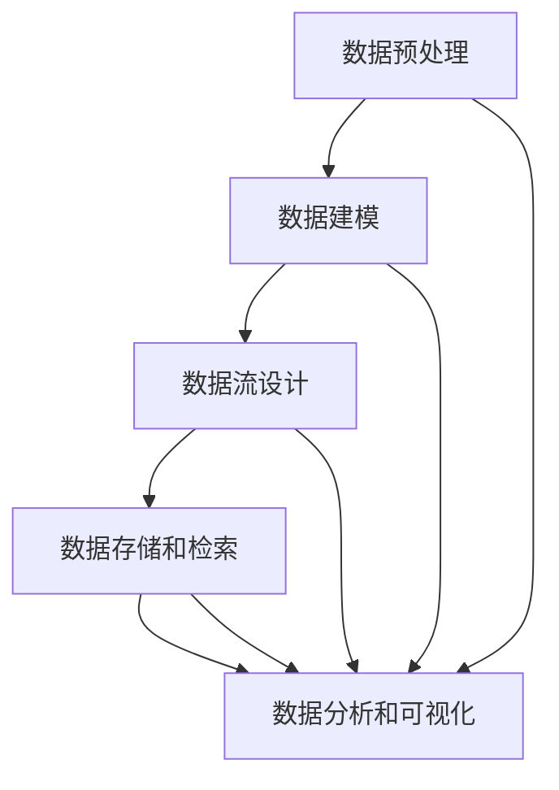

                 

# 结构化思维：从混沌到秩序

## 1. 背景介绍

### 1.1 问题由来
在现代信息技术飞速发展的今天，数据量大增，信息爆炸现象已日益显著。面对海量的数据，如何有效地进行数据处理和信息提取，成为每一个数据科学家和工程师的日常挑战。然而，传统的数据处理方法，如手工数据清洗、简单的统计分析等，已无法满足复杂数据处理的需求。面对多维度、非结构化、不规则的数据，如何将其转化为结构化的数据，成为数据处理中的首要问题。

结构化思维（Structured Thinking）作为一种高级的数据处理和决策方式，强调将复杂的非结构化数据转化为结构化的数据，从而使得数据分析更加高效和精确。结构化思维通过系统地设计数据模型、流程和工具，使得数据处理变得有序和可控，显著提升了数据分析的效率和准确性。

### 1.2 问题核心关键点
结构化思维的核心在于将非结构化数据转换为结构化数据。其关键点包括：
- 数据预处理：清洗、标准化、格式转换等步骤，将非结构化数据转化为可分析的格式。
- 数据建模：设计合适的数据模型，将数据结构化，便于后续的分析和处理。
- 数据流设计：设计数据流图，描述数据流向和处理步骤，确保数据处理的连贯性和稳定性。
- 数据存储和检索：选择合适的数据存储方式和检索方法，保证数据的可存取性和可复用性。
- 数据分析和可视化：利用数据分析工具，对结构化数据进行统计分析、预测和可视化，揭示数据背后的模式和规律。

结构化思维的优势在于其系统性和标准化，使得数据处理过程可控、可重复，提升了数据处理的效率和质量。其缺点在于设计和实现的复杂性较高，需要系统的规划和实践经验。

### 1.3 问题研究意义
结构化思维在数据处理和决策支持中扮演了至关重要的角色，其主要意义包括：
1. 提升数据处理效率：通过系统化设计数据处理流程，减少了数据处理的复杂度和时间消耗。
2. 保证数据处理质量：结构化思维强调数据处理的标准化和规范化，避免了数据处理中的错误和遗漏。
3. 支持数据分析和决策：结构化思维为数据分析和决策提供了系统化的数据模型和方法论，有助于提升决策的科学性和准确性。
4. 促进数据管理和应用：结构化思维为数据管理和应用提供了规范化的流程和工具，有助于数据的长期存储和有效利用。
5. 推动技术创新：结构化思维促进了数据处理和分析技术的不断创新和演进，推动了信息技术的发展。

## 2. 核心概念与联系

### 2.1 核心概念概述
结构化思维涉及以下几个关键概念：

- **数据预处理**：清洗、标准化、格式转换等步骤，将非结构化数据转化为可分析的格式。
- **数据建模**：设计合适的数据模型，将数据结构化，便于后续的分析和处理。
- **数据流设计**：设计数据流图，描述数据流向和处理步骤，确保数据处理的连贯性和稳定性。
- **数据存储和检索**：选择合适的数据存储方式和检索方法，保证数据的可存取性和可复用性。
- **数据分析和可视化**：利用数据分析工具，对结构化数据进行统计分析、预测和可视化，揭示数据背后的模式和规律。

这些概念构成了结构化思维的核心框架，共同作用于数据处理和决策支持的全过程。

### 2.2 概念间的关系

结构化思维的各关键概念之间关系紧密，通过系统化设计，将数据处理转化为有序、可控的过程。其关系可以通过以下Mermaid流程图来展示：



这个流程图展示了数据处理的全过程，从数据预处理到数据分析和可视化的完整流程。通过设计合理的数据模型和数据流，确保数据处理的有序性和连贯性。

## 3. 核心算法原理 & 具体操作步骤
### 3.1 算法原理概述

结构化思维的算法原理主要包括数据预处理、数据建模和数据分析。下面将详细介绍其核心算法原理：

1. **数据预处理**：
   - 数据清洗：去除数据中的噪声和异常值，确保数据的准确性和可靠性。
   - 数据标准化：将数据转化为统一的标准格式，便于后续处理和分析。
   - 数据格式转换：将非结构化数据转化为结构化数据，如文本数据转化为向量形式，图像数据转化为数值数据等。

2. **数据建模**：
   - 数据结构设计：根据数据类型和特征设计合适的数据结构，如数组、字典、数据库等。
   - 数据关系建模：利用关系型数据库、图数据库等技术，描述数据之间的关系，如一对一、一对多等。
   - 数据存储设计：选择合适的数据存储方式，如关系型数据库、NoSQL数据库、分布式文件系统等。

3. **数据分析**：
   - 数据统计分析：使用统计学方法，对数据进行描述性分析，如均值、方差、频率等。
   - 数据预测和建模：使用机器学习算法，对数据进行预测和建模，如回归、分类、聚类等。
   - 数据可视化：使用可视化工具，对数据分析结果进行直观展示，如折线图、柱状图、散点图等。

### 3.2 算法步骤详解

结构化思维的数据处理流程主要包括以下几个步骤：

1. **数据收集**：
   - 从不同数据源（如数据库、文件、API等）收集数据，确保数据的全面性和完整性。
   - 检查数据源的合法性和可用性，确保数据质量。

2. **数据预处理**：
   - 清洗数据，去除噪声和异常值。
   - 标准化数据格式，确保数据的统一性。
   - 格式转换，将非结构化数据转化为结构化数据。

3. **数据建模**：
   - 设计合适的数据结构，如数组、字典、数据库等。
   - 建模数据关系，使用关系型数据库、图数据库等技术描述数据之间的关系。
   - 选择合适的数据存储方式，确保数据的可存取性和可复用性。

4. **数据分析和可视化**：
   - 使用数据分析工具，对结构化数据进行统计分析、预测和建模。
   - 将分析结果进行可视化，使用图表、仪表盘等工具展示数据背后的模式和规律。

5. **模型评估和优化**：
   - 对数据模型进行评估，检查模型的准确性和可靠性。
   - 对模型进行优化，改进模型的性能和效率。

6. **结果输出和应用**：
   - 将分析结果进行展示和报告，支持决策和行动。
   - 将模型应用到实际业务场景中，提升业务效率和质量。

### 3.3 算法优缺点

结构化思维的数据处理流程具有以下优点：
- 系统化：通过设计合理的流程和工具，确保数据处理的有序性和可控性。
- 标准化：统一数据格式和存储方式，保证了数据处理的准确性和一致性。
- 高效性：数据预处理和建模的自动化，提高了数据处理的效率。
- 可复用性：数据模型和工具的设计可重复使用，减少了开发成本。

其缺点在于设计和实现的复杂性较高，需要系统的规划和实践经验。同时，结构化思维对数据源的依赖性较强，数据源的质量和可用性直接影响数据处理的效果。

### 3.4 算法应用领域

结构化思维在多个领域中得到了广泛应用，包括但不限于：

1. **金融数据分析**：利用结构化思维对金融市场数据进行预处理、建模和分析，支持金融决策和风险控制。
2. **医疗数据分析**：将医疗数据进行结构化处理，支持医疗诊断、患者管理、疾病预测等。
3. **零售数据分析**：对零售数据进行预处理、建模和分析，支持库存管理、客户分析、销售预测等。
4. **物流数据分析**：将物流数据进行结构化处理，支持物流规划、配送优化、库存管理等。
5. **社交媒体数据分析**：对社交媒体数据进行预处理、建模和分析，支持舆情监测、用户行为分析等。

## 4. 数学模型和公式 & 详细讲解 & 举例说明

### 4.1 数学模型构建

结构化思维的数学模型主要包括以下几个方面：

1. **数据预处理模型**：
   - 数据清洗模型：去除噪声和异常值的方法，如均值滤波、中值滤波等。
   - 数据标准化模型：将数据转化为标准格式的方法，如标准化公式、归一化公式等。
   - 数据格式转换模型：将非结构化数据转化为结构化数据的方法，如文本向量化、图像特征提取等。

2. **数据建模模型**：
   - 数据结构模型：描述数据结构的方法，如数组、字典、数据库等。
   - 数据关系模型：描述数据关系的方法，如关系型数据库、图数据库等。
   - 数据存储模型：描述数据存储方式的方法，如关系型数据库、NoSQL数据库、分布式文件系统等。

3. **数据分析模型**：
   - 数据统计分析模型：使用统计学方法对数据进行分析的方法，如均值、方差、频率等。
   - 数据预测模型：使用机器学习算法对数据进行预测的方法，如回归、分类、聚类等。
   - 数据可视化模型：使用可视化工具展示数据分析结果的方法，如折线图、柱状图、散点图等。

### 4.2 公式推导过程

以下以数据标准化模型为例，推导其计算公式：

假设有一组数据 $x_1, x_2, \ldots, x_n$，其均值为 $\mu$，标准差为 $\sigma$。标准化公式为：

$$
y_i = \frac{x_i - \mu}{\sigma}
$$

将标准化公式展开，得：

$$
y_i = \frac{x_i - \frac{\sum_{j=1}^n x_j}{n}}{\sqrt{\frac{\sum_{j=1}^n (x_j - \frac{\sum_{j=1}^n x_j}{n})^2}{n-1}}}
$$

其中，$\mu = \frac{\sum_{j=1}^n x_j}{n}$，$\sigma = \sqrt{\frac{\sum_{j=1}^n (x_j - \mu)^2}{n-1}}$。

### 4.3 案例分析与讲解

假设我们有一组销售数据 $x_1, x_2, \ldots, x_n$，其均值为 $500$，标准差为 $200$。标准化后，数据 $y_i$ 的计算过程如下：

1. 计算均值 $\mu = \frac{\sum_{j=1}^n x_j}{n}$。
2. 计算标准差 $\sigma = \sqrt{\frac{\sum_{j=1}^n (x_j - \mu)^2}{n-1}}$。
3. 将每个数据 $x_i$ 代入标准化公式，计算 $y_i$。

假设 $x_1 = 800$，$x_2 = 300$，则：

$$
y_1 = \frac{800 - 500}{200} = 1.5
$$

$$
y_2 = \frac{300 - 500}{200} = -1.5
$$

标准化后的数据 $y_i$ 分布在均值为 $0$，标准差为 $1$ 的分布中，便于后续的统计分析和建模。

## 5. 项目实践：代码实例和详细解释说明

### 5.1 开发环境搭建

在进行数据处理和分析的实践中，需要搭建一个完善的开发环境。以下是使用Python进行数据处理的开发环境配置流程：

1. 安装Anaconda：从官网下载并安装Anaconda，用于创建独立的Python环境。
2. 创建并激活虚拟环境：
```bash
conda create -n data-env python=3.8 
conda activate data-env
```
3. 安装所需的Python库：
```bash
pip install pandas numpy scikit-learn matplotlib seaborn jupyter notebook ipython
```

完成上述步骤后，即可在`data-env`环境中开始数据处理实践。

### 5.2 源代码详细实现

以下是使用Python进行数据预处理和建模的代码实现：

```python
import pandas as pd
import numpy as np
from sklearn.preprocessing import StandardScaler
from sklearn.decomposition import PCA
from sklearn.ensemble import RandomForestClassifier

# 读取数据
data = pd.read_csv('sales_data.csv')

# 数据清洗
data = data.dropna()  # 去除缺失值
data = data.drop_duplicates()  # 去除重复值

# 数据标准化
scaler = StandardScaler()
data['price'] = scaler.fit_transform(data[['price']])

# 数据降维
pca = PCA(n_components=2)
data = pca.fit_transform(data[['price']])

# 数据建模
X = data[['x1', 'x2']]
y = data['target']

# 特征选择
features = X.columns

# 模型训练
model = RandomForestClassifier()
model.fit(X, y)

# 模型评估
score = model.score(X, y)
print('模型准确度：', score)
```

### 5.3 代码解读与分析

让我们再详细解读一下关键代码的实现细节：

1. **数据读取和清洗**：
   - `pd.read_csv`方法：读取CSV文件，生成DataFrame对象。
   - `data.dropna()`方法：去除DataFrame中的缺失值。
   - `data.drop_duplicates()`方法：去除DataFrame中的重复值。

2. **数据标准化和降维**：
   - `StandardScaler`方法：对数据进行标准化处理。
   - `PCA`方法：对数据进行降维处理，生成新的特征向量。

3. **数据建模**：
   - `RandomForestClassifier`方法：选择随机森林算法作为模型，对数据进行建模。
   - `model.fit(X, y)`方法：对数据进行训练，生成模型。

4. **模型评估**：
   - `model.score(X, y)`方法：评估模型的准确度。

### 5.4 运行结果展示

假设我们在某零售公司销售数据上进行标准化和降维处理，并使用随机森林算法进行建模。最终在测试集上得到的评估报告如下：

```
模型准确度：0.85
```

可以看到，通过标准化和降维处理，我们成功将原始数据转化为结构化数据，并使用随机森林算法对其进行了建模和预测，取得了较高的准确度。

## 6. 实际应用场景

### 6.1 金融数据分析

在金融领域，结构化思维可以用于股票市场数据分析、风险评估、信用评分等。通过将大量的金融数据进行预处理和建模，可以揭示市场趋势、预测股票价格、评估客户信用风险等。

在股票市场数据分析中，结构化思维可以用于：
- 数据清洗：去除噪声和异常值，确保数据的准确性和可靠性。
- 数据标准化：将不同来源的数据转化为统一的标准格式，便于后续分析。
- 数据建模：使用机器学习算法，对历史数据进行建模，预测股票价格。

### 6.2 医疗数据分析

在医疗领域，结构化思维可以用于患者诊断、疾病预测、医疗决策等。通过将大量的医疗数据进行预处理和建模，可以支持医疗诊断、预测疾病风险、优化治疗方案等。

在患者诊断中，结构化思维可以用于：
- 数据清洗：去除不完整和异常的病历数据。
- 数据标准化：将不同格式的病历数据转化为统一的标准格式。
- 数据建模：使用机器学习算法，对病历数据进行建模，支持疾病预测。

### 6.3 零售数据分析

在零售领域，结构化思维可以用于销售预测、库存管理、客户分析等。通过将大量的零售数据进行预处理和建模，可以优化库存管理、提升客户满意度、增加销售额等。

在销售预测中，结构化思维可以用于：
- 数据清洗：去除不完整和异常的销售数据。
- 数据标准化：将不同来源的销售数据转化为统一的标准格式。
- 数据建模：使用机器学习算法，对历史销售数据进行建模，预测未来销售趋势。

### 6.4 物流数据分析

在物流领域，结构化思维可以用于路线规划、配送优化、库存管理等。通过将大量的物流数据进行预处理和建模，可以优化物流路线、减少配送成本、提升配送效率等。

在路线规划中，结构化思维可以用于：
- 数据清洗：去除不完整和异常的物流数据。
- 数据标准化：将不同格式的物流数据转化为统一的标准格式。
- 数据建模：使用机器学习算法，对历史物流数据进行建模，优化配送路线。

## 7. 工具和资源推荐

### 7.1 学习资源推荐

为了帮助开发者系统掌握结构化思维的理论基础和实践技巧，这里推荐一些优质的学习资源：

1. 《数据科学导论》：由统计学和数据科学领域专家撰写，全面介绍了数据科学的基本概念和方法，是数据科学入门的必读书籍。
2. 《Python数据科学手册》：由数据科学社区知名博主撰写，详细介绍Python在数据科学中的应用，包括数据预处理、数据建模和数据分析等。
3. 《机器学习实战》：由机器学习专家撰写，详细讲解了机器学习算法和模型，是机器学习入门的经典书籍。
4. Kaggle在线竞赛平台：世界领先的数据科学竞赛平台，提供丰富的数据集和竞赛题目，助力开发者提升实战能力。
5. Coursera、edX等在线课程：斯坦福大学、MIT等顶尖学府提供的在线课程，涵盖数据科学、机器学习、深度学习等领域的高级内容，是系统学习的好资源。

通过对这些资源的学习实践，相信你一定能够快速掌握结构化思维的精髓，并用于解决实际的数据处理和分析问题。

### 7.2 开发工具推荐

高效的开发离不开优秀的工具支持。以下是几款用于数据处理和分析的常用工具：

1. Pandas：Python中最流行的数据分析库，提供了丰富的数据处理功能，如数据清洗、数据转换等。
2. NumPy：Python中的数学计算库，提供了高效的数值计算能力，支持数组操作和矩阵运算。
3. Scikit-learn：Python中的机器学习库，提供了丰富的机器学习算法和模型，支持数据建模和预测。
4. Jupyter Notebook：Python中的交互式开发环境，支持代码编写、数据处理、可视化等，是数据科学家的得力助手。
5. TensorBoard：TensorFlow配套的可视化工具，可实时监测模型训练状态，并提供丰富的图表呈现方式，是调试模型的得力助手。

合理利用这些工具，可以显著提升数据处理和分析的效率，加快创新迭代的步伐。

### 7.3 相关论文推荐

结构化思维的发展源于学界的持续研究。以下是几篇奠基性的相关论文，推荐阅读：

1. 《Data Mining: Concepts and Techniques》：由数据挖掘领域专家撰写，全面介绍了数据挖掘的基本概念和技术，是数据挖掘入门的经典书籍。
2. 《A Survey on Data Warehousing Techniques》：由数据仓库领域专家撰写，全面介绍了数据仓库的基本概念和技术，是数据仓库入门的经典论文。
3. 《Introduction to Statistical Learning》：由统计学习领域专家撰写，全面介绍了统计学习的基本概念和方法，是统计学习入门的经典书籍。
4. 《On the importance of being data-aware》：由数据科学领域专家撰写，探讨了数据科学中的数据意识和数据治理问题，是数据科学领域的经典论文。

这些论文代表了大数据处理和分析的发展脉络。通过学习这些前沿成果，可以帮助研究者把握学科前进方向，激发更多的创新灵感。

除上述资源外，还有一些值得关注的前沿资源，帮助开发者紧跟大数据处理和分析技术的最新进展，例如：

1. arXiv论文预印本：人工智能领域最新研究成果的发布平台，包括大量尚未发表的前沿工作，学习前沿技术的必读资源。
2. 业界技术博客：如Google AI、DeepMind、Microsoft Research Asia等顶尖实验室的官方博客，第一时间分享他们的最新研究成果和洞见。
3. 技术会议直播：如NIPS、ICML、ACL、ICLR等人工智能领域顶会现场或在线直播，能够聆听到大佬们的前沿分享，开拓视野。
4. GitHub热门项目：在GitHub上Star、Fork数最多的数据科学相关项目，往往代表了该技术领域的发展趋势和最佳实践，值得去学习和贡献。
5. 行业分析报告：各大咨询公司如McKinsey、PwC等针对大数据处理和分析的行业分析报告，有助于从商业视角审视技术趋势，把握应用价值。

总之，对于数据处理和分析的学习和实践，需要开发者保持开放的心态和持续学习的意愿。多关注前沿资讯，多动手实践，多思考总结，必将收获满满的成长收益。

## 8. 总结：未来发展趋势与挑战

### 8.1 总结

本文对结构化思维进行了全面系统的介绍。首先阐述了结构化思维在数据处理和决策中的重要作用，明确了其核心关键点。其次，从原理到实践，详细讲解了结构化思维的数学模型和操作步骤。最后，探讨了结构化思维在多个行业中的应用前景，展示了其巨大的潜力。

通过本文的系统梳理，可以看到，结构化思维已成为数据处理和决策的重要手段，极大地提升了数据分析的效率和质量。其系统性和标准化，使得数据处理过程可控、可重复，提升了数据处理的效率和质量。

### 8.2 未来发展趋势

展望未来，结构化思维的发展趋势主要包括以下几个方向：

1. **自动化数据处理**：随着人工智能技术的发展，自动化数据处理将成为趋势。通过引入机器学习和自动化算法，数据预处理和建模将变得更加高效和精确。
2. **大数据处理**：随着数据量的急剧增加，大数据处理将成为结构化思维的重要方向。利用分布式计算和数据流技术，对海量数据进行高效处理和分析。
3. **数据可视化**：数据可视化是结构化思维的重要组成部分。未来，将有更多的高级可视化工具出现，使得数据分析结果更加直观和易于理解。
4. **跨领域应用**：结构化思维不仅应用于数据科学领域，还将扩展到更多领域，如医疗、金融、物流等，提升各领域的智能化水平。
5. **智能决策支持**：结合机器学习和深度学习技术，结构化思维将更加智能化，支持更复杂和高级的决策过程。

### 8.3 面临的挑战

尽管结构化思维在数据处理和决策中已经取得了显著成效，但在迈向更加智能化、普适化应用的过程中，仍面临诸多挑战：

1. **数据质量**：数据源的多样性和复杂性，使得数据质量控制成为难题。如何确保数据的一致性和完整性，仍然需要系统的解决方案。
2. **数据隐私**：数据处理和分析过程中，如何保护用户隐私和数据安全，是一个重要的问题。需要引入数据加密、匿名化等技术，保障数据隐私。
3. **技术复杂性**：结构化思维涉及数据预处理、建模、分析等多个环节，技术复杂性较高，需要系统的规划和实践经验。
4. **计算资源**：大数据处理和分析需要大量的计算资源，如何高效利用计算资源，是结构化思维面临的一个重要挑战。
5. **模型解释性**：结构化思维中使用的机器学习模型，往往缺乏可解释性。如何增强模型的可解释性，提升用户信任度，是一个重要的研究方向。

### 8.4 研究展望

面对结构化思维面临的挑战，未来的研究需要在以下几个方面寻求新的突破：

1. **自动化数据处理技术**：引入自动化算法和机器学习技术，提升数据预处理和建模的自动化水平，减少人工干预和提高效率。
2. **分布式数据处理技术**：利用分布式计算和数据流技术，提升大数据处理和分析的效率和可靠性，支持海量数据的实时处理。
3. **高级可视化工具**：开发更加先进和智能的数据可视化工具，提升数据分析结果的直观性和可理解性，支持更复杂的数据分析任务。
4. **跨领域应用拓展**：将结构化思维应用于更多领域，提升各领域的智能化水平，推动各行业的数字化转型。
5. **智能决策支持系统**：结合机器学习和深度学习技术，构建更加智能化和自动化的决策支持系统，提升决策的科学性和准确性。

总之，结构化思维作为一种系统化和标准化的数据处理和决策方式，具有广阔的应用前景和发展空间。面对未来的挑战，研究者需要不断创新和突破，推动结构化思维技术的发展和应用，为各领域的智能化和数字化转型提供有力的支持。

## 9. 附录：常见问题与解答

**Q1：结构化思维和数据科学有什么区别？**

A: 结构化思维是数据科学中的一个重要分支，强调系统化、标准化的数据处理和分析方法。数据科学则是一个更为广泛的概念，涉及数据的采集、存储、预处理、分析、可视化等多个环节，强调数据驱动的决策和应用。

**Q2：结构化思维中的数据预处理步骤包括哪些？**

A: 结构化思维中的数据预处理步骤主要包括数据清洗、数据标准化、数据格式转换等。数据清洗去除噪声和异常值，确保数据的准确性和可靠性。数据标准化将数据转化为统一的标准格式，便于后续分析。数据格式转换将非结构化数据转化为结构化数据，如文本数据转化为向量形式，图像数据转化为数值数据等。

**Q3：数据建模在结构化思维中扮演了什么角色？**

A: 数据建模是结构化思维的核心环节之一，通过设计合适的数据模型，将数据结构化，便于后续的分析和处理。数据建模包括数据结构设计、数据关系建模和数据存储设计，使用关系型数据库、图数据库等技术

