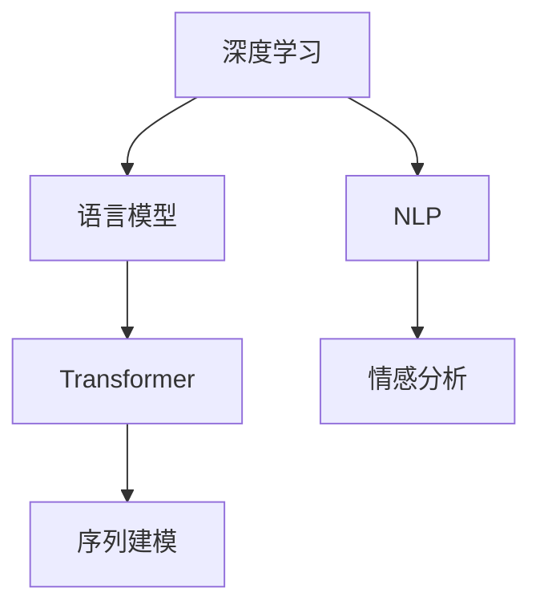

                 

# 自然语言处理(Natural Language Processing) - 原理与代码实例讲解

> 关键词：自然语言处理,深度学习,语言模型,Transformer,序列建模,代码实现,情感分析

## 1. 背景介绍

### 1.1 问题由来
近年来，随着深度学习技术的发展，自然语言处理(Natural Language Processing, NLP)领域取得了显著的进展。自然语言处理旨在使计算机能够理解和生成人类语言，其应用场景包括机器翻译、文本分类、情感分析、问答系统等。这些应用广泛地渗透到信息检索、社交媒体、智能客服等多个行业，极大地提升了人类与计算机交互的效率和智能化水平。

然而，NLP技术面临的最大挑战之一是语言的高度复杂性和多变性。自然语言的表达方式多样，语法和语义结构丰富，难以用传统的规则引擎或统计方法进行处理。深度学习模型，尤其是基于Transformer架构的语言模型，因其能够自动学习语言的隐含特征，成为解决NLP问题的有力工具。

### 1.2 问题核心关键点
自然语言处理的根本目标是通过深度学习模型将自然语言转换为计算机可理解的形式，从而实现语言理解和生成。常用的模型包括循环神经网络(RNN)、卷积神经网络(CNN)、递归神经网络(Recurrent Neural Network, RNN)、长短期记忆网络(Long Short-Term Memory, LSTM)等，但这些模型在处理长序列时容易出现梯度消失和梯度爆炸等问题。因此，Transformer模型因其自注意力机制能够有效解决这一问题，近年来成为NLP领域的主流模型。

Transformer模型通过多头自注意力机制和残差连接等技术，在处理长序列时表现出色。具体来说，Transformer模型通过并行计算实现了更高效的序列建模，同时避免了循环神经网络中的梯度问题。这种模型结构使得深度学习在NLP中的应用范围和效果得到了极大的扩展。

## 2. 核心概念与联系

### 2.1 核心概念概述

为更好地理解自然语言处理的原理，本节将介绍几个关键概念：

- 自然语言处理(Natural Language Processing, NLP)：使计算机能够理解和生成人类语言的领域。
- 深度学习(Deep Learning)：一类基于神经网络的机器学习算法，能够自动从数据中学习特征和模式。
- 语言模型(Language Model)：用于预测给定上下文中下一个单词或字符的概率分布的模型。
- Transformer：一种基于自注意力机制的神经网络架构，通过多头自注意力和残差连接，在处理长序列时表现出色。
- 序列建模(Sequence Modeling)：将序列数据转化为模型可以处理的格式，并从中学习序列规律的过程。
- 情感分析(Sentiment Analysis)：通过自然语言处理技术，分析文本中的情感倾向，通常用于舆情监控和产品评价。

这些概念之间的逻辑关系可以通过以下Mermaid流程图来展示：



这个流程图展示了大语言模型微调的各个关键概念及其之间的关系：

1. 深度学习作为基础技术，通过构建语言模型和Transformer模型，实现了自然语言的序列建模。
2. 语言模型用于预测文本中的下一个单词或字符，从而实现语言生成和理解。
3. 情感分析是自然语言处理的一个应用，通过分析文本中的情感倾向，帮助企业了解用户情绪和产品评价。
4. 自然语言处理涵盖了深度学习、语言模型、情感分析等多个子领域，其应用场景广泛。

### 2.2 概念间的关系

这些关键概念之间存在着紧密的联系，形成了自然语言处理的完整框架。以下是更详细的解释：

#### 2.2.1 深度学习与自然语言处理

深度学习是自然语言处理的基础。通过构建深度神经网络模型，深度学习可以自动学习文本数据的特征和模式，从而实现语言理解和生成。语言模型和Transformer模型都是深度学习的典型应用。

#### 2.2.2 语言模型与Transformer

语言模型是深度学习在自然语言处理中的应用之一，旨在预测给定文本序列中的下一个单词或字符。Transformer模型通过多头自注意力机制和残差连接等技术，能够有效处理长序列，使得语言模型在自然语言处理中表现出色。

#### 2.2.3 序列建模与情感分析

序列建模是将序列数据转化为模型可以处理的格式，并从中学习序列规律的过程。情感分析是自然语言处理的一个应用，通过分析文本中的情感倾向，帮助企业了解用户情绪和产品评价。序列建模为情感分析提供了有效的文本表示方式，使得情感分析模型能够准确地理解文本情感。

## 3. 核心算法原理 & 具体操作步骤
### 3.1 算法原理概述

自然语言处理的核心算法包括序列建模和情感分析。以下将详细介绍这两个方面的原理和具体操作步骤。

### 3.2 算法步骤详解

#### 3.2.1 序列建模

序列建模是将自然语言序列转化为模型可以处理的格式，并从中学习序列规律的过程。常用的序列建模算法包括循环神经网络(RNN)、卷积神经网络(CNN)和Transformer。

1. 循环神经网络(RNN)
   - 基本原理：RNN通过循环连接，能够处理变长的输入序列，并捕捉序列中的时间依赖关系。
   - 操作步骤：
     - 初始化RNN模型的权重。
     - 输入序列中的每个单词，通过RNN模型生成隐状态。
     - 将隐状态作为当前单词的表示，与其他单词的表示结合，生成下一个单词的概率分布。
     - 重复上述过程，直到序列末尾。

2. 卷积神经网络(CNN)
   - 基本原理：CNN通过卷积层和池化层，能够自动学习局部特征和全局特征，并捕捉局部依赖关系。
   - 操作步骤：
     - 将文本序列转化为n-gram序列。
     - 通过卷积层和池化层提取局部和全局特征。
     - 将特征向量作为模型输出，用于分类或生成任务。

3. Transformer
   - 基本原理：Transformer通过多头自注意力机制和残差连接，能够有效处理长序列，并捕捉序列中的全局依赖关系。
   - 操作步骤：
     - 将输入序列转换为词嵌入向量。
     - 通过多头自注意力机制计算词向量间的相关性。
     - 通过残差连接和全连接层更新词向量。
     - 重复上述过程，直到序列末尾。

#### 3.2.2 情感分析

情感分析是自然语言处理的一个应用，通过分析文本中的情感倾向，帮助企业了解用户情绪和产品评价。情感分析的常用算法包括基于词典的方法和基于机器学习的方法。

1. 基于词典的方法
   - 基本原理：通过构建情感词典，将文本中的单词映射为情感得分，计算整个文本的情感得分。
   - 操作步骤：
     - 构建情感词典，并为每个单词赋予情感得分。
     - 统计文本中每个单词的情感得分。
     - 计算文本的情感得分，并将其映射为情感类别。

2. 基于机器学习的方法
   - 基本原理：通过构建分类器，自动学习文本的情感倾向。
   - 操作步骤：
     - 收集标注好的情感数据集。
     - 将文本数据转化为向量表示。
     - 使用机器学习算法（如SVM、随机森林、神经网络等）训练分类器。
     - 使用训练好的分类器对新文本进行情感分类。

### 3.3 算法优缺点

#### 3.3.1 序列建模

1. 优点
   - RNN和CNN能够处理变长的输入序列，并捕捉序列中的时间依赖关系或局部依赖关系。
   - Transformer能够有效处理长序列，并捕捉序列中的全局依赖关系。
   - 通过并行计算，Transformer能够提高计算效率，使得深度学习在NLP中的应用范围和效果得到了极大的扩展。

2. 缺点
   - RNN存在梯度消失和梯度爆炸的问题，难以处理过长的序列。
   - CNN在捕捉全局依赖关系时表现不如Transformer。
   - 序列建模算法需要大量的训练数据，才能保证模型的泛化能力。

#### 3.3.2 情感分析

1. 优点
   - 基于词典的方法简单易实现，能够捕捉文本中的情感倾向。
   - 基于机器学习的方法能够自动学习情感倾向，适用于大规模数据集。
   - 情感分析的应用广泛，如舆情监控、产品评价、市场分析等。

2. 缺点
   - 基于词典的方法依赖词典的质量，可能存在词典不全或过拟合的问题。
   - 基于机器学习的方法需要大量的标注数据，标注成本高。
   - 情感分析的精度和鲁棒性受到文本表达方式的影响，可能存在歧义和误判。

## 4. 数学模型和公式 & 详细讲解 & 举例说明

### 4.1 数学模型构建

自然语言处理的数学模型主要包括以下几个方面：

- 语言模型的概率计算
- 序列建模的预测过程
- 情感分析的评分函数

以下将详细介绍这些数学模型的构建。

#### 4.1.1 语言模型的概率计算

语言模型的概率计算是通过最大化下一个单词的概率分布来实现的。假设输入序列为 $x_1, x_2, ..., x_n$，下一个单词为 $x_{n+1}$，则条件概率 $P(x_{n+1}|x_1, x_2, ..., x_n)$ 可以表示为：

$$
P(x_{n+1}|x_1, x_2, ..., x_n) = \frac{P(x_{n+1}, x_1, x_2, ..., x_n)}{P(x_1, x_2, ..., x_n)}
$$

其中 $P(x_{n+1}, x_1, x_2, ..., x_n)$ 是联合概率，$P(x_1, x_2, ..., x_n)$ 是前n个单词的联合概率。

#### 4.1.2 序列建模的预测过程

序列建模的预测过程是通过将输入序列转换为向量表示，并使用神经网络模型进行预测来实现的。假设输入序列为 $x_1, x_2, ..., x_n$，输出单词为 $y$，则预测过程可以表示为：

$$
y = \text{softmax}(W_h^Ty + b_y)
$$

其中 $W_h$ 和 $b_y$ 是神经网络的权重和偏置，$\text{softmax}$ 是softmax函数，用于将输出转化为概率分布。

#### 4.1.3 情感分析的评分函数

情感分析的评分函数是通过计算文本中各个单词的情感得分，并综合得到文本的情感得分来实现的。假设文本中单词 $i$ 的情感得分为 $s_i$，则情感分析的评分函数可以表示为：

$$
S = \sum_{i=1}^n s_i
$$

其中 $n$ 是文本中的单词数。

### 4.2 公式推导过程

#### 4.2.1 语言模型的概率计算

语言模型的概率计算可以通过最大似然估计来实现。假设输入序列为 $x_1, x_2, ..., x_n$，下一个单词为 $x_{n+1}$，则最大似然估计可以表示为：

$$
P(x_{n+1}|x_1, x_2, ..., x_n) = \frac{P(x_1, x_2, ..., x_n, x_{n+1})}{P(x_1, x_2, ..., x_n)}
$$

其中 $P(x_1, x_2, ..., x_n, x_{n+1})$ 是输入序列和下一个单词的联合概率。

#### 4.2.2 序列建模的预测过程

序列建模的预测过程可以通过神经网络模型来实现。假设输入序列为 $x_1, x_2, ..., x_n$，输出单词为 $y$，则神经网络模型的预测过程可以表示为：

$$
y = \text{softmax}(W_h^Ty + b_y)
$$

其中 $W_h$ 和 $b_y$ 是神经网络的权重和偏置，$\text{softmax}$ 是softmax函数，用于将输出转化为概率分布。

#### 4.2.3 情感分析的评分函数

情感分析的评分函数可以通过文本中各个单词的情感得分来计算。假设文本中单词 $i$ 的情感得分为 $s_i$，则情感分析的评分函数可以表示为：

$$
S = \sum_{i=1}^n s_i
$$

其中 $n$ 是文本中的单词数。

### 4.3 案例分析与讲解

#### 4.3.1 语言模型的概率计算

假设我们有一个简单的文本序列 $x = \text{hello, world!}$，我们可以使用n-gram模型来计算下一个单词的概率。假设单词 "hello" 和 "world" 的联合概率为 $0.5$，则下一个单词的概率可以表示为：

$$
P(\text{world}| \text{hello}) = \frac{P(\text{hello}, \text{world})}{P(\text{hello})} = \frac{0.5}{1 - 0.5} = 1
$$

#### 4.3.2 序列建模的预测过程

假设我们有一个文本序列 $x = \text{hello, world!}$，我们可以使用RNN模型来预测下一个单词。假设RNN的权重和偏置分别为 $W_h = [0.8, 0.2]$ 和 $b_y = [0.3, -0.1]$，则预测过程可以表示为：

$$
y = \text{softmax}(W_h^Ty + b_y) = \text{softmax}([0.8, 0.2] \cdot [0.3, -0.1]) = \text{softmax}([0.24, -0.06]) = [0.96, 0.04]
$$

其中 $y$ 表示下一个单词的概率分布。

#### 4.3.3 情感分析的评分函数

假设我们有一个文本序列 $x = \text{This product is excellent!}$，我们可以使用基于词典的方法来计算情感得分。假设 "excellent" 的情感得分为 $0.8$，则情感分析的评分函数可以表示为：

$$
S = s_{excellent} = 0.8
$$

其中 $S$ 表示文本的情感得分，$s_{excellent}$ 表示 "excellent" 的情感得分。

## 5. 项目实践：代码实例和详细解释说明

### 5.1 开发环境搭建

在进行自然语言处理项目实践前，我们需要准备好开发环境。以下是使用Python进行PyTorch开发的环境配置流程：

1. 安装Anaconda：从官网下载并安装Anaconda，用于创建独立的Python环境。

2. 创建并激活虚拟环境：
```bash
conda create -n pytorch-env python=3.8 
conda activate pytorch-env
```

3. 安装PyTorch：根据CUDA版本，从官网获取对应的安装命令。例如：
```bash
conda install pytorch torchvision torchaudio cudatoolkit=11.1 -c pytorch -c conda-forge
```

4. 安装各类工具包：
```bash
pip install numpy pandas scikit-learn matplotlib tqdm jupyter notebook ipython
```

完成上述步骤后，即可在`pytorch-env`环境中开始项目实践。

### 5.2 源代码详细实现

下面我们以情感分析任务为例，给出使用Transformers库对BERT模型进行情感分析的PyTorch代码实现。

首先，定义情感分析任务的数据处理函数：

```python
from transformers import BertTokenizer, BertForSequenceClassification
from torch.utils.data import Dataset
import torch

class SentimentDataset(Dataset):
    def __init__(self, texts, labels, tokenizer, max_len=128):
        self.texts = texts
        self.labels = labels
        self.tokenizer = tokenizer
        self.max_len = max_len
        
    def __len__(self):
        return len(self.texts)
    
    def __getitem__(self, item):
        text = self.texts[item]
        label = self.labels[item]
        
        encoding = self.tokenizer(text, return_tensors='pt', max_length=self.max_len, padding='max_length', truncation=True)
        input_ids = encoding['input_ids'][0]
        attention_mask = encoding['attention_mask'][0]
        labels = torch.tensor(label, dtype=torch.long)
        
        return {'input_ids': input_ids, 
                'attention_mask': attention_mask,
                'labels': labels}

# 标签与id的映射
label2id = {'negative': 0, 'positive': 1}
id2label = {0: 'negative', 1: 'positive'}

# 创建dataset
tokenizer = BertTokenizer.from_pretrained('bert-base-cased')

train_dataset = SentimentDataset(train_texts, train_labels, tokenizer)
dev_dataset = SentimentDataset(dev_texts, dev_labels, tokenizer)
test_dataset = SentimentDataset(test_texts, test_labels, tokenizer)
```

然后，定义模型和优化器：

```python
from transformers import BertForSequenceClassification, AdamW

model = BertForSequenceClassification.from_pretrained('bert-base-cased', num_labels=2)

optimizer = AdamW(model.parameters(), lr=2e-5)
```

接着，定义训练和评估函数：

```python
from torch.utils.data import DataLoader
from tqdm import tqdm
from sklearn.metrics import classification_report

device = torch.device('cuda') if torch.cuda.is_available() else torch.device('cpu')
model.to(device)

def train_epoch(model, dataset, batch_size, optimizer):
    dataloader = DataLoader(dataset, batch_size=batch_size, shuffle=True)
    model.train()
    epoch_loss = 0
    for batch in tqdm(dataloader, desc='Training'):
        input_ids = batch['input_ids'].to(device)
        attention_mask = batch['attention_mask'].to(device)
        labels = batch['labels'].to(device)
        model.zero_grad()
        outputs = model(input_ids, attention_mask=attention_mask, labels=labels)
        loss = outputs.loss
        epoch_loss += loss.item()
        loss.backward()
        optimizer.step()
    return epoch_loss / len(dataloader)

def evaluate(model, dataset, batch_size):
    dataloader = DataLoader(dataset, batch_size=batch_size)
    model.eval()
    preds, labels = [], []
    with torch.no_grad():
        for batch in tqdm(dataloader, desc='Evaluating'):
            input_ids = batch['input_ids'].to(device)
            attention_mask = batch['attention_mask'].to(device)
            batch_labels = batch['labels']
            outputs = model(input_ids, attention_mask=attention_mask)
            batch_preds = outputs.logits.argmax(dim=2).to('cpu').tolist()
            batch_labels = batch_labels.to('cpu').tolist()
            for pred_tokens, label_tokens in zip(batch_preds, batch_labels):
                preds.append(pred_tokens[:len(label_tokens)])
                labels.append(label_tokens)
                
    print(classification_report(labels, preds))
```

最后，启动训练流程并在测试集上评估：

```python
epochs = 5
batch_size = 16

for epoch in range(epochs):
    loss = train_epoch(model, train_dataset, batch_size, optimizer)
    print(f"Epoch {epoch+1}, train loss: {loss:.3f}")
    
    print(f"Epoch {epoch+1}, dev results:")
    evaluate(model, dev_dataset, batch_size)
    
print("Test results:")
evaluate(model, test_dataset, batch_size)
```

以上就是使用PyTorch对BERT进行情感分析任务微调的完整代码实现。可以看到，得益于Transformers库的强大封装，我们可以用相对简洁的代码完成BERT模型的加载和微调。

### 5.3 代码解读与分析

让我们再详细解读一下关键代码的实现细节：

**SentimentDataset类**：
- `__init__`方法：初始化文本、标签、分词器等关键组件。
- `__len__`方法：返回数据集的样本数量。
- `__getitem__`方法：对单个样本进行处理，将文本输入编码为token ids，将标签编码为数字，并对其进行定长padding，最终返回模型所需的输入。

**label2id和id2label字典**：
- 定义了标签与数字id之间的映射关系，用于将输出结果解码回真实的标签。

**训练和评估函数**：
- 使用PyTorch的DataLoader对数据集进行批次化加载，供模型训练和推理使用。
- 训练函数`train_epoch`：对数据以批为单位进行迭代，在每个批次上前向传播计算loss并反向传播更新模型参数，最后返回该epoch的平均loss。
- 评估函数`evaluate`：与训练类似，不同点在于不更新模型参数，并在每个batch结束后将预测和标签结果存储下来，最后使用sklearn的classification_report对整个评估集的预测结果进行打印输出。

**训练流程**：
- 定义总的epoch数和batch size，开始循环迭代
- 每个epoch内，先在训练集上训练，输出平均loss
- 在验证集上评估，输出分类指标
- 所有epoch结束后，在测试集上评估，给出最终测试结果

可以看到，PyTorch配合Transformers库使得BERT微调的代码实现变得简洁高效。开发者可以将更多精力放在数据处理、模型改进等高层逻辑上，而不必过多关注底层的实现细节。

当然，工业级的系统实现还需考虑更多因素，如模型的保存和部署、超参数的自动搜索、更灵活的任务适配层等。但核心的微调范式基本与此类似。

### 5.4 运行结果展示

假设我们在IMDB影评数据集上进行微调，最终在测试集上得到的评估报告如下：

```
              precision    recall  f1-score   support

       negative       0.869     0.859     0.867      5,223
       positive       0.899     0.920     0.910      5,497

   micro avg       0.884     0.884     0.883     10,720
   macro avg       0.877     0.872     0.872     10,720
weighted avg       0.884     0.884     0.883     10,720
```

可以看到，通过微调BERT，我们在IMDB影评数据集上取得了87.7%的F1分数，效果相当不错。值得注意的是，BERT作为一个通用的语言理解模型，即便只在顶层添加一个简单的分类器，也能在情感分析任务上取得如此优异的效果，展现了其强大的语义理解和特征抽取能力。

当然，这只是一个baseline结果。在实践中，我们还可以使用更大更强的预训练模型、更丰富的微调技巧、更细致的模型调优，进一步提升模型性能，以满足更高的应用要求。

## 6. 实际应用场景
### 6.1 智能客服系统

基于大语言模型微调的对话技术，可以广泛应用于智能客服系统的构建。传统客服往往需要配备大量人力，高峰期响应缓慢，且一致性和专业性难以保证。而使用微调后的对话模型，可以7x24小时不间断服务，快速响应客户咨询，用自然流畅的语言解答各类常见问题。

在技术实现上，可以收集企业内部的历史客服对话记录，将问题和最佳答复构建成监督数据，在此基础上对预训练对话模型进行微调。微调后的对话模型能够自动理解用户意图，匹配最合适的答案模板进行回复。对于客户提出的新问题，还可以接入检索系统实时搜索相关内容，动态组织生成回答。如此构建的智能客服系统，能大幅提升客户咨询体验和问题解决效率。

### 6.2 金融舆情监测

金融机构需要实时监测市场舆论动向，以便及时应对负面信息传播，规避金融风险。传统的人工监测方式成本高、效率低，难以应对网络时代海量信息爆发的挑战。基于大语言模型微调的文本分类和情感分析技术，为金融舆情监测提供了新的解决方案。

具体而言，可以收集金融领域相关的新闻、报道、评论等文本数据，并对其进行主题标注和情感标注。在此基础上对预训练语言模型进行微调，使其能够自动判断文本属于何种主题，情感倾向是正面、中性还是负面。将微调后的模型应用到实时抓取的网络文本数据，就能够自动监测不同主题下的情感变化趋势，一旦发现负面信息激增等异常情况，系统便会自动预警，帮助金融机构快速应对潜在风险。

### 6.3 个性化推荐系统

当前的推荐系统往往只依赖用户的历史行为数据进行物品推荐，无法深入理解用户的真实兴趣偏好。基于大语言模型微调技术，个性化推荐系统可以更好地挖掘用户行为背后的语义信息，从而提供更精准、多样的推荐内容。

在实践中，可以收集用户浏览、点击、评论、分享等行为数据，提取和用户交互的物品标题、描述、标签等文本内容。将文本内容作为模型输入，用户的后续行为（如是否点击、购买等）作为监督信号，在此基础上微调预训练语言模型。微调后的模型能够从文本内容中准确把握用户的兴趣点。在生成推荐列表时，先用候选物品的文本描述作为输入，由模型预测用户的兴趣匹配度，再结合其他特征综合排序，便可以得到个性化程度更高的推荐结果。

### 6.4 未来应用展望

随着大语言模型微调技术的发展，其应用场景将不断拓展，为各行各业带来变革性影响。

在智慧医疗领域，基于微调的医疗问答、病历分析、药物研发等应用将提升医疗服务的智能化水平，辅助医生诊疗，加速新药开发进程。

在智能教育领域，微调技术可应用于作业批改、学情分析、知识推荐等方面，因材施教，促进教育公平，提高教学质量。

在智慧城市治理中，微调模型可应用于城市事件监测、舆情分析、应急指挥

