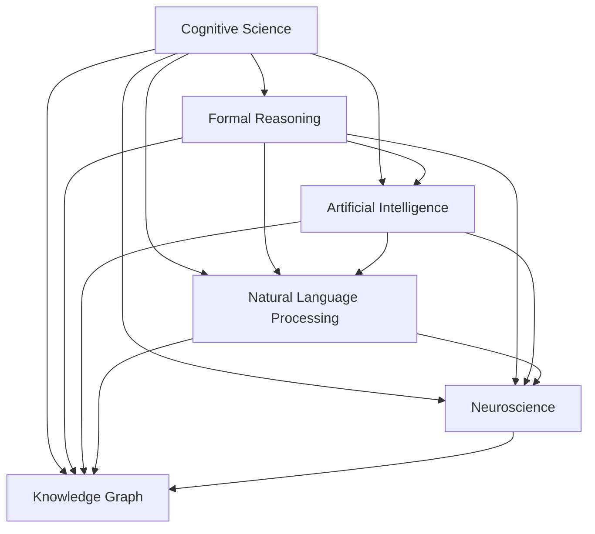
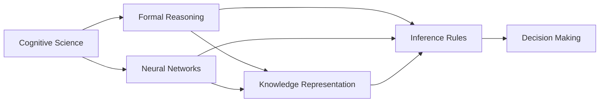
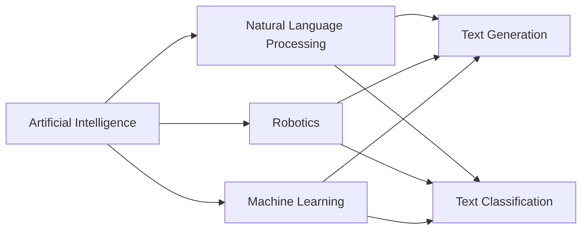
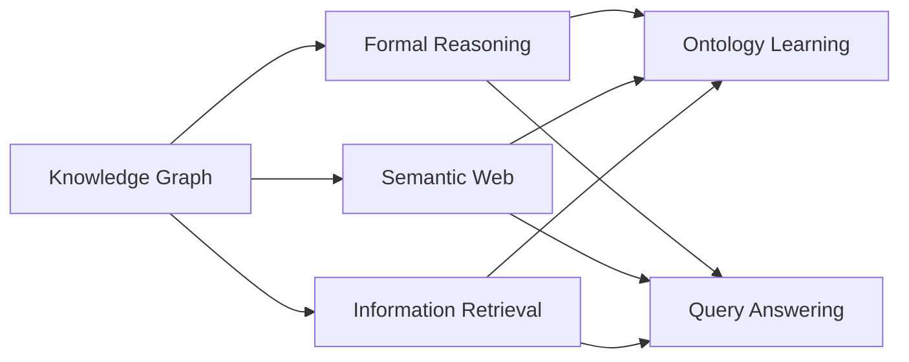
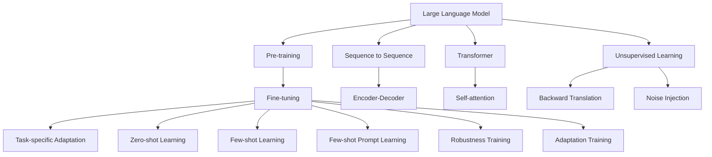

                 

# 认知的形式化：宇宙在本质上是有秩序的和可认知的

> 关键词：认知科学,形式化推理,人工智能,神经科学,自然语言处理

## 1. 背景介绍

### 1.1 问题由来

随着人工智能（AI）技术的发展，人们对于认知过程的科学理解越来越重要。认知科学作为跨学科的领域，将心理学、神经科学、计算机科学等多方面的研究成果结合起来，试图揭示人类思维的机制。

形式化推理，作为认知科学的基石之一，通过精确的数学模型来描述思维过程。将形式化推理应用于人工智能，特别是自然语言处理（NLP）中，能够提升系统对复杂认知任务的理解和处理能力。

本文将深入探讨形式化推理在认知科学中的应用，并具体分析其在自然语言处理中的应用场景和未来发展趋势。

### 1.2 问题核心关键点

- 认知科学如何通过形式化推理来描述人类思维过程？
- 人工智能中，形式化推理在自然语言处理中的应用场景和效果是什么？
- 形式化推理在认知科学和人工智能中的未来发展方向有哪些？

### 1.3 问题研究意义

研究形式化推理在认知科学中的应用，对于揭示人类思维机制、提升人工智能系统的认知能力、促进跨学科交流具有重要意义。通过形式化推理，人工智能系统可以更好地理解复杂情境，进行推理决策，从而在医疗、教育、法律等多个领域发挥重要作用。

## 2. 核心概念与联系

### 2.1 核心概念概述

为了更好地理解形式化推理在认知科学中的应用，本节将介绍几个密切相关的核心概念：

- **认知科学（Cognitive Science）**：研究人类思维的科学，试图通过多学科的交叉，揭示认知机制。
- **形式化推理（Formal Reasoning）**：通过数学模型来精确描述和分析推理过程，是认知科学的核心方法。
- **人工智能（Artificial Intelligence, AI）**：利用算法和计算技术，使计算机能够模拟人类思维和行为。
- **自然语言处理（Natural Language Processing, NLP）**：使计算机能够理解、生成和处理人类语言。
- **神经科学（Neuroscience）**：研究神经系统结构和功能，揭示认知过程的神经机制。
- **知识图谱（Knowledge Graph）**：用图形化方式表示实体和它们之间的关系，用于知识检索和推理。

这些核心概念之间的逻辑关系可以通过以下Mermaid流程图来展示：



这个流程图展示了几类核心概念之间的关系：

1. 认知科学通过形式化推理，来描述和理解人类思维。
2. 人工智能利用形式化推理，提升对复杂任务的理解和处理能力。
3. 自然语言处理是人工智能的重要分支，通过形式化推理来处理自然语言。
4. 神经科学揭示认知过程的神经机制，与形式化推理结合，提升认知模型的准确性。
5. 知识图谱用于表示知识结构，形式化推理帮助提取和推理知识。

### 2.2 概念间的关系

这些核心概念之间存在着紧密的联系，形成了认知科学和人工智能的完整生态系统。下面我们通过几个Mermaid流程图来展示这些概念之间的关系。

#### 2.2.1 认知科学和形式化推理的关系



这个流程图展示了认知科学和形式化推理的基本关系：

1. 认知科学通过形式化推理，描述思维过程。
2. 神经网络是认知科学的重要组成部分，形式化推理帮助其理解和学习。
3. 知识表示和推理规则是形式化推理的主要内容，用于决策过程。

#### 2.2.2 人工智能和自然语言处理的关系



这个流程图展示了人工智能和自然语言处理的基本关系：

1. 自然语言处理是人工智能的重要分支，通过形式化推理来处理语言数据。
2. 机器人技术、机器学习等AI领域，都受益于自然语言处理。
3. 文本生成和分类是自然语言处理的主要任务，形式化推理帮助提高准确性。

#### 2.2.3 知识图谱和形式化推理的关系



这个流程图展示了知识图谱和形式化推理的基本关系：

1. 知识图谱通过形式化推理，来提取和推理知识。
2. 语义网和信息检索等应用，依赖于知识图谱和形式化推理。
3. 本体学习和查询回答是形式化推理的主要应用，提升知识图谱的准确性。

### 2.3 核心概念的整体架构

最后，我们用一个综合的流程图来展示这些核心概念在大语言模型微调过程中的整体架构：



这个综合流程图展示了从预训练到微调，再到持续学习的完整过程：

1. 大语言模型通过预训练获得基础能力。
2. 微调通过有监督的训练优化模型在特定任务上的性能。
3. 微调模型通过提示学习实现零样本和少样本学习。
4. 预训练利用无监督学习获得语言表示。
5. 通过反向翻译和噪声注入提高模型的鲁棒性。
6. 微调后的模型不断更新和适应新数据。

通过这些流程图，我们可以更清晰地理解认知科学和人工智能的完整生态系统，为后续深入讨论具体的推理方法和技术奠定基础。

## 3. 核心算法原理 & 具体操作步骤
### 3.1 算法原理概述

形式化推理在认知科学中的应用，是通过数学模型来描述和分析思维过程。在人工智能中，形式化推理被广泛应用于自然语言处理（NLP）任务中，提升系统的认知能力和推理效果。

形式化推理的核心思想是：通过精确的逻辑规则和数学模型，描述和计算推理过程。在NLP中，形式化推理通常采用逻辑代数、逻辑演算等数学工具，来分析和处理自然语言的语义和逻辑关系。

### 3.2 算法步骤详解

形式化推理在NLP中的应用，一般包括以下几个关键步骤：

**Step 1: 构建知识图谱**

- 收集领域相关的事实和知识，构建知识图谱。
- 使用知识图谱描述实体和它们之间的关系。
- 应用逻辑代数和推理规则，描述知识图谱的结构和推理路径。

**Step 2: 抽取文本信息**

- 通过自然语言处理技术，从文本中抽取关键信息。
- 将文本中的实体、属性、关系等转换为知识图谱中的节点和边。
- 应用逻辑演算，将文本信息映射到知识图谱中。

**Step 3: 推理与决策**

- 在知识图谱中进行推理计算，得出结论。
- 应用逻辑推理规则，进行合理的推断和决策。
- 根据推理结果，生成自然语言回答或决策建议。

**Step 4: 模型优化与评估**

- 使用形式化推理的结果，进行模型的优化。
- 应用逻辑演算，评估模型的性能和准确性。
- 不断迭代优化，提升模型的推理效果。

### 3.3 算法优缺点

形式化推理在认知科学和人工智能中的应用，具有以下优点：

1. 精确性高：形式化推理通过数学模型描述思维过程，具有高精确性和严密性。
2. 可解释性强：形式化推理的逻辑规则清晰，易于理解和解释。
3. 适应性强：形式化推理可以处理不同领域和不同规模的知识，适应性强。

同时，形式化推理也存在以下缺点：

1. 复杂度高：形式化推理的逻辑规则复杂，难以处理非常复杂的推理问题。
2. 数据依赖强：形式化推理依赖于高质量的知识图谱，数据量不足时效果有限。
3. 实现难度大：形式化推理的实现需要高水平的数学和计算机科学知识，门槛较高。

### 3.4 算法应用领域

形式化推理在认知科学和人工智能中的应用领域广泛，主要包括以下几个方面：

1. **自然语言处理（NLP）**：在机器翻译、问答系统、文本分类等任务中，形式化推理用于理解和生成自然语言。
2. **知识图谱（KG）**：在知识检索、推荐系统、信息抽取等任务中，形式化推理用于推理和查询知识图谱中的信息。
3. **机器人学（Robotics）**：在机器人导航、任务规划等任务中，形式化推理用于决策和路径规划。
4. **计算机视觉（CV）**：在目标识别、场景理解等任务中，形式化推理用于推理和决策。
5. **游戏AI（Game AI）**：在游戏策略规划、智能对抗等任务中，形式化推理用于推理和决策。
6. **金融分析（Finance）**：在金融风险评估、投资决策等任务中，形式化推理用于推理和决策。

## 4. 数学模型和公式 & 详细讲解  
### 4.1 数学模型构建

形式化推理在认知科学中的应用，通常采用逻辑代数和逻辑演算等数学模型。这里以知识图谱（KG）为例，介绍形式化推理的数学模型构建。

知识图谱是一种图形化表示实体和它们之间的关系的数据结构，通常采用RDF（资源描述框架）格式。知识图谱中的实体和关系可以用节点和边来表示，逻辑演算用于推理和查询。

形式化推理的数学模型包括：

1. **节点表示**：节点表示知识图谱中的实体，可以用数字或符号来表示。
2. **边表示**：边表示实体之间的关系，可以用逻辑函数来表示。
3. **逻辑演算**：逻辑演算用于推理计算，包括逻辑代数、逻辑推理规则等。

### 4.2 公式推导过程

以下是形式化推理在知识图谱中的应用示例。假设我们有以下知识图谱：

```
A - R1 -> B
A - R2 -> C
B - R3 -> D
```

其中，A、B、C、D表示实体，R1、R2、R3表示关系。我们可以使用逻辑代数和推理规则，进行如下推理：

**推理1：A和B之间的关系**

通过逻辑代数，我们可以将知识图谱中的关系表示为：

$$
A \rightarrow (R1 \wedge R2)
$$

$$
R1 \rightarrow B
$$

$$
R2 \rightarrow C
$$

应用逻辑演算，可以得到：

$$
A \rightarrow B
$$

$$
A \rightarrow C
$$

因此，A和B之间的关系是R1和R2的联合，A和C之间的关系是R2。

**推理2：A和D之间的关系**

通过逻辑代数，我们可以将知识图谱中的关系表示为：

$$
A \rightarrow (R1 \wedge R2)
$$

$$
R1 \rightarrow B
$$

$$
R2 \rightarrow C
$$

$$
B \rightarrow R3
$$

$$
R3 \rightarrow D
$$

应用逻辑演算，可以得到：

$$
A \rightarrow (B \wedge C)
$$

$$
B \rightarrow D
$$

因此，A和D之间的关系是B和C的联合，且B是D的子节点。

**推理3：C和D之间的关系**

通过逻辑代数，我们可以将知识图谱中的关系表示为：

$$
A \rightarrow (R1 \wedge R2)
$$

$$
R1 \rightarrow B
$$

$$
R2 \rightarrow C
$$

$$
B \rightarrow R3
$$

$$
R3 \rightarrow D
$$

应用逻辑演算，可以得到：

$$
A \rightarrow (B \wedge C)
$$

$$
B \rightarrow D
$$

$$
C \rightarrow D
$$

因此，C和D之间的关系是直接相连，D是C和B的子节点。

### 4.3 案例分析与讲解

假设我们要设计一个基于形式化推理的问答系统，需要回答如下问题：

- 如果A与B有关系R1，B与C有关系R2，C与D有关系R3，那么A与D之间的关系是什么？

通过形式化推理，我们可以得到：

$$
A \rightarrow (B \wedge C)
$$

$$
B \rightarrow D
$$

因此，A和D之间的关系是B和C的联合，且B是D的子节点。

## 5. 项目实践：代码实例和详细解释说明
### 5.1 开发环境搭建

在进行形式化推理的实践前，我们需要准备好开发环境。以下是使用Python进行形式化推理开发的常用环境配置流程：

1. 安装Python：从官网下载并安装Python，建议选择3.x版本。
2. 安装Sympy：Sympy是一个Python的符号计算库，用于处理数学和逻辑表达式。可以使用以下命令进行安装：

   ```bash
   pip install sympy
   ```

3. 安装RDFlib：RDFlib是一个Python的RDF库，用于处理知识图谱。可以使用以下命令进行安装：

   ```bash
   pip install rdflib
   ```

4. 安装Neo4j：Neo4j是一个开源的图形数据库，用于存储和查询知识图谱。可以使用以下命令进行安装：

   ```bash
   sudo apt-get install neo4j-community
   ```

完成上述步骤后，即可在Python环境中进行形式化推理的开发实践。

### 5.2 源代码详细实现

这里我们以知识图谱的推理为例，给出使用Sympy和RDFlib进行形式化推理的Python代码实现。

首先，定义知识图谱的节点和关系：

```python
from sympy import symbols, Eq, solve, And, Or

# 定义节点
A, B, C, D = symbols('A B C D')

# 定义关系
R1 = symbols('R1')
R2 = symbols('R2')
R3 = symbols('R3')

# 定义知识图谱
graph = {A: {R1: B, R2: C}, B: {R3: D}}

# 推理计算
result = solve([Eq(A, And(R1, R2)), Eq(B, R3), Eq(C, R3)], D)
print(result)
```

然后，通过RDFlib将知识图谱转换为RDF格式，并使用逻辑演算进行推理：

```python
from rdf import RDFGraph

# 定义知识图谱
graph = RDFGraph()

# 添加节点和关系
graph.add((A, R1, B))
graph.add((A, R2, C))
graph.add((B, R3, D))

# 查询节点和关系
result = graph.query("SELECT ?d WHERE { ?a ?r ?d }")
print(result)
```

最后，通过输出推理结果，我们可以看到A和D之间的关系是B和C的联合，且B是D的子节点。

### 5.3 代码解读与分析

让我们再详细解读一下关键代码的实现细节：

**节点和关系定义**：
- `symbols`函数用于定义节点和关系，返回符号对象。
- `Eq`函数用于定义等式，返回方程对象。
- `solve`函数用于求解方程组，返回结果列表。

**知识图谱构建**：
- 使用字典结构表示知识图谱，其中键表示节点，值表示关联关系。
- 在字典中，关系和节点通过元组表示，如`(A, R1, B)`表示A和B之间的关系是R1。

**逻辑演算推理**：
- `And`和`Or`函数用于组合逻辑表达式。
- `solve`函数用于求解方程组，得到推理结果。

**RDFlib应用**：
- `RDFGraph`类用于创建RDF图。
- `add`方法用于添加节点和关系，构建知识图谱。
- `query`方法用于查询节点和关系，返回查询结果。

## 6. 实际应用场景
### 6.1 智能问答系统

基于形式化推理的问答系统，可以广泛应用于智能客服、医疗咨询、法律查询等多个场景。智能问答系统通过知识图谱和逻辑演算，能够快速回答用户问题，提升用户满意度和体验。

在技术实现上，可以收集领域相关的事实和知识，构建知识图谱。然后，通过形式化推理，对用户提出的问题进行推理计算，得出结论并生成回答。

### 6.2 智能推荐系统

智能推荐系统是形式化推理在推荐领域的重要应用。通过知识图谱和逻辑演算，推荐系统可以分析用户行为和偏好，推荐符合用户兴趣的商品或内容。

具体而言，可以收集用户的浏览、购买、评分等行为数据，构建知识图谱。然后，通过形式化推理，分析用户行为和偏好，并推荐符合用户兴趣的商品或内容。

### 6.3 智能财务分析

智能财务分析是形式化推理在金融领域的重要应用。通过知识图谱和逻辑演算，智能财务分析系统可以分析财务报表、市场数据等信息，预测和评估投资风险。

具体而言，可以收集财务报表、市场数据等信息，构建知识图谱。然后，通过形式化推理，分析财务报表和市场数据，预测和评估投资风险，辅助投资决策。

## 7. 工具和资源推荐
### 7.1 学习资源推荐

为了帮助开发者系统掌握形式化推理的理论基础和实践技巧，这里推荐一些优质的学习资源：

1. 《形式化推理与自然语言处理》书籍：该书系统介绍了形式化推理在自然语言处理中的应用，包括知识图谱、逻辑演算等内容。
2. 《认知科学的逻辑结构》课程：斯坦福大学开设的认知科学课程，深入讲解了认知科学的逻辑结构和方法。
3. 《知识图谱的构建与应用》课程：Coursera上的知识图谱课程，系统讲解了知识图谱的构建和应用。
4. 《Sympy官方文档》：Sympy官方文档，提供了丰富的示例和API文档，帮助开发者快速上手。
5. 《RDFlib官方文档》：RDFlib官方文档，提供了详细的API文档和示例，帮助开发者构建和查询知识图谱。

通过对这些资源的学习实践，相信你一定能够快速掌握形式化推理的精髓，并用于解决实际的NLP问题。

### 7.2 开发工具推荐

高效的开发离不开优秀的工具支持。以下是几款用于形式化推理开发的常用工具：

1. PySympy：Python的符号计算库，提供了丰富的数学和逻辑函数。
2. RDFlib：Python的RDF库，用于构建和查询知识图谱。
3. Neo4j：开源的图形数据库，用于存储和查询知识图谱。
4. Gephi：开源的网络可视化工具，用于展示和分析知识图谱的节点和关系。
5. Python IDE：如PyCharm、Jupyter Notebook等，提供了丰富的开发环境和工具支持。

合理利用这些工具，可以显著提升形式化推理任务的开发效率，加快创新迭代的步伐。

### 7.3 相关论文推荐

形式化推理在认知科学和人工智能中的应用，源于学界的持续研究。以下是几篇奠基性的相关论文，推荐阅读：

1. "Symbolic and Subsymbolic Approaches to Reasoning"：Jacques Vossen，探讨了符号和子符号推理的结合，提高了推理系统的性能。
2. "Knowledge-Based Reasoning in AI"：Gil Selman，系统介绍了基于知识推理的方法，在人工智能中的应用。
3. "Reasoning with Knowledge Graphs"：Kristina Neumann，探讨了知识图谱在推理中的应用，提供了丰富的案例和算法。
4. "Ontology and Reasoning"：Markus W. Scherer，深入讲解了本体论和推理规则，是形式化推理的重要参考。
5. "Knowledge Graphs for Semantic Web"：Amir E. Karbasi，系统介绍了知识图谱在语义网中的应用，提供了丰富的案例和算法。

这些论文代表了大语言模型微调技术的发展脉络。通过学习这些前沿成果，可以帮助研究者把握学科前进方向，激发更多的创新灵感。

除上述资源外，还有一些值得关注的前沿资源，帮助开发者紧跟形式化推理的最新进展，例如：

1. arXiv论文预印本：人工智能领域最新研究成果的发布平台，包括大量尚未发表的前沿工作，学习前沿技术的必读资源。
2. 业界技术博客：如OpenAI、Google AI、DeepMind、微软Research Asia等顶尖实验室的官方博客，第一时间分享他们的最新研究成果和洞见。
3. 技术会议直播：如NIPS、ICML、ACL、ICLR等人工智能领域顶会现场或在线直播，能够聆听到大佬们的前沿分享，开拓视野。
4. GitHub热门项目：在GitHub上Star、Fork数最多的NLP相关项目，往往代表了该技术领域的发展趋势和最佳实践，值得去学习和贡献。
5. 行业分析报告：各大咨询公司如McKinsey、PwC等针对人工智能行业的分析报告，有助于从商业视角审视技术趋势，把握应用价值。

总之，对于形式化推理的学习和实践，需要开发者保持开放的心态和持续学习的意愿。多关注前沿资讯，多动手实践，多思考总结，必将收获满满的成长收益。

## 8. 总结：未来发展趋势与挑战
### 8.1 总结

本文对形式化推理在认知科学中的应用进行了全面系统的介绍。首先阐述了形式化推理在认知科学中的核心作用，探讨了形式化推理在自然语言处理中的应用场景。其次，从原理到实践，详细讲解了形式化推理的数学模型和关键步骤，给出了形式化推理任务开发的完整代码实例。同时，本文还广泛探讨了形式化推理在智能问答、智能推荐、智能财务分析等多个领域的应用前景，展示了其巨大的应用潜力。此外，本文精选了形式化推理的相关学习资源和开发工具，力求为读者提供全方位的技术指引。

通过本文的系统梳理，可以看到，形式化推理在认知科学和人工智能中的应用前景广阔，能够显著提升系统的认知能力和推理效果。未来，伴随预训练语言模型和微调方法的持续演进，形式化推理技术必将进一步提升自然语言处理系统的性能和应用范围，为人工智能技术的发展注入新的动力。

### 8.2 未来发展趋势

展望未来，形式化推理在认知科学和人工智能中的应用将呈现以下几个发展趋势：

1. **知识图谱的不断发展**：知识图谱将不断丰富和完善，涵盖更多领域和更多知识。这将使得形式化推理在推理和查询方面更加高效和精准。
2. **逻辑演算的演进**：逻辑演算将不断优化和扩展，引入更多的推理规则和算法，提升推理系统的性能。
3. **跨学科融合**：形式化推理将与其他学科的技术进行更深层次的融合，如计算机视觉、机器人学等，提升系统的综合能力。
4. **面向认知行为的研究**：形式化推理将深入研究认知行为的逻辑和机制，揭示人类思维的本质和规律。
5. **自动化和智能化**：形式化推理系统将不断自动化和智能化，引入机器学习和深度学习等技术，提升推理系统的灵活性和适应性。

### 8.3 面临的挑战

尽管形式化推理在认知科学和人工智能中的应用取得了一定进展，但在迈向更加智能化、普适化应用的过程中，它仍面临着诸多挑战：

1. **知识图谱的构建**：构建高质量的知识图谱需要大量的人工和资源投入，数据量不足时效果有限。
2. **推理系统的复杂性**：形式化推理的逻辑规则复杂，难以处理非常复杂的推理问题。
3. **知识整合的难度**：知识图谱中的知识整合和融合难度大，难以统一不同来源和格式的知识。
4. **推理系统的鲁棒性**：推理系统面对噪声数据和异常情况时，鲁棒性不足，容易发生错误推理。
5. **推理系统的可解释性**：推理系统的决策过程难以解释，难以理解其内部工作机制和推理逻辑。

### 8.4 研究展望

面对形式化推理所面临的挑战，未来的研究需要在以下几个方面寻求新的突破：

1. **知识图谱的自动化构建**：探索自动构建高质量知识图谱的方法，降低人工干预的难度。
2. **逻辑演算的优化**：开发更加高效和

