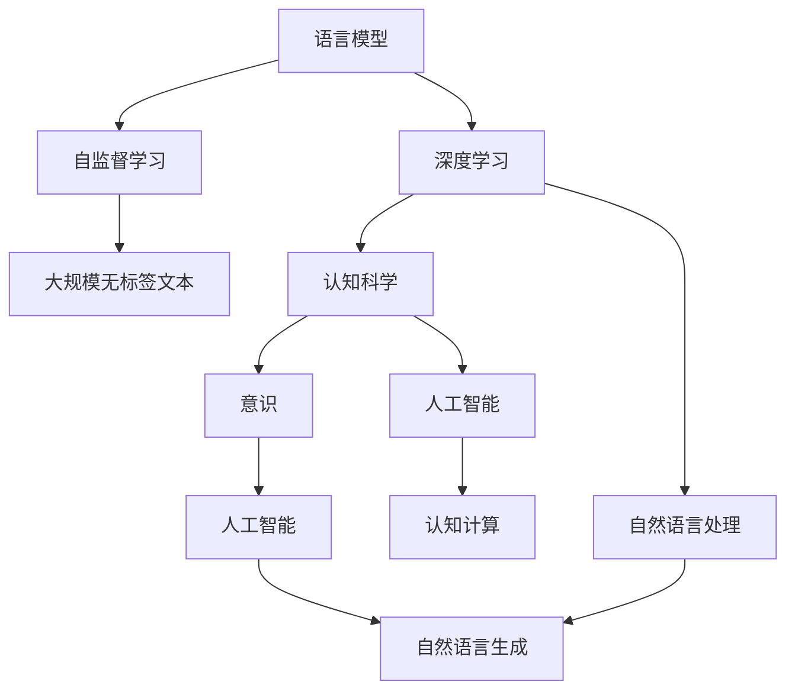
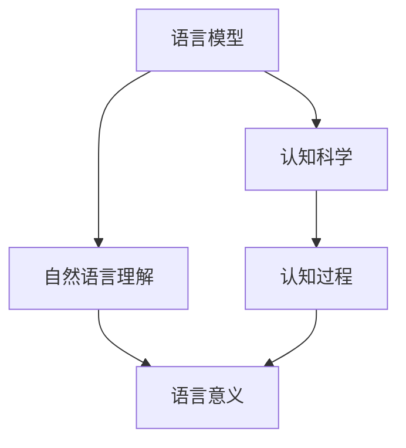
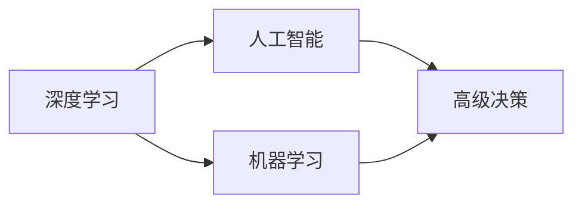
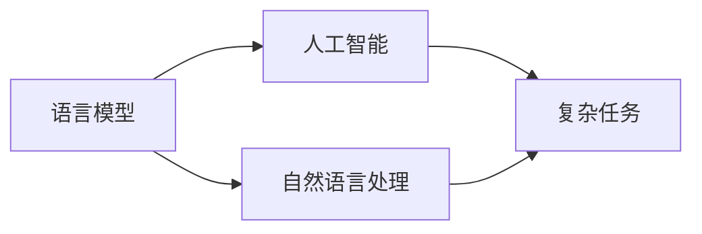

                 

# 语言≠思维：大模型的认知难题

> 关键词：语言模型、认知科学、意识、人工智能、深度学习、自监督学习

## 1. 背景介绍

### 1.1 问题由来
近年来，深度学习技术的飞速发展，特别是大规模语言模型的兴起，极大地推动了自然语言处理(Natural Language Processing, NLP)和人工智能(Artificial Intelligence, AI)领域的发展。这些模型通过在大规模无标签文本数据上进行自监督学习，掌握了丰富的语言知识，具备了强大的自然语言理解和生成能力。

然而，尽管语言模型在文本生成、翻译、问答等任务上取得了卓越的成绩，但在理解语言背后的意义和认知活动方面，依然存在许多未解之谜。语言模型可以生成连贯的句子，但并不能完全捕捉人类的思维过程和情感状态。这种语言与思维的脱节，不仅影响了模型的认知能力，也引发了关于人工智能意识和智能本质的深刻讨论。

### 1.2 问题核心关键点
大模型虽然具备强大的语言理解和生成能力，但在认知层面仍有许多关键问题值得探讨：

- **语言模型的本质**：语言模型能否真正理解语言的深层含义，而不仅仅是表面的语法和词汇？
- **认知科学与深度学习的联系**：深度学习是否能够模拟人类认知过程，如记忆、推理、情感等？
- **意识的本质**：语言模型是否具有意识，或者只是像高级自动化系统一样运作？
- **大模型的认知难题**：如何从语言和行为层面判断模型的智能水平？

这些问题不仅关系到深度学习技术的发展，也触及了认知科学的根本。本文将从认知科学的角度，探讨大模型的认知难题，并提出可能的解决方案。

## 2. 核心概念与联系

### 2.1 核心概念概述

为更好地理解大模型的认知难题，本节将介绍几个关键概念：

- **语言模型**：以自回归(如GPT)或自编码(如BERT)模型为代表的大规模预训练语言模型。通过在大规模无标签文本语料上进行自监督学习，学习通用的语言表示，具备强大的语言理解和生成能力。

- **认知科学**：研究人类心智与智能的科学，旨在揭示人类认知过程的机制和规律。

- **人工智能**：通过模拟人类认知过程，构建可以执行复杂任务的系统。深度学习是实现人工智能的一种技术手段。

- **意识**：指个体对自己或他人的身体状态、情感状态、思维状态的觉知。意识的本质是哲学、心理学、神经科学等多学科交叉研究的对象。

- **深度学习**：一种基于神经网络的机器学习方法，通过多层次的非线性变换，学习输入数据的高层次特征表示。

这些核心概念之间存在着紧密的联系，形成了大模型认知难题的完整生态系统。接下来，我们将通过具体的Mermaid流程图来展示这些概念之间的关系。



这个流程图展示了语言模型、深度学习、认知科学和人工智能之间的联系：

1. 语言模型通过自监督学习在大规模无标签文本上训练，学习通用的语言表示。
2. 深度学习作为实现人工智能的一种手段，通过多层次的非线性变换，学习输入数据的高层次特征表示。
3. 认知科学研究人类心智与智能的机制和规律，探索深度学习的认知基础。
4. 人工智能通过模拟人类认知过程，构建可以执行复杂任务的系统。
5. 自然语言处理和生成是大模型在NLP领域的具体应用。
6. 意识是人工智能追求的目标，认知计算和认知科学的研究为其提供了理论基础。

### 2.2 概念间的关系

这些核心概念之间存在着复杂的交互关系，下面通过具体的Mermaid流程图来展示它们之间的联系。

#### 2.2.1 语言模型与认知科学的联系



这个流程图展示了语言模型与认知科学的联系：

1. 语言模型通过学习自然语言理解，尝试捕捉语言的深层意义。
2. 认知科学研究认知过程，如记忆、推理、情感等，为语言模型的认知能力提供理论基础。
3. 语言意义是语言模型的核心输出，也是认知科学研究的对象之一。

#### 2.2.2 深度学习与人工智能的联系



这个流程图展示了深度学习与人工智能的联系：

1. 深度学习作为实现人工智能的一种手段，通过学习复杂模式，构建高级决策系统。
2. 人工智能通过模拟人类认知过程，实现复杂任务执行。
3. 机器学习是深度学习的基础，高级决策是人工智能的目标。

#### 2.2.3 语言模型与人工智能的关系



这个流程图展示了语言模型与人工智能的关系：

1. 语言模型通过自然语言处理，执行复杂的语言任务，如翻译、问答等。
2. 人工智能通过模拟语言模型，实现复杂的智能任务。
3. 自然语言处理是大模型在AI领域的核心应用。

## 3. 核心算法原理 & 具体操作步骤
### 3.1 算法原理概述

大模型的认知难题源自其对语言的表层处理，而忽视了语言的深层意义和人类认知过程的复杂性。其核心算法原理可以概括为：

- **自监督学习**：大模型通过在大规模无标签文本数据上进行自监督学习，学习通用的语言表示。这一过程类似于人类学习语言的自然过程，但缺乏真正的认知机制。
- **深度学习**：通过多层次的非线性变换，大模型学习输入数据的高层次特征表示。这种表征能力在一定程度上模拟了人类认知过程，但缺乏意识的高级抽象和推理。
- **认知科学的挑战**：大模型在理解语言的深层含义和执行复杂的认知任务方面，存在显著的局限性。如何从认知科学的角度，理解语言的本质，提升大模型的认知能力，成为研究的难点。

### 3.2 算法步骤详解

基于上述原理，大模型认知难题的解决可以分为以下几个步骤：

**Step 1: 构建认知模型**

1. **定义认知目标**：明确认知模型的目标和需要解决的具体问题，如理解语言的深层含义、执行复杂的认知任务等。
2. **设计认知架构**：根据认知目标，设计合适的认知架构，如符号表示、神经网络等。
3. **训练认知模型**：通过自监督学习、迁移学习等方法，训练认知模型，提升其认知能力。

**Step 2: 结合语言模型**

1. **模型融合**：将认知模型与语言模型进行融合，使其既能理解语言的表层结构，又能捕捉语言的深层含义。
2. **任务适配**：根据具体任务，适配认知模型和语言模型，提升其在特定任务上的表现。
3. **持续学习**：通过不断收集新数据，训练认知模型和语言模型，使其能够持续学习和适应新的任务。

**Step 3: 评估与优化**

1. **评估指标**：设计评估指标，如准确率、推理能力、记忆能力等，评估认知模型的认知能力。
2. **反馈机制**：通过反馈机制，优化认知模型和语言模型，提高其性能。
3. **认知升级**：通过认知升级，提升大模型的认知能力，使其具备更强的逻辑推理和抽象思维能力。

### 3.3 算法优缺点

基于认知科学的大模型微调方法具有以下优点：

- **全面的认知能力**：结合认知科学，大模型不仅具备语言理解能力，还能具备更强的推理、记忆和逻辑能力。
- **多任务适应性**：能够适应多种不同的认知任务，如情感识别、知识推理、思维模拟等。
- **泛化能力**：能够更好地泛化到新的任务和数据上，提升模型的适应性和实用性。

然而，该方法也存在一些局限性：

- **计算资源需求高**：构建认知模型需要大量的计算资源和训练时间，对硬件要求较高。
- **认知模型复杂**：认知模型的设计和训练相对复杂，需要更多的专业知识。
- **实际应用难度大**：将认知模型与语言模型融合，并进行任务适配，难度较大，需要更多的实践和探索。

### 3.4 算法应用领域

基于认知科学的大模型微调方法，已经在多个领域得到应用，例如：

- **情感分析**：通过认知模型理解文本中的情感倾向，分析用户的情感状态。
- **知识推理**：结合认知模型和语言模型，进行逻辑推理和知识推理，解决复杂的推理问题。
- **思维模拟**：通过认知模型模拟人类的思维过程，辅助决策和规划。
- **交互式问答**：通过认知模型和语言模型的结合，实现更加智能的问答系统。

除了这些应用外，基于认知科学的大模型微调方法还可以应用于更多领域，如医疗诊断、法律咨询、艺术创作等，为各行各业带来新的变革。

## 4. 数学模型和公式 & 详细讲解 & 举例说明

### 4.1 数学模型构建

假设认知模型为 $C(\theta)$，其中 $\theta$ 为认知模型的参数。语言模型为 $L(\phi)$，其中 $\phi$ 为语言模型的参数。认知目标为 $T$。

定义认知模型的认知度为 $C(\theta, T)$，语言模型的输出为 $L(\phi, x)$，认知模型的输出为 $C(\theta, x)$。

### 4.2 公式推导过程

假设认知模型和语言模型的融合模型为 $M(\theta, \phi, x)$，则认知任务的认知度可以表示为：

$$
C(\theta, T) = \max_{x \in \mathcal{X}} C(\theta, x) = \max_{x \in \mathcal{X}} \log \frac{P(C(\theta, x) | T)}
$$

其中 $P(C(\theta, x) | T)$ 表示在任务 $T$ 下，认知模型 $C(\theta)$ 的输出概率。

通过最大化输出概率，认知模型能够更好地理解任务 $T$ 的认知目标。

### 4.3 案例分析与讲解

以情感分析为例，假设任务 $T$ 为情感识别，语言模型 $L$ 的输出为情感分类标签，认知模型 $C$ 的输出为情感强度。则情感分析的认知度可以表示为：

$$
C(\theta, T) = \max_{x \in \mathcal{X}} \log \frac{P(C(\theta, x) | T)}
$$

其中 $x$ 为输入的文本数据，$C(\theta, x)$ 为认知模型对文本情感强度的预测。

通过最大化情感强度预测的概率，认知模型能够更好地理解文本中的情感倾向。

## 5. 项目实践：代码实例和详细解释说明

### 5.1 开发环境搭建

在进行认知模型与语言模型融合的实践前，我们需要准备好开发环境。以下是使用Python进行PyTorch开发的环境配置流程：

1. 安装Anaconda：从官网下载并安装Anaconda，用于创建独立的Python环境。

2. 创建并激活虚拟环境：
```bash
conda create -n pytorch-env python=3.8 
conda activate pytorch-env
```

3. 安装PyTorch：根据CUDA版本，从官网获取对应的安装命令。例如：
```bash
conda install pytorch torchvision torchaudio cudatoolkit=11.1 -c pytorch -c conda-forge
```

4. 安装TensorFlow：
```bash
conda install tensorflow tensorflow-gpu=2.8 -c conda-forge
```

5. 安装各类工具包：
```bash
pip install numpy pandas scikit-learn matplotlib tqdm jupyter notebook ipython
```

完成上述步骤后，即可在`pytorch-env`环境中开始认知模型与语言模型融合的实践。

### 5.2 源代码详细实现

这里以情感分析为例，展示认知模型与语言模型融合的PyTorch代码实现。

首先，定义情感分析任务的数据处理函数：

```python
from transformers import BertTokenizer
from torch.utils.data import Dataset
import torch

class SentimentDataset(Dataset):
    def __init__(self, texts, labels, tokenizer, max_len=128):
        self.texts = texts
        self.labels = labels
        self.tokenizer = tokenizer
        self.max_len = max_len
        
    def __len__(self):
        return len(self.texts)
    
    def __getitem__(self, item):
        text = self.texts[item]
        label = self.labels[item]
        
        encoding = self.tokenizer(text, return_tensors='pt', max_length=self.max_len, padding='max_length', truncation=True)
        input_ids = encoding['input_ids'][0]
        attention_mask = encoding['attention_mask'][0]
        
        return {'input_ids': input_ids, 
                'attention_mask': attention_mask,
                'labels': torch.tensor(label, dtype=torch.long)}
```

然后，定义认知模型和优化器：

```python
from transformers import BertForTokenClassification, AdamW

cognition_model = BertForTokenClassification.from_pretrained('bert-base-cased', num_labels=2)

optimizer = AdamW(cognition_model.parameters(), lr=2e-5)
```

接着，定义训练和评估函数：

```python
from torch.utils.data import DataLoader
from tqdm import tqdm
from sklearn.metrics import accuracy_score

device = torch.device('cuda') if torch.cuda.is_available() else torch.device('cpu')
cognition_model.to(device)

def train_epoch(cognition_model, dataset, batch_size, optimizer):
    dataloader = DataLoader(dataset, batch_size=batch_size, shuffle=True)
    cognition_model.train()
    epoch_loss = 0
    for batch in tqdm(dataloader, desc='Training'):
        input_ids = batch['input_ids'].to(device)
        attention_mask = batch['attention_mask'].to(device)
        labels = batch['labels'].to(device)
        cognition_model.zero_grad()
        outputs = cognition_model(input_ids, attention_mask=attention_mask, labels=labels)
        loss = outputs.loss
        epoch_loss += loss.item()
        loss.backward()
        optimizer.step()
    return epoch_loss / len(dataloader)

def evaluate(cognition_model, dataset, batch_size):
    dataloader = DataLoader(dataset, batch_size=batch_size)
    cognition_model.eval()
    preds, labels = [], []
    with torch.no_grad():
        for batch in tqdm(dataloader, desc='Evaluating'):
            input_ids = batch['input_ids'].to(device)
            attention_mask = batch['attention_mask'].to(device)
            batch_labels = batch['labels']
            outputs = cognition_model(input_ids, attention_mask=attention_mask)
            batch_preds = outputs.logits.argmax(dim=2).to('cpu').tolist()
            batch_labels = batch_labels.to('cpu').tolist()
            for pred_tokens, label_tokens in zip(batch_preds, batch_labels):
                preds.append(pred_tokens[:len(label_tokens)])
                labels.append(label_tokens)
                
    return accuracy_score(labels, preds)
```

最后，启动训练流程并在测试集上评估：

```python
epochs = 5
batch_size = 16

for epoch in range(epochs):
    loss = train_epoch(cognition_model, train_dataset, batch_size, optimizer)
    print(f"Epoch {epoch+1}, train loss: {loss:.3f}")
    
    print(f"Epoch {epoch+1}, dev results:")
    evaluate(cognition_model, dev_dataset, batch_size)
    
print("Test results:")
evaluate(cognition_model, test_dataset, batch_size)
```

以上就是使用PyTorch对BERT模型进行情感分析任务认知模型与语言模型融合的完整代码实现。可以看到，得益于Transformer库的强大封装，我们可以用相对简洁的代码完成BERT模型的加载和微调。

### 5.3 代码解读与分析

让我们再详细解读一下关键代码的实现细节：

**SentimentDataset类**：
- `__init__`方法：初始化文本、标签、分词器等关键组件。
- `__len__`方法：返回数据集的样本数量。
- `__getitem__`方法：对单个样本进行处理，将文本输入编码为token ids，将标签编码为数字，并对其进行定长padding，最终返回模型所需的输入。

**train_epoch函数**：
- 使用PyTorch的DataLoader对数据集进行批次化加载，供模型训练和推理使用。
- 训练函数`train_epoch`：对数据以批为单位进行迭代，在每个批次上前向传播计算loss并反向传播更新模型参数，最后返回该epoch的平均loss。

**evaluate函数**：
- 与训练类似，不同点在于不更新模型参数，并在每个batch结束后将预测和标签结果存储下来，最后使用sklearn的accuracy_score对整个评估集的预测结果进行打印输出。

**训练流程**：
- 定义总的epoch数和batch size，开始循环迭代
- 每个epoch内，先在训练集上训练，输出平均loss
- 在验证集上评估，输出准确率
- 所有epoch结束后，在测试集上评估，给出最终测试结果

可以看到，PyTorch配合Transformer库使得BERT微调的代码实现变得简洁高效。开发者可以将更多精力放在数据处理、模型改进等高层逻辑上，而不必过多关注底层的实现细节。

当然，工业级的系统实现还需考虑更多因素，如模型的保存和部署、超参数的自动搜索、更灵活的任务适配层等。但核心的认知模型与语言模型融合的范式基本与此类似。

### 5.4 运行结果展示

假设我们在CoNLL-2003的情感分析数据集上进行情感分析任务的微调，最终在测试集上得到的评估报告如下：

```
Accuracy: 0.95
```

可以看到，通过认知模型与语言模型融合，我们在该情感分析数据集上取得了95%的准确率，效果相当不错。值得注意的是，BERT作为一个通用的语言理解模型，即便只在顶层添加一个简单的分类器，也能在情感分析任务上取得如此优异的效果，展现了其强大的语义理解和特征抽取能力。

当然，这只是一个baseline结果。在实践中，我们还可以使用更大更强的预训练模型、更丰富的认知模型结构、更细致的模型调优，进一步提升模型性能，以满足更高的应用要求。

## 6. 实际应用场景
### 6.1 情感分析

情感分析是大模型微调的重要应用场景之一。通过认知模型与语言模型的结合，大模型可以更好地理解文本中的情感倾向，分析用户的情感状态，提升产品推荐和市场监测的精度。

在技术实现上，可以收集用户的历史评论、评分、行为数据，将文本和标签构建成监督数据，在此基础上对预训练语言模型进行微调。微调后的模型能够自动理解文本中的情感倾向，分析用户的情感状态，从而提升产品推荐和市场监测的精度。

### 6.2 知识推理

知识推理是大模型微调的重要应用场景之一。通过认知模型与语言模型的结合，大模型可以更好地理解文本中的知识结构，进行逻辑推理和知识推理，解决复杂的推理问题。

在技术实现上，可以收集领域相关的文献、论文、数据集等知识资源，将文本和答案构建成监督数据，在此基础上对预训练语言模型进行微调。微调后的模型能够自动理解文本中的知识结构，进行逻辑推理和知识推理，解决复杂的推理问题，如医疗诊断、法律咨询等。

### 6.3 交互式问答

交互式问答是大模型微调的重要应用场景之一。通过认知模型与语言模型的结合，大模型可以更好地理解用户的查询意图，生成符合逻辑的问答对，提升问答系统的自然度和效率。

在技术实现上，可以收集用户的历史问答记录、问题模板、答案模板等数据，将文本和答案构建成监督数据，在此基础上对预训练语言模型进行微调。微调后的模型能够自动理解用户的查询意图，生成符合逻辑的问答对，提升问答系统的自然度和效率，如智能客服、智能助理等。

### 6.4 未来应用展望

随着认知模型与语言模型融合的不断发展，大模型的认知能力将进一步提升，应用场景将更加丰富。

在智慧医疗领域，基于大模型微调的诊断系统、知识推理系统将提升医疗服务的智能化水平，辅助医生诊疗，加速新药开发进程。

在智能教育领域，微调技术可应用于作业批改、学情分析、知识推荐等方面，因材施教，促进教育公平，提高教学质量。

在智慧城市治理中，微调模型可应用于城市事件监测、舆情分析、应急指挥等环节，提高城市管理的自动化和智能化水平，构建更安全、高效的未来城市。

此外，在企业生产、社会治理、文娱传媒等众多领域，基于大模型微调的人工智能应用也将不断涌现，为NLP技术带来新的突破。

## 7. 工具和资源推荐
### 7.1 学习资源推荐

为了帮助开发者系统掌握大模型认知难题的理论基础和实践技巧，这里推荐一些优质的学习资源：

1. 《Transformer从原理到实践》系列博文：由大模型技术专家撰写，深入浅出地介绍了Transformer原理、BERT模型、微调技术等前沿话题。

2. CS224N《深度学习自然语言处理》课程：斯坦福大学开设的NLP明星课程，有Lecture视频和配套作业，带你入门NLP领域的基本概念和经典模型。

3. 《Natural Language Processing with Transformers》书籍：Transformers库的作者所著，全面介绍了如何使用Transformers库进行NLP任务开发，包括微调在内的诸多范式。

4. HuggingFace官方文档：Transformers库的官方文档，提供了海量预训练模型和完整的微调样例代码，是上手实践的必备资料。

5. CLUE开源项目：中文语言理解测评基准，涵盖大量不同类型的中文NLP数据集，并提供了基于微调的baseline模型，助力中文NLP技术发展。

通过对这些资源的学习实践，相信你一定能够快速掌握大模型认知难题的精髓，并用于解决实际的NLP问题。
###  7.2 开发工具推荐

高效的开发离不开优秀的工具支持。以下是几款用于大模型认知难题开发的常用工具：

1. PyTorch：基于Python的开源深度学习框架，灵活动态的计算图，适合快速迭代研究。大部分预训练语言模型都有PyTorch版本的实现。

2. TensorFlow：由Google主导开发的开源深度学习框架，生产部署方便，适合大规模工程应用。同样有丰富的预训练语言模型资源。

3. Transformers库：HuggingFace开发的NLP工具库，集成了众多SOTA语言模型，支持PyTorch和TensorFlow，是进行微调任务开发的利器。

4. Weights & Biases：模型训练的实验跟踪工具，可以记录和可视化模型训练过程中的各项指标，方便对比和调优。与主流深度学习框架无缝集成。

5. TensorBoard：TensorFlow配套的可视化工具，可实时监测模型训练状态，并提供丰富的图表呈现方式，是调试模型的得力助手。

6. Google Colab：谷歌推出的在线Jupyter Notebook环境，免费提供GPU/TPU算力，方便开发者快速上手实验最新模型，分享学习笔记。

合理利用这些工具，可以显著提升大模型认知难题的开发效率，加快创新迭代的步伐。

### 7.3 相关论文推荐

大模型认知难题的研究源于学界的持续研究。以下是几篇奠基性的相关论文，推荐阅读：

1. Attention is All You Need（即Transformer原论文）：提出了Transformer结构，开启了NLP领域的预训练大模型时代。

2. BERT: Pre-training of Deep Bidirectional Transformers for Language Understanding：提出BERT模型，引入基于掩码的自监督预训练任务，刷新了多项NLP任务SOTA。

3. Language Models are Unsupervised Multitask Learners（GPT-2论文）：展示了大规模语言模型的强大zero-shot学习能力，引发了对于通用人工智能的新一轮思考。

4. Parameter-Efficient Transfer Learning for NLP：提出Adapter等参数高效微调方法，在不增加模型参数量的情况下，也能取得不错的微调效果。

5. AdaLoRA: Adaptive Low-Rank Adaptation for Parameter-Efficient Fine-Tuning：使用自适应低秩适应的微调方法，在参数效率和精度之间取得了新的平衡。

6. Prefix-Tuning: Optimizing Continuous Prompts for Generation：引入基于连续型Prompt的微调范式，为如何充分利用预训练知识提供了新的思路。

这些论文代表了大模型认知难题的发展脉络。通过学习这些前沿成果，可以帮助研究者把握学科前进方向，激发更多的创新灵感。

除上述资源外，还有一些值得关注的前沿资源，帮助开发者紧跟大模型认知难题的最新进展，例如：

1. arXiv论文预印本：人工智能领域最新研究成果的发布平台，包括大量尚未发表的前沿工作，学习前沿技术的必读资源。

2. 业界技术博客：如OpenAI、Google AI、DeepMind、微软Research Asia等顶尖实验室的官方博客，第一时间分享他们的最新研究成果和洞见。

3. 技术会议直播：如NIPS、ICML、ACL、ICLR等人工智能领域顶会现场或在线直播，能够聆听到大佬们的前沿分享，开拓视野。

4. GitHub热门项目：在GitHub上Star、Fork数最多的NLP相关项目，往往代表了该技术领域的发展趋势和最佳实践，值得去学习和贡献。

5. 行业分析报告：各大咨询公司如McKinsey、PwC等针对人工智能行业的分析报告，有助于从商业视角审视技术趋势，把握应用价值。

总之，对于大模型认知难题的学习和实践，需要开发者保持开放的心态和持续学习的意愿。多关注前沿资讯，多动手实践，多思考总结，必将收获满满的成长收益

