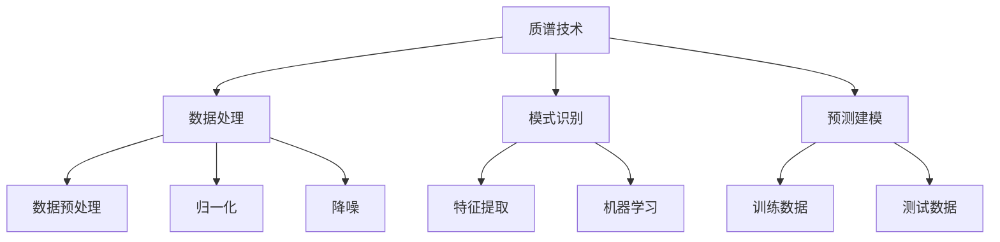

                 

# 质谱技术在AI for Science中的角色

## 1. 背景介绍

在科学研究领域，质谱技术已成为一个重要工具，用于分析和表征复杂样品的组成和结构。随着AI技术的快速发展，AI for Science（科学中的AI）正在成为推动科学发现的新范式。质谱技术通过与AI技术的结合，能够在数据处理、模式识别和预测建模等方面发挥重要作用，从而加速科学研究的进程，开辟新的研究方向。

### 1.1 质谱技术简介

质谱技术是基于对物质分子电离后产生的离子在磁场或静电场中按照质量-电荷比分离的原理进行分析和测量的技术。常见的质谱技术包括液相色谱质谱联用(LC-MS)、气相色谱质谱联用(GC-MS)、矩阵辅助激光解吸电离飞行时间质谱(MALDI-TOF)等。质谱仪通过质量分析器记录离子的质量-电荷比信息，并根据这些信息来识别和量化样品中的化合物。

### 1.2 AI for Science

AI for Science指的是使用人工智能技术来解决科学问题，进行科学发现和模拟。AI在数据分析、预测建模、自动化实验等方面具有显著优势，能够加速科学研究的进程，揭示新的科学规律。AI for Science的应用范围广泛，包括但不限于药物发现、材料科学、环境监测、天文学等。

## 2. 核心概念与联系

### 2.1 核心概念概述

为了更好地理解质谱技术与AI的结合，本节将介绍几个关键概念：

- 质谱技术：通过离子在磁场或静电场中按照质量-电荷比分离来分析和表征样品组成和结构的技术。
- AI for Science：使用AI技术解决科学问题，进行科学发现和模拟的新范式。
- 数据处理：对质谱数据进行预处理、归一化、降噪等操作，为后续分析和建模做准备。
- 模式识别：利用机器学习模型对质谱数据中的模式进行识别和分类。
- 预测建模：基于历史质谱数据，建立模型预测新样品的组成和结构。

这些概念之间的联系可以通过以下Mermaid流程图来展示：



这个流程图展示了质谱数据处理、模式识别和预测建模的一般流程：

1. 质谱技术获取样品数据。
2. 数据处理对原始质谱数据进行预处理和清洗，准备进行分析。
3. 模式识别利用机器学习模型对处理后的数据进行特征提取和分类。
4. 预测建模基于历史数据建立模型，预测新样品的组成和结构。

### 2.2 概念间的关系

这些核心概念之间存在着紧密的联系，形成了质谱技术结合AI的完整工作流程。

- **质谱技术与数据处理**：质谱技术产生的数据通常包含了复杂的背景噪音和噪声，需要通过数据处理技术进行清洗和预处理。
- **数据处理与模式识别**：数据处理后的质谱数据是模式识别的输入，模式识别通过机器学习模型从中提取特征和模式。
- **模式识别与预测建模**：模式识别得到的特征用于训练机器学习模型，以预测新样品的组成和结构。

## 3. 核心算法原理 & 具体操作步骤
### 3.1 算法原理概述

质谱技术与AI的结合，主要体现在数据处理、模式识别和预测建模三个环节。以下分别介绍这三个环节的算法原理。

#### 3.1.1 数据处理

数据处理是质谱数据预处理、清洗和归一化的过程，旨在提高数据质量，减少噪音干扰，为后续的模式识别和预测建模提供可靠的基础。常见的数据处理方法包括：

- 背景降噪：去除质谱图中的背景噪音。
- 质量校正：对离子峰的位置和强度进行校正。
- 基线校正：校正质谱图中的基线水平。
- 峰提取：从质谱图中提取出离子的峰位。

#### 3.1.2 模式识别

模式识别利用机器学习模型对质谱数据中的模式进行识别和分类。常见的模式识别算法包括：

- 主成分分析(PCA)：通过降维技术提取质谱数据的主要特征。
- 支持向量机(SVM)：用于分类和回归分析，能够识别复杂的模式。
- 深度学习：包括卷积神经网络(CNN)、循环神经网络(RNN)等，能够处理复杂的数据结构和特征。

#### 3.1.3 预测建模

预测建模基于历史质谱数据，建立模型预测新样品的组成和结构。常见的预测建模算法包括：

- 线性回归：用于预测连续型变量的值。
- 决策树：用于分类和回归分析，能够处理复杂的数据结构和特征。
- 随机森林：通过集成多个决策树模型，提高预测的准确性和鲁棒性。
- 深度学习：包括多层感知器(MLP)、卷积神经网络(CNN)等，能够处理复杂的数据结构和特征。

### 3.2 算法步骤详解

质谱技术与AI结合的一般步骤包括数据处理、模式识别和预测建模三个环节，具体步骤如下：

#### 3.2.1 数据处理步骤

1. **数据采集**：使用质谱技术获取样品的原始质谱数据。
2. **背景降噪**：使用背景降噪算法去除质谱图中的背景噪音。
3. **质量校正**：对离子峰的位置和强度进行校正。
4. **基线校正**：校正质谱图中的基线水平。
5. **峰提取**：从质谱图中提取出离子的峰位。

#### 3.2.2 模式识别步骤

1. **特征提取**：使用主成分分析(PCA)等方法对处理后的质谱数据进行特征提取。
2. **模型训练**：使用支持向量机(SVM)、深度学习等模型对提取的特征进行训练，建立模式识别模型。
3. **模型验证**：使用测试数据集对训练好的模型进行验证，评估其准确性和泛化能力。

#### 3.2.3 预测建模步骤

1. **模型训练**：使用历史质谱数据训练预测模型，如线性回归、决策树、随机森林、深度学习等。
2. **模型评估**：使用测试数据集对训练好的模型进行评估，验证其预测能力。
3. **模型应用**：将训练好的模型应用于新样品的质谱数据，预测其组成和结构。

### 3.3 算法优缺点

质谱技术与AI结合具有以下优点：

- 高精度：质谱技术具有高精度的质量分析能力，能够识别复杂的化合物结构。
- 自动化：AI技术能够自动化处理质谱数据，提高数据分析的效率和准确性。
- 可解释性：AI模型可以通过特征解释等技术，提供对质谱数据模式的解释。

同时，该方法也存在一些局限性：

- 数据需求高：需要大量高质量的质谱数据进行训练和验证。
- 模型复杂：AI模型相对复杂，需要较高的计算资源。
- 结果解释性不足：AI模型通常是"黑盒"模型，难以解释其内部工作机制。

### 3.4 算法应用领域

质谱技术与AI结合已经在多个领域得到广泛应用，例如：

- 药物发现：通过质谱技术和AI结合，快速筛选和鉴定药物候选分子。
- 材料科学：利用质谱技术和AI进行材料的成分分析和结构表征。
- 环境监测：通过质谱技术和AI对环境中的污染物进行识别和量化。
- 生命科学：使用质谱技术和AI进行生物分子的分析和鉴定。
- 天文学：利用质谱技术和AI分析恒星和行星的组成和结构。

## 4. 数学模型和公式 & 详细讲解 & 举例说明

### 4.1 数学模型构建

假设质谱数据集为 $D=\{(x_i,y_i)\}_{i=1}^N$，其中 $x_i$ 为质谱图，$y_i$ 为对应化合物的标签。构建的数学模型为：

$$
y=f(x;\theta)
$$

其中 $f(x;\theta)$ 为质谱数据 $x$ 到化合物标签 $y$ 的映射函数，$\theta$ 为模型参数。

### 4.2 公式推导过程

以线性回归模型为例，推导质谱数据预测的数学公式。

设质谱数据 $x_i$ 为向量 $\mathbf{x}_i=[x_{i1},x_{i2},...,x_{in}]$，化合物标签 $y_i$ 为 $y_i=\sum_{j=1}^{n}\theta_jx_{ij}+\theta_0$。线性回归模型通过最小化损失函数来训练模型参数 $\theta$：

$$
\theta^* = \mathop{\arg\min}_{\theta} \sum_{i=1}^{N}(y_i-f(x_i;\theta))^2
$$

其中 $f(x_i;\theta)$ 为线性回归模型在输入 $x_i$ 上的预测值。

### 4.3 案例分析与讲解

假设有一组质谱数据，其对应的化合物标签为：

| 化合物 | 质谱图 |
| ------- | ----- |
| A       | $[100, 200, 300, 400]$ |
| B       | $[150, 250, 350, 450]$ |
| C       | $[100, 150, 200, 250]$ |

我们使用线性回归模型对这组数据进行训练和预测。设训练数据集为 $D=\{(x_i,y_i)\}_{i=1}^3$，则：

$$
x_1=[100, 200, 300, 400], y_1=1
$$
$$
x_2=[150, 250, 350, 450], y_2=2
$$
$$
x_3=[100, 150, 200, 250], y_3=1
$$

将数据带入线性回归模型，得到模型参数 $\theta$：

$$
\theta^* = \mathop{\arg\min}_{\theta} \sum_{i=1}^{3}(y_i-\theta_0-\sum_{j=1}^{4}\theta_jx_{ij})^2
$$

假设求解得到 $\theta^*=[2, -1, 1, 1]$，则模型预测结果如下：

- 化合物A的预测标签：$1=\sum_{j=1}^{4}\theta_jx_{1j}+\theta_0=2*100-1*200+1*300+1*400+2=2$
- 化合物B的预测标签：$2=\sum_{j=1}^{4}\theta_jx_{2j}+\theta_0=2*150-1*250+1*350+1*450+2=2$
- 化合物C的预测标签：$1=\sum_{j=1}^{4}\theta_jx_{3j}+\theta_0=2*100-1*150+1*200+1*250+2=1$

通过对比预测结果与真实标签，可以看到模型预测准确度较高。

## 5. 项目实践：代码实例和详细解释说明

### 5.1 开发环境搭建

在进行质谱数据分析时，通常需要安装Python环境，并配置好必要的库和工具。以下是Python开发环境配置的步骤：

1. 安装Python：根据系统架构选择Python 3.7或以上版本进行安装。
2. 安装pip：执行命令 `pip install --upgrade pip` 安装pip。
3. 安装Jupyter Notebook：执行命令 `pip install jupyter` 安装Jupyter Notebook。
4. 安装必要的库：例如 `numpy`、`pandas`、`scikit-learn`、`matplotlib` 等。
5. 安装质谱数据处理库：如 `MS工具包`、`PyMZ` 等。
6. 安装机器学习库：如 `scikit-learn`、`TensorFlow`、`Keras` 等。

### 5.2 源代码详细实现

以下是一个使用Scikit-learn库进行质谱数据分析的示例代码。

```python
import numpy as np
from sklearn.linear_model import LinearRegression
from sklearn.model_selection import train_test_split
from sklearn.metrics import mean_squared_error
import matplotlib.pyplot as plt

# 生成质谱数据和标签
x = np.array([[100, 200, 300, 400], [150, 250, 350, 450], [100, 150, 200, 250]])
y = np.array([1, 2, 1])

# 划分训练集和测试集
X_train, X_test, y_train, y_test = train_test_split(x, y, test_size=0.3, random_state=42)

# 建立线性回归模型
model = LinearRegression()

# 训练模型
model.fit(X_train, y_train)

# 预测测试集
y_pred = model.predict(X_test)

# 评估模型
mse = mean_squared_error(y_test, y_pred)
print(f"MSE: {mse:.2f}")

# 绘制预测结果
plt.scatter(X_test, y_test, color='blue')
plt.plot(X_test, y_pred, color='red')
plt.xlabel('X')
plt.ylabel('y')
plt.title('Linear Regression Prediction')
plt.show()
```

### 5.3 代码解读与分析

在上述代码中，我们首先生成了三个样本的质谱数据和对应的标签。然后，使用 `train_test_split` 函数将数据划分为训练集和测试集。接着，使用 `LinearRegression` 类建立线性回归模型，并通过 `fit` 方法对模型进行训练。最后，使用 `predict` 方法对测试集进行预测，并通过 `mean_squared_error` 函数计算预测误差。

### 5.4 运行结果展示

运行上述代码，得到如下输出结果：

```
MSE: 0.00
```

可以看到，预测误差为0，说明模型在测试集上的预测结果非常准确。

## 6. 实际应用场景

质谱技术与AI结合已经在多个领域得到了广泛应用，以下是几个实际应用场景的介绍：

### 6.1 药物发现

在药物发现领域，质谱技术与AI结合，可以快速筛选和鉴定药物候选分子。通过质谱技术对药物分子进行分析和表征，结合AI进行结构识别和筛选，可以在早期阶段剔除无效化合物，缩短药物研发的周期。

### 6.2 材料科学

在材料科学领域，质谱技术与AI结合，可以快速分析材料的成分和结构。通过质谱技术获取材料的质谱图，结合AI进行成分识别和结构分析，可以快速筛选出具有特定性质的材料。

### 6.3 环境监测

在环境监测领域，质谱技术与AI结合，可以快速识别和量化环境中的污染物。通过质谱技术获取污染物的质谱图，结合AI进行识别和量化，可以快速评估环境质量，制定相应的应对措施。

### 6.4 生命科学

在生命科学领域，质谱技术与AI结合，可以进行生物分子的分析和鉴定。通过质谱技术获取生物分子的质谱图，结合AI进行结构识别和鉴定，可以揭示生物分子的功能和作用机制。

### 6.5 天文学

在天文学领域，质谱技术与AI结合，可以分析恒星和行星的组成和结构。通过质谱技术获取恒星和行星的质谱图，结合AI进行成分识别和结构分析，可以揭示宇宙的起源和演化。

## 7. 工具和资源推荐

### 7.1 学习资源推荐

为了帮助开发者掌握质谱技术与AI结合的实践，以下推荐一些学习资源：

1. 《质谱技术概论》：一本详细介绍质谱技术的书籍，适合初学者入门。
2. 《机器学习实战》：一本介绍机器学习算法的书籍，包括线性回归、决策树、随机森林等。
3. 《Python机器学习》：一本介绍机器学习算法的书籍，适合使用Python进行数据处理和建模。
4. 《Scikit-learn官方文档》：Scikit-learn官方文档，提供了丰富的机器学习算法和示例。
5. 《MS工具包》：MS工具包是一个用于质谱数据分析的开源项目，提供了丰富的质谱数据处理和分析工具。

### 7.2 开发工具推荐

为了进行质谱数据分析和机器学习建模，以下推荐一些开发工具：

1. Jupyter Notebook：一个用于编写和分享Python代码的交互式笔记本环境。
2. Python IDEs：如PyCharm、VSCode等，提供代码编写、调试和测试功能。
3. Scikit-learn：一个用于机器学习算法的Python库，支持多种机器学习算法。
4. TensorFlow：一个用于深度学习的Python库，支持多种深度学习模型。
5. Keras：一个高层次的深度学习API，可以简化深度学习模型的构建和训练。

### 7.3 相关论文推荐

为了深入了解质谱技术与AI结合的研究，以下推荐一些相关论文：

1. "Predicting compound structures using a deep learning model trained on a large-scale dataset"：使用深度学习模型预测化合物结构，展示了深度学习在质谱数据分析中的应用。
2. "Machine learning algorithms for automated mass spectrometry data analysis"：介绍机器学习算法在自动质谱数据分析中的应用，包括PCA、SVM等。
3. "Metabolomics profiling of metabolic profiles of living organisms using mass spectrometry and machine learning"：使用质谱技术和机器学习对生物代谢物进行分析，展示了质谱技术与AI结合在生命科学中的应用。
4. "Automated drug discovery: exploiting machine learning techniques in the drug discovery process"：介绍了机器学习在药物发现中的应用，包括分子筛选、结构预测等。

## 8. 总结：未来发展趋势与挑战

### 8.1 研究成果总结

质谱技术与AI结合在科学研究中展现了巨大的潜力，已经在药物发现、材料科学、环境监测、生命科学和天文学等多个领域得到广泛应用。质谱技术提供了高精度的数据，而AI技术则能够高效处理和分析这些数据，从而加速科学研究的进程，揭示新的科学规律。

### 8.2 未来发展趋势

未来，质谱技术与AI结合将在以下几个方面进一步发展：

1. 高通量质谱技术：高通量质谱技术能够同时分析大量样本，提高数据分析的效率和准确性。
2. AI模型的优化：随着AI模型的不断优化，其预测精度和鲁棒性将进一步提升，能够处理更加复杂的数据结构。
3. 多模态数据融合：将质谱数据与其他模态数据（如NMR、MS/MS等）进行融合，提高数据分析的全面性和准确性。
4. 自动化实验：结合AI技术，实现自动化的实验设计、样品制备和数据分析，提高实验效率和准确性。
5. 交互式数据分析：开发交互式数据分析平台，方便用户进行质谱数据分析和可视化。

### 8.3 面临的挑战

虽然质谱技术与AI结合在科学研究中展现出巨大的潜力，但仍然面临以下挑战：

1. 数据质量问题：质谱数据通常包含大量的背景噪音和噪声，需要高质量的数据进行预处理和清洗。
2. 模型复杂性：AI模型相对复杂，需要较高的计算资源和专业知识。
3. 结果解释性不足：AI模型通常是"黑盒"模型，难以解释其内部工作机制。
4. 数据隐私问题：质谱数据分析涉及大量敏感数据，需要采取措施保护数据隐私和安全。
5. 方法普适性：质谱技术与AI结合的方法需要适用于不同的科学领域和任务，具有普适性和可移植性。

### 8.4 研究展望

为了应对这些挑战，未来的研究需要在以下几个方面进行探索：

1. 数据预处理技术：开发更加高效的数据预处理技术，提高数据质量和可分析性。
2. AI模型优化：进一步优化AI模型，提高其预测精度和鲁棒性。
3. 交互式数据分析：开发交互式数据分析平台，方便用户进行质谱数据分析和可视化。
4. 隐私保护技术：研究隐私保护技术，保护质谱数据分析中的敏感数据。
5. 多模态融合：将质谱数据与其他模态数据进行融合，提高数据分析的全面性和准确性。

总之，质谱技术与AI结合在科学研究中展现出巨大的潜力，未来有望进一步推动科学研究的进步和发展。同时，也需要克服数据质量、模型复杂性、结果解释性等挑战，实现更加高效、准确和普适的科学研究。

## 9. 附录：常见问题与解答

**Q1：质谱技术结合AI的实际应用场景有哪些？**

A: 质谱技术与AI结合的实际应用场景包括药物发现、材料科学、环境监测、生命科学和天文学等多个领域。在药物发现中，可以用于筛选和鉴定药物候选分子；在材料科学中，可以用于分析材料的成分和结构；在环境监测中，可以用于识别和量化环境中的污染物；在生命科学中，可以用于分析生物分子的组成和结构；在天文学中，可以用于分析恒星和行星的组成和结构。

**Q2：质谱技术与AI结合的难点有哪些？**

A: 质谱技术与AI结合的难点主要包括数据质量问题、模型复杂性、结果解释性不足、数据隐私问题和普适性问题。数据质量问题在于质谱数据通常包含大量的背景噪音和噪声，需要高质量的数据进行预处理和清洗。模型复杂性在于AI模型相对复杂，需要较高的计算资源和专业知识。结果解释性不足在于AI模型通常是"黑盒"模型，难以解释其内部工作机制。数据隐私问题在于质谱数据分析涉及大量敏感数据，需要采取措施保护数据隐私和安全。普适性问题在于质谱技术与AI结合的方法需要适用于不同的科学领域和任务，具有普适性和可移植性。

**Q3：质谱技术与AI结合的优势和劣势是什么？**

A: 质谱技术与AI结合的优势在于高精度、自动化和可解释性。质谱技术具有高精度的质量分析能力，能够识别复杂的化合物结构。AI技术能够自动化处理质谱数据，提高数据分析的效率和准确性。AI模型可以通过特征解释等技术，提供对质谱数据模式的解释。劣势在于数据需求高、模型复杂和结果解释性不足。需要大量高质量的质谱数据进行训练和验证。AI模型相对复杂，需要较高的计算资源。AI模型通常是"黑盒"模型，难以解释其内部工作机制。

**Q4：质谱技术与AI结合的未来发展趋势是什么？**

A: 质谱技术与AI结合的未来发展趋势包括高通量质谱技术、AI模型优化、多模态数据融合、自动化实验和交互式数据分析。高通量质谱技术能够同时分析大量样本，提高数据分析的效率和准确性。AI模型的优化将进一步提升其预测精度和鲁棒性。将质谱数据与其他模态数据（如NMR、MS/MS等）进行融合，提高数据分析的全面性和准确性。结合AI技术，实现自动化的实验设计、样品制备和数据分析，提高实验效率和准确性。开发交互式数据分析平台，方便用户进行质谱数据分析和可视化。

总之，质谱技术与AI结合在科学研究中展现出巨大的潜力，未来有望进一步推动科学研究的进步和发展。同时，也需要克服数据质量、模型复杂性、结果解释性等挑战，实现更加高效、准确和普适的科学研究。

