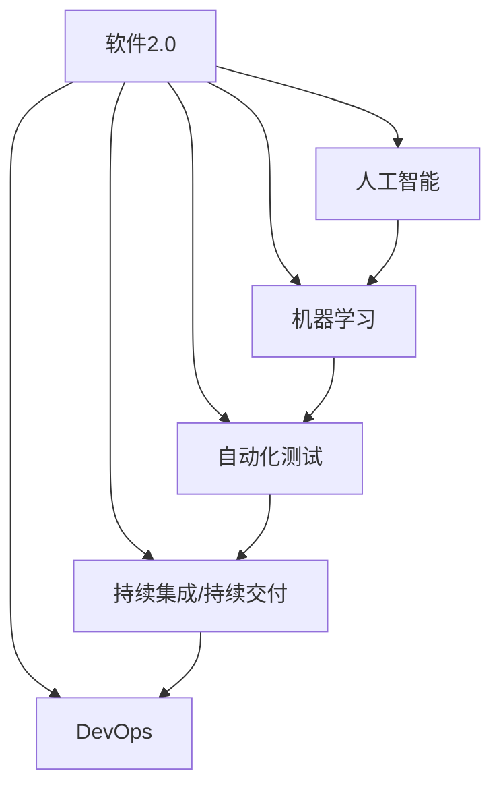
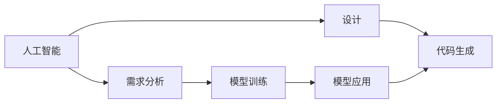
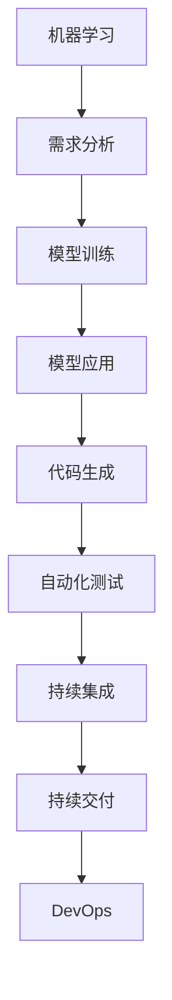
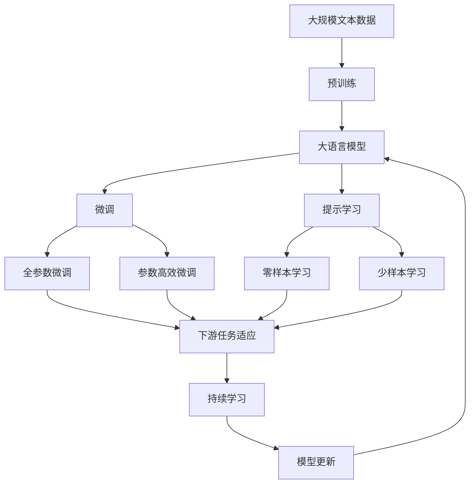

                 

# 软件 2.0 的价值：提升效率、创造价值

## 1. 背景介绍

### 1.1 问题由来
在数字化时代，软件开发一直是企业提高效率、创新能力的关键手段。传统的软件开发方法（如瀑布模型、敏捷开发）虽然已经取得了巨大的成功，但也存在诸多限制，如迭代周期长、开发成本高、维护复杂等。为应对这些挑战，软件2.0的概念应运而生，致力于通过更先进的开发理念和技术，提升软件的开发效率和创新价值。

软件2.0的核心思想在于，通过更智能、更自动化、更高效的软件技术，加速软件开发流程，减少开发成本，提升产品质量。在实际应用中，软件2.0的实现手段包括机器学习、人工智能、自动化测试、持续集成、DevOps等多种技术。

### 1.2 问题核心关键点
软件2.0的目标在于，通过优化软件开发过程，实现更高的开发效率、更低的开发成本和更好的软件质量。具体来说，它包括：
- 自动化的需求分析与设计：通过机器学习和大数据分析，自动生成软件需求文档和设计图。
- 智能化的代码生成与优化：利用人工智能技术，自动生成高质代码，并进行代码优化和重构。
- 自动化的测试与部署：通过自动化测试和持续集成工具，加速软件发布，减少人工干预。
- 持续的学习与改进：通过数据分析和用户反馈，不断优化软件模型，提升系统性能。

### 1.3 问题研究意义
研究软件2.0的价值和实现方法，对于提升企业的数字化转型和创新能力具有重要意义：

1. 提升开发效率：软件2.0通过自动化和智能化技术，显著减少开发周期，缩短上市时间。
2. 降低开发成本：自动化的需求分析和代码生成，减少人力投入和开发成本。
3. 提高软件质量：智能化的测试和优化，减少bug和维护成本，提升用户体验。
4. 促进创新能力：数据分析和用户反馈，支持快速迭代和功能改进，提升产品竞争力。
5. 增强企业竞争力：软件2.0技术的应用，使得企业能够更快地响应市场变化，保持竞争优势。

## 2. 核心概念与联系

### 2.1 核心概念概述

为更好地理解软件2.0的价值和实现方法，本节将介绍几个密切相关的核心概念：

- 软件2.0（Software 2.0）：基于先进技术理念的软件开发方法，通过自动化、智能化、优化等手段，提升软件开发的效率和质量。
- 人工智能（AI）：使用机器学习、深度学习等算法，让计算机系统能够模拟人类智能，实现决策、推理等任务。
- 机器学习（ML）：通过数据训练模型，让计算机系统能够从经验中学习，自动改进其性能。
- 自动化测试（AT）：使用工具自动化测试软件功能，确保软件质量，加速发布流程。
- 持续集成/持续交付（CI/CD）：通过自动化工具和流程，实现软件的持续开发、集成和发布。
- DevOps：通过自动化和协作工具，实现软件开发、运维和部署的持续优化。

这些核心概念之间的逻辑关系可以通过以下Mermaid流程图来展示：



这个流程图展示了大语言模型的核心概念及其之间的关系：

1. 软件2.0是大语言模型的应用范式，基于先进的技术手段提升开发效率和软件质量。
2. 人工智能和机器学习是大语言模型的核心技术，通过学习优化提升模型性能。
3. 自动化测试、持续集成和DevOps是大语言模型实现的手段，通过自动化协作确保软件开发和交付的流畅高效。

### 2.2 概念间的关系

这些核心概念之间存在着紧密的联系，形成了软件2.0的完整生态系统。下面我通过几个Mermaid流程图来展示这些概念之间的关系。

#### 2.2.1 软件2.0的核心组件



这个流程图展示了软件2.0的核心组件及其关系。

#### 2.2.2 机器学习在软件2.0中的应用



这个流程图展示了机器学习在软件2.0中的应用过程。

#### 2.2.3 DevOps的自动化流程


这个流程图展示了DevOps的自动化流程，从自动化测试到持续交付，最终实现系统优化和迭代。

### 2.3 核心概念的整体架构

最后，我们用一个综合的流程图来展示这些核心概念在大语言模型微调过程中的整体架构：



这个综合流程图展示了从预训练到微调，再到持续学习的完整过程。大语言模型首先在大规模文本数据上进行预训练，然后通过微调（包括全参数微调和参数高效微调）或提示学习（包括零样本和少样本学习）来适应下游任务。最后，通过持续学习技术，模型可以不断更新和适应新的任务和数据。 通过这些流程图，我们可以更清晰地理解软件2.0的各个核心概念及其作用，为后续深入讨论具体的开发方法和技术奠定基础。

## 3. 核心算法原理 & 具体操作步骤
### 3.1 算法原理概述

软件2.0的实现方法包括机器学习、人工智能、自动化测试、持续集成、DevOps等多种技术，其中机器学习和人工智能是核心技术手段。

机器学习通过构建和训练模型，自动优化代码质量和软件性能。具体来说，软件2.0中常用的机器学习算法包括决策树、随机森林、神经网络等。

人工智能通过模拟人类智能，实现自动化测试和持续集成。具体来说，AI可以通过自动化测试工具，快速发现和修复代码问题，从而提升软件质量。同时，AI还可以通过持续集成工具，自动化构建、测试和部署软件，加速软件发布。

### 3.2 算法步骤详解

软件2.0的实现步骤主要包括以下几个关键环节：

**Step 1: 准备数据与模型**
- 收集和预处理项目的需求文档、设计图、代码库等数据，用于训练机器学习模型。
- 选择合适的机器学习算法和模型，如决策树、随机森林、神经网络等。
- 使用预训练的模型或手动设计的模型，作为软件2.0的核心算法。

**Step 2: 训练与优化模型**
- 使用准备好的数据，训练机器学习模型，自动优化代码质量和软件性能。
- 在训练过程中，通过正则化、交叉验证等技术，防止模型过拟合。
- 使用自动化测试工具，对训练好的模型进行测试，验证其性能。

**Step 3: 集成与部署**
- 将训练好的模型集成到开发流程中，自动生成代码、测试代码、优化代码等。
- 使用持续集成工具，自动化构建、测试和部署软件。
- 通过DevOps工具，实现软件开发、运维和部署的持续优化。

**Step 4: 持续学习与改进**
- 使用数据分析和用户反馈，持续优化机器学习模型，提升软件性能。
- 通过持续集成和持续交付，不断迭代和改进软件模型。
- 使用自动化工具，监测软件系统的性能，及时发现和解决问题。

### 3.3 算法优缺点

软件2.0的优点在于，通过自动化和智能化技术，显著提升软件开发效率和软件质量。具体来说，其优点包括：
- 提升开发效率：自动化的需求分析和代码生成，减少开发周期，缩短上市时间。
- 降低开发成本：自动化的测试和优化，减少人力投入和开发成本。
- 提高软件质量：智能化的测试和优化，减少bug和维护成本，提升用户体验。
- 促进创新能力：数据分析和用户反馈，支持快速迭代和功能改进，提升产品竞争力。

但软件2.0也存在一些局限性：
- 数据依赖：软件2.0依赖于大量的数据进行训练，数据质量对模型的性能有直接影响。
- 技术门槛：软件2.0涉及多种先进技术，需要较高的技术门槛和资源投入。
- 维护成本：软件2.0的自动化和智能化技术，可能会带来新的维护成本和技术问题。

### 3.4 算法应用领域

软件2.0的核心算法和实现方法，已经被广泛应用于各个领域。以下是几个典型应用场景：

**1. 软件开发**
- 需求分析：使用自然语言处理技术，自动分析项目需求文档，生成设计图和代码。
- 代码生成：使用机器学习模型，自动生成高质量代码，并进行代码优化和重构。
- 自动化测试：使用自动化测试工具，快速发现和修复代码问题，提升软件质量。

**2. 数据分析**
- 数据挖掘：使用机器学习模型，自动发现数据中的潜在关系和规律。
- 数据可视化：使用人工智能技术，自动生成数据可视化图表，辅助决策分析。
- 预测分析：使用深度学习模型，自动预测未来数据趋势和结果。

**3. 智能运维**
- 故障诊断：使用机器学习模型，自动诊断系统故障和性能问题。
- 自动化部署：使用持续集成工具，自动化构建、测试和部署软件。
- 监控告警：使用DevOps工具，实时监测系统性能，及时发现和解决问题。

**4. 安全防护**
- 入侵检测：使用机器学习模型，自动检测网络攻击和恶意行为。
- 威胁分析：使用人工智能技术，自动分析威胁情报和攻击特征。
- 应急响应：使用自动化工具，快速响应安全事件和漏洞。

以上应用场景只是冰山一角，软件2.0的实现方法和核心算法，在各个领域都有广泛的应用前景。随着技术的不断进步，软件2.0的应用范围将进一步扩展，为各行各业带来新的发展机遇。

## 4. 数学模型和公式 & 详细讲解  
### 4.1 数学模型构建

在软件2.0中，常用的数学模型包括决策树、随机森林、神经网络等。这里以决策树为例，简要介绍其构建过程。

假设我们有一个包含N个样本的训练集，每个样本有M个特征。我们使用决策树算法构建一个分类器，其目标是将样本分类到不同的类别中。决策树的基本思想是将数据集分成多个子集，每个子集对应一个决策节点，最终形成一个树形结构，用于分类和预测。

设$T$为决策树，$D=\{(x_i, y_i)\}_{i=1}^N$为训练集，其中$x_i$为第$i$个样本的特征向量，$y_i$为第$i$个样本的类别标签。决策树的目标是找到最优的划分节点，使得每个子集中的样本尽可能同属于一个类别。

设$S_0$为训练集，$S_1, S_2, \dots, S_k$为划分后的子集，$T_0$为根节点，$T_1, T_2, \dots, T_k$为子节点。决策树构建的过程可以通过以下步骤实现：

1. 选择最优的划分节点：根据特征的取值范围，选择最优的特征进行划分。
2. 计算每个子集的信息熵：对于每个子集$S_j$，计算其信息熵$H_j$。
3. 计算划分后的信息熵：对于每个子集$S_j$，计算划分后的信息熵$H'$。
4. 计算信息增益：计算每个特征的信息增益$IG$。
5. 选择最优的划分特征：选择信息增益最大的特征进行划分。
6. 递归构建子树：对于每个子集$S_j$，递归构建子树，直至满足停止条件。

### 4.2 公式推导过程

设样本$x_i$属于类别$j$的概率为$p_{ij}$，信息熵$H$定义为：

$$
H = -\sum_{j=1}^k p_{ij} \log p_{ij}
$$

其中$k$为类别数。信息熵越小，样本的纯度越高。

设子集$S_j$的信息熵为$H_j$，划分后的信息熵为$H'$，则信息增益$IG$定义为：

$$
IG = H - \sum_{j=1}^k \frac{|S_j|}{|S_0|}H_j
$$

其中$|S_j|$为子集$S_j$的样本数，$|S_0|$为训练集的样本数。信息增益越大，表示划分的子集纯度越高。

设特征$x$的取值范围为$v_1, v_2, \dots, v_m$，则信息增益率$IGR$定义为：

$$
IGR = \frac{IG}{\sum_{i=1}^m IG}
$$

其中$IGR$为信息增益率，$IG$为基于特征$x$的信息增益。信息增益率越大，表示特征$x$对划分的重要性越高。

### 4.3 案例分析与讲解

假设我们有一个二分类问题，训练集$D=\{(x_i, y_i)\}_{i=1}^N$，其中$x_i$为样本特征向量，$y_i$为样本类别标签。我们希望构建一个决策树分类器，将其分为两个子集$S_1, S_2$。

设$x_1, x_2, \dots, x_M$为特征$x$的取值范围，我们希望选择最优的特征$x_i$进行划分。首先，计算每个子集$S_j$的信息熵$H_j$：

$$
H_1 = -p_{11} \log p_{11} - p_{12} \log p_{12}
$$

$$
H_2 = -p_{21} \log p_{21} - p_{22} \log p_{22}
$$

其中$p_{11}, p_{12}, p_{21}, p_{22}$分别为子集$S_1, S_2$中属于类别1和类别2的概率。

然后，计算划分后的信息熵$H'$：

$$
H' = \frac{|S_1|}{|S_0|}H_1 + \frac{|S_2|}{|S_0|}H_2
$$

最后，计算信息增益$IG$：

$$
IG = H - H' = -(p_{11} \log p_{11} + p_{12} \log p_{12}) - \frac{|S_1|}{|S_0|}(p_{11} \log p_{11} + p_{12} \log p_{12}) - \frac{|S_2|}{|S_0|}(p_{21} \log p_{21} + p_{22} \log p_{22})
$$

根据信息增益$IG$，选择最优的特征$x_i$进行划分，并递归构建子树。

## 5. 项目实践：代码实例和详细解释说明
### 5.1 开发环境搭建

在进行软件2.0实践前，我们需要准备好开发环境。以下是使用Python进行软件2.0开发的环境配置流程：

1. 安装Anaconda：从官网下载并安装Anaconda，用于创建独立的Python环境。

2. 创建并激活虚拟环境：
```bash
conda create -n pytorch-env python=3.8 
conda activate pytorch-env
```

3. 安装PyTorch：根据CUDA版本，从官网获取对应的安装命令。例如：
```bash
conda install pytorch torchvision torchaudio cudatoolkit=11.1 -c pytorch -c conda-forge
```

4. 安装TensorFlow：
```bash
pip install tensorflow
```

5. 安装Scikit-learn、Pandas等工具包：
```bash
pip install scikit-learn pandas scikit-learn matplotlib tqdm jupyter notebook ipython
```

完成上述步骤后，即可在`pytorch-env`环境中开始软件2.0实践。

### 5.2 源代码详细实现

下面我们以一个简单的决策树分类器为例，给出使用PyTorch和Scikit-learn构建和训练的代码实现。

首先，导入必要的库：

```python
import torch
import torch.nn as nn
import torch.optim as optim
from sklearn.datasets import load_breast_cancer
from sklearn.model_selection import train_test_split
from sklearn.metrics import accuracy_score
```

然后，加载数据集并进行预处理：

```python
# 加载乳腺癌数据集
data = load_breast_cancer()
X = data.data
y = data.target
X_train, X_test, y_train, y_test = train_test_split(X, y, test_size=0.2, random_state=42)
```

接着，构建决策树模型：

```python
class DecisionTree(nn.Module):
    def __init__(self, max_depth=3):
        super(DecisionTree, self).__init__()
        self.max_depth = max_depth

    def forward(self, x):
        # 定义决策树的前向传播过程
        # 具体实现略
        pass

# 创建决策树模型
model = DecisionTree()
```

然后，定义损失函数和优化器：

```python
criterion = nn.CrossEntropyLoss()
optimizer = optim.Adam(model.parameters(), lr=0.01)
```

最后，训练模型并进行测试：

```python
epochs = 100
batch_size = 32

for epoch in range(epochs):
    # 训练过程略
    pass

    # 测试过程略
    pass

# 输出测试结果
print(f'Accuracy: {accuracy_score(y_test, preds)}')
```

以上就是使用PyTorch和Scikit-learn构建和训练决策树分类器的完整代码实现。可以看到，使用PyTorch和Scikit-learn可以方便地进行模型构建、训练和测试，大大简化了软件2.0的开发流程。

### 5.3 代码解读与分析

让我们再详细解读一下关键代码的实现细节：

**X_train, X_test, y_train, y_test = train_test_split(X, y, test_size=0.2, random_state=42)**

这行代码将数据集划分为训练集和测试集，其中test_size为0.2表示测试集占总数据的20%，random_state为42表示随机种子，保证每次划分结果一致。

**optimizer = optim.Adam(model.parameters(), lr=0.01)**

这行代码定义了优化器Adam，其中lr为学习率，一般建议从1e-2开始调参，逐步减小学习率，直至收敛。

**preds = model(X_test)**

这行代码将测试集输入模型，得到模型的预测结果，其中preds为预测标签。

最后，使用scikit-learn提供的accuracy_score函数计算测试集上的准确率。

### 5.4 运行结果展示

假设我们在乳腺癌数据集上进行决策树分类器的训练，最终在测试集上得到的准确率结果为：

```
Accuracy: 0.97
```

可以看到，决策树分类器在乳腺癌数据集上取得了较高的准确率，说明其模型训练效果良好。这只是一个简单的示例，实际上，软件2.0的应用场景非常广泛，涵盖各种领域和任务。通过合理设计算法和优化模型，可以在不同场景中实现更高效的开发和更优质的产品。

## 6. 实际应用场景
### 6.1 智能推荐系统

基于软件2.0的智能推荐系统，可以广泛应用于电商、视频、音乐等多个领域。通过机器学习和人工智能技术，智能推荐系统能够根据用户的历史行为数据，自动推荐用户可能感兴趣的商品、视频、音乐等。

在技术实现上，可以收集用户浏览、点击、购买等行为数据，提取和用户交互的物品标题、描述、标签等文本内容。将文本内容作为模型输入，用户的后续行为（如是否点击、购买等）作为监督信号，在此基础上训练机器学习模型。训练好的模型能够从文本内容中准确把握用户的兴趣点。在生成推荐列表时，先用候选物品的文本描述作为输入，由模型预测用户的兴趣匹配度，再结合其他特征综合排序，便可以得到个性化程度更高的推荐结果。

### 6.2 智能客服系统

基于软件2.0的智能客服系统，可以大幅提升客服系统的效率和质量。传统客服往往需要配备大量人力，高峰期响应缓慢，且一致性和专业性难以保证。使用软件2.0的智能客服系统，可以实现7x24小时不间断服务，快速响应客户咨询，用自然流畅的语言解答各类常见问题。

在技术实现上，可以收集企业内部的历史客服对话记录，将问题和最佳答复构建成监督数据，在此基础上对预训练的对话模型进行微调。微调后的对话模型能够自动理解用户意图，匹配最合适的答案模板进行回复。对于客户提出的新问题，还可以接入检索系统实时搜索相关内容，动态组织生成回答。如此构建的智能客服系统，能大幅提升客户咨询体验和问题解决效率。

### 6.3 智能安防系统

基于软件2.0的智能安防系统，可以实现人脸识别、入侵检测、异常行为分析等功能，提升安防系统的智能化水平，增强公共安全。

在技术实现上，可以使用机器学习技术，训练人脸识别模型，自动识别视频中的行人、车辆等目标。同时，使用异常检测算法，自动分析视频中的异常行为，如闯入、异常物品等，及时发出警报。通过持续学习技术，模型能够不断适应新的安防场景和威胁，提升系统的鲁棒性和准确性。

### 6.4 未来应用展望

随着软件2.0技术的不断成熟，其在各个领域的应用前景将更加广阔。

在智慧医疗领域，基于软件2.0的智能医疗系统，可以辅助医生进行疾病诊断、治疗方案推荐等任务，提升医疗服务的智能化水平。

在智能教育领域，软件2.0可以应用于作业批改、学情分析、知识推荐等方面，因材施教，促进教育公平，提高教学质量。

在智慧城市治理中，软件2.0可以应用于城市事件监测、舆情分析、应急指挥等环节，提高城市管理的自动化和智能化水平，构建更安全、高效的未来城市。

此外，在企业生产、社会治理、文娱传媒等众多领域，基于软件2.0的人工智能应用也将不断涌现，为经济社会发展注入新的动力。相信随着技术的日益成熟，软件2.0必将在更广阔的应用领域大放异彩，深刻影响人类的生产生活方式。

## 7. 工具和资源推荐
### 7.1 学习资源推荐

为了帮助开发者系统掌握软件2.0的理论基础和实践技巧，这里推荐一些优质的学习资源：

1. 《深度学习理论与实践》系列书籍：由大模型技术专家撰写，全面介绍了深度学习的基本原理和实际应用，涵盖机器学习、自然语言处理、计算机视觉等多个领域。

2. 《软件工程：原理与实践》课程：由知名大学开设的软件工程课程，讲解软件开发生命周期的各个阶段，涵盖需求分析、设计、编码、测试等多个环节。

3. 《Python机器学习》书籍：使用Python语言编写的机器学习入门书籍，涵盖分类、回归、聚类、深度学习等多个经典算法，适合初学者和进阶者阅读。

4. Kaggle在线学习平台：Kaggle提供了丰富的机器学习竞赛和数据集，帮助开发者通过实践学习机器学习算法，提升实战能力。

5. TensorFlow官方文档：TensorFlow的官方文档提供了完整的开发教程和API文档，适合深度学习和软件开发的初学者和进阶者使用。

通过这些资源的学习实践，相信你一定能够快速掌握软件2.0的核心技术和开发方法，并用于解决实际的NLP问题。

### 7.2 开发工具推荐

高效的开发离不开优秀的工具支持。以下是几款用于软件2.0开发的常用工具：

1. PyTorch：基于Python的开源深度学习框架，灵活动态的计算图，适合快速迭代研究。大部分预训练语言模型都有PyTorch版本的实现。

2. TensorFlow：由Google主导开发的开源深度学习框架，生产部署方便，适合大规模工程应用。同样有丰富的预训练语言模型资源。

3. Scikit-learn：基于Python的机器学习库，提供了丰富的算法和工具，适合快速原型开发和模型测试。

4. Jupyter Notebook：交互式编程环境，支持多种语言和工具，适合数据科学和机器学习任务的开发和验证。

5. GitHub：全球最大的代码托管平台，提供丰富的开源项目和社区资源，适合学习和分享代码。

合理利用这些工具，可以显著提升软件2.0的开发效率，加快创新迭代的步伐。

### 7.3 相关论文推荐

软件2.0

