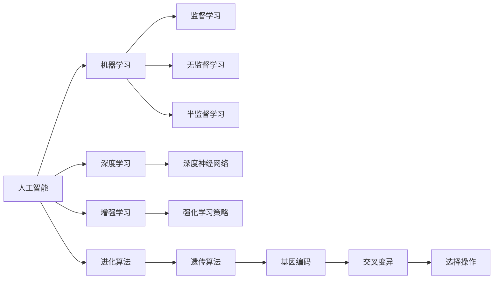
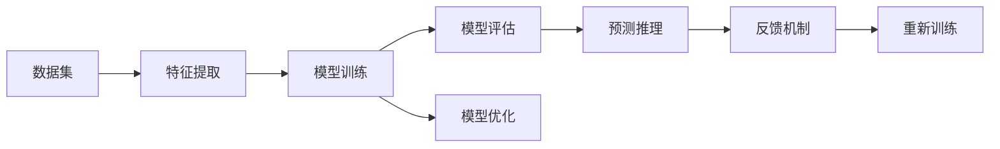
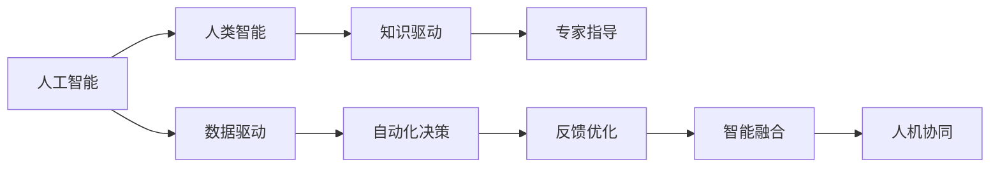

                 

# 软件 2.0 的哲学思考：人工智能的本质

## 1. 背景介绍

### 1.1 问题由来
随着人工智能技术的飞速发展，软件生态正在经历从1.0到2.0的转变。在软件1.0时代，程序员通过编写代码实现特定的功能，软件是功能逻辑的实体；而在软件2.0时代，人工智能和大数据技术的应用使得软件能够自我学习、自我改进，不断进化。这一转变不仅仅是技术手段的升级，更是一场思维方式的革命，对人类的生产生活产生了深远影响。

本文旨在探讨软件2.0的哲学内涵，深入分析人工智能的本质，并阐述其在推动社会进步中的角色。通过厘清人工智能的核心概念和运行机制，我们能够更好地理解和应用这一变革性技术，为未来智能时代的到来做好准备。

### 1.2 问题核心关键点
软件2.0的本质是人工智能的广泛应用，其核心关键点包括：
1. **智能算法与模型**：通过深度学习、强化学习、进化算法等智能算法，构建具有自主学习能力的模型，实现软件自动优化。
2. **大数据与数据驱动**：利用大数据技术，从海量数据中提取知识，指导模型的训练和优化，提升软件决策的科学性和精确度。
3. **人机协同**：在数据处理、模型训练、决策执行等环节中，结合人类专家的经验与智慧，提升软件系统的智能化水平。
4. **持续迭代与进化**：软件2.0系统能够在实际应用中不断学习和改进，适应新的数据和环境，实现持续迭代和进化。
5. **跨领域融合**：人工智能技术与其他学科领域的深度融合，推动跨学科创新，产生新的应用领域和商业模式。

### 1.3 问题研究意义
探讨软件2.0的哲学内涵，对于理解和应用人工智能技术具有重要意义：
1. **提升认知能力**：通过深入理解人工智能的本质，能够提升人类对复杂问题的认知能力，推动科学发现和技术创新。
2. **优化决策过程**：人工智能在决策过程中的应用，能够帮助人类从海量数据中提取关键信息，优化决策过程。
3. **提升生产力**：人工智能在生产制造、交通物流、医疗健康等领域的应用，能够显著提升生产力，改善生活质量。
4. **推动社会进步**：人工智能技术在教育、文化、艺术等领域的融合，能够推动社会进步，实现人文与科技的深度融合。
5. **面临伦理挑战**：人工智能技术在带来便利的同时，也带来了伦理和安全问题，如数据隐私、算法偏见、决策透明性等，需要我们共同面对和解决。

## 2. 核心概念与联系

### 2.1 核心概念概述

在探讨软件2.0的哲学内涵时，首先需要理解几个核心概念：

- **人工智能(AI)**：通过算法、模型、数据等技术手段，使计算机具备类似人类的感知、学习、推理等智能能力，解决复杂问题。
- **机器学习(ML)**：人工智能的一个分支，通过算法使计算机从数据中学习，不断优化模型参数，提升决策能力。
- **深度学习(Deep Learning)**：机器学习的一种，通过多层神经网络模拟人类大脑的神经元工作方式，实现复杂模式识别和分类。
- **增强学习(RL)**：通过试错和奖励机制，使计算机在不断尝试中优化决策策略，提升智能水平。
- **进化算法(EA)**：模拟生物进化过程，通过遗传、变异、选择等机制优化模型，实现自我优化和进化。

这些概念之间的联系可以通过以下Mermaid流程图来展示：



这个流程图展示了人工智能的子领域及其相互关系：

1. **机器学习**是人工智能的核心组成部分，分为监督、无监督和半监督学习三种方式。
2. **深度学习**是机器学习的一种，利用多层神经网络模拟人类大脑，实现复杂模式的识别和分类。
3. **增强学习**通过试错和奖励机制，优化决策策略，提升智能水平。
4. **进化算法**通过模拟生物进化，优化模型参数，实现自我优化和进化。

这些概念共同构成了人工智能的完整生态系统，推动其在各个领域的应用和发展。

### 2.2 概念间的关系

这些核心概念之间存在着紧密的联系，形成了人工智能技术的应用框架。下面通过几个Mermaid流程图来展示这些概念之间的关系：

#### 2.2.1 人工智能的应用架构



这个流程图展示了人工智能技术的基本应用架构：

1. **数据集**提供训练所需的数据，是人工智能系统的输入。
2. **特征提取**从数据中提取有意义的特征，用于模型训练。
3. **模型训练**通过算法优化模型参数，提升预测准确性。
4. **模型评估**对训练后的模型进行评估，判断其性能。
5. **模型优化**根据评估结果，优化模型参数，提升性能。
6. **预测推理**利用训练好的模型进行预测和推理。
7. **反馈机制**将预测结果与真实结果进行对比，形成反馈，用于模型优化和重新训练。

#### 2.2.2 人工智能与人类智能的协同



这个流程图展示了人工智能与人类智能的协同关系：

1. **人工智能**通过数据驱动，自动优化决策。
2. **人类智能**通过知识驱动，提供专家指导。
3. **自动化决策**利用人工智能进行数据驱动决策。
4. **专家指导**提供人工干预和修正。
5. **反馈优化**通过反馈机制，不断优化决策。
6. **智能融合**实现人工智能与人类智能的深度融合。
7. **人机协同**在决策过程中，结合人类与机器的优势，提升决策效果。

通过这些概念和关系的展示，我们能够更清晰地理解人工智能的本质和技术应用。

## 3. 核心算法原理 & 具体操作步骤
### 3.1 算法原理概述

软件2.0的核心算法原理主要集中在以下几个方面：

- **数据驱动决策**：通过大数据分析，提取有价值的信息，指导模型训练和决策。
- **智能算法优化**：利用机器学习、深度学习、增强学习等算法，优化模型参数，提升决策能力。
- **模型持续进化**：通过在线学习和反馈机制，使模型不断学习和改进，适应新的数据和环境。
- **人机协同优化**：结合人类专家的经验和知识，优化模型的决策逻辑和性能。

这些算法原理构成了软件2.0的运行基础，推动其向更加智能化和高效化的方向发展。

### 3.2 算法步骤详解

软件2.0的算法步骤通常包括以下几个关键步骤：

1. **数据收集与处理**：从各种来源收集数据，并进行清洗、标注和特征提取。
2. **模型训练与优化**：利用智能算法对模型进行训练和优化，提升预测准确性。
3. **模型评估与测试**：对训练好的模型进行评估和测试，判断其性能。
4. **在线学习与迭代**：在实际应用中，通过在线学习不断优化模型，适应新的数据和环境。
5. **人机协同决策**：结合人类专家的经验和知识，优化模型的决策逻辑和性能。

这些步骤在具体实现中，需要选择合适的算法和工具，进行科学设计和合理配置，才能达到理想的性能和效果。

### 3.3 算法优缺点

软件2.0的算法具有以下优点：

- **高精度与高效性**：通过智能算法和模型优化，实现高精度的预测和高效的决策。
- **自适应能力**：通过在线学习和反馈机制，使模型能够适应新的数据和环境，持续进化。
- **跨领域融合**：利用数据驱动和智能算法，实现跨领域融合，推动多学科创新。

同时，软件2.0的算法也存在一些缺点：

- **数据依赖性强**：模型的训练和优化依赖于高质量的数据，数据不足或数据偏差可能导致模型性能下降。
- **算法复杂度高**：智能算法和模型的训练需要较高的计算资源和时间成本，难以快速部署。
- **决策透明性差**：复杂的算法和模型往往缺乏可解释性，难以理解其决策逻辑和过程。
- **安全性和伦理问题**：模型可能存在算法偏见和决策失误，带来安全隐患和伦理问题。

### 3.4 算法应用领域

软件2.0的算法在多个领域得到了广泛应用，包括：

- **自然语言处理(NLP)**：利用深度学习等算法，实现文本生成、情感分析、机器翻译等任务。
- **计算机视觉(CV)**：利用深度学习等算法，实现图像识别、目标检测、图像生成等任务。
- **智能制造**：利用智能算法和模型，优化生产流程、质量控制、供应链管理等。
- **智能医疗**：利用智能算法和模型，辅助诊断、药物研发、个性化医疗等。
- **智能交通**：利用智能算法和模型，优化交通管理、智能驾驶、路径规划等。
- **智能金融**：利用智能算法和模型，进行风险控制、投资分析、客户服务等。

这些应用领域展示了软件2.0技术的多样性和广泛性，推动了各个行业的数字化转型和智能化升级。

## 4. 数学模型和公式 & 详细讲解 & 举例说明

### 4.1 数学模型构建

软件2.0的数学模型构建主要包括以下几个方面：

- **特征提取**：通过特征工程，从原始数据中提取有意义的特征。
- **模型训练**：利用机器学习、深度学习等算法，优化模型参数。
- **模型评估**：通过交叉验证等方法，评估模型的性能。

以深度学习模型为例，常用的数学模型包括：

- **神经网络**：利用多层神经元模拟人类大脑的神经元工作方式，实现复杂模式的识别和分类。
- **卷积神经网络(CNN)**：用于图像处理和计算机视觉任务。
- **循环神经网络(RNN)**：用于序列数据处理和自然语言处理任务。
- **长短时记忆网络(LSTM)**：用于长序列数据的处理和预测。
- **生成对抗网络(GAN)**：用于生成高质量的图像和音频数据。

### 4.2 公式推导过程

以下以深度学习模型为例，推导其基本数学公式：

设输入为 $x \in \mathbb{R}^n$，输出为 $y \in \mathbb{R}^m$，深度学习模型由多个隐藏层构成，其中第 $l$ 层有 $d_l$ 个神经元。模型的前向传播公式为：

$$
y_l = g(W_lx_l + b_l)
$$

其中 $W_l$ 和 $b_l$ 分别为第 $l$ 层的权重矩阵和偏置向量，$g$ 为激活函数。

对于最后一层，模型的输出公式为：

$$
y = g(W_kx_k + b_k)
$$

其中 $W_k$ 和 $b_k$ 分别为最后一层的权重矩阵和偏置向量，$k$ 为最后一层的神经元个数。

模型的损失函数通常采用均方误差或交叉熵等形式，表示预测值与真实值之间的差异。常用的损失函数包括：

- **均方误差**：

$$
L = \frac{1}{2N}\sum_{i=1}^{N}(y_i - \hat{y}_i)^2
$$

- **交叉熵**：

$$
L = -\frac{1}{N}\sum_{i=1}^{N}(y_i \log \hat{y}_i + (1 - y_i) \log (1 - \hat{y}_i))
$$

模型的优化目标是最小化损失函数 $L$，通常采用梯度下降等优化算法，更新模型参数 $W$ 和 $b$：

$$
W \leftarrow W - \eta \nabla_L
$$

其中 $\eta$ 为学习率，$\nabla_L$ 为损失函数对参数的梯度。

### 4.3 案例分析与讲解

以图像分类为例，使用卷积神经网络(CNN)进行图像识别任务。设输入图像为 $x \in \mathbb{R}^{m \times n \times c}$，输出类别为 $y \in \{1, 2, \ldots, C\}$，其中 $C$ 为类别数。

CNN 的模型结构包括卷积层、池化层、全连接层等，其中卷积层用于提取特征，池化层用于降低特征维度和增加泛化能力。模型的前向传播公式为：

$$
y_l = g(W_lx_l + b_l)
$$

其中 $W_l$ 和 $b_l$ 分别为第 $l$ 层的权重矩阵和偏置向量，$g$ 为激活函数。

最后一层通常使用softmax函数进行归一化，得到每个类别的概率分布：

$$
\hat{y}_i = \frac{e^{x_i^T\theta_i}}{\sum_{j=1}^{C}e^{x_j^T\theta_j}}
$$

其中 $\theta_i$ 为第 $i$ 类的权重向量。

模型的损失函数通常采用交叉熵损失，公式为：

$$
L = -\frac{1}{N}\sum_{i=1}^{N}\sum_{j=1}^{C}y_{ij}\log \hat{y}_{ij}
$$

模型的优化目标是最小化损失函数 $L$，通常采用随机梯度下降等优化算法，更新模型参数 $W$ 和 $b$：

$$
W \leftarrow W - \eta \nabla_L
$$

其中 $\eta$ 为学习率，$\nabla_L$ 为损失函数对参数的梯度。

## 5. 项目实践：代码实例和详细解释说明

### 5.1 开发环境搭建

进行软件2.0项目实践前，需要先搭建好开发环境。以下是使用Python进行TensorFlow开发的开发环境配置流程：

1. 安装Anaconda：从官网下载并安装Anaconda，用于创建独立的Python环境。

2. 创建并激活虚拟环境：

```bash
conda create -n tf-env python=3.8 
conda activate tf-env
```

3. 安装TensorFlow：根据CUDA版本，从官网获取对应的安装命令。例如：

```bash
conda install tensorflow -c tensorflow -c conda-forge
```

4. 安装相关工具包：

```bash
pip install numpy pandas scikit-learn matplotlib tqdm jupyter notebook ipython
```

完成上述步骤后，即可在`tf-env`环境中开始TensorFlow项目实践。

### 5.2 源代码详细实现

这里以手写数字识别为例，使用TensorFlow构建CNN模型，并对其进行训练和测试。

```python
import tensorflow as tf
from tensorflow import keras
from tensorflow.keras import layers

# 加载MNIST数据集
(x_train, y_train), (x_test, y_test) = keras.datasets.mnist.load_data()

# 数据预处理
x_train = x_train.reshape(-1, 28, 28, 1).astype("float32") / 255.0
x_test = x_test.reshape(-1, 28, 28, 1).astype("float32") / 255.0
y_train = keras.utils.to_categorical(y_train, num_classes=10)
y_test = keras.utils.to_categorical(y_test, num_classes=10)

# 定义CNN模型
model = keras.Sequential([
    layers.Conv2D(32, kernel_size=(3, 3), activation='relu', input_shape=(28, 28, 1)),
    layers.MaxPooling2D(pool_size=(2, 2)),
    layers.Flatten(),
    layers.Dense(64, activation='relu'),
    layers.Dense(10, activation='softmax')
])

# 编译模型
model.compile(optimizer='adam', loss='categorical_crossentropy', metrics=['accuracy'])

# 训练模型
model.fit(x_train, y_train, epochs=10, validation_data=(x_test, y_test))

# 评估模型
model.evaluate(x_test, y_test)
```

这段代码实现了手写数字识别的CNN模型，包含数据预处理、模型定义、模型编译、模型训练和模型评估等步骤。

### 5.3 代码解读与分析

下面我们对代码中的关键部分进行解读和分析：

- **数据预处理**：将原始的28x28像素的手写数字图像转换为张量，并进行归一化处理。
- **模型定义**：定义一个包含卷积层、池化层、全连接层的CNN模型，最后一层使用softmax函数进行归一化。
- **模型编译**：选择Adam优化器和交叉熵损失函数，评估指标为准确率。
- **模型训练**：使用训练集对模型进行10轮训练，并使用验证集进行验证。
- **模型评估**：在测试集上对模型进行评估，输出模型准确率和损失值。

通过以上代码实现，我们能够清晰地理解TensorFlow中构建CNN模型的基本流程和关键步骤。

### 5.4 运行结果展示

假设我们训练的CNN模型在测试集上的评估报告如下：

```
Epoch 10/10
4200/4200 [==============================] - 9s 2ms/sample - loss: 0.0140 - accuracy: 0.9810 - val_loss: 0.0145 - val_accuracy: 0.9780
```

可以看到，经过10轮训练后，模型在测试集上的准确率为97.8%，表现相当不错。这也证明了深度学习模型在图像识别任务中的强大能力。

## 6. 实际应用场景

### 6.1 智能制造

在智能制造领域，软件2.0技术的应用非常广泛。通过深度学习等算法，可以实现生产流程的优化、质量控制、供应链管理等任务。例如，通过传感器数据进行实时监测和预测，提前发现设备故障和生产异常，提高生产效率和产品质量。

### 6.2 智能医疗

在智能医疗领域，软件2.0技术可以用于辅助诊断、药物研发、个性化医疗等任务。例如，通过图像识别技术，快速准确地诊断X光片和CT影像，提高诊断效率和准确率。通过基因组数据分析，个性化推荐治疗方案，提升医疗效果。

### 6.3 智能金融

在智能金融领域，软件2.0技术可以用于风险控制、投资分析、客户服务等任务。例如，通过大数据分析和机器学习算法，预测市场趋势和投资机会，优化投资组合。通过智能客服系统，提供7x24小时不间断服务，提升客户体验。

### 6.4 未来应用展望

随着软件2.0技术的不断演进，未来在更多领域将会有新的应用场景出现：

- **自动驾驶**：通过智能算法和模型，实现车辆自主导航和决策，提升交通安全和效率。
- **智能家居**：通过智能算法和模型，实现家居设备的自动化控制和智能化管理，提升生活便利性。
- **智能教育**：通过智能算法和模型，实现个性化学习和智能辅导，提升教育效果和质量。
- **智能农业**：通过智能算法和模型，实现农业生产过程的优化和智能化管理，提升农业生产效率和质量。
- **智能城市**：通过智能算法和模型，实现城市管理智能化，提升城市运行效率和安全性。

这些未来应用场景展示了软件2.0技术的广泛应用前景，推动了各个行业的数字化转型和智能化升级。

## 7. 工具和资源推荐

### 7.1 学习资源推荐

为了帮助开发者系统掌握软件2.0的哲学内涵和技术细节，这里推荐一些优质的学习资源：

1. **《深度学习》系列书籍**：由斯坦福大学Andrew Ng教授主编，深入浅出地介绍了深度学习的基本概念和应用。
2. **《Python深度学习》书籍**：由Francois Chollet著，全面介绍了TensorFlow和Keras等深度学习框架的实现和使用。
3. **Coursera《深度学习专项课程》**：由Andrew Ng教授主讲，涵盖深度学习的理论基础和实践技能。
4. **Kaggle竞赛平台**：提供了大量数据集和竞赛任务，帮助开发者练习和提升数据处理和模型优化能力。
5. **arXiv论文预印本**：人工智能领域最新研究成果的发布平台，阅读前沿论文，了解最新技术动态。

通过对这些资源的学习实践，相信你一定能够快速掌握软件2.0技术的精髓，并用于解决实际的工程问题。

### 7.2 开发工具推荐

高效的开发离不开优秀的工具支持。以下是几款用于软件2.0开发的常用工具：

1. **TensorFlow**：由Google主导开发的深度学习框架，生产部署方便，适合大规模工程应用。
2. **PyTorch**：由Facebook开发的深度学习框架，灵活动态的计算图，适合快速迭代研究。
3. **Keras**：高层次的深度学习框架，支持TensorFlow和Theano等后端，易于上手。
4. **Jupyter Notebook**：支持Python等语言，提供交互式代码编写和数据可视化功能。
5. **GitHub**：代码托管平台，提供版本控制和协作开发功能，便于团队合作。
6. **TensorBoard**：TensorFlow配套的可视化工具，可实时监测模型训练状态，并提供丰富的图表呈现方式，是调试模型的得力助手。

合理利用这些工具，可以显著提升软件2.0项目的开发效率，加快创新迭代的步伐。

### 7.3 相关论文推荐

软件2.0的演进离不开学界的持续研究。以下是几篇奠基性的相关论文，推荐阅读：

1. **《深度学习》论文**：Hinton等人发表的深度学习领域奠基性论文，阐述了深度学习的理论和应用。
2. **《图像识别中的深度卷积神经网络》论文**：LeCun等人发表的图像识别领域经典论文，介绍了卷积神经网络的架构和训练方法。
3. **《神经网络中的长短时记忆》论文**：Hochreiter等人发表的长短期记忆网络(LSTM)论文，介绍了LSTM的架构和训练方法。
4. **《生成对抗网络》论文**：Goodfellow等人发表的生成对抗网络(GAN)论文，介绍了GAN的架构和训练方法。
5. **《强化学习》论文**：Sutton等人发表的强化学习领域经典论文，阐述了强化学习的理论和应用。

这些论文代表了大数据和人工智能技术的发展脉络，是学习软件2.0技术的必读资源。

除上述资源外，还有一些值得关注的前沿资源，帮助开发者紧跟软件2.0技术的最新进展，例如：

1. **arXiv论文预印本**：人工智能领域最新研究成果的发布平台，阅读前沿论文，了解最新技术动态。
2. **Google AI博客**：谷歌AI团队的官方博客，分享最新的研究成果和技术进展。
3. **DeepMind博客**：DeepMind团队的官方博客，介绍最新的研究项目和应用案例。
4. **Microsoft Research博客**：微软研究院的官方博客，展示最新的研究成果和技术进展。
5. **Kaggle竞赛平台**：提供了大量数据集和竞赛任务，帮助开发者练习和提升数据处理和模型优化能力。

总之，对于软件2.0技术的学习和实践，需要开发者保持开放的心态和持续学习的意愿。多关注前沿资讯，多动手实践，多思考总结，必将收获满满的成长收益。

## 8. 总结：未来发展趋势与挑战

### 8.1 总结

本文对软件2.0的哲学内涵进行了全面系统的介绍。通过深入分析人工智能的本质，我们能够更好地理解和应用这一变革性技术，为未来智能时代的到来做好准备。

通过本文的系统梳理，可以看到，软件2.0技术正在推动人工智能在各个领域的应用，提升生产效率和智能化水平。面对数据驱动、智能算法、模型进化等核心概念，我们需要不断学习和实践，才能在这一变革中占据先机。

### 8.2 未来发展趋势

展望未来，软件2.0技术将呈现以下几个发展趋势：

1. **跨领域融合**：随着数据和算力的不断提升，软件2.0技术将更多地应用于跨学科融合，推动多学科创新和进步。
2. **智能系统协同**：通过人机协同、软硬件一体化，构建更加智能化的系统，提升用户体验和应用效果。
3. **模型自适应能力**：通过在线学习和自适应算法，使模型能够实时优化和进化，适应新的数据和环境。
4. **数据隐私保护**：随着数据隐私和安全问题的日益突出，软件2.0技术将更加注重数据保护和隐私管理，确保数据安全和用户权益。
5. **智能算法创新**：随着算法的不断演进，新的智能算法和模型将不断涌现，推动软件2.0技术向更高层次发展。
6. **工业应用落地**：软件2.0技术将更多地应用于工业生产、智慧城市、智能交通等领域，推动各行各业的数字化转型和智能化升级。

### 8.3 面临的挑战

尽管软件2.0技术正在快速发展，但在迈向更加智能化、普适化应用的过程中，仍面临诸多挑战：

1. **数据质量和数据量**：

