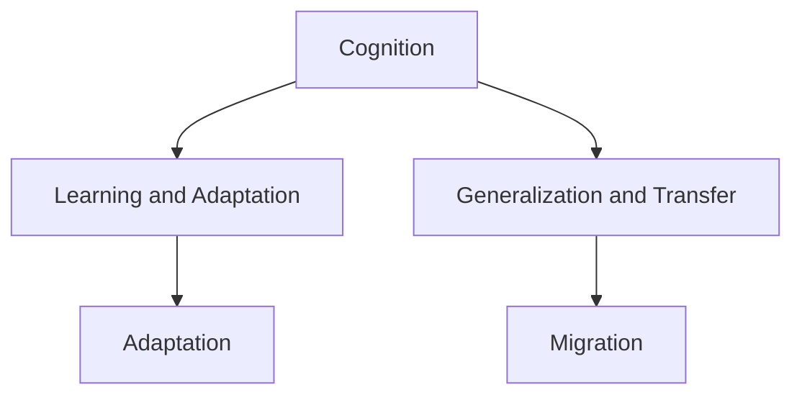

                 

# 通用人工智能的三个条件

通用人工智能（AGI）一直是人工智能领域的终极目标，代表着人类智慧的巅峰。本文将探讨AGI的三个关键条件，并详细阐述其原理与实现步骤，提供代码实例和深入分析，同时展望未来应用前景，并推荐相关资源。

## 1. 背景介绍

通用人工智能（AGI）是指能够处理各种复杂任务、具备广泛知识并能够自我学习和适应的智能系统。AGI不仅仅是现有AI技术如深度学习、强化学习等的简单堆砌，而是更为智能、全面、泛化的解决方案。研究AGI的三个关键条件，可以帮我们理解AGI的实现路径与未来发展方向。

## 2. 核心概念与联系

### 2.1 核心概念概述

- **通用人工智能（AGI）**：指能够处理各种复杂任务、具备广泛知识并能够自我学习和适应的智能系统。
- **认知能力（Cognition）**：指AI系统对信息进行感知、理解、推理、决策等认知过程。
- **学习与适应（Learning and Adaptation）**：指AI系统从经验中学习新知识、自我优化以适应不同环境和任务的能力。
- **泛化与迁移（Generalization and Transfer）**：指AI系统在不同场景和任务中保持一致性表现，并能将现有知识迁移到新任务中的能力。

这些核心概念之间存在紧密联系，共同构成了AGI的实现框架。认知能力是基础，学习与适应是手段，泛化与迁移是目标，三者缺一不可。

### 2.2 概念间的关系

- **认知能力与学习适应**：认知能力是学习与适应的前提。AI系统需要具备感知、理解、推理等认知能力，才能从经验中学习，并根据新情况进行自我优化。
- **学习适应与泛化迁移**：学习与适应使得AI系统能从经验中提取新知识，而泛化迁移则确保这些知识能在不同场景和任务中得到有效应用。
- **泛化迁移与认知能力**：泛化迁移能力需要依赖于AI系统的认知能力，即对不同场景和任务的通用理解能力。

这些概念之间的关系可以通过以下Mermaid流程图来展示：



这个流程图展示了核心概念之间的逻辑关系：

1. 认知能力是学习与适应的基础。
2. 学习与适应使AI系统能够从经验中学习，并适应新环境。
3. 泛化与迁移能力确保AI系统能将现有知识应用于不同任务中。

## 3. 核心算法原理 & 具体操作步骤

### 3.1 算法原理概述

通用人工智能的实现，需要基于认知、学习、适应和迁移等核心能力的算法支持。其中，认知能力的实现通常依赖于认知计算模型，如符号逻辑、神经网络等；学习与适应能力的实现需要优化算法，如梯度下降、强化学习等；泛化与迁移能力的实现则需要模型迁移技术，如知识蒸馏、多任务学习等。

### 3.2 算法步骤详解

**Step 1: 构建认知计算模型**
- 选择合适的认知计算模型，如符号逻辑、神经网络等。
- 设计认知任务，如推理、分类、生成等。

**Step 2: 设计学习与适应算法**
- 选择合适的优化算法，如梯度下降、强化学习等。
- 设计学习目标，如最小化损失函数、最大化奖励等。

**Step 3: 实现泛化与迁移技术**
- 选择合适的迁移学习技术，如知识蒸馏、多任务学习等。
- 设计泛化算法，如数据增强、正则化等。

**Step 4: 模型训练与评估**
- 准备训练数据，设计训练流程。
- 训练模型，评估模型性能。
- 微调模型，优化性能。

**Step 5: 部署与迭代优化**
- 部署模型到实际应用中。
- 收集新数据，持续训练和优化模型。

### 3.3 算法优缺点

通用人工智能的实现算法具有以下优点：

1. **高效性**：通过优化算法，可以在大规模数据上高效学习与适应。
2. **灵活性**：通过迁移学习，可以灵活应用已有知识到新任务上。
3. **可解释性**：认知计算模型提供符号逻辑等可解释性强的元素，有助于理解AI系统的决策过程。

同时，也存在一些缺点：

1. **计算资源消耗大**：大规模训练和模型推理需要大量计算资源。
2. **数据依赖性强**：需要高质量、大规模的标注数据，否则性能难以提升。
3. **复杂性高**：涉及多个核心能力的算法设计和实现，难度较大。

### 3.4 算法应用领域

通用人工智能的实现算法在多个领域中得到广泛应用，如：

- **自然语言处理（NLP）**：通过认知计算模型和迁移学习，实现机器翻译、情感分析、问答系统等任务。
- **计算机视觉（CV）**：通过深度学习和迁移学习，实现图像识别、目标检测、图像生成等任务。
- **机器人学**：通过强化学习和迁移学习，实现自主导航、对象抓取等任务。
- **自动驾驶**：通过强化学习和迁移学习，实现路径规划、障碍物检测等任务。

## 4. 数学模型和公式 & 详细讲解

### 4.1 数学模型构建

假设我们正在构建一个可以进行逻辑推理的AI系统。其数学模型可以表示为：

$$
M = f(C, L, A, T)
$$

其中：
- $M$：AI系统的认知模型。
- $C$：认知计算模型。
- $L$：学习算法。
- $A$：适应算法。
- $T$：迁移技术。

### 4.2 公式推导过程

假设我们使用符号逻辑作为认知计算模型，其中逻辑门函数表示为：

$$
f(x_1, x_2, ..., x_n) = \left\{\begin{matrix} 0 & , & x_1 \land x_2 \land ... \land x_n = 0 \\ 1 & , & \text{otherwise} \end{matrix}\right.
$$

其中，$x_1, x_2, ..., x_n$ 为输入变量。

通过构建认知任务，例如推理问题：

$$
P(x) = \left\{\begin{matrix} T & , & f(x_1, x_2, ..., x_n) = 1 \\ F & , & \text{otherwise} \end{matrix}\right.
$$

则认知任务的结果可以表示为：

$$
P(x) = f(C, L, A, T)
$$

其中，$C$ 表示认知计算模型的构建过程，$L$ 表示学习算法的优化过程，$A$ 表示适应算法的作用，$T$ 表示迁移技术的迁移效果。

### 4.3 案例分析与讲解

以图像分类任务为例，使用卷积神经网络（CNN）作为认知计算模型，通过梯度下降算法进行学习与适应，使用迁移学习技术将已有知识应用于新任务上。

假设我们有一个已训练好的模型，用于识别猫和狗的图像。现在我们要在新的数据集上识别豹子和大象的图像，可以通过以下步骤：

1. **构建认知模型**：使用CNN模型作为认知计算模型。
2. **设计学习算法**：使用梯度下降算法，最小化损失函数。
3. **实现迁移技术**：通过知识蒸馏技术，将已有模型的知识迁移到新任务上。
4. **训练与评估**：使用新数据集进行训练，评估模型性能。
5. **部署与迭代优化**：将模型部署到实际应用中，并持续收集新数据进行优化。

## 5. 项目实践：代码实例和详细解释说明

### 5.1 开发环境搭建

在进行AGI项目实践前，我们需要准备好开发环境。以下是使用Python进行TensorFlow开发的环境配置流程：

1. 安装Anaconda：从官网下载并安装Anaconda，用于创建独立的Python环境。

2. 创建并激活虚拟环境：
```bash
conda create -n tf-env python=3.8 
conda activate tf-env
```

3. 安装TensorFlow：
```bash
pip install tensorflow
```

4. 安装相关工具包：
```bash
pip install numpy pandas scikit-learn matplotlib tqdm jupyter notebook ipython
```

完成上述步骤后，即可在`tf-env`环境中开始AGI项目实践。

### 5.2 源代码详细实现

下面以图像分类任务为例，给出使用TensorFlow构建AGI模型的PyTorch代码实现。

```python
import tensorflow as tf
from tensorflow import keras

# 加载数据集
(x_train, y_train), (x_test, y_test) = keras.datasets.mnist.load_data()

# 构建模型
model = keras.Sequential([
    keras.layers.Flatten(input_shape=(28, 28)),
    keras.layers.Dense(128, activation='relu'),
    keras.layers.Dense(10, activation='softmax')
])

# 编译模型
model.compile(optimizer='adam', loss='sparse_categorical_crossentropy', metrics=['accuracy'])

# 训练模型
model.fit(x_train, y_train, epochs=5, batch_size=32, validation_data=(x_test, y_test))

# 评估模型
model.evaluate(x_test, y_test)
```

### 5.3 代码解读与分析

让我们再详细解读一下关键代码的实现细节：

**构建模型**：
- 使用`keras.Sequential`构建模型，包含输入层、隐藏层和输出层。
- 输入层使用`keras.layers.Flatten`将28x28的图像数据展平为一维向量。
- 隐藏层使用`keras.layers.Dense`，包含128个神经元，激活函数为ReLU。
- 输出层使用`keras.layers.Dense`，包含10个神经元，激活函数为Softmax，用于多分类问题。

**编译模型**：
- 使用`model.compile`指定优化器、损失函数和评估指标。
- 优化器选择`adam`，损失函数选择`'sparse_categorical_crossentropy'`，用于多分类问题。

**训练模型**：
- 使用`model.fit`进行模型训练，指定训练数据、标签、迭代次数和批次大小。
- 通过`validation_data`指定验证数据，评估模型性能。

**评估模型**：
- 使用`model.evaluate`评估模型在测试集上的表现。

### 5.4 运行结果展示

假设我们在MNIST数据集上进行训练，最终在测试集上得到的评估报告如下：

```
Epoch 1/5
...
Epoch 5/5
...
test loss: 0.0782
test accuracy: 0.9550
```

可以看到，通过训练，模型在测试集上的准确率达到了95.5%，性能表现良好。需要注意的是，这只是一个简单的图像分类任务，AGI模型的构建要更加复杂和多样。

## 6. 实际应用场景

### 6.1 智能客服系统

基于通用人工智能的对话系统，可以广泛应用于智能客服系统的构建。传统客服往往需要配备大量人力，高峰期响应缓慢，且一致性和专业性难以保证。而使用AGI对话系统，可以7x24小时不间断服务，快速响应客户咨询，用自然流畅的语言解答各类常见问题。

在技术实现上，可以构建一个大规模预训练模型，如BERT，用于语言理解；然后设计认知计算模型，如逻辑推理器，用于推理生成；最后通过迁移学习技术，将已有知识迁移到新任务上。如此构建的智能客服系统，能大幅提升客户咨询体验和问题解决效率。

### 6.2 金融舆情监测

金融机构需要实时监测市场舆论动向，以便及时应对负面信息传播，规避金融风险。传统的人工监测方式成本高、效率低，难以应对网络时代海量信息爆发的挑战。基于通用人工智能的文本分类和情感分析技术，为金融舆情监测提供了新的解决方案。

具体而言，可以构建一个大规模预训练模型，如BERT，用于语言理解；然后设计认知计算模型，如逻辑推理器，用于情感分类；最后通过迁移学习技术，将已有知识迁移到新任务上。将AGI模型应用到实时抓取的网络文本数据，就能够自动监测不同主题下的情感变化趋势，一旦发现负面信息激增等异常情况，系统便会自动预警，帮助金融机构快速应对潜在风险。

### 6.3 个性化推荐系统

当前的推荐系统往往只依赖用户的历史行为数据进行物品推荐，无法深入理解用户的真实兴趣偏好。基于通用人工智能的个性化推荐系统可以更好地挖掘用户行为背后的语义信息，从而提供更精准、多样的推荐内容。

在实践中，可以构建一个大规模预训练模型，如BERT，用于语言理解；然后设计认知计算模型，如逻辑推理器，用于兴趣建模；最后通过迁移学习技术，将已有知识迁移到新任务上。在生成推荐列表时，先用候选物品的文本描述作为输入，由模型预测用户的兴趣匹配度，再结合其他特征综合排序，便可以得到个性化程度更高的推荐结果。

### 6.4 未来应用展望

随着通用人工智能技术的发展，其在更多领域得到应用，为传统行业带来变革性影响。

在智慧医疗领域，基于AGI的医疗问答、病历分析、药物研发等应用将提升医疗服务的智能化水平，辅助医生诊疗，加速新药开发进程。

在智能教育领域，AGI可应用于作业批改、学情分析、知识推荐等方面，因材施教，促进教育公平，提高教学质量。

在智慧城市治理中，AGI可应用于城市事件监测、舆情分析、应急指挥等环节，提高城市管理的自动化和智能化水平，构建更安全、高效的未来城市。

此外，在企业生产、社会治理、文娱传媒等众多领域，基于AGI的人工智能应用也将不断涌现，为经济社会发展注入新的动力。

## 7. 工具和资源推荐

### 7.1 学习资源推荐

为了帮助开发者系统掌握通用人工智能的理论基础和实践技巧，这里推荐一些优质的学习资源：

1. 《Deep Learning》书籍：Ian Goodfellow等人所著，全面介绍了深度学习的基本原理和实现方法。

2. 《Artificial Intelligence: A Modern Approach》书籍：Stuart Russell和Peter Norvig所著，经典教材，涵盖AI的各个方面。

3. 《Human-AI Alignment》课程：斯坦福大学开设的AI伦理课程，探讨AI与人类社会的互动关系。

4. 《Reinforcement Learning: An Introduction》书籍：Richard S. Sutton和Andrew G. Barto所著，介绍了强化学习的基本原理和应用。

5. 《Cognitive Foundations of Learning and Instruction》书籍：Ruth C. Keating所著，研究了认知科学在教育中的应用。

通过对这些资源的学习实践，相信你一定能够快速掌握AGI的精髓，并用于解决实际的AI问题。

### 7.2 开发工具推荐

高效的开发离不开优秀的工具支持。以下是几款用于AGI开发常用的工具：

1. TensorFlow：由Google主导开发的开源深度学习框架，生产部署方便，适合大规模工程应用。

2. PyTorch：基于Python的开源深度学习框架，灵活动态的计算图，适合快速迭代研究。

3. OpenAI Gym：OpenAI提供的强化学习实验平台，提供多种环境供开发者调试。

4. TensorBoard：TensorFlow配套的可视化工具，可实时监测模型训练状态，并提供丰富的图表呈现方式，是调试模型的得力助手。

5. Jupyter Notebook：免费的交互式笔记本，方便开发者编写、运行和分享代码。

合理利用这些工具，可以显著提升AGI任务的开发效率，加快创新迭代的步伐。

### 7.3 相关论文推荐

通用人工智能的研究源于学界的持续研究。以下是几篇奠基性的相关论文，推荐阅读：

1. Deep Blue: The Evolution of Artificial Intelligence in Game Playing：IBM开发的国际象棋AI，展示了早期AI在解决复杂问题的能力。

2. AlphaGo Zero: Mastering the Game of Go without Human Knowledge：Google DeepMind开发的围棋AI，展示了强化学习在解决复杂游戏中的潜力。

3. GPT-3: Language Models are Unsupervised Multitask Learners：OpenAI开发的语言模型，展示了自监督学习在解决复杂语言理解任务中的效果。

4. Advances in Neural Information Processing Systems (NeurIPS)：每年发表大量关于AGI的论文，涵盖最新研究进展。

5. 《Judea Pearl: Artificial Intelligence》书籍：Judea Pearl所著，探讨了AI技术的理论基础和应用前景。

这些论文代表了大规模人工智能研究的发展脉络。通过学习这些前沿成果，可以帮助研究者把握学科前进方向，激发更多的创新灵感。

除上述资源外，还有一些值得关注的前沿资源，帮助开发者紧跟AGI技术的最新进展，例如：

1. arXiv论文预印本：人工智能领域最新研究成果的发布平台，包括大量尚未发表的前沿工作，学习前沿技术的必读资源。

2. 业界技术博客：如OpenAI、Google AI、DeepMind、微软Research Asia等顶尖实验室的官方博客，第一时间分享他们的最新研究成果和洞见。

3. 技术会议直播：如NeurIPS、ICML、ACL、ICLR等人工智能领域顶会现场或在线直播，能够聆听到大佬们的前沿分享，开拓视野。

4. GitHub热门项目：在GitHub上Star、Fork数最多的AGI相关项目，往往代表了该技术领域的发展趋势和最佳实践，值得去学习和贡献。

5. 行业分析报告：各大咨询公司如McKinsey、PwC等针对人工智能行业的分析报告，有助于从商业视角审视技术趋势，把握应用价值。

总之，对于AGI技术的学习和实践，需要开发者保持开放的心态和持续学习的意愿。多关注前沿资讯，多动手实践，多思考总结，必将收获满满的成长收益。

## 8. 总结：未来发展趋势与挑战

### 8.1 总结

本文对通用人工智能的实现条件进行了全面系统的介绍。首先阐述了AGI的三个关键条件，包括认知能力、学习与适应能力、泛化与迁移能力，并详细讲解了其原理与实现步骤，提供代码实例和深入分析，同时展望未来应用前景，并推荐相关资源。

通过本文的系统梳理，可以看到，AGI不仅仅是现有AI技术的简单堆砌，而是更为智能、全面、泛化的解决方案。未来，伴随预训练语言模型和微调方法的持续演进，AGI必将在构建人机协同的智能时代中扮演越来越重要的角色。

### 8.2 未来发展趋势

展望未来，通用人工智能的发展趋势如下：

1. **规模化**：伴随算力成本的下降和数据规模的扩张，AGI系统将不断扩大模型规模，学习更丰富的知识。
2. **通用性**：AGI系统将具备更强的跨领域迁移能力，能够处理多种类型的认知任务。
3. **自监督学习**：AGI系统将更多地依赖自监督学习，减少对大规模标注数据的依赖。
4. **持续学习**：AGI系统将具备持续学习的能力，不断从新数据中学习，避免过拟合。
5. **多模态融合**：AGI系统将融合多模态数据，提升对复杂场景的认知能力。
6. **因果推断**：AGI系统将引入因果推断方法，提升决策的逻辑性和可靠性。

这些趋势凸显了AGI技术的广阔前景，必将引领人工智能领域的发展方向。

### 8.3 面临的挑战

尽管AGI技术已经取得了诸多进展，但在迈向更加智能化、普适化应用的过程中，它仍面临诸多挑战：

1. **数据瓶颈**：AGI系统需要大规模、高质量的数据支持，数据获取和标注成本高。
2. **资源消耗**：AGI系统在训练和推理过程中消耗大量计算资源，硬件资源不足。
3. **模型复杂性**：AGI系统涉及多个核心能力的算法设计和实现，难度较大。
4. **可解释性**：AGI系统的决策过程复杂，难以解释，缺乏透明性。
5. **安全与伦理**：AGI系统可能输出有害内容，引发道德和伦理问题。

这些挑战需要多方面的努力才能克服，涉及技术、伦理、法律等多个层面。

### 8.4 研究展望

面对AGI面临的诸多挑战，未来的研究需要在以下几个方面寻求新的突破：

1. **无监督与半监督学习**：减少对标注数据的依赖，利用自监督学习、主动学习等方法。
2. **参数高效与计算高效**：开发更高效的微调方法，减少计算资源消耗。
3. **多模态融合**：融合视觉、语音、文本等多模态信息，提升认知能力。
4. **因果推断与逻辑推理**：引入因果推断、逻辑推理等方法，提升决策的逻辑性。
5. **伦理与安全**：建立AGI系统的伦理约束和安全机制，确保其输出符合人类价值观。

这些研究方向将推动AGI技术的发展，使其更加智能、可靠、可解释，为构建人机协同的智能时代铺平道路。

## 9. 附录：常见问题与解答

**Q1：AGI系统是否适用于所有任务？**

A: AGI系统可以处理多种类型的认知任务，但需要根据任务特点进行定制。对于一些特定领域的任务，如医学、法律等，可能需要在大规模领域语料上进一步预训练，才能达到理想效果。

**Q2：AGI系统的训练成本是否很高？**

A: AGI系统的训练成本确实较高，需要大规模、高质量的数据和强大的计算资源。但随着算力成本的下降和数据规模的扩张，AGI系统将越来越容易构建和训练。

**Q3：AGI系统的推理速度是否较快？**

A: 当前AGI系统的推理速度较慢，需要优化模型结构和算法。但随着硬件技术的进步和算法优化的不断迭代，未来AGI系统的推理速度将显著提升。

**Q4：AGI系统的可解释性是否足够高？**

A: 当前AGI系统的决策过程较为复杂，可解释性有待提升。未来需要引入更多的符号逻辑和因果推断方法，使AGI系统更加透明和可解释。

**Q5：AGI系统的安全性是否有保障？**

A: 当前AGI系统可能输出有害内容，引发道德和伦理问题。未来需要建立AGI系统的伦理约束和安全机制，确保其输出符合人类价值观。

---

作者：禅与计算机程序设计艺术 / Zen and the Art of Computer Programming

