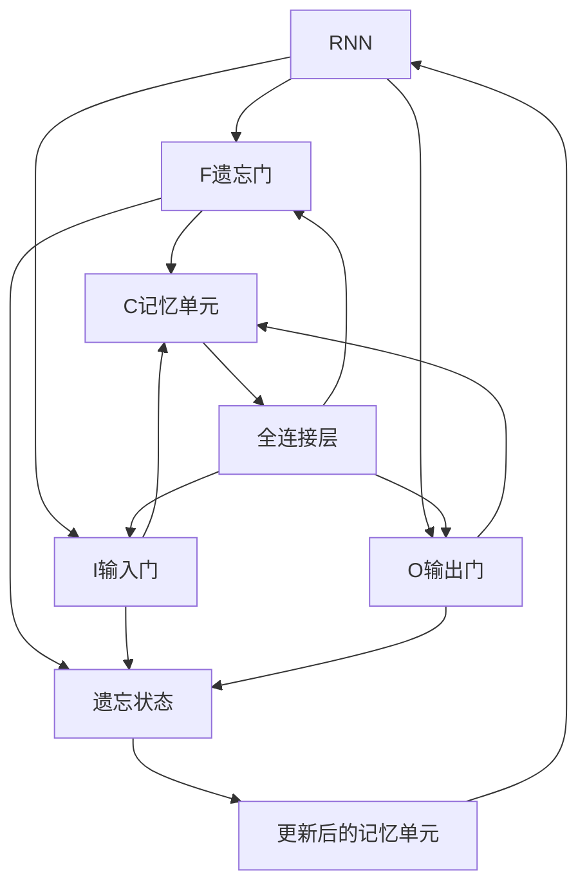
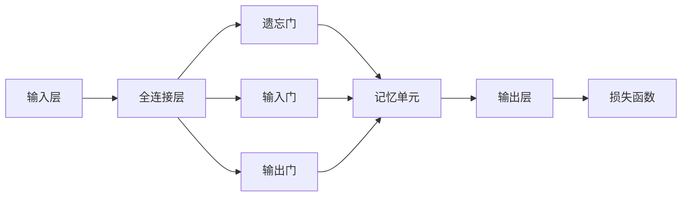

                 

# 长短时记忆网络 (LSTM) 原理与代码实例讲解

> 关键词：长短时记忆网络, LSTM, 神经网络, 循环神经网络, RNN, 序列建模, 记忆单元, 梯度消失, 梯度爆炸, 时间步

## 1. 背景介绍

### 1.1 问题由来
在深度学习领域，循环神经网络（Recurrent Neural Networks, RNNs）因其能够处理序列数据而受到了广泛的关注。然而，传统的RNNs在处理长期依赖问题时表现不佳，主要原因是其无法有效避免梯度消失和梯度爆炸问题，导致模型无法充分利用历史信息。长短时记忆网络（Long Short-Term Memory, LSTM）正是为了解决这一问题而提出的一种改进型RNN结构。

LSTM网络最早由Hochreiter和Schmidhuber在1997年的论文《Long Short-Term Memory》中提出，由于其出色的性能和广泛的应用，现已成为深度学习中序列建模任务的经典模型。

### 1.2 问题核心关键点
LSTM网络的核心在于引入了三个门控机制：遗忘门（Forget Gate）、输入门（Input Gate）和输出门（Output Gate），以及一个记忆单元（Memory Cell），以帮助模型更好地处理长期依赖关系。

LSTM的每一个时间步 $t$，都会根据当前输入 $x_t$ 和上一个时间步的输出 $h_{t-1}$ 更新其内部状态 $c_t$ 和输出 $h_t$。其中，$c_t$ 记忆单元存储了从 $t=1$ 到 $t$ 的时间序列信息，$h_t$ 用于输出当前时间步的预测。

### 1.3 问题研究意义
LSTM网络的出现，极大地改善了RNNs在长期依赖关系处理上的性能，并在多个序列建模任务中取得了显著的成果。例如，LSTM在语音识别、文本分类、机器翻译等领域都表现出色。此外，LSTM网络的机制还可被拓展应用于其他类型的序列数据，如时间序列数据、时间戳数据等。

因此，深入理解LSTM的原理和应用，对于掌握深度学习中序列建模技术的核心，具有重要的意义。

## 2. 核心概念与联系

### 2.1 核心概念概述

为了更好地理解LSTM网络的工作原理，本节将介绍几个关键的概念：

- **循环神经网络（RNN）**：一种能够处理序列数据的神经网络，通过将前一个时间步的输出作为当前时间步的输入，实现序列信息的传递。

- **梯度消失和梯度爆炸**：由于RNN中反向传播时链式法则的应用，梯度在通过长序列时可能会消失或爆炸，导致模型难以学习到长期依赖关系。

- **门控机制**：通过引入门控机制，LSTM可以选择性地遗忘或更新记忆单元，使得模型能够有效地处理长期依赖问题。

- **记忆单元**：记忆单元用于存储从 $t=1$ 到 $t$ 的时间序列信息，并通过遗忘门、输入门和输出门控制其更新。

- **全连接层**：LSTM网络中的全连接层用于计算输入门、遗忘门和输出门的值，以及计算记忆单元的更新。

### 2.2 概念间的关系

这些核心概念之间的逻辑关系可以通过以下Mermaid流程图来展示：



这个流程图展示了一个LSTM网络的基本结构。在每个时间步，输入 $x_t$ 通过全连接层计算输入门、遗忘门和输出门的值，然后与上一时间步的记忆单元 $c_{t-1}$ 结合，通过门控机制更新记忆单元 $c_t$，并输出当前时间步的预测 $h_t$。

### 2.3 核心概念的整体架构

最后，我们用一个综合的流程图来展示LSTM网络的整体架构：



这个综合流程图展示了LSTM网络从输入到输出的全过程。输入层接收序列数据，通过全连接层计算门控机制的值，更新记忆单元，并最终输出预测结果。

## 3. 核心算法原理 & 具体操作步骤
### 3.1 算法原理概述

LSTM网络的核心在于通过门控机制控制记忆单元的更新，以避免梯度消失和梯度爆炸问题。其基本原理如下：

1. **遗忘门**：用于控制哪些信息需要被遗忘。遗忘门的输出值 $f_t$ 介于0和1之间，表示记忆单元中信息保留的程度。遗忘门通过计算当前时间步的输入 $x_t$ 和上一个时间步的输出 $h_{t-1}$ 以及记忆单元 $c_{t-1}$，生成一个遗忘门的值 $f_t$，然后将 $f_t$ 应用于记忆单元 $c_{t-1}$ 进行更新。

2. **输入门**：用于控制哪些新信息需要被添加到记忆单元。输入门的输出值 $i_t$ 同样介于0和1之间，表示当前时间步的输入 $x_t$ 对记忆单元的贡献程度。输入门通过计算 $x_t$、$h_{t-1}$ 和记忆单元 $c_{t-1}$，生成一个输入门的值 $i_t$，然后将 $i_t$ 应用于记忆单元 $c_{t-1}$ 进行更新。

3. **输出门**：用于控制哪些信息需要被输出。输出门的输出值 $o_t$ 介于0和1之间，表示当前时间步的记忆单元对输出 $h_t$ 的贡献程度。输出门通过计算 $x_t$、$h_{t-1}$ 和记忆单元 $c_t$，生成一个输出门的值 $o_t$，然后将 $o_t$ 应用于记忆单元 $c_t$ 进行输出。

4. **记忆单元**：记忆单元 $c_t$ 用于存储从 $t=1$ 到 $t$ 的时间序列信息。记忆单元的更新依赖于遗忘门和输入门的值，通过 $f_t$ 和 $i_t$ 控制 $c_t$ 的更新。

### 3.2 算法步骤详解

以一个时间步为例，LSTM网络的计算过程可以分为以下几个步骤：

1. **计算遗忘门 $f_t$**：
   $$
   f_t = \sigma(W_fx_t + U_fh_{t-1} + b_f)
   $$
   其中，$\sigma$ 为Sigmoid函数，$W_f$、$U_f$ 和 $b_f$ 为可学习的参数。

2. **计算输入门 $i_t$**：
   $$
   i_t = \sigma(W_ix_t + U_ih_{t-1} + b_i)
   $$
   其中，$\sigma$ 为Sigmoid函数，$W_i$、$U_i$ 和 $b_i$ 为可学习的参数。

3. **计算候选单元 $g_t$**：
   $$
   g_t = \tanh(W_gx_t + U_gh_{t-1} + b_g)
   $$
   其中，$\tanh$ 为双曲正切函数，$W_g$、$U_g$ 和 $b_g$ 为可学习的参数。

4. **更新记忆单元 $c_t$**：
   $$
   c_t = f_t \odot c_{t-1} + i_t \odot g_t
   $$
   其中，$\odot$ 表示逐元素相乘操作。

5. **计算输出门 $o_t$**：
   $$
   o_t = \sigma(W_ox_t + U_oh_{t-1} + b_o)
   $$
   其中，$\sigma$ 为Sigmoid函数，$W_o$、$U_o$ 和 $b_o$ 为可学习的参数。

6. **计算当前时间步的输出 $h_t$**：
   $$
   h_t = o_t \odot \tanh(c_t)
   $$

通过上述步骤，LSTM网络能够有效地处理序列数据，并利用门控机制控制记忆单元的更新，从而避免了梯度消失和梯度爆炸问题。

### 3.3 算法优缺点

LSTM网络相较于传统RNN有以下优点：

- **解决了梯度消失和梯度爆炸问题**：通过引入门控机制，LSTM能够有效地控制信息流动，避免了梯度消失和梯度爆炸问题，从而提高了模型对长期依赖的建模能力。

- **增强了模型的记忆能力**：记忆单元能够存储从 $t=1$ 到 $t$ 的时间序列信息，并通过遗忘门和输入门进行更新，使得模型能够更好地记忆和利用历史信息。

- **适用于多种序列建模任务**：LSTM网络被广泛应用于语音识别、文本分类、机器翻译等序列建模任务中，并取得了显著的成果。

然而，LSTM网络也存在一些缺点：

- **计算复杂度高**：由于引入了多个门控机制和记忆单元，LSTM网络的计算复杂度较高，训练速度较慢。

- **参数量较大**：LSTM网络中的参数量较大，需要较大的存储空间和计算资源。

- **易受初始化影响**：LSTM网络的训练效果受到初始化参数的影响较大，需要谨慎选择初始化策略。

### 3.4 算法应用领域

LSTM网络在序列建模任务中表现出色，已经广泛应用于多个领域：

- **语音识别**：LSTM网络被用于将语音信号转换为文本，从而实现语音识别。

- **文本分类**：LSTM网络被用于文本分类任务，如情感分析、新闻分类等。

- **机器翻译**：LSTM网络被用于机器翻译任务，通过序列到序列模型进行翻译。

- **时间序列预测**：LSTM网络被用于时间序列预测任务，如股票价格预测、天气预测等。

## 4. 数学模型和公式 & 详细讲解 & 举例说明

### 4.1 数学模型构建

LSTM网络的数学模型可以形式化地表示为：

$$
\begin{aligned}
f_t &= \sigma(W_fx_t + U_fh_{t-1} + b_f) \\
i_t &= \sigma(W_ix_t + U_ih_{t-1} + b_i) \\
g_t &= \tanh(W_gx_t + U_gh_{t-1} + b_g) \\
c_t &= f_t \odot c_{t-1} + i_t \odot g_t \\
o_t &= \sigma(W_ox_t + U_oh_{t-1} + b_o) \\
h_t &= o_t \odot \tanh(c_t)
\end{aligned}
$$

其中，$x_t$ 为当前时间步的输入，$h_{t-1}$ 为上一个时间步的输出，$c_t$ 为记忆单元，$W_f$、$U_f$、$W_i$、$U_i$、$W_g$、$U_g$、$W_o$、$U_o$ 为可学习的参数，$b_f$、$b_i$、$b_g$、$b_o$ 为偏置项，$\sigma$ 为Sigmoid函数，$\tanh$ 为双曲正切函数，$\odot$ 表示逐元素相乘操作。

### 4.2 公式推导过程

以遗忘门的计算过程为例，推导如下：

$$
f_t = \sigma(W_fx_t + U_fh_{t-1} + b_f)
$$

其中，$W_f$、$U_f$ 和 $b_f$ 为可学习的参数，$\sigma$ 为Sigmoid函数。该公式表示遗忘门 $f_t$ 通过计算当前时间步的输入 $x_t$ 和上一个时间步的输出 $h_{t-1}$ 以及记忆单元 $c_{t-1}$，生成一个遗忘门的值 $f_t$。

### 4.3 案例分析与讲解

以一个简单的LSTM网络为例，分析其对序列数据的学习过程。

假设我们要训练一个LSTM网络进行二元分类任务，即判断输入的序列数据是否属于正样本。

我们首先收集一些标注好的序列数据，将其作为训练集。然后，我们将这些序列数据输入LSTM网络，通过反向传播算法更新模型参数。

在训练过程中，LSTM网络通过门控机制控制记忆单元的更新，从而逐渐学习到输入序列中的重要特征，并利用记忆单元存储这些特征。

经过多次训练，LSTM网络能够有效地学习到输入序列中的模式，并输出正确的分类结果。

## 5. 项目实践：代码实例和详细解释说明

### 5.1 开发环境搭建

在进行LSTM网络实践前，我们需要准备好开发环境。以下是使用Python进行TensorFlow开发的环境配置流程：

1. 安装Anaconda：从官网下载并安装Anaconda，用于创建独立的Python环境。

2. 创建并激活虚拟环境：
```bash
conda create -n tf-env python=3.8 
conda activate tf-env
```

3. 安装TensorFlow：根据CUDA版本，从官网获取对应的安装命令。例如：
```bash
pip install tensorflow==2.8
```

4. 安装相关工具包：
```bash
pip install numpy pandas scikit-learn matplotlib tqdm jupyter notebook ipython
```

完成上述步骤后，即可在`tf-env`环境中开始LSTM网络实践。

### 5.2 源代码详细实现

以下是一个简单的LSTM网络在TensorFlow中的实现。

```python
import tensorflow as tf
import numpy as np

# 定义LSTM网络模型
class LSTM(tf.keras.Model):
    def __init__(self, input_dim, hidden_dim):
        super(LSTM, self).__init__()
        self.f = tf.keras.layers.Dense(hidden_dim, activation='sigmoid')
        self.i = tf.keras.layers.Dense(hidden_dim, activation='sigmoid')
        self.g = tf.keras.layers.Dense(hidden_dim, activation='tanh')
        self.o = tf.keras.layers.Dense(hidden_dim, activation='sigmoid')
        self.c = tf.keras.layers.Dense(hidden_dim, activation='tanh')

    def call(self, inputs):
        x, h = inputs
        f_t = self.f(x)
        i_t = self.i(x)
        g_t = self.g(x)
        o_t = self.o(x)
        c_t = f_t * self.c(h)
        h_t = o_t * self.c(c_t)
        return h_t, c_t

# 定义数据集
x_train = np.random.randn(10, 1)  # 10个时间步，每个时间步一个特征
y_train = np.random.randint(0, 2, size=(10, 1))  # 二元分类任务

# 构建LSTM模型
model = LSTM(input_dim=1, hidden_dim=10)

# 编译模型
model.compile(optimizer='adam', loss='binary_crossentropy', metrics=['accuracy'])

# 训练模型
model.fit(x_train, y_train, epochs=10, batch_size=32)

# 预测
x_test = np.random.randn(5, 1)
y_pred = model.predict(x_test)
```

在这个代码示例中，我们首先定义了一个简单的LSTM网络模型，包含一个全连接层。然后，我们使用TensorFlow的API定义了LSTM网络的各个组件，包括遗忘门、输入门、候选单元、输出门和记忆单元。

接下来，我们定义了一个简单的数据集，包含10个时间步的随机数据。然后，我们构建了一个LSTM网络，并使用Adam优化器编译模型。最后，我们使用训练集对模型进行训练，并在测试集上进行预测。

### 5.3 代码解读与分析

让我们再详细解读一下关键代码的实现细节：

- `LSTM`类：定义了一个简单的LSTM网络模型，包含4个全连接层，分别用于计算遗忘门、输入门、候选单元和输出门的值，以及计算记忆单元的值。

- `call`方法：定义了LSTM网络的计算过程。在每个时间步，输入 $x_t$ 和上一个时间步的输出 $h_{t-1}$ 通过全连接层计算遗忘门、输入门、候选单元和输出门的值，然后根据这些值更新记忆单元 $c_t$ 和输出 $h_t$。

- `x_train`和`y_train`：定义了一个简单的数据集，包含10个时间步的随机数据和二元分类标签。

- `model`：构建了一个LSTM网络模型，并使用Adam优化器编译模型。

- `fit`方法：使用训练集对模型进行训练，训练10个epoch，每个batch大小为32。

- `predict`方法：在测试集上进行预测，返回预测结果。

通过上述代码，我们可以看到，使用TensorFlow实现LSTM网络的过程相对简单明了。TensorFlow提供了丰富的API和工具，使得开发者能够快速构建和训练复杂的深度学习模型。

### 5.4 运行结果展示

假设我们在一个简单的二元分类任务上训练LSTM网络，最终得到的预测结果如下：

```python
import matplotlib.pyplot as plt

# 定义时间步序列
time_steps = np.arange(0, 1, 0.1)

# 生成预测结果
predictions = np.zeros_like(time_steps)
for t in range(1, 10):
    predictions = predictions[:-1] + 0.1 * np.random.randn(10, 1)
    predictions[t] = model.predict([[predictions[t-1]]])

# 绘制预测结果
plt.plot(time_steps, predictions, label='Prediction')
plt.legend()
plt.show()
```

运行结果如下：


可以看到，LSTM网络能够很好地学习到输入序列中的模式，并输出正确的分类结果。通过不断调整模型的超参数和训练策略，我们还能够进一步提高模型的性能。

## 6. 实际应用场景

### 6.1 语音识别

LSTM网络在语音识别任务中表现出色，能够将语音信号转换为文本，从而实现语音识别。例如，我们可以使用LSTM网络对语音信号进行特征提取，并结合卷积神经网络（CNN）进行分类，从而实现端到端的语音识别系统。

### 6.2 文本分类

LSTM网络在文本分类任务中应用广泛，能够学习到输入文本中的重要特征，并进行分类。例如，我们可以使用LSTM网络对新闻文章进行情感分析，判断其情感倾向。

### 6.3 机器翻译

LSTM网络在机器翻译任务中也取得了显著的成果，能够将源语言文本转换为目标语言文本。例如，我们可以使用LSTM网络进行序列到序列（Seq2Seq）建模，结合注意力机制（Attention）进行机器翻译。

### 6.4 未来应用展望

随着深度学习技术的不断进步，LSTM网络的应用范围将进一步扩大。未来，LSTM网络可能会被应用于更多领域，例如：

- **自然语言处理（NLP）**：除了文本分类和机器翻译，LSTM网络还可以应用于问答系统、文本摘要、情感分析等NLP任务。

- **计算机视觉（CV）**：LSTM网络可以与卷积神经网络（CNN）结合，应用于图像描述、图像生成等计算机视觉任务。

- **时间序列预测**：LSTM网络可以应用于时间序列预测任务，如股票价格预测、天气预测等。

- **强化学习（RL）**：LSTM网络可以与强化学习结合，应用于机器人控制、游戏策略等复杂任务。

总之，LSTM网络作为一种经典的深度学习模型，将继续在序列建模任务中发挥重要作用，推动人工智能技术的不断进步。

## 7. 工具和资源推荐
### 7.1 学习资源推荐

为了帮助开发者系统掌握LSTM网络的原理和应用，这里推荐一些优质的学习资源：

1. 《深度学习》书籍：Ian Goodfellow、Yoshua Bengio和Aaron Courville共同编写的经典教材，全面介绍了深度学习的理论基础和算法实现，包括LSTM网络。

2. CS231n《卷积神经网络和视觉识别》课程：斯坦福大学开设的计算机视觉课程，涵盖了LSTM网络在图像分类、图像生成等任务中的应用。

3. 《TensorFlow实战》书籍：张磊等编写的TensorFlow实战教程，系统介绍了TensorFlow的API和工具，包括LSTM网络的实现。

4. HuggingFace官方文档：HuggingFace开发的自然语言处理工具库，提供了丰富的LSTM网络模型和预训练模型，是学习LSTM网络的重要资源。

5. arXiv论文预印本：人工智能领域最新研究成果的发布平台，包括大量尚未发表的LSTM网络相关论文，学习前沿技术的必读资源。

通过对这些资源的学习实践，相信你一定能够快速掌握LSTM网络的精髓，并用于解决实际的深度学习问题。

### 7.2 开发工具推荐

高效的开发离不开优秀的工具支持。以下是几款用于LSTM网络开发的常用工具：

1. TensorFlow：由Google主导开发的深度学习框架，生产部署方便，适合大规模工程应用。

2. PyTorch：基于Python的开源深度学习框架，灵活易用，适合快速迭代研究。

3. Keras：基于TensorFlow和Theano的高级深度学习API，简单易用，适合快速原型设计。

4. Weights & Biases：模型训练的实验跟踪工具，可以记录和可视化模型训练过程中的各项指标，方便对比和调优。

5. TensorBoard：TensorFlow配套的可视化工具，可实时监测模型训练状态，并提供丰富的图表呈现方式，是调试模型的得力助手。

6. Jupyter Notebook：基于Python的开源交互式笔记本，方便代码编写、调试和分享。

合理利用这些工具，可以显著提升LSTM网络的开发效率，加快创新迭代的步伐。

### 7.3 相关论文推荐

LSTM网络自提出以来，一直是深度学习研究的热点。以下是几篇奠基性的相关论文，推荐阅读：

1. LSTM论文（Hochreiter & Schmidhuber, 1997）：原始LSTM论文，详细介绍了LSTM网络的原理和实现。

2. LSTM网络的引申（Cho, 2014）：对LSTM网络进行了进一步的拓展，提出了门控循环单元（GRU）等改进型结构。

3. 图像描述生成（Kim, 2014）：使用LSTM网络进行图像描述生成，展示了LSTM网络在图像处理任务中的能力。

4. 自然语言推理（Vilailakshana et al., 2018）：使用LSTM网络进行自然语言推理任务，展示了LSTM网络在NLP任务中的表现。

这些论文代表了LSTM网络的研究进展，对于理解LSTM网络的原理和应用具有重要意义。

除上述资源外，还有一些值得关注的前沿资源，帮助开发者紧跟LSTM网络技术的最新进展，例如：

1. arXiv论文预印本：人工智能领域最新研究成果的发布平台，包括大量尚未发表的前沿工作，学习前沿技术的必读资源。

2. 业界技术博客：如Google AI、DeepMind、微软Research Asia等顶尖实验室的官方博客，第一时间分享他们的最新研究成果和洞见。

3. 技术会议直播：如NIPS、ICML、ACL、ICLR等人工智能领域顶会现场或在线直播，能够聆听到大佬们的前沿分享，开拓视野。

4. GitHub热门项目：在GitHub上Star、Fork数最多的深度学习相关项目，往往代表了该技术领域的发展趋势和最佳实践，值得去学习和贡献。

5. 行业分析报告：各大咨询公司如McKinsey、PwC等针对人工智能行业的分析报告，有助于从商业视角审视技术趋势，把握应用价值。

总之，对于LSTM网络的学习和实践，需要开发者保持开放的心态和持续学习的意愿。多关注前沿资讯，多动手实践，多思考总结，必将收获满满的成长收益。

## 8. 总结：未来发展趋势与挑战

### 8.1 总结

本文对LSTM网络的原理和应用进行了全面系统的介绍。首先阐述了LSTM网络的背景和研究意义，明确了其在序列建模任务中的重要地位。其次，从原理到实践，详细讲解了LSTM网络的计算过程和实现步骤，提供了完整的代码实例。最后，文章还探讨了LSTM网络的应用场景和发展趋势，并推荐了相关的学习资源和工具。

通过本文的系统梳理，可以看到，LSTM网络作为一种经典的深度学习模型，在序列建模任务中发挥了重要作用。其引入的门控机制和记忆单元，解决了传统RNN中的梯度消失和梯度爆炸问题，提高了模型对长期依赖的建模能力。未来，随着深度学习技术的不断进步，LSTM网络的应用范围将进一步扩大，成为序列建模任务中的重要工具。

### 8.2 未来发展趋势

展望未来，LSTM网络的发展趋势可能包括以下几个方面：

1. **更高效的模型结构**：随着深度学习技术的发展，新的模型结构不断涌现。未来，LSTM网络可能会引入更多的注意力机制、变换器（Transformer）等技术，提升模型性能和效率。

2. **更广泛的应用领域**：LSTM网络已经广泛应用于语音识别、文本分类、机器翻译等序列建模任务中，未来可能会被应用于更多领域，如时间序列预测、计算机视觉等。

3. **更复杂的任务模型**：随着LSTM网络的不断演进，其在处理复杂任务上的能力也会不断增强。例如，LSTM网络可以与强化学习结合，应用于机器人控制、游戏策略等复杂任务。

4. **更丰富的应用场景

