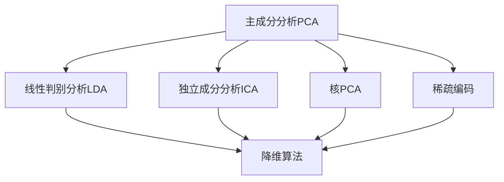
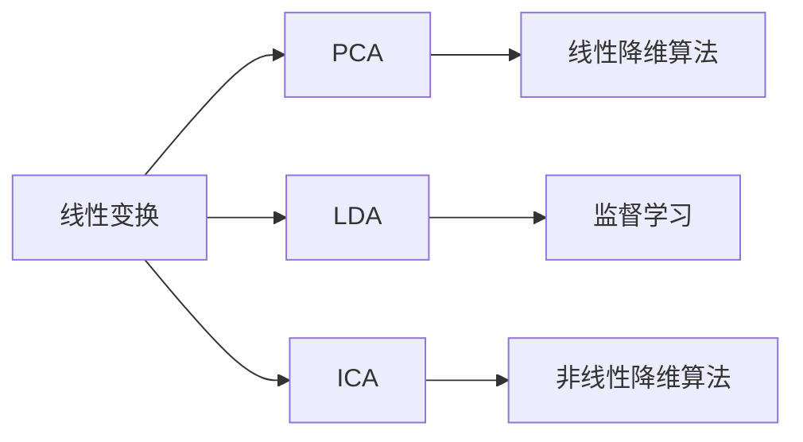
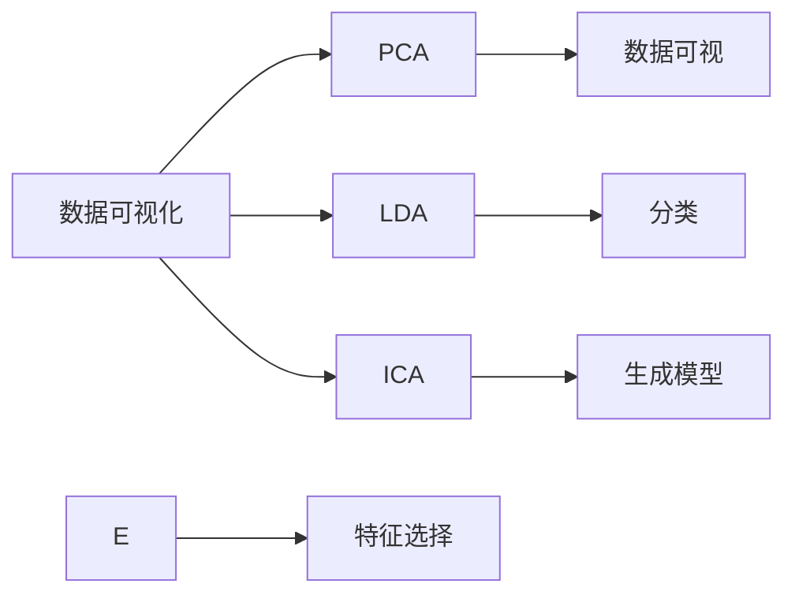
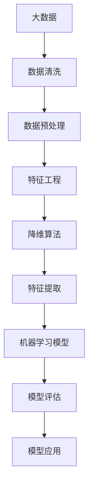

                 

# 降维算法 原理与代码实例讲解

> 关键词：降维算法,PCA,线性判别分析,独立成分分析,核PCA,稀疏编码,高效降维

## 1. 背景介绍

### 1.1 问题由来
在处理大规模数据集时，特征的维度通常很高，导致存储和计算上的困难。例如，在图像处理中，一张颜色图像可能包含 millions 级别的像素特征；在文本处理中，每个文档可能包含 thousands 甚至 tens of thousands 个词。高维数据的稀疏性和复杂性使得其在处理和分析过程中显得尤为困难。为了简化模型并提升计算效率，降维（Dimensionality Reduction）成为了一个重要的数据预处理步骤。降维算法可以将高维数据映射到低维空间，从而减少数据的复杂性，同时尽可能保留数据的原始信息。

### 1.2 问题核心关键点
降维算法的核心在于通过线性变换或非线性变换，将高维数据映射到低维空间，使得数据的稀疏性和复杂性得到显著降低。常见的降维算法包括主成分分析（PCA）、线性判别分析（LDA）、独立成分分析（ICA）、核PCA（Kernel PCA）、稀疏编码（Sparse Coding）等。这些算法通过不同的数学模型和优化目标，实现了对数据的有效压缩和特征提取，具有广泛的应用场景，包括数据可视化、特征选择、异常检测、模式识别等。

### 1.3 问题研究意义
降维算法在数据科学和机器学习中扮演着重要的角色，它不仅能够简化数据结构，减少数据存储和计算成本，还能够提升模型的泛化能力和预测性能。通过降维，我们可以从噪声和冗余数据中提取更有意义的特征，从而提高模型的稳定性和准确性。此外，降维算法还可以用于数据可视化和探索性数据分析，帮助研究人员发现数据集中的模式和规律。

## 2. 核心概念与联系

### 2.1 核心概念概述

为更好地理解降维算法的核心原理和应用，本节将介绍几个密切相关的核心概念：

- **主成分分析（PCA）**：通过线性变换将高维数据映射到低维空间，保留最大方差的特征。

- **线性判别分析（LDA）**：通过线性变换将数据投影到新的空间，使得类别之间的差异最大化，适用于分类任务。

- **独立成分分析（ICA）**：通过非线性变换将数据分解成独立的成分，适用于数据生成模型。

- **核PCA（Kernel PCA）**：通过非线性变换将数据映射到高维特征空间，在特征空间中进行线性PCA，适用于高维数据和复杂数据。

- **稀疏编码（Sparse Coding）**：通过非线性变换将数据表示为稀疏字典的线性组合，适用于稀疏数据。

这些核心概念之间的逻辑关系可以通过以下Mermaid流程图来展示：



这个流程图展示了几大降维算法之间的关系：

1. PCA、LDA、ICA、核PCA、稀疏编码等算法都是降维算法的基本形式，通过不同的变换方式实现降维目标。
2. 这些算法可以根据数据的特点选择合适的应用场景，如PCA适用于数据可视化和特征选择，LDA适用于分类任务，ICA适用于数据生成模型，核PCA适用于高维数据，稀疏编码适用于稀疏数据。

### 2.2 概念间的关系

这些核心概念之间存在着紧密的联系，形成了降维算法的完整生态系统。下面我们通过几个Mermaid流程图来展示这些概念之间的关系。

#### 2.2.1 降维算法的分类



这个流程图展示了基于线性变换和非线性变换的降维算法分类。线性变换包括PCA和LDA，适用于数据线性可分的情况；非线性变换包括ICA和核PCA，适用于数据非线性分布的情况。

#### 2.2.2 降维算法的一般流程


这个流程图展示了降维算法的一般流程。首先对原始数据进行特征映射，然后将映射后的特征进行选择，得到最终的降维结果。

#### 2.2.3 降维算法的应用场景



这个流程图展示了降维算法在不同应用场景中的选择。数据可视化通常使用PCA；分类任务可以使用LDA；生成模型可以使用ICA；特征选择可以使用PCA或ICA。

### 2.3 核心概念的整体架构

最后，我们用一个综合的流程图来展示这些核心概念在大数据处理和机器学习中的整体架构：



这个综合流程图展示了从大数据处理到机器学习模型应用的全过程。数据清洗和预处理后，进行特征工程和降维算法处理，得到特征提取结果，最终用于机器学习模型的训练和评估。

## 3. 核心算法原理 & 具体操作步骤
### 3.1 算法原理概述

降维算法的核心原理是通过数学变换将高维数据映射到低维空间，使得数据的稀疏性和复杂性得到显著降低。不同的降维算法采用不同的数学模型和优化目标，但最终的目标都是将数据表示成低维空间中的线性或非线性特征。

### 3.2 算法步骤详解

下面以主成分分析（PCA）为例，详细讲解PCA的数学模型和操作步骤：

**Step 1: 数据标准化**

在PCA中，我们首先需要对数据进行标准化，使得各个特征的均值为0，方差为1。这可以通过计算均值和标准差来实现：

$$
x_i' = \frac{x_i - \mu}{\sigma}
$$

其中 $\mu$ 为每个特征的均值，$\sigma$ 为标准差。

**Step 2: 计算协方差矩阵**

标准化后，我们计算样本的协方差矩阵 $\Sigma$：

$$
\Sigma = \frac{1}{N-1} \sum_{i=1}^{N} x_i'x_i'
$$

其中 $N$ 为样本数量。

**Step 3: 求解特征值分解**

接下来，我们求解协方差矩阵 $\Sigma$ 的特征值分解：

$$
\Sigma = UDV^T
$$

其中 $D$ 为对角矩阵，$U$ 和 $V$ 分别为左右特征向量矩阵。$D$ 的对角线元素为特征值，按照从大到小排序。

**Step 4: 选择主成分**

PCA选择协方差矩阵 $\Sigma$ 的前 $k$ 个最大特征值对应的特征向量，作为主成分向量 $u_1, u_2, ..., u_k$。这些主成分向量可以表示为 $U$ 的前 $k$ 行。

**Step 5: 计算低维表示**

最后，我们将原始数据 $x_i'$ 投影到低维空间中，得到低维表示 $y_i$：

$$
y_i = U_k \cdot x_i'
$$

其中 $U_k$ 为 $U$ 的前 $k$ 行。

### 3.3 算法优缺点

PCA的优点在于其计算效率高，适用范围广，能够有效降低数据的维度和复杂性。其主要缺点是假设数据的协方差矩阵是对称正定的，且只能进行线性降维，无法处理非线性关系。此外，PCA对于包含噪声的数据敏感，且可能会丢失部分重要特征。

### 3.4 算法应用领域

PCA广泛应用于数据可视化、特征选择、异常检测、模式识别等领域。例如：

- **数据可视化**：PCA可以将高维数据映射到二维或三维空间，方便进行数据可视化。
- **特征选择**：PCA可以选择重要的特征，减少特征数量，提高模型的泛化能力。
- **异常检测**：PCA可以识别数据中的异常点，用于检测异常行为或数据污染。
- **模式识别**：PCA可以将数据映射到低维空间中，用于模式识别和分类。

## 4. 数学模型和公式 & 详细讲解  
### 4.1 数学模型构建

PCA的数学模型可以通过线性代数和概率统计的知识进行构建。我们通过线性变换将高维数据映射到低维空间，保留最大方差的特征。

### 4.2 公式推导过程

PCA的推导过程如下：

设原始数据集为 $X = [x_1, x_2, ..., x_N]$，其中 $x_i \in \mathbb{R}^d$，$d$ 为原始数据的维度。假设我们要将其映射到 $k$ 维空间中，选取的 $k$ 个主成分为 $u_1, u_2, ..., u_k$。则低维表示 $Y$ 可以表示为：

$$
Y = WX + b
$$

其中 $W$ 为线性变换矩阵，$b$ 为偏置项。为了使得 $Y$ 的方差最大化，我们最小化 $Y$ 的协方差矩阵 $\Sigma_Y$ 的迹：

$$
\min_{W, b} tr(\Sigma_Y) = tr(W^T\Sigma W)
$$

其中 $\Sigma_Y$ 为 $Y$ 的协方差矩阵。由于 $W$ 和 $\Sigma$ 的协方差矩阵 $\Sigma_X$ 之间的关系为 $\Sigma_Y = W^T \Sigma W$，因此最小化 $\Sigma_Y$ 的迹等价于最小化 $\Sigma_X$ 的迹。因此，我们的目标变为：

$$
\min_{W} tr(W^T \Sigma W)
$$

为了求解上述优化问题，我们通过特征值分解求解 $\Sigma$ 的特征值和特征向量，并选择 $k$ 个最大特征值对应的特征向量作为主成分向量 $u_1, u_2, ..., u_k$。则线性变换矩阵 $W$ 可以表示为：

$$
W = [u_1, u_2, ..., u_k]
$$

最终的低维表示 $Y$ 可以表示为：

$$
Y = WX
$$

### 4.3 案例分析与讲解

我们以Iris数据集为例，演示PCA的应用过程。Iris数据集包含150个样本，每个样本包含4个特征（花萼长度、花萼宽度、花瓣长度、花瓣宽度），3个类别。我们将使用PCA将数据映射到二维空间，并可视化结果。

**Step 1: 数据标准化**

```python
from sklearn.preprocessing import StandardScaler

scaler = StandardScaler()
X_scaled = scaler.fit_transform(X)
```

**Step 2: 计算协方差矩阵**

```python
cov_matrix = np.cov(X_scaled.T)
```

**Step 3: 求解特征值分解**

```python
eigenvalues, eigenvectors = np.linalg.eig(cov_matrix)
```

**Step 4: 选择主成分**

我们选择前两个特征值对应的特征向量作为主成分。

**Step 5: 计算低维表示**

```python
k = 2
U = np.array(eigenvectors[:, :k])
Y = U @ X_scaled
```

**Step 6: 可视化结果**

```python
import matplotlib.pyplot as plt
from mpl_toolkits.mplot3d import Axes3D

fig = plt.figure()
ax = fig.add_subplot(111, projection='3d')
ax.scatter(Y[:, 0], Y[:, 1], Y[:, 2], c=labels, cmap='viridis')
ax.set_xlabel('Principal Component 1')
ax.set_ylabel('Principal Component 2')
ax.set_zlabel('Principal Component 3')
plt.show()
```

通过上述代码，我们可以看到PCA将Iris数据集映射到二维空间后，可以明显地将其分成三个类别，方便进行可视化分析。

## 5. 项目实践：代码实例和详细解释说明
### 5.1 开发环境搭建

在进行PCA实践前，我们需要准备好开发环境。以下是使用Python进行Scikit-learn开发的环境配置流程：

1. 安装Anaconda：从官网下载并安装Anaconda，用于创建独立的Python环境。

2. 创建并激活虚拟环境：
```bash
conda create -n sklearn-env python=3.8 
conda activate sklearn-env
```

3. 安装Scikit-learn：
```bash
pip install scikit-learn
```

4. 安装各类工具包：
```bash
pip install numpy pandas matplotlib seaborn
```

完成上述步骤后，即可在`sklearn-env`环境中开始PCA实践。

### 5.2 源代码详细实现

这里我们以Iris数据集为例，展示PCA的实现代码：

```python
from sklearn.datasets import load_iris
from sklearn.preprocessing import StandardScaler
from sklearn.decomposition import PCA
import numpy as np
import matplotlib.pyplot as plt

# 加载数据集
iris = load_iris()
X = iris.data
y = iris.target

# 标准化数据
scaler = StandardScaler()
X_scaled = scaler.fit_transform(X)

# 计算协方差矩阵
cov_matrix = np.cov(X_scaled.T)

# 求解特征值分解
eigenvalues, eigenvectors = np.linalg.eig(cov_matrix)

# 选择主成分
k = 2
U = np.array(eigenvectors[:, :k])

# 计算低维表示
Y = U @ X_scaled

# 可视化结果
plt.scatter(Y[:, 0], Y[:, 1], c=y, cmap='viridis')
plt.xlabel('Principal Component 1')
plt.ylabel('Principal Component 2')
plt.title('PCA on Iris Dataset')
plt.show()
```

### 5.3 代码解读与分析

让我们再详细解读一下关键代码的实现细节：

**标准化数据**：
- 使用`StandardScaler`对数据进行标准化，使得每个特征的均值为0，方差为1。

**计算协方差矩阵**：
- 使用`np.cov`计算样本的协方差矩阵。

**求解特征值分解**：
- 使用`np.linalg.eig`求解协方差矩阵的特征值分解。

**选择主成分**：
- 选择前两个特征值对应的特征向量作为主成分。

**计算低维表示**：
- 将原始数据投影到低维空间中，得到低维表示。

**可视化结果**：
- 使用`matplotlib`将低维表示可视化。

### 5.4 运行结果展示

通过上述代码，我们可以看到PCA将Iris数据集映射到二维空间后，可以明显地将其分成三个类别，方便进行可视化分析。

## 6. 实际应用场景
### 6.1 数据压缩

在处理大数据集时，数据压缩是必不可少的一步。PCA可以通过降低数据的维度，有效压缩数据，减少存储和计算成本。例如，在图像处理中，PCA可以将高维的图像数据压缩到低维空间中，减少图像数据的大小，方便存储和传输。

### 6.2 特征选择

PCA可以帮助我们选择重要的特征，减少特征数量，提高模型的泛化能力。例如，在文本分类中，PCA可以选择对分类任务贡献最大的特征，去除冗余和噪声，提高分类的准确性。

### 6.3 异常检测

PCA可以识别数据中的异常点，用于检测异常行为或数据污染。例如，在金融领域，PCA可以检测异常交易，及时发现金融欺诈行为。

### 6.4 模式识别

PCA可以将数据映射到低维空间中，用于模式识别和分类。例如，在人脸识别中，PCA可以将高维的图像数据映射到低维空间中，提取人脸特征，用于身份识别。

## 7. 工具和资源推荐
### 7.1 学习资源推荐

为了帮助开发者系统掌握降维算法的理论基础和实践技巧，这里推荐一些优质的学习资源：

1. 《机器学习实战》：一本面向初学者的机器学习入门书籍，介绍了PCA的基本原理和实现方法。

2. Coursera《机器学习》课程：斯坦福大学开设的机器学习课程，详细讲解了PCA的数学原理和实际应用。

3. Google AI博客：Google AI博客中包含多篇关于PCA的介绍文章，包括算法原理和应用案例。

4. Kaggle数据集：Kaggle提供丰富的数据集和竞赛，可以实践PCA算法，并进行实际应用。

5. GitHub开源项目：GitHub上有很多基于PCA的实现项目，可以学习和参考。

通过对这些资源的学习实践，相信你一定能够快速掌握PCA算法的精髓，并用于解决实际的机器学习问题。

### 7.2 开发工具推荐

高效的开发离不开优秀的工具支持。以下是几款用于PCA开发的常用工具：

1. Python：Python语言简单易学，语法清晰，非常适合PCA算法的实现。

2. Scikit-learn：一个基于Python的机器学习库，包含丰富的PCA实现，方便快速上手。

3. Matplotlib：一个Python绘图库，可以用于数据可视化和结果展示。

4. Numpy：一个Python科学计算库，提供了高效的矩阵运算功能，适合PCA算法的实现。

5. Jupyter Notebook：一个交互式的编程环境，可以方便地进行算法实现和结果展示。

合理利用这些工具，可以显著提升PCA算法的开发效率，加快创新迭代的步伐。

### 7.3 相关论文推荐

PCA算法的研究历史悠久，涉及多个领域，以下是几篇奠基性的相关论文，推荐阅读：

1. "Principal Component Analysis" by Pearson (1901)：介绍了PCA的基本原理和应用。

2. "The Use of Fast Fourier and Subspace Techniques for Data Reduction and Syllogistic Manipulation" by Pearson (1908)：详细介绍了PCA的数学原理和算法实现。

3. "On the Decomposition of a Matrix" by Francis (1950)：介绍了矩阵分解的基本原理和算法实现。

4. "Introduction to the Mathematical Theory of Multivariate Statistical Analysis" by Borg (1956)：介绍了PCA的统计原理和算法实现。

5. "Principal Component Analysis in Linguistics" by Jung (1981)：介绍了PCA在语言学中的应用。

这些论文代表了PCA算法的发展脉络，通过学习这些前沿成果，可以帮助研究者把握学科前进方向，激发更多的创新灵感。

除上述资源外，还有一些值得关注的前沿资源，帮助开发者紧跟PCA算法的最新进展，例如：

1. arXiv论文预印本：人工智能领域最新研究成果的发布平台，包括大量尚未发表的前沿工作，学习前沿技术的必读资源。

2. 业界技术博客：如Google AI、Microsoft Research Asia、Facebook AI Research等顶尖实验室的官方博客，第一时间分享他们的最新研究成果和洞见。

3. 技术会议直播：如NIPS、ICML、ICCV等人工智能领域顶会现场或在线直播，能够聆听到大佬们的前沿分享，开拓视野。

4. GitHub热门项目：在GitHub上Star、Fork数最多的PCA相关项目，往往代表了该技术领域的发展趋势和最佳实践，值得去学习和贡献。

5. 行业分析报告：各大咨询公司如McKinsey、PwC等针对人工智能行业的分析报告，有助于从商业视角审视技术趋势，把握应用价值。

总之，对于PCA算法的学习，需要开发者保持开放的心态和持续学习的意愿。多关注前沿资讯，多动手实践，多思考总结，必将收获满满的成长收益。

## 8. 总结：未来发展趋势与挑战
### 8.1 总结

本文对主成分分析（PCA）算法进行了全面系统的介绍。首先阐述了PCA算法在数据处理和特征工程中的重要地位，明确了PCA在数据压缩、特征选择、异常检测、模式识别等任务中的独特作用。其次，从原理到实践，详细讲解了PCA算法的数学模型和关键操作步骤，给出了完整的代码实例。同时，本文还广泛探讨了PCA算法在不同应用场景中的选择和优化方法，展示了PCA算法的强大生命力。

通过本文的系统梳理，可以看到，PCA算法在数据科学和机器学习中扮演着重要的角色，它不仅能够简化数据结构，减少数据存储和计算成本，还能够提升模型的泛化能力和预测性能。未来，伴随算法和应用的不断进步，PCA算法必将在更广阔的领域中大放异彩。

### 8.2 未来发展趋势

展望未来，PCA算法将呈现以下几个发展趋势：

1. **深度融合**：PCA算法将与其他机器学习算法深度融合，如深度学习、强化学习等，形成更加强大和高效的数据处理方法。

2. **多模态融合**：PCA算法可以与其他多模态数据处理方法，如语音信号处理、图像处理等，形成更加全面和精准的数据表示。

3. **分布式计算**：PCA算法将在分布式计算环境下进行优化，提升数据处理效率和并行性。

4. **自动化调参**：PCA算法将通过自动化调参技术，优化算法的超参数设置，提升算法的稳定性和性能。

5. **端到端学习**：PCA算法将与其他端到端学习技术，如自动编码器、深度信念网络等，形成更加灵活和高效的数据处理方法。

以上趋势凸显了PCA算法的广阔前景。这些方向的探索发展，必将进一步提升PCA算法的应用范围和效果，为人工智能技术的发展提供有力支持。

### 8.3 面临的挑战

尽管PCA算法已经取得了瞩目成就，但在迈向更加智能化、普适化应用的过程中，它仍面临诸多挑战：

1. **高维数据的处理**：对于高维数据的处理，PCA算法需要大量的计算资源和时间，难以处理大规模数据集。

2. **鲁棒性不足**：PCA算法对噪声和异常值敏感，容易导致模型不稳定和过拟合。

3. **维度的选择**：如何选择适当的维度，是PCA算法的核心问题之一，需要根据具体应用场景进行调整。

4. **多变量数据**：对于多变量数据，PCA算法的效果不如PCA变种算法，如独立成分分析（ICA）和核PCA。

5. **解释性不足**：PCA算法缺乏可解释性，难以解释其内部工作机制和决策逻辑。

6. **数据分布变化**：当数据分布发生变化时，PCA算法需要重新训练，影响模型的稳定性和泛化能力。

正视PCA算法面临的这些挑战，积极应对并寻求突破，将使PCA算法在未来的应用中更加广泛和深入。

### 8.4 未来突破

面对PCA算法面临的挑战，未来的研究需要在以下几个方面寻求新的突破：

1. **高性能优化**：开发更高效的算法实现，如基于GPU的并行化、分布式计算等，提升PCA算法的处理能力。

2. **鲁棒性提升**：引入抗噪声和抗异常的技术，提高PCA算法的鲁棒性和稳定性。

3. **维度选择优化**：开发新的维度选择算法，根据数据特点自动选择最优维度。

4. **多变量处理**：研究新的多变量数据处理方法，如独立成分分析（ICA）和核PCA，提高PCA算法的多变量处理能力。

5. **可解释性增强**：引入可解释性技术，如特征重要性评估、可视化等，提高PCA算法的可解释性和可理解性。

6. **自适应更新**：开发自适应PCA算法，根据数据分布的变化自动调整模型参数，保持模型的稳定性和泛化能力。

这些研究方向的探索，必将引领PCA算法在未来的应用中更加广泛和深入。面向未来，PCA算法需要与其他机器学习算法深度融合，形成更加全面和高效的数据处理方法，为人工智能技术的发展提供有力支持。

## 9. 附录：常见问题与解答

**Q1: 什么是PCA？**

A: PCA是一种线性降维算法，通过线性变换将高维数据映射到低维空间，保留最大方差的特征。

**Q2: 如何选择合适的维度？**

A: 选择维度需要根据具体应用场景和数据特点进行调整。通常采用交叉验证、信息增益、相关系数等方法评估不同维度下的模型性能，选择最优维度。

**Q3: PCA和SVD（奇异值分解）有什么区别？**

A: PCA和SVD本质上是等价的，PCA是通过特征值分解求解主成分，SVD是通过奇异值分解求解主成分。通常两者可以互相转换。

**Q4: PCA可以处理非线性数据吗？**

A: PCA是一种线性算法，只能处理线性可分的数据。对于非线性数据，可以使用PCA变种算法，如核PCA和ICA。

**Q5: 如何优化PCA算法的超参数？**

A: 可以使用交叉验证等方法评估不同超参数组合下的模型性能，选择最优超参数。通常需要调整的超参数包括维度选择、学习率、迭代次数等。

这些问题的解答可以帮助开发者更好地理解PCA算法的核心原理

