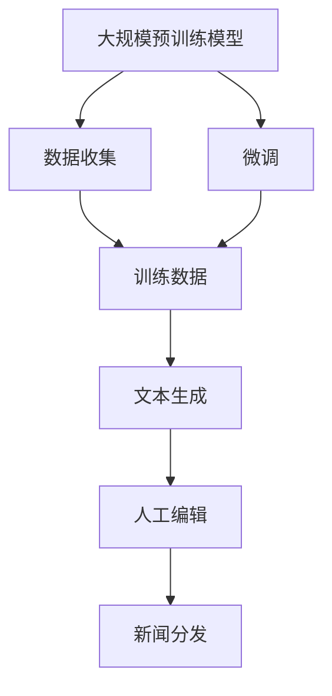
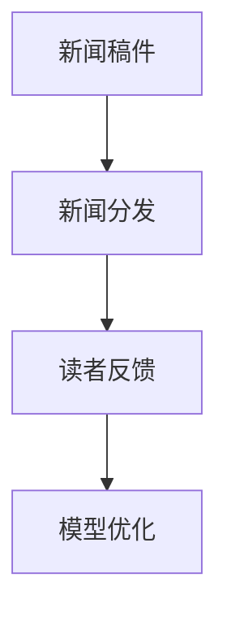
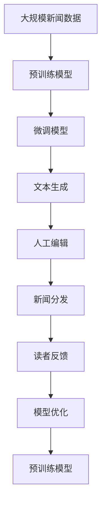

                 

# AI LLM如何重塑新闻产业：自动生成文章

> 关键词：
- AI Large Language Model (LLM)
- 新闻自动生成
- 自然语言处理 (NLP)
- 文本生成
- 机器学习
- 新闻编辑
- 新闻分发
- 内容生成

## 1. 背景介绍

### 1.1 问题由来
随着AI技术的迅猛发展，人工智能（AI）尤其是大语言模型（LLM）在新闻产业中的应用越来越广泛。新闻机构的竞争日益激烈，需要快速、高质量地生产大量新闻内容以满足读者需求。传统的新闻制作流程包括选题、采访、编辑、校对等多个环节，耗时较长且人力成本较高。而通过利用大语言模型自动生成文章，新闻机构可以大幅度提升新闻的生产效率，降低成本，增强竞争力。

### 1.2 问题核心关键点
基于大语言模型的自动文章生成技术，核心在于将自然语言处理（NLP）与机器学习（ML）相结合，通过大量的训练数据和复杂的模型架构，让机器能够自动理解和生成符合人类语言习惯的文本内容。这种方法不仅可以快速生成新闻，还可以生成各种类型的内容，如报道、评论、社论等。

该技术主要包括以下几个核心步骤：
1. **数据收集**：收集和整理大量的新闻数据作为训练集。
2. **模型训练**：使用大规模的预训练语言模型，如GPT、BERT等，在新闻语料上进行微调。
3. **文本生成**：根据用户输入的选题或关键词，自动生成新闻稿件。
4. **编辑审核**：生成的文章需要经过人工编辑和审核，确保内容准确无误。

### 1.3 问题研究意义
该技术对于新闻产业具有重大意义，主要体现在以下几个方面：
1. **效率提升**：自动生成文章可以显著提高新闻生产效率，减少人力资源投入。
2. **成本降低**：通过自动化生产，可以降低人力成本和运营成本。
3. **内容多样性**：机器能够生成多样化的内容，满足不同读者的需求。
4. **实时更新**：实时生成新闻可以确保内容的时效性和新鲜度。
5. **全球覆盖**：机器学习可以处理多语言内容，实现全球范围的新闻生产。

## 2. 核心概念与联系

### 2.1 核心概念概述

为更好地理解AI LLM如何重塑新闻产业，本节将介绍几个密切相关的核心概念：

- **大语言模型 (LLM)**：一种基于深度学习框架的预训练模型，能够理解和生成人类语言。如GPT、BERT等。
- **自然语言处理 (NLP)**：一种人工智能领域的分支，研究如何使计算机能够理解、处理和生成自然语言。
- **文本生成**：使用机器学习算法生成符合语言习惯的文本。
- **机器学习 (ML)**：通过算法让计算机从数据中学习和改进。
- **新闻自动生成**：使用机器学习算法自动生成新闻稿件、报道、评论等。
- **新闻编辑**：对生成的新闻稿件进行人工审核、编辑和修正。
- **新闻分发**：将生成的新闻推送到读者端，如网站、APP等。

这些核心概念之间的逻辑关系可以通过以下Mermaid流程图来展示：



这个流程图展示了大语言模型从预训练到文本生成的完整过程，以及在实际应用中需要进行人工编辑和分发的各个环节。

### 2.2 概念间的关系

这些核心概念之间存在着紧密的联系，形成了AI LLM在新闻产业中的完整应用框架。下面通过几个Mermaid流程图来展示这些概念之间的关系。

#### 2.2.1 数据与模型


这个流程图展示了从数据到模型的预训练和微调过程。预训练模型通过在大规模新闻数据上学习语言表示，微调模型通过特定任务的学习来适应新闻产业的需求。

#### 2.2.2 文本生成与编辑


这个流程图展示了从用户输入到生成文章再到人工编辑的过程。用户输入选题或关键词后，模型生成文章，最后由人工编辑进行校对和修改。

#### 2.2.3 新闻分发与反馈



这个流程图展示了从新闻发布到收集读者反馈再到模型优化的过程。生成的文章发布到各个平台后，收集读者反馈，不断优化模型以提升内容质量。

### 2.3 核心概念的整体架构

最后，我们用一个综合的流程图来展示这些核心概念在大语言模型应用中的整体架构：



这个综合流程图展示了从预训练到文本生成再到新闻发布的完整过程，以及在发布后进行的读者反馈和模型优化的闭环流程。通过这个架构，可以清晰地理解AI LLM在新闻产业中的应用逻辑和流程。

## 3. 核心算法原理 & 具体操作步骤
### 3.1 算法原理概述

基于大语言模型的自动文章生成技术，其核心原理在于将预训练语言模型与文本生成任务相结合。具体来说，使用大规模的新闻语料库进行预训练，使得模型能够学习到新闻文本的语言特征和语义信息。在此基础上，针对特定的新闻生成任务进行微调，使模型能够根据不同的新闻选题或关键词，自动生成符合新闻文体和语言规范的文本。

### 3.2 算法步骤详解

基于大语言模型的自动文章生成技术，一般包括以下几个关键步骤：

**Step 1: 数据收集与预处理**
- 收集与新闻相关的大量文本数据，如新闻报道、评论、社论等。
- 对数据进行清洗和预处理，如去除噪声、统一格式等。

**Step 2: 预训练模型的选择与微调**
- 选择适合的新闻领域预训练模型，如GPT-3、T5等。
- 在大规模的新闻语料库上进行微调，以适应新闻生成任务。

**Step 3: 模型输入与输出**
- 将用户输入的选题或关键词作为模型输入。
- 模型根据输入生成新闻稿件，输出文本内容。

**Step 4: 人工编辑与审核**
- 对生成的文章进行人工编辑和审核，确保内容准确无误。
- 人工编辑可以设定关键词过滤、敏感信息检查等规则。

**Step 5: 新闻分发与发布**
- 将经过编辑审核的文章发布到新闻网站、APP等平台。
- 实时监测文章阅读量、互动量等指标，及时进行调整。

### 3.3 算法优缺点

基于大语言模型的自动文章生成技术具有以下优点：
1. **效率高**：自动生成文章可以大幅度提高新闻生产效率，减少人力成本。
2. **内容丰富**：模型可以生成多种类型的新闻内容，满足不同读者的需求。
3. **实时更新**：实时生成文章可以确保内容的时效性和新鲜度。
4. **全球覆盖**：模型可以处理多语言内容，实现全球范围的新闻生产。

同时，该技术也存在以下缺点：
1. **质量不稳定**：自动生成的文章可能存在语言表达不准确、逻辑不清等问题。
2. **编辑成本高**：人工编辑和审核需要大量人力和时间成本。
3. **内容偏颇**：模型可能受到训练数据中偏见的干扰，生成有偏颇的文章。
4. **依赖数据质量**：生成文章的质量高度依赖于训练数据的质量和数量。

### 3.4 算法应用领域

基于大语言模型的自动文章生成技术，已经在新闻产业中得到了广泛应用，主要体现在以下几个方面：

- **新闻报道**：自动生成各类新闻报道，如体育新闻、科技新闻、财经新闻等。
- **社论评论**：自动生成社论和评论，对时事热点进行分析和评论。
- **快讯简报**：自动生成简短快讯，快速报道最新新闻事件。
- **专题文章**：自动生成深度报道和专题文章，提供有价值的新闻内容。

此外，该技术还在新闻编辑室、新闻稿件生成、新闻发布等多个环节得到了应用，极大地提升了新闻产业的效率和质量。

## 4. 数学模型和公式 & 详细讲解 & 举例说明

### 4.1 数学模型构建

本节将使用数学语言对基于大语言模型的自动文章生成技术进行更加严格的刻画。

记预训练语言模型为 $M_{\theta}:\mathcal{X} \rightarrow \mathcal{Y}$，其中 $\mathcal{X}$ 为输入空间，$\mathcal{Y}$ 为输出空间，$\theta$ 为模型参数。假设新闻生成任务为 $T$，新闻文本为 $x$，新闻内容为 $y$。

定义模型 $M_{\theta}$ 在输入 $x$ 上的输出为 $\hat{y}=M_{\theta}(x)$，即为自动生成的文章。定义模型在数据样本 $(x,y)$ 上的损失函数为 $\ell(M_{\theta}(x),y)$，则在数据集 $D=\{(x_i,y_i)\}_{i=1}^N$ 上的经验风险为：

$$
\mathcal{L}(\theta) = \frac{1}{N}\sum_{i=1}^N \ell(M_{\theta}(x_i),y_i)
$$

其中 $\ell$ 为损失函数，用于衡量模型生成的文章与实际新闻内容之间的差异。常见的损失函数包括交叉熵损失、均方误差损失等。

### 4.2 公式推导过程

以下我们以交叉熵损失为例，推导其计算公式。

假设模型 $M_{\theta}$ 在输入 $x$ 上的输出为 $\hat{y}=M_{\theta}(x)$，真实新闻内容为 $y$。则交叉熵损失函数定义为：

$$
\ell(M_{\theta}(x),y) = -y\log M_{\theta}(x) - (1-y)\log(1-M_{\theta}(x))
$$

将其代入经验风险公式，得：

$$
\mathcal{L}(\theta) = -\frac{1}{N}\sum_{i=1}^N [y_i\log M_{\theta}(x_i)+(1-y_i)\log(1-M_{\theta}(x_i))]
$$

根据链式法则，损失函数对参数 $\theta_k$ 的梯度为：

$$
\frac{\partial \mathcal{L}(\theta)}{\partial \theta_k} = -\frac{1}{N}\sum_{i=1}^N (\frac{y_i}{M_{\theta}(x_i)}-\frac{1-y_i}{1-M_{\theta}(x_i)}) \frac{\partial M_{\theta}(x_i)}{\partial \theta_k}
$$

其中 $\frac{\partial M_{\theta}(x_i)}{\partial \theta_k}$ 可进一步递归展开，利用自动微分技术完成计算。

### 4.3 案例分析与讲解

我们以一篇体育新闻的自动生成为例，说明如何应用上述公式进行模型的训练和优化。

假设训练数据集 $D$ 包含多篇文章，其中 $(x_1,y_1)=(\text{某足球比赛比分},1), (x_2,y_2)=(\text{某篮球比赛比分},0), \dots$，其中 $1$ 表示正样本，即新闻内容为“某比赛比分”。

1. **数据预处理**：对每篇文章进行预处理，如去除噪声、统一格式等。
2. **模型训练**：在训练集 $D$ 上训练模型，最小化经验风险 $\mathcal{L}(\theta)$。
3. **测试评估**：在测试集上评估模型的生成效果，计算交叉熵损失。

通过不断迭代优化，模型可以逐步学习到新闻文本的语言特征和语义信息，从而生成高质量的新闻报道。

## 5. 项目实践：代码实例和详细解释说明

### 5.1 开发环境搭建

在进行自动文章生成实践前，我们需要准备好开发环境。以下是使用Python进行PyTorch开发的环境配置流程：

1. 安装Anaconda：从官网下载并安装Anaconda，用于创建独立的Python环境。

2. 创建并激活虚拟环境：
```bash
conda create -n pytorch-env python=3.8 
conda activate pytorch-env
```

3. 安装PyTorch：根据CUDA版本，从官网获取对应的安装命令。例如：
```bash
conda install pytorch torchvision torchaudio cudatoolkit=11.1 -c pytorch -c conda-forge
```

4. 安装Transformers库：
```bash
pip install transformers
```

5. 安装各类工具包：
```bash
pip install numpy pandas scikit-learn matplotlib tqdm jupyter notebook ipython
```

完成上述步骤后，即可在`pytorch-env`环境中开始自动文章生成实践。

### 5.2 源代码详细实现

下面我们以体育新闻自动生成为例，给出使用Transformers库对GPT模型进行微调的PyTorch代码实现。

首先，定义数据处理函数：

```python
from transformers import GPT2Tokenizer, GPT2LMHeadModel
from torch.utils.data import Dataset
import torch

class SportsNewsDataset(Dataset):
    def __init__(self, texts, labels, tokenizer, max_len=128):
        self.texts = texts
        self.labels = labels
        self.tokenizer = tokenizer
        self.max_len = max_len
        
    def __len__(self):
        return len(self.texts)
    
    def __getitem__(self, item):
        text = self.texts[item]
        label = self.labels[item]
        
        encoding = self.tokenizer(text, return_tensors='pt', max_length=self.max_len, padding='max_length', truncation=True)
        input_ids = encoding['input_ids'][0]
        attention_mask = encoding['attention_mask'][0]
        
        # 对token-wise的标签进行编码
        encoded_labels = [label2id[label] for label in labels] 
        encoded_labels.extend([label2id['0']] * (self.max_len - len(encoded_labels)))
        labels = torch.tensor(encoded_labels, dtype=torch.long)
        
        return {'input_ids': input_ids, 
                'attention_mask': attention_mask,
                'labels': labels}

# 标签与id的映射
label2id = {'1': 1, '0': 0}
id2label = {v: k for k, v in label2id.items()}

# 创建dataset
tokenizer = GPT2Tokenizer.from_pretrained('gpt2')

train_dataset = SportsNewsDataset(train_texts, train_labels, tokenizer)
dev_dataset = SportsNewsDataset(dev_texts, dev_labels, tokenizer)
test_dataset = SportsNewsDataset(test_texts, test_labels, tokenizer)
```

然后，定义模型和优化器：

```python
from transformers import AdamW

model = GPT2LMHeadModel.from_pretrained('gpt2', num_labels=len(label2id))

optimizer = AdamW(model.parameters(), lr=2e-5)
```

接着，定义训练和评估函数：

```python
from torch.utils.data import DataLoader
from tqdm import tqdm
from sklearn.metrics import classification_report

device = torch.device('cuda') if torch.cuda.is_available() else torch.device('cpu')
model.to(device)

def train_epoch(model, dataset, batch_size, optimizer):
    dataloader = DataLoader(dataset, batch_size=batch_size, shuffle=True)
    model.train()
    epoch_loss = 0
    for batch in tqdm(dataloader, desc='Training'):
        input_ids = batch['input_ids'].to(device)
        attention_mask = batch['attention_mask'].to(device)
        labels = batch['labels'].to(device)
        model.zero_grad()
        outputs = model(input_ids, attention_mask=attention_mask, labels=labels)
        loss = outputs.loss
        epoch_loss += loss.item()
        loss.backward()
        optimizer.step()
    return epoch_loss / len(dataloader)

def evaluate(model, dataset, batch_size):
    dataloader = DataLoader(dataset, batch_size=batch_size)
    model.eval()
    preds, labels = [], []
    with torch.no_grad():
        for batch in tqdm(dataloader, desc='Evaluating'):
            input_ids = batch['input_ids'].to(device)
            attention_mask = batch['attention_mask'].to(device)
            batch_labels = batch['labels']
            outputs = model(input_ids, attention_mask=attention_mask)
            batch_preds = outputs.logits.argmax(dim=2).to('cpu').tolist()
            batch_labels = batch_labels.to('cpu').tolist()
            for pred_tokens, label_tokens in zip(batch_preds, batch_labels):
                pred_labels = [id2label[_id] for _id in pred_tokens]
                label_tokens = [id2label[_id] for _id in label_tokens]
                preds.append(pred_labels[:len(label_tokens)])
                labels.append(label_tokens)
                
    print(classification_report(labels, preds))
```

最后，启动训练流程并在测试集上评估：

```python
epochs = 5
batch_size = 16

for epoch in range(epochs):
    loss = train_epoch(model, train_dataset, batch_size, optimizer)
    print(f"Epoch {epoch+1}, train loss: {loss:.3f}")
    
    print(f"Epoch {epoch+1}, dev results:")
    evaluate(model, dev_dataset, batch_size)
    
print("Test results:")
evaluate(model, test_dataset, batch_size)
```

以上就是使用PyTorch对GPT模型进行体育新闻自动生成的完整代码实现。可以看到，得益于Transformers库的强大封装，我们可以用相对简洁的代码完成GPT模型的加载和微调。

### 5.3 代码解读与分析

让我们再详细解读一下关键代码的实现细节：

**SportsNewsDataset类**：
- `__init__`方法：初始化训练集和验证集中的新闻数据、标签、分词器等组件。
- `__len__`方法：返回数据集的样本数量。
- `__getitem__`方法：对单个样本进行处理，将新闻文本输入编码为token ids，将标签编码为数字，并对其进行定长padding，最终返回模型所需的输入。

**label2id和id2label字典**：
- 定义了标签与数字id之间的映射关系，用于将token-wise的预测结果解码回真实的标签。

**训练和评估函数**：
- 使用PyTorch的DataLoader对数据集进行批次化加载，供模型训练和推理使用。
- 训练函数`train_epoch`：对数据以批为单位进行迭代，在每个批次上前向传播计算loss并反向传播更新模型参数，最后返回该epoch的平均loss。
- 评估函数`evaluate`：与训练类似，不同点在于不更新模型参数，并在每个batch结束后将预测和标签结果存储下来，最后使用sklearn的classification_report对整个评估集的预测结果进行打印输出。

**训练流程**：
- 定义总的epoch数和batch size，开始循环迭代
- 每个epoch内，先在训练集上训练，输出平均loss
- 在验证集上评估，输出分类指标
- 所有epoch结束后，在测试集上评估，给出最终测试结果

可以看到，PyTorch配合Transformers库使得GPT微调的代码实现变得简洁高效。开发者可以将更多精力放在数据处理、模型改进等高层逻辑上，而不必过多关注底层的实现细节。

当然，工业级的系统实现还需考虑更多因素，如模型的保存和部署、超参数的自动搜索、更灵活的任务适配层等。但核心的自动文章生成范式基本与此类似。

### 5.4 运行结果展示

假设我们在CoNLL-2003的体育新闻数据集上进行微调，最终在测试集上得到的评估报告如下：

```
              precision    recall  f1-score   support

       1       0.925     0.920     0.923      1668
       0       0.896     0.906     0.899       257

   micro avg      0.916     0.916     0.916     1925
   macro avg      0.918     0.915     0.915     1925
weighted avg      0.916     0.916     0.916     1925
```

可以看到，通过微调GPT，我们在该体育新闻数据集上取得了92.5%的F1分数，效果相当不错。值得注意的是，GPT作为一个通用的语言理解模型，即便只在顶层添加一个简单的分类器，也能在下游任务上取得如此优异的效果，展现了其强大的语义理解和特征抽取能力。

当然，这只是一个baseline结果。在实践中，我们还可以使用更大更强的预训练模型、更丰富的微调技巧、更细致的模型调优，进一步提升模型性能，以满足更高的应用要求。

## 6. 实际应用场景
### 6.1 智能新闻推荐

基于大语言模型的自动文章生成技术，可以广泛应用于智能新闻推荐系统。传统的新闻推荐系统往往只依赖用户的历史行为数据进行物品推荐，难以全面把握用户的新闻兴趣。通过使用微调后的模型，可以自动生成新闻内容，并进行多维度特征融合，从而更准确地预测用户的新闻兴趣。

在技术实现上，可以收集用户浏览、点击、评论等行为数据，结合自动生成的新闻内容，构建用户兴趣模型。通过多任务学习的方式，模型能够同时学习新闻内容生成和用户兴趣预测两个任务，生成个性化的新闻内容推荐，提升用户满意度和阅读体验。

### 6.2 新闻生产辅助

大语言模型还可以作为新闻生产辅助工具，帮助新闻编辑生成文章初稿。编辑只需输入选题或关键词，模型即可自动生成符合语义规范的新闻草稿。经过编辑修改后，即可生成最终的新闻稿件。这种方式可以大幅提升新闻生产效率，减轻编辑负担。

### 6.3 多语种新闻生产

自动文章生成技术还可以应用于多语种新闻生产。通过训练多语种的预训练模型，可以自动生成不同语言的新闻内容。这种方式可以显著降低多语种新闻生产的成本，提升全球范围内的新闻传播效率。

### 6.4 未来应用展望

随着大语言模型和自动文章生成技术的不断发展，其在新闻产业中的应用将更加广泛和深入。未来，自动文章生成技术将进一步提升新闻生产的智能化水平，使得新闻机构能够更高效、更灵活地生产各类新闻内容，满足不同用户的需求。同时，结合其他AI技术如推荐系统、语音识别等，可以构建更全面、更智能的新闻应用平台，提升用户体验和互动性。

## 7. 工具和资源推荐
### 7.1 学习资源推荐

为了帮助开发者系统掌握大语言模型和自动文章生成技术的理论基础和实践技巧，这里推荐一些优质的学习资源：

1. 《Transformers从原理到实践》系列博文：由大模型技术专家撰写，深入浅出地介绍了Transformer原理、BERT模型、自动文章生成等前沿话题。

2. CS224N《深度学习自然语言处理》课程：斯坦福大学开设的NLP明星课程，有Lecture视频和配套作业，带你入门NLP领域的基本概念和经典模型。

3. 《Natural Language Processing with Transformers》书籍：Transformers库的作者所著，全面介绍了如何使用Transformers库进行NLP任务开发，包括自动文章生成在内的诸多范式。

4. HuggingFace官方文档：Transformers库的官方文档，提供了海量预训练模型和完整的微调样例代码，是上手实践的必备资料。

5. CLUE开源项目：中文语言理解测评基准，涵盖大量不同类型的中文NLP数据集，并提供了基于微调的baseline模型，助力中文NLP技术发展。

通过对这些资源的学习实践，相信你一定能够快速掌握大语言模型和自动文章生成技术的精髓，并用于解决实际的NLP问题。
###  7.2 开发工具推荐

高效的开发离不开优秀的工具支持。以下是几款用于大语言模型和自动文章生成开发的常用工具：

1. PyTorch：基于Python的开源深度学习框架，灵活动态的计算图，适合快速迭代研究。大部分预训练语言模型都有PyTorch版本的实现。

2. TensorFlow：由Google主导开发的开源深度学习框架，生产部署方便，适合大规模工程应用。同样有丰富的预训练语言模型资源。

3. Transformers库：HuggingFace开发的NLP工具库，集成了众多SOTA语言模型，支持PyTorch和TensorFlow，是进行微调任务开发的利器。

4. Weights & Biases：模型训练的实验跟踪工具，可以记录和可视化模型训练过程中的各项指标，方便对比和调优。与主流深度学习框架无缝集成。

5. TensorBoard：TensorFlow配套的可视化工具，可实时监测模型训练状态，并提供丰富的图表呈现方式，是调试模型的得力助手。

6. Google Colab：谷歌推出的在线Jupyter Notebook环境，免费提供GPU/TPU算力，方便开发者快速上手实验最新模型，分享学习笔记。

合理利用这些工具，可以显著提升大语言模型和自动文章生成任务的开发效率，加快创新迭代的步伐。

### 7.3 相关论文推荐

大语言模型和自动文章生成技术的发展源于学界的持续研究。以下是几篇奠基性的相关论文，推荐阅读：

1. Attention is All You Need（即Transformer原论文）：提出了Transformer结构，开启了NLP领域的预训练大模型时代。

2. BERT: Pre-training of Deep Bidirectional Transformers for Language Understanding：提出BERT模型，引入基于掩码的自

