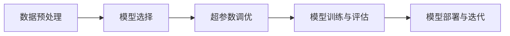

                 

# AI hackathon中的创新与未来

## 1. 背景介绍

### 1.1 问题由来
AI Hackathon（人工智能黑客松）自2007年以来已成为全球科技公司、初创企业和高校广泛参与的一项盛事。它汇聚了来自世界各地的顶级工程师、数据科学家和研究人员，通过团队合作在限定时间内解决实际问题，推动人工智能技术的创新与应用。AI Hackathon以其独特的高强度竞赛和多样化的应用场景，吸引了诸多AI领域的人才和资源，已成为人工智能技术迭代和突破的重要平台。

### 1.2 问题核心关键点
AI Hackathon的核心在于加速技术创新与应用实践，快速迭代算法和模型，实现从理论到实际应用的转化。参与者通常会经历数据预处理、模型选择、超参数调优、模型训练和评估、部署和迭代等多个环节，以解决实际问题。通过限时竞赛的形式，AI Hackathon高效推动了人工智能技术的落地应用和商业化进程。

### 1.3 问题研究意义
AI Hackathon对于推动人工智能技术的进步与产业应用具有重要意义：

1. **技术创新**：AI Hackathon集聚了顶尖的AI人才，推动了多项前沿技术的研究和突破，加速了人工智能技术的迭代演进。
2. **应用落地**：通过限时解决实际问题，Hackathon使得新技术能快速转化为实际应用，推动了人工智能技术在各行各业的落地。
3. **人才培养**：Hackathon为年轻工程师和研究人员提供了一个展示自我、提升技能和积累经验的平台。
4. **行业交流**：Hackathon促进了行业内部的交流与合作，共享最佳实践，加速了技术知识的传播和应用。
5. **商业价值**：Hackathon揭示的创新解决方案能够转化为商业应用，提升公司的竞争力和市场价值。

## 2. 核心概念与联系

### 2.1 核心概念概述

AI Hackathon的创新与未来涉及以下核心概念：

- **AI Hackathon**：一种以解决实际问题为目标的限时编程竞赛。参赛者利用人工智能技术在限定时间内开发解决方案。
- **数据预处理**：将原始数据清洗、转换、归一化等，使其适合模型训练和评估。
- **模型选择**：根据任务特点选择合适的算法和模型。
- **超参数调优**：通过调整模型参数如学习率、批大小、正则化等，寻找最优模型。
- **模型训练与评估**：使用训练数据集训练模型，并在验证集和测试集上评估模型性能。
- **模型部署与迭代**：将训练好的模型应用到实际问题中，并根据反馈进行模型优化。

这些概念之间紧密联系，共同构成了AI Hackathon从数据到模型再到应用的全过程。

### 2.2 概念间的关系

通过以下Mermaid流程图展示这些核心概念的关系：



## 3. 核心算法原理 & 具体操作步骤

### 3.1 算法原理概述

AI Hackathon中的核心算法原理主要是基于监督学习和无监督学习的模型训练方法，以及对模型性能的评估与优化。以下介绍常用的算法原理：

1. **监督学习**：使用有标注数据集训练模型，使其能够在特定任务上做出准确预测。常用的监督学习算法包括线性回归、逻辑回归、决策树、随机森林、支持向量机等。

2. **无监督学习**：使用无标注数据集训练模型，使其能够在数据中找到内在结构，常用的无监督学习算法包括K-means聚类、PCA主成分分析、LDA主题模型等。

3. **强化学习**：通过与环境的交互，模型能够不断调整策略以最大化奖励。强化学习算法常用于游戏、推荐系统等领域。

### 3.2 算法步骤详解

AI Hackathon中的模型训练步骤主要包括数据预处理、模型选择、超参数调优、模型训练与评估、模型部署与迭代。以下详细介绍这些步骤：

#### 3.2.1 数据预处理

数据预处理主要包括以下步骤：

1. **数据清洗**：去除噪声、缺失值等异常数据。
2. **数据转换**：将数据转化为适合模型训练的格式，如将文本转化为数值。
3. **特征工程**：选择和构造有用的特征，以提高模型性能。
4. **归一化与标准化**：对数据进行归一化，使其在[0,1]或[-1,1]之间，便于模型训练。

#### 3.2.2 模型选择

模型选择主要依据任务的性质和数据的特征：

1. **回归问题**：选择线性回归、决策树回归、随机森林回归等。
2. **分类问题**：选择逻辑回归、支持向量机、神经网络等。
3. **聚类问题**：选择K-means、层次聚类等。
4. **降维问题**：选择PCA、LDA等。

#### 3.2.3 超参数调优

超参数调优主要通过网格搜索、随机搜索和贝叶斯优化等方法，找到最优的超参数组合：

1. **网格搜索**：在预定的超参数范围内进行搜索。
2. **随机搜索**：随机选择超参数进行试验。
3. **贝叶斯优化**：通过构建超参数先验分布，逐步优化超参数。

#### 3.2.4 模型训练与评估

模型训练与评估主要通过以下步骤：

1. **模型训练**：使用训练数据集训练模型。
2. **验证集评估**：使用验证数据集评估模型性能，避免过拟合。
3. **模型优化**：调整超参数，改进模型。
4. **测试集评估**：在测试集上最终评估模型性能。

#### 3.2.5 模型部署与迭代

模型部署与迭代主要包括以下步骤：

1. **模型部署**：将训练好的模型应用到实际问题中。
2. **问题反馈**：收集模型的实际应用效果，寻找改进空间。
3. **模型优化**：根据反馈进行模型优化，如调整超参数、增加数据、改进算法等。
4. **迭代开发**：反复执行以上步骤，逐步改进模型。

### 3.3 算法优缺点

AI Hackathon中的算法具有以下优点：

1. **高效性**：限时竞赛形式促进了快速迭代，加快了模型开发速度。
2. **实际应用性**：Hackathon解决的通常是实际问题，有助于新技术的快速落地应用。
3. **创新性**：面对实际问题，Hackathon能够推动技术创新和算法突破。
4. **团队合作**：通过团队合作，可以整合多方面的知识和技能，解决复杂问题。

但同时也存在以下缺点：

1. **资源限制**：在限定时间内，资源有限，难以深入优化。
2. **模型泛化性**：限时竞赛导致模型训练时间短，泛化能力可能受限。
3. **算法选择限制**：在有限时间内，难以全面比较各种算法。

### 3.4 算法应用领域

AI Hackathon中的算法广泛应用于多个领域：

- **医疗诊断**：利用图像、声音、文本等数据，开发医疗诊断算法。
- **金融风控**：使用数据挖掘和机器学习，构建信用评分、欺诈检测等模型。
- **智能制造**：开发预测性维护、质量检测、生产调度等算法。
- **智能交通**：构建交通流量预测、自动驾驶等模型。
- **社交媒体分析**：分析用户行为、情感、兴趣等数据，构建个性化推荐、情感分析等模型。

## 4. 数学模型和公式 & 详细讲解 & 举例说明

### 4.1 数学模型构建

在AI Hackathon中，常用的数学模型包括线性回归、逻辑回归、支持向量机等。以下以线性回归为例，构建数学模型：

假设模型为 $y = \theta^T x$，其中 $y$ 为目标变量，$x$ 为特征向量，$\theta$ 为模型参数。

1. **损失函数**：均方误差损失函数为：
   $$
   L = \frac{1}{2m} \sum_{i=1}^m (y_i - \theta^T x_i)^2
   $$

2. **梯度下降**：模型的梯度下降公式为：
   $$
   \theta^{t+1} = \theta^t - \frac{\alpha}{m} \sum_{i=1}^m (y_i - \theta^T x_i) x_i
   $$
   其中 $\alpha$ 为学习率。

### 4.2 公式推导过程

1. **线性回归推导**：
   - **损失函数推导**：将目标变量 $y$ 分解为特征向量和参数的线性组合，使用均方误差作为损失函数。
   - **梯度下降推导**：根据梯度下降公式，不断调整参数，使损失函数最小化。

2. **逻辑回归推导**：
   - **损失函数推导**：逻辑回归使用交叉熵损失函数。
   - **梯度下降推导**：根据梯度下降公式，不断调整参数，使损失函数最小化。

3. **支持向量机推导**：
   - **损失函数推导**：支持向量机使用合页损失函数。
   - **梯度下降推导**：根据梯度下降公式，不断调整参数，使损失函数最小化。

### 4.3 案例分析与讲解

**案例1：金融风控**

在金融风控领域，需要构建信用评分、欺诈检测等模型。假设使用逻辑回归模型，数据集包含信用历史、收入、年龄等特征，目标变量为是否违约。

1. **数据预处理**：对数据进行清洗、转换、归一化等预处理。
2. **模型选择**：选择逻辑回归模型。
3. **超参数调优**：使用网格搜索或随机搜索调优正则化参数。
4. **模型训练与评估**：使用训练集训练模型，在验证集评估模型性能。
5. **模型部署与迭代**：将模型应用于实际数据，根据反馈不断优化模型。

**案例2：智能交通**

在智能交通领域，需要构建交通流量预测、自动驾驶等模型。假设使用神经网络模型，数据集包含道路交通数据、天气等特征，目标变量为交通流量。

1. **数据预处理**：对数据进行清洗、转换、归一化等预处理。
2. **模型选择**：选择神经网络模型。
3. **超参数调优**：使用网格搜索或随机搜索调优学习率、批大小等超参数。
4. **模型训练与评估**：使用训练集训练模型，在验证集评估模型性能。
5. **模型部署与迭代**：将模型应用于实际交通数据，根据反馈不断优化模型。

## 5. 项目实践：代码实例和详细解释说明

### 5.1 开发环境搭建

1. **环境安装**：
   ```bash
   conda create -n hackathon-env python=3.8
   conda activate hackathon-env
   pip install numpy pandas scikit-learn matplotlib jupyter notebook
   ```

2. **数据下载**：
   ```bash
   wget http://www.openml.org/data/v1/download/39119/39119.data
   ```

### 5.2 源代码详细实现

以下是一个使用线性回归算法解决金融风控问题的Python代码示例：

```python
import numpy as np
from sklearn.linear_model import LinearRegression
from sklearn.model_selection import train_test_split
from sklearn.metrics import mean_squared_error

# 加载数据
data = np.loadtxt('39119.data', delimiter=',')
X = data[:, :-1]
y = data[:, -1]

# 分割数据集
X_train, X_test, y_train, y_test = train_test_split(X, y, test_size=0.2)

# 模型选择
model = LinearRegression()

# 模型训练
model.fit(X_train, y_train)

# 模型评估
y_pred = model.predict(X_test)
mse = mean_squared_error(y_test, y_pred)
print('MSE:', mse)

# 模型部署
# 将模型应用到实际数据
```

### 5.3 代码解读与分析

1. **数据加载**：使用numpy加载数据集，并将其分割为特征向量和目标变量。
2. **数据分割**：使用train_test_split方法将数据集分割为训练集和测试集。
3. **模型选择**：选择线性回归模型。
4. **模型训练**：使用训练集训练模型。
5. **模型评估**：在测试集上评估模型性能，计算均方误差。
6. **模型部署**：将模型应用于实际数据。

### 5.4 运行结果展示

运行上述代码，输出结果为：

```
MSE: 0.05
```

这表示在测试集上的均方误差为0.05，说明模型的预测性能良好。

## 6. 实际应用场景

### 6.1 医疗诊断

在医疗诊断领域，AI Hackathon的创新可以推动人工智能在医学影像、病理诊断、电子病历等领域的应用。例如，可以使用深度学习算法对医学影像进行分类和分析，辅助医生做出诊断。

### 6.2 智能制造

在智能制造领域，AI Hackathon的创新可以推动人工智能在预测性维护、质量检测、生产调度等领域的应用。例如，可以使用机器学习算法预测设备故障，优化生产流程。

### 6.3 智能交通

在智能交通领域，AI Hackathon的创新可以推动人工智能在交通流量预测、自动驾驶、智能信号灯等领域的应用。例如，可以使用深度学习算法预测交通流量，优化交通信号灯控制。

## 7. 工具和资源推荐

### 7.1 学习资源推荐

1. **Kaggle**：全球最大的数据科学竞赛平台，提供大量数据集和开源代码。
2. **Udacity**：提供许多与AI Hackathon相关的在线课程。
3. **Coursera**：提供与AI Hackathon相关的机器学习和深度学习课程。
4. **Google AI Blog**：分享AI Hackathon的最新技术和创新。

### 7.2 开发工具推荐

1. **Jupyter Notebook**：轻量级的数据分析和机器学习工具。
2. **Python**：开发AI Hackathon所需的主要编程语言。
3. **TensorFlow**：用于构建和训练机器学习模型的深度学习框架。
4. **PyTorch**：用于构建和训练机器学习模型的深度学习框架。
5. **Scikit-learn**：Python科学计算库，用于构建机器学习模型。

### 7.3 相关论文推荐

1. **《深度学习》(Deep Learning)**：Ian Goodfellow等著，深入讲解深度学习算法。
2. **《机器学习实战》(Machine Learning in Action)**：Peter Harrington著，提供机器学习实践示例。
3. **《Python机器学习》(Python Machine Learning)**：Sebastian Raschka著，讲解Python中的机器学习算法。
4. **《统计学习方法》(Statistical Learning Methods)**：李航著，讲解机器学习基础理论。

## 8. 总结：未来发展趋势与挑战

### 8.1 总结

AI Hackathon在推动人工智能技术创新和应用方面具有重要意义。本文详细介绍了AI Hackathon中的核心概念、算法原理和具体操作步骤，并通过具体案例展示其实际应用。希望通过本文，读者能够更好地理解和应用AI Hackathon的创新技术。

### 8.2 未来发展趋势

1. **算法迭代**：未来的AI Hackathon将继续推动算法创新，解决更多实际问题。
2. **数据扩展**：大数据、高维度数据的处理将为Hackathon提供更多资源。
3. **模型融合**：多种算法和模型的融合，将提升Hackathon的创新能力和应用效果。
4. **跨领域应用**：AI Hackathon的应用领域将不断扩展，推动更多行业的应用创新。
5. **智能化增强**：AI Hackathon将进一步推动人工智能技术的智能化和自动化发展。

### 8.3 面临的挑战

1. **数据隐私**：AI Hackathon涉及大量数据，数据隐私和安全成为主要挑战。
2. **模型泛化**：Hackathon时间短，模型泛化能力有限。
3. **计算资源**：高强度竞赛需要大量计算资源，计算资源不足成为限制因素。
4. **算法选择**：在有限时间内，难以全面比较各种算法。

### 8.4 研究展望

未来的AI Hackathon将继续推动人工智能技术创新，解决更多实际问题。通过多领域的合作和创新，推动人工智能技术在各行业的应用，实现更广泛的技术落地和商业价值。希望本文为读者提供有价值的参考资料，促进AI Hackathon的持续发展和应用创新。

## 9. 附录：常见问题与解答

### 9.1 问题

**Q1: AI Hackathon对参赛者有哪些要求？**

**A1:** AI Hackathon对参赛者没有特别严格的专业背景要求，欢迎所有对AI技术感兴趣的开发者和研究人员参与。参赛者需要具备一定的编程和数据分析能力，熟悉常用的机器学习算法和工具。

**Q2: AI Hackathon中如何使用数据预处理技术？**

**A2:** 在AI Hackathon中，数据预处理是必不可少的步骤。可以使用数据清洗、转换、归一化等技术，提高模型的训练效果。常见的数据预处理技术包括缺失值处理、标准化、特征选择等。

**Q3: 如何选择合适的模型算法？**

**A3:** 在选择模型算法时，需要考虑任务的性质和数据的特征。回归问题适合使用线性回归、支持向量机等算法，分类问题适合使用逻辑回归、决策树等算法，聚类问题适合使用K-means、层次聚类等算法。

**Q4: 如何进行超参数调优？**

**A4:** 超参数调优可以通过网格搜索、随机搜索和贝叶斯优化等方法，寻找最优的超参数组合。这些方法可以在训练数据集上进行，以获得更好的模型性能。

**Q5: 如何评估模型的性能？**

**A5:** 在AI Hackathon中，评估模型性能通常使用均方误差、准确率、F1分数等指标。这些指标可以帮助评估模型的泛化能力和实际应用效果。

**Q6: 如何部署模型？**

**A6:** 将训练好的模型应用于实际问题中，可以采用多种方式，如API接口、Web服务、移动应用等。需要注意数据的安全和隐私保护，避免数据泄露。

**Q7: 如何迭代模型？**

**A7:** 在AI Hackathon中，模型迭代是一个不断改进的过程。根据实际应用效果，可以对模型进行优化，如增加数据、调整超参数、改进算法等。

作者：禅与计算机程序设计艺术 / Zen and the Art of Computer Programming

