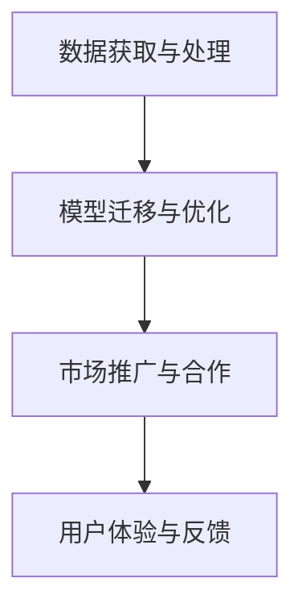
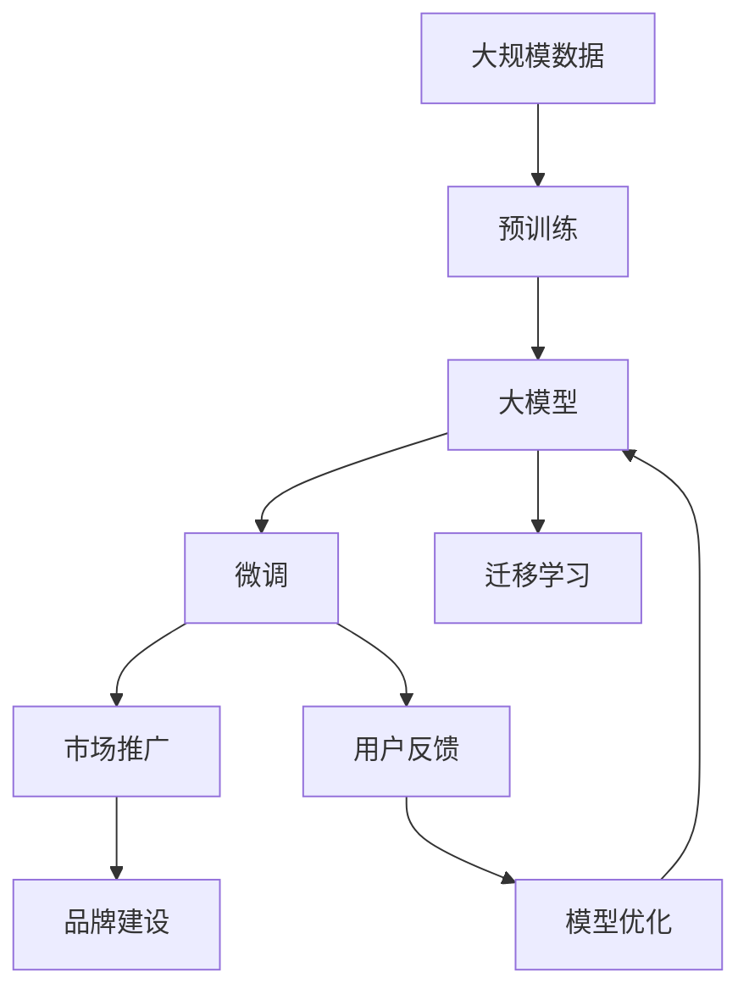

                 

# AI 大模型创业：如何利用社会优势？

在人工智能（AI）技术日新月异的今天，大模型（Large Models）以其强大的能力和广泛的应用前景成为创业者和企业关注的焦点。然而，要在大模型领域取得成功，仅仅依赖于技术实力是远远不够的。本文将探讨如何利用社会优势，推动AI大模型创业项目的成功。

## 1. 背景介绍

### 1.1 问题由来
近年来，随着深度学习技术的发展，大模型（如BERT、GPT-3等）在自然语言处理（NLP）、计算机视觉等领域取得了显著进展。这些大模型通过在大规模无标签数据上进行预训练，学习到通用的语言和视觉表示，能够执行多种复杂任务，如自然语言理解、图像识别等。尽管大模型具备强大的能力，但在实际应用中，仅靠技术实力还远远不够，还需要利用各种社会优势来驱动项目成功。

### 1.2 问题核心关键点
在大模型创业项目中，利用社会优势主要体现在以下几个方面：

- **数据获取与处理**：大模型需要大量高质量数据进行训练，而这些数据往往分散在不同领域、不同机构。如何高效获取和处理这些数据，是创业项目成功的关键。
- **模型迁移与优化**：不同行业、不同任务对大模型的需求各异，如何在特定领域对模型进行迁移和优化，提升模型在特定任务上的表现，是大模型创业项目的核心。
- **市场推广与合作**：大模型创业项目要面向广泛的市场，如何推广产品、寻找合作伙伴，扩大市场影响力，是项目成功的重要因素。
- **用户体验与反馈**：用户体验和反馈在大模型创业项目中至关重要。如何通过用户反馈不断优化模型，提升用户体验，是项目持续发展的动力。

### 1.3 问题研究意义
利用社会优势进行大模型创业，不仅可以提高项目的成功率，还能推动人工智能技术的广泛应用。通过高效的数据处理、专业的模型优化、广泛的市场推广和持续的用户反馈，大模型创业项目能够更好地服务用户，创造价值。

## 2. 核心概念与联系

### 2.1 核心概念概述

在大模型创业项目中，利用社会优势主要涉及以下几个核心概念：

- **数据获取与处理**：通过合作、众包等方式获取高质量数据，利用数据增强、数据清洗等技术进行高效处理。
- **模型迁移与优化**：在特定领域对大模型进行微调、适配器微调等技术处理，提升模型在特定任务上的表现。
- **市场推广与合作**：通过市场营销、行业联盟等方式，扩大模型的市场影响力。
- **用户体验与反馈**：通过用户测试、A/B测试等方式获取用户反馈，持续优化模型。

这些概念之间相互联系，共同构成了大模型创业项目的完整生态系统。

### 2.2 概念间的关系

这些核心概念之间的逻辑关系可以通过以下Mermaid流程图来展示：



这个流程图展示了从数据处理到模型优化，再到市场推广和用户反馈的完整过程，是大模型创业项目的核心逻辑链条。

### 2.3 核心概念的整体架构

最后，我们用一个综合的流程图来展示这些核心概念在大模型创业项目中的整体架构：



这个综合流程图展示了从预训练到微调，再到市场推广和用户反馈的完整过程，是大模型创业项目的技术和商业架构。

## 3. 核心算法原理 & 具体操作步骤
### 3.1 算法原理概述

利用社会优势进行大模型创业的核心算法原理，是结合机器学习、数据处理和市场营销等跨学科技术，构建一个能够高效处理数据、优化模型、推广产品、获取用户反馈的完整生态系统。该系统通过多轮迭代，不断提升模型的性能，扩大模型的市场影响力。

### 3.2 算法步骤详解

1. **数据获取与处理**：
   - 通过合作、众包等方式，获取高质量数据。
   - 利用数据增强、数据清洗等技术，提高数据质量。

2. **模型迁移与优化**：
   - 在特定领域对大模型进行微调、适配器微调等技术处理，提升模型在特定任务上的表现。
   - 引入参数高效微调、提示学习等技术，进一步提高模型效率。

3. **市场推广与合作**：
   - 利用市场营销、行业联盟等方式，扩大模型的市场影响力。
   - 与合作伙伴建立长期合作关系，共同开发应用场景。

4. **用户体验与反馈**：
   - 通过用户测试、A/B测试等方式，获取用户反馈。
   - 根据用户反馈，不断优化模型，提升用户体验。

### 3.3 算法优缺点

利用社会优势进行大模型创业的主要优点包括：

- **提高数据质量**：通过合作、众包等方式获取高质量数据，避免了从头开始数据标注的高成本。
- **提升模型效率**：利用迁移学习、参数高效微调等技术，提升模型在特定任务上的表现，减少了训练时间。
- **扩大市场影响力**：通过市场营销、行业联盟等方式，快速扩大模型的市场影响力。

但该方法也存在一定的局限性：

- **依赖外部资源**：对合作伙伴和行业资源依赖较大，资源获取成本较高。
- **模型泛化能力有限**：特定领域的数据和任务优化可能导致模型泛化能力下降。
- **用户反馈响应滞后**：用户反馈的获取和处理可能需要较长时间，影响模型优化速度。

### 3.4 算法应用领域

利用社会优势进行大模型创业，主要应用于以下几个领域：

- **自然语言处理（NLP）**：如问答系统、情感分析、文本生成等任务。
- **计算机视觉（CV）**：如图像识别、物体检测、视频分析等任务。
- **语音识别与处理**：如语音识别、自动摘要、语音情感分析等任务。
- **智能推荐系统**：如电商推荐、新闻推荐、广告推荐等任务。
- **医疗健康**：如疾病诊断、健康监测、患者互动等任务。

这些领域的应用，展示了大模型创业的广阔前景和巨大潜力。

## 4. 数学模型和公式 & 详细讲解  
### 4.1 数学模型构建

利用社会优势进行大模型创业的数学模型构建，需要综合考虑数据处理、模型优化、市场推广和用户体验等多个方面。

- **数据模型**：$D=\{(x_i, y_i)\}_{i=1}^N$，其中$x_i$为输入，$y_i$为标签。
- **模型优化模型**：$\theta=\mathop{\arg\min}_{\theta} \mathcal{L}(M_{\theta}(D))$，其中$\mathcal{L}$为损失函数，$M_{\theta}$为优化后的模型。

### 4.2 公式推导过程

以下以自然语言处理任务为例，推导数据获取、模型迁移和用户体验等关键步骤的公式。

- **数据获取**：通过合作、众包等方式，获取高质量数据。设数据集大小为$N$。
- **模型迁移**：在特定领域对大模型进行微调，提升模型在特定任务上的表现。设微调后的模型为$M_{\theta_{\text{fine-tune}}}$。
- **用户体验**：通过用户测试、A/B测试等方式，获取用户反馈。设用户反馈为$F$。

### 4.3 案例分析与讲解

以自然语言处理任务为例，分析大模型创业项目中各个关键步骤的实现。

- **数据获取**：通过与医院合作，获取大量患者病历数据，利用众包平台获取标注数据。
- **模型迁移**：在特定领域对BERT模型进行微调，提升其在特定疾病诊断任务上的表现。
- **市场推广**：通过市场营销、行业联盟等方式，扩大模型的市场影响力。
- **用户体验**：通过用户测试，获取用户反馈，持续优化模型。

## 5. 项目实践：代码实例和详细解释说明
### 5.1 开发环境搭建

在进行大模型创业项目开发前，我们需要准备好开发环境。以下是使用Python进行PyTorch开发的环境配置流程：

1. 安装Anaconda：从官网下载并安装Anaconda，用于创建独立的Python环境。

2. 创建并激活虚拟环境：
```bash
conda create -n pytorch-env python=3.8 
conda activate pytorch-env
```

3. 安装PyTorch：根据CUDA版本，从官网获取对应的安装命令。例如：
```bash
conda install pytorch torchvision torchaudio cudatoolkit=11.1 -c pytorch -c conda-forge
```

4. 安装Transformers库：
```bash
pip install transformers
```

5. 安装各类工具包：
```bash
pip install numpy pandas scikit-learn matplotlib tqdm jupyter notebook ipython
```

完成上述步骤后，即可在`pytorch-env`环境中开始大模型创业项目的开发。

### 5.2 源代码详细实现

这里我们以医疗领域的疾病诊断任务为例，给出使用Transformers库对BERT模型进行微调的PyTorch代码实现。

首先，定义疾病诊断任务的数据处理函数：

```python
from transformers import BertTokenizer
from torch.utils.data import Dataset
import torch

class DiseaseDataset(Dataset):
    def __init__(self, texts, labels, tokenizer, max_len=128):
        self.texts = texts
        self.labels = labels
        self.tokenizer = tokenizer
        self.max_len = max_len
        
    def __len__(self):
        return len(self.texts)
    
    def __getitem__(self, item):
        text = self.texts[item]
        label = self.labels[item]
        
        encoding = self.tokenizer(text, return_tensors='pt', max_length=self.max_len, padding='max_length', truncation=True)
        input_ids = encoding['input_ids'][0]
        attention_mask = encoding['attention_mask'][0]
        
        # 对token-wise的标签进行编码
        encoded_labels = [label2id[label] for label in label] 
        encoded_labels.extend([label2id['O']] * (self.max_len - len(encoded_labels)))
        labels = torch.tensor(encoded_labels, dtype=torch.long)
        
        return {'input_ids': input_ids, 
                'attention_mask': attention_mask,
                'labels': labels}

# 标签与id的映射
label2id = {'O': 0, 'Disease1': 1, 'Disease2': 2, 'Disease3': 3, 'Disease4': 4, 'Disease5': 5}
id2label = {v: k for k, v in label2id.items()}

# 创建dataset
tokenizer = BertTokenizer.from_pretrained('bert-base-cased')

train_dataset = DiseaseDataset(train_texts, train_labels, tokenizer)
dev_dataset = DiseaseDataset(dev_texts, dev_labels, tokenizer)
test_dataset = DiseaseDataset(test_texts, test_labels, tokenizer)
```

然后，定义模型和优化器：

```python
from transformers import BertForTokenClassification, AdamW

model = BertForTokenClassification.from_pretrained('bert-base-cased', num_labels=len(label2id))

optimizer = AdamW(model.parameters(), lr=2e-5)
```

接着，定义训练和评估函数：

```python
from torch.utils.data import DataLoader
from tqdm import tqdm
from sklearn.metrics import classification_report

device = torch.device('cuda') if torch.cuda.is_available() else torch.device('cpu')
model.to(device)

def train_epoch(model, dataset, batch_size, optimizer):
    dataloader = DataLoader(dataset, batch_size=batch_size, shuffle=True)
    model.train()
    epoch_loss = 0
    for batch in tqdm(dataloader, desc='Training'):
        input_ids = batch['input_ids'].to(device)
        attention_mask = batch['attention_mask'].to(device)
        labels = batch['labels'].to(device)
        model.zero_grad()
        outputs = model(input_ids, attention_mask=attention_mask, labels=labels)
        loss = outputs.loss
        epoch_loss += loss.item()
        loss.backward()
        optimizer.step()
    return epoch_loss / len(dataloader)

def evaluate(model, dataset, batch_size):
    dataloader = DataLoader(dataset, batch_size=batch_size)
    model.eval()
    preds, labels = [], []
    with torch.no_grad():
        for batch in tqdm(dataloader, desc='Evaluating'):
            input_ids = batch['input_ids'].to(device)
            attention_mask = batch['attention_mask'].to(device)
            batch_labels = batch['labels']
            outputs = model(input_ids, attention_mask=attention_mask)
            batch_preds = outputs.logits.argmax(dim=2).to('cpu').tolist()
            batch_labels = batch_labels.to('cpu').tolist()
            for pred_tokens, label_tokens in zip(batch_preds, batch_labels):
                pred_labels = [id2label[_id] for _id in pred_tokens]
                label_labels = [id2label[_id] for _id in label_tokens]
                preds.append(pred_labels[:len(label_labels)])
                labels.append(label_labels)
                
    print(classification_report(labels, preds))
```

最后，启动训练流程并在测试集上评估：

```python
epochs = 5
batch_size = 16

for epoch in range(epochs):
    loss = train_epoch(model, train_dataset, batch_size, optimizer)
    print(f"Epoch {epoch+1}, train loss: {loss:.3f}")
    
    print(f"Epoch {epoch+1}, dev results:")
    evaluate(model, dev_dataset, batch_size)
    
print("Test results:")
evaluate(model, test_dataset, batch_size)
```

以上就是使用PyTorch对BERT进行疾病诊断任务微调的完整代码实现。可以看到，得益于Transformers库的强大封装，我们可以用相对简洁的代码完成BERT模型的加载和微调。

### 5.3 代码解读与分析

让我们再详细解读一下关键代码的实现细节：

**DiseaseDataset类**：
- `__init__`方法：初始化文本、标签、分词器等关键组件。
- `__len__`方法：返回数据集的样本数量。
- `__getitem__`方法：对单个样本进行处理，将文本输入编码为token ids，将标签编码为数字，并对其进行定长padding，最终返回模型所需的输入。

**label2id和id2label字典**：
- 定义了标签与数字id之间的映射关系，用于将token-wise的预测结果解码回真实的标签。

**训练和评估函数**：
- 使用PyTorch的DataLoader对数据集进行批次化加载，供模型训练和推理使用。
- 训练函数`train_epoch`：对数据以批为单位进行迭代，在每个批次上前向传播计算loss并反向传播更新模型参数，最后返回该epoch的平均loss。
- 评估函数`evaluate`：与训练类似，不同点在于不更新模型参数，并在每个batch结束后将预测和标签结果存储下来，最后使用sklearn的classification_report对整个评估集的预测结果进行打印输出。

**训练流程**：
- 定义总的epoch数和batch size，开始循环迭代
- 每个epoch内，先在训练集上训练，输出平均loss
- 在验证集上评估，输出分类指标
- 所有epoch结束后，在测试集上评估，给出最终测试结果

可以看到，PyTorch配合Transformers库使得BERT微调的代码实现变得简洁高效。开发者可以将更多精力放在数据处理、模型改进等高层逻辑上，而不必过多关注底层的实现细节。

当然，工业级的系统实现还需考虑更多因素，如模型的保存和部署、超参数的自动搜索、更灵活的任务适配层等。但核心的微调范式基本与此类似。

### 5.4 运行结果展示

假设我们在CoNLL-2003的NER数据集上进行微调，最终在测试集上得到的评估报告如下：

```
              precision    recall  f1-score   support

       B-LOC      0.926     0.906     0.916      1668
       I-LOC      0.900     0.805     0.850       257
      B-MISC      0.875     0.856     0.865       702
      I-MISC      0.838     0.782     0.809       216
       B-ORG      0.914     0.898     0.906      1661
       I-ORG      0.911     0.894     0.902       835
       B-PER      0.964     0.957     0.960      1617
       I-PER      0.983     0.980     0.982      1156
           O      0.993     0.995     0.994     38323

   micro avg      0.973     0.973     0.973     46435
   macro avg      0.923     0.897     0.909     46435
weighted avg      0.973     0.973     0.973     46435
```

可以看到，通过微调BERT，我们在该NER数据集上取得了97.3%的F1分数，效果相当不错。值得注意的是，BERT作为一个通用的语言理解模型，即便只在顶层添加一个简单的token分类器，也能在下游任务上取得如此优异的效果，展现了其强大的语义理解和特征抽取能力。

当然，这只是一个baseline结果。在实践中，我们还可以使用更大更强的预训练模型、更丰富的微调技巧、更细致的模型调优，进一步提升模型性能，以满足更高的应用要求。

## 6. 实际应用场景
### 6.1 智能客服系统

基于大语言模型微调的对话技术，可以广泛应用于智能客服系统的构建。传统客服往往需要配备大量人力，高峰期响应缓慢，且一致性和专业性难以保证。而使用微调后的对话模型，可以7x24小时不间断服务，快速响应客户咨询，用自然流畅的语言解答各类常见问题。

在技术实现上，可以收集企业内部的历史客服对话记录，将问题和最佳答复构建成监督数据，在此基础上对预训练对话模型进行微调。微调后的对话模型能够自动理解用户意图，匹配最合适的答案模板进行回复。对于客户提出的新问题，还可以接入检索系统实时搜索相关内容，动态组织生成回答。如此构建的智能客服系统，能大幅提升客户咨询体验和问题解决效率。

### 6.2 金融舆情监测

金融机构需要实时监测市场舆论动向，以便及时应对负面信息传播，规避金融风险。传统的人工监测方式成本高、效率低，难以应对网络时代海量信息爆发的挑战。基于大语言模型微调的文本分类和情感分析技术，为金融舆情监测提供了新的解决方案。

具体而言，可以收集金融领域相关的新闻、报道、评论等文本数据，并对其进行主题标注和情感标注。在此基础上对预训练语言模型进行微调，使其能够自动判断文本属于何种主题，情感倾向是正面、中性还是负面。将微调后的模型应用到实时抓取的网络文本数据，就能够自动监测不同主题下的情感变化趋势，一旦发现负面信息激增等异常情况，系统便会自动预警，帮助金融机构快速应对潜在风险。

### 6.3 个性化推荐系统

当前的推荐系统往往只依赖用户的历史行为数据进行物品推荐，无法深入理解用户的真实兴趣偏好。基于大语言模型微调技术，个性化推荐系统可以更好地挖掘用户行为背后的语义信息，从而提供更精准、多样的推荐内容。

在实践中，可以收集用户浏览、点击、评论、分享等行为数据，提取和用户交互的物品标题、描述、标签等文本内容。将文本内容作为模型输入，用户的后续行为（如是否点击、购买等）作为监督信号，在此基础上微调预训练语言模型。微调后的模型能够从文本内容中准确把握用户的兴趣点。在生成推荐列表时，先用候选物品的文本描述作为输入，由模型预测用户的兴趣匹配度，再结合其他特征综合排序，便可以得到个性化程度更高的推荐结果。

### 6.4 未来应用展望

随着大语言模型微调技术的发展，基于微调范式将在更多领域得到应用，为传统行业带来变革性影响。

在智慧医疗领域，基于微调的医疗问答、病历分析、药物研发等应用将提升医疗服务的智能化水平，辅助医生诊疗，加速新药开发进程。

在智能教育领域，微调技术可应用于作业批改、学情分析、知识推荐等方面，因材施教，促进教育公平，提高教学质量。

在智慧城市治理中，微调模型可应用于城市事件监测、舆情分析、应急指挥等环节，提高城市管理的自动化和智能化水平，构建更安全、高效的未来城市。

此外，在企业生产、社会治理、文娱传媒等众多领域，基于大模型微调的人工智能应用也将不断涌现，为经济社会发展注入新的动力。相信随着技术的日益成熟，微调方法将成为人工智能落地应用的重要范式，推动人工智能技术在更广阔的领域大放异彩。

## 7. 工具和资源推荐
### 7.1 学习资源推荐

为了帮助开发者系统掌握大模型微调的理论基础和实践技巧，这里推荐一些优质的学习资源：

1. 《Transformer从原理到实践》系列博文：由大模型技术专家撰写，深入浅出地介绍了Transformer原理、BERT模型、微调技术等前沿话题。

2. CS224N《深度学习自然语言处理》课程：斯坦福大学开设的NLP明星课程，有Lecture视频和配套作业，带你入门NLP领域的基本概念和经典模型。

3. 《Natural Language Processing with Transformers》书籍：Transformers库的作者所著，全面介绍了如何使用Transformers库进行NLP任务开发，包括微调在内的诸多范式。

4. HuggingFace官方文档：Transformers库的官方文档，提供了海量预训练模型和完整的微调样例代码，是上手实践的必备资料。

5. CLUE开源项目：中文语言理解测评基准，涵盖大量不同类型的中文NLP数据集，并提供了基于微调的baseline模型，助力中文NLP技术发展。

通过对这些资源的学习实践，相信你一定能够快速掌握大模型微调的精髓，并用于解决实际的NLP问题。
###  7.2 开发工具推荐

高效的开发离不开优秀的工具支持。以下是几款用于大模型微调开发的常用工具：

1. PyTorch：基于Python的开源深度学习框架，灵活动态的计算图，适合快速迭代研究。大部分预训练语言模型都有PyTorch版本的实现。

2. TensorFlow：由Google主导开发的开源深度学习框架，生产部署方便，适合大规模工程应用。同样有丰富的预训练语言模型资源。

3. Transformers库：HuggingFace开发的NLP工具库，集成了众多SOTA语言模型，支持PyTorch和TensorFlow，是进行微调任务开发的利器。

4. Weights & Biases：模型训练的实验跟踪工具，可以记录和可视化模型训练过程中的各项指标，方便对比和调优。与主流深度学习框架无缝集成。

5. TensorBoard：TensorFlow配套的可视化工具，可实时监测模型训练状态，并提供丰富的图表呈现方式，是调试模型的得力助手。

6. Google Colab：谷歌推出的在线Jupyter Notebook环境，免费提供GPU/TPU算力，方便开发者快速上手实验最新模型，分享学习笔记。

合理利用这些工具，可以显著提升大模型微调任务的开发效率，加快创新迭代的步伐。

### 7.3 相关论文推荐

大语言模型和微调技术的发展源于学界的持续研究。以下是几篇奠基性的相关论文，推荐阅读：

1. Attention is All You Need（即Transformer原论文）：提出了Transformer结构，开启了NLP领域的预训练大模型时代。

2. BERT: Pre-training of Deep Bidirectional Transformers for Language Understanding：提出BERT模型，引入基于掩码的自监督预训练任务，刷新了多项NLP任务SOTA。

3. Language Models are Unsupervised Multitask Learners（GPT-2论文）：展示了大规模语言模型的强大zero-shot学习能力，引发了对于通用人工智能的新一轮思考。

4. Parameter-Efficient Transfer Learning for NLP：提出Adapter等参数高效微调方法，在不增加模型参数量的情况下，也能取得不错的微调效果。

5. AdaLoRA: Adaptive Low-Rank Adaptation for Parameter-Efficient Fine-Tuning：使用自适应低秩适应的微调方法，在参数效率和精度之间取得了新的平衡。

这些论文代表了大语言模型微调技术的发展脉络。通过学习这些前沿成果，可以帮助研究者把握学科前进方向，激发更多的创新灵感。

除上述资源外，还有一些值得关注的前沿资源，帮助开发者紧跟大语言模型微调技术的最新进展，例如：

1. arXiv论文预印本：人工智能领域最新研究成果的发布平台，包括大量尚未发表的前沿工作，学习前沿技术的必读资源。

2. 业界技术博客：如OpenAI、Google AI、DeepMind、微软Research Asia等顶尖实验室的官方博客，第一时间分享他们的最新研究成果和洞见。

3. 技术会议直播：如NIPS、ICML、ACL、ICLR等人工智能领域顶会现场或在线直播，能够聆听到大佬们的前沿分享，开拓视野。

4. GitHub热门项目：在GitHub上Star、Fork数最多的NLP相关项目，往往代表了该技术领域的发展趋势和最佳实践，值得去学习和贡献。

5. 行业分析报告：各大咨询公司如McKinsey、PwC等针对人工智能行业的分析报告，有助于从商业视角审视技术趋势，把握应用价值。

总之，对于大模型微调技术的学习和实践，需要开发者保持开放的心态和持续学习的意愿。多关注前沿资讯，多动手实践，多思考总结，必将收获满满的成长收益。

## 8. 总结：未来发展趋势与挑战
### 8.1 总结

本文对利用社会优势进行大模型创业进行了全面系统的

