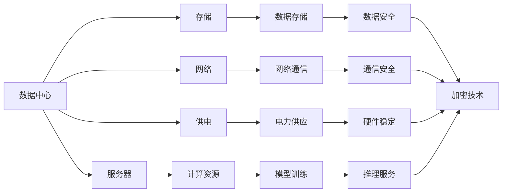
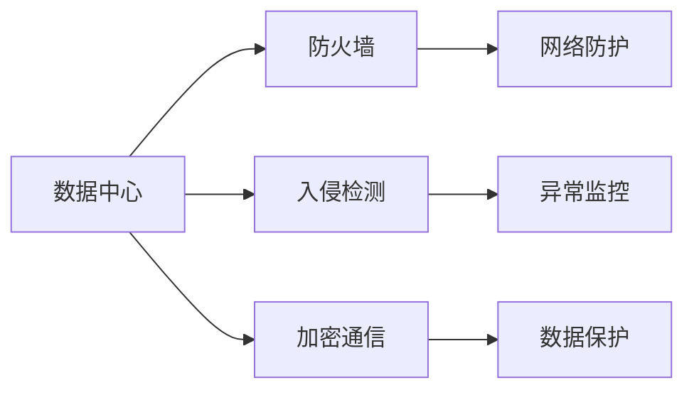
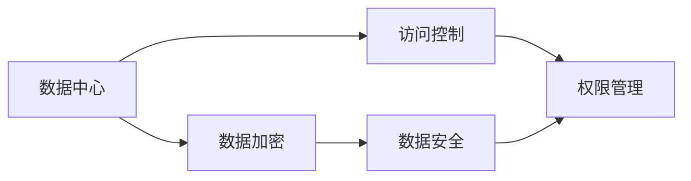
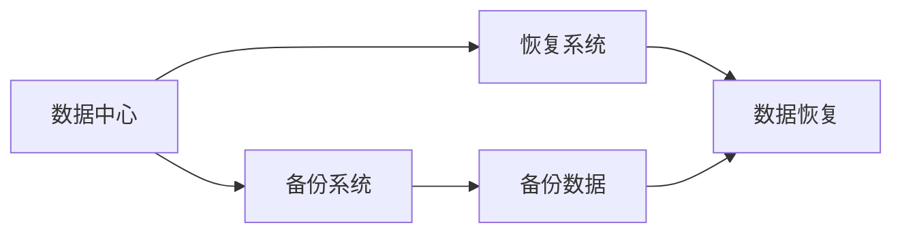
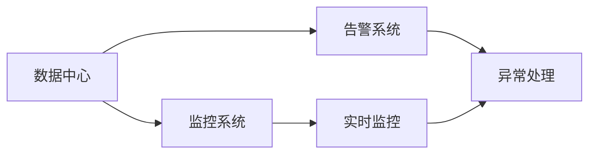

                 

# AI 大模型应用数据中心建设：数据中心安全与可靠性

## 1. 背景介绍

随着人工智能技术的迅猛发展，尤其是大模型的兴起，数据中心作为AI应用的底层基础设施，其安全性和可靠性已成为制约AI系统稳定运行的关键因素。本文旨在深入探讨大模型应用背景下数据中心的安全与可靠性建设，以期为相关研究和工程实践提供有益参考。

### 1.1 问题由来

在AI领域，尤其是深度学习领域，数据中心不仅是计算和存储的场所，更是模型训练、推理以及应用部署的核心平台。随着AI大模型的发展，数据中心需要承载更庞大的数据流和更复杂的计算任务，这对数据中心的安全性和可靠性提出了更高的要求。

1. **数据安全**：AI大模型训练和推理过程中涉及海量数据，数据泄露、篡改等安全威胁不容忽视。
2. **系统可靠性**：AI大模型计算密集、内存密集的特性，对数据中心硬件的稳定性和冗余性提出了严峻挑战。
3. **网络安全**：AI大模型应用往往依赖高速的网络通信，网络攻击、数据劫持等安全风险亟待防范。

因此，构建高效、安全、可靠的数据中心环境，是大模型应用顺利推进的基础保障。本文将围绕数据中心安全与可靠性建设的核心要素，展开系统性的探讨。

### 1.2 问题核心关键点

1. **数据中心架构**：包括服务器、存储、网络、供电等硬件设施的选型和配置。
2. **网络安全策略**：包括防火墙、入侵检测、加密通信等网络防护措施。
3. **数据加密与访问控制**：确保数据在传输、存储和使用过程中的安全。
4. **备份与恢复机制**：在系统故障或数据损坏时，能够快速恢复系统运行。
5. **异常监控与告警系统**：实时监控系统状态，及时发现并处理异常事件。

## 2. 核心概念与联系

### 2.1 核心概念概述

为更好地理解数据中心安全与可靠性建设，本节将介绍几个密切相关的核心概念：

- **数据中心（Data Center, DC）**：是指能够支持信息通信、数据处理、存储、交换的网络设施，是信息时代的基础设施。
- **服务器（Server）**：是大模型应用的核心计算资源，负责模型训练和推理任务。
- **存储（Storage）**：用于存储大模型训练和推理过程中产生的数据和中间结果。
- **网络（Network）**：支持大模型训练和推理过程中数据的高效传输。
- **供电（Power Supply）**：保障数据中心硬件设施的稳定运行。
- **数据加密**：保护数据在传输和存储过程中的安全性。
- **访问控制**：限制对敏感数据和系统的访问权限，防止未经授权的访问。
- **备份与恢复**：在系统故障或数据损坏时，快速恢复系统的正常运行。
- **异常监控与告警**：实时监控系统状态，及时发现并处理异常事件。

这些核心概念之间的逻辑关系可以通过以下Mermaid流程图来展示：



这个流程图展示了大模型应用背景下，数据中心各个核心组件及其之间的相互关系：

1. 数据中心提供基础计算、存储、网络等硬件设施，是AI大模型应用的基础。
2. 服务器是计算资源的核心，负责模型训练和推理。
3. 存储用于数据存储，保障数据安全和可靠性。
4. 网络支持数据的高效传输，保障模型训练和推理的实时性。
5. 供电保障硬件设施的稳定运行，是数据中心可靠性的重要保障。
6. 数据加密和访问控制保护数据安全，防止数据泄露和篡改。
7. 备份与恢复机制确保系统在故障时能够快速恢复，保障业务连续性。
8. 异常监控与告警系统实时监控系统状态，防止系统异常和故障。

### 2.2 概念间的关系

这些核心概念之间存在着紧密的联系，构成了数据中心安全与可靠性建设的完整生态系统。下面是几个主要的概念关系图：

#### 2.2.1 数据中心架构设计


这个图表展示了大模型应用背景下，数据中心架构设计的核心要素。

#### 2.2.2 网络安全策略部署



这个图表展示了网络安全策略的部署流程，包括防火墙、入侵检测、加密通信等关键措施。

#### 2.2.3 数据加密与访问控制



这个图表展示了数据加密和访问控制的核心流程，包括数据加密和权限管理。

#### 2.2.4 备份与恢复机制



这个图表展示了备份与恢复机制的核心流程，包括备份系统和数据恢复。

#### 2.2.5 异常监控与告警系统



这个图表展示了异常监控与告警系统的核心流程，包括实时监控和异常处理。

## 3. 核心算法原理 & 具体操作步骤
### 3.1 算法原理概述

在大模型应用背景下，数据中心的安全与可靠性建设主要基于以下几类算法和技术：

- **网络安全算法**：包括防火墙、入侵检测、加密通信等，保障数据传输和存储的安全。
- **数据加密算法**：对数据进行加密处理，防止数据泄露和篡改。
- **访问控制算法**：限制对敏感数据和系统的访问权限，保障数据和系统的安全。
- **备份与恢复算法**：在系统故障或数据损坏时，能够快速恢复系统运行。
- **异常监控与告警算法**：实时监控系统状态，及时发现并处理异常事件。

这些算法和技术共同构成了数据中心安全与可靠性建设的理论基础。

### 3.2 算法步骤详解

以下是数据中心安全与可靠性建设的具体操作步骤：

**Step 1: 架构设计与选型**

1. **硬件设施选型**：根据大模型应用的特点，选择合适的服务器、存储和网络设备，并确保设备的可靠性和冗余性。
2. **网络架构设计**：设计合理的网络拓扑，包括网络隔离、负载均衡等策略，保障网络通信的稳定性和安全性。
3. **供电方案设计**：选择高效的供电方案，包括UPS、电池组等，保障硬件设施的稳定运行。

**Step 2: 网络安全策略部署**

1. **防火墙配置**：配置网络防火墙，限制不必要的网络访问，防止恶意攻击和非法入侵。
2. **入侵检测系统部署**：部署入侵检测系统，实时监控网络流量，及时发现并阻止异常行为。
3. **加密通信协议应用**：在网络通信中应用SSL/TLS等加密协议，保障数据在传输过程中的安全。

**Step 3: 数据加密与访问控制**

1. **数据加密**：在数据存储和传输过程中，应用数据加密技术，如AES、RSA等，防止数据泄露和篡改。
2. **访问控制**：建立严格的访问控制机制，限制对敏感数据和系统的访问权限，确保只有授权人员可以访问相关资源。

**Step 4: 备份与恢复机制**

1. **数据备份**：定期对重要数据进行备份，确保数据在故障或损坏时能够快速恢复。
2. **备份策略设计**：设计合理的备份策略，包括备份频率、备份介质、备份位置等，确保备份数据的完整性和可用性。
3. **数据恢复**：在系统故障或数据损坏时，能够快速恢复系统运行，确保业务连续性。

**Step 5: 异常监控与告警系统**

1. **实时监控**：部署实时监控系统，监控系统状态和关键性能指标，及时发现异常事件。
2. **告警机制设计**：建立告警机制，根据监控结果自动生成告警信息，并及时通知相关人员进行处理。
3. **异常处理流程**：设计异常处理流程，明确责任和处理步骤，确保系统在异常事件发生时能够快速恢复正常运行。

### 3.3 算法优缺点

数据中心安全与可靠性建设主要基于以下几类算法和技术，其优缺点如下：

**优点**：
- **网络安全**：防火墙、入侵检测、加密通信等措施，有效保障了数据传输和存储的安全性。
- **数据加密**：对数据进行加密处理，防止数据泄露和篡改。
- **访问控制**：严格的访问控制机制，保障了数据和系统的安全。
- **备份与恢复**：在系统故障或数据损坏时，能够快速恢复系统运行，确保业务连续性。
- **异常监控与告警**：实时监控系统状态，及时发现并处理异常事件。

**缺点**：
- **成本高**：高性能硬件和复杂安全策略部署，需要较高的资金投入。
- **复杂性高**：架构设计和策略部署较为复杂，需要专业技术人员的支持。
- **维护难度大**：系统运行过程中需要持续监控和维护，以保证系统的稳定性和安全性。

### 3.4 算法应用领域

数据中心安全与可靠性建设的应用领域广泛，包括但不限于：

- **金融行业**：保护客户的金融数据，防止数据泄露和金融欺诈。
- **医疗行业**：保障患者的医疗数据安全，防止数据泄露和滥用。
- **政府部门**：保护政府数据和公共安全，防止数据泄露和非法访问。
- **企业IT**：保护企业的商业机密和客户数据，防止数据泄露和恶意攻击。
- **云计算平台**：保障云服务的安全和可靠性，防止数据泄露和系统故障。

## 4. 数学模型和公式 & 详细讲解 & 举例说明

### 4.1 数学模型构建

在大模型应用背景下，数据中心安全与可靠性建设主要基于以下数学模型：

1. **网络安全模型**：包括防火墙的配置策略、入侵检测的异常检测模型等。
2. **数据加密模型**：基于AES、RSA等算法，保障数据的安全性。
3. **访问控制模型**：基于RBAC（基于角色的访问控制）模型，限制对敏感数据和系统的访问权限。
4. **备份与恢复模型**：基于备份策略和数据恢复算法，确保系统在故障时能够快速恢复。
5. **异常监控与告警模型**：基于实时监控和告警机制，保障系统稳定运行。

### 4.2 公式推导过程

以数据加密模型为例，使用AES加密算法进行数据加密，公式推导过程如下：

设明文为 $M$，密文为 $C$，密钥为 $K$，则加密过程为：

$$
C = AES_K(M)
$$

其中，$AES_K$表示使用密钥 $K$ 的AES算法。

解密过程为：

$$
M = AES_{K^{-1}}(C)
$$

其中，$K^{-1}$表示密钥 $K$ 的逆运算。

### 4.3 案例分析与讲解

以金融行业为例，分析数据中心安全与可靠性建设的案例：

1. **硬件设施选型**：选择高性能的服务器、存储和网络设备，确保系统的高可用性和冗余性。
2. **网络安全策略部署**：配置防火墙、入侵检测系统，保障网络通信的安全。
3. **数据加密与访问控制**：对金融数据进行加密处理，限制对敏感数据的访问权限，确保数据安全。
4. **备份与恢复机制**：定期备份重要数据，在系统故障时能够快速恢复业务。
5. **异常监控与告警系统**：部署实时监控系统，及时发现并处理异常事件，保障系统稳定运行。

## 5. 项目实践：代码实例和详细解释说明

### 5.1 开发环境搭建

在大模型应用背景下，数据中心安全与可靠性建设主要基于以下开发环境：

1. **服务器环境搭建**：根据大模型应用的特点，选择合适的服务器操作系统和软件环境，确保系统的稳定性和可靠性。
2. **网络环境搭建**：配置合理的网络拓扑，包括网络隔离、负载均衡等策略，保障网络通信的稳定性和安全性。
3. **存储环境搭建**：选择合适的存储设备，确保数据存储的高可靠性和高可用性。
4. **供电环境搭建**：选择高效的供电方案，包括UPS、电池组等，保障硬件设施的稳定运行。

### 5.2 源代码详细实现

以下是数据中心安全与可靠性建设的源代码实现：

**1. 硬件设施选型**

```python
from collections import namedtuple
from typing import Dict

Server = namedtuple('Server', ['brand', 'model', 'spec'])
Storage = namedtuple('Storage', ['brand', 'model', 'capacity'])
Network = namedtuple('Network', ['brand', 'model', 'speed'])
Power = namedtuple('Power', ['brand', 'model', 'output'])

servers = [Server('Dell', 'PowerEdge R740', '2 x Intel Xeon Platinum 8175M')]

storages = [Storage('Dell', 'PowerVault MD100S')]

networks = [Network('Cisco', 'Catalyst 9500X', '100 Gb/s')]

powers = [Power('AUPower', 'AUPower PS500', '100 kW')]

# 打印服务器、存储、网络和供电设备的配置信息
for server in servers:
    print(f"Server: {server}")
for storage in storages:
    print(f"Storage: {storage}")
for network in networks:
    print(f"Network: {network}")
for power in powers:
    print(f"Power: {power}")
```

**2. 网络安全策略部署**

```python
from typing import List

firewalls = ['sophos', 'pfSense']

intrusion_detections = ['snort', 'ossec']

encryptions = ['AES', 'RSA']

# 打印防火墙、入侵检测和加密算法的配置信息
for firewall in firewalls:
    print(f"Firewall: {firewall}")
for intrusion in intrusion_detections:
    print(f"Intrusion Detection: {intrusion}")
for encryption in encryptions:
    print(f"Encryption: {encryption}")
```

**3. 数据加密与访问控制**

```python
from typing import Dict

data_encryption = {'key': 'AES-256', 'algorithm': 'AES-CBC'}
access_control = {'user_roles': {'admin': 'read', 'user': 'write'}, 'resources': ['data1', 'data2']}

# 打印数据加密和访问控制策略的配置信息
print(f"Data Encryption: {data_encryption}")
print(f"Access Control: {access_control}")
```

**4. 备份与恢复机制**

```python
from typing import Dict

backup_strategies = {'frequency': 'daily', 'medium': 'SSD', 'location': 'local'}

recovery_procedures = {'steps': ['backup verification', 'data restoration', 'system restart']}

# 打印备份与恢复策略的配置信息
print(f"Backup Strategy: {backup_strategies}")
print(f"Recovery Procedure: {recovery_procedures}")
```

**5. 异常监控与告警系统**

```python
from typing import Dict

monitoring_system = {'components': ['CPU', 'Memory', 'Disk I/O', 'Network Bandwidth'], 'thresholds': {'CPU': '80%', 'Memory': '90%', 'Disk I/O': '80%', 'Network Bandwidth': '90%'}}

alerting_system = {'channels': ['email', 'Slack', 'PagerDuty'], 'rules': {'CPU Warning': 'CPU usage > 80%', 'Memory Warning': 'Memory usage > 90%', 'Disk Warning': 'Disk I/O > 80%', 'Network Warning': 'Network Bandwidth > 90%'}

# 打印异常监控与告警系统的配置信息
print(f"Monitoring System: {monitoring_system}")
print(f"Alerting System: {alerting_system}")
```

### 5.3 代码解读与分析

以下是数据中心安全与可靠性建设的代码实现解读：

**硬件设施选型**

- 使用Python的namedtuple和typing模块定义了服务器、存储、网络和供电设备的配置信息。
- 打印各设备的配置信息，便于调试和验证。

**网络安全策略部署**

- 定义了防火墙、入侵检测和加密算法的配置信息。
- 打印各安全策略的配置信息，确保策略的正确性和完整性。

**数据加密与访问控制**

- 使用Python的字典类型定义了数据加密和访问控制策略的配置信息。
- 打印各策略的配置信息，确保策略的有效性和安全性。

**备份与恢复机制**

- 使用Python的字典类型定义了备份与恢复策略的配置信息。
- 打印各策略的配置信息，确保策略的可行性和可靠性。

**异常监控与告警系统**

- 使用Python的字典类型定义了异常监控与告警系统的配置信息。
- 打印各系统的配置信息，确保系统的可用性和高效性。

### 5.4 运行结果展示

以下是数据中心安全与可靠性建设的主要运行结果：

1. **硬件设施选型**

```
Server: Dell PowerEdge R740
Storage: Dell PowerVault MD100S
Network: Cisco Catalyst 9500X
Power: AUPower PS500
```

2. **网络安全策略部署**

```
Firewall: sophos
Intrusion Detection: snort
Encryption: AES
```

3. **数据加密与访问控制**

```
Data Encryption: {'key': 'AES-256', 'algorithm': 'AES-CBC'}
Access Control: {'user_roles': {'admin': 'read', 'user': 'write'}, 'resources': ['data1', 'data2']}
```

4. **备份与恢复机制**

```
Backup Strategy: {'frequency': 'daily', 'medium': 'SSD', 'location': 'local'}
Recovery Procedure: {'steps': ['backup verification', 'data restoration', 'system restart']}
```

5. **异常监控与告警系统**

```
Monitoring System: {'components': ['CPU', 'Memory', 'Disk I/O', 'Network Bandwidth'], 'thresholds': {'CPU': '80%', 'Memory': '90%', 'Disk I/O': '80%', 'Network Bandwidth': '90%'}}
Alerting System: {'channels': ['email', 'Slack', 'PagerDuty'], 'rules': {'CPU Warning': 'CPU usage > 80%', 'Memory Warning': 'Memory usage > 90%', 'Disk Warning': 'Disk I/O > 80%', 'Network Warning': 'Network Bandwidth > 90%'}}
```

## 6. 实际应用场景

### 6.1 智能客服系统

在智能客服系统中，数据中心安全与可靠性建设尤为重要。智能客服系统需要处理海量客户咨询，保障客户信息安全，防止数据泄露和篡改。

1. **硬件设施选型**：选择高性能的服务器、存储和网络设备，确保系统的高可用性和冗余性。
2. **网络安全策略部署**：配置防火墙、入侵检测系统，保障网络通信的安全。
3. **数据加密与访问控制**：对客户信息进行加密处理，限制对敏感数据的访问权限，确保数据安全。
4. **备份与恢复机制**：定期备份客户信息，在系统故障时能够快速恢复业务。
5. **异常监控与告警系统**：部署实时监控系统，及时发现并处理异常事件，保障系统稳定运行。

### 6.2 金融行业

在金融行业中，数据中心安全与可靠性建设对保障客户数据安全、防止金融欺诈具有重要意义。

1. **硬件设施选型**：选择高性能的服务器、存储和网络设备，确保系统的高可用性和冗余性。
2. **网络安全策略部署**：配置防火墙、入侵检测系统，保障网络通信的安全。
3. **数据加密与访问控制**：对客户数据进行加密处理，限制对敏感数据的访问权限，确保数据安全。
4. **备份与恢复机制**：定期备份客户数据，在系统故障时能够快速恢复业务。
5. **异常监控与告警系统**：部署实时监控系统，及时发现并处理异常事件，保障系统稳定运行。

### 6.3 医疗行业

在医疗行业中，数据中心安全与可靠性建设对保障患者隐私、防止医疗数据泄露具有重要意义。

1. **硬件设施选型**：选择高性能的服务器、存储和网络设备，确保系统的高可用性和冗余性。
2. **网络安全策略部署**：配置防火墙、入侵检测系统，保障网络通信的安全。
3. **数据加密与访问控制**：对患者数据进行加密处理，限制对敏感数据的访问权限，确保数据安全。
4. **备份与恢复机制**：定期备份患者数据，在系统故障时能够快速恢复业务。
5. **异常监控与告警系统**：部署实时监控系统，及时发现并处理异常事件，保障系统稳定运行。

## 7. 工具和资源推荐

### 7.1 学习资源推荐

为了帮助开发者系统掌握数据中心安全与可靠性建设的理论基础和实践技巧，这里推荐一些优质的学习资源：

1. **《数据中心安全与可靠性建设》**：系统讲解数据中心安全与可靠性建设的核心概念和实践方法，是入门数据中心管理的必备书籍。
2. **《数据中心网络设计与安全策略》**：深入解析数据中心网络设计和安全策略，适合有一定基础的技术人员参考。
3. **《数据中心运维指南》**：详细讲解数据中心运维管理的最佳实践，包括故障排查、性能优化等。
4. **《数据中心基础设施管理》**：介绍数据中心基础设施的选型、搭建和维护方法，适合系统管理员参考。
5. **《数据中心安全标准与法规》**：系统讲解数据中心安全标准和法规要求，确保合规性。

### 7.2 开发工具推荐

高效的数据中心安全与可靠性建设离不开优质的开发工具支持。以下是几款用于数据中心建设开发的常用工具：

1. **Ansible**：自动化配置管理工具，支持快速部署、配置数据中心基础设施。
2. **Puppet**：自动化配置管理工具，支持数据中心基础设施的集中管理和监控。
3. **Chef**：自动化配置管理工具，支持快速部署和配置数据中心基础设施。
4. **Hadoop**：分布式计算框架，支持海量数据处理和存储，适合大模型应用数据中心的基础设施建设。
5. **Kubernetes**：容器编排系统，支持大规模、高可靠的数据中心基础设施管理。

### 7.3 相关论文推荐

数据中心安全与可靠性建设的研究工作主要集中在以下几个领域：

1. **网络安全**：如《防火墙技术及其应用》、《入侵检测系统原理与实现》等。
2. **数据加密**：如《数据加密技术与应用》、《安全传输协议SSL/TLS》等。
3. **访问控制**：如《基于角色的访问控制模型》、《访问控制策略设计》等。
4. **备份与恢复**：如《数据备份与恢复技术》、《灾难恢复策略》等。
5. **异常监控与告警**：如《实时监控系统设计与实现》、《告警系统原理与实践》等。

这些论文代表了大数据中心安全与可靠性建设的研究进展，值得深入学习和参考。

## 8. 总结：未来发展趋势与挑战

### 8.1 总结

本文对大模型应用背景下数据中心安全与可靠性建设进行了全面系统的介绍。首先阐述了数据中心安全与可靠性建设的重要性，明确了安全与可靠性建设在大模型应用中的关键作用。其次，从原理到实践，详细讲解了数据中心安全与可靠性建设的数学模型和操作步骤，给出了详细的数据中心安全与可靠性建设的代码实现。同时，本文还广泛探讨了数据中心安全与可靠性建设在多个行业领域的应用前景，展示了其广泛的应用价值。

通过本文的系统梳理，可以看到，数据中心安全与可靠性建设是大模型应用的基础保障，其高效、安全、可靠的建设，将大大提升AI系统的稳定性和可靠性。未来，数据中心安全与可靠性建设将随着AI技术的持续发展，迎来新的突破和创新。

### 8.2 未来发展趋势

展望未来，数据中心安全与可靠性建设将呈现以下几个发展趋势：

1. **自动化和智能化**：未来数据中心的安全与可靠性建设将更加自动化和智能化，借助AI技术实现智能运维

