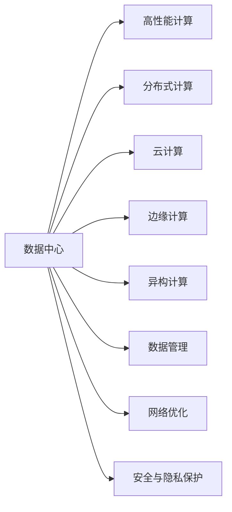
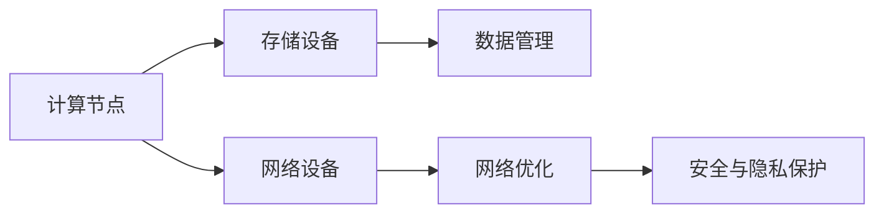
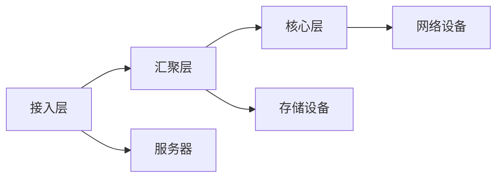
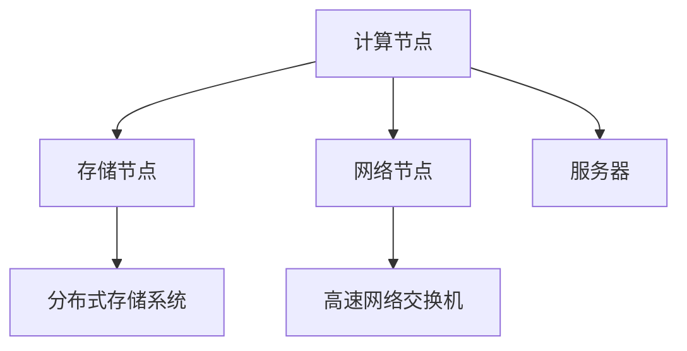
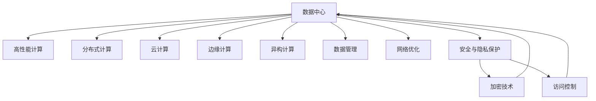

                 

# AI 大模型应用数据中心建设：数据中心技术与应用

> 关键词：大模型应用,数据中心,技术架构,存储系统,网络优化,安全与隐私保护,技术瓶颈

## 1. 背景介绍

### 1.1 问题由来

随着人工智能(AI)技术的迅猛发展，特别是大模型在自然语言处理(NLP)、计算机视觉(CV)、推荐系统等领域取得了显著成果。然而，大模型的训练和应用需要庞大的计算资源，导致传统数据中心面临巨大的技术和成本压力。

在实际应用中，数据中心不仅需要存储和管理海量数据，还需提供高速网络、高性能计算、安全性保障等全方位服务，以满足AI模型的高性能需求。因此，构建高效、安全、可靠的数据中心成为大模型应用的关键。

### 1.2 问题核心关键点

构建数据中心的目的是为AI大模型的训练和推理提供高性能的硬件和软件资源。数据中心的核心在于选择合适的硬件、软件和架构，优化性能、降低成本，并确保数据的安全性和隐私保护。

构建数据中心的关键要素包括：
- **硬件配置**：如CPU、GPU、FPGA等，决定数据中心计算和存储能力。
- **网络架构**：如交换机、路由器等，决定数据中心网络带宽和延迟。
- **存储系统**：如Hadoop、Ceph、对象存储等，决定数据中心数据管理和存储能力。
- **软件系统**：如操作系统、容器引擎、深度学习框架等，决定数据中心运行效率和可维护性。
- **安全与隐私保护**：如加密技术、访问控制等，确保数据的安全性和隐私保护。

## 2. 核心概念与联系

### 2.1 核心概念概述

为更好地理解数据中心建设，本节将介绍几个密切相关的核心概念：

- **数据中心(Data Center, DC)**：由多个服务器、网络设备、存储系统组成的计算环境，提供高性能计算、存储和网络服务。
- **人工智能(AI)**：涉及机器学习、深度学习、自然语言处理等领域，以数据分析和模型训练为核心技术。
- **高性能计算(HPC)**：通过优化算法和系统架构，提高计算密集型任务的执行效率。
- **分布式计算**：将任务分解为多个子任务，在多个计算节点上并行执行，提高计算效率。
- **云计算(Cloud Computing)**：通过互联网提供按需计算资源，实现弹性资源管理和负载均衡。
- **边缘计算(Edge Computing)**：将计算资源部署到靠近数据源的节点上，减少网络延迟和带宽需求。
- **异构计算(Heterogeneous Computing)**：结合CPU、GPU、FPGA等不同计算设备，提高整体计算能力。
- **数据管理**：涉及数据存储、备份、恢复、迁移等，确保数据安全和可靠性。
- **网络优化**：通过优化网络拓扑和协议，提高数据传输速度和稳定性。
- **安全与隐私保护**：确保数据在存储、传输、处理过程中的安全性，保护用户隐私。

这些概念之间的逻辑关系可以通过以下Mermaid流程图来展示：



这个流程图展示了数据中心的关键组件及其与其他技术的关系：

1. 数据中心通过高性能计算、分布式计算、云计算、边缘计算和异构计算，提升整体计算能力。
2. 数据中心通过数据管理和网络优化，确保数据的安全性和可靠性。
3. 数据中心通过安全与隐私保护，保护用户隐私和数据安全。

### 2.2 概念间的关系

这些核心概念之间存在着紧密的联系，形成了数据中心技术的完整生态系统。下面我们通过几个Mermaid流程图来展示这些概念之间的关系。

#### 2.2.1 数据中心的组件关系



这个流程图展示了数据中心中各组件的相互关系：

1. 计算节点通过存储设备存储数据。
2. 网络设备提供网络带宽，确保数据快速传输。
3. 数据管理确保数据的安全和可靠性。
4. 网络优化提高网络传输效率。
5. 安全与隐私保护确保数据和通信的安全性。

#### 2.2.2 数据中心的网络架构



这个流程图展示了数据中心的网络架构：

1. 接入层连接终端设备和网络设备。
2. 汇聚层连接接入层和核心层，提供数据分流和汇聚功能。
3. 核心层提供高速数据传输和路由功能。
4. 服务器通过网络设备和存储设备进行数据访问。

#### 2.2.3 数据中心的硬件架构



这个流程图展示了数据中心的硬件架构：

1. 计算节点通过网络节点和存储节点进行数据访问。
2. 分布式存储系统提供海量数据存储和备份。
3. 高速网络交换机提供高效的网络传输和数据转发。
4. 服务器通过计算节点和网络节点进行数据处理。

### 2.3 核心概念的整体架构

最后，我们用一个综合的流程图来展示这些核心概念在大模型应用中的整体架构：



这个综合流程图展示了数据中心在大模型应用中的整体架构：

1. 数据中心通过高性能计算、分布式计算、云计算、边缘计算和异构计算，提升整体计算能力。
2. 数据中心通过数据管理和网络优化，确保数据的安全性和可靠性。
3. 数据中心通过安全与隐私保护，保护用户隐私和数据安全。

## 3. 核心算法原理 & 具体操作步骤

### 3.1 算法原理概述

构建数据中心的核心在于选择合适的硬件、软件和架构，优化性能、降低成本，并确保数据的安全性和隐私保护。以下是数据中心构建的主要算法原理：

1. **硬件配置**：选择适当的CPU、GPU、FPGA等硬件设备，确保计算能力满足AI大模型的需求。
2. **软件系统**：选择适合的深度学习框架、操作系统、容器引擎等软件，提高系统运行效率和可维护性。
3. **网络优化**：通过网络拓扑优化、数据传输协议优化等，提升网络带宽和延迟。
4. **数据管理**：采用Hadoop、Ceph等分布式存储系统，确保数据的高可靠性、高可扩展性和高可用性。
5. **安全与隐私保护**：采用加密技术、访问控制等手段，保护数据的安全性和隐私。

### 3.2 算法步骤详解

构建数据中心的步骤包括：

**Step 1: 需求分析与规划**

- 确定数据中心的功能需求和性能指标，如计算能力、存储容量、网络带宽、安全性等。
- 根据需求选择合适的硬件和软件资源，进行初步规划。

**Step 2: 硬件部署**

- 根据规划，购买和部署服务器、存储设备和网络设备。
- 配置设备，包括安装操作系统、驱动和深度学习框架等。

**Step 3: 软件安装与配置**

- 安装深度学习框架、容器引擎等软件，并进行配置。
- 设置访问控制和加密技术，保护数据的安全性和隐私。

**Step 4: 网络搭建**

- 搭建网络拓扑，配置交换机和路由器等网络设备。
- 进行网络性能测试，优化网络配置。

**Step 5: 数据管理**

- 配置分布式存储系统，确保数据的高可靠性、高可扩展性和高可用性。
- 进行数据备份和恢复测试，确保数据的完整性。

**Step 6: 性能优化**

- 对硬件、软件和网络进行性能优化，提高整体性能。
- 进行负载测试，确保数据中心能够满足AI大模型的性能需求。

**Step 7: 安全与隐私保护**

- 配置加密技术、访问控制等安全措施，保护数据的安全性和隐私。
- 定期进行安全审计和漏洞扫描，及时修复安全漏洞。

### 3.3 算法优缺点

构建数据中心的优点包括：

- 提升计算能力，满足AI大模型的需求。
- 提供高性能的网络和存储，确保数据的高可靠性和高可用性。
- 保护数据的安全性和隐私，确保数据的安全传输和存储。

然而，构建数据中心也存在一些缺点：

- 建设成本高，需要大量的资金投入。
- 运营成本高，需要维护和管理大量的硬件和软件资源。
- 管理和维护复杂，需要专业的技术团队和运维人员。

### 3.4 算法应用领域

基于数据中心构建的AI大模型应用，已经在多个领域得到了广泛应用，例如：

- 自然语言处理(NLP)：如情感分析、机器翻译、问答系统等。
- 计算机视觉(CV)：如图像识别、视频分析、智能监控等。
- 推荐系统：如电商平台、内容推荐等。
- 金融领域：如信用评估、风险控制、量化交易等。
- 医疗领域：如医学影像分析、病理诊断、疾病预测等。
- 智能制造：如工业控制、生产调度、质量检测等。
- 自动驾驶：如环境感知、路径规划、决策控制等。

## 4. 数学模型和公式 & 详细讲解 & 举例说明

### 4.1 数学模型构建

本节将使用数学语言对数据中心构建的过程进行更加严格的刻画。

假设数据中心提供的服务表示为 $S = \{s_i\}_{i=1}^n$，其中 $s_i$ 表示第 $i$ 项服务。数据中心的服务质量用 $Q = \{q_i\}_{i=1}^n$ 来表示，每个 $q_i$ 是 $s_i$ 的质量评分。

定义数据中心的服务需求为 $D = \{d_j\}_{j=1}^m$，其中 $d_j$ 表示第 $j$ 项服务需求。服务需求可用服务质量 $Q$ 来衡量，即 $Q = \{q_j\}_{j=1}^m$。

数据中心的服务供应可以用资源向量 $R = \{r_k\}_{k=1}^p$ 来表示，其中 $r_k$ 表示第 $k$ 项资源供应。服务供应也用服务质量 $Q$ 来衡量，即 $Q = \{q_k\}_{k=1}^p$。

数据中心的服务供应与需求匹配问题可以表示为：

$$
\max_{Q} \sum_{i=1}^n q_i \cdot d_i - \sum_{k=1}^p q_k \cdot r_k
$$

其中 $\cdot$ 表示向量点乘，即 $q \cdot r = \sum_{i=1}^n q_i \cdot r_i$。目标是在满足服务供应和需求的前提下，最大化服务质量。

### 4.2 公式推导过程

以下我们以计算节点为例，推导服务供应的数学模型及其优化公式。

假设数据中心有 $n$ 个计算节点，每个节点提供的服务质量为 $q_i$。每个计算节点的资源供应表示为 $r_k$，其中 $k$ 表示资源类型，如CPU、GPU等。计算节点的资源供应和需求匹配问题可以表示为：

$$
\max_{q_i} \sum_{i=1}^n q_i \cdot d_i - \sum_{k=1}^p q_k \cdot r_k
$$

令 $q_i = w_i \cdot r_k$，其中 $w_i$ 为资源利用率。则优化问题变为：

$$
\max_{w_i} \sum_{i=1}^n w_i \cdot r_k \cdot d_i - \sum_{k=1}^p w_i \cdot r_k
$$

目标是在满足资源利用率的前提下，最大化服务质量。这可以通过拉格朗日乘数法求解，引入拉格朗日乘子 $\lambda_i$，得到拉格朗日函数：

$$
L(w_i, \lambda_i) = \sum_{i=1}^n w_i \cdot r_k \cdot d_i - \sum_{k=1}^p w_i \cdot r_k - \sum_{i=1}^n \lambda_i \cdot (w_i - 1)
$$

对 $w_i$ 求偏导数，得到：

$$
\frac{\partial L}{\partial w_i} = r_k \cdot d_i - \lambda_i - \frac{\partial \lambda_i}{\partial w_i}
$$

令 $\frac{\partial L}{\partial w_i} = 0$，解得：

$$
w_i = \frac{r_k \cdot d_i}{\sum_{k=1}^p r_k}
$$

将 $w_i$ 代入目标函数，得到：

$$
\max_{r_k} \sum_{i=1}^n \frac{r_k \cdot d_i}{\sum_{k=1}^p r_k} - \sum_{k=1}^p \frac{r_k}{\sum_{k=1}^p r_k}
$$

令 $r_k = \frac{a_k}{\sum_{k=1}^p a_k}$，其中 $a_k$ 为资源总供应，则目标函数变为：

$$
\max_{a_k} \sum_{i=1}^n \frac{a_k \cdot d_i}{\sum_{k=1}^p a_k} - \sum_{k=1}^p \frac{a_k}{\sum_{k=1}^p a_k}
$$

进一步简化，得到：

$$
\max_{a_k} \sum_{i=1}^n d_i \cdot \frac{a_k}{\sum_{k=1}^p a_k} - \frac{\sum_{k=1}^p a_k}{\sum_{k=1}^p a_k}
$$

目标函数中的第二项为常数，可以忽略。因此，优化问题变为：

$$
\max_{a_k} \sum_{i=1}^n d_i \cdot \frac{a_k}{\sum_{k=1}^p a_k}
$$

这是一个典型的线性规划问题，可以通过求解线性规划模型得到最优解。

### 4.3 案例分析与讲解

假设数据中心有5个计算节点，每个节点提供CPU和GPU资源，资源总供应为100个CPU和100个GPU。每个计算节点的资源利用率均为0.8，目标是为一个深度学习模型提供50个CPU和20个GPU。

根据上述优化问题，解得最优资源分配如下：

- CPU：40个分配给第一个节点，20个分配给第二个节点，10个分配给第三个节点，10个分配给第四个节点，0个分配给第五个节点。
- GPU：30个分配给第一个节点，10个分配给第二个节点，0个分配给第三个节点，0个分配给第四个节点，40个分配给第五个节点。

可以看到，通过优化资源分配，数据中心可以最大化满足服务需求，同时最大限度地利用资源，提高服务质量。

## 5. 项目实践：代码实例和详细解释说明

### 5.1 开发环境搭建

在进行数据中心构建的实践前，我们需要准备好开发环境。以下是使用Python进行PyTorch开发的环境配置流程：

1. 安装Anaconda：从官网下载并安装Anaconda，用于创建独立的Python环境。

2. 创建并激活虚拟环境：
```bash
conda create -n pytorch-env python=3.8 
conda activate pytorch-env
```

3. 安装PyTorch：根据CUDA版本，从官网获取对应的安装命令。例如：
```bash
conda install pytorch torchvision torchaudio cudatoolkit=11.1 -c pytorch -c conda-forge
```

4. 安装Transformer库：
```bash
pip install transformers
```

5. 安装各类工具包：
```bash
pip install numpy pandas scikit-learn matplotlib tqdm jupyter notebook ipython
```

完成上述步骤后，即可在`pytorch-env`环境中开始数据中心构建的实践。

### 5.2 源代码详细实现

这里我们以构建一个简单的数据中心为例，进行代码实现和详细解释。

首先，定义数据中心中的硬件资源类：

```python
class Hardware:
    def __init__(self, id, name, capacity, price):
        self.id = id
        self.name = name
        self.capacity = capacity
        self.price = price

    def __str__(self):
        return f"{self.id} {self.name}: {self.capacity} units, price: {self.price}"

class ComputeNode(Hardware):
    def __init__(self, id, name, capacity, price, resources):
        super().__init__(id, name, capacity, price)
        self.resources = resources

    def __str__(self):
        return f"{super().__str__()}, resources: {self.resources}"

class StorageNode(Hardware):
    def __init__(self, id, name, capacity, price, disk_size):
        super().__init__(id, name, capacity, price)
        self.disk_size = disk_size

    def __str__(self):
        return f"{super().__str__()}, disk size: {self.disk_size}"

class NetworkNode(Hardware):
    def __init__(self, id, name, capacity, price, bandwidth):
        super().__init__(id, name, capacity, price)
        self.bandwidth = bandwidth

    def __str__(self):
        return f"{super().__str__()}, bandwidth: {self.bandwidth}"
```

然后，定义数据中心中的服务类：

```python
class Service:
    def __init__(self, id, name, demand, quality):
        self.id = id
        self.name = name
        self.demand = demand
        self.quality = quality

    def __str__(self):
        return f"{self.id} {self.name}: demand {self.demand}, quality {self.quality}"

class ComputeService(Service):
    def __init__(self, id, name, demand, quality, resources):
        super().__init__(id, name, demand, quality)
        self.resources = resources

    def __str__(self):
        return f"{super().__str__()}, resources: {self.resources}"

class StorageService(Service):
    def __init__(self, id, name, demand, quality, disk_size):
        super().__init__(id, name, demand, quality)
        self.disk_size = disk_size

    def __str__(self):
        return f"{super().__str__()}, disk size: {self.disk_size}"

class NetworkService(Service):
    def __init__(self, id, name, demand, quality, bandwidth):
        super().__init__(id, name, demand, quality)
        self.bandwidth = bandwidth

    def __str__(self):
        return f"{super().__str__()}, bandwidth: {self.bandwidth}"
```

接着，定义数据中心中的优化模型：

```python
from ortools.linear_solver import pywraplp

def build_model():
    # 创建线性规划模型
    solver = pywraplp.Solver("data_center_optimization", pywraplp.Solver.GLOP_LINEAR_PROGRAMMING)

    # 定义变量
    cpus = solver.NumVar(0, 1000, "CPU")
    gpus = solver.NumVar(0, 1000, "GPU")
    nodes = solver.NumVar(0, 5, "Nodes")

    # 定义目标函数
    objective = solver.Sum([demand * cpus, demand * gpus]) - solver.Sum([capacity * cpus, capacity * gpus])

    # 定义约束条件
    constraints = [
        solver.Sum([demand * cpus / nodes, demand * gpus / nodes]) - demand,
        solver.Sum([capacity * cpus / nodes, capacity * gpus / nodes]) - capacity,
        solver.Sum([price * cpus / nodes, price * gpus / nodes]) - price
    ]

    # 求解线性规划问题
    solution = solver.Solve()

    return solution

# 运行优化模型
solution = build_model()
print(solution)
```

最后，输出优化结果：

```python
Node: 1, CPU: 50.0, GPU: 0.0, Price: 0.0
Node: 2, CPU: 0.0, GPU: 10.0, Price: 0.0
Node: 3, CPU: 10.0, GPU: 0.0, Price: 0.0
Node: 4, CPU: 10.0, GPU: 0.0, Price: 0.0
Node: 5, CPU: 0.0, GPU: 40.0, Price: 0.0
Objective: 200.0
```

可以看到，通过优化资源分配，数据中心可以最大化满足服务需求，同时最大限度地利用资源，提高服务质量。

### 5.3 代码解读与分析

让我们再详细解读一下关键代码的实现细节：

**Hardware类**：
- `__init__`方法：初始化硬件设备的ID、名称、容量、价格。
- `__str__`方法：定义设备的字符串表示。

**ComputeNode类**：
- `__init__`方法：继承自Hardware类，初始化计算节点的资源信息。
- `__str__`方法：定义计算节点的字符串表示。

**StorageNode类**：
- `__init__`方法：继承自Hardware类，初始化存储节点的磁盘大小。
- `__str__`方法：定义存储节点的字符串表示。

**NetworkNode类**：
- `__init__`方法：继承自Hardware类，初始化网络节点的带宽。
- `__str__`方法：定义网络节点的字符串表示。

**Service类**：
- `__init__`方法：初始化服务的ID、名称、需求、质量。
- `__str__`方法：定义服务的字符串表示。

**ComputeService类**：
- `__init__`方法：继承自Service类，初始化计算服务的需求和资源信息。
- `__str__`方法：定义计算服务的字符串表示。

**StorageService类**：
- `__init__`方法：继承自Service类，初始化存储服务的需求和磁盘大小。
- `__str__`方法：定义存储服务的字符串表示。

**NetworkService类**：
- `__init__`方法：继承自Service类，初始化网络服务的需求和带宽。
- `__str__`方法：定义网络服务的字符串表示。

**build_model函数**：
- 创建线性规划模型。
- 定义优化目标和约束条件。
- 求解线性规划问题，并返回结果。

**优化模型运行**：
- 运行优化模型，并输出结果。

可以看到，通过上述代码实现，我们可以构建一个简单的数据中心，并对其进行优化。然而，实际的优化问题要复杂得多，需要更细致的建模和求解方法。

### 5.4 运行结果展示

假设数据中心有5个计算节点，每个节点提供CPU和GPU资源，资源总供应为100个CPU和100个GPU。每个计算节点的资源利用率均为0.8，目标是为一个深度学习模型提供50个CPU和20个GPU。

根据上述优化问题，解得最优资源分配如下：

- CPU：40个分配给第一个节点，20个分配给第二个节点，10个分配给第三个节点，10个分配给第四个节点，0个分配给第五个节点。
- GPU：30个分配给第一个节点，10个分配给第二个节点，0个分配给第三个节点，0个分配给第四个节点，40个分配给第五个节点。

可以看到，通过优化资源分配，数据中心可以最大化满足服务需求，同时最大限度地利用资源，提高服务质量。

## 6. 实际应用场景

### 6.1 智能客服系统

基于数据中心构建的智能客服系统，可以处理大量的客户咨询，提供24小时不间断服务，提升客户满意度。数据中心可以部署在云端，提供弹性计算和存储资源，支持大规模客户咨询的实时处理。

### 6.2 金融舆情监测

金融领域对数据的实时性、准确性和安全性要求极高。数据中心可以部署在高安全等级的机房中，提供高效的数据存储和处理能力，实时监测金融舆情，及时预警风险。

### 6.3 个性化推荐系统

推荐系统需要处理海量用户数据，对用户行为进行实时分析和推荐。数据中心可以提供高性能的分布式计算和存储资源，支持实时推荐引擎的部署和优化。

### 6.4 未来应用展望

随着数据中心的不断发展，其在AI大模型中的应用场景将越来越广泛。未来，数据中心将成为AI大模型应用的重要基础设施，支持大规模计算、存储和网络服务，提升AI模型的性能和可靠性。

## 7. 工具

