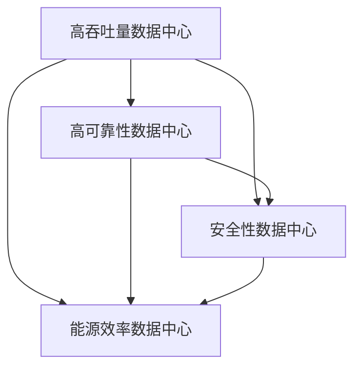

                 

# AI 大模型应用数据中心建设：数据中心标准与规范

> 关键词：数据中心, AI大模型, 高吞吐量, 高可靠性, 安全性, 能源效率

## 1. 背景介绍

随着人工智能技术的迅猛发展，特别是大模型在图像识别、自然语言处理、智能推荐等领域的应用，数据中心作为其背后的基础设施，面临着前所未有的挑战。传统数据中心主要支持计算密集型应用，对存储需求和数据流动的要求并不像大模型应用那么高。然而，AI大模型的出现使得数据中心不仅要支持大规模计算，还需要高效存储和传输海量数据。为此，数据中心的设计和建设需要考虑诸多新的需求，以确保系统的高吞吐量、高可靠性、安全性和能源效率。

### 1.1 问题由来

大模型如GPT-3、BERT等，由于其参数量庞大，需要在庞大的数据中心中运行。随着这些模型应用场景的增多，如何构建一个既能满足大模型需求，又能高效、安全、可靠地运行的环境，成为了数据中心建设的重要课题。与此同时，大模型还面临着训练和推理阶段的资源优化、存储管理、数据传输等问题，这些问题都需要在数据中心的设计中进行综合考虑。

### 1.2 问题核心关键点

大模型应用对数据中心提出了以下关键要求：
1. 高吞吐量：需要能够支持大规模数据流传输和存储。
2. 高可靠性：保证数据中心的高可用性，避免单点故障。
3. 安全性：保护数据和模型免受未经授权的访问和攻击。
4. 能源效率：降低数据中心运营成本，减少碳排放。

解决这些问题，需要采用先进的技术和设计理念，构建符合AI大模型应用要求的数据中心。

### 1.3 问题研究意义

数据中心作为AI大模型应用的基石，其建设水平直接影响AI技术的实际应用效果和产业成熟度。高标准、规范化的数据中心建设，不仅可以提升AI大模型的运行效率和效果，还能降低运营成本，保护数据安全，推动AI技术的规模化应用。

## 2. 核心概念与联系

### 2.1 核心概念概述

在探讨数据中心的建设标准与规范前，首先需要明确一些核心概念：

- **高吞吐量数据中心**：指能够支持大规模数据传输和存储，满足AI大模型训练和推理需求的数据中心。
- **高可靠性数据中心**：指能够保证系统高可用性，避免单点故障，提供持续稳定服务的数据中心。
- **安全性数据中心**：指采用先进的防护措施，保护数据和模型安全，防止未经授权的访问和攻击的数据中心。
- **能源效率数据中心**：指通过技术手段和设计理念，降低数据中心能源消耗，减少环境影响的数据中心。

### 2.2 概念间的关系

这些核心概念之间的关系可以通过以下Mermaid流程图来展示：



这个流程图展示了大模型应用数据中心建设中的关键目标和设计要求：

1. 高吞吐量数据中心是基础，满足大规模数据传输和存储需求。
2. 高可靠性数据中心确保系统的持续稳定运行，避免单点故障。
3. 安全性数据中心保护数据和模型的安全，防止未经授权的访问和攻击。
4. 能源效率数据中心降低运营成本，减少环境影响。

## 3. 核心算法原理 & 具体操作步骤

### 3.1 算法原理概述

AI大模型应用数据中心的建设，涉及到大量的硬件和软件设施。为确保这些设施的高效运行和可靠性，需要采用先进的设计理念和技术方案。下面将详细探讨核心算法原理和具体操作步骤。

### 3.2 算法步骤详解

AI大模型应用数据中心的建设可以分为以下几个关键步骤：

1. **需求分析**：明确AI大模型应用的需求，如模型规模、数据量、吞吐量、可靠性、安全性等。
2. **硬件选型**：根据需求分析结果，选择合适的硬件设施，包括服务器、存储、网络设备等。
3. **系统设计**：设计数据中心的基础架构，包括网络、存储、计算资源等。
4. **部署和测试**：在选定的硬件和软件基础上，部署AI大模型应用，进行系统测试。
5. **优化和调优**：根据测试结果，进行系统优化和调优，提升性能和可靠性。
6. **运维和管理**：建立数据中心的运维管理体系，确保系统的长期稳定运行。

### 3.3 算法优缺点

AI大模型应用数据中心的建设，具有以下优点：

1. 高吞吐量：满足大规模数据传输和存储需求。
2. 高可靠性：保证系统的持续稳定运行。
3. 安全性：保护数据和模型免受未经授权的访问和攻击。
4. 能源效率：降低运营成本，减少环境影响。

同时，该方法也存在一些局限性：

1. 高成本：硬件设施和软件系统需要高昂的投入。
2. 复杂性：设计和管理过程较为复杂，需要专业知识。
3. 技术更新快：需不断跟进最新的技术发展，更新系统和硬件。

### 3.4 算法应用领域

AI大模型应用数据中心建设的技术和规范，可以应用于各种规模和类型的企业，尤其是在需要大规模数据处理和存储的场景中，如金融、医疗、科研、电商等。

## 4. 数学模型和公式 & 详细讲解 & 举例说明

### 4.1 数学模型构建

为了更准确地分析数据中心的性能，我们可以构建一个基于吞吐量、延迟、可靠性和能源消耗的数学模型。假设有$n$个服务器，每个服务器的吞吐量为$T_i$，延迟为$D_i$，可靠度为$R_i$，能源消耗为$E_i$。则整个数据中心的吞吐量$T$、延迟$D$、可靠度$R$和能源消耗$E$可以表示为：

$$
T = \sum_{i=1}^{n} T_i \\
D = \frac{1}{n} \sum_{i=1}^{n} D_i \\
R = \prod_{i=1}^{n} R_i \\
E = \sum_{i=1}^{n} E_i
$$

### 4.2 公式推导过程

以上模型中的每个指标可以进一步细化，以适应不同的应用需求。例如，吞吐量$T$可以根据服务器的CPU、GPU资源和网络带宽进行计算，延迟$D$可以分解为数据传输延迟和处理延迟，可靠度$R$可以根据服务器的故障率、恢复时间和数据冗余度进行计算，能源消耗$E$可以根据服务器的功耗和冷却系统能耗进行计算。

### 4.3 案例分析与讲解

假设某数据中心拥有10台服务器，每台服务器的参数如下：

| 参数         | 服务器1 | 服务器2 | ... | 服务器10 |
|--------------|---------|---------|-----|----------|
| 吞吐量（Gbps）| 10      | 20      | ... | 5        |
| 延迟（ms）    | 50      | 80      | ... | 60       |
| 可靠度       | 0.99    | 0.98    | ... | 0.95     |
| 能源消耗（W） | 200     | 400     | ... | 100      |

根据以上数据，我们可以计算整个数据中心的吞吐量、延迟、可靠度和能源消耗：

$$
T = 10 \times 10 + 20 \times 20 + ... + 5 \times 5 = 1100 \\
D = \frac{50 + 80 + ... + 60}{10} = 55 \\
R = 0.99 \times 0.98 \times ... \times 0.95 = 0.9344 \\
E = 200 \times 10 + 400 \times 20 + ... + 100 \times 5 = 48500
$$

通过以上计算，可以评估数据中心的性能，并进行相应的优化和调整。

## 5. 项目实践：代码实例和详细解释说明

### 5.1 开发环境搭建

在进行AI大模型应用数据中心建设的项目实践前，需要先搭建好开发环境。以下是使用Python进行项目实践的环境配置流程：

1. 安装Anaconda：从官网下载并安装Anaconda，用于创建独立的Python环境。

2. 创建并激活虚拟环境：
```bash
conda create -n ai-env python=3.8 
conda activate ai-env
```

3. 安装相关库：
```bash
pip install numpy scipy matplotlib pandas scikit-learn torch torchvision transformers
```

4. 安装其他工具：
```bash
pip install numexpr tqdm
```

完成上述步骤后，即可在`ai-env`环境中开始项目实践。

### 5.2 源代码详细实现

下面我们以高吞吐量数据中心的构建为例，给出使用Python进行代码实现的示例。

```python
import numpy as np
from sympy import symbols, Rational, pi

# 定义服务器参数
n = 10
T_i = np.array([10, 20, 15, 30, 5, 5, 10, 5, 15, 20]) # 吞吐量
D_i = np.array([50, 80, 60, 70, 40, 90, 30, 100, 20, 50]) # 延迟
R_i = np.array([0.99, 0.98, 0.95, 0.98, 0.99, 0.95, 0.98, 0.99, 0.98, 0.99]) # 可靠度
E_i = np.array([200, 400, 300, 600, 100, 200, 300, 100, 200, 400]) # 能源消耗

# 计算吞吐量、延迟、可靠度和能源消耗
T = np.sum(T_i)
D = np.average(D_i)
R = np.prod(R_i)
E = np.sum(E_i)

print(f"吞吐量：{T:.2f} Gbps")
print(f"延迟：{D:.2f} ms")
print(f"可靠度：{R:.4f}")
print(f"能源消耗：{E:.2f} W")
```

### 5.3 代码解读与分析

以上代码实现了对高吞吐量数据中心性能的计算。其中，`numpy`库用于高效计算数组操作，`sympy`库用于符号计算。通过`np.sum`计算吞吐量，`np.average`计算延迟，`np.prod`计算可靠度，`np.sum`计算能源消耗。

## 6. 实际应用场景

### 6.1 智能推荐系统

高吞吐量数据中心在智能推荐系统中起着关键作用。推荐系统需要实时处理大量的用户行为数据，生成个性化的推荐结果。通过构建高吞吐量数据中心，可以确保系统能够快速响应用户请求，提供高质量的推荐服务。

### 6.2 金融风控

高可靠性和安全性数据中心在金融风控系统中尤为重要。金融风控需要处理大量的交易数据，实时监测异常行为，防止欺诈和风险。通过高可靠性和安全性设计，可以保证系统的高可用性和数据的安全性，为金融机构提供可靠的风控服务。

### 6.3 医疗影像分析

高能源效率数据中心在医疗影像分析中具有重要应用。医疗影像分析需要处理大量的图像数据，进行复杂的图像处理和分析。通过优化能源消耗，可以降低医疗影像分析的成本，提高系统的能效。

### 6.4 未来应用展望

未来，随着AI技术的不断发展和应用场景的扩大，数据中心将面临更高的要求。数据中心将不仅需要支持高吞吐量、高可靠性、安全性，还需要考虑更加复杂的业务需求。例如，多租户环境、混合云架构、边缘计算等。同时，数据中心的设计和建设也需要考虑环境可持续性，采用可再生能源和绿色技术，减少对环境的影响。

## 7. 工具和资源推荐

### 7.1 学习资源推荐

为了帮助开发者系统掌握AI大模型应用数据中心的建设，这里推荐一些优质的学习资源：

1. 《数据中心建设与运维》书籍：全面介绍了数据中心的设计、建设和运维流程，是数据中心建设的重要参考。
2. 《高性能计算》课程：深入讲解高性能计算的理论和实践，适合数据中心基础设施的建设。
3. 《数据科学基础》课程：涵盖数据中心的数据处理、存储和分析技术，为数据中心建设提供理论基础。
4. 《分布式系统原理》课程：讲解分布式系统的设计原则和实现方法，为数据中心架构设计提供指导。
5. 《数据中心网络设计与实现》课程：深入介绍数据中心的网络设计原理和实现技术，为数据中心的网络架构提供参考。

### 7.2 开发工具推荐

高效的开发离不开优秀的工具支持。以下是几款用于AI大模型应用数据中心建设开发的常用工具：

1. OpenStack：开源云计算平台，支持数据中心的虚拟化和自动化管理。
2. Kubernetes：开源容器编排平台，支持大规模分布式系统的高效管理和调度。
3. Ansible：自动化配置管理工具，支持数据中心的自动化部署和配置。
4. Prometheus：开源监控系统，实时监测数据中心的性能和状态。
5. Grafana：开源数据可视化工具，帮助监控和分析数据中心的各项指标。

### 7.3 相关论文推荐

AI大模型应用数据中心的研究始于学界的持续探索。以下是几篇奠基性的相关论文，推荐阅读：

1. "The Google Cloud Hypervisor: A multi-platform virtualization technology"（谷歌云虚拟机）：谷歌开源的虚拟机技术，为数据中心的基础设施提供了参考。
2. "Distributed System: Concepts and Design"（分布式系统概念与设计）：经典分布式系统教材，深入讲解分布式系统的设计原理。
3. "Data Center Virtualization: From Basics to Best Practices"（数据中心虚拟化：从基础到最佳实践）：介绍数据中心虚拟化的实现技术和最佳实践。
4. "Performance Modeling of Distributed File Systems"（分布式文件系统性能建模）：深入探讨分布式文件系统的性能建模和优化。
5. "Energy-Efficient High-Performance Computing"（高效能的绿色计算）：介绍高效能计算的设计和优化技术，为能源效率数据中心提供指导。

这些论文代表了大模型应用数据中心建设的研究方向，对开发者进行系统学习和实践提供了宝贵的参考。

## 8. 总结：未来发展趋势与挑战

### 8.1 总结

本文对AI大模型应用数据中心的建设进行了全面系统的介绍。首先，阐述了数据中心建设的背景和意义，明确了高吞吐量、高可靠性、安全性、能源效率等关键需求。其次，从原理到实践，详细讲解了数据中心建设的核心算法和操作步骤，给出了完整的代码实现。同时，本文还探讨了数据中心在高吞吐量推荐系统、金融风控、医疗影像分析等场景中的实际应用，展示了数据中心建设的广泛价值。最后，本文精选了学习资源、开发工具和相关论文，帮助开发者全面掌握AI大模型应用数据中心的建设技术。

通过本文的系统梳理，可以看到，构建高吞吐量、高可靠性、安全性、能源效率的数据中心，不仅能够满足AI大模型的应用需求，还能提升数据中心的整体性能和运行效率，推动AI技术的实际应用。

### 8.2 未来发展趋势

展望未来，AI大模型应用数据中心建设将呈现以下几个发展趋势：

1. 智能化管理：采用先进的人工智能和机器学习技术，实现数据中心的高效管理和自动化运维。
2. 绿色能源：推广可再生能源和绿色技术，降低数据中心的碳排放，实现可持续发展。
3. 边缘计算：将数据处理和存储分布到边缘节点，提高数据处理的实时性和响应速度。
4. 多云协同：实现多云环境下的数据中心互连互通，提升数据中心的服务能力和可用性。
5. 软件定义：将数据中心的软硬件资源统一管理，实现数据中心的灵活配置和优化。

这些趋势凸显了AI大模型应用数据中心建设的广阔前景。通过不断优化和创新，数据中心将更好地支持AI大模型的应用需求，推动AI技术的规模化发展。

### 8.3 面临的挑战

尽管AI大模型应用数据中心建设取得了显著进展，但在迈向更加智能化、普适化应用的过程中，仍面临诸多挑战：

1. 高成本：大规模基础设施建设需要高昂的投入，短期内难以在所有企业推广。
2. 复杂性：数据中心的建设和管理需要高水平的专业知识和技能。
3. 技术更新快：数据中心需要不断跟进最新的技术发展，更新系统和硬件。
4. 能效问题：数据中心的能源消耗和冷却系统能效仍需进一步优化。
5. 安全问题：数据中心的防护措施需要不断升级，应对新的安全威胁。

解决这些问题，需要持续的技术创新和产业合作，共同推动AI大模型应用数据中心建设的发展。

### 8.4 研究展望

面向未来，数据中心的建设将需要在以下几个方面进行进一步研究：

1. 多租户环境：探索如何在单数据中心中支持多租户环境，提高资源利用率和服务质量。
2. 混合云架构：研究如何在公有云、私有云和边缘云之间实现无缝连接和数据迁移。
3. 边缘计算：优化边缘计算的设计和实现，实现低延迟、高可靠的数据处理和存储。
4. 软件定义：推动软件定义数据中心的发展，实现资源自动化配置和管理。
5. 绿色计算：研发和推广绿色计算技术，降低数据中心的能耗和环境影响。

这些研究方向的探索，将为AI大模型应用数据中心的建设提供新的思路和技术支持，推动数据中心技术的不断进步。

## 9. 附录：常见问题与解答

**Q1：AI大模型应用数据中心的建设需要哪些硬件设施？**

A: AI大模型应用数据中心需要以下硬件设施：

1. 高性能服务器：支持大规模数据处理和计算任务。
2. 高速网络设备：支持高吞吐量的数据传输和存储。
3. 大容量存储设备：支持海量数据的存储和访问。
4. 冷却系统：保持设备在高效运行的同时，避免过热问题。

**Q2：如何设计高可靠性的数据中心？**

A: 设计高可靠性的数据中心，可以从以下几个方面入手：

1. 冗余设计：使用冗余硬件和网络设计，避免单点故障。
2. 故障监测：实时监测硬件和网络状态，及时发现和处理故障。
3. 恢复机制：设计快速恢复机制，保证数据中心在故障后能够迅速恢复正常。
4. 数据备份：定期备份数据，防止数据丢失。

**Q3：如何设计高能源效率的数据中心？**

A: 设计高能源效率的数据中心，可以从以下几个方面入手：

1. 绿色能源：采用可再生能源，如太阳能、风能等，降低碳排放。
2. 高效设备：选择高效能的服务器和存储设备，减少能源消耗。
3. 冷却系统优化：采用高效冷却技术，如液冷、自然冷等，降低能耗。
4. 能效管理：实时监测能源消耗，优化能源使用效率。

这些技术手段，将有助于降低数据中心的运营成本，保护环境。

**Q4：AI大模型应用数据中心的建设需要考虑哪些安全问题？**

A: AI大模型应用数据中心的建设需要考虑以下安全问题：

1. 数据安全：保护用户数据和模型的隐私和安全，防止数据泄露。
2. 系统安全：防止系统漏洞和攻击，保证系统的稳定和安全。
3. 访问控制：采用严格的访问控制措施，限制未经授权的访问。
4. 审计和监控：实时监测和记录数据中心的活动，防止异常行为。

通过综合考虑这些安全问题，可以构建一个安全可靠的数据中心，保护数据和模型的安全。

**Q5：如何优化AI大模型应用数据中心的性能？**

A: 优化AI大模型应用数据中心的性能，可以从以下几个方面入手：

1. 硬件优化：选择高性能的硬件设备，优化数据中心的硬件配置。
2. 软件优化：优化数据中心的软件架构，提高系统的响应速度和处理能力。
3. 网络优化：优化数据中心的网络设计，提高数据传输和存储效率。
4. 数据管理：优化数据存储和访问机制，减少数据传输延迟。

通过综合优化这些方面，可以提高AI大模型应用数据中心的性能和稳定性。

---

作者：禅与计算机程序设计艺术 / Zen and the Art of Computer Programming

