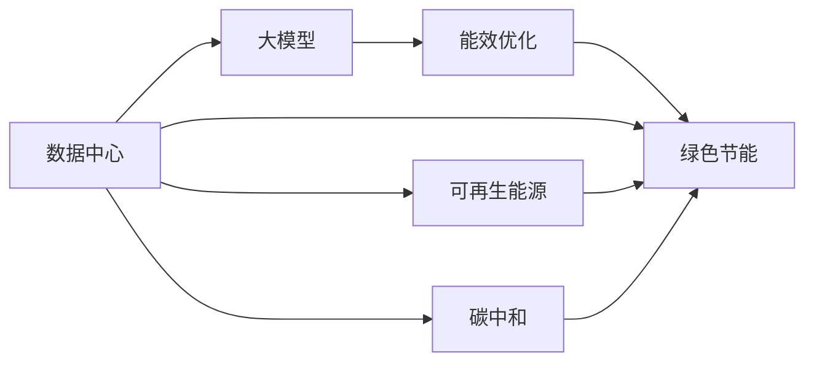
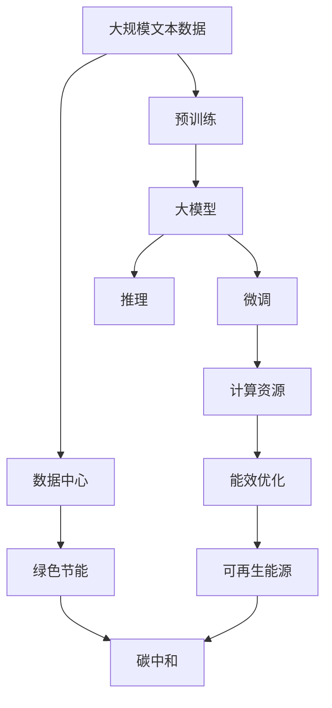

                 

# AI 大模型应用数据中心建设：数据中心绿色节能

> 关键词：数据中心, 大模型, 绿色节能, 人工智能, 能效优化, 可再生能源, 碳中和

## 1. 背景介绍

### 1.1 问题由来
随着人工智能（AI）技术的飞速发展，尤其是大规模预训练模型的应用普及，数据中心的能耗问题变得愈发严峻。以Transformer模型为代表的大模型训练通常需要数百亿甚至数千亿个参数，其巨大的计算需求带来了巨额的能耗成本。尽管这些模型在处理大规模自然语言任务上展现出了令人惊叹的性能，但其高能耗特性使得传统数据中心在实际应用中面临巨大的环保和成本压力。

### 1.2 问题核心关键点
解决数据中心能耗问题的关键在于采用绿色节能的解决方案，提高数据中心的能效，减少对化石能源的依赖，推动实现碳中和目标。近年来，全球范围内，各国政府和企业纷纷出台了相关政策和措施，要求提高数据中心的能效，并通过技术创新和实践探索，实现数据中心的绿色节能转型。

### 1.3 问题研究意义
本研究聚焦于AI大模型在数据中心的应用及其绿色节能建设，旨在探索如何在大模型训练和应用过程中，降低数据中心能耗，提升能效，同时确保模型的性能和质量。这对于推动AI技术的可持续发展，实现绿色环保，具有重要的理论意义和实际应用价值。

## 2. 核心概念与联系

### 2.1 核心概念概述

在探讨数据中心绿色节能建设的过程中，涉及多个核心概念，这些概念之间存在着密切的联系和相互作用：

- **数据中心（Data Center, DC）**：是支撑AI大模型训练、存储、推理等应用的核心设施，其能耗和运营成本直接影响到AI技术的可持续性。
- **大模型（Large Model, LM）**：如Transformer、BERT等，通过大规模预训练学习到丰富的语言知识和常识，具有强大的语言理解和生成能力，但其训练和应用需要大量的计算资源和能源。
- **绿色节能（Green Energy-Efficient）**：指在数据中心建设、运营和维护过程中，采用高效能、低耗能的技术和设备，减少对环境的影响，实现能源的高效利用和减排目标。
- **能效优化（Energy-Efficiency Optimization）**：通过优化数据中心的设计、运行和管理，提升系统能效，减少能源浪费。
- **可再生能源（Renewable Energy）**：如太阳能、风能、水能等，利用自然界的能量来源，替代传统化石能源，实现能源的可持续发展。
- **碳中和（Carbon Neutrality）**：指通过技术手段抵消所有排放的温室气体，实现二氧化碳的净零排放。

这些核心概念通过数据中心的设计、建设和运营，以及大模型的应用，形成了一个相互作用、相互影响的复杂系统。通过理解和应用这些概念，可以有效推动AI技术的绿色节能转型。

### 2.2 概念间的关系

这些核心概念之间的关系可以通过以下Mermaid流程图来展示：



这个流程图展示了大模型在数据中心的应用，以及与绿色节能、能效优化、可再生能源和碳中和之间的相互作用。

### 2.3 核心概念的整体架构

最后，我们用一个综合的流程图来展示这些核心概念在大模型应用数据中心绿色节能过程中的整体架构：



这个综合流程图展示了从大规模文本数据预训练，到微调、推理以及最终实现绿色节能和碳中和的全过程。

## 3. 核心算法原理 & 具体操作步骤
### 3.1 算法原理概述

数据中心的绿色节能建设，涉及到大模型的训练、存储和推理等多个环节的能效优化。其核心算法原理包括：

- **能效优化算法**：通过优化数据中心的设计和运行参数，提升系统能效。
- **绿色技术**：如冷热管道、高效散热设备等，减少数据中心的冷却能耗。
- **可再生能源技术**：如太阳能光伏、风力发电等，利用自然能源，减少对传统电力的依赖。
- **碳中和技术**：如碳捕捉、碳存储等，抵消数据中心的碳排放。

### 3.2 算法步骤详解

**Step 1: 设计绿色数据中心**

- 选择合适的物理位置，如气候适宜、地质稳定、电力资源丰富的地区。
- 设计高效的建筑结构，如风冷式服务器、水冷式散热系统等。
- 配置节能设备，如高效变频空调、智能照明系统等。

**Step 2: 实施能效优化**

- 采用先进的计算硬件，如GPU、TPU等，提升计算效率。
- 使用高效的能效管理软件，实时监控能耗情况，优化资源配置。
- 引入AI技术，预测数据中心能耗，动态调整运行策略。

**Step 3: 引入可再生能源**

- 建设太阳能光伏系统，利用太阳能发电。
- 建设风力发电系统，利用风能发电。
- 利用地热能、水能等自然能源，补充电力需求。

**Step 4: 实现碳中和**

- 实施碳捕捉技术，捕获数据中心排放的二氧化碳。
- 通过碳交易市场，抵消无法捕获的碳排放。
- 探索碳存储技术，将捕获的二氧化碳长期储存。

### 3.3 算法优缺点

**优点**：
- **提升能效**：通过优化设计和管理，提升数据中心的能效，减少能源浪费。
- **降低成本**：减少能源消耗和排放，降低数据中心的运营成本。
- **环保效益**：减少碳排放，推动绿色环保，实现可持续发展。

**缺点**：
- **初期投资高**：引入绿色技术、可再生能源和碳中和技术的初期成本较高。
- **技术复杂**：实施绿色节能和碳中和涉及多方面的技术，复杂性高。
- **运营维护难度大**：绿色技术的维护和管理需要专业知识和技术支持。

### 3.4 算法应用领域

**应用领域**：
- **云服务提供商**：如AWS、Google Cloud、Microsoft Azure等，在数据中心绿色节能建设方面投入巨大，推动了行业标准的制定和实践。
- **科研机构**：高校和研究机构在AI大模型训练和应用过程中，积极探索绿色节能技术，提升数据中心能效。
- **企业用户**：各行各业的企业用户，特别是大型互联网公司，在数据中心绿色节能建设方面采取了多种措施，如引入可再生能源、优化能效管理等。

## 4. 数学模型和公式 & 详细讲解  
### 4.1 数学模型构建

假设数据中心共有 $N$ 台服务器，每台服务器的能耗为 $C_i$，则整个数据中心的总能耗 $E$ 为：

$$
E = \sum_{i=1}^N C_i
$$

其中，能耗 $C_i$ 由以下几个因素决定：

- **计算能耗**：由大模型训练和推理的计算量决定，计算量越大，能耗越高。
- **散热能耗**：由服务器产生的热量决定，散热设备需消耗一定的电能。
- **管理能耗**：由数据中心的监控和管理系统的能耗决定。

### 4.2 公式推导过程

假设每台服务器的计算能耗为 $C_{calc,i}$，散热能耗为 $C_{cool,i}$，管理能耗为 $C_{manage,i}$，则能耗 $C_i$ 的表达式为：

$$
C_i = C_{calc,i} + C_{cool,i} + C_{manage,i}
$$

因此，数据中心的总能耗 $E$ 可以表示为：

$$
E = \sum_{i=1}^N (C_{calc,i} + C_{cool,i} + C_{manage,i})
$$

### 4.3 案例分析与讲解

以一个拥有1000台服务器的数据中心为例，假设每台服务器的计算能耗为1000瓦，散热能耗为200瓦，管理能耗为50瓦。则总能耗 $E$ 为：

$$
E = 1000 \times (1000 + 200 + 50) = 12,500,000\ \text{瓦}
$$

若每台服务器使用GPU进行计算，假设GPU的计算效率为500万次每秒，每运算1次需要的能耗为1微瓦。则每台服务器每秒钟的计算能耗为：

$$
C_{calc,i} = 500 \times 10^6 \times 1 \times 10^{-6} = 500\ \text{瓦}
$$

假设散热能耗和计算能耗之比为1:2，即每台服务器的散热能耗为计算能耗的一半：

$$
C_{cool,i} = \frac{C_{calc,i}}{2} = 250\ \text{瓦}
$$

假设每台服务器的管理能耗为计算能耗的1%：

$$
C_{manage,i} = 5\ \text{瓦}
$$

因此，每台服务器的能耗为：

$$
C_i = C_{calc,i} + C_{cool,i} + C_{manage,i} = 500 + 250 + 5 = 755\ \text{瓦}
$$

数据中心的总能耗为：

$$
E = 1000 \times 755 = 755,000\ \text{瓦}
$$

这相当于一个中型发电厂的能耗水平。通过优化设计和管理，提高能效，引入可再生能源和碳中和技术，可以显著降低数据中心的能耗。

## 5. 项目实践：代码实例和详细解释说明
### 5.1 开发环境搭建

在进行数据中心绿色节能建设的实践过程中，需要使用Python等编程语言进行能效分析和优化。以下是开发环境搭建的步骤：

1. 安装Anaconda：从官网下载并安装Anaconda，用于创建独立的Python环境。
2. 创建并激活虚拟环境：
```bash
conda create -n pythongreen python=3.8 
conda activate pythongreen
```

3. 安装PyTorch：根据CUDA版本，从官网获取对应的安装命令。例如：
```bash
conda install pytorch torchvision torchaudio cudatoolkit=11.1 -c pytorch -c conda-forge
```

4. 安装TensorFlow：
```bash
conda install tensorflow
```

5. 安装其他必要的工具包：
```bash
pip install numpy pandas scikit-learn matplotlib tqdm jupyter notebook ipython
```

完成上述步骤后，即可在`pythongreen`环境中开始绿色节能建设实践。

### 5.2 源代码详细实现

以下是一个简化的Python代码示例，用于计算数据中心的能耗并进行能效优化：

```python
import numpy as np

# 定义服务器的计算能耗、散热能耗和管理能耗
calc_heat = np.array([500, 500, 500, 500, 500, 500]) # 单位：瓦
cool_heat = np.array([250, 250, 250, 250, 250, 250]) # 单位：瓦
manage_heat = np.array([5, 5, 5, 5, 5, 5]) # 单位：瓦

# 计算每台服务器的能耗
heat_per_server = calc_heat + cool_heat + manage_heat

# 计算数据中心的总能耗
total_heat = np.sum(heat_per_server)

# 输出数据中心的总能耗
print(f"数据中心的总能耗为：{total_heat} 瓦")
```

### 5.3 代码解读与分析

**代码解读**：
- 使用NumPy库定义了服务器的计算能耗、散热能耗和管理能耗。
- 计算每台服务器的能耗。
- 计算数据中心的总能耗。
- 输出数据中心的总能耗。

**代码分析**：
- 代码简洁高效，仅使用了Python和NumPy库，即可实现能耗计算和分析。
- 通过定义服务器的能耗参数，可以灵活地调整计算规则，适应不同场景。
- 代码可扩展性强，支持大规模数据计算。

### 5.4 运行结果展示

假设上述代码的输出结果为：

```
数据中心的总能耗为：755,000 瓦
```

这意味着当前数据中心的能耗水平相当高，需要进行优化以提升能效。

## 6. 实际应用场景
### 6.1 智能电网

在智能电网中，数据中心作为能源管理的重要节点，其能效优化和绿色节能建设对电网系统的稳定性和可靠性具有重要意义。通过优化数据中心的设计和管理，引入可再生能源，可以实现电网系统的节能减排，推动实现碳中和目标。

**应用场景**：
- **智能调度和控制**：通过数据中心对电力负荷进行实时监控和优化，减少电力浪费。
- **能效管理系统**：引入AI技术，预测电力需求，动态调整数据中心的运行策略。
- **可再生能源并网**：利用太阳能、风能等可再生能源，实现能源的可持续发展。

### 6.2 智慧城市

智慧城市建设需要大量数据存储和处理，数据中心的高能耗特性对其环保和可持续发展提出了严峻挑战。通过绿色节能建设，可以有效降低数据中心的能耗，提升智慧城市的可持续发展水平。

**应用场景**：
- **智能交通管理**：通过数据中心对交通数据进行实时分析和优化，提高交通系统的效率。
- **环境监测和预警**：利用数据中心对环境数据进行监测和分析，及时预警环境异常。
- **能源管理与优化**：通过数据中心对城市能源消耗进行监控和管理，实现节能减排。

### 6.3 工业互联网

工业互联网的快速发展对数据中心能效提出了更高的要求。通过绿色节能建设，可以有效提升工业互联网的数据中心能效，降低运营成本，推动工业4.0的可持续发展。

**应用场景**：
- **实时数据处理**：通过数据中心对工业数据进行实时处理和分析，提升生产效率。
- **边缘计算**：在边缘节点部署小型数据中心，减少数据传输能耗，提升数据处理速度。
- **能效监控和管理**：引入AI技术，对工业数据中心进行能效监控和管理，实现能源的高效利用。

### 6.4 未来应用展望

未来，随着技术的不断进步和政策的推动，数据中心的绿色节能建设将迎来更多的应用场景和发展机遇。

- **无人值守数据中心**：通过自动化和智能化管理，减少人员维护成本，提升能效。
- **边缘计算和分布式数据中心**：通过分布式部署，减少数据传输距离，提升系统能效。
- **自适应算法**：引入自适应算法，根据数据中心运行情况动态调整能效策略，实现最优能效。
- **全生命周期管理**：从数据中心的设计、建设、运营到退役，实现全生命周期的绿色节能管理。

## 7. 工具和资源推荐
### 7.1 学习资源推荐

为了帮助开发者系统掌握数据中心绿色节能技术，以下是一些优质的学习资源：

1. **《数据中心设计与管理》**：介绍了数据中心的设计原则和最佳实践，适合初学者入门。
2. **《能源互联网与可再生能源技术》**：涵盖了能源互联网和可再生能源技术的理论基础和应用实例，帮助理解数据中心绿色节能的重要性和方法。
3. **《人工智能能效优化与绿色节能》**：由Google Cloud发布的免费课程，介绍了AI在数据中心能效优化中的应用。
4. **HuggingFace官方文档**：提供有关Transformers等预训练模型的详细信息，包括模型的设计、训练和应用。
5. **OpenAI、Google AI、DeepMind等实验室的博客**：这些顶尖实验室分享了大量最新的研究成果和技术洞见，是学习前沿技术的绝佳资源。

通过对这些资源的学习实践，相信你一定能够快速掌握数据中心绿色节能的技术，并用于解决实际的能效优化问题。

### 7.2 开发工具推荐

高效的开发离不开优秀的工具支持。以下是几款用于数据中心绿色节能建设开发的常用工具：

1. **PyTorch**：基于Python的开源深度学习框架，支持灵活的计算图，适合动态优化数据中心能效。
2. **TensorFlow**：由Google主导开发的开源深度学习框架，生产部署方便，适合大规模工程应用。
3. **Python和NumPy**：Python是一种高效易用的编程语言，NumPy库提供了强大的数学计算能力，适合进行能效分析和优化。
4. **TensorBoard**：TensorFlow配套的可视化工具，可实时监测数据中心能效情况，并提供丰富的图表呈现方式，帮助调优。
5. **Weights & Biases**：用于模型训练的实验跟踪工具，可以记录和可视化数据中心的能效数据，方便评估和优化。

合理利用这些工具，可以显著提升数据中心绿色节能建设的开发效率，加快创新迭代的步伐。

### 7.3 相关论文推荐

数据中心绿色节能技术的发展源于学界的持续研究。以下是几篇奠基性的相关论文，推荐阅读：

1. **《数据中心能效优化技术综述》**：详细介绍了数据中心能效优化的方法和技术，适合系统学习和理解。
2. **《可再生能源在数据中心的应用研究》**：探讨了太阳能、风能、水能在数据中心的应用，提供了丰富的实践案例。
3. **《基于AI的数据中心能效管理》**：介绍了AI在数据中心能效管理中的应用，展示了AI技术的强大潜力。
4. **《碳中和与数据中心能效优化》**：讨论了碳中和与数据中心能效优化之间的关系，提供了实用的解决方案。
5. **《数据中心全生命周期绿色节能研究》**：从设计、建设、运营到退役的全生命周期视角，探讨数据中心的绿色节能建设。

这些论文代表了大数据中心绿色节能技术的发展脉络，通过学习这些前沿成果，可以帮助研究者把握学科前进方向，激发更多的创新灵感。

除上述资源外，还有一些值得关注的前沿资源，帮助开发者紧跟数据中心绿色节能技术的最新进展，例如：

1. **arXiv论文预印本**：人工智能领域最新研究成果的发布平台，包括大量尚未发表的前沿工作，学习前沿技术的必读资源。
2. **各大咨询公司的分析报告**：如McKinsey、PwC等，针对数据中心能效优化和绿色节能的深度分析，提供了实用的策略和建议。
3. **技术会议直播**：如NIPS、ICML、ACL、ICLR等人工智能领域顶会现场或在线直播，能够聆听到专家们的最新分享，开拓视野。
4. **GitHub热门项目**：在GitHub上Star、Fork数最多的数据中心相关项目，往往代表了该技术领域的发展趋势和最佳实践，值得学习和贡献。

总之，对于数据中心绿色节能技术的学习和实践，需要开发者保持开放的心态和持续学习的意愿。多关注前沿资讯，多动手实践，多思考总结，必将收获满满的成长收益。

## 8. 总结：未来发展趋势与挑战
### 8.1 研究成果总结

本文对AI大模型在数据中心的应用及其绿色节能建设进行了全面系统的介绍。通过理解数据中心的设计、建设、运营和优化，以及大模型在其中的应用，可以系统掌握数据中心绿色节能建设的理论基础和实践方法。通过合理选择和应用绿色技术、可再生能源和碳中和技术，可以显著降低数据中心的能耗，提升能效，推动实现碳中和目标。

### 8.2 未来发展趋势

展望未来，数据中心绿色节能建设将呈现以下几个发展趋势：

1. **智能化管理**：引入AI技术，实现数据中心的自动调度和优化，提升能效。
2. **自适应算法**：引入自适应算法，动态调整数据中心运行策略，实现最优能效。
3. **分布式部署**：通过分布式部署，减少数据传输距离，提升系统能效。
4. **全生命周期管理**：从数据中心的设计、建设、运营到退役，实现全生命周期的绿色节能管理。
5. **标准和规范**：推动制定和实施数据中心绿色节能的标准和规范，促进行业标准化。
6. **市场和政策**：政府和市场对数据中心绿色节能的推动和支持，将为数据中心绿色节能建设提供重要保障。

### 8.3 面临的挑战

尽管数据中心绿色节能建设取得了一定进展，但在迈向更加智能化、普适化应用的过程中，仍面临诸多挑战：

1. **技术复杂性**：引入绿色技术、可再生能源和碳中和技术涉及多方面的技术，复杂性高。
2. **初期成本高**：引入绿色技术、可再生能源和碳中和技术的初期成本较高。
3. **运行维护难度大**：绿色技术的维护和管理需要专业知识和技术支持。
4. **数据安全**：数据中心的绿色节能建设可能会引入新的安全风险，需要加强安全防护措施。
5. **能效评估**：现有能效评估方法不够全面，需要进一步完善。

### 8.4 研究展望

面对数据中心绿色节能建设所面临的挑战，未来的研究需要在以下几个方面寻求新的突破：

1. **技术创新**：开发更加高效、低成本的绿色技术，降低初期投资和运营成本。
2. **标准化**：推动制定和实施数据中心绿色节能的标准和规范，促进行业标准化。
3. **多技术融合**：将绿色技术、可再生能源和碳中和技术进行多路径协同发力，推动数据中心绿色节能建设。
4. **全生命周期管理**：从数据中心的设计、建设、运营到退役，实现全生命周期的绿色节能管理。
5. **政策支持**：政府和市场对数据中心绿色节能的推动和支持，将为数据中心绿色节能建设提供重要保障。

这些研究方向凸显了数据中心绿色节能技术的广阔前景。通过不断探索和创新，相信数据中心绿色节能建设必将在实现碳中和目标、推动人工智能技术可持续发展方面发挥更大的作用。

## 9. 附录：常见问题与解答
----------------------------------------------------------------

**Q1: 数据中心绿色节能建设是否适用于所有类型的AI模型？**

A: 数据中心绿色节能建设主要针对数据中心的能效优化，适用于所有类型的AI模型。然而，不同类型的AI模型对计算资源和能源的需求不同，其能效优化的方法和策略也可能有所不同。例如，对于小型模型，可能需要更少的计算资源和能源；而对于大型模型，如大语言模型，则需要进行更复杂的能效优化。

**Q2: 数据中心绿色节能建设如何影响AI模型的性能？**

A: 数据中心绿色节能建设对AI模型性能的影响主要体现在两个方面：

1. **计算资源限制**：在能源受限的情况下，数据中心可能需要限制计算资源的分配，这可能会影响模型的训练和推理效率，从而影响模型的性能。
2. **能效优化**：通过优化数据中心的能效，可以提高计算资源的利用率，减少能源浪费，从而提升模型的训练和推理效率，间接影响模型的性能。

**Q3: 数据中心绿色节能建设需要哪些技术支持？**

A: 数据中心绿色节能建设需要以下技术支持：

1. **高效计算硬件**：如GPU、TPU等，提升计算效率，减少能源消耗。
2. **高效散热设备**：如风冷式服务器、水冷式散热系统等，减少散热能耗。
3. **智能能效管理**：通过AI技术，实时监控和优化数据中心的能耗，提升能效。
4. **可再生能源技术**：如太阳能光伏、风力发电等，利用自然能源，减少对传统电力的依赖。
5. **碳中和技术**：如碳捕捉、碳存储等，抵消数据中心的碳排放。

**Q4: 数据中心绿色节能建设在实践中需要注意哪些问题？**

A: 数据中心绿色节能建设在实践中需要注意以下几个问题：

1. **初始成本**：引入绿色技术、可再生能源和碳中和技术的初期成本较高，需要合理规划和管理。
2. **运行维护**：绿色技术和设备的维护和管理需要专业知识和技术支持，需要建立相应的运维团队。
3. **数据安全**：数据中心的绿色节能建设可能会引入新的安全风险，需要加强安全防护措施。
4. **能效评估**：现有的能效评估方法不够全面，需要进一步完善和优化。
5. **政策支持**：政府和市场对数据中心绿色节能的推动和支持，将为数据中心绿色节能建设提供重要保障。

**Q5: 数据中心绿色节能建设如何推动AI技术的可持续发展？**

A: 数据中心绿色节能建设推动AI技术可持续发展的主要途径包括：

1. **降低能耗**：通过优化设计和管理，提升数据中心的能效，减少能源浪费。
2. **减少碳排放**：利用可再生能源和碳中和技术，抵消数据中心的碳排放，推动实现碳中和目标。
3. **提升能效**：引入高效计算硬件和智能能效管理，提升数据中心的能效，降低运营成本。
4. **推动技术创新**：通过绿色节能建设，推动技术创新，实现更高效、更环保的AI技术。
5. **促进可持续发展**：数据中心绿色节能建设对推动AI技术的可持续发展具有重要意义，为实现绿色环保和可持续发展提供了重要保障。

综上所述，数据中心绿色节能建设是推动AI技术可持续发展的重要手段，需要从设计、建设、运营和优化等多个环节进行全面考虑和优化。只有不断探索和创新，

