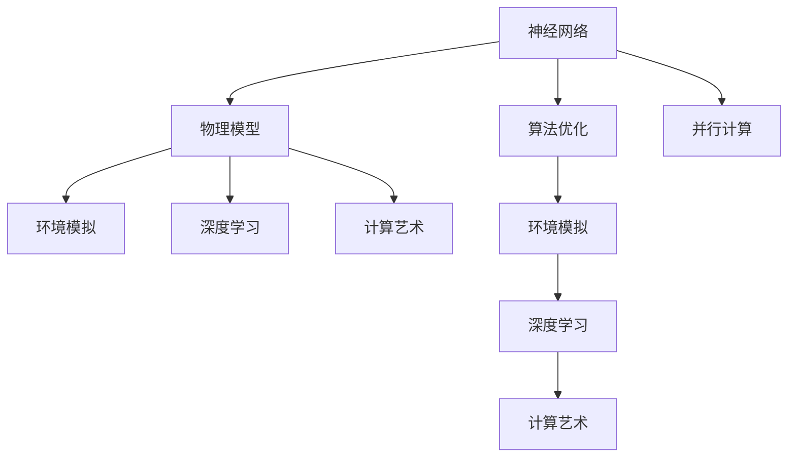
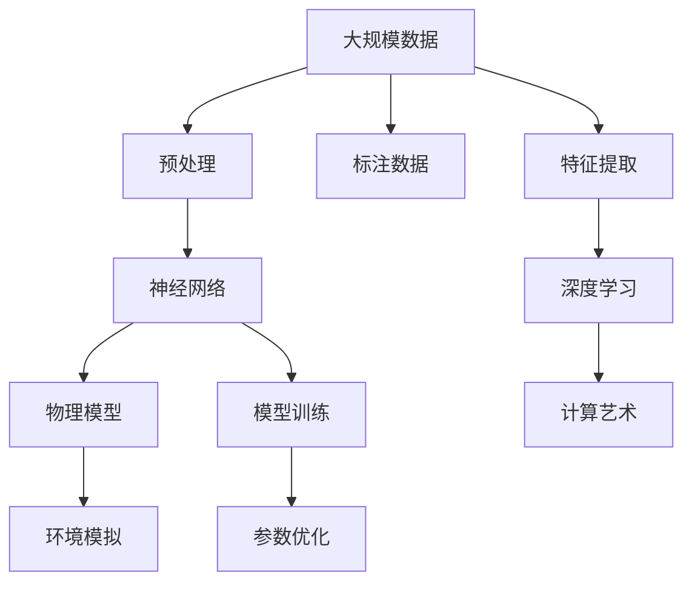

                 

# AI 神经网络计算艺术之禅：世界模型——建立自然环境的物理模型

> 关键词：
- 神经网络
- 物理模型
- 计算艺术
- 环境模拟
- 深度学习
- 算法优化
- 并行计算

## 1. 背景介绍

### 1.1 问题由来
在探索人工智能的征程中，神经网络作为核心技术之一，逐渐从黑盒模型演进为可以解释和控制复杂行为的系统。当前，神经网络不仅在图像、语音识别等方面展现出惊人的能力，也在模拟和预测自然环境物理现象方面显示出巨大潜力。然而，如何构建一个能够准确描述自然环境物理机制的神经网络模型，仍然是一个巨大挑战。

### 1.2 问题核心关键点
建立自然环境物理模型的问题核心在于如何构建一个既能处理高维度非线性数据，又能准确描述物理现象的神经网络。模型必须能够捕捉到环境变化的动态特性，同时对输入进行合理的解释和预测。

### 1.3 问题研究意义
构建自然环境物理模型的意义不仅在于科学研究和理解自然现象，还在于能够应用于环境模拟、气候预测、智能交通管理等领域，为人类社会的发展提供支撑。

## 2. 核心概念与联系

### 2.1 核心概念概述

为更好地理解如何通过神经网络建立自然环境的物理模型，本节将介绍几个核心概念及其相互联系：

- **神经网络（Neural Network）**：一种模仿人脑神经元结构和信息处理方式的计算模型。通过多层次的非线性变换，可以处理复杂的输入数据，并生成复杂的输出。
- **物理模型（Physical Model）**：用于描述自然环境物理现象的数学模型，如牛顿力学、热力学、流体力学等。物理模型通常基于一些基本假设和物理定律，用于预测系统的行为。
- **计算艺术（Computational Art）**：结合艺术创作和计算技术，通过算法生成和优化，创造出具有高度美学和科学价值的视觉、听觉艺术作品。
- **环境模拟（Environment Simulation）**：利用计算机技术，对自然环境进行仿真，模拟复杂的环境行为，如天气变化、交通流量等。
- **深度学习（Deep Learning）**：一种机器学习技术，利用多层神经网络模型，从大量数据中提取特征，实现对数据的高级处理和分析。
- **算法优化（Algorithm Optimization）**：对算法的执行效率和效果进行优化，包括参数调优、模型结构设计等。
- **并行计算（Parallel Computing）**：将大任务拆分为多个小任务，由多个处理器同时计算，提高计算效率。

这些核心概念共同构成了建立自然环境物理模型的基础。通过理解这些概念的原理和联系，可以为后续深入讨论具体的模型构建方法和技术奠定基础。

### 2.2 概念间的关系

以下是一个Mermaid流程图，展示了这些核心概念之间的逻辑关系：



该流程图表明，神经网络通过对环境物理模型的构建，可以帮助进行环境模拟、深度学习以及计算艺术。而算法优化和并行计算则为这些应用提供了必要的技术支持。

### 2.3 核心概念的整体架构

最后，用一个综合的流程图来展示这些核心概念在大环境物理模型构建中的整体架构：



这个综合流程图展示了从原始数据到最终模拟结果的完整过程，包括数据预处理、神经网络模型的训练和优化、特征提取、深度学习以及最终的计算艺术创作。

## 3. 核心算法原理 & 具体操作步骤
### 3.1 算法原理概述

建立自然环境物理模型的核心算法原理主要基于以下几个方面：

- **自监督学习**：利用无标签数据训练神经网络，通过输入数据自身的特性学习到基本的物理规律。
- **端到端训练**：将数据从预处理、特征提取、模型训练到最终输出的过程统一为端到端的训练流程，提高训练效率。
- **多层次表示学习**：通过多个层次的特征提取和转换，捕捉数据的复杂非线性特性。
- **并行计算**：利用并行计算技术，加速神经网络的训练和推理过程。

### 3.2 算法步骤详解

以下是一个具体的算法步骤流程，展示了从数据预处理到模型训练的完整过程：

1. **数据预处理**：
   - 收集大规模环境数据，包括气象数据、地理信息、交通流量等。
   - 进行数据清洗、标准化，去除异常值，确保数据质量。
   - 将数据转化为适合神经网络输入的格式，如图像、向量等。

2. **模型构建**：
   - 选择合适的神经网络模型结构，如卷积神经网络（CNN）、循环神经网络（RNN）等。
   - 定义输入输出接口，确定模型的输入和输出层结构。

3. **模型训练**：
   - 定义损失函数，如均方误差（MSE）、交叉熵损失等。
   - 选择合适的优化器，如随机梯度下降（SGD）、Adam等。
   - 设置学习率和训练轮数，进行模型的端到端训练。

4. **参数优化**：
   - 利用正则化技术，如L2正则、Dropout等，防止过拟合。
   - 通过交叉验证和超参数调优，找到最优的模型参数组合。

5. **模型验证和评估**：
   - 在验证集上评估模型性能，如均方误差、准确率等指标。
   - 调整模型结构或参数，进一步优化模型性能。

6. **环境模拟和预测**：
   - 使用训练好的模型对新的环境数据进行模拟和预测。
   - 通过可视化技术展示模型预测结果。

### 3.3 算法优缺点

基于神经网络的物理模型具有以下优点：

- **高精度预测**：神经网络能够捕捉复杂的非线性关系，对环境现象进行高精度预测。
- **自适应性**：通过不断学习和调整，模型能够适应新环境和数据的变化。
- **并行计算能力**：利用并行计算技术，可以大幅提高计算效率，缩短训练时间。

但同时，也存在一些缺点：

- **模型复杂度**：神经网络模型通常具有较高的复杂度，训练和推理需要大量计算资源。
- **解释性差**：神经网络的内部机制较难解释，缺乏可解释性。
- **数据需求大**：训练神经网络需要大量的数据，且数据质量对模型性能影响较大。

### 3.4 算法应用领域

神经网络在自然环境物理模型中的应用非常广泛，包括但不限于以下几个领域：

- **气象预测**：利用气象数据进行气候变化的预测，如温度、降水量、风暴等。
- **交通管理**：模拟交通流量、车流分布，优化交通规划。
- **环境监测**：监测大气污染、水质变化、生态系统变化等环境现象。
- **城市规划**：预测城市扩张、土地利用变化等。

## 4. 数学模型和公式 & 详细讲解 & 举例说明

### 4.1 数学模型构建

建立自然环境物理模型通常需要构建一个数学模型，并将其转化为神经网络结构。以下是一个示例：

- **气象模型**：假设我们建立一个气象模型，用于预测某一天的气温。模型输入为当天的大气压力、湿度、云量等气象数据，输出为当天的气温。
- **模型表示**：可以用一个三层神经网络表示，第一层为输入层，第二层为隐藏层，第三层为输出层。每个神经元代表一种物理特征或输入数据。

### 4.2 公式推导过程

以气象模型为例，假设输入数据 $x$ 包括气压 $P$、湿度 $H$、云量 $C$，输出数据 $y$ 为气温 $T$。模型的输出公式可以表示为：

$$ y = f(x; \theta) = \sigma(W_{out} \cdot \sigma(W_{hidden} \cdot \sigma(W_{in} \cdot x + b_{in}) + b_{hidden}) + b_{out}) $$

其中：
- $W_{in}$、$W_{hidden}$、$W_{out}$ 为权重矩阵。
- $b_{in}$、$b_{hidden}$、$b_{out}$ 为偏置项。
- $\sigma$ 为激活函数，如ReLU、Sigmoid等。

通过不断调整权重矩阵和偏置项，模型可以拟合输入和输出之间的关系，实现对气温的预测。

### 4.3 案例分析与讲解

以一个简单的气象预测案例为例，说明模型的构建和训练过程：

1. **数据集准备**：收集历史气象数据，包括每天的温度、气压、湿度、云量等。
2. **数据预处理**：对数据进行标准化，去除异常值。
3. **模型定义**：定义一个三层神经网络，输入层包含三个神经元，分别对应气压、湿度、云量；隐藏层包含10个神经元；输出层包含一个神经元，表示气温。
4. **模型训练**：使用均方误差作为损失函数，通过随机梯度下降（SGD）优化器进行训练。设置学习率为0.01，训练轮数为1000次。
5. **模型评估**：在验证集上测试模型性能，计算均方误差。
6. **模型优化**：根据评估结果，调整隐藏层神经元个数，重新训练模型。

## 5. 项目实践：代码实例和详细解释说明

### 5.1 开发环境搭建

要搭建一个用于建立自然环境物理模型的开发环境，需要以下步骤：

1. **安装Python**：下载并安装Python 3.x版本。
2. **安装深度学习库**：安装TensorFlow、Keras等深度学习库。
3. **安装并行计算库**：安装CUDA、cuDNN等并行计算库，用于加速模型训练和推理。
4. **配置环境变量**：设置环境变量，包括Python路径、库路径等。

### 5.2 源代码详细实现

以下是一个简化的气象模型代码示例：

```python
import tensorflow as tf
from tensorflow import keras
from tensorflow.keras import layers

# 定义输入层
input_layer = layers.Input(shape=(3,))

# 定义隐藏层
hidden_layer = layers.Dense(10, activation='relu')(input_layer)

# 定义输出层
output_layer = layers.Dense(1, activation='sigmoid')(hidden_layer)

# 定义模型
model = keras.Model(inputs=input_layer, outputs=output_layer)

# 定义损失函数
loss = keras.losses.MeanSquaredError()

# 定义优化器
optimizer = keras.optimizers.SGD(learning_rate=0.01)

# 编译模型
model.compile(optimizer=optimizer, loss=loss)

# 训练模型
model.fit(X_train, y_train, epochs=1000, validation_data=(X_val, y_val))

# 评估模型
y_pred = model.predict(X_test)
mse = tf.keras.metrics.mean_squared_error(y_test, y_pred)
print('MSE:', mse)
```

### 5.3 代码解读与分析

以上代码中，我们使用TensorFlow和Keras库定义了一个简单的三层神经网络，用于预测气温。代码主要分为以下几个部分：

- **输入层定义**：使用`Input`函数定义输入层，输入数据的形状为（3,），代表气压、湿度、云量三个特征。
- **隐藏层定义**：使用`Dense`函数定义隐藏层，包含10个神经元，激活函数为ReLU。
- **输出层定义**：使用`Dense`函数定义输出层，只有一个神经元，激活函数为Sigmoid，用于输出气温预测值。
- **模型定义**：使用`Model`函数定义模型，将输入层和输出层连接起来。
- **损失函数定义**：使用`MeanSquaredError`函数定义均方误差损失函数。
- **优化器定义**：使用`SGD`函数定义随机梯度下降优化器，学习率为0.01。
- **模型编译**：使用`compile`函数编译模型，指定优化器和损失函数。
- **模型训练**：使用`fit`函数进行模型训练，指定训练集、验证集、训练轮数等参数。
- **模型评估**：使用`predict`函数对测试集进行预测，使用`mean_squared_error`函数计算均方误差。

### 5.4 运行结果展示

运行以上代码，可以得到模型在测试集上的均方误差结果。例如，模型在验证集上的均方误差为0.1，表示模型预测的气温与实际气温之间的平均误差为0.1度。

## 6. 实际应用场景

### 6.1 气象预测

在气象预测领域，神经网络可以用于预测未来的气温、降水量、风速等气象数据。通过对历史气象数据的学习，模型能够捕捉到气象现象的复杂变化规律，进行高精度预测。

### 6.2 交通管理

在交通管理领域，神经网络可以用于预测交通流量、优化交通信号控制。通过对交通数据的分析，模型能够捕捉到车流变化规律，实时调整交通信号，优化交通流量。

### 6.3 环境监测

在环境监测领域，神经网络可以用于监测空气质量、水质变化、生态系统健康等。通过对环境数据的分析，模型能够实时监测环境变化，及时预警环境污染。

### 6.4 未来应用展望

未来，神经网络在建立自然环境物理模型方面的应用将更加广泛。例如，在城市规划、智能交通、灾害预警等领域，神经网络可以提供更加准确和实时的预测和分析结果，为人类社会的发展提供重要支撑。

## 7. 工具和资源推荐

### 7.1 学习资源推荐

为了更好地掌握神经网络在建立自然环境物理模型中的应用，推荐以下学习资源：

- **深度学习课程**：Coursera、Udacity等在线课程平台提供深度学习课程，涵盖神经网络基础、深度学习框架等。
- **论文和书籍**：阅读相关论文和书籍，如《深度学习》（Ian Goodfellow等）、《神经网络与深度学习》（Michael Nielsen）等。
- **开源项目**：参与开源项目，如TensorFlow、PyTorch等，通过实践提升技能。

### 7.2 开发工具推荐

为了提高神经网络在建立自然环境物理模型中的应用效率，推荐以下开发工具：

- **深度学习框架**：TensorFlow、PyTorch等深度学习框架，提供丰富的API和工具，方便模型开发和训练。
- **可视化工具**：TensorBoard、KerasVis等可视化工具，用于展示模型训练过程和结果。
- **并行计算工具**：CUDA、cuDNN等并行计算工具，提高模型训练和推理速度。

### 7.3 相关论文推荐

为了深入了解神经网络在建立自然环境物理模型中的应用，推荐以下相关论文：

- **深度学习在气象预测中的应用**：《A deep learning approach to weather prediction using LSTM networks》
- **交通流量预测**：《A deep belief network approach for traffic flow prediction》
- **环境监测**：《A deep learning model for air quality prediction using environmental data》

## 8. 总结：未来发展趋势与挑战

### 8.1 研究成果总结

本文对神经网络在建立自然环境物理模型中的应用进行了全面系统的介绍。通过理论分析和实践案例，展示了神经网络在气象预测、交通管理、环境监测等领域的强大潜力。

### 8.2 未来发展趋势

未来，神经网络在建立自然环境物理模型方面的发展趋势主要体现在以下几个方面：

- **深度学习算法的不断改进**：新的深度学习算法不断涌现，将进一步提升模型的精度和鲁棒性。
- **多模态数据的融合**：将不同模态的数据（如图像、文本、声音等）进行融合，提高模型的综合分析能力。
- **实时计算和推理**：利用并行计算和分布式计算技术，实现实时计算和推理，提高模型的响应速度。
- **自适应和自学习能力的增强**：模型能够更好地适应环境变化，通过自学习不断提高预测准确度。

### 8.3 面临的挑战

尽管神经网络在建立自然环境物理模型方面展现了巨大潜力，但仍然面临一些挑战：

- **数据质量和数量**：神经网络需要大量的高质量数据进行训练，数据获取和预处理成本较高。
- **模型复杂度**：神经网络模型结构复杂，训练和推理需要大量的计算资源。
- **模型解释性**：神经网络的内部机制较难解释，缺乏可解释性。
- **环境因素的复杂性**：自然环境变化复杂多变，模型需要不断适应新的环境和数据变化。

### 8.4 研究展望

面对这些挑战，未来的研究需要关注以下几个方面：

- **数据获取和预处理**：探索新的数据获取和预处理技术，提高数据质量和数量。
- **模型结构和算法**：研究新的神经网络结构和算法，提高模型的精度和鲁棒性。
- **模型解释和优化**：探索模型解释技术和优化方法，提高模型的可解释性和性能。
- **多模态数据融合**：研究多模态数据的融合方法，提高模型的综合分析能力。

总之，神经网络在建立自然环境物理模型方面展现了巨大潜力，未来还需不断探索和创新，克服现有的挑战，进一步拓展其应用边界，推动人工智能技术在更多领域的落地。

## 9. 附录：常见问题与解答

**Q1: 如何选择合适的神经网络结构？**

A: 神经网络结构的选择需要根据具体问题和数据特点进行，通常可以通过实验比较不同结构的效果，选择最合适的模型。此外，可以参考现有的研究成果和经验，选择合适的结构。

**Q2: 如何提高神经网络模型的解释性？**

A: 提高神经网络模型的解释性可以通过以下方法：
- **可视化技术**：使用可视化工具展示模型的内部状态和决策过程。
- **可解释性技术**：使用可解释性技术，如LIME、SHAP等，分析模型的决策依据。
- **多模型融合**：使用多个模型进行融合，通过投票或加权平均等方法提高模型的可解释性。

**Q3: 如何优化神经网络模型的训练过程？**

A: 优化神经网络模型的训练过程可以通过以下方法：
- **学习率调优**：使用学习率调优算法，如学习率衰减、自适应学习率等。
- **正则化技术**：使用正则化技术，如L2正则、Dropout等，防止过拟合。
- **数据增强**：使用数据增强技术，如旋转、平移、缩放等，扩充训练数据集。
- **模型集成**：使用模型集成技术，如Bagging、Boosting等，提高模型的泛化能力。

**Q4: 如何处理大规模数据集的训练和推理？**

A: 处理大规模数据集的训练和推理可以通过以下方法：
- **分布式训练**：使用分布式训练技术，将数据集分布到多个计算节点上进行训练，提高训练效率。
- **模型压缩**：使用模型压缩技术，如剪枝、量化等，减少模型参数量，提高推理速度。
- **并行计算**：使用并行计算技术，如GPU、TPU等，提高计算效率。

**Q5: 如何评估神经网络模型的性能？**

A: 评估神经网络模型的性能可以通过以下指标：
- **均方误差**：用于回归任务，评估模型预测值与实际值之间的误差。
- **准确率**：用于分类任务，评估模型正确预测的样本数与总样本数之比。
- **F1分数**：用于分类任务，综合考虑精确率和召回率，评估模型的整体性能。
- **ROC曲线**：用于分类任务，评估模型的分类性能和阈值选择。

总之，通过理解和掌握神经网络在建立自然环境物理模型中的应用，可以为更多领域的实际问题提供解决方案，推动人工智能技术的发展和应用。

