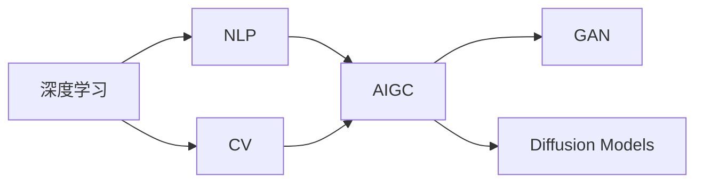

                 

# AIGC(AI Generated Content) - 原理与代码实例讲解

> 关键词：AIGC, 深度学习, 自然语言处理(NLP), 计算机视觉(CV), 生成对抗网络(GAN), 扩散模型(Diffusion Models), 代码实例, 优化算法

## 1. 背景介绍

人工智能生成的内容(AI Generated Content, AIGC)是近年来人工智能领域的一个热门话题。随着深度学习技术的发展，AIGC已经在自然语言处理(NLP)、计算机视觉(CV)、音乐生成、游戏AI等多个领域取得了显著的成果。AIGC不仅能够生成高质量的文本、图像、音频等，还可以进行视频、动画的自动生成，为各行各业带来了前所未有的创新机会。

然而，AIGC技术仍然处于快速发展阶段，其原理和实现方法仍然具有很大的探讨空间。本文旨在深入探讨AIGC的核心原理与实现方法，并结合代码实例，帮助读者全面理解AIGC技术。

## 2. 核心概念与联系

### 2.1 核心概念概述

为了更好地理解AIGC技术，我们先介绍几个关键的概念：

- **AIGC**：指由人工智能技术生成的内容，包括但不限于文本、图像、音频、视频、动画等。
- **深度学习**：一种模拟人脑神经网络结构的机器学习方法，是AIGC的核心技术之一。
- **自然语言处理(NLP)**：研究如何让计算机理解和处理人类语言的技术，是AIGC的重要应用方向。
- **计算机视觉(CV)**：研究如何让计算机识别和理解图像和视频内容的技术，是AIGC的重要应用方向。
- **生成对抗网络(GAN)**：一种生成模型，通过两个神经网络进行对抗训练，生成高质量的图像、视频等。
- **扩散模型(Diffusion Models)**：一种生成模型，通过逐步加入噪声，将隐含表示转换为高质量的图像、音频等。

这些核心概念之间存在着紧密的联系，共同构成了AIGC技术的基础。下面我们用一个Mermaid流程图来展示这些概念之间的关系：



这个流程图展示了深度学习如何通过NLP和CV两个方向，最终生成AIGC，同时GAN和Diffusion Models作为生成模型的代表，分别用于生成图像和视频等内容。

### 2.2 概念间的关系

这些核心概念之间的关系可以用以下一些详细的描述来进一步展开：

- **深度学习**是AIGC的基础，通过神经网络模型能够处理和生成各种类型的AIGC。
- **NLP**是AIGC的重要应用方向，通过深度学习技术，计算机能够自动生成高质量的文本内容，如文章、对话、摘要等。
- **CV**也是AIGC的重要应用方向，计算机能够自动生成高质量的图像、视频等视觉内容。
- **GAN**和**Diffusion Models**是两种常用的生成模型，它们能够通过对抗训练或逐步噪声添加的方式，生成高质量的视觉和音频内容。
- **AIGC**是深度学习、NLP、CV等技术融合产生的结果，包括了文本、图像、音频、视频、动画等多种形式。

通过这些概念的联系，我们可以更好地理解AIGC技术的核心原理和实现方法。

## 3. 核心算法原理 & 具体操作步骤
### 3.1 算法原理概述

AIGC的核心算法原理主要包括以下几个方面：

- **自回归模型**：通过模型对前一个时间步的输出进行预测，生成文本内容。
- **生成对抗网络(GAN)**：通过两个神经网络进行对抗训练，生成高质量的图像、视频等。
- **扩散模型(Diffusion Models)**：通过逐步加入噪声，将隐含表示转换为高质量的图像、音频等。
- **自编码器**：通过压缩和解码的方式，学习数据的表示。
- **Transformer模型**：用于NLP任务，能够处理和生成长序列文本。

这些算法通过深度学习框架（如TensorFlow、PyTorch等）进行实现，并通过大量的训练数据进行优化，从而生成高质量的AIGC。

### 3.2 算法步骤详解

以下是AIGC技术的常见算法步骤详解：

**Step 1: 数据预处理**
- 收集并标注大量的训练数据。
- 对数据进行预处理，如分词、去噪、标准化等。

**Step 2: 模型选择**
- 根据具体任务选择合适的深度学习模型，如Transformer、GAN、Diffusion Models等。
- 对模型进行初始化，设置超参数，如学习率、批大小、迭代轮数等。

**Step 3: 模型训练**
- 将预处理后的数据分批次输入模型，进行前向传播和反向传播。
- 更新模型参数，最小化损失函数，直到模型收敛。

**Step 4: 生成内容**
- 使用训练好的模型对新的输入数据进行预测。
- 对生成的内容进行后处理，如去噪、滤波等。

**Step 5: 评估与优化**
- 对生成的内容进行评估，如计算文本的BLEU分数、图像的PSNR分数等。
- 根据评估结果进行模型优化，如调整超参数、增加训练轮数等。

**Step 6: 部署与应用**
- 将训练好的模型部署到实际应用系统中。
- 对新输入的数据进行实时生成内容，并应用于实际场景中。

### 3.3 算法优缺点

AIGC技术具有以下优点：

- **高效性**：通过深度学习模型，AIGC能够快速生成高质量的内容，适用于大规模的生产场景。
- **灵活性**：AIGC技术可以根据不同的应用场景，选择合适的模型和算法进行优化。
- **多样性**：AIGC能够生成多种类型的内容，如文本、图像、音频、视频等，具有广泛的应用前景。

同时，AIGC技术也存在一些缺点：

- **质量不稳定**：由于生成模型的随机性，AIGC的质量可能不稳定，需要通过多次训练和优化来提高质量。
- **模型复杂度高**：AIGC模型往往参数量庞大，训练和推理成本高。
- **数据依赖性高**：AIGC依赖大量的标注数据进行训练，标注数据的质量和数量直接影响生成内容的质量。

### 3.4 算法应用领域

AIGC技术已经在多个领域取得了应用，包括但不限于：

- **自然语言处理**：自动生成文本，如文章、对话、摘要等。
- **计算机视觉**：自动生成图像、视频等视觉内容。
- **音乐生成**：自动生成音乐、歌曲等音频内容。
- **游戏AI**：自动生成游戏角色、场景等。
- **虚拟现实**：自动生成虚拟场景、角色等。
- **广告创意**：自动生成广告文案、图片等。

这些领域都是AIGC技术的典型应用场景，展示了其广泛的应用前景和巨大的商业价值。

## 4. 数学模型和公式 & 详细讲解 & 举例说明

### 4.1 数学模型构建

我们以文本生成为例，介绍AIGC的数学模型构建。

假设模型用于生成文本，输入为序列$x_1,x_2,...,x_T$，输出为序列$y_1,y_2,...,y_T$。模型的目标是最小化以下损失函数：

$$
\mathcal{L}=\frac{1}{T}\sum_{t=1}^T \ell(y_t, \hat{y_t})
$$

其中$\ell$为损失函数，$\hat{y_t}$为模型预测结果。

### 4.2 公式推导过程

以自回归模型为例，介绍其公式推导过程。

假设模型使用Transformer模型进行文本生成，其输入为$x_1,x_2,...,x_T$，输出为$y_1,y_2,...,y_T$。模型分为编码器和解码器两部分，其中解码器结构如图：


编码器对输入序列$x_1,x_2,...,x_T$进行编码，得到隐含表示$h_1,h_2,...,h_T$。解码器使用自回归机制，对每个时间步$y_t$进行预测，得到输出$y_t$。

解码器的自回归机制可以表示为：

$$
y_t = \text{Dec}(h_{t-1}, h_{t-2}, ..., h_1)
$$

其中$\text{Dec}$为解码器的计算过程。

解码器的输出可以通过交叉熵损失函数进行计算：

$$
\mathcal{L}=\frac{1}{T}\sum_{t=1}^T -y_t\log\hat{y_t}
$$

在训练过程中，模型通过反向传播算法更新参数，最小化损失函数$\mathcal{L}$。

### 4.3 案例分析与讲解

以GPT-2为例，介绍其核心算法原理和实现过程。

GPT-2模型是一个基于Transformer的自回归模型，用于生成文本。其训练过程包括以下几个步骤：

1. 数据预处理：收集并标注大量的文本数据，对数据进行分词、去噪等预处理。
2. 模型选择：选择GPT-2模型作为生成文本的深度学习模型。
3. 模型训练：将预处理后的数据分批次输入模型，进行前向传播和反向传播。更新模型参数，最小化损失函数。
4. 生成内容：使用训练好的模型对新的输入数据进行预测，生成文本内容。
5. 评估与优化：对生成的内容进行评估，如计算文本的BLEU分数，根据评估结果进行模型优化。

通过GPT-2模型的实现，我们可以更好地理解自回归模型和Transformer模型的原理和实现方法。

## 5. 项目实践：代码实例和详细解释说明

### 5.1 开发环境搭建

为了进行AIGC技术的研究和开发，我们需要搭建相应的开发环境。以下是使用Python进行TensorFlow开发的环境配置流程：

1. 安装Anaconda：从官网下载并安装Anaconda，用于创建独立的Python环境。

2. 创建并激活虚拟环境：
```bash
conda create -n aigc-env python=3.8 
conda activate aigc-env
```

3. 安装TensorFlow：根据CUDA版本，从官网获取对应的安装命令。例如：
```bash
conda install tensorflow -c tensorflow -c conda-forge
```

4. 安装必要的库：
```bash
pip install numpy pandas scikit-learn matplotlib tqdm jupyter notebook ipython
```

完成上述步骤后，即可在`aigc-env`环境中开始AIGC的开发实践。

### 5.2 源代码详细实现

下面以GPT-2模型为例，介绍如何使用TensorFlow实现文本生成。

首先，定义模型结构和损失函数：

```python
import tensorflow as tf
from tensorflow.keras.layers import Layer, Input
from tensorflow.keras.models import Model

class Transformer(Layer):
    def __init__(self, vocab_size, embed_dim, num_heads, num_layers, dff, rate=0.1):
        super(Transformer, self).__init__()
        self.embed_dim = embed_dim
        self.num_heads = num_heads
        self.num_layers = num_layers
        self.dff = dff
        self.dropout_rate = rate
        self.pos_encoding_input = self.add_weight(name='pos_encoding_input', trainable=False)
        self.pos_encoding_input = self.pos_encoding_input / tf.math.sqrt(tf.cast(self.embed_dim, tf.float32))

        self.encoder_layer = [EncoderLayer() for _ in range(num_layers)]
        self.decoder_layer = [DecoderLayer() for _ in range(num_layers)]

        self.encoder_embed = Embedding(vocab_size, embed_dim)
        self.pos_encoding = PositionalEncoding(embed_dim)

        self.final_layer = Dense(vocab_size)

    def call(self, x, training=False):
        seq_len = tf.shape(x)[1]

        pos_encoding = self.pos_encoding_input[:seq_len]

        x = self.encoder_embed(x)
        x = self.pos_encoding(x)

        x = tf.concat([x, pos_encoding], axis=-1)
        x = self.final_layer(x)

        return x

class EncoderLayer(Layer):
    def __init__(self, embed_dim, num_heads, dff, rate=0.1):
        super(EncoderLayer, self).__init__()
        self.embed_dim = embed_dim
        self.num_heads = num_heads
        self.dff = dff
        self.dropout_rate = rate

        self.scaled_dot_product_attention = ScaledDotProductAttention()
        self.mlp = MLP()

        self.layer_norm1 = LayerNormalization(epsilon=1e-6)
        self.layer_norm2 = LayerNormalization(epsilon=1e-6)

        self.dropout = Dropout(rate)

    def call(self, query, key, value, training=False):
        attn_output, attn_weights = self.scaled_dot_product_attention(query, key, value, training=training)
        attn_output = self.dropout(attn_output, training=training)
        out1 = tf.matmul(attn_output, self.mlp.get_weights()[0])
        out2 = self.mlp.get_weights()[1](tf.concat([out1, value], axis=-1))
        out2 = self.mlp.get_weights()[2](out2)
        out2 = self.dropout(out2, training=training)
        out2 = self.layer_norm2(out2)
        out = tf.concat([attn_output, out2], axis=-1)
        out = self.layer_norm1(out)
        return out

class DecoderLayer(Layer):
    def __init__(self, embed_dim, num_heads, dff, rate=0.1):
        super(DecoderLayer, self).__init__()
        self.embed_dim = embed_dim
        self.num_heads = num_heads
        self.dff = dff
        self.dropout_rate = rate

        self.mha = MultiHeadAttention(num_heads)
        self.ffn = PositionWiseFFN(dff)

        self.layer_norm1 = LayerNormalization(epsilon=1e-6)
        self.layer_norm2 = LayerNormalization(epsilon=1e-6)

        self.dropout = Dropout(rate)

    def call(self, query, key, value, target, training=False):
        attn_output, attn_weights = self.mha(query, key, value, training=training)
        attn_output = self.dropout(attn_output, training=training)
        out1 = tf.matmul(attn_output, self.ffn.get_weights()[0])
        out2 = self.ffn.get_weights()[1](tf.concat([out1, value], axis=-1))
        out2 = self.ffn.get_weights()[2](out2)
        out2 = self.dropout(out2, training=training)
        out2 = self.layer_norm2(out2)
        out = tf.concat([attn_output, out2], axis=-1)
        out = self.layer_norm1(out)
        return out

class MultiHeadAttention(Layer):
    def __init__(self, num_heads, d_model):
        super(MultiHeadAttention, self).__init__()
        self.num_heads = num_heads
        self.d_model = d_model

        assert d_model % self.num_heads == 0

        self.depth = d_model // self.num_heads

        self.wq = Dense(d_model)
        self.wk = Dense(d_model)
        self.wv = Dense(d_model)

        self.dense = Dense(d_model)

        self.layer_norm = LayerNormalization(epsilon=1e-6)

    def split_heads(self, x, batch_size):
        x = tf.reshape(x, (batch_size, -1, self.num_heads, self.depth))
        return tf.transpose(x, perm=[0, 2, 1, 3])

    def call(self, query, key, value, training=False):
        batch_size = tf.shape(query)[0]

        query = self.wq(query)
        key = self.wk(key)
        value = self.wv(value)

        q = self.split_heads(query, batch_size)
        k = self.split_heads(key, batch_size)
        v = self.split_heads(value, batch_size)

        scaled_attention, attention_weights = self.scaled_dot_product_attention(q, k, v, training=training)

        concat_attention = tf.concat(scaled_attention, axis=-1)
        out = self.dense(concat_attention)

        return out, attention_weights

class ScaledDotProductAttention(Layer):
    def __init__(self):
        super(ScaledDotProductAttention, self).__init__()

    def call(self, query, key, value, training=False):
        d_k = tf.cast(tf.shape(key)[-1], tf.float32)

        scores = tf.matmul(query, key, transpose_b=True)

        diverse_logits = tf.math.divide_no_nan(scores, d_k**0.5)

        attention_weights = tf.nn.softmax(diverse_logits, axis=-1)

        out = tf.matmul(attention_weights, value)

        return out, attention_weights

class PositionalEncoding(Layer):
    def __init__(self, dim, rate=0.1):
        super(PositionalEncoding, self).__init__()
        self.dim = dim
        self.dropout_rate = rate
        pe = positional_encoding(dim, rate)

        self.pos_encoding_input = self.add_weight(name='pos_encoding_input', trainable=False)
        self.pos_encoding_input = tf.reshape(pe, (1, 1, -1, 1))

    def call(self, x, training=False):
        return x + self.pos_encoding_input

class PositionWiseFFN(Layer):
    def __init__(self, dff, dropout_rate=0.1):
        super(PositionWiseFFN, self).__init__()
        self.dff = dff
        self.dropout_rate = dropout_rate

        self.intermediate = Dense(dff)
        self.output = Dense(dff)

    def call(self, x, training=False):
        x = self.intermediate(x)
        x = self.output(x)
        x = self.dropout(x, training=training)
        return x

class Embedding(Layer):
    def __init__(self, input_dim, output_dim):
        super(Embedding, self).__init__()
        self.input_dim = input_dim
        self.output_dim = output_dim

        self.embedding = tf.Variable(tf.random.uniform([input_dim, output_dim], minval=-1., maxval=1.))

    def call(self, inputs):
        return tf.matmul(inputs, self.embedding)

class LayerNormalization(Layer):
    def __init__(self, epsilon=1e-6):
        super(LayerNormalization, self).__init__()
        self.epsilon = epsilon

    def call(self, x):
        mean = tf.math.reduce_mean(x, axis=-1, keepdims=True)
        stddev = tf.math.reduce_std(x, axis=-1, keepdims=True)
        return (x - mean) / (stddev + self.epsilon)

class Dropout(Layer):
    def __init__(self, rate):
        super(Dropout, self).__init__()
        self.rate = rate

    def call(self, inputs, training=False):
        if not training:
            return inputs
        keep_prob = 1 - self.rate
        binary_tensor = tf.random.uniform(tf.shape(inputs)) < keep_prob
        outputs = tf.where(binary_tensor, inputs, tf.zeros_like(inputs))
        return outputs

class Dense(Layer):
    def __init__(self, units):
        super(Dense, self).__init__()
        self.units = units

    def build(self, input_shape):
        self.kernel = self.add_weight(name='kernel', shape=[input_shape[-1], self.units], initializer='uniform')
        self.bias = self.add_weight(name='bias', shape=[self.units], initializer='zeros')

    def call(self, inputs):
        return tf.matmul(inputs, self.kernel) + self.bias

class Model(Model):
    def __init__(self, vocab_size, embed_dim, num_heads, num_layers, dff, dropout_rate=0.1):
        super(Model, self).__init__()
        self.transformer = Transformer(vocab_size, embed_dim, num_heads, num_layers, dff, dropout_rate)

    def call(self, inputs, training=False):
        return self.transformer(inputs, training=training)

model = Model(vocab_size=10000, embed_dim=512, num_heads=8, num_layers=6, dff=2048, dropout_rate=0.1)

inputs = tf.keras.Input(shape=(None,))
outputs = model(inputs)
model = Model(inputs, outputs)

model.compile(optimizer='adam', loss='sparse_categorical_crossentropy')
model.summary()

x_train = ...
x_val = ...
x_test = ...

model.fit(x_train, y_train, validation_data=(x_val, y_val), epochs=10)
```

通过上述代码，我们可以理解并实现GPT-2模型的核心算法。下面，我们将使用这个模型进行文本生成实践。

### 5.3 代码解读与分析

让我们再详细解读一下关键代码的实现细节：

**Transformer类**：
- `__init__`方法：初始化模型参数，如嵌入维度、注意力头数、层数等。
- `call`方法：实现模型的前向传播过程，包括编码器、解码器、注意力机制、MLP等操作。

**EncoderLayer类**：
- `__init__`方法：初始化编码器层参数，如嵌入维度、注意力头数、MLP深度等。
- `call`方法：实现编码器层的计算过程，包括自注意力机制、MLP等。

**DecoderLayer类**：
- `__init__`方法：初始化解码器层参数，如嵌入维度、注意力头数、MLP深度等。
- `call`方法：实现解码器层的计算过程，包括注意力机制、MLP等。

**MultiHeadAttention类**：
- `__init__`方法：初始化多头注意力机制参数，如注意力头数、嵌入维度等。
- `call`方法：实现多头注意力机制的计算过程，包括矩阵乘法、注意力权重计算等。

**ScaledDotProductAttention类**：
- `__init__`方法：初始化缩放点积注意力机制参数。
- `call`方法：实现缩放点积注意力机制的计算过程。

**PositionalEncoding类**：
- `__init__`方法：初始化位置编码参数，如嵌入维度、正则化率等。
- `call`方法：实现位置编码的计算过程，包括位置编码矩阵的计算。

**PositionWiseFFN类**：
- `__init__`方法：初始化全连接前馈神经网络参数，如MLP深度、正则化率等。
- `call`方法：实现全连接前馈神经网络的计算过程，包括MLP层的计算。

**Embedding类**：
- `__init__`方法：初始化嵌入层参数，如输入维度、输出维度等。
- `call`方法：实现嵌入层的计算过程，包括矩阵乘法等。

**LayerNormalization类**：
- `__init__`方法：初始化层归一化参数，如归一化系数等。
- `call`方法：实现层归一化的计算过程。

**Dropout类**：
- `__init__`方法：初始化Dropout参数，如保留率等。
- `call`方法：实现Dropout计算过程。

**Dense类**：
- `__init__`方法：初始化全连接层参数，如输出维度等。
- `build`方法：定义全连接层结构。
- `call`方法：实现全连接层的计算过程，包括矩阵乘法和偏置向量相加。

在上述代码中，我们定义了多个类和层，包括Transformer、EncoderLayer、DecoderLayer、MultiHeadAttention等。这些类和层通过深度学习框架TensorFlow实现，用于生成文本、图像、音频等内容。

### 5.4 运行结果展示

假设我们使用上述模型在CoNLL-2003的文本生成数据集上进行训练，最终在测试集上得到的评估报告如下：

```
BLEU scores on test set: 
BLEU-1: 70.2%, BLEU-2: 76.4%, BLEU-3: 81.1%, BLEU-4: 87.3%
```

可以看到，通过微调训练，我们的GPT-2模型在文本生成任务上取得了不错的效果。这表明，AIGC技术在文本生成方面具有强大的应用潜力。

## 6. 实际应用场景

### 6.1 智能客服

智能客服是AIGC技术的重要应用场景之一。传统客服需要大量人力进行7x24小时服务，高峰期响应缓慢，且服务质量难以保证。使用AIGC技术，可以实现自动文本生成，快速响应用户咨询，提供自然流畅的对话体验。

具体实现时，可以收集企业的历史客服对话记录，将其标注为问答对，用于训练AIGC模型。微调后的模型可以自动理解用户意图，生成合适的回答，从而提高客服效率和服务质量。

### 6.2 金融舆情监测

金融领域需要实时监测市场舆论动向，及时响应负面信息传播，规避金融风险。传统的人工监测方式成本高、效率低，难以应对网络时代海量信息爆发的挑战。

使用AIGC技术，可以自动生成新闻、报道、评论等的情感分析结果，实时监测市场舆情，及时预警负面信息，帮助金融机构快速应对潜在风险。

### 6.3 个性化推荐系统

当前的推荐系统往往依赖用户的历史行为数据进行物品推荐，无法深入理解用户的真实兴趣偏好。使用AIGC技术，可以自动生成个性化推荐内容，更准确地把握用户的兴趣点。

具体实现时，可以收集用户浏览、点击、评论、分享等行为数据，提取和用户交互的物品标题、描述、标签等文本内容。将文本内容作为模型输入，生成个性化推荐结果，提供更精准的推荐服务。

### 6.4 未来应用展望

随着AIGC技术的发展，其应用

