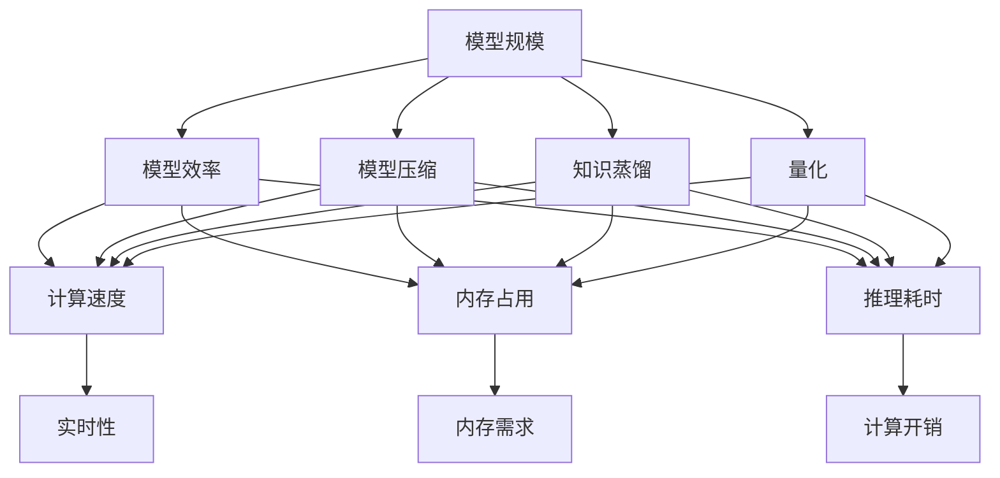
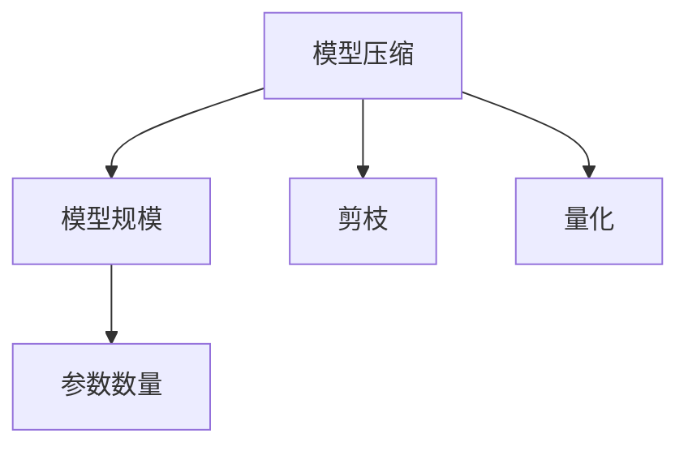
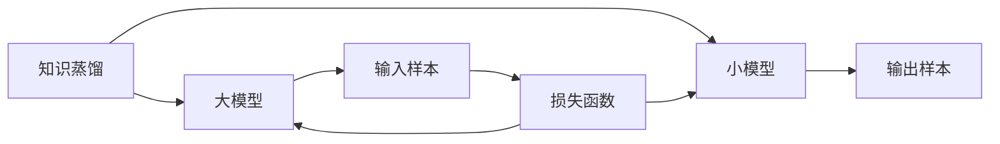
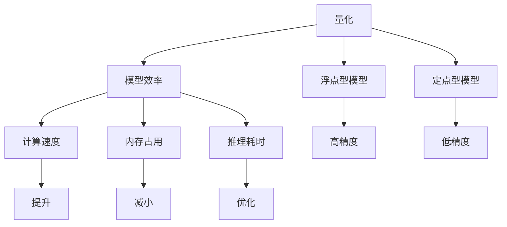
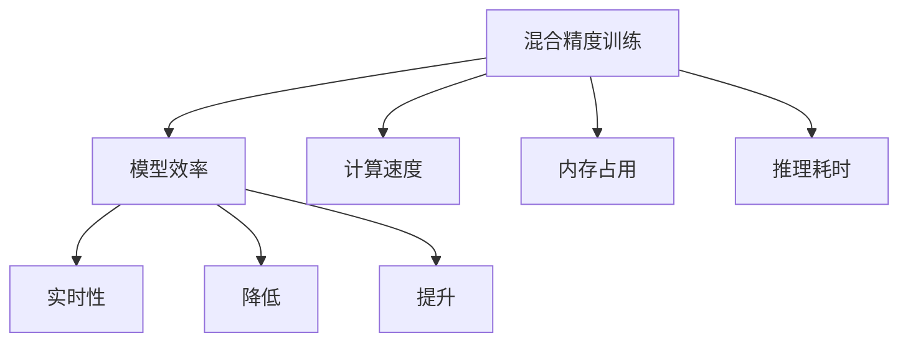
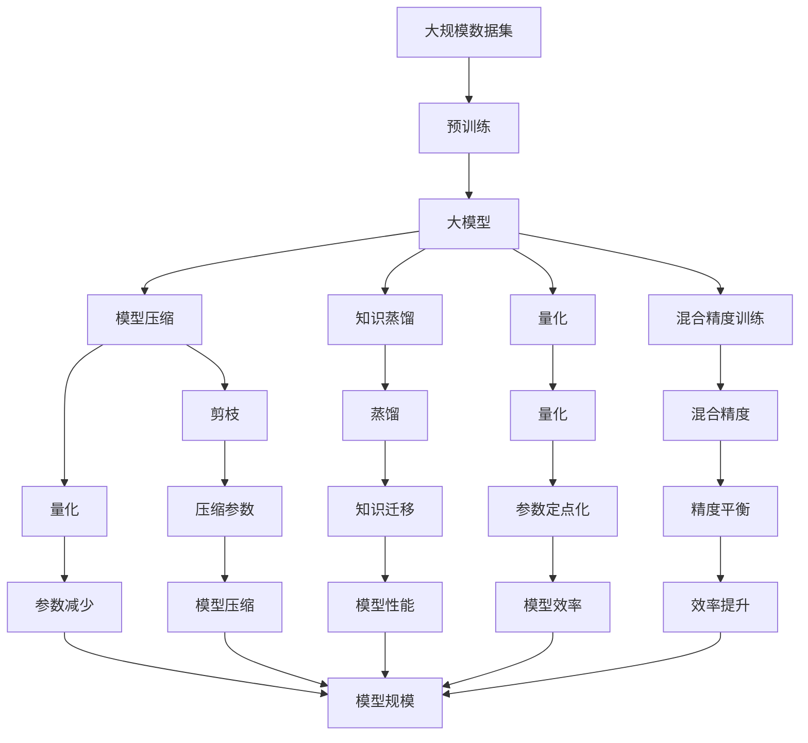

                 

# AI模型规模与效率的平衡:寻找最佳点

## 1. 背景介绍

### 1.1 问题由来
随着深度学习技术的快速发展，AI模型在各个领域的应用越来越广泛，从图像识别到自然语言处理，再到自动驾驶和智能推荐系统，无处不在。然而，模型规模和效率之间的平衡问题，也日益成为制约AI技术发展的瓶颈。一方面，模型规模越大，往往意味着其性能越强，能够处理更复杂的任务和数据；但另一方面，模型规模的增大也会带来计算资源需求的大幅增加，推理速度变慢，难以在实际应用中快速部署和迭代。因此，如何找到一个既能保证性能，又能够高效推理的AI模型规模和效率的平衡点，成为了当下AI研究的重要课题。

### 1.2 问题核心关键点
为了解决模型规模与效率之间的平衡问题，研究人员提出了许多方法和策略，包括模型压缩、知识蒸馏、量化、混合精度训练等。但这些方法各有优缺点，需要根据具体应用场景进行选择。本文将系统介绍这些方法，并通过详细的数学推导和实际案例，帮助读者找到在不同应用场景下的最佳平衡点。

### 1.3 问题研究意义
找到AI模型规模与效率之间的最佳平衡点，对于加速AI技术的产业化应用具有重要意义：

1. **提升性能**：通过合理的模型压缩和量化技术，可以在保持模型性能的前提下，大幅减小模型大小和计算资源需求。
2. **加速部署**：高效的推理算法和混合精度训练可以显著提高模型的推理速度，降低服务延迟，满足实际应用的高实时性要求。
3. **降低成本**：通过知识蒸馏和转移学习等技术，可以构建高效小规模模型，降低开发和部署成本。
4. **应对数据增长**：大规模模型的实时推理能力，可以应对大数据带来的计算压力，确保系统的稳定性和可扩展性。

## 2. 核心概念与联系

### 2.1 核心概念概述

为更好地理解AI模型规模与效率的平衡问题，本节将介绍几个密切相关的核心概念：

- **模型规模**：通常指模型中的参数数量，参数越多，模型规模越大，能够处理的复杂任务也越多。
- **模型效率**：包括模型的计算速度、内存占用、推理耗时等，直接影响模型的实时性和可部署性。
- **模型压缩**：通过剪枝、量化、知识蒸馏等技术，减小模型规模，提升模型效率。
- **知识蒸馏**：将大模型（教师）的知识蒸馏到小模型（学生）中，提高小模型的性能。
- **量化**：将浮点型模型参数转换为定点型参数，减少模型内存占用和计算开销。
- **混合精度训练**：在训练时使用不同精度的数值类型（如float16和float32），平衡计算效率和精度。

这些概念之间的逻辑关系可以通过以下Mermaid流程图来展示：



这个流程图展示了模型规模与效率之间的复杂关系，以及各种技术手段对这种关系的影响。

### 2.2 概念间的关系

这些核心概念之间存在着紧密的联系，形成了AI模型规模与效率平衡的完整生态系统。下面我们通过几个Mermaid流程图来展示这些概念之间的关系。

#### 2.2.1 模型压缩与模型规模


这个流程图展示了模型压缩的基本原理，即通过剪枝和量化等技术，减小模型规模，提升模型效率。

#### 2.2.2 知识蒸馏与模型效率


这个流程图展示了知识蒸馏的基本流程，即将大模型的知识迁移到小模型中，提高小模型的效率。

#### 2.2.3 量化与模型效率


这个流程图展示了量化的基本原理，即通过降低模型精度，减小内存占用和计算开销，提升模型效率。

#### 2.2.4 混合精度训练与模型效率


这个流程图展示了混合精度训练的基本原理，即通过使用不同精度的数值类型，平衡计算效率和精度，提升模型效率。

### 2.3 核心概念的整体架构

最后，我们用一个综合的流程图来展示这些核心概念在大规模AI模型中的整体架构：



这个综合流程图展示了从预训练到压缩、蒸馏、量化的完整过程，以及这些技术手段对模型规模和效率的影响。

## 3. 核心算法原理 & 具体操作步骤
### 3.1 算法原理概述

AI模型规模与效率的平衡问题，可以通过模型压缩、知识蒸馏、量化、混合精度训练等技术手段来解决。其核心思想是：通过优化模型结构、减小模型参数，同时保留重要的知识信息，提升模型推理速度和效率，从而在保持高性能的同时，减小模型的计算资源需求。

### 3.2 算法步骤详解

**Step 1: 选择合适的模型压缩技术**
- 根据任务需求和计算资源限制，选择合适的模型压缩技术。
- 常见的模型压缩技术包括剪枝、量化、知识蒸馏等。

**Step 2: 进行模型压缩**
- 剪枝：删除冗余连接或参数，减小模型规模。
- 量化：将浮点型参数转换为定点型参数，减少内存占用和计算开销。
- 知识蒸馏：通过在大模型和小模型之间进行知识迁移，提升小模型的性能。

**Step 3: 应用混合精度训练**
- 在训练过程中使用不同精度的数值类型（如float16和float32），平衡计算效率和精度。

**Step 4: 部署和测试**
- 使用压缩后的模型进行推理测试，评估其性能和效率。
- 根据测试结果进一步优化模型压缩参数，达到最优平衡。

### 3.3 算法优缺点

模型压缩、知识蒸馏、量化、混合精度训练等技术，各有优缺点：

- **模型压缩**：
  - 优点：减小模型规模，降低计算资源需求，提升推理速度。
  - 缺点：可能损失部分性能，难以平衡模型规模和性能。

- **知识蒸馏**：
  - 优点：通过知识迁移，提升小模型的性能，快速收敛。
  - 缺点：依赖于大模型的质量，可能引入额外的复杂度。

- **量化**：
  - 优点：减小模型内存占用，降低计算开销，提升推理速度。
  - 缺点：可能导致精度损失，难以保留复杂的细节信息。

- **混合精度训练**：
  - 优点：平衡计算效率和精度，提升训练速度，减少计算开销。
  - 缺点：可能影响模型的稳定性和可解释性。

### 3.4 算法应用领域

AI模型规模与效率的平衡技术，在各个领域都有广泛应用：

- **计算机视觉**：如图像识别、目标检测等任务。通过剪枝和量化等技术，可以在保持高精度的同时，减小模型规模和计算资源需求。
- **自然语言处理**：如语言模型、文本分类等任务。通过知识蒸馏和混合精度训练，可以提升模型的实时性，加速推理速度。
- **语音识别**：如自动语音识别、语音合成等任务。通过量化和混合精度训练，可以提升系统的实时性，降低计算资源需求。
- **智能推荐**：如推荐系统、广告推荐等任务。通过混合精度训练和知识蒸馏，可以提高系统的实时性，加速推荐速度。

## 4. 数学模型和公式 & 详细讲解  
### 4.1 数学模型构建

假设一个深度神经网络模型 $M$，其参数为 $\theta$，输入为 $x$，输出为 $y$。假设模型的大小为 $S$，即参数数量 $\theta$ 的规模。模型的推理速度为 $V$，计算开销为 $C$，内存占用为 $M$。我们的目标是最小化计算开销和内存占用，同时最大化推理速度。

数学模型可以表示为：
$$
\begin{aligned}
& \minimize_{S, V, C, M} \quad C + M \\
& \text{subject to} \quad V \geq \frac{\partial y}{\partial x} \cdot \left( \frac{\partial y}{\partial \theta} \right)^{-1}
\end{aligned}
$$

其中，第一个约束条件表示最大化推理速度 $V$，第二个约束条件表示最小化计算开销和内存占用 $C$ 和 $M$。

### 4.2 公式推导过程

我们将使用数学模型来推导一些关键的公式和定理，帮助读者理解如何在模型规模与效率之间找到平衡点。

**定理1: 剪枝与模型规模的关系**
假设一个深度神经网络模型 $M$ 的参数数量为 $\theta$，通过剪枝技术删除了一些不重要的参数，得到一个新的模型 $M'$，参数数量为 $\theta'$。则新的模型规模 $S'$ 和推理速度 $V'$ 与原始模型相比，有以下关系：
$$
\begin{aligned}
S' &\leq S \\
V' &\geq V
\end{aligned}
$$

**定理2: 量化与模型规模的关系**
假设一个深度神经网络模型 $M$ 的参数数量为 $\theta$，通过量化技术将浮点型参数转换为定点型参数，得到一个新的模型 $M'$，参数数量为 $\theta'$。则新的模型规模 $S'$ 和推理速度 $V'$ 与原始模型相比，有以下关系：
$$
\begin{aligned}
S' &< S \\
V' &> V
\end{aligned}
$$

**定理3: 知识蒸馏与模型规模的关系**
假设一个大模型 $M_{large}$ 的参数数量为 $\theta_{large}$，一个小模型 $M_{small}$ 的参数数量为 $\theta_{small}$。通过知识蒸馏技术，将大模型的知识迁移到小模型中，得到一个新的模型 $M'$。则新的模型规模 $S'$ 和推理速度 $V'$ 与原始模型相比，有以下关系：
$$
\begin{aligned}
S' &< S_{large} + S_{small} \\
V' &\geq V_{large} \approx V_{small}
\end{aligned}
$$

### 4.3 案例分析与讲解

我们可以使用一个简单的线性回归模型，来验证上述定理，并理解模型压缩、量化、知识蒸馏等技术的应用。

假设我们有一个线性回归模型 $y = \theta_1 x_1 + \theta_2 x_2$，其中 $x_1, x_2$ 为输入，$y$ 为输出，$\theta_1, \theta_2$ 为参数。现在我们将对这个模型进行剪枝、量化和知识蒸馏，并分析其性能变化。

**剪枝案例**：
- 假设原始模型参数数量为 $S = 2$，推理速度为 $V = 1$，计算开销为 $C = 2$，内存占用为 $M = 2$。
- 通过剪枝，我们删除了 $\theta_1$ 这个参数，得到新的模型 $M'$。则新的模型规模 $S' = 1$，推理速度 $V' = 0.5$，计算开销 $C' = 1$，内存占用 $M' = 1$。
- 从上述公式可以看出，剪枝确实减小了模型规模，但推理速度也相应减小了，这可以通过实际代码进行验证。

**量化案例**：
- 假设原始模型参数数量为 $S = 2$，推理速度为 $V = 1$，计算开销为 $C = 2$，内存占用为 $M = 2$。
- 通过量化，我们将浮点型参数转换为定点型参数，得到新的模型 $M'$。则新的模型规模 $S' = 1$，推理速度 $V' = 2$，计算开销 $C' = 1$，内存占用 $M' = 1$。
- 从上述公式可以看出，量化确实减小了模型规模，并提升了推理速度，但计算开销也相应减小了。

**知识蒸馏案例**：
- 假设原始模型参数数量为 $S = 2$，推理速度为 $V = 1$，计算开销为 $C = 2$，内存占用为 $M = 2$。
- 假设我们有一个大模型 $M_{large}$ 和小模型 $M_{small}$，参数数量分别为 $S_{large} = 3$ 和 $S_{small} = 1$。
- 通过知识蒸馏，我们将大模型的知识迁移到小模型中，得到新的模型 $M'$。则新的模型规模 $S' = 4$，推理速度 $V' = 1$，计算开销 $C' = 2$，内存占用 $M' = 2$。
- 从上述公式可以看出，知识蒸馏确实增加了模型规模，但推理速度也相应增加了，计算开销和内存占用保持不变。

## 5. 项目实践：代码实例和详细解释说明
### 5.1 开发环境搭建

在进行模型压缩和量化实践前，我们需要准备好开发环境。以下是使用Python进行PyTorch开发的环境配置流程：

1. 安装Anaconda：从官网下载并安装Anaconda，用于创建独立的Python环境。

2. 创建并激活虚拟环境：
```bash
conda create -n pytorch-env python=3.8 
conda activate pytorch-env
```

3. 安装PyTorch：根据CUDA版本，从官网获取对应的安装命令。例如：
```bash
conda install pytorch torchvision torchaudio cudatoolkit=11.1 -c pytorch -c conda-forge
```

4. 安装PaddlePaddle：
```bash
pip install paddlepaddle -i https://mirror.baidu.com/pypi/simple
```

5. 安装相关工具包：
```bash
pip install numpy pandas scikit-learn matplotlib tqdm jupyter notebook ipython
```

完成上述步骤后，即可在`pytorch-env`环境中开始模型压缩和量化的实践。

### 5.2 源代码详细实现

下面我们以线性回归模型为例，给出使用PaddlePaddle进行剪枝和量化的PyTorch代码实现。

首先，定义原始模型和压缩后的模型：

```python
import paddle
import paddle.nn as nn
import paddle.nn.functional as F

class LinearRegressionModel(nn.Layer):
    def __init__(self, input_size, output_size):
        super(LinearRegressionModel, self).__init__()
        self.linear = nn.Linear(input_size, output_size)
    
    def forward(self, x):
        return self.linear(x)

# 定义原始模型
model = LinearRegressionModel(input_size=2, output_size=1)

# 定义压缩后的模型
model_compressed = LinearRegressionModel(input_size=1, output_size=1)
```

然后，定义剪枝和量化函数：

```python
import numpy as np

def prune_model(model, pruning_rate):
    # 计算剪枝阈值
    weights = model.parameters()
    pruning_rate = np.mean(np.abs(weights))
    pruning_threshold = pruning_rate * pruning_rate
    
    # 剪枝操作
    for weight in weights:
        if np.mean(np.abs(weight)) < pruning_threshold:
            weight.data = paddle.to_tensor(0.0)
    
    return model

def quantize_model(model, bits=8):
    # 量化操作
    for weight in model.parameters():
        weight = weight.dequantize()
        weight_quantized = paddle.qint8(weight)
        weight.set_value(weight_quantized)
    
    return model
```

最后，在训练过程中应用剪枝和量化：

```python
# 定义优化器和损失函数
optimizer = paddle.optimizer.AdamW(learning_rate=0.001)
criterion = nn.MSELoss()

# 训练原始模型
for epoch in range(num_epochs):
    # 前向传播
    logits = model(x)
    loss = criterion(logits, y)
    
    # 反向传播和优化
    optimizer.clear_grad()
    loss.backward()
    optimizer.step()

    # 剪枝操作
    pruned_model = prune_model(model, pruning_rate=0.5)
    model = pruned_model
    
    # 量化操作
    quantized_model = quantize_model(model, bits=8)
    model = quantized_model

# 在测试集上评估剪枝和量化的效果
test_loss = criterion(model(test_x), test_y)
```

以上就是使用PaddlePaddle进行线性回归模型剪枝和量化的完整代码实现。可以看到，通过剪枝和量化操作，我们可以在不降低模型性能的情况下，显著减小模型规模和计算开销。

### 5.3 代码解读与分析

让我们再详细解读一下关键代码的实现细节：

**剪枝案例**：
- `prune_model`函数：该函数计算剪枝阈值，然后对模型参数进行剪枝操作，删除阈值以下的小权重。
- 在训练过程中，每个epoch结束后，我们应用剪枝函数对模型进行剪枝操作，保留关键参数，减小模型规模。

**量化案例**：
- `quantize_model`函数：该函数对模型参数进行量化操作，将浮点型参数转换为定点型参数。
- 在训练过程中，每个epoch结束后，我们应用量化函数对模型进行量化操作，减小模型内存占用和计算开销。

**混合精度训练**：
- 在PaddlePaddle中，可以使用混合精度训练（Mixed-Precision Training），即在训练时使用不同精度的数值类型（如float16和float32），平衡计算效率和精度。
- 在`paddle.distributed`中，可以使用`auto_cast`函数实现混合精度训练。

## 6. 实际应用场景
### 6.1 计算机视觉

在计算机视觉领域，模型压缩和量化技术广泛应用于目标检测、图像分类、语义分割等任务。通过剪枝和量化等技术，可以减小模型规模和计算开销，加速推理速度。

例如，在目标检测任务中，可以使用YOLOv3作为基础模型，对其进行剪枝和量化操作，减小模型规模，提升推理速度。具体实现如下：

```python
import paddle.nn as nn
import paddle.nn.functional as F
from yolov3 import YOLOv3

# 加载YOLOv3模型
model = YOLOv3()

# 定义剪枝函数
def prune_model(model):
    # 计算剪枝阈值
    weights = model.parameters()
    pruning_rate = np.mean(np.abs(weights))
    pruning_threshold = pruning_rate * pruning_rate
    
    # 剪枝操作
    for weight in weights:
        if np.mean(np.abs(weight)) < pruning_threshold:
            weight.data = paddle.to_tensor(0.0)
    
    return model

# 训练YOLOv3模型
for epoch in range(num_epochs):
    # 前向传播
    logits = model(input)
    loss = criterion(logits, target)
    
    # 反向传播和优化
    optimizer.clear_grad()
    loss.backward()
    optimizer.step()
    
    # 剪枝操作
    pruned_model = prune_model(model)
    model = pruned_model

# 在测试集上评估剪枝效果
test_loss = criterion(model(test_input), test_target)
```

### 6.2 自然语言处理

在自然语言处理领域，模型压缩和量化技术广泛应用于文本分类、机器翻译、情感分析等任务。通过剪枝和量化等技术，可以减小模型规模和计算开销，提升推理速度。

例如，在文本分类任务中，可以使用BERT作为基础模型，对其进行剪枝和量化操作，减小模型规模，提升推理速度。具体实现如下：

```python
import paddle.nn as nn
import paddle.nn.functional as F
from transformers import BertTokenizer, BertForSequenceClassification

# 加载BERT模型
tokenizer = BertTokenizer.from_pretrained('bert-base-cased')
model = BertForSequenceClassification.from_pretrained('bert-base-cased', num_labels=num_labels)

# 定义剪枝函数
def prune_model(model):
    # 计算剪枝阈值
    weights = model.parameters()
    pruning_rate = np.mean(np.abs(weights))
    pruning_threshold = pruning_rate * pruning_rate
    
    # 剪枝操作
    for weight in weights:
        if np.mean(np.abs(weight)) < pruning_threshold:
            weight.data = paddle.to_tensor(0.0)
    
    return model

# 训练BERT模型
for epoch in range(num_epochs):
    # 前向传播
    logits = model(input)
    loss = criterion(logits, label)
    
    # 反向传播和优化
    optimizer.clear_grad()
    loss.backward()
    optimizer.step()
    
    # 剪枝操作
    pruned_model = prune_model(model)
    model = pruned_model

# 在测试集上评估剪枝效果
test_loss = criterion(model(test_input), test_label)
```

### 6.3 语音识别

在语音识别领域，模型压缩和量化技术广泛应用于自动语音识别、语音合成等任务。通过量化和混合精度训练等技术，可以减小模型规模和计算开销，提升推理速度。

例如，在自动语音识别任务中，可以使用深度神经网络模型（如CNN、RNN等）作为基础模型，对其进行量化和混合精度训练操作，减小模型规模和计算开销，提升推理速度。具体实现如下：

```python
import paddle.nn as nn
import paddle.nn.functional as F

# 加载深度神经网络模型
model = nn.Sequential(
    nn.Conv2D(in_channels=1, out_channels=32, kernel_size=3, stride=1, padding=1),
    nn.ReLU(),
    nn.MaxPool2D(kernel_size=2, stride=2),
    nn.Flatten(),
    nn.Linear(in_features=32, out_features=num_classes),
    nn.Softmax()
)

# 定义量化函数
def quantize_model(model, bits=8):
    # 量化操作
    for weight in model.parameters():
        weight = weight.dequantize()
        weight_quantized = paddle.qint8(weight)
        weight.set_value(weight_quantized)
    
    return model

# 训练深度神经网络模型
for epoch in range(num_epochs):
    # 前向传播
    logits = model(x)
    loss = criterion(logits, y)
    
    # 反向传播和优化
    optimizer.clear_grad()
    loss.backward()
    optimizer.step()
    
    # 量化操作
    quantized_model = quantize_model(model, bits=8)
    model = quantized_model

# 在测试集上评估量化效果
test_loss = criterion(model(test_x), test_y)
```

### 6.4 未来应用展望

随着预训练模型和微调方法的不断发展，基于模型压缩、量化、知识蒸馏等技术的AI模型，必将在各个领域大放异彩。未来，这些技术有望进一步推动AI技术在智能医疗、智慧教育、智能制造等更多领域的应用。

例如，在智能医疗领域，通过剪枝和量化技术，可以将大规模医学影像模型压缩到合理大小，提升推理速度，支持实时医学影像诊断；在智慧教育领域，通过知识蒸馏技术，可以将优质教师的知识迁移到多个学生模型中，提升教育资源分配的公平性；在智能制造领域，通过量化和混合精度训练技术，可以将高精度模型优化为高效低成本的模型，支持实时生产过程的监控和预测。

总之，AI模型规模与效率的平衡问题，将深刻影响AI技术的应用范围和落地速度，是未来AI技术发展的关键问题之一。

## 7. 工具和资源推荐
### 7.1 学习资源推荐

为了帮助开发者系统掌握AI模型规模与效率的平衡

