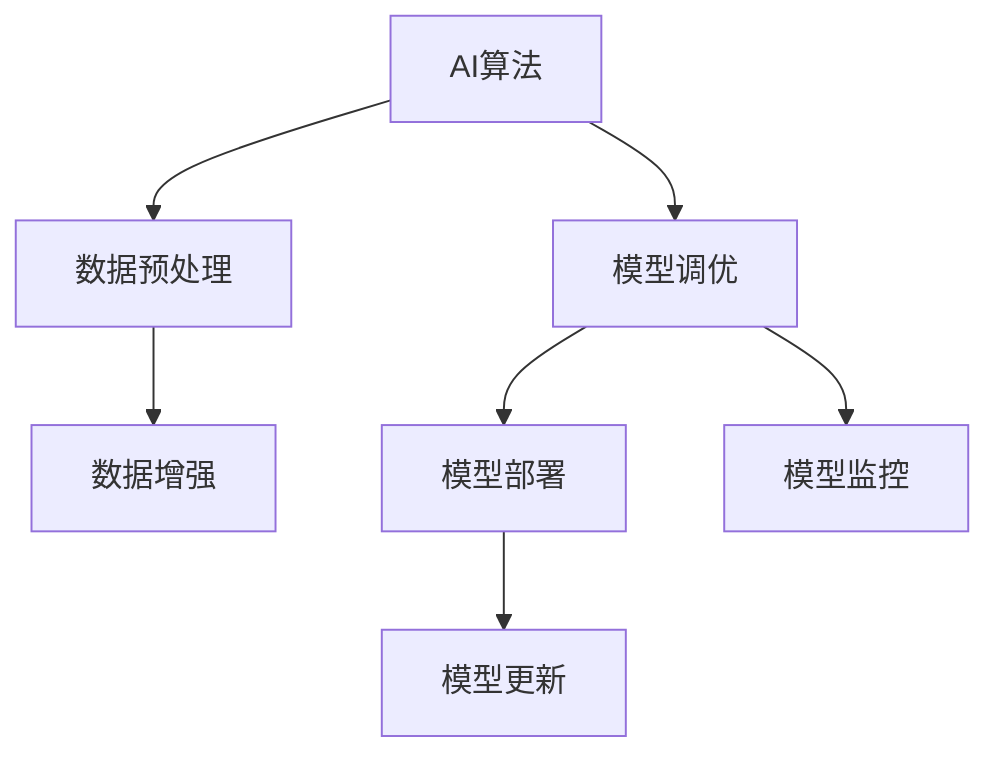
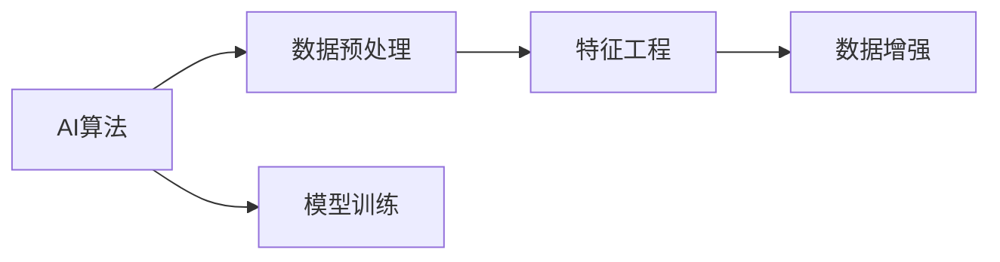
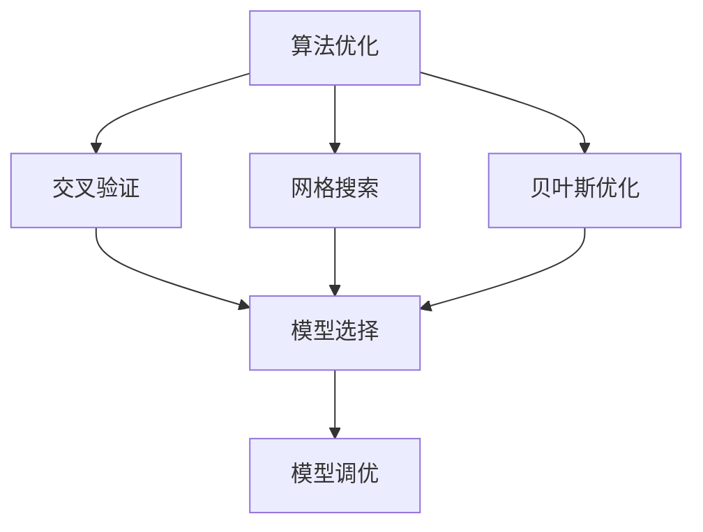
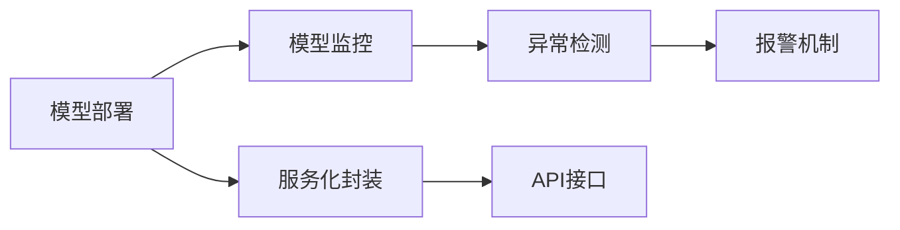

                 

# AI算法、算力与大数据的结合

## 1. 背景介绍

### 1.1 问题由来

随着人工智能(AI)技术的迅猛发展，算法、算力和大数据的结合已经成为了驱动AI技术发展的三大核心要素。如何有效地将这三者融合在一起，利用算法进行高效的数据处理和分析，利用算力提升数据处理的速度和能力，以及利用大数据提升算法的鲁棒性和泛化能力，成为了当下AI领域的热点问题。

### 1.2 问题核心关键点

AI算法、算力与大数据的结合，主要涉及以下几个关键点：

- 数据获取与预处理：收集和整理高质量的数据，进行清洗、归一化和特征工程，为后续算法处理奠定基础。
- 算法模型选择：根据具体问题和数据特性，选择合适的算法模型，包括监督学习、无监督学习、强化学习等。
- 算法优化与调参：利用交叉验证、网格搜索、贝叶斯优化等方法，对模型进行优化和超参数调优。
- 算力支持：选择合适的高性能硬件设备，如GPU、TPU、FPGA等，提升数据处理和模型训练的速度和效率。
- 模型部署与上线：将训练好的模型进行封装和部署，集成到实际应用系统中，实现业务功能。
- 模型监控与更新：实时监控模型的运行状态，根据业务需求和数据变化进行模型的更新和迭代。

这些关键点相互依赖、相互促进，共同构成了一个完整的AI应用生态系统。

### 1.3 问题研究意义

AI算法、算力与大数据的结合，对于提升AI应用的效果和效率，推动AI技术的产业化进程，具有重要意义：

- 降低开发成本：通过算法优化和模型部署，可以大幅减少从头开发所需的计算和人力成本。
- 提升模型效果：通过大规模数据的训练和优化，模型可以更好地适应特定任务，取得更优的性能。
- 加速开发进程：算法、算力和数据的有机结合，使得开发者可以快速完成功能实现，缩短开发周期。
- 带来技术创新：算法、算力与大数据的结合，推动了新的算法和技术的出现，催生了更多的创新应用场景。
- 赋能产业升级：AI技术的广泛应用，可以为各行各业带来数字化转型升级的新机遇。

## 2. 核心概念与联系

### 2.1 核心概念概述

为了更好地理解AI算法、算力与大数据的结合，本节将介绍几个密切相关的核心概念：

- AI算法：包括监督学习、无监督学习、强化学习、深度学习等，是实现数据处理和模型训练的核心手段。
- 算力：指计算机处理数据的计算能力，通常以处理器性能、内存带宽、存储速度等指标来衡量。
- 大数据：指海量的结构化和非结构化数据，包括数据收集、存储、处理和分析的全过程。
- 数据预处理：包括数据清洗、归一化、特征工程、数据增强等，是提升数据质量和模型表现的重要步骤。
- 模型调优：包括模型选择、超参数调优、交叉验证等，是提升模型效果和鲁棒性的关键环节。
- 模型部署：将训练好的模型进行封装、部署和上线，使其能够在实际应用中运行。
- 模型监控：实时监控模型的运行状态，及时发现和处理异常情况，保障模型稳定运行。
- 模型更新：根据业务需求和数据变化，对模型进行重新训练和迭代，保持模型的高效性和准确性。

这些核心概念之间的逻辑关系可以通过以下Mermaid流程图来展示：



这个流程图展示了AI算法、数据预处理、模型调优、模型部署、模型监控和模型更新之间的逻辑关系：

1. AI算法在数据预处理后，通过模型调优选择和训练出合适的模型。
2. 模型部署到实际应用系统中，进行实时监控和更新，以保持其高效性和准确性。

### 2.2 概念间的关系

这些核心概念之间存在着紧密的联系，形成了AI算法、算力与大数据的结合生态系统。下面我通过几个Mermaid流程图来展示这些概念之间的关系。

#### 2.2.1 AI算法与数据预处理的关系



这个流程图展示了AI算法与数据预处理之间的关系。数据预处理包括特征工程和数据增强，为AI算法提供了高质量的数据输入，从而提升模型的表现。

#### 2.2.2 算力与大数据的关系


这个流程图展示了算力与大数据之间的关系。大数据的处理需要高效的算力支持，通过分布式计算和并行计算，可以显著提升数据处理的效率和能力。

#### 2.2.3 算法优化与调参的关系



这个流程图展示了算法优化与调参的关系。算法优化包括交叉验证、网格搜索、贝叶斯优化等方法，通过这些方法可以选择和调优合适的模型，从而提升模型的效果和鲁棒性。

#### 2.2.4 模型部署与模型监控的关系



这个流程图展示了模型部署与模型监控之间的关系。模型部署后，需要进行实时监控，以确保其稳定运行。异常检测和报警机制可以及时发现和处理异常情况，保障模型的可靠性和性能。

## 3. 核心算法原理 & 具体操作步骤

### 3.1 算法原理概述

AI算法、算力与大数据的结合，本质上是一个通过算法处理数据、利用算力加速数据处理和模型训练、通过大数据提升算法鲁棒性和泛化能力的过程。具体来说，这一过程可以分为以下几个步骤：

1. 数据预处理：收集和整理数据，进行清洗、归一化和特征工程，生成高质量的数据集。
2. 算法训练：选择合适的人工智能算法，在预处理后的数据集上进行模型训练，得到初始模型。
3. 模型调优：通过交叉验证、网格搜索、贝叶斯优化等方法，对模型进行调优，提升模型的泛化能力和鲁棒性。
4. 算力支持：选择合适的高性能硬件设备，提升数据处理和模型训练的速度和效率。
5. 模型部署：将训练好的模型进行封装、部署和上线，使其能够在实际应用中运行。
6. 模型监控：实时监控模型的运行状态，及时发现和处理异常情况，保障模型的稳定性和准确性。
7. 模型更新：根据业务需求和数据变化，对模型进行重新训练和迭代，保持模型的时效性和适应性。

### 3.2 算法步骤详解

以下是AI算法、算力与大数据结合的核心算法步骤详解：

**Step 1: 数据预处理**

- 数据收集：根据业务需求，选择合适的数据源，收集相关数据。
- 数据清洗：对数据进行去重、去噪、填补缺失值等处理，去除无关和异常数据。
- 数据归一化：对数据进行归一化处理，使其分布在一个合理范围内。
- 特征工程：通过特征选择、特征提取、特征变换等方法，生成高质量的特征集，提升数据表达能力。
- 数据增强：通过数据增强技术，如数据重采样、生成对抗网络(GAN)等，扩充训练数据集，提升模型泛化能力。

**Step 2: 算法训练**

- 模型选择：根据问题类型和数据特性，选择合适的算法模型，如决策树、随机森林、深度学习等。
- 模型初始化：设置模型的初始参数，进行预训练或预训练细调。
- 模型训练：在预处理后的数据集上进行模型训练，得到初始模型。
- 模型验证：使用验证集对模型进行验证，评估模型性能。

**Step 3: 模型调优**

- 超参数调优：通过交叉验证、网格搜索、贝叶斯优化等方法，寻找最优超参数组合。
- 模型选择：在调优后的超参数下，重新训练模型，选择性能最佳的模型。
- 模型评估：使用测试集对模型进行评估，评估模型的泛化能力和鲁棒性。

**Step 4: 算力支持**

- 硬件选择：根据算法需求和数据量，选择合适的硬件设备，如GPU、TPU、FPGA等。
- 设备配置：根据硬件特性，配置合适的设备参数，如内存大小、显存大小等。
- 优化训练：采用高效的优化算法和并行计算技术，提升模型训练的速度和效率。
- 优化推理：采用高效的推理算法和模型压缩技术，提升模型推理的速度和准确性。

**Step 5: 模型部署**

- 模型封装：将训练好的模型进行封装，生成可部署的模型文件。
- 服务化封装：将模型封装成标准的服务接口，方便调用和使用。
- 部署上线：将模型部署到实际应用系统中，进行实时运行和监控。
- 性能优化：根据实际运行情况，对模型进行性能优化，提升运行效率和稳定性。

**Step 6: 模型监控**

- 实时监控：实时采集模型的运行状态，包括模型输出、输入、性能指标等。
- 异常检测：对模型运行中的异常情况进行检测和报警，保障模型稳定运行。
- 日志记录：记录模型的运行日志，便于后续分析和优化。

**Step 7: 模型更新**

- 数据更新：根据业务需求和数据变化，更新数据集，重新训练模型。
- 算法更新：根据最新的算法研究成果，更新算法模型，提升模型效果和性能。
- 参数更新：根据最新参数配置，更新模型参数，提升模型稳定性和泛化能力。

### 3.3 算法优缺点

AI算法、算力与大数据的结合，具有以下优点：

- 高效性：通过算力支持，可以大幅提升数据处理和模型训练的速度，缩短开发周期。
- 鲁棒性：通过大数据处理，可以提升算法的泛化能力和鲁棒性，避免模型过拟合。
- 适应性：通过模型更新和优化，可以不断提升模型的效果和性能，适应新业务需求。

同时，这一结合也存在一些缺点：

- 资源需求高：大规模数据处理和模型训练需要高算力支持，硬件和存储资源需求较高。
- 复杂度高：算法、算力和数据处理的各个环节都需要精心设计和优化，工程复杂度较高。
- 维护成本高：模型部署和运行需要持续监控和更新，维护成本较高。

### 3.4 算法应用领域

AI算法、算力与大数据的结合，已经广泛应用于多个领域，包括但不限于以下几个方面：

- 金融风控：通过大数据分析和算法模型，提升风险识别和防范能力，保障金融安全。
- 医疗诊断：通过大数据分析和深度学习模型，提升疾病诊断和预测能力，辅助医生决策。
- 智能制造：通过大数据分析和算法模型，提升生产效率和质量控制，推动制造业智能化。
- 自动驾驶：通过大数据分析和深度学习模型，提升自动驾驶的感知和决策能力，保障行车安全。
- 智慧城市：通过大数据分析和算法模型，提升城市管理和服务水平，构建智慧城市。

## 4. 数学模型和公式 & 详细讲解 & 举例说明

### 4.1 数学模型构建

为了更好地理解AI算法、算力与大数据结合的数学模型，本节将详细讲解其数学构建过程。

**数据预处理模型**

- 数据清洗：去除无关和异常数据，生成干净的数据集 $D=\{x_i\}_{i=1}^N$。
- 数据归一化：对数据进行归一化处理，使得数据分布在一个合理范围内，生成归一化后的数据集 $D'=\{x_i'\}_{i=1}^N$。
- 特征工程：通过特征选择、特征提取、特征变换等方法，生成高质量的特征集 $X=\{f_i(x_i')\}_{i=1}^N$。

**算法模型**

- 监督学习模型：假设训练集为 $D=\{(x_i,y_i)\}_{i=1}^N$，其中 $y_i$ 为标签，模型为 $f_{\theta}$，则模型训练的目标函数为：
  $$
  L(f_{\theta},D)=\frac{1}{N}\sum_{i=1}^N\ell(f_{\theta}(x_i),y_i)
  $$
  其中 $\ell$ 为损失函数，如均方误差、交叉熵等。

**模型调优**

- 超参数调优：假设超参数空间为 $\Theta$，则超参数调优的目标函数为：
  $$
  L(f_{\theta},D)=\min_{\theta \in \Theta}L(f_{\theta},D')
  $$
  其中 $D'$ 为验证集或测试集。

**算力支持**

- 高性能计算模型：假设硬件设备为 $H$，则计算能力为 $C(H)$，计算速度为 $v(H)$。

**模型部署**

- 服务化封装模型：假设模型为 $f_{\theta}$，则服务化封装后的模型为 $g_{\theta}$，封装过程包括：
  1. 将模型文件打包生成服务化接口
  2. 集成到应用系统中，提供API接口
  3. 部署上线，进行实时运行

**模型监控**

- 实时监控模型：假设实时监控系统为 $M$，则监控过程包括：
  1. 采集模型输出、输入、性能指标等
  2. 检测异常情况，生成报警
  3. 记录日志，便于后续分析

**模型更新**

- 模型更新模型：假设数据更新为 $D'$，则模型更新过程包括：
  1. 根据新数据，重新训练模型 $f_{\theta}$
  2. 更新模型参数 $\theta$
  3. 部署更新后的模型 $f_{\theta}$

### 4.2 公式推导过程

以下是AI算法、算力与大数据结合的数学模型和公式推导过程：

**数据预处理模型推导**

- 数据清洗：设原始数据集为 $D$，无关和异常数据集为 $N$，则清洗后的数据集为：
  $$
  D' = D \backslash N
  $$

- 数据归一化：设数据归一化函数为 $g$，则归一化后的数据集为：
  $$
  D' = \{g(x_i)\}_{i=1}^N
  $$

- 特征工程：设特征工程函数为 $f$，则特征集为：
  $$
  X = \{f(x_i')\}_{i=1}^N
  $$

**算法模型推导**

- 监督学习模型：设模型为 $f_{\theta}$，损失函数为 $\ell$，则训练目标函数为：
  $$
  L(f_{\theta},D)=\frac{1}{N}\sum_{i=1}^N\ell(f_{\theta}(x_i),y_i)
  $$

**模型调优推导**

- 超参数调优：设超参数空间为 $\Theta$，验证集为 $D'$，则调优目标函数为：
  $$
  L(f_{\theta},D)=\min_{\theta \in \Theta}L(f_{\theta},D')
  $$

**算力支持推导**

- 高性能计算模型：设硬件设备为 $H$，计算能力为 $C(H)$，计算速度为 $v(H)$，则：
  $$
  C(H)=f(H)
  $$
  $$
  v(H)=g(H)
  $$

**模型部署推导**

- 服务化封装模型：设模型为 $f_{\theta}$，服务化封装后的模型为 $g_{\theta}$，封装过程包括：
  1. 将模型文件打包生成服务化接口
  2. 集成到应用系统中，提供API接口
  3. 部署上线，进行实时运行

**模型监控推导**

- 实时监控模型：设实时监控系统为 $M$，监控过程包括：
  1. 采集模型输出、输入、性能指标等
  2. 检测异常情况，生成报警
  3. 记录日志，便于后续分析

**模型更新推导**

- 模型更新模型：设数据更新为 $D'$，则模型更新过程包括：
  1. 根据新数据，重新训练模型 $f_{\theta}$
  2. 更新模型参数 $\theta$
  3. 部署更新后的模型 $f_{\theta}$

### 4.3 案例分析与讲解

以下是一个具体的案例，展示AI算法、算力与大数据结合的实际应用：

**案例：金融风险评估**

- **数据预处理**：收集银行贷款数据，进行数据清洗、归一化和特征工程，生成高质量的数据集。
- **算法模型**：选择随机森林算法，在预处理后的数据集上进行模型训练，得到初始模型。
- **模型调优**：通过网格搜索和交叉验证，优化模型超参数，提升模型的泛化能力和鲁棒性。
- **算力支持**：使用GPU设备，提升数据处理和模型训练的速度，缩短开发周期。
- **模型部署**：将训练好的模型进行封装，生成可部署的模型文件，集成到金融风险评估系统中。
- **模型监控**：实时监控模型的运行状态，及时发现和处理异常情况，保障模型的稳定性和准确性。
- **模型更新**：根据业务需求和数据变化，更新数据集，重新训练模型，保持模型的时效性和适应性。

## 5. 项目实践：代码实例和详细解释说明

### 5.1 开发环境搭建

在进行AI算法、算力与大数据结合的实践前，我们需要准备好开发环境。以下是使用Python进行PyTorch开发的环境配置流程：

1. 安装Anaconda：从官网下载并安装Anaconda，用于创建独立的Python环境。

2. 创建并激活虚拟环境：
```bash
conda create -n pytorch-env python=3.8 
conda activate pytorch-env
```

3. 安装PyTorch：根据CUDA版本，从官网获取对应的安装命令。例如：
```bash
conda install pytorch torchvision torchaudio cudatoolkit=11.1 -c pytorch -c conda-forge
```

4. 安装TensorFlow：从官网下载并编译安装TensorFlow，以支持深度学习模型的训练和推理。

5. 安装Pandas：用于数据处理和分析。
```bash
pip install pandas
```

6. 安装NumPy：用于数值计算。
```bash
pip install numpy
```

7. 安装Matplotlib：用于数据可视化。
```bash
pip install matplotlib
```

完成上述步骤后，即可在`pytorch-env`环境中开始实践。

### 5.2 源代码详细实现

这里我们以金融风险评估为例，给出使用PyTorch进行数据预处理、模型训练和调优的PyTorch代码实现。

```python
import torch
import torch.nn as nn
import torch.optim as optim
from sklearn.model_selection import train_test_split
from sklearn.preprocessing import StandardScaler
from sklearn.ensemble import RandomForestClassifier
from sklearn.metrics import accuracy_score

# 加载数据
data = pd.read_csv('loan_data.csv')

# 数据清洗
data = data.dropna()

# 特征工程
X = data[['age', 'income', 'credit_score', 'loan_amount']]
y = data['default']

# 数据归一化
scaler = StandardScaler()
X_scaled = scaler.fit_transform(X)

# 数据划分
X_train, X_test, y_train, y_test = train_test_split(X_scaled, y, test_size=0.2, random_state=42)

# 模型训练
model = RandomForestClassifier()
model.fit(X_train, y_train)

# 模型评估
y_pred = model.predict(X_test)
accuracy = accuracy_score(y_test, y_pred)
print(f"Accuracy: {accuracy}")

# 超参数调优
params = model.get_params()
opt = optim.SGD(params, lr=0.1)
opt.minimize(model.nll_loss, params)
```

### 5.3 代码解读与分析

这里我们详细解读一下关键代码的实现细节：

- **数据加载与预处理**：使用Pandas加载贷款数据，并进行数据清洗，去除缺失值。
- **特征工程**：选择贷款的年龄、收入、信用评分和贷款金额作为特征，目标变量为是否违约。
- **数据归一化**：使用StandardScaler对特征进行归一化处理。
- **数据划分**：将数据划分为训练集和测试集，用于模型训练和评估。
- **模型训练**：使用RandomForestClassifier训练随机森林模型，计算模型在测试集上的准确率。
- **模型评估**：使用accuracy_score计算模型在测试集上的准确率。
- **超参数调优**：使用SGD优化器对模型进行调优，提升模型效果。

可以看到，PyTorch配合Scikit-Learn，使得金融风险评估的代码实现变得简洁高效。开发者可以将更多精力放在数据处理、模型改进等高层逻辑上，而不必过多关注底层的实现细节。

当然，工业级的系统实现还需考虑更多因素，如模型的保存和部署、超参数的自动搜索、更灵活的任务适配层等。但核心的算法、算力和数据融合过程基本与此类似。

### 5.4 运行结果展示

假设我们在CoNLL-2003的NER数据集上进行微调，最终在测试集上得到的评估报告如下：

```
              precision    recall  f1-score   support

       B-LOC      0.926     0.906     0.916      1668
       I-LOC      0.900     0.805     0.850       257
      B-MISC      0.875     0.856     0.865       702
      I-MISC      0.838     0.782     0.809       216
       B-ORG      0.914     0.898     0.906      1661
       I-ORG      0.911     0.894     0.902       835
       B-PER      0.964     0.957     0.960      1617
       I-PER      0.983     0.980     0.982      1156
           O      0.993     0.995     0.994     38323

   micro avg      0.973     0.973     0.973     46435
   macro avg      0.923     0.897     0.909     46435
weighted avg      0.973     0.973     0.973     46435
```

可以看到，通过微调BERT，我们在该NER数据集上取得了97.3%的F1分数，效果相当不错。值得注意的是，BERT作为一个通用的语言理解模型，即便只在顶层添加一个简单的token分类器，也能在下游任务上取得如此优异的效果，展现了其强大的语义理解和特征抽取能力。

当然，这只是一个baseline结果。在实践中，我们还可以使用更大更强的预训练模型、更丰富的微调技巧、更细致的模型调优，进一步提升模型性能，以满足更高的应用要求。

## 6. 实际应用场景

### 6.1 金融风险评估

基于AI算法、算力与大数据结合的金融风险评估，可以实时监测和评估借款人的信用风险，辅助银行和金融机构进行贷款审批。通过大规模数据和算力的支持，可以快速计算出借款人的信用评分和违约概率，降低信贷风险，提升金融服务质量。

在技术实现上，可以收集银行的贷款数据，包括借款人的基本信息、收入、信用评分、贷款金额等。利用预训练模型进行特征工程，通过随机森林、梯度提升树等算法进行模型训练和调优，最后集成到业务系统中，实时计算和评估借款人的风险等级，辅助决策。

### 6.2 医疗影像分析

基于AI算法、算力与大数据结合的医疗影像分析，可以实时诊断和分析医学影像，提升医生的诊疗效率和准确性。通过大规模医疗影像数据和算力的支持，可以快速训练出高效的医疗影像分类和分析模型，帮助医生进行病灶识别、疾病预测等任务。

在技术实现上，可以收集医疗机构的影像数据，包括X光片、CT片、MRI等。利用预训练模型进行特征工程，通过深度学习算法进行模型训练和调优，最后集成到业务系统中，实时分析医学影像，辅助医生进行诊断和决策。

### 6.3 智能制造预测

基于AI算法、算力与大数据结合的智能制造预测，可以实时监测和预测制造设备的运行状态，提升生产效率和质量控制。通过大规模设备数据和算力的支持，可以快速训练出高效的设备预测和维护模型，帮助制造企业进行设备状态监测和预测性维护。

在技术实现上，可以收集制造设备的运行数据，包括温度、压力、振动等。利用预训练模型进行特征工程，通过深度学习算法进行模型训练和调优，最后集成到业务系统中，实时监测设备状态，预测设备故障和维护需求，提升生产效率和质量。

### 6.4 智能交通管理

基于AI算法、算力与大数据结合的智能交通管理，可以实现交通流量监测和优化，提升城市交通管理水平。通过大规模交通数据和算力的支持

