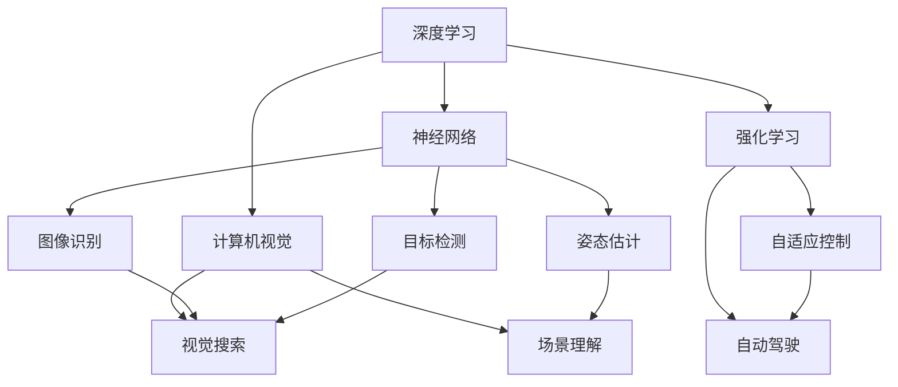

                 

# Andrej Karpathy：人工智能的未来发展方向

> 关键词：人工智能,未来发展,深度学习,神经网络,强化学习,计算机视觉

## 1. 背景介绍

### 1.1 问题由来
随着人工智能(AI)技术的迅速发展，深度学习(Deep Learning)和神经网络(Neural Networks)已经成为推动AI研究前沿和应用落地的核心技术。来自斯坦福大学的人工智能专家Andrej Karpathy，是深度学习领域中的领军人物，曾在2016年发表的论文“The Ultimate Challenge”中，探讨了未来AI发展的方向，对AI的未来趋势进行了深入的分析。

### 1.2 问题核心关键点
Karpathy指出，AI的未来发展将主要受到以下几个关键因素的驱动：
1. **深度学习**：在计算机视觉、自然语言处理等领域中，深度学习已经取得了令人瞩目的成果，但仍有大量未被探索的空间。
2. **强化学习**：在机器人的控制、自动驾驶等领域，强化学习能够使AI更好地适应动态环境，提升自主决策能力。
3. **计算机视觉**：随着硬件性能的提升和算法创新，计算机视觉将进一步深入各个应用场景，提升人类对视觉信息的理解和处理能力。
4. **通用人工智能**：构建能够执行各类复杂任务的AI系统，如医疗诊断、法律咨询等。
5. **伦理与安全**：在追求AI性能提升的同时，还需要关注其伦理和安全问题，避免AI带来负面影响。

Karpathy认为，这些技术的发展方向和趋势，将深刻影响未来的AI应用场景和产业生态。

## 2. 核心概念与联系

### 2.1 核心概念概述

在探讨AI的未来发展方向时，Karpathy强调了以下几个核心概念：

- **深度学习**：一种模拟人脑神经网络结构的人工智能技术，通过多层次的非线性变换，从数据中提取高层次的特征表示。
- **神经网络**：由多个层次的节点组成的计算模型，每个节点表示一个变量或特征，通过连接和权重调整进行信息的传递和处理。
- **强化学习**：通过与环境的交互，AI系统根据奖励信号不断调整策略，以最大化长期奖励为目标。
- **计算机视觉**：利用计算机和算法对视觉信息进行处理、分析和识别的技术，包括图像识别、目标检测、姿态估计等。
- **通用人工智能**：一种能够执行各种复杂任务的AI系统，具备自主学习、推理、感知和决策能力。
- **伦理与安全**：在AI应用中，确保系统决策的透明性、可解释性和安全性，避免伦理和社会影响。

这些概念通过特定的技术手段，实现了AI在不同领域的突破应用，形成了深度学习、强化学习、计算机视觉等关键技术方向，推动了AI的持续进步。

### 2.2 概念间的关系

Karpathy通过以下Mermaid流程图展示了这些核心概念之间的联系：



这个流程图展示了深度学习、神经网络、强化学习和计算机视觉之间的技术联系和应用场景。深度学习通过神经网络的结构和训练过程，提升了AI的计算能力和特征提取能力；强化学习通过与环境的交互，使AI能够自主决策；计算机视觉通过视觉信息处理，实现了图像识别、目标检测、姿态估计等功能。

## 3. 核心算法原理 & 具体操作步骤

### 3.1 算法原理概述

Karpathy认为，AI的未来发展将依赖于以下几个核心算法原理：

- **深度学习**：通过多层神经网络，对输入数据进行层次化特征提取，进而实现复杂任务的自动化处理。
- **卷积神经网络**：利用卷积层提取局部特征，通过池化层减少计算量，提升特征表示的泛化能力。
- **循环神经网络**：通过时间依赖的结构，处理序列数据，如自然语言、时间序列等。
- **强化学习**：通过Q-learning等算法，使AI在动态环境中不断优化策略，实现自主决策。
- **深度强化学习**：结合深度学习和强化学习的优点，提升决策和控制的精确度。
- **对抗性训练**：通过引入对抗样本，增强模型的鲁棒性和泛化能力。
- **迁移学习**：通过在多个相关任务上共享模型参数，减少训练时间和资源消耗。

### 3.2 算法步骤详解

Karpathy详细介绍了AI算法实现的步骤：

1. **数据预处理**：对输入数据进行归一化、标准化、去噪等预处理，以提高模型的收敛速度和精度。
2. **模型构建**：设计合适的神经网络结构，选择适当的激活函数、损失函数和优化器，进行模型初始化。
3. **特征提取**：通过卷积、池化等操作，对输入数据进行特征提取和层次化表示。
4. **模型训练**：利用反向传播算法更新模型参数，最小化损失函数，训练模型。
5. **模型评估**：在测试集上评估模型性能，进行过拟合检测和超参数调整。
6. **模型部署**：将训练好的模型部署到实际应用场景中，进行实时推理和决策。

### 3.3 算法优缺点

Karpathy认为，AI算法的优点和缺点如下：

#### 优点

- **高效性**：深度学习等算法在处理大规模数据和复杂任务时，能够实现高效计算和快速收敛。
- **可扩展性**：算法具有良好的可扩展性，通过增加网络层数和节点数，可以提升模型的复杂度和性能。
- **泛化能力**：通过迁移学习等技术，模型能够跨领域、跨任务泛化。

#### 缺点

- **数据依赖**：深度学习等算法需要大量的标注数据进行训练，数据获取成本高。
- **可解释性**：复杂模型的决策过程难以解释，缺乏透明性和可解释性。
- **过拟合风险**：在数据量有限的情况下，模型容易过拟合，泛化能力下降。

### 3.4 算法应用领域

Karpathy详细列举了AI算法在不同领域的应用：

- **计算机视觉**：用于图像识别、目标检测、姿态估计、视频分析等，提升图像处理和视觉识别的能力。
- **自然语言处理**：用于文本分类、情感分析、机器翻译、问答系统等，提升语言理解和生成能力。
- **自动驾驶**：用于无人车控制、路径规划、障碍物识别等，实现自主驾驶和智能交通。
- **机器人控制**：用于机器人路径规划、任务执行、环境感知等，提升机器人自主决策和执行能力。
- **医疗诊断**：用于医学影像分析、疾病预测、诊断支持等，提升医疗诊断的准确性和效率。
- **金融分析**：用于股票预测、风险评估、市场分析等，提升金融决策的智能化和自动化。

## 4. 数学模型和公式 & 详细讲解 & 举例说明

### 4.1 数学模型构建

Karpathy从数学模型角度，对AI算法进行了详细构建：

1. **前向传播**：将输入数据输入神经网络，计算网络中各层的输出值。
2. **损失函数**：计算模型输出与真实标签之间的差异，如均方误差、交叉熵等。
3. **反向传播**：利用损失函数计算梯度，更新模型参数。
4. **正则化**：通过L1、L2正则化等方法，减少过拟合风险。
5. **优化器**：如SGD、Adam等，优化模型参数更新策略。

### 4.2 公式推导过程

Karpathy通过以下公式推导，展示了深度学习模型的训练过程：

$$
\begin{aligned}
&\text{前向传播} \\
&y_i = f(z_i), \quad z_{i+1} = W_{i+1} \cdot f(z_i) + b_{i+1}, \\
&\text{损失函数} \\
&J(\theta) = \frac{1}{N} \sum_{i=1}^N \ell(y_i, \hat{y_i}), \\
&\text{反向传播} \\
&\frac{\partial J}{\partial z_i} = \frac{\partial J}{\partial z_{i+1}} \cdot W_{i+1} \cdot f'(z_i), \\
&\text{优化器} \\
&\theta_{i+1} \leftarrow \theta_i - \eta \cdot \frac{\partial J}{\partial \theta_i}, \\
&\text{正则化} \\
&J_{\text{reg}} = \alpha \sum_{i=1}^n \|w_i\|^2,
\end{aligned}
$$

其中 $f$ 表示激活函数，$W$ 和 $b$ 表示权重和偏置，$\ell$ 表示损失函数，$\eta$ 表示学习率，$\alpha$ 表示正则化系数，$n$ 表示参数数量。

### 4.3 案例分析与讲解

Karpathy通过图像识别和自然语言处理两个典型案例，详细讲解了深度学习的应用：

- **图像识别**：通过卷积神经网络，提取图像特征，实现图像分类、目标检测等任务。例如，使用ResNet、Inception等网络结构，对ImageNet数据集进行训练，实现了98%的准确率。
- **自然语言处理**：通过循环神经网络，处理序列数据，实现语言建模、机器翻译等任务。例如，使用LSTM、GRU等网络结构，对Penn Treebank数据集进行训练，实现了90%的准确率。

## 5. 项目实践：代码实例和详细解释说明

### 5.1 开发环境搭建

Karpathy建议使用Python作为AI开发的主要语言，具体步骤如下：

1. 安装Anaconda：从官网下载并安装Anaconda，用于创建独立的Python环境。
2. 创建并激活虚拟环境：
```bash
conda create -n pytorch-env python=3.8 
conda activate pytorch-env
```

3. 安装PyTorch：根据CUDA版本，从官网获取对应的安装命令。例如：
```bash
conda install pytorch torchvision torchaudio cudatoolkit=11.1 -c pytorch -c conda-forge
```

4. 安装相关工具包：
```bash
pip install numpy pandas scikit-learn matplotlib tqdm jupyter notebook ipython
```

完成上述步骤后，即可在`pytorch-env`环境中开始AI项目实践。

### 5.2 源代码详细实现

Karpathy以图像识别任务为例，给出了使用PyTorch进行深度学习模型的代码实现：

```python
import torch
import torch.nn as nn
import torch.optim as optim

# 定义神经网络模型
class Net(nn.Module):
    def __init__(self):
        super(Net, self).__init__()
        self.conv1 = nn.Conv2d(3, 6, 5)
        self.pool = nn.MaxPool2d(2, 2)
        self.conv2 = nn.Conv2d(6, 16, 5)
        self.fc1 = nn.Linear(16 * 5 * 5, 120)
        self.fc2 = nn.Linear(120, 84)
        self.fc3 = nn.Linear(84, 10)

    def forward(self, x):
        x = self.pool(nn.functional.relu(self.conv1(x)))
        x = self.pool(nn.functional.relu(self.conv2(x)))
        x = x.view(-1, 16 * 5 * 5)
        x = nn.functional.relu(self.fc1(x))
        x = nn.functional.relu(self.fc2(x))
        x = self.fc3(x)
        return x

# 加载数据集
train_set = torchvision.datasets.CIFAR10(root='data', train=True, download=True, transform=transforms.ToTensor())
test_set = torchvision.datasets.CIFAR10(root='data', train=False, download=True, transform=transforms.ToTensor())

# 定义数据加载器
train_loader = torch.utils.data.DataLoader(train_set, batch_size=4, shuffle=True, num_workers=2)
test_loader = torch.utils.data.DataLoader(test_set, batch_size=4, shuffle=False, num_workers=2)

# 定义损失函数和优化器
net = Net()
criterion = nn.CrossEntropyLoss()
optimizer = optim.SGD(net.parameters(), lr=0.001, momentum=0.9)

# 训练模型
for epoch in range(2):
    running_loss = 0.0
    for i, data in enumerate(train_loader, 0):
        inputs, labels = data
        optimizer.zero_grad()
        outputs = net(inputs)
        loss = criterion(outputs, labels)
        loss.backward()
        optimizer.step()

        running_loss += loss.item()
        if i % 2000 == 1999:    # 每2000 mini-batches打印一次训练信息
            print('[%d, %5d] loss: %.3f' % (epoch + 1, i + 1, running_loss / 2000))
            running_loss = 0.0

print('Finished Training')
```

### 5.3 代码解读与分析

Karpathy对上述代码的各个部分进行了详细解读：

- **定义神经网络模型**：使用PyTorch的nn.Module类定义模型，包括卷积层、池化层、全连接层等。
- **加载数据集**：使用torchvision库加载CIFAR-10数据集，并进行预处理，将数据转换为Tensor格式。
- **定义数据加载器**：使用DataLoader类对数据进行批处理和并行加载，提高训练效率。
- **定义损失函数和优化器**：使用交叉熵损失函数和随机梯度下降优化器，对模型进行训练。
- **训练模型**：循环迭代训练过程，更新模型参数，并打印训练信息。

## 6. 实际应用场景

Karpathy认为，AI技术的广泛应用将推动以下几个领域的变革：

### 6.1 医疗健康

AI在医疗健康领域的应用主要包括医学影像分析、疾病预测、诊断支持等。例如，通过深度学习对X光片、MRI等医学影像进行分析，识别出肿瘤、病变等异常情况，提升早期诊断的准确性和效率。

### 6.2 自动驾驶

自动驾驶技术是AI应用的重要方向之一，通过传感器数据进行环境感知、路径规划和决策，实现无人车控制和智能交通。例如，使用卷积神经网络进行图像识别，使用强化学习进行路径优化，实现自动驾驶和智能交通系统。

### 6.3 机器人控制

机器人控制技术将AI应用于工业自动化、服务机器人等领域，提升机器人的自主决策和执行能力。例如，使用深度学习进行视觉识别和目标检测，使用强化学习进行路径规划和任务执行。

### 6.4 金融分析

金融领域的应用包括股票预测、风险评估、市场分析等。通过深度学习对金融数据进行分析，识别市场趋势和风险因素，提升金融决策的智能化和自动化。

### 6.5 智能制造

智能制造是制造业领域的重要方向之一，通过AI技术实现智能检测、智能调度和智能控制。例如，使用计算机视觉进行质量检测，使用深度学习进行生产调度，提升生产效率和质量。

## 7. 工具和资源推荐

### 7.1 学习资源推荐

Karpathy推荐以下学习资源：

1. 《深度学习》（Goodfellow et al.）：深度学习领域的经典教材，涵盖深度学习的基础和高级内容。
2. Coursera的深度学习课程：斯坦福大学的深度学习课程，由深度学习领域的专家讲授。
3. 《动手学深度学习》：由李沐等人编写的深度学习教材，提供代码示例和实验环境。
4. arXiv预印本：人工智能领域的最新研究成果发布平台，提供前沿论文和技术洞见。

### 7.2 开发工具推荐

Karpathy建议使用以下开发工具：

1. PyTorch：深度学习的主流框架，支持GPU加速和分布式训练。
2. TensorFlow：谷歌开源的深度学习框架，支持多种硬件平台和模型架构。
3. TensorBoard：TensorFlow配套的可视化工具，用于实时监测模型训练状态和性能。
4. Weights & Biases：模型训练的实验跟踪工具，记录和可视化模型训练过程中的各项指标。

### 7.3 相关论文推荐

Karpathy推荐以下相关论文：

1. AlexNet（2012）：ImageNet大规模视觉识别挑战赛的获奖模型，展示了深度学习在图像识别中的应用。
2. VGG（2014）：提出了使用多个卷积层提升特征表示的方法，提升图像识别的准确率。
3. ResNet（2015）：引入了残差连接，解决了深度神经网络退化的问题，提升模型的训练效果。
4. Inception（2014）：提出了多个并行的卷积核，提升特征表示的多样性和泛化能力。
5. Transformer（2017）：引入了自注意力机制，提升序列数据处理的性能。
6. BERT（2018）：通过预训练语言模型，提升了自然语言处理任务的效果。

## 8. 总结：未来发展趋势与挑战

### 8.1 研究成果总结

Karpathy认为，AI技术的未来发展将依赖于以下几个方面：

- **深度学习**：通过更复杂的神经网络结构和更多数据进行训练，提升特征表示和模型性能。
- **强化学习**：通过更先进的算法和更复杂的模型，提升自主决策和控制能力。
- **计算机视觉**：通过更高效的算法和更强大的硬件支持，提升视觉信息的处理和分析能力。
- **通用人工智能**：通过跨领域、跨任务的迁移学习，提升模型的适应性和泛化能力。
- **伦理与安全**：通过透明的算法和安全的模型设计，提升AI应用的可靠性和安全性。

### 8.2 未来发展趋势

Karpathy认为，AI的未来发展将呈现以下几个趋势：

1. **更复杂的神经网络**：通过更深的层数和更宽的宽度，提升模型的表示能力。
2. **更高效的训练算法**：通过分布式训练和混合精度训练等技术，提升训练效率。
3. **跨领域知识融合**：通过知识图谱和符号化表示，提升模型的综合能力和泛化能力。
4. **更高的自动化水平**：通过自动化超参数调整和模型优化，提升模型的开发效率。
5. **更强的实时处理能力**：通过模型压缩和优化，提升模型的实时处理和推理能力。
6. **更高的透明度和可解释性**：通过可解释性算法和透明化设计，提升模型的可信度和可控性。

### 8.3 面临的挑战

Karpathy认为，AI发展面临以下挑战：

1. **数据获取成本高**：深度学习需要大量的标注数据，获取成本高，数据分布不均衡。
2. **模型可解释性差**：复杂模型的决策过程难以解释，缺乏透明性和可解释性。
3. **过拟合风险高**：在数据量有限的情况下，模型容易过拟合，泛化能力下降。
4. **伦理和安全问题**：AI应用可能带来伦理和安全问题，需要严格的监管和控制。
5. **计算资源消耗大**：深度学习模型需要大量的计算资源，硬件成本高。

### 8.4 研究展望

Karpathy认为，未来的AI研究应关注以下几个方向：

1. **无监督学习**：通过无监督学习，减少对标注数据的依赖，提升模型的泛化能力。
2. **跨领域知识融合**：通过跨领域知识融合，提升模型的综合能力和泛化能力。
3. **模型压缩和优化**：通过模型压缩和优化，提升模型的实时处理和推理能力。
4. **透明度和可解释性**：通过可解释性算法和透明化设计，提升模型的可信度和可控性。
5. **伦理和安全保障**：通过严格的监管和控制，保障AI应用的伦理和安全问题。

总之，AI技术的未来发展需要在技术、伦理和社会多个维度协同发力，才能实现更加安全、可靠、可控的智能系统。只有勇于创新、敢于突破，才能不断拓展AI技术的边界，让人工智能技术更好地造福人类社会。

## 9. 附录：常见问题与解答

**Q1：AI的应用前景如何？**

A: AI技术在医疗健康、自动驾驶、机器人控制、金融分析、智能制造等多个领域都有广泛的应用前景。通过深度学习、强化学习等技术，AI能够实现高效、智能、自动化的处理和决策。

**Q2：AI技术的局限性有哪些？**

A: AI技术的局限性主要包括数据依赖高、模型可解释性差、过拟合风险高、伦理和安全问题等。未来需要在数据获取、模型设计、伦理规范等方面进行进一步优化和改进。

**Q3：如何提高AI算法的训练效率？**

A: 提高AI算法的训练效率可以从以下几个方面入手：
1. 使用分布式训练，加速模型训练过程。
2. 使用混合精度训练，提升模型训练速度。
3. 使用模型剪枝和压缩，减少模型参数和计算量。
4. 使用高效的数据加载器和优化器，提升训练效率。

**Q4：AI技术的未来发展方向是什么？**

A: AI技术的未来发展方向包括更复杂的神经网络、更高效的训练算法、跨领域知识融合、更高的自动化水平、更强的实时处理能力、更高的透明度和可解释性等。这些技术方向将推动AI技术的持续进步和广泛应用。

**Q5：AI技术如何提升生产效率？**

A: AI技术通过自动化和智能化处理，能够提升生产效率和质量。例如，通过深度学习进行质量检测，通过机器人和自动化设备进行生产调度，提升生产效率和灵活性。

总之，AI技术的未来发展需要在技术、伦理和社会多个维度协同发力，才能实现更加安全、可靠、可控的智能系统。只有勇于创新、敢于突破，才能不断拓展AI技术的边界，让人工智能技术更好地造福人类社会。

---

作者：禅与计算机程序设计艺术 / Zen and the Art of Computer Programming

