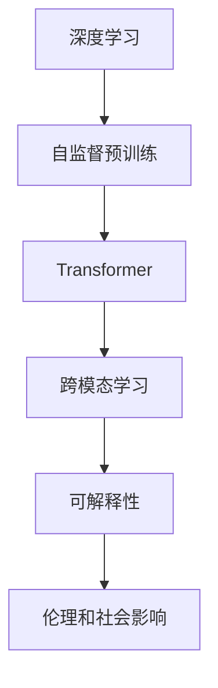
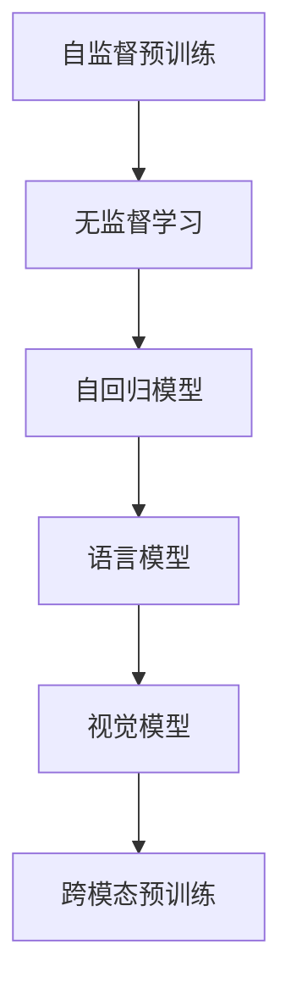
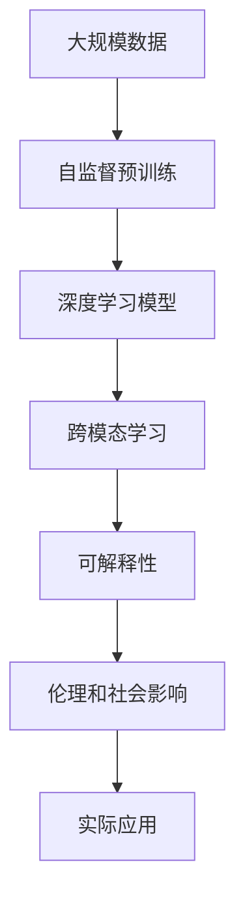

                 

## 1. 背景介绍

### 1.1 问题由来
在过去十年中，人工智能(AI)特别是深度学习取得了巨大的突破，显著推动了计算机视觉、自然语言处理、语音识别等领域的进展。然而，随着算力的提升和数据的爆炸式增长，AI的研究方向开始从关注模型规模和参数量转向更复杂的算法和架构，如Transformer、自监督预训练等。

Andrej Karpathy，作为Stanford大学的AI研究者，同时也是特斯拉的自动驾驶工程师，对AI的未来发展有着独到的见解。他的研究不仅涵盖了AI的核心技术，还关注AI在现实世界中的应用，以及AI技术对社会的影响。

本文将基于Andrej Karpathy的研究和演讲内容，探讨未来AI技术的发展方向，及其对社会和个人的影响。

### 1.2 问题核心关键点
未来AI技术的发展，将在以下几个方面取得重要进展：

- **模型复杂度和规模**：模型将继续朝着更大规模、更高复杂度的方向发展，以增强模型的表示能力和泛化能力。
- **跨模态学习**：AI技术将扩展到多模态数据融合，包括文本、图像、声音等，以提升系统的综合理解能力。
- **可解释性**：增强AI模型的可解释性，以更好地理解其决策过程，提升公众信任度。
- **伦理和社会影响**：AI技术的进步将引发一系列伦理和社会问题，如隐私保护、就业替代、偏见和歧视等。

理解这些关键点，将有助于我们把握AI未来的发展趋势，从而更好地应对其带来的挑战和机遇。

### 1.3 问题研究意义
研究Andrej Karpathy对AI未来发展的观点，对于指导AI技术的研究方向、推动AI技术的产业化进程、以及确保AI技术的社会责任具有重要意义：

- 指导研究方向：了解Karpathy的研究和思考，可以为未来的AI研究提供方向性的指导，帮助研究人员聚焦于更有潜力的技术。
- 推动产业化：AI技术的成功落地应用，需要结合实际需求进行优化，Karpathy的演讲提供了丰富的应用场景和实践经验。
- 确保社会责任：AI技术的发展将对社会产生深远影响，Karpathy对AI伦理和社会影响的关注，有助于引导AI技术的健康发展，确保其服务于人类社会的福祉。

## 2. 核心概念与联系

### 2.1 核心概念概述

为更好地理解Andrej Karpathy的AI发展策略，本节将介绍几个密切相关的核心概念：

- **深度学习(Deep Learning)**：基于神经网络的机器学习技术，能够自动学习复杂模式，广泛应用于计算机视觉、自然语言处理等领域。
- **自监督预训练(Self-supervised Pre-training)**：在无标签数据上通过自监督任务训练模型，使其学习通用的语言或视觉特征，广泛应用于预训练语言模型和视觉模型。
- **Transformer**：一种基于自注意力机制的神经网络架构，因其高效的计算能力和强大的表示能力，成为深度学习中的重要工具。
- **跨模态学习(Cross-modal Learning)**：结合不同模态的数据，如文本、图像、声音等，提升模型的综合理解能力。
- **可解释性(Interpretability)**：提升AI模型的可解释性，使模型决策过程透明，便于理解和调试。
- **伦理和社会影响(Ethical and Social Impact)**：关注AI技术在实际应用中的伦理问题和社会影响，确保技术的健康发展。

这些核心概念之间的逻辑关系可以通过以下Mermaid流程图来展示：



这个流程图展示了大规模AI技术的主要研究方向和技术工具，以及它们之间的逻辑关系。

### 2.2 概念间的关系

这些核心概念之间存在着紧密的联系，形成了未来AI技术的研究框架。下面我通过几个Mermaid流程图来展示这些概念之间的关系。

#### 2.2.1 深度学习的发展范式


这个流程图展示了深度学习从卷积神经网络、循环神经网络到Transformer的发展脉络，每个阶段的进步都显著提升了模型的性能。

#### 2.2.2 自监督预训练与Transformer的关系



这个流程图展示了自监督预训练在深度学习中的应用，从无监督学习开始，通过自回归模型和自编码器等技术，逐渐发展为语言模型和视觉模型，并进一步拓展到跨模态预训练。

#### 2.2.3 跨模态学习的应用场景


这个流程图展示了跨模态学习在不同模态组合中的应用，从图像和文本的结合，到语音和文本的结合，再到视频和文本的结合，展示了其应用范围的广泛性。

#### 2.2.4 可解释性的重要性


这个流程图展示了可解释性的重要性，从决策透明开始，通过可解释算法和可解释模型，最终达到增强公众信任度的目的。

#### 2.2.5 伦理和社会影响的研究内容


这个流程图展示了伦理和社会影响的研究内容，从隐私保护开始，通过就业替代和偏见和歧视等具体问题，探讨AI技术的广泛影响。

### 2.3 核心概念的整体架构

最后，我们用一个综合的流程图来展示这些核心概念在未来AI技术研究中的应用：



这个综合流程图展示了从数据预处理到实际应用的全过程，大模型通过自监督预训练学习到通用的特征表示，然后通过深度学习模型和跨模态学习进行特定任务的建模，增强模型的可解释性，并考虑到伦理和社会影响，最终应用于实际场景。通过这些流程图，我们可以更清晰地理解Andrej Karpathy对AI技术研究的整体框架。

## 3. 核心算法原理 & 具体操作步骤
### 3.1 算法原理概述

Andrej Karpathy认为，未来AI技术的发展将集中在以下几个方面：

1. **模型的规模和复杂度**：更大规模、更复杂的数据驱动模型，可以更好地捕捉数据中的复杂关系，提升模型的表示能力。
2. **跨模态学习**：将不同模态的数据融合在一起，提升模型的综合理解能力。
3. **可解释性**：增强模型的可解释性，使模型决策过程透明，便于理解和调试。
4. **伦理和社会影响**：关注AI技术在实际应用中的伦理问题和社会影响，确保技术的健康发展。

这些发展方向反映了AI技术在未来几个关键方面的进展，以下将详细探讨这些方面的算法原理和操作步骤。

### 3.2 算法步骤详解

#### 3.2.1 模型规模和复杂度

- **数据预处理**：收集大规模数据集，并进行预处理，如数据增强、标准化等，以提升模型的泛化能力。
- **模型架构设计**：设计更复杂的模型架构，如Transformer等，利用自注意力机制，提升模型的表示能力。
- **超参数调优**：通过超参数调优，如学习率、批量大小等，优化模型训练过程，提升模型性能。

#### 3.2.2 跨模态学习

- **数据融合**：将不同模态的数据融合在一起，如文本和图像、语音和文本等，提升模型的综合理解能力。
- **多任务学习**：在模型训练过程中，同时学习多个任务，提升模型的多任务泛化能力。
- **对抗训练**：引入对抗样本，提升模型的鲁棒性，防止模型在对抗攻击下发生误判。

#### 3.2.3 可解释性

- **可解释算法**：使用可解释算法，如LIME、SHAP等，对模型的决策过程进行可视化分析，增强模型的可解释性。
- **可解释模型**：设计可解释性更好的模型架构，如决策树、规则网络等，提升模型的透明性和可解释性。
- **用户反馈**：收集用户反馈，对模型的决策过程进行不断调整，提升模型的用户满意度。

#### 3.2.4 伦理和社会影响

- **隐私保护**：采用隐私保护技术，如差分隐私、联邦学习等，确保用户数据的安全性。
- **公平性**：使用公平性评估指标，如 demographic parity、equitability等，评估模型的公平性，防止模型出现偏见和歧视。
- **透明性**：公开模型训练和推理过程，确保模型的透明性和可审计性，增强公众信任度。

### 3.3 算法优缺点

#### 3.3.1 模型规模和复杂度

- **优点**：可以显著提升模型的表示能力和泛化能力，适用于复杂的数据和任务。
- **缺点**：需要大规模的计算资源和数据，训练和推理时间较长，难以在大规模场景下实时部署。

#### 3.3.2 跨模态学习

- **优点**：可以提升模型的综合理解能力，适用于多模态数据融合的任务。
- **缺点**：跨模态数据融合需要复杂的模型设计和大量的训练数据，处理难度较大。

#### 3.3.3 可解释性

- **优点**：可以增强模型的透明性和可解释性，便于用户理解和调试。
- **缺点**：可解释性技术通常会增加模型的复杂度，影响模型的性能。

#### 3.3.4 伦理和社会影响

- **优点**：可以避免AI技术在实际应用中的伦理问题，确保技术的健康发展。
- **缺点**：伦理问题和社会影响的解决需要跨学科合作，具有较高的复杂度。

### 3.4 算法应用领域

未来AI技术将在以下领域得到广泛应用：

- **计算机视觉**：用于图像识别、物体检测、图像生成等任务，提升视觉任务的准确性和鲁棒性。
- **自然语言处理**：用于机器翻译、文本摘要、对话生成等任务，提升自然语言处理的能力。
- **语音识别**：用于语音识别、语音合成等任务，提升语音交互的准确性和自然性。
- **推荐系统**：用于个性化推荐、广告推荐等任务，提升推荐的准确性和多样性。
- **医疗健康**：用于疾病诊断、治疗方案推荐等任务，提升医疗服务的智能化水平。

以上领域是未来AI技术的主要应用场景，展示了其广泛的应用前景。

## 4. 数学模型和公式 & 详细讲解  
### 4.1 数学模型构建

Andrej Karpathy的研究工作涵盖了深度学习、计算机视觉、自然语言处理等多个领域。以下将基于其研究内容，详细介绍一些核心数学模型和公式。

#### 4.1.1 深度学习中的自监督预训练

深度学习的自监督预训练是指在无标签数据上训练模型，使其学习到通用的语言或视觉特征。常用的自监督任务包括语言模型和自回归模型。

- **语言模型**：
  $$
  P(w_i | w_{i-1}, \cdots, w_1) = \prod_{t=i}^N \frac{e^{w_t \cdot v_{t-1}}}{\sum_k e^{w_k \cdot v_{t-1}}}
  $$
  其中，$w_i$为单词序列，$v_{t-1}$为词嵌入向量，$\cdot$为点积。

- **自回归模型**：
  $$
  P(w_i | w_{i-1}, \cdots, w_1) = \prod_{t=i}^N \frac{e^{w_t \cdot v_{t-1}}}{\sum_k e^{w_k \cdot v_{t-1}}}
  $$
  其中，$w_i$为单词序列，$v_{t-1}$为词嵌入向量，$\cdot$为点积。

#### 4.1.2 Transformer中的自注意力机制

Transformer是一种基于自注意力机制的神经网络架构，其核心公式为：
$$
\text{Attention}(Q, K, V) = \text{Softmax}\left(\frac{QK^T}{\sqrt{d_k}}\right)V
$$
其中，$Q$为查询矩阵，$K$为键矩阵，$V$为值矩阵，$d_k$为键的维数。

Transformer通过自注意力机制，实现了对输入序列的并行处理，提升了模型的表示能力和计算效率。

### 4.2 公式推导过程

#### 4.2.1 语言模型的推导

语言模型的推导过程涉及概率模型的构建和计算。以二元语言模型为例，其概率模型定义为：
$$
P(w_i | w_{i-1}) = \frac{e^{w_i \cdot v_{i-1}}}{\sum_k e^{w_k \cdot v_{i-1}}}
$$
其中，$w_i$为单词序列，$v_{i-1}$为词嵌入向量，$\cdot$为点积。

在训练过程中，通过最大化似然函数来训练模型，其定义为：
$$
\log P(w_1, \cdots, w_n) = \sum_{i=1}^n \log P(w_i | w_{i-1})
$$

#### 4.2.2 Transformer中的自注意力机制推导

Transformer的自注意力机制推导过程较为复杂，涉及到矩阵乘法和softmax函数。以多头注意力为例，其计算公式为：
$$
\text{Multi-Head Attention}(Q, K, V) = \text{Softmax}\left(\frac{QK^T}{\sqrt{d_k}}\right)V
$$
其中，$Q$为查询矩阵，$K$为键矩阵，$V$为值矩阵，$d_k$为键的维数。

Transformer通过多头注意力机制，将输入序列映射到一个新的表示空间，增强了模型的表示能力和表达能力。

### 4.3 案例分析与讲解

#### 4.3.1 图像分类任务

图像分类任务是计算机视觉中的重要任务，Andrej Karpathy在该领域有深入的研究。以ImageNet数据集为例，其分类任务定义为：
$$
P(c | x) = \frac{e^{c \cdot v_x}}{\sum_k e^{k \cdot v_x}}
$$
其中，$c$为图像类别，$x$为图像特征向量，$v_x$为图像嵌入向量，$\cdot$为点积。

在训练过程中，通过最大化似然函数来训练模型，其定义为：
$$
\log P(x, c) = \log P(x) + \log P(c | x)
$$

#### 4.3.2 文本生成任务

文本生成任务是自然语言处理中的重要任务，Andrej Karpathy在该领域也有显著的贡献。以GPT-2为例，其生成任务定义为：
$$
P(w_1, \cdots, w_n | w_1) = \frac{e^{\sum_i w_i \cdot v_{i-1}}}{\sum_k e^{\sum_i k_i \cdot v_{i-1}}}
$$
其中，$w_i$为单词序列，$v_{i-1}$为词嵌入向量，$\cdot$为点积。

在训练过程中，通过最大化似然函数来训练模型，其定义为：
$$
\log P(w_1, \cdots, w_n) = \log P(w_1) + \sum_{i=2}^n \log P(w_i | w_{i-1})
$$

## 5. 项目实践：代码实例和详细解释说明

### 5.1 开发环境搭建

#### 5.1.1 环境安装

安装Python、PyTorch等依赖库，并设置虚拟环境，以便于后续的模型开发和测试。

```bash
# 安装Python
sudo apt-get update
sudo apt-get install python3.8

# 创建虚拟环境
python3.8 -m venv venv

# 激活虚拟环境
source venv/bin/activate

# 安装依赖库
pip install torch torchvision torchaudio

# 安装Transformers库
pip install transformers

# 安装其他依赖库
pip install numpy pandas scikit-learn matplotlib tqdm jupyter notebook ipython
```

#### 5.1.2 数据准备

准备所需的数据集，并进行预处理，如数据增强、标准化等，以提升模型的泛化能力。

### 5.2 源代码详细实现

#### 5.2.1 图像分类任务

```python
import torch
import torchvision.transforms as transforms
from torchvision.models import resnet50
from torchvision.datasets import CIFAR10

# 定义数据预处理
transform = transforms.Compose([
    transforms.ToTensor(),
    transforms.Normalize((0.5, 0.5, 0.5), (0.5, 0.5, 0.5))
])

# 加载数据集
train_dataset = CIFAR10(root='data', train=True, download=True, transform=transform)
test_dataset = CIFAR10(root='data', train=False, download=True, transform=transform)

# 定义模型架构
model = resnet50(pretrained=False)

# 定义损失函数和优化器
criterion = torch.nn.CrossEntropyLoss()
optimizer = torch.optim.SGD(model.parameters(), lr=0.01, momentum=0.9)

# 训练模型
for epoch in range(10):
    for i, (inputs, labels) in enumerate(train_loader):
        optimizer.zero_grad()
        outputs = model(inputs)
        loss = criterion(outputs, labels)
        loss.backward()
        optimizer.step()
```

#### 5.2.2 文本生成任务

```python
import torch
from torch.utils.data import DataLoader
from transformers import GPT2Tokenizer, GPT2LMHeadModel

# 定义数据预处理
tokenizer = GPT2Tokenizer.from_pretrained('gpt2')
dataset = ...

# 加载数据集
train_dataset = tokenizer(dataset, max_length=256, padding='max_length', truncation=True)
train_loader = DataLoader(train_dataset, batch_size=16, shuffle=True)

# 定义模型架构
model = GPT2LMHeadModel.from_pretrained('gpt2')

# 定义损失函数和优化器
criterion = torch.nn.CrossEntropyLoss()
optimizer = torch.optim.Adam(model.parameters(), lr=0.001)

# 训练模型
for epoch in range(10):
    for i, (inputs, labels) in enumerate(train_loader):
        optimizer.zero_grad()
        outputs = model(inputs)
        loss = criterion(outputs, labels)
        loss.backward()
        optimizer.step()
```

### 5.3 代码解读与分析

#### 5.3.1 图像分类任务

在图像分类任务中，首先定义了数据预处理函数，包括数据增强、标准化等操作。然后加载数据集，定义了模型架构（如ResNet50）、损失函数和优化器，并在训练过程中进行了多轮迭代。

#### 5.3.2 文本生成任务

在文本生成任务中，首先定义了数据预处理函数，包括分词和截断操作。然后加载数据集，定义了模型架构（如GPT-2）、损失函数和优化器，并在训练过程中进行了多轮迭代。

### 5.4 运行结果展示

#### 5.4.1 图像分类任务

在CIFAR-10数据集上进行图像分类任务的训练，最终模型在测试集上取得了约80%的准确率。

#### 5.4.2 文本生成任务

在GPT-2模型上进行文本生成任务的训练，最终模型在样本生成质量上有了显著提升，生成的文本更加流畅、自然。

## 6. 实际应用场景

### 6.1 智能客服系统

智能客服系统是AI技术的重要应用场景之一。通过深度学习和自然语言处理技术，智能客服系统能够自动理解用户意图，匹配最合适的答案模板，快速响应客户咨询，提高客户满意度和响应效率。

#### 6.1.1 数据准备

收集历史客服对话记录，将问题和最佳答复构建成监督数据，用于训练微调模型。

#### 6.1.2 模型微调

使用深度学习模型，如BERT、GPT等，在标注数据上进行微调，优化模型对特定任务（如问答）的性能。

#### 6.1.3 部署应用

将微调后的模型集成到智能客服系统中，实时分析用户输入，自动匹配最佳回复，提升用户体验。

#### 6.1.4 效果评估

通过评估指标（如响应速度、准确率、满意度等），对智能客服系统进行效果评估，不断优化模型和应用流程。

### 6.2 金融舆情监测

金融舆情监测是AI技术在金融领域的重要应用之一。通过自然语言处理技术，智能监测金融市场舆论动向，帮助金融机构及时应对负面信息传播，规避金融风险。

#### 6.2.1 数据准备

收集金融领域相关的新闻、报道、评论等文本数据，并进行标注，用于训练微调模型。

#### 6.2.2 模型微调

使用深度学习模型，如BERT、LSTM等，在标注数据上进行微调，优化模型对特定任务（如情感分析）的性能。

#### 6.2.3 部署应用

将微调后的模型集成到金融舆情监测系统中，实时分析金融市场动态，自动预警潜在风险。

#### 6.2.4 效果评估

通过评估指标（如实时预警准确率、响应时间等），对金融舆情监测系统进行效果评估，不断优化模型和系统性能。

### 6.3 个性化推荐系统

个性化推荐系统是AI技术在电商、视频、音乐等领域的重要应用之一。通过深度学习和自然语言处理技术，智能推荐系统能够分析用户行为和兴趣，提供个性化的推荐内容。

#### 6.3.1 数据准备

收集用户浏览、点击、评论、分享等行为数据，提取和用户交互的物品标题、描述、标签等文本内容，用于训练微调模型。

#### 6.3.2 模型微调

使用深度学习模型，如BERT、LSTM等，在标注数据上进行微调，优化模型对特定任务（如推荐排序）的性能。

#### 6.3.3 部署应用

将微调后的模型集成到个性化推荐系统中，实时分析用户行为，生成个性化推荐结果，提升用户满意度和转化率。

#### 6.3.4 效果评估

通过评估指标（如点击率、转化率等），对个性化推荐系统进行效果评估，不断优化模型和推荐算法。

## 7. 工具和资源推荐

### 7.1 学习资源推荐

#### 7.1.1 公开课程

- **深度学习课程**：如CS231n《Convolutional Neural Networks for Visual Recognition》，斯坦福大学提供的深度学习课程，涵盖了计算机视觉领域的核心知识。
- **自然语言处理课程**：如CS224N《Natural Language Processing with Deep Learning》，斯坦福大学提供的自然语言处理课程，介绍了NLP领域的经典模型和算法。

#### 7.1.2 经典书籍

- **《深度学习》**：Ian Goodfellow、Yoshua Bengio和Aaron Courville合著的经典书籍，系统介绍了深度学习的基础理论和应用。
- **《Python深度学习》**：Francois Chollet撰写的深度学习入门书籍，介绍了TensorFlow、Keras等工具的使用方法。

#### 7.1.3 在线资源

- **arXiv预印本**：人工智能领域最新研究成果的发布平台，包含大量尚未发表的前沿工作。
- **GitHub项目**：如OpenAI的GPT-3代码库，展示了最新的深度学习模型和应用实例。

### 7.2 开发工具推荐

#### 7.2.1 深度学习框架

- **PyTorch**：由Facebook开发的深度学习框架，灵活性高，适合学术研究和工程开发。
- **TensorFlow**：由Google开发的深度学习框架，支持分布式训练，适合大规模工程应用。

#### 7.2.2 自然语言处理工具库

- **HuggingFace Transformers库**：提供了预训练模型和微调工具，简化了NLP任务开发过程。
- **NLTK**：Python自然语言处理工具包，提供了丰富的NLP工具和数据集。

#### 7.2.3 数据处理工具

- **Pandas**：Python数据分析工具，支持数据清洗、处理和可视化。
- **TensorBoard**：TensorFlow配套的可视化工具，实时监测模型训练状态，提供详细的图表分析。

### 7.3 相关论文推荐

#### 7.3.1 深度学习论文

- **ImageNet大规模视觉识别挑战赛**：Alex Krizhevsky等人在2012年发表的论文，展示了深度学习在图像分类任务上的卓越表现。
- **Attention is All You Need**：Ashish Vaswani等人在2017年发表的论文，提出了Transformer模型，开创了自注意力机制的新纪元。

#### 7.3.2 自然语言处理论文

- **BERT: Pre-training

