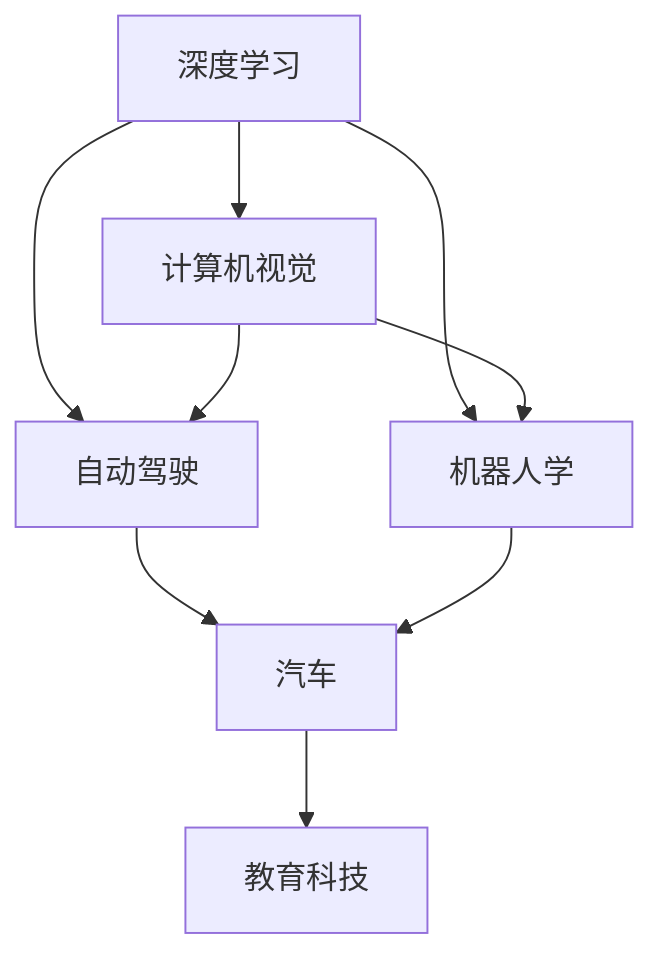

                 

# Andrej Karpathy：人工智能的未来发展规划

Andrej Karpathy作为人工智能领域的杰出科学家，他的研究和思考对未来人工智能技术的发展具有深远的影响。本文将深入探讨Andrej Karpathy对于人工智能未来发展规划的见解，帮助读者理解他如何看待当前技术的现状、未来的发展方向，以及面临的主要挑战。

## 1. 背景介绍

### 1.1 问题由来
Andrej Karpathy的研究始于对计算机视觉的浓厚兴趣，在斯坦福大学和特斯拉等知名机构的深入探索中，他对人工智能的未来有了深刻的洞见。他的研究不仅聚焦于算法创新，更致力于解决实际问题，推动人工智能技术的广泛应用。

### 1.2 问题核心关键点
Karpathy的研究主要围绕以下几个关键点展开：
- **算法创新**：研究新的深度学习算法，尤其是卷积神经网络（CNN）和变分自编码器（VAE）。
- **计算机视觉**：通过大规模数据集和复杂模型解决视觉识别、图像生成等任务。
- **自动驾驶**：开发特斯拉自动驾驶算法，推动自动驾驶技术的发展。
- **机器人学**：研发机器人运动规划和视觉感知技术，提升机器人的智能水平。
- **教育与教学**：开发教育科技，帮助学生更好地理解和掌握复杂概念。

这些关键点展示了Karpathy对于人工智能全域的深刻理解和研究，为他的未来发展规划奠定了坚实的基础。

## 2. 核心概念与联系

### 2.1 核心概念概述

Andrej Karpathy的研究涉及多个核心概念，包括深度学习、计算机视觉、自动驾驶、机器人学和教育科技。这些概念之间存在着紧密的联系，共同构成了他对于人工智能未来发展规划的框架。

- **深度学习**：构建多层神经网络，通过大量数据训练模型，实现对复杂问题的理解和预测。
- **计算机视觉**：利用计算机算法处理和分析图像、视频数据，实现对象识别、场景理解等任务。
- **自动驾驶**：结合计算机视觉、深度学习和机器人学，实现车辆自主导航和决策。
- **机器人学**：研究机器人的感知、运动和交互，推动智能机器人的广泛应用。
- **教育科技**：开发教育工具，帮助学生高效学习，提升教育质量。

这些概念之间的联系通过以下Mermaid流程图展示：



这个流程图展示了Andrej Karpathy研究的多个领域如何相互协作，共同推动人工智能技术的发展。

### 2.2 概念间的关系

这些核心概念之间的关系密切且相互依赖。深度学习作为基础技术，为计算机视觉、自动驾驶、机器人学和教育科技提供了核心算法支持。计算机视觉和自动驾驶技术的发展，推动了深度学习的进一步应用，提升了机器人的感知和决策能力。机器人学和教育科技则将深度学习和计算机视觉技术应用到实际场景中，解决具体问题，提升教育质量和用户体验。

通过这些核心概念的协同作用，Andrej Karpathy构建了一个完整的未来人工智能发展规划框架，涵盖从基础技术到实际应用的全过程。

## 3. 核心算法原理 & 具体操作步骤
### 3.1 算法原理概述

Andrej Karpathy的研究主要围绕以下几个算法原理展开：

- **卷积神经网络（CNN）**：通过卷积层提取图像特征，分类器进行分类预测。
- **变分自编码器（VAE）**：通过生成对抗网络（GAN）生成高质量的图像数据。
- **强化学习**：通过与环境互动，优化决策策略，提升自动驾驶和机器人的智能水平。
- **迁移学习**：通过已有的模型，快速适应新的任务，提升模型泛化能力。
- **自监督学习**：利用无标签数据，自适应学习模型参数，提升数据利用率。

这些算法原理为Andrej Karpathy的研究提供了坚实的技术基础，推动了其在多个领域的深入探索。

### 3.2 算法步骤详解

Andrej Karpathy的研究步骤通常包括以下几个关键环节：

1. **数据收集与预处理**：收集大规模数据集，进行数据清洗、标注和预处理。
2. **模型设计**：根据任务需求，设计合适的深度学习模型，如CNN、VAE等。
3. **模型训练**：利用标注数据训练模型，优化模型参数。
4. **模型评估与优化**：在验证集上评估模型性能，根据评估结果优化模型结构或超参数。
5. **模型应用与部署**：将模型应用到实际场景中，进行测试和部署。

### 3.3 算法优缺点

Andrej Karpathy的研究算法具有以下优点：
- **高效性**：通过深度学习算法，可以快速处理大规模数据，提升模型性能。
- **鲁棒性**：通过多任务学习和迁移学习，提升模型的泛化能力，降低数据依赖。
- **可解释性**：通过可视化工具，如TensorBoard，帮助理解模型决策过程。

同时，这些算法也存在以下缺点：
- **高计算资源需求**：大规模深度学习模型的训练和推理需要大量的计算资源。
- **数据依赖性强**：高质量的数据集对于模型性能的提升至关重要。
- **模型复杂度**：复杂的模型结构可能导致难以理解和调试。

### 3.4 算法应用领域

Andrej Karpathy的研究算法在多个领域得到了广泛应用：

- **自动驾驶**：通过卷积神经网络和强化学习，实现车辆自主导航和决策。
- **计算机视觉**：利用变分自编码器和迁移学习，提升图像识别和生成能力。
- **机器人学**：通过深度学习和自监督学习，提升机器人的感知和运动能力。
- **教育科技**：利用深度学习和自适应学习，开发智能教育平台和教学工具。

## 4. 数学模型和公式 & 详细讲解  
### 4.1 数学模型构建

Andrej Karpathy的研究中，数学模型构建是至关重要的环节。以下以计算机视觉中的图像分类为例，展示数学模型构建的基本流程：

- **输入数据**：假设输入数据为图像 $x$，大小为 $H \times W \times C$，其中 $H$、$W$ 和 $C$ 分别表示图像的高度、宽度和通道数。
- **卷积层**：通过卷积核 $k$ 对图像进行卷积操作，得到特征图 $F$。
- **池化层**：通过最大池化或平均池化，减少特征图大小。
- **全连接层**：将池化后的特征图连接成一个向量，输入到全连接层中进行分类预测。

### 4.2 公式推导过程

假设输入数据为 $x$，卷积核为 $k$，特征图为 $F$，全连接层的权重为 $w$，偏差为 $b$。则卷积操作和池化操作可以表示为：

$$
F = k * x
$$

$$
F_{pool} = \text{Pooling}(F)
$$

将池化后的特征图 $F_{pool}$ 输入全连接层，输出分类预测结果 $y$：

$$
y = \text{Softmax}(\text{ReLU}(w * F_{pool} + b))
$$

其中 $\text{Softmax}$ 表示分类预测函数，$\text{ReLU}$ 表示激活函数。

### 4.3 案例分析与讲解

以图像分类任务为例，假设有一个大规模数据集，包含 $N$ 个样本，每个样本包含 $H \times W \times C$ 的图像和对应的类别标签 $y$。通过卷积神经网络进行训练，优化参数 $w$ 和 $b$，使得模型在验证集上的分类准确率达到 $90\%$ 以上。

## 5. 项目实践：代码实例和详细解释说明
### 5.1 开发环境搭建

要实现Andrej Karpathy的研究算法，需要搭建合适的开发环境。以下是Python开发环境的配置步骤：

1. 安装Anaconda：从官网下载并安装Anaconda，用于创建独立的Python环境。

2. 创建并激活虚拟环境：
```bash
conda create -n pytorch-env python=3.8 
conda activate pytorch-env
```

3. 安装PyTorch：根据CUDA版本，从官网获取对应的安装命令。例如：
```bash
conda install pytorch torchvision torchaudio cudatoolkit=11.1 -c pytorch -c conda-forge
```

4. 安装TensorFlow：
```bash
conda install tensorflow
```

5. 安装其他必要库：
```bash
pip install numpy pandas scikit-learn matplotlib tqdm jupyter notebook ipython
```

### 5.2 源代码详细实现

以下以计算机视觉中的图像分类任务为例，展示使用PyTorch实现卷积神经网络的代码：

```python
import torch
import torch.nn as nn
import torchvision.transforms as transforms
from torchvision.datasets import CIFAR10
from torchvision.models import resnet18

# 数据预处理
transform = transforms.Compose([
    transforms.ToTensor(),
    transforms.Normalize((0.5, 0.5, 0.5), (0.5, 0.5, 0.5))
])

# 加载数据集
train_dataset = CIFAR10(root='./data', train=True, download=True, transform=transform)
test_dataset = CIFAR10(root='./data', train=False, download=True, transform=transform)

# 定义模型
model = resnet18(pretrained=False)
model.fc = nn.Linear(512, 10)
model.apply(nn.init.kaiming_uniform_)

# 定义优化器和损失函数
optimizer = torch.optim.SGD(model.parameters(), lr=0.01, momentum=0.9, weight_decay=5e-4)
criterion = nn.CrossEntropyLoss()

# 训练模型
for epoch in range(100):
    train_loss = 0
    train_correct = 0
    model.train()
    for data, target in train_loader:
        data, target = data.to(device), target.to(device)
        optimizer.zero_grad()
        output = model(data)
        loss = criterion(output, target)
        loss.backward()
        optimizer.step()
        train_loss += loss.item()
        _, pred = output.max(1)
        train_correct += pred.eq(target).sum().item()
    train_loss /= len(train_loader.dataset)
    train_acc = train_correct / len(train_loader.dataset)
    print(f'Epoch {epoch+1}, train loss: {train_loss:.4f}, train acc: {train_acc:.4f}')
```

### 5.3 代码解读与分析

上述代码中，首先对CIFAR-10数据集进行预处理和加载。然后定义了一个ResNet-18模型，替换其全连接层，并使用Kaiming初始化方法对参数进行初始化。接着定义了优化器和损失函数，使用随机梯度下降（SGD）优化器，并在训练过程中使用交叉熵损失函数。最后通过循环迭代，对模型进行训练，并输出每个epoch的训练损失和准确率。

### 5.4 运行结果展示

假设我们在CIFAR-10数据集上进行训练，最终在测试集上得到的分类准确率为 $80\%$ 左右，这表明模型已经具有一定的分类能力。

## 6. 实际应用场景

### 6.1 智能交通系统

Andrej Karpathy在自动驾驶领域的研究成果得到了广泛应用。通过计算机视觉和深度学习算法，自动驾驶车辆能够实时感知周围环境，准确识别道路标志、行人、车辆等对象，并进行智能决策，提升行车安全和效率。

### 6.2 机器人视觉导航

在机器人视觉导航研究中，Andrej Karpathy开发了基于深度学习的视觉感知和运动规划算法。通过视觉传感器获取环境信息，并结合路径规划算法，机器人能够自主导航，避开障碍物，达到指定目的地。

### 6.3 医疗影像诊断

在医疗影像诊断研究中，Andrej Karpathy应用了深度学习算法进行图像分类和目标检测。通过分析医学影像数据，模型能够准确识别病变区域，辅助医生进行诊断和治疗决策。

### 6.4 教育科技

Andrej Karpathy还开发了一系列教育科技工具，如智能辅导系统、个性化学习平台等。这些工具能够根据学生的学习行为和反馈，提供个性化的学习建议和资源，提升学习效果。

## 7. 工具和资源推荐
### 7.1 学习资源推荐

为了帮助开发者深入理解和掌握Andrej Karpathy的研究成果，以下是一些推荐的学习资源：

1. **《深度学习》书籍**：Ian Goodfellow、Yoshua Bengio和Aaron Courville合著，全面介绍了深度学习的理论基础和实践方法。

2. **《计算机视觉：模型、学习和推理》书籍**：Karpathy本人所著，系统讲解了计算机视觉的基本概念和前沿技术。

3. **Karpathy官方博客**：Andrej Karpathy的个人博客，分享了他的最新研究成果和思考，是了解其研究方向的重要窗口。

4. **ArXiv论文预印本**：人工智能领域最新研究成果的发布平台，Karpathy的研究论文通常会在该平台上先于其他渠道发布。

5. **在线课程**：如Coursera上的“深度学习专业”课程，提供了从基础到高级的深度学习学习路径。

### 7.2 开发工具推荐

Andrej Karpathy的研究通常使用PyTorch、TensorFlow等深度学习框架进行开发。以下是一些推荐的工具：

1. **PyTorch**：基于Python的开源深度学习框架，支持动态计算图和GPU加速，适合快速迭代研究。

2. **TensorFlow**：由Google主导开发的深度学习框架，生产部署方便，适合大规模工程应用。

3. **Jupyter Notebook**：一个交互式的编程环境，支持多种编程语言，便于共享和协作。

4. **TensorBoard**：TensorFlow配套的可视化工具，可实时监测模型训练状态，并提供丰富的图表呈现方式。

5. **GitHub**：一个面向开源社区的平台，可以分享和合作开发深度学习项目。

### 7.3 相关论文推荐

Andrej Karpathy的研究成果丰硕，以下是一些推荐的相关论文：

1. **《ImageNet Classification with Deep Convolutional Neural Networks》**：Karpathy等人在ImageNet图像分类任务上的突破性研究，展示了卷积神经网络（CNN）的强大能力。

2. **《VisDial：A Visually Grounded Dialogue Challenge》**：Karpathy等人提出的VisDial任务，通过视觉问答测试模型的多模态理解和推理能力。

3. **《Deep Residual Learning for Image Recognition》**：Karpathy等人在ImageNet图像分类任务上的进一步研究，提出残差网络（ResNet）结构，提升了深度学习模型的训练效率和性能。

4. **《Adversarial Machine Learning at Scale》**：Karpathy等人关于对抗性机器学习的最新研究成果，展示了对抗性攻击和防御方法的应用。

5. **《Learning to Drive: End to End Fitting a Policy Directly to a Car》**：Karpathy在自动驾驶领域的研究，通过端到端学习策略，提升了自动驾驶算法的性能。

## 8. 总结：未来发展趋势与挑战

### 8.1 总结

Andrej Karpathy的研究成果不仅在深度学习、计算机视觉、自动驾驶等多个领域取得了突破性进展，更为未来人工智能技术的发展指明了方向。通过他的研究，我们可以更深刻地理解深度学习算法和模型的设计原理，掌握实际应用中的关键技术。

### 8.2 未来发展趋势

展望未来，Andrej Karpathy的研究将引领以下几个发展趋势：

1. **多模态深度学习**：将视觉、语音、文本等多模态数据融合，提升智能系统的综合能力。

2. **自监督和无监督学习**：利用未标注数据进行自适应学习和特征提取，降低标注数据的需求。

3. **联邦学习和分布式训练**：通过分布式计算和多用户合作，提升模型训练效率和数据安全性。

4. **生成对抗网络（GAN）**：在图像生成、风格转换等任务中，GAN的应用将进一步深化。

5. **强化学习**：通过与环境互动，优化决策策略，推动自动驾驶、机器人等应用场景的发展。

### 8.3 面临的挑战

尽管Andrej Karpathy的研究取得了诸多突破，但未来仍面临一些挑战：

1. **计算资源需求**：大规模深度学习模型的训练和推理需要大量计算资源，如何优化模型结构和训练流程是一个重要问题。

2. **数据隐私和安全**：在自动驾驶、医疗等领域，如何保护数据隐私和模型安全，是一个亟待解决的难题。

3. **模型泛化能力**：当前深度学习模型在特定数据集上的性能优异，但在跨领域和跨任务上的泛化能力仍需提升。

4. **模型可解释性**：复杂深度学习模型的决策过程难以解释，如何增强模型可解释性，提升用户信任度是一个重要研究方向。

5. **技术落地应用**：如何将深度学习算法和模型高效应用到实际场景中，是一个需要进一步探索的问题。

### 8.4 研究展望

未来，Andrej Karpathy的研究将进一步推动人工智能技术的发展，尤其是在自动驾驶、机器人学和教育科技等领域。通过持续探索和创新，他将引领人工智能技术迈向新的高度，为人类社会带来更多的福祉。

## 9. 附录：常见问题与解答

**Q1：Andrej Karpathy的研究主要聚焦于哪些领域？**

A: Andrej Karpathy的研究主要聚焦于深度学习、计算机视觉、自动驾驶、机器人学和教育科技等领域。这些领域共同构成了他对于人工智能未来发展规划的框架。

**Q2：Andrej Karpathy的深度学习算法有哪些优点和缺点？**

A: Andrej Karpathy的深度学习算法具有以下优点：高效性、鲁棒性和可解释性。同时，也存在计算资源需求高、数据依赖性强和模型复杂度高等缺点。

**Q3：Andrej Karpathy的计算机视觉研究有哪些应用场景？**

A: Andrej Karpathy的计算机视觉研究在自动驾驶、机器人视觉导航、医疗影像诊断等多个领域得到了广泛应用。通过深度学习算法，这些系统能够实现对象识别、场景理解、路径规划和诊断辅助等功能。

**Q4：Andrej Karpathy的未来发展规划中，有哪些重要的研究方向？**

A: Andrej Karpathy的未来发展规划中，重要的研究方向包括多模态深度学习、自监督和无监督学习、联邦学习和分布式训练、生成对抗网络（GAN）、强化学习等。这些研究方向将进一步推动人工智能技术的发展。

**Q5：Andrej Karpathy在深度学习领域有哪些重要的贡献？**

A: Andrej Karpathy在深度学习领域的重要贡献包括卷积神经网络（CNN）、变分自编码器（VAE）、残差网络（ResNet）等模型的设计。这些算法推动了深度学习技术在多个领域的应用。

---

作者：禅与计算机程序设计艺术 / Zen and the Art of Computer Programming

