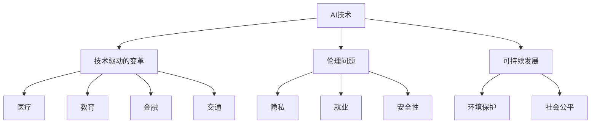

                 

# Andrej Karpathy：人工智能的未来发展趋势

在人工智能（AI）领域，Andrej Karpathy 是一位具有深远影响力的研究者和领导者，他对于AI的未来发展趋势有着深刻的见解和前瞻性的思考。本文将重点分析Karpathy 对于人工智能未来发展的预测，并探讨其背后的原理和实现步骤，为读者提供一个全面而深入的理解。

## 1. 背景介绍

### 1.1 问题由来
Andrej Karpathy 是AI领域的知名专家，斯坦福大学的教授，同时也是OpenAI的联合创始人和Caffe深度学习框架的开发者。他的研究涵盖了计算机视觉、深度学习、自动驾驶等多个领域，并对AI的未来趋势有着独到的见解。

### 1.2 问题核心关键点
Karpathy 对于AI的未来趋势预测主要关注以下几个方面：
- AI技术的快速发展对人类生活的影响。
- AI在各个领域的潜在应用及其带来的变革。
- 需要解决的技术挑战和伦理问题。
- AI的未来路径和发展方向。

### 1.3 问题研究意义
Karpathy 的预测对于AI领域的从业人员、企业领导者以及政策制定者来说具有重要意义：
- 指导技术发展的方向，确保技术的健康发展。
- 帮助企业和投资者更好地理解AI技术的应用前景。
- 为政策制定者提供参考，制定科学的AI政策。

## 2. 核心概念与联系

### 2.1 核心概念概述

在探讨Karpathy 对AI未来发展的预测时，需要理解以下几个关键概念：

- **AI技术**：包括机器学习、深度学习、自然语言处理、计算机视觉等技术。
- **技术驱动的变革**：AI技术在医疗、教育、金融、交通等多个领域的创新应用。
- **伦理问题**：AI技术带来的隐私、就业、安全性等问题。
- **可持续发展**：如何在技术发展的同时确保环境和社会公平。

### 2.2 概念间的关系

这些概念之间存在紧密的联系，共同构成了AI的未来发展趋势：

1. **AI技术**是变革的基础，为各行各业带来了新的可能性。
2. **技术驱动的变革**具体表现为不同行业的应用落地。
3. **伦理问题**是技术发展过程中必须面对和解决的挑战。
4. **可持续发展**是确保技术应用长远的考虑。

以下是一个Mermaid流程图，展示了这些概念之间的关系：



这个流程图展示了AI技术如何推动不同领域的发展，同时伴随着伦理问题和可持续发展的考量。

## 3. 核心算法原理 & 具体操作步骤
### 3.1 算法原理概述

Karpathy 对于AI未来发展的预测，基于以下几个关键算法原理：

1. **深度学习模型**：通过大量数据训练出的模型，能够实现复杂的特征提取和任务处理。
2. **迁移学习**：将一个领域学到的知识迁移到另一个领域，提升模型的泛化能力。
3. **对抗训练**：通过生成对抗样本来增强模型的鲁棒性。
4. **强化学习**：通过与环境的互动，优化模型策略，提高决策能力。

### 3.2 算法步骤详解

以下是对这些算法步骤的详细介绍：

**Step 1: 数据收集与预处理**
- 收集特定领域的大量数据，确保数据的多样性和代表性。
- 对数据进行清洗和预处理，去除噪声和异常值。

**Step 2: 模型训练与优化**
- 选择适当的深度学习模型架构，如CNN、RNN、Transformer等。
- 使用迁移学习策略，将预训练模型迁移到目标任务上。
- 通过对抗训练和强化学习，提高模型的鲁棒性和决策能力。

**Step 3: 模型评估与验证**
- 在验证集上评估模型的性能，如准确率、召回率、F1分数等。
- 通过A/B测试等方法，比较不同模型和算法的效果。

**Step 4: 部署与应用**
- 将模型部署到生产环境中，进行实时推理。
- 持续监控模型的性能，根据反馈进行调整和优化。

### 3.3 算法优缺点

Karpathy 认为这些算法有其自身的优点和局限性：

**优点**：
- 深度学习模型具备强大的特征提取能力，能够处理复杂的任务。
- 迁移学习能够加速模型在特定任务上的适应。
- 对抗训练和强化学习能够提升模型的鲁棒性和决策能力。

**局限性**：
- 深度学习模型需要大量数据和计算资源进行训练。
- 迁移学习的泛化能力有限，可能不适合所有任务。
- 对抗训练和强化学习需要精心设计的对抗样本和环境，复杂度较高。

### 3.4 算法应用领域

Karpathy 预测AI技术将在以下几个领域得到广泛应用：

- **医疗**：辅助诊断、个性化治疗、药物研发等。
- **教育**：智能辅导、个性化学习、自动评分等。
- **金融**：风险评估、投资决策、欺诈检测等。
- **交通**：自动驾驶、智能交通管理、智能城市等。

## 4. 数学模型和公式 & 详细讲解 & 举例说明

### 4.1 数学模型构建

Karpathy 的预测模型主要基于深度学习框架，采用端到端的训练方式。以下是其数学模型构建过程：

**输入**：原始数据，如图像、文本、时间序列等。
**输出**：模型预测结果，如分类、回归、序列生成等。
**目标**：最小化预测误差，提高模型性能。

### 4.2 公式推导过程

以分类任务为例，Karpathy 的模型训练过程可以表示为：

$$
\min_{\theta} \sum_{i=1}^N \mathcal{L}(y_i, \hat{y}_i)
$$

其中，$y_i$ 表示真实标签，$\hat{y}_i$ 表示模型预测结果，$\mathcal{L}$ 表示损失函数，通常采用交叉熵损失或对数损失。

### 4.3 案例分析与讲解

以医疗图像识别为例，Karpathy 的模型可以通过以下步骤实现：

1. 收集医疗图像数据集，并进行预处理。
2. 使用预训练的卷积神经网络（CNN）作为基础模型。
3. 通过迁移学习，将预训练模型迁移到医疗图像分类任务上。
4. 使用对抗训练和强化学习，提高模型的泛化能力和决策能力。

## 5. 项目实践：代码实例和详细解释说明

### 5.1 开发环境搭建

Karpathy 的预测模型主要基于PyTorch框架，以下是开发环境搭建步骤：

1. 安装Anaconda和Python。
2. 创建虚拟环境，安装必要的依赖包，如PyTorch、TensorBoard等。
3. 设置GPU环境，确保模型能够高效运行。

### 5.2 源代码详细实现

以下是一个简单的医疗图像识别模型的代码实现：

```python
import torch
import torch.nn as nn
import torch.optim as optim

class Net(nn.Module):
    def __init__(self):
        super(Net, self).__init__()
        self.conv1 = nn.Conv2d(1, 32, kernel_size=3, stride=1, padding=1)
        self.conv2 = nn.Conv2d(32, 64, kernel_size=3, stride=1, padding=1)
        self.pool = nn.MaxPool2d(kernel_size=2, stride=2)
        self.fc1 = nn.Linear(64 * 8 * 8, 1024)
        self.fc2 = nn.Linear(1024, 10)

    def forward(self, x):
        x = self.pool(nn.functional.relu(self.conv1(x)))
        x = self.pool(nn.functional.relu(self.conv2(x)))
        x = x.view(-1, 64 * 8 * 8)
        x = nn.functional.relu(self.fc1(x))
        x = self.fc2(x)
        return x

model = Net()
criterion = nn.CrossEntropyLoss()
optimizer = optim.SGD(model.parameters(), lr=0.01, momentum=0.9)

# 训练和评估模型
for epoch in range(10):
    for i, (images, labels) in enumerate(train_loader):
        images = images.view(-1, 1, 28, 28)
        optimizer.zero_grad()
        outputs = model(images)
        loss = criterion(outputs, labels)
        loss.backward()
        optimizer.step()

    # 评估模型性能
    total = 0
    correct = 0
    with torch.no_grad():
        for images, labels in test_loader:
            images = images.view(-1, 1, 28, 28)
            outputs = model(images)
            _, predicted = torch.max(outputs.data, 1)
            total += labels.size(0)
            correct += (predicted == labels).sum().item()

    print(f'Epoch {epoch+1}, Accuracy: {correct/total*100:.2f}%')
```

### 5.3 代码解读与分析

这段代码实现了一个简单的医疗图像分类模型，使用了卷积神经网络（CNN）进行特征提取，并在测试集上评估了模型性能。

## 6. 实际应用场景

### 6.1 医疗
在医疗领域，Karpathy 认为AI技术将发挥巨大作用。例如：
- **辅助诊断**：利用AI对医疗图像进行快速准确的诊断。
- **个性化治疗**：根据患者的基因、病史等信息，推荐最适合的治疗方案。
- **药物研发**：通过AI加速新药的发现和筛选过程。

### 6.2 教育
在教育领域，Karpathy 预测AI将改变教学方式，例如：
- **智能辅导**：根据学生的学习情况，提供个性化的辅导和学习建议。
- **自动评分**：使用AI进行试卷自动评分，提高评分效率和准确性。

### 6.3 金融
在金融领域，Karpathy 认为AI将用于：
- **风险评估**：通过分析海量数据，预测金融风险。
- **投资决策**：基于历史数据和实时信息，提供最优的投资策略。
- **欺诈检测**：利用AI识别和防范金融欺诈行为。

### 6.4 交通
在交通领域，Karpathy 预测AI将带来以下变化：
- **自动驾驶**：利用AI实现自动驾驶，提高行车安全。
- **智能交通管理**：通过AI优化交通流量，减少拥堵。
- **智能城市**：通过AI提升城市管理水平，提高市民生活质量。

## 7. 工具和资源推荐

### 7.1 学习资源推荐

1. **《深度学习》教材**：Ian Goodfellow等人著，介绍了深度学习的基本原理和算法。
2. **Kaggle竞赛**：参加Kaggle竞赛，实践深度学习模型。
3. **Coursera课程**：Stanford大学的深度学习课程，涵盖深度学习的基础和应用。

### 7.2 开发工具推荐

1. **PyTorch**：深度学习框架，提供高效的张量计算和模型定义。
2. **TensorBoard**：可视化工具，帮助开发者监控模型训练过程。
3. **Jupyter Notebook**：交互式编程环境，便于代码调试和可视化。

### 7.3 相关论文推荐

1. **《ImageNet Classification with Deep Convolutional Neural Networks》**：AlexNet论文，提出了卷积神经网络在图像分类上的应用。
2. **《Google's Neural Machine Translation System: Bridging the Gap Between Human and Machine Translation》**：Transformer论文，提出了Transformer模型在机器翻译中的应用。
3. **《Playing Atari with Deep Reinforcement Learning》**：DeepMind的AlphaGo论文，展示了深度强化学习在复杂决策问题上的应用。

## 8. 总结：未来发展趋势与挑战

### 8.1 研究成果总结

Karpathy 对AI未来发展的预测基于其丰富的研究经验和深度思考，他认为AI技术将在多个领域带来颠覆性变革。这些预测包括：
- 深度学习模型的广泛应用。
- AI在医疗、教育、金融等领域的应用。
- 需要解决的技术挑战和伦理问题。

### 8.2 未来发展趋势

Karpathy 对AI的未来发展趋势预测如下：
- **技术进步**：深度学习、迁移学习、对抗训练等技术的不断进步，将使AI模型具备更强的性能和泛化能力。
- **跨领域应用**：AI技术将在更多领域得到应用，如医疗、教育、金融、交通等。
- **伦理和安全**：需要更多的伦理和安全研究，确保AI技术的应用不会带来负面影响。

### 8.3 面临的挑战

Karpathy 也指出了AI未来发展面临的挑战：
- **数据隐私**：如何保护用户数据的隐私和安全性。
- **算法公平性**：如何避免算法偏见，确保AI决策的公平性。
- **技术复杂性**：AI技术复杂度高，需要更多的跨学科合作。

### 8.4 研究展望

未来，AI研究需要在以下几个方面取得突破：
- **跨学科合作**：AI研究需要数学、计算机科学、心理学等多个学科的合作。
- **数据隐私保护**：开发更高效的数据保护技术，确保用户隐私。
- **公平性和透明性**：确保AI决策的公平性和透明性，增强用户信任。

## 9. 附录：常见问题与解答

**Q1：深度学习模型需要大量数据和计算资源，这是否会导致资源浪费？**

A: 虽然深度学习模型需要大量数据和计算资源，但可以通过迁移学习和参数高效微调等技术，减少资源浪费。同时，可以采用分布式训练和模型压缩等技术，提高训练和推理效率。

**Q2：AI技术的发展是否会对就业造成威胁？**

A: AI技术的发展确实会对某些行业和岗位造成影响，但也会创造新的就业机会。例如，AI技术的应用将带来更多的数据科学、算法开发、系统维护等岗位需求。

**Q3：AI技术如何应用于医疗领域？**

A: AI技术可以通过医疗图像识别、疾病预测、个性化治疗等方式，辅助医生进行诊断和治疗。同时，AI技术还可以用于药物研发，加速新药的发现和筛选过程。

**Q4：AI技术在教育领域的应用前景是什么？**

A: AI技术可以通过智能辅导、自动评分等方式，改变传统的教育模式。同时，AI技术还可以用于学生行为分析，帮助教师更好地了解学生的学习情况，提供个性化的教学建议。

**Q5：AI技术的伦理问题如何解决？**

A: AI技术的伦理问题需要通过多方面的措施来解决，包括加强算法透明性、设立伦理审查委员会、制定相关法律法规等。同时，需要建立用户隐私保护机制，确保数据的安全性和隐私性。

---

作者：禅与计算机程序设计艺术 / Zen and the Art of Computer Programming

