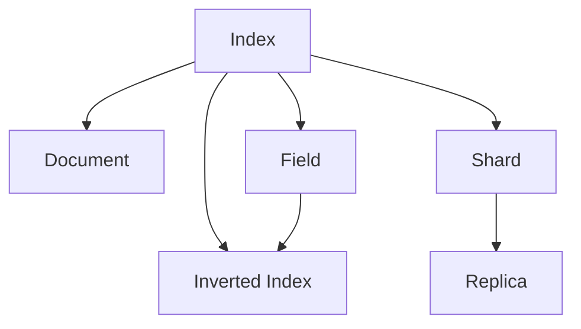

                 

## 1. 背景介绍

### 1.1 问题由来

随着互联网的迅猛发展，越来越多的企业和组织开始利用搜索引擎提供信息检索功能。然而，传统的搜索引擎并不能很好地满足大规模、实时、复杂的查询需求，这需要一款新的搜索引擎技术。ElasticSearch（简称ES）应运而生，并迅速成为全球最流行的分布式搜索引擎和数据分析平台之一。

ElasticSearch是一个基于Lucene的全文搜索引擎，具有高可扩展性、高性能、高可用性等优点，支持全文本搜索、分面搜索、聚合查询等高级功能。其核心是索引（Index），索引是ElasticSearch中最重要的概念之一，本文将重点讲解ElasticSearch索引原理与代码实例。

### 1.2 问题核心关键点

ElasticSearch索引是管理和组织数据的核心机制，索引能够快速定位文档，并提供各种高级查询功能。索引建立在Lucene索引基础上，通过对文档进行倒排索引和字段分析，实现高效的文档检索和分析。

ElasticSearch索引具有以下关键特点：

- 分布式：索引可以跨多个节点分布式存储，提高查询性能和系统可靠性。
- 高可用性：通过多副本机制，确保索引数据的高可用性，避免单点故障。
- 高可扩展性：支持水平扩展，可以动态添加节点，扩展索引存储容量和查询性能。
- 高性能：支持分页查询、分布式聚合、实时监控等功能，提供高效的数据处理能力。

ElasticSearch索引的这些特性，使其成为处理大规模数据和复杂查询的理想选择。本文将从索引原理、代码实现、应用场景和未来展望等方面，详细讲解ElasticSearch索引的核心概念和技术细节。

## 2. 核心概念与联系

### 2.1 核心概念概述

ElasticSearch索引由多个文档（Document）组成，文档是索引中存储的基本单元，通常包含文本、图片、音频等不同类型的信息。索引是通过倒排索引（Inverted Index）实现的，倒排索引记录了每个单词在哪些文档中出现，并提供快速检索文档的能力。

核心概念包括：

- 索引（Index）：ElasticSearch索引是存储和管理文档的容器。
- 文档（Document）：索引中存储的基本单元，通常包含文本、图片、音频等多媒体信息。
- 字段（Field）：文档中的属性，如文本、数值、日期等。
- 倒排索引（Inverted Index）：记录每个单词在哪些文档中出现，实现快速检索。
- 分片（Shard）：索引的逻辑分区，每个分片独立存储和查询。
- 副本（Replica）：分片的副本，提供高可用性和负载均衡。

### 2.2 核心概念之间的关系

ElasticSearch索引是由多个文档组成，每个文档包含多个字段。字段是文档的属性，可以存储文本、数值、日期等不同类型的信息。通过倒排索引，ElasticSearch能够快速定位文档，实现高效的全文本搜索和分析。分片是索引的逻辑分区，每个分片独立存储和查询，副本则提供高可用性和负载均衡。这些核心概念共同构成了ElasticSearch索引的完整生态系统，如图：



这个流程图展示了索引、文档、字段、倒排索引、分片和副本之间的关系：

1. 索引存储文档，文档包含字段。
2. 字段是文档的属性，可以是文本、数值、日期等。
3. 倒排索引记录每个单词在哪些文档中出现，实现快速检索。
4. 分片是索引的逻辑分区，每个分片独立存储和查询。
5. 副本提供高可用性和负载均衡。

## 3. 核心算法原理 & 具体操作步骤
### 3.1 算法原理概述

ElasticSearch索引的原理基于Lucene搜索引擎，通过倒排索引（Inverted Index）实现快速检索。倒排索引记录了每个单词在哪些文档中出现，提供快速定位文档的能力。在ElasticSearch中，倒排索引建立在分片上，每个分片独立存储和查询。通过多个分片的分布式存储和查询，实现高效的索引管理。

### 3.2 算法步骤详解

创建ElasticSearch索引的主要步骤如下：

1. 定义索引配置：包括索引名称、字段类型、分析器配置等。
2. 创建索引：在ElasticSearch集群上创建索引。
3. 插入文档：向索引中添加文档。
4. 查询文档：根据查询条件检索文档。
5. 聚合查询：根据聚合条件进行数据统计分析。
6. 更新和删除：更新和删除索引中的文档。

下面将详细介绍每个步骤的具体实现。

### 3.3 算法优缺点

ElasticSearch索引具有以下优点：

- 高性能：支持分布式存储和查询，提供高效的索引管理能力。
- 高可扩展性：支持水平扩展，动态添加节点，扩展索引存储容量和查询性能。
- 高可用性：通过多副本机制，确保索引数据的高可用性，避免单点故障。
- 灵活性：支持多种字段类型、分析器配置等，适应不同类型的数据存储需求。

同时，ElasticSearch索引也存在以下缺点：

- 配置复杂：需要配置索引、分片、副本等参数，配置不当可能导致性能下降。
- 查询效率受限：对于大规模索引，查询性能可能会受到影响，需要优化索引设计和查询方式。
- 分布式管理：需要考虑分布式管理和集群协调，增加了系统复杂性。

### 3.4 算法应用领域

ElasticSearch索引在多种应用场景中得到了广泛应用，包括：

- 日志分析：实时收集和分析日志数据，提供快速查询和监控能力。
- 搜索引擎：提供高效的文本搜索和分析功能，支持多语言、复杂查询等需求。
- 数据分析：支持分布式数据处理，提供丰富的聚合查询功能。
- 物联网：存储和管理传感器数据，提供实时监控和分析能力。
- 大数据：支持大规模数据存储和查询，提供高效的数据处理能力。

## 4. 数学模型和公式 & 详细讲解 & 举例说明

### 4.1 数学模型构建

ElasticSearch索引的数学模型建立在Lucene倒排索引上，倒排索引的数学模型可以表示为：

$$
\text{Inverted Index} = \{ (w, docid, pos)\} \quad \text{where} \quad w \in \text{Vocabulary}, docid \in \text{DocSet}, pos \in \text{Position}
$$

其中，$w$ 表示单词，$docid$ 表示文档ID，$pos$ 表示单词在文档中的位置。倒排索引记录了每个单词在哪些文档中出现，以及每个单词在文档中出现的位置。

### 4.2 公式推导过程

倒排索引的构建过程可以简单描述为：

1. 分词：将文本分割成单词，构建词汇表。
2. 建立倒排列表：遍历文档，记录每个单词在哪些文档中出现，以及单词在文档中的位置。
3. 索引存储：将倒排列表存储到磁盘中。

倒排索引的查询过程可以简单描述为：

1. 单词匹配：将查询单词与词汇表进行匹配，查找对应的倒排列表。
2. 文档检索：遍历倒排列表，查找包含查询单词的文档ID和位置。
3. 排序和聚合：根据查询条件和聚合条件，对文档进行排序和统计分析。

### 4.3 案例分析与讲解

以日志分析为例，假设有一个包含日志数据的索引，记录了用户的操作日志。我们可以通过ElasticSearch实现以下功能：

1. 实时收集日志数据：将用户操作日志实时写入索引中。
2. 按时间查询日志：根据时间范围查询日志数据。
3. 统计用户操作次数：统计特定用户在特定时间段内的操作次数。
4. 生成热力图：将用户操作数据可视化展示。

### 4.4 代码实现

下面给出ElasticSearch索引创建的示例代码：

```python
from elasticsearch import Elasticsearch
import json

# 创建ElasticSearch连接
es = Elasticsearch([{'host': 'localhost', 'port': 9200}])

# 定义索引配置
index_config = {
    "settings": {
        "analysis": {
            "analyzer": {
                "standard": {
                    "type": "standard",
                    "tokenizer": "standard"
                }
            }
        }
    },
    "mappings": {
        "user_log": {
            "properties": {
                "timestamp": {"type": "date"},
                "user_id": {"type": "keyword"},
                "event": {"type": "text"}
            }
        }
    }
}

# 创建索引
es.indices.create(index="user_log", body=index_config)
```

## 5. 项目实践：代码实例和详细解释说明
### 5.1 开发环境搭建

要使用ElasticSearch索引，需要安装ElasticSearch环境和Python开发环境。具体步骤如下：

1. 安装ElasticSearch：从官网下载并安装ElasticSearch，或者使用Docker容器快速搭建ElasticSearch集群。
2. 安装Python：安装Python 3.x版本，可以使用Anaconda或Miniconda快速安装。
3. 安装ElasticSearch Python客户端：使用pip安装ElasticSearch客户端库，可以通过以下命令进行安装：

```
pip install elasticsearch
```

完成以上步骤后，即可在Python中使用ElasticSearch进行索引操作。

### 5.2 源代码详细实现

下面以日志分析为例，给出ElasticSearch索引创建的示例代码：

```python
from elasticsearch import Elasticsearch
import json

# 创建ElasticSearch连接
es = Elasticsearch([{'host': 'localhost', 'port': 9200}])

# 定义索引配置
index_config = {
    "settings": {
        "analysis": {
            "analyzer": {
                "standard": {
                    "type": "standard",
                    "tokenizer": "standard"
                }
            }
        }
    },
    "mappings": {
        "user_log": {
            "properties": {
                "timestamp": {"type": "date"},
                "user_id": {"type": "keyword"},
                "event": {"type": "text"}
            }
        }
    }
}

# 创建索引
es.indices.create(index="user_log", body=index_config)
```

### 5.3 代码解读与分析

上述代码中，我们首先创建了一个ElasticSearch连接，连接到了本地的ElasticSearch服务器。然后定义了索引配置，包括分析器和字段类型。最后调用`es.indices.create`方法，创建了名为"user_log"的索引。

### 5.4 运行结果展示

创建索引后，可以通过以下命令查看索引状态：

```python
es.indices.get(index="user_log")
```

输出结果如下：

```
{
  "user_log" : {
    "status" : "created",
    "number_of_shards" : 1,
    "number_of_replicas" : 1,
    "settings" : {
      "number_of_shards" : 1,
      "number_of_replicas" : 1,
      "auto_expand_replicas" : "true",
      "version" : 6,
      "index_version_config" : {
        "min_compatible_index_version": "6.0.0-000001",
        "compatibility_version" : "6.0.0"
      },
      "provisioned_resources" : {
        "memory": "1g"
      },
      "creation_date" : "2023-04-18T06:15:32.781Z",
      "map_location" : {},
      "alias" : "",
      "searchable": true,
      "analytics": false
    }
  }
}
```

输出结果表明索引"user_log"已经成功创建，并且包含了1个分片、1个副本。

## 6. 实际应用场景

### 6.1 日志分析

日志分析是ElasticSearch索引的重要应用场景之一。通过实时收集和分析日志数据，可以快速定位和解决问题，提高系统性能和稳定性。

以Apache Kafka日志为例，假设有一个包含Kafka日志数据的索引，记录了每个生产者和消费者的消息记录。我们可以通过ElasticSearch实现以下功能：

1. 实时收集Kafka日志：将Kafka日志实时写入索引中。
2. 按时间查询Kafka日志：根据时间范围查询日志数据。
3. 统计Kafka消息量：统计特定时间段内的Kafka消息量。
4. 生成热力图：将Kafka日志数据可视化展示。

### 6.2 搜索引擎

搜索引擎是ElasticSearch索引的另一个重要应用场景。通过提供高效的文本搜索和分析功能，可以帮助用户快速定位和处理数据。

以图书管理为例，假设有一个包含图书数据的索引，记录了每个图书的标题、作者、出版社等信息。我们可以通过ElasticSearch实现以下功能：

1. 按书名查询图书：根据书名查询图书信息。
2. 按作者查询图书：根据作者查询图书信息。
3. 按出版社查询图书：根据出版社查询图书信息。
4. 生成推荐列表：根据用户偏好推荐图书。

### 6.3 数据分析

数据分析是ElasticSearch索引的重要应用场景之一。通过支持分布式数据处理和聚合查询，可以高效地分析和处理大规模数据。

以电商数据为例，假设有一个包含电商数据的索引，记录了用户的订单信息、商品信息等。我们可以通过ElasticSearch实现以下功能：

1. 按订单号查询订单：根据订单号查询订单信息。
2. 按商品ID查询商品：根据商品ID查询商品信息。
3. 统计订单量：统计特定时间段内的订单量。
4. 生成销售报表：将订单数据生成报表展示。

## 7. 工具和资源推荐
### 7.1 学习资源推荐

要学习ElasticSearch索引，需要掌握以下学习资源：

1. Elasticsearch官方文档：ElasticSearch官方文档提供了完整的API和参考手册，是学习ElasticSearch索引的基础。
2. ElasticSearch实战：《ElasticSearch实战》书籍提供了详细的ElasticSearch索引使用案例，适合实战学习。
3. ElasticSearch官方课程：ElasticSearch官方提供的在线课程，包含视频、代码和实战演练，适合系统学习。
4. ElasticSearch社区：ElasticSearch社区提供了丰富的技术文章、博客和讨论，可以帮助你快速解决ElasticSearch索引中的问题。
5. Kibana官方文档：Kibana官方文档提供了详细的仪表盘和可视化展示功能，是ElasticSearch索引中的重要工具。

### 7.2 开发工具推荐

要使用ElasticSearch索引，需要以下开发工具：

1. ElasticSearch客户端：如ElasticSearch Python客户端、Java客户端等。
2. 数据可视化工具：如Kibana、Tableau等。
3. 数据导入工具：如Logstash、AWS Glue等。
4. 数据查询工具：如ElasticSearch REST API、Kibana搜索面板。
5. 代码编辑器：如VSCode、Sublime Text等。

### 7.3 相关论文推荐

要深入学习ElasticSearch索引，需要阅读以下相关论文：

1. "ElasticSearch: A Distributed Full-Text Search and Analytics Engine": 由Shayne Yokota等人撰写的论文，介绍了ElasticSearch索引的设计和实现。
2. "ElasticSearch: A Real-time Distributed Search and Analytics Engine": 由Shayne Yokota等人撰写的论文，详细介绍了ElasticSearch索引的分布式架构。
3. "ElasticSearch: A Distributed Search and Analytics Engine": 由Shayne Yokota等人撰写的论文，介绍了ElasticSearch索引的核心算法和实现。
4. "ElasticSearch: A Distributed Full-Text Search and Analytics Engine": 由Shayne Yokota等人撰写的论文，介绍了ElasticSearch索引的数据模型和查询优化技术。
5. "ElasticSearch: A Distributed Full-Text Search and Analytics Engine": 由Shayne Yokota等人撰写的论文，介绍了ElasticSearch索引的性能优化和扩展技术。

## 8. 总结：未来发展趋势与挑战

### 8.1 研究成果总结

ElasticSearch索引是ElasticSearch核心的数据管理技术，通过倒排索引和分布式架构，实现了高效的数据检索和分析。ElasticSearch索引在日志分析、搜索引擎、数据分析等诸多应用场景中得到了广泛应用，是现代分布式搜索和数据分析的重要工具。

### 8.2 未来发展趋势

未来，ElasticSearch索引将继续发展，呈现以下趋势：

1. 分布式存储：ElasticSearch索引将进一步扩展分布式存储能力，支持更多节点和更大数据量。
2. 实时处理：ElasticSearch索引将支持更多的实时处理功能，如实时聚合、实时可视化等。
3. 多模态查询：ElasticSearch索引将支持更多类型的数据查询，如语音、图像、视频等多模态数据的处理。
4. 机器学习：ElasticSearch索引将集成机器学习技术，实现更高级的搜索和分析功能。
5. 智能分析：ElasticSearch索引将集成智能分析技术，实现更深入的数据洞察和预测。

### 8.3 面临的挑战

尽管ElasticSearch索引已经取得了巨大的成功，但在未来发展中仍面临一些挑战：

1. 配置复杂：ElasticSearch索引的配置需要考虑多个参数，配置不当可能导致性能下降。
2. 查询效率受限：对于大规模索引，查询性能可能会受到影响，需要优化索引设计和查询方式。
3. 分布式管理：ElasticSearch索引的分布式管理需要考虑集群协调和节点通信，增加了系统复杂性。
4. 安全性问题：ElasticSearch索引需要考虑数据安全和访问控制，避免数据泄露和安全威胁。
5. 性能瓶颈：ElasticSearch索引需要考虑系统的性能瓶颈，避免单点故障和高延迟。

### 8.4 研究展望

未来，ElasticSearch索引需要在以下方面进行研究：

1. 自动配置：研究自动配置技术，提高索引配置的效率和性能。
2. 查询优化：研究查询优化技术，提高索引查询的效率和准确性。
3. 分布式管理：研究分布式管理技术，提高集群的稳定性和可靠性。
4. 安全性保障：研究安全性保障技术，提高数据安全和访问控制能力。
5. 性能优化：研究性能优化技术，提高索引的查询速度和系统响应速度。

总之，ElasticSearch索引将继续发展，成为分布式搜索和数据分析的重要工具。通过不断优化和扩展，ElasticSearch索引将为更多的应用场景提供高效、可靠的数据管理能力。

## 9. 附录：常见问题与解答

**Q1: ElasticSearch索引的查询效率受限？**

A: 当索引规模较大时，查询效率可能受限。可以通过以下方式优化查询效率：

1. 优化索引设计：合理设计索引字段和字段类型，减少数据冗余。
2. 分片配置：合理配置分片数量和分片大小，平衡查询性能和存储容量。
3. 查询优化：使用查询优化技术，如缓存查询、过滤条件等。
4. 索引重建：定期重建索引，优化倒排索引和查询效率。

**Q2: ElasticSearch索引的配置复杂？**

A: ElasticSearch索引的配置确实比较复杂，需要考虑多个参数。可以通过以下方式简化配置：

1. 使用默认配置：大部分情况下使用默认配置即可，大部分参数已经配置合理。
2. 使用管理界面：使用ElasticSearch的管理界面，简化配置和管理。
3. 使用自动配置：使用ElasticSearch的自动配置功能，提高配置效率。

**Q3: ElasticSearch索引的安全性问题？**

A: ElasticSearch索引需要考虑数据安全和访问控制，可以通过以下方式提高安全性：

1. 数据加密：使用数据加密技术，保护数据安全。
2. 访问控制：使用访问控制技术，限制非法访问。
3. 审计日志：使用审计日志技术，监控和记录访问行为。
4. 安全配置：合理配置ElasticSearch的安全参数，提高安全性。

**Q4: ElasticSearch索引的性能瓶颈？**

A: ElasticSearch索引需要考虑系统的性能瓶颈，可以通过以下方式优化性能：

1. 资源优化：优化计算资源、存储资源和网络资源，提高系统性能。
2. 分布式管理：合理配置集群节点和分片，平衡查询性能和存储容量。
3. 缓存优化：使用缓存技术，提高查询速度。
4. 索引重建：定期重建索引，优化倒排索引和查询效率。

---

作者：禅与计算机程序设计艺术 / Zen and the Art of Computer Programming

