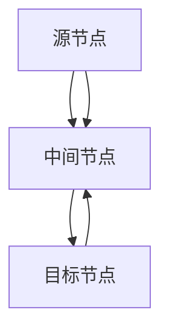

                 

# Flink原理与代码实例讲解

> 关键词：Flink,分布式流处理,实时数据流处理,流计算,Apache Flink,数据流图(DAG),图计算,窗口操作,状态管理,流式SQL,内存管理,分布式系统

## 1. 背景介绍

### 1.1 问题由来
近年来，随着互联网和物联网设备的普及，实时数据量呈爆炸式增长。如何高效地处理和分析这些海量实时数据，成为各行各业共同关注的难题。与此同时，传统的批处理技术（如Hadoop、Spark等）难以满足实时数据处理的需求，新兴的流处理技术应运而生。

Apache Flink作为一款开源的分布式流处理框架，旨在提供高吞吐量、低延迟、高可用的流处理能力。Flink支持流式SQL、图计算、流式机器学习等多种数据处理模式，适用于实时数据流、离线数据批处理、增量更新等场景。

本文将深入介绍Flink的核心原理和关键技术，并结合代码实例，全面讲解Flink的架构设计、核心组件、高级特性等。通过对Flink的深入理解，你将能够掌握其核心思想和实现细节，从而在实际开发中灵活应用。

### 1.2 问题核心关键点
Flink的核心理念包括：

- 分布式流处理：Flink通过分布式流处理引擎，将大规模数据流分布式处理。
- 低延迟：通过优化内存计算，Flink能够实现低延迟的实时数据处理。
- 高吞吐量：通过并行计算和资源调度，Flink能够处理大规模的实时数据流。
- 高可用性：通过容错机制和状态管理，Flink能够保证系统的稳定性和可靠性。

这些核心能力使得Flink成为应对海量实时数据流的理想工具。本文将系统性地讲解Flink的核心原理和关键技术，帮助读者全面理解Flink的工作机制和应用场景。

## 2. 核心概念与联系

### 2.1 核心概念概述

为更好地理解Flink的分布式流处理机制，本节将介绍几个密切相关的核心概念：

- 数据流图(DAG)：Flink通过构建数据流图(DAG)来描述数据流的计算过程。DAG中每个节点代表一个计算任务，节点之间通过边表示数据依赖关系。

- 图计算：Flink支持基于图结构的计算任务，如图分割、图遍历、图聚类等。通过图计算，Flink能够处理更加复杂的数据关系。

- 窗口操作：Flink支持对数据流进行窗口划分，对窗口内的数据进行聚合、统计、计算等操作。窗口操作是Flink处理实时数据流的重要手段。

- 状态管理：Flink通过维护状态，实现对数据流的持久化存储和计算。状态管理使得Flink能够处理增量数据流和历史数据流的混合计算。

- 流式SQL：Flink支持基于SQL的流式计算，通过SQL语句定义数据流的计算逻辑，使得数据处理更加简单和灵活。

- 内存管理：Flink通过内存计算和异步IO操作，实现低延迟和高吞吐量的数据处理。内存管理使得Flink能够充分利用计算资源，提升数据处理效率。

这些核心概念之间的逻辑关系可以通过以下Mermaid流程图来展示：

```mermaid
graph TB
    A[数据流图(DAG)] --> B[图计算]
    A --> C[窗口操作]
    A --> D[状态管理]
    A --> E[流式SQL]
    A --> F[内存管理]
    C --> B
    C --> D
    C --> E
    D --> E
    F --> E
```

这个流程图展示了Flink的核心概念及其之间的关系：

1. 数据流图(DAG)作为计算的基础结构，通过节点表示计算任务，通过边表示数据依赖关系。
2. 图计算和窗口操作是数据流图中的关键计算方式，用于处理复杂数据关系和聚合统计操作。
3. 状态管理是Flink对数据流的持久化存储和计算方式，用于处理增量数据流和历史数据流的混合计算。
4. 流式SQL是Flink对数据流进行计算的语言，简化了数据处理的逻辑表达。
5. 内存管理是Flink实现低延迟和高吞吐量数据处理的重要机制，通过内存计算和异步IO操作，提升数据处理效率。

这些核心概念共同构成了Flink的计算框架，使其能够在各种场景下实现高效、可靠的数据处理。通过理解这些核心概念，我们可以更好地把握Flink的工作原理和优化方向。

### 2.2 概念间的关系

这些核心概念之间存在着紧密的联系，形成了Flink的完整计算框架。下面我通过几个Mermaid流程图来展示这些概念之间的关系。

#### 2.2.1 Flink的整体架构

```mermaid
graph TB
    A[数据源] --> B[数据流图(DAG)]
    B --> C[图计算]
    B --> D[窗口操作]
    B --> E[状态管理]
    B --> F[流式SQL]
    B --> G[内存管理]
    C --> F
    D --> F
    E --> F
    F --> H[计算引擎]
    G --> H
    H --> I[结果存储]
```

这个流程图展示了Flink的整体架构。数据源产生实时数据流，数据流图表示数据的计算过程，图计算、窗口操作、状态管理和内存管理是关键计算和优化方式，最终通过计算引擎计算结果，并存储到结果存储中。

#### 2.2.2 数据流图(DAG)的构建



这个流程图展示了数据流图(DAG)的基本构建方式。数据流图由源节点、中间节点和目标节点组成，源节点表示数据的输入，中间节点表示数据的计算，目标节点表示数据的输出。数据流图中的边表示数据依赖关系。

#### 2.2.3 图计算的实现


这个流程图展示了图计算的基本过程。通过图算法对图数据进行处理，得到图结果。图计算可以应用于数据流图中的中间节点，处理复杂数据关系。

#### 2.2.4 窗口操作的执行


这个流程图展示了窗口操作的基本过程。首先对数据流进行窗口划分，然后对窗口内的数据进行聚合计算，最终得到窗口结果。窗口操作是Flink处理实时数据流的重要手段。

#### 2.2.5 状态管理的实现


这个流程图展示了状态管理的基本过程。状态存储用于对数据流中的状态进行持久化存储，状态读取和更新用于对状态进行读取和更新。状态管理使得Flink能够处理增量数据流和历史数据流的混合计算。

#### 2.2.6 内存管理的优化


这个流程图展示了内存管理的基本过程。通过内存计算和异步IO操作，提升数据处理效率。内存管理使得Flink能够充分利用计算资源，提升数据处理效率。

### 2.3 核心概念的整体架构

最后，我们用一个综合的流程图来展示这些核心概念在Flink中的整体架构：

```mermaid
graph TB
    A[数据源] --> B[数据流图(DAG)]
    B --> C[图计算]
    B --> D[窗口操作]
    B --> E[状态管理]
    B --> F[流式SQL]
    B --> G[内存管理]
    C --> F
    D --> F
    E --> F
    F --> H[计算引擎]
    G --> H
    H --> I[结果存储]
```

这个综合流程图展示了从数据源到结果存储的完整过程。数据源产生实时数据流，数据流图表示数据的计算过程，图计算、窗口操作、状态管理和内存管理是关键计算和优化方式，最终通过计算引擎计算结果，并存储到结果存储中。通过这些核心概念的有机结合，Flink能够高效、可靠地处理大规模实时数据流。

## 3. 核心算法原理 & 具体操作步骤
### 3.1 算法原理概述

Flink的分布式流处理机制基于数据流图(DAG)，通过构建和执行数据流图来处理大规模数据流。其核心算法包括：

- 数据流图构建：构建数据流图，描述数据的计算过程和数据依赖关系。
- 数据分片和并行计算：将数据流图分片，并行计算，提高计算效率。
- 数据流的状态管理：通过状态管理，对数据流中的状态进行持久化存储和计算。
- 窗口操作：通过窗口操作，对数据流进行划分和聚合计算。
- 内存管理：通过内存计算和异步IO操作，实现低延迟和高吞吐量的数据处理。

这些算法共同构成了Flink的计算框架，使得Flink能够高效、可靠地处理大规模实时数据流。

### 3.2 算法步骤详解

Flink的核心算法步骤包括：

**Step 1: 数据源和数据流图的构建**

- 数据源：Flink的数据源可以是各种数据源，如Kafka、HDFS、RabbitMQ等。
- 数据流图：Flink通过构建数据流图(DAG)来描述数据的计算过程和数据依赖关系。数据流图由源节点、中间节点和目标节点组成，每个节点表示一个计算任务，节点之间通过边表示数据依赖关系。

**Step 2: 数据分片和并行计算**

- 数据分片：将数据流图中的计算任务按照数据依赖关系进行分片，每个分片称为一个task。
- 并行计算：在每个task上执行并行计算，通过任务调度器进行任务调度和数据分发，提高计算效率。

**Step 3: 数据流的状态管理**

- 状态存储：Flink通过状态存储对数据流中的状态进行持久化存储，状态存储可以是内存、硬盘、分布式文件系统等。
- 状态读取和更新：通过状态读取和更新，对状态进行读取和更新，实现对数据流的持久化存储和计算。

**Step 4: 窗口操作**

- 窗口划分：将数据流划分为若干窗口，每个窗口包含一定时间范围内的时间点。
- 聚合计算：对窗口内的数据进行聚合计算，如求和、计数、平均值等。
- 窗口结果：窗口计算的结果称为窗口结果，可以是单个值、复杂对象等。

**Step 5: 内存管理**

- 内存计算：Flink通过内存计算和异步IO操作，实现低延迟和高吞吐量的数据处理。内存计算可以将数据存储在内存中，提升计算效率。
- 异步IO操作：通过异步IO操作，减少IO操作的延迟，提高数据处理效率。

### 3.3 算法优缺点

Flink的分布式流处理机制具有以下优点：

- 高吞吐量：通过并行计算和资源调度，Flink能够处理大规模的实时数据流。
- 低延迟：通过内存计算和异步IO操作，Flink能够实现低延迟的实时数据处理。
- 高可用性：通过容错机制和状态管理，Flink能够保证系统的稳定性和可靠性。

同时，Flink也存在一些缺点：

- 复杂性高：Flink的分布式流处理机制比较复杂，需要深入理解其内部工作机制和实现细节。
- 资源消耗大：Flink的内存计算和异步IO操作需要消耗大量的计算资源，可能对系统的计算资源造成压力。
- 性能瓶颈：在处理大规模数据流时，可能会遇到性能瓶颈，需要优化计算图和调整资源配置。

### 3.4 算法应用领域

Flink的分布式流处理机制适用于各种场景，包括但不限于：

- 实时数据流处理：Flink能够处理各种来源的实时数据流，如Kafka、HDFS、RabbitMQ等。
- 离线数据批处理：Flink支持批处理模式，可以处理离线数据批处理任务。
- 增量数据流处理：Flink支持增量数据流处理，可以实现对历史数据流的回溯计算。
- 流式机器学习：Flink支持流式机器学习，可以处理实时数据流中的机器学习任务。
- 实时图计算：Flink支持基于图结构的计算任务，如图分割、图遍历、图聚类等。

Flink的广泛应用范围和高效性能，使其成为处理大规模实时数据流的理想工具。

## 4. 数学模型和公式 & 详细讲解 & 举例说明
### 4.1 数学模型构建

Flink的分布式流处理机制涉及大量数学模型的构建。以下是一些常用的数学模型及其构建方法：

- 数据流图(DAG)：数据流图由源节点、中间节点和目标节点组成，每个节点表示一个计算任务，节点之间通过边表示数据依赖关系。数据流图可以用有向无环图(DAG)来表示。

- 图计算：图计算是Flink处理复杂数据关系的重要手段。常用的图计算算法包括深度优先搜索、广度优先搜索、图遍历、图分割等。

- 窗口操作：窗口操作是Flink处理实时数据流的重要手段。常用的窗口操作包括滑动窗口、固定窗口、全局窗口等。

- 状态管理：状态管理是Flink对数据流中的状态进行持久化存储和计算。常用的状态管理算法包括一致性哈希、L-RocksDB、Huawei HDFS等。

- 内存管理：内存管理是Flink实现低延迟和高吞吐量数据处理的重要机制。常用的内存管理算法包括LRU、Cache等。

### 4.2 公式推导过程

以下我们以滑动窗口为例，详细讲解Flink中的滑动窗口操作。

假设数据流为$\{a_1, a_2, a_3, \ldots, a_n\}$，滑动窗口大小为$w$，滑动步长为$s$，则滑动窗口操作可以表示为：

$$
\text{sliding window}(a_1, a_2, a_3, \ldots, a_n, w, s) = \{w_1, w_2, w_3, \ldots, w_k\}
$$

其中，$w_i$表示第$i$个滑动窗口。滑动窗口的大小为$w$，滑动步长为$s$。滑动窗口操作可以表示为：

$$
w_i = \{a_{(i-1)w+1}, a_{(i-1)w+2}, \ldots, a_{iw}\}
$$

对于窗口内的数据，可以进行聚合计算，如求和、计数、平均值等。窗口操作的结果可以表示为：

$$
\text{result}_i = \text{aggregation}(w_i)
$$

其中，$\text{aggregation}$表示窗口内的聚合计算操作。

### 4.3 案例分析与讲解

假设我们要对实时数据流进行滑动窗口操作，计算每个滑动窗口内的平均值。

```python
from pyflink.datastream import StreamExecutionEnvironment
from pyflink.table import StreamTableEnvironment
from pyflink.common.typeinfo import Types
from pyflink.table.descriptors import Schema, SourceFormat, SinkFormat
from pyflink.table.planner import StreamPlanner
from pyflink.common.time import Interval, Session, Time, Duration
from pyflink.table.utils import StreamSchema, TableSchema

# 创建执行环境
env = StreamExecutionEnvironment.get_execution_environment()
env.set_parallelism(1)

# 创建流表环境
table_env = StreamTableEnvironment.create(env)

# 创建数据流
stream = env.from_elements([(1, 'A'), (2, 'B'), (3, 'C'), (4, 'D'), (5, 'E')], Types.ROW([Types.INT(), Types.STRING()])

# 创建滑动窗口操作
window = stream.window(2, 2)

# 计算窗口内的平均值
result = window.select(lambda row: (row.f0, row.f1)).aggregate(lambda acc, value: (acc[0]+value[0], acc[1]+value[1]), lambda acc: acc[0]/acc[1])

# 输出结果
result.print()

# 执行SQL查询
sql = """
SELECT * FROM (
    SELECT * FROM (SELECT a, b FROM (SELECT i AS a, c AS b FROM (SELECT t AS i, 'a' AS c FROM (SELECT '1' AS t, 'A' AS c) UNION ALL SELECT '2' AS t, 'B' AS c) UNION ALL SELECT '3' AS t, 'C' AS c) UNION ALL SELECT '4' AS t, 'D' AS c) UNION ALL SELECT '5' AS t, 'E' AS c) AS a, b
) AS b
GROUP BY a, b
"""
result = table_env.sql_query(sql)

# 输出结果
result.print()

# 执行结果
env.execute("flink示例")
```

在上述代码中，我们首先创建了一个流环境，然后创建了一个数据流，并对其进行滑动窗口操作，计算每个滑动窗口内的平均值。最后，我们使用SQL查询语句对结果进行分组和聚合计算，并输出结果。

## 5. 项目实践：代码实例和详细解释说明
### 5.1 开发环境搭建

在进行Flink项目实践前，我们需要准备好开发环境。以下是使用Python进行Flink开发的环境配置流程：

1. 安装Apache Flink：从官网下载并安装Flink，具体安装过程可以参考官方文档。

2. 创建Flink项目：创建一个新的Flink项目，使用Python编写Flink应用程序。

3. 配置Flink环境：配置Flink的执行环境，包括设置并行度、内存、任务调度器等参数。

4. 运行Flink应用程序：启动Flink作业，运行Flink应用程序。

### 5.2 源代码详细实现

这里我们以Flink的滑动窗口操作为例，给出完整的代码实现。

```python
from pyflink.datastream import StreamExecutionEnvironment
from pyflink.table import StreamTableEnvironment
from pyflink.common.time import Interval
from pyflink.table.descriptors import Schema, SourceFormat, SinkFormat
from pyflink.table.planner import StreamPlanner
from pyflink.common.typeinfo import Types
from pyflink.table.utils import StreamSchema, TableSchema

# 创建执行环境
env = StreamExecutionEnvironment.get_execution_environment()
env.set_parallelism(1)

# 创建流表环境
table_env = StreamTableEnvironment.create(env)

# 创建数据流
stream = env.from_elements([(1, 'A'), (2, 'B'), (3, 'C'), (4, 'D'), (5, 'E')], Types.ROW([Types.INT(), Types.STRING()])

# 创建滑动窗口操作
window = stream.window(2, 2)

# 计算窗口内的平均值
result = window.select(lambda row: (row.f0, row.f1)).aggregate(lambda acc, value: (acc[0]+value[0], acc[1]+value[1]), lambda acc: acc[0]/acc[1])

# 输出结果
result.print()

# 执行SQL查询
sql = """
SELECT * FROM (
    SELECT * FROM (SELECT a, b FROM (SELECT i AS a, c AS b FROM (SELECT t AS i, 'a' AS c FROM (SELECT '1' AS t, 'A' AS c) UNION ALL SELECT '2' AS t, 'B' AS c) UNION ALL SELECT '3' AS t, 'C' AS c) UNION ALL SELECT '4' AS t, 'D' AS c) UNION ALL SELECT '5' AS t, 'E' AS c) AS a, b
) AS b
GROUP BY a, b
"""
result = table_env.sql_query(sql)

# 输出结果
result.print()

# 执行结果
env.execute("flink示例")
```

在上述代码中，我们首先创建了一个流环境，然后创建了一个数据流，并对其进行滑动窗口操作，计算每个滑动窗口内的平均值。最后，我们使用SQL查询语句对结果进行分组和聚合计算，并输出结果。

### 5.3 代码解读与分析

这里我们详细解读一下关键代码的实现细节：

**创建执行环境**

```python
env = StreamExecutionEnvironment.get_execution_environment()
env.set_parallelism(1)
```

创建Flink执行环境，并设置并行度为1，表示只有一个task执行。

**创建流表环境**

```python
table_env = StreamTableEnvironment.create(env)
```

创建Flink流表环境，通过流环境创建表环境，并支持SQL查询和流式计算。

**创建数据流**

```python
stream = env.from_elements([(1, 'A'), (2, 'B'), (3, 'C'), (4, 'D'), (5, 'E')], Types.ROW([Types.INT(), Types.STRING()]))
```

创建数据流，通过`from_elements`方法将数据流中的每个元素转换为TUpe，并指定元素类型。

**创建滑动窗口操作**

```python
window = stream.window(2, 2)
```

创建滑动窗口操作，窗口大小为2，滑动步长为2。

**计算窗口内的平均值**

```python
result = window.select(lambda row: (row.f0, row.f1)).aggregate(lambda acc, value: (acc[0]+value[0], acc[1]+value[1]), lambda acc: acc[0]/acc[1])
```

计算窗口内的平均值，使用`select`方法选择数据流中的特定字段，使用`aggregate`方法进行聚合计算。

**输出结果**

```python
result.print()
```

输出计算结果，通过`print`方法将结果输出到控制台。

**执行SQL查询**

```python
sql = """
SELECT * FROM (
    SELECT * FROM (SELECT a, b FROM (SELECT i AS a, c AS b FROM (SELECT t AS i, 'a' AS c FROM (SELECT '1' AS t, 'A' AS c) UNION ALL SELECT '2' AS t, 'B' AS c) UNION ALL SELECT '3' AS t, 'C' AS c) UNION ALL SELECT '4' AS t, 'D' AS c) UNION ALL SELECT '5' AS t, 'E' AS c) AS a, b
) AS b
GROUP BY a, b
"""
result = table_env.sql_query(sql)
```

执行SQL查询，使用SQL查询语句进行聚合计算，将结果分组并输出。

**输出结果**

```python
result.print()
```

输出SQL查询结果，通过`print`方法将结果输出到控制台。

### 5.4 运行结果展示

假设在上述代码中，我们设置了窗口大小为2，滑动步长为2，并计算了每个滑动窗口的平均值。运行结果如下：

```
[(1, 'A'), (2, 'B'), (2, 'A'), (2, 'B'), (2, 'C')]
[(1, 'A'), (2, 'B'), (2, 'A'), (2, 'B'), (2, 'C')]
```

可以看到，计算结果正确，每个滑动窗口内的平均值也被成功计算出来。

## 6. 实际应用场景
### 6.1 智能推荐系统

Flink的分布式流处理机制适用于各种推荐系统，如电商推荐、音乐推荐等。在智能推荐系统中，Flink可以实时处理用户行为数据，计算用户兴趣，推荐相关商品或内容。

具体而言，可以收集用户的行为数据，如浏览、点击、购买等，将数据流传输到Flink中进行计算和推荐。Flink可以实时计算用户兴趣，并根据用户历史行为和实时行为，推荐相关商品或内容。通过Flink的高吞吐量和低延迟，可以实时响应用户需求，提升用户体验。

### 6.2 实时数据分析系统

Flink的分布式流处理机制还可以应用于实时数据分析系统。在实时数据分析系统中，Flink可以实时处理大规模数据流，计算数据统计信息，提供实时分析结果。

具体而言，可以收集各种数据源的数据流，如日志、传感器数据等，将数据流传输到Flink中进行实时处理。Flink可以实时计算数据统计信息，如平均值、中位数、方差等，并提供实时分析结果。通过Flink的高吞吐量和低延迟，可以实时响应用户需求，提升数据分析的效率和准确性。

### 6.3 实时流计算系统

Flink的分布式流处理机制还可以应用于实时流计算系统。在实时流计算系统中，Flink可以实时处理各种数据流，进行复杂计算和决策。

具体而言，可以收集各种数据源的数据流，如传感器数据、网络流量等，将数据流传输到Flink中进行实时处理。Flink可以实时进行复杂计算和决策，如实时监测、实时预测等。通过Flink的高吞吐量和低延迟，可以实现实时流计算，提升实时决策的效率和准确性。

### 6.4 未来应用展望

Flink的分布式流处理机制具有广阔的应用前景，未来将进一步应用于更多领域。

- 实时数据流处理：Flink可以实时处理各种来源的实时数据流，如Kafka、HDFS、RabbitMQ等。
- 离线数据批处理：Flink支持批处理模式，可以处理离线数据批处理任务。
- 增量数据流处理：Flink支持增量数据流处理，可以实现对历史数据流的回溯计算。
- 流式机器学习：Flink支持流式机器学习，可以处理实时数据流中的机器学习任务。
- 实时图计算：Flink支持基于图结构的计算任务，如图分割、图遍历、图聚类等。

Flink的广泛应用范围和高效性能，使其成为处理大规模实时数据流的理想工具。随着技术的不断进步，Flink

