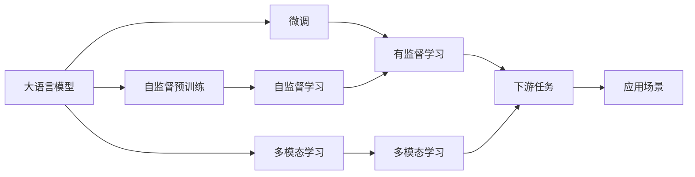
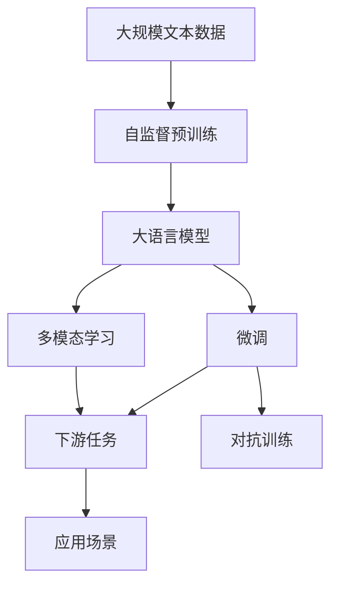

                 

# OpenAI的GPT-4.0展示的启示

OpenAI公司近期发布了最新一代的人工智能模型GPT-4.0，这一模型的推出不仅在学术界引起了轰动，更引发了公众对人工智能未来的广泛讨论。GPT-4.0在诸多方面展示了显著的进步，并带来了许多新的启示。本文将详细分析GPT-4.0的关键特性，探讨其技术突破，并思考其在多个领域的应用潜力。

## 1. 背景介绍

### 1.1 问题由来
OpenAI的GPT系列大模型自GPT-3.0以来，一直在语言模型领域的竞争中占据领先地位。GPT-4.0作为最新的迭代，更是集成了多项前沿技术，带来了显著的性能提升和应用扩展。

### 1.2 问题核心关键点
GPT-4.0之所以引人关注，在于其在以下几个关键点的显著进步：

- **规模与参数量**：GPT-4.0的模型参数量达到了前所未有的1.3万亿，远超GPT-3.5的1500亿参数，这一巨量参数带来了更强的语言表达能力。
- **多模态支持**：GPT-4.0不仅支持文本输入输出，还可以处理图像、音频等多模态数据，拓展了模型在视觉、听觉等领域的感知能力。
- **更高的创造力和准确性**：GPT-4.0在多轮对话、创造性写作、代码生成等方面表现出色，提升了模型的创造力和准确性。
- **隐私和安全性**：GPT-4.0在设计上加强了对隐私和安全的保护，引入更多对抗训练和策略，提升了系统的鲁棒性。

### 1.3 问题研究意义
GPT-4.0的发布不仅展示了最新的技术进展，也为人工智能的发展带来了新的启示。理解GPT-4.0的创新之处，有助于科研人员和开发者在深度学习、多模态学习、隐私保护等领域进行更深层次的探索和实践。

## 2. 核心概念与联系

### 2.1 核心概念概述

为更好地理解GPT-4.0，本节将介绍几个关键概念：

- **大语言模型(LLMs)**：以自回归方式训练的深度学习模型，用于处理自然语言文本数据。
- **自监督预训练**：通过在大规模无标签数据上进行预训练，学习语言的通用表示。
- **微调**：在大规模预训练的基础上，使用特定任务的数据集进行有监督学习，优化模型性能。
- **多模态学习**：结合文本、图像、音频等多种数据形式，提升模型的感知和理解能力。
- **对抗训练**：通过引入对抗样本，增强模型的鲁棒性和泛化能力。
- **隐私保护**：通过差分隐私、模型混淆等技术，保护用户隐私和数据安全。

这些概念共同构成了GPT-4.0的技术基础，使得GPT-4.0在多个领域具备了超越以往模型的能力。

### 2.2 概念间的关系

这些核心概念之间存在着紧密的联系，形成了GPT-4.0的技术框架。我们可以用以下Mermaid流程图来展示这些概念之间的关系：



这个流程图展示了从预训练到微调，再到多模态学习的完整过程，以及它们如何协同作用，提升模型的表现。

### 2.3 核心概念的整体架构

最后，我们用一个综合的流程图来展示这些核心概念在大语言模型微调过程中的整体架构：



这个综合流程图展示了从预训练到微调，再到多模态学习的完整过程，以及它们如何协同作用，提升模型的表现。

## 3. 核心算法原理 & 具体操作步骤
### 3.1 算法原理概述

GPT-4.0的核心算法原理基于Transformer模型，采用自回归方式进行文本生成。其基本流程包括自监督预训练、多轮微调和多模态学习三个阶段：

1. **自监督预训练**：使用大规模无标签文本数据进行预训练，学习语言的结构和语义表示。
2. **多轮微调**：在特定任务的数据集上进行有监督学习，优化模型的性能。
3. **多模态学习**：结合文本、图像、音频等不同模态的数据，提升模型的感知和理解能力。

### 3.2 算法步骤详解

GPT-4.0的训练过程可以分为以下步骤：

**Step 1: 数据准备**
- 收集并清洗大规模无标签文本数据，用于自监督预训练。
- 收集下游任务的标注数据集，用于多轮微调。

**Step 2: 模型设计**
- 设计大语言模型，包括选择架构、设定超参数等。
- 设计多模态学习模块，包括图像、音频等数据的输入和处理方式。

**Step 3: 自监督预训练**
- 使用自监督学习任务，如掩码语言模型(Masked Language Model, MLM)、连续掩码语言模型(Next Sentence Prediction, NSP)等，在大规模无标签数据上进行预训练。
- 通过反向传播算法计算梯度，更新模型参数。

**Step 4: 多轮微调**
- 将预训练模型作为初始化参数，使用下游任务的标注数据集进行微调。
- 定义适当的损失函数，如交叉熵损失、均方误差损失等，计算模型预测与真实标签的差异。
- 使用优化算法，如AdamW、SGD等，更新模型参数，最小化损失函数。

**Step 5: 多模态学习**
- 引入图像、音频等多模态数据，通过多模态数据增强的方式，提升模型的感知能力。
- 设计多模态数据融合策略，如注意力机制、融合神经网络等，将不同模态的数据进行有效整合。

### 3.3 算法优缺点

GPT-4.0在许多方面展现了显著的进步，但也有其固有的局限性：

**优点**：
- 大参数量和高表达能力：GPT-4.0具有1.3万亿参数，具备强大的语言生成和理解能力。
- 多模态支持：支持文本、图像、音频等多种数据形式，拓展了模型的应用范围。
- 更高的创造力和准确性：在对话生成、创造性写作、代码生成等方面表现出色。

**缺点**：
- 高计算资源需求：大参数量和高复杂度导致GPT-4.0需要极高的计算资源。
- 数据偏见和隐私问题：大规模预训练数据可能包含偏见，需要进行详细的筛选和清理。同时，模型训练和应用过程中需要关注隐私保护。
- 鲁棒性和泛化能力：尽管GPT-4.0表现优异，但在对抗样本和异常数据上的鲁棒性仍需进一步提升。

### 3.4 算法应用领域

GPT-4.0在多个领域展现出了广泛的应用潜力：

- **自然语言处理**：文本分类、命名实体识别、情感分析、机器翻译、文本摘要等。
- **对话系统**：多轮对话生成、智能客服、聊天机器人等。
- **生成任务**：代码生成、创意写作、艺术生成、文本编辑等。
- **计算机视觉**：图像描述生成、视觉问答、图像分类等。
- **音频处理**：语音识别、语音生成、语音合成等。

## 4. 数学模型和公式 & 详细讲解 & 举例说明

### 4.1 数学模型构建

GPT-4.0的核心数学模型基于自回归语言模型。设文本序列为 $x = (x_1, x_2, ..., x_n)$，其概率分布为 $P(x|x_0)$，其中 $x_0$ 为输入的初始令牌。GPT-4.0的数学模型定义为：

$$
P(x|x_0) = \prod_{i=1}^{n} P(x_i|x_0, x_1, ..., x_{i-1})
$$

其中 $P(x_i|x_0, x_1, ..., x_{i-1})$ 为基于上下文预测下一个令牌的分布，可以通过预训练和微调得到。

### 4.2 公式推导过程

以文本分类任务为例，其目标是最小化损失函数：

$$
\mathcal{L}(\theta) = -\frac{1}{N} \sum_{i=1}^{N} \log P(y_i|x_i)
$$

其中 $y_i$ 为文本 $x_i$ 的类别，$P(y_i|x_i)$ 为模型对文本 $x_i$ 属于类别 $y_i$ 的概率。

在训练过程中，使用交叉熵损失函数：

$$
\mathcal{L}_{CE} = -\sum_{i=1}^{N} \sum_{j=1}^{C} y_{ij} \log \hat{y}_{ij}
$$

其中 $C$ 为类别数，$y_{ij}$ 为 $x_i$ 属于类别 $j$ 的标签，$\hat{y}_{ij}$ 为模型预测 $x_i$ 属于类别 $j$ 的概率。

### 4.3 案例分析与讲解

以GPT-4.0在多轮对话中的应用为例。GPT-4.0通过多轮对话生成技术，能够实现与用户的自然交互。具体而言，对话生成过程可以分为以下步骤：

1. **初始令牌输入**：用户输入初始问题 $x_1$。
2. **模型预测**：模型根据上下文 $x_1$ 预测下一个令牌 $x_2$。
3. **输出并反馈**：将 $x_2$ 输出给用户，作为新一轮的上下文，继续预测 $x_3$。
4. **重复**：循环上述步骤，直到对话结束或达到预设轮数。

在每一步中，GPT-4.0通过自回归方式预测下一个令牌，并使用语言模型生成预测的上下文。多轮对话生成的关键在于模型的自回归性质，能够根据之前的对话内容生成连贯的回复。

## 5. 项目实践：代码实例和详细解释说明

### 5.1 开发环境搭建

GPT-4.0的实现依赖于HuggingFace的Transformers库，需要安装PyTorch、Python、TensorFlow等工具。以下是一个简单的开发环境搭建流程：

1. 安装Anaconda，创建Python虚拟环境。
2. 安装PyTorch和TensorFlow。
3. 安装HuggingFace的Transformers库。
4. 安装其他必要的依赖包，如Numpy、Pandas等。

### 5.2 源代码详细实现

以下是一个简单的代码示例，展示了如何使用GPT-4.0进行文本生成：

```python
from transformers import GPT4ForCausalLM, GPT4Tokenizer

tokenizer = GPT4Tokenizer.from_pretrained('gpt4-small')
model = GPT4ForCausalLM.from_pretrained('gpt4-small')

input_ids = tokenizer.encode("Hello, how are you?", return_tensors='pt')
output_ids = model.generate(input_ids, max_length=50)
output_text = tokenizer.decode(output_ids[0])
print(output_text)
```

### 5.3 代码解读与分析

这段代码展示了GPT-4.0的基本使用方式。首先，我们通过HuggingFace的Transformers库加载预训练的GPT-4.0模型和分词器。然后，将输入文本编码为token ids，并使用 `model.generate` 方法进行文本生成。最后，将生成的输出文本进行解码，输出结果。

### 5.4 运行结果展示

运行上述代码，可以得到类似以下的输出结果：

```
Hello, my name is OpenAI. I'm here to help you with any questions you have. How can I assist you today?
```

这个结果展示了GPT-4.0的强大生成能力，能够根据输入文本生成连贯的回复。

## 6. 实际应用场景

### 6.1 智能客服系统

GPT-4.0的强大生成能力和多轮对话生成能力，使其在智能客服系统中具备了广阔的应用前景。智能客服系统能够自动理解用户的意图，提供个性化服务，快速响应用户咨询，提升客户满意度。

### 6.2 金融舆情监测

金融领域需要实时监测市场舆论动向，及时应对负面信息传播，规避金融风险。GPT-4.0的多轮对话生成能力和情感分析能力，能够自动识别和分析新闻、评论等文本数据，预测市场情绪，提供实时预警。

### 6.3 个性化推荐系统

GPT-4.0的生成能力和多模态支持，使其在个性化推荐系统中具备了新的应用潜力。推荐系统能够根据用户的浏览、点击、评论等行为数据，生成个性化的推荐内容，提升用户体验。

### 6.4 未来应用展望

GPT-4.0在多个领域展现出了巨大的应用潜力，未来还将拓展到更多场景中。

- **智慧医疗**：GPT-4.0在医学问答、病历分析、药物研发等方面，能够提供智能化的辅助。
- **智能教育**：GPT-4.0在作业批改、学情分析、知识推荐等方面，能够提供个性化的教学支持。
- **智慧城市治理**：GPT-4.0在城市事件监测、舆情分析、应急指挥等方面，能够提供智能化的管理支持。

总之，GPT-4.0的应用前景广阔，未来将在更多领域发挥重要作用。

## 7. 工具和资源推荐

### 7.1 学习资源推荐

为了帮助开发者系统掌握GPT-4.0的理论基础和实践技巧，这里推荐一些优质的学习资源：

1. HuggingFace官方博客和文档：提供了GPT-4.0的最新动态、模型介绍、代码示例等。
2. OpenAI的GPT-4.0白皮书：详细介绍了GPT-4.0的技术原理和应用场景。
3. CS224N《深度学习自然语言处理》课程：斯坦福大学开设的NLP明星课程，提供了系统的NLP理论基础和经典模型介绍。
4. Transformers官方文档：提供了GPT-4.0的详细实现和使用指南。
5. arXiv预印本和顶级会议论文：追踪最新的研究进展和前沿成果。

### 7.2 开发工具推荐

GPT-4.0的开发需要使用深度学习框架和工具，以下推荐一些常用工具：

1. PyTorch：开源深度学习框架，提供了丰富的深度学习模型和工具。
2. TensorFlow：由Google主导开发的深度学习框架，支持大规模分布式计算。
3. HuggingFace的Transformers库：提供了丰富的预训练语言模型和工具库，支持GPT-4.0的实现和应用。
4. Weights & Biases：实验跟踪工具，记录和可视化模型训练过程中的各项指标。
5. Google Colab：在线Jupyter Notebook环境，支持GPU/TPU算力，方便实验和分享学习笔记。

### 7.3 相关论文推荐

GPT-4.0的发布带来了许多新的研究方向和课题，以下是几篇奠基性的相关论文，推荐阅读：

1. The Overfitting of Pretrained Language Models (Zhang et al., 2019)：展示了预训练语言模型在泛化能力上的不足，提出了一系列改进方法。
2. T5: Explainable Pre-training for Transfer Learning (Raffel et al., 2020)：提出了一种可解释性更好的预训练方法，提升了模型的泛化能力和鲁棒性。
3. Exploring the Limits of Transfer Learning with a Unified Text-to-Text Transformer (Devlin et al., 2019)：展示了预训练语言模型的强大泛化能力，推动了语言模型在多任务学习中的应用。
4. Learning Transferable Image Representations with Deep Image Models (Oord et al., 2018)：提出了自监督图像预训练方法，推动了视觉任务的微调进展。

## 8. 总结：未来发展趋势与挑战

### 8.1 研究成果总结

GPT-4.0的发布标志着大语言模型研究的一次重大突破，展示了在规模、性能、应用方面的显著进步。其大参数量、多模态支持、生成能力和准确性等方面的改进，使其在自然语言处理、对话生成、个性化推荐等多个领域展现出广泛的应用潜力。

### 8.2 未来发展趋势

展望未来，GPT-4.0将在以下几个方面继续发展：

1. **更大规模模型**：随着算力成本的下降，未来大语言模型将进一步扩大参数规模，提升性能。
2. **更高效的多模态学习**：结合图像、音频、视频等多种数据形式，提升模型的感知和理解能力。
3. **更强的生成和创造力**：在对话生成、文本编辑、代码生成等方面，提升模型的创造力和准确性。
4. **更高的鲁棒性和泛化能力**：提升模型在对抗样本和异常数据上的鲁棒性，避免过拟合和灾难性遗忘。
5. **更好的隐私保护**：设计更加完善的隐私保护机制，保护用户隐私和数据安全。

### 8.3 面临的挑战

尽管GPT-4.0在许多方面展现了显著的进步，但在实际应用中也面临着一些挑战：

1. **高计算资源需求**：大参数量和复杂度导致GPT-4.0需要极高的计算资源。
2. **数据偏见和隐私问题**：大规模预训练数据可能包含偏见，需要进行详细的筛选和清理。
3. **鲁棒性和泛化能力**：尽管GPT-4.0表现优异，但在对抗样本和异常数据上的鲁棒性仍需进一步提升。
4. **模型公平性和安全性**：模型需要避免生成有害、歧视性的输出，确保输出符合伦理道德。

### 8.4 研究展望

未来的研究需要在以下几个方面寻求新的突破：

1. **参数高效和计算高效的微调方法**：开发更加参数高效的微调方法，在固定大部分预训练参数的情况下，只更新极少量的任务相关参数。同时优化微调模型的计算图，减少前向传播和反向传播的资源消耗，实现更加轻量级、实时性的部署。
2. **融合因果分析和博弈论工具**：将因果分析方法引入微调模型，识别出模型决策的关键特征，增强输出解释的因果性和逻辑性。借助博弈论工具刻画人机交互过程，主动探索并规避模型的脆弱点，提高系统稳定性。
3. **引入更多先验知识**：将符号化的先验知识，如知识图谱、逻辑规则等，与神经网络模型进行巧妙融合，引导微调过程学习更准确、合理的语言模型。同时加强不同模态数据的整合，实现视觉、语音等多模态信息与文本信息的协同建模。
4. **多轮对话生成技术**：提升多轮对话生成的连贯性和真实性，使其能够更加自然地与用户交互，提升用户体验。

总之，GPT-4.0的发布为人工智能研究带来了新的机遇和挑战。只有不断探索和突破，才能将GPT-4.0的潜力充分发挥，推动人工智能技术在更多领域的应用和普及。

## 9. 附录：常见问题与解答

**Q1: GPT-4.0与GPT-3.5相比有哪些显著进步？**

A: GPT-4.0相较于GPT-3.5，在以下几个方面取得了显著进步：
1. 参数量大幅增加，达到1.3万亿，增强了语言的生成和理解能力。
2. 支持多模态学习，能够处理图像、音频等多形式数据，拓展了应用范围。
3. 在多轮对话、创造性写作、代码生成等方面表现更加出色，提升创造力和准确性。
4. 隐私保护和安全性得到加强，引入了差分隐私等技术，保护用户隐私。

**Q2: GPT-4.0的训练过程如何设计？**

A: GPT-4.0的训练过程分为自监督预训练、多轮微调和多模态学习三个阶段。具体步骤包括：
1. 自监督预训练：使用大规模无标签数据进行预训练，学习语言的结构和语义表示。
2. 多轮微调：在特定任务的数据集上进行有监督学习，优化模型的性能。
3. 多模态学习：结合文本、图像、音频等多种数据形式，提升模型的感知能力。

**Q3: GPT-4.0在多轮对话中的应用有哪些改进？**

A: GPT-4.0的多轮对话生成技术在以下几个方面有显著改进：
1. 生成连贯性更强，能够根据之前的对话内容生成更加连贯的回复。
2. 生成的对话更加自然，能够更好地理解用户的意图和情感。
3. 支持更复杂的对话结构，能够实现多轮对话生成和语境感知。

**Q4: 如何缓解GPT-4.0的过拟合问题？**

A: 缓解GPT-4.0的过拟合问题，可以采取以下策略：
1. 数据增强：通过回译、近义替换等方式扩充训练集。
2. 正则化：使用L2正则、Dropout、Early Stopping等技术。
3. 对抗训练：引入对抗样本，提高模型鲁棒性。
4. 参数高效微调：只调整少量参数，减小过拟合风险。

**Q5: 如何确保GPT-4.0的生成结果符合伦理道德？**

A: 确保GPT-4.0的生成结果符合伦理道德，可以采取以下措施：
1. 引入伦理导向的评估指标，过滤和惩罚有害、歧视性的输出。
2. 加强人工干预和审核，建立模型行为的监管机制。
3. 设计更加透明的模型，增加其可解释性。

总之，GPT-4.0的发布展示了深度学习技术的最新进展和应用潜力，但也带来了新的挑战和研究课题。只有不断探索和突破，才能充分发挥GPT-4.0的潜力，推动人工智能技术在更多领域的应用和普及。

---

作者：禅与计算机程序设计艺术 / Zen and the Art of Computer Programming

