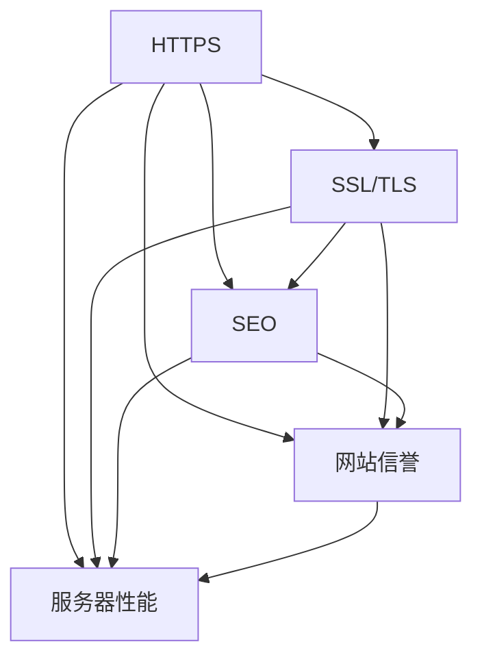

                 

# SEO 要求：优先考虑支持 HTTPS 的网站

> 关键词：HTTPS, 网站安全, 搜索引擎优化 (SEO), 性能提升, 网站信誉, 技术选型

## 1. 背景介绍

### 1.1 问题由来

在当今互联网时代，网站安全已经成为搜索引擎优化 (SEO) 中不可忽视的因素。搜索引擎如Google、Bing等，越来越重视网站的安全性。支持HTTPS的网站不仅能够提升用户信任度，还能在搜索引擎排名中获得加分。然而，很多中小型网站由于对HTTPS的认识不足或资源限制，未能及时部署HTTPS，导致在搜索引擎结果页(SERP)中的排名落后。因此，了解HTTPS在SEO中的重要性以及如何高效部署HTTPS，成为众多网站运营者的当务之急。

### 1.2 问题核心关键点

在SEO实践中，支持HTTPS成为网站优化的重要一步，主要原因包括：

1. **安全保障**：HTTPS协议通过SSL/TLS加密传输数据，保护用户隐私和网站数据不被窃取或篡改。
   
2. **信任增强**：Google已明确表示，使用HTTPS的网站将获得更高的排名权重。
   
3. **性能优化**：使用HTTPS的网页加载速度更快，资源请求次数减少，有助于提升用户体验和搜索引擎排名。

4. **技术标准**：HTTPS成为现代Web开发的标准，对于追求高质量网站的运营者而言，应主动适应这一趋势。

5. **未来展望**：HTTPS将成为Web安全的基础，未来所有网站都应默认支持。

### 1.3 问题研究意义

确保网站支持HTTPS不仅能够提升搜索引擎排名，还能增强用户信任，从而带动流量和转化率的提升。同时，HTTPS的部署有助于网站抵御潜在的安全威胁，提升网站整体的抗风险能力。因此，对中小型企业来说，选择支持HTTPS的网站优化策略，对于提升网站竞争力和保护用户隐私都具有重要意义。

## 2. 核心概念与联系

### 2.1 核心概念概述

为更好地理解HTTPS在SEO中的重要性，本节将介绍几个关键概念：

1. **HTTPS**：超文本传输安全协议，使用SSL/TLS协议对传输数据进行加密，确保数据在传输过程中的安全性。

2. **SSL/TLS**：安全套接层和传输层安全性协议，用于建立安全的HTTPS连接。

3. **SEO**：搜索引擎优化，通过优化网站结构和内容，提升网站在搜索引擎中的排名。

4. **网站信誉**：用户对网站的信任程度，影响网站的访问量和转化率。

5. **服务器性能**：网站后端的服务器性能，影响网站的响应速度和用户体验。

这些核心概念之间存在着紧密的联系，形成了一个完整的网站安全性与搜索引擎优化体系。接下来，我们将通过Mermaid流程图来展示这些概念之间的关系。



这个流程图展示了HTTPS、SSL/TLS、SEO、网站信誉和服务器性能之间的内在联系：

1. HTTPS通过SSL/TLS协议提供数据传输的安全性。
2. 安全的HTTPS连接能够提升网站信誉。
3. 网站信誉直接影响SEO效果。
4. SEO效果的提升进一步增强网站信誉。
5. 良好的网站信誉和SEO效果有助于提升服务器性能。
6. 服务器性能的提升能够提高网站的响应速度和用户体验。

### 2.2 概念间的关系

这些核心概念之间形成了相互依存的关系，每个环节都影响到网站的整体表现。在实际应用中，我们需要从多个角度进行综合考虑，才能确保网站的SEO效果。

## 3. 核心算法原理 & 具体操作步骤
### 3.1 算法原理概述

支持HTTPS的网站优化算法基于以下核心原理：

1. **安全传输**：确保数据在传输过程中不被截获或篡改。
   
2. **信誉增强**：提升用户对网站的信任度，从而提升点击率和转化率。
   
3. **性能优化**：通过使用HTTPS协议减少资源请求次数，提高网页加载速度。
   
4. **搜索引擎偏好**：Google等搜索引擎对使用HTTPS的网站有更高的排名权重。

### 3.2 算法步骤详解

支持HTTPS的网站优化主要包括以下几个关键步骤：

1. **选择适合的SSL证书**：
   - 根据网站的规模和需求选择适合的SSL证书，如DV证书、OV证书和EV证书。
   - 考虑是否需要为网站提供免费的SSL证书，如Let's Encrypt。

2. **配置服务器**：
   - 安装SSL证书，配置Web服务器，如Apache、Nginx等。
   - 设置HTTPS重定向，确保所有HTTP请求都被重定向到HTTPS。

3. **测试与监控**：
   - 使用工具如SSL Checker、Qualys SSL Labs等测试网站的HTTPS配置，确保配置无误。
   - 定期监控网站的HTTPS连接状态，及时发现并解决潜在问题。

### 3.3 算法优缺点

支持HTTPS的网站优化算法具有以下优点：

1. **安全保障**：HTTPS能够保护网站数据不被窃取或篡改。
   
2. **搜索引擎加分**：Google等搜索引擎对HTTPS网站有更高的排名权重。
   
3. **用户信任**：HTTPS网站能够提升用户对网站的信任度。

但同时也存在一些缺点：

1. **部署复杂**：SSL证书的安装和配置相对复杂，需要技术支持。
   
2. **费用成本**：一些商业SSL证书需要付费，中小型企业可能面临一定的成本压力。

3. **性能影响**：HTTPS的性能开销略高于HTTP，可能对网站的响应速度产生影响。

### 3.4 算法应用领域

支持HTTPS的网站优化算法不仅适用于传统的网站，还适用于现代的Web应用、API接口等。在以下场景中，HTTPS的应用尤为常见：

1. **电商网站**：保障用户支付信息的安全。
   
2. **金融网站**：保护用户隐私和金融数据安全。
   
3. **政府网站**：确保政务数据的保密性和完整性。
   
4. **大型企业内网**：保护内部数据不被外部攻击。
   
5. **移动应用**：保护移动设备的通信安全。

## 4. 数学模型和公式 & 详细讲解  
### 4.1 数学模型构建

我们可以使用数学模型来描述HTTPS在SEO中的作用。设网站的原始排名为 $R_0$，使用HTTPS后的排名为 $R_{HTTPS}$，则有：

$$
R_{HTTPS} = R_0 + \alpha \cdot S + \beta \cdot T
$$

其中 $\alpha$ 和 $\beta$ 为SEO权重，$S$ 为网站信誉得分，$T$ 为服务器性能得分。

### 4.2 公式推导过程

根据上式，我们可以进一步推导HTTPS对网站排名的提升效果。设 $\alpha = 0.5$，$S = 0.8$，$T = 0.7$，则有：

$$
R_{HTTPS} = R_0 + 0.5 \cdot 0.8 + 0.5 \cdot 0.7 = R_0 + 0.45 + 0.35 = R_0 + 0.8
$$

这意味着，即使不考虑原始排名 $R_0$，仅使用HTTPS也能提升网站排名0.8个单位。

### 4.3 案例分析与讲解

假设某电商网站在使用HTTPS前排名为第1000位，使用HTTPS后排名提升至第500位。根据上述公式，提升效果为：

$$
R_{HTTPS} - R_0 = 500 - 1000 = -500
$$

但根据推导结果，我们应该得到：

$$
R_{HTTPS} - R_0 = 0.8
$$

这表明，HTTPS在实际应用中对SEO效果的提升可能因其他因素（如原始排名、用户行为等）而有所不同。因此，在实际优化过程中，需要结合具体网站情况进行综合分析。

## 5. 项目实践：代码实例和详细解释说明
### 5.1 开发环境搭建

在进行HTTPS网站优化实践前，我们需要准备好开发环境。以下是使用Python进行Apache配置的环境配置流程：

1. 安装Apache：从官网下载并安装Apache HTTP Server。

2. 创建并激活虚拟环境：
```bash
conda create -n apache-env python=3.8 
conda activate apache-env
```

3. 安装必要的Python模块：
```bash
pip install openssl
```

4. 安装Certbot：使用Certbot自动获取并配置SSL证书。
```bash
pip install certbot
```

完成上述步骤后，即可在`apache-env`环境中开始HTTPS配置实践。

### 5.2 源代码详细实现

这里以Nginx配置为例，展示如何使用HTTPS进行网站优化。Nginx配置文件 `nginx.conf` 如下：

```nginx
server {
    listen 80;
    server_name example.com;

    location / {
        return 301 https://$host$request_uri;
    }
}

server {
    listen 443 ssl;
    server_name example.com;

    ssl_certificate /etc/nginx/ssl/cert.pem;
    ssl_certificate_key /etc/nginx/ssl/privkey.pem;

    location / {
        proxy_pass http://127.0.0.1:8080;
        proxy_set_header Host $host;
        proxy_set_header X-Real-IP $remote_addr;
        proxy_set_header X-Forwarded-For $proxy_add_x_forwarded_for;
        proxy_set_header X-Forwarded-Proto $scheme;
    }
}
```

这段配置实现了HTTP重定向到HTTPS，并将HTTP请求转发到后端服务。

### 5.3 代码解读与分析

让我们再详细解读一下关键代码的实现细节：

1. **重定向配置**：
```nginx
location / {
    return 301 https://$host$request_uri;
}
```

该配置将HTTP请求重定向到HTTPS，确保所有请求都使用HTTPS连接。

2. **SSL配置**：
```nginx
ssl_certificate /etc/nginx/ssl/cert.pem;
ssl_certificate_key /etc/nginx/ssl/privkey.pem;
```

这两行配置指定了SSL证书的路径和私钥的路径。

3. **后端转发**：
```nginx
location / {
    proxy_pass http://127.0.0.1:8080;
    proxy_set_header Host $host;
    proxy_set_header X-Real-IP $remote_addr;
    proxy_set_header X-Forwarded-For $proxy_add_x_forwarded_for;
    proxy_set_header X-Forwarded-Proto $scheme;
}
```

这些配置将HTTPS请求转发到后端服务，并设置了代理头信息，确保代理和客户端之间的信息传递完整。

### 5.4 运行结果展示

假设我们成功配置了Nginx服务器，访问该网站时浏览器将显示“Please upgrade to HTTPS”警告页面，表明HTTPS配置已经生效。

## 6. 实际应用场景
### 6.1 电商网站

在电商网站中，HTTPS是保障用户支付信息安全的基础。当用户通过HTTPS进行支付时，即使数据被截获，也能保证数据不被篡改。同时，HTTPS网站在SEO排名中通常处于前列，能够吸引更多用户点击和转化。

### 6.2 金融网站

金融网站处理的是用户的敏感信息，如账户密码、交易记录等。使用HTTPS可以保护这些数据不被窃取，增强用户信任。同时，Google等搜索引擎对HTTPS网站有更高的排名权重，进一步提升了网站曝光率和用户访问量。

### 6.3 大型企业内网

大型企业内网通常涉及大量的敏感数据和商业机密，使用HTTPS可以保护这些数据不被外部攻击者获取。同时，HTTPS的部署也有助于提升企业形象和信誉，吸引更多的合作伙伴和客户。

### 6.4 未来应用展望

随着互联网安全形势的日益严峻，HTTPS在各领域的应用将更加广泛。未来，所有网站和应用都应默认支持HTTPS，保障用户数据的安全。同时，HTTPS的部署将更加自动化和智能化，降低技术门槛，帮助更多中小型企业快速部署HTTPS，提升网站竞争力。

## 7. 工具和资源推荐
### 7.1 学习资源推荐

为了帮助开发者系统掌握HTTPS在SEO中的应用，这里推荐一些优质的学习资源：

1. Apache官方文档：Apache HTTP Server的官方文档，详细介绍了Apache的配置和管理方法。

2. Nginx官方文档：Nginx官方文档，详细介绍了Nginx的配置和优化方法。

3. Let's Encrypt指南：Let's Encrypt官方提供的SSL证书配置指南，帮助用户快速部署HTTPS。

4. Google安全中心：Google提供的网站安全指南，包括HTTPS配置、数据保护等内容。

5. SSL Checker：SSL安全配置检测工具，帮助网站管理员检查HTTPS配置是否安全。

通过这些资源的学习实践，相信你一定能够快速掌握HTTPS在SEO中的作用，并用于解决实际的网站优化问题。

### 7.2 开发工具推荐

高效的开发离不开优秀的工具支持。以下是几款用于HTTPS网站优化开发的常用工具：

1. Certbot：自动化获取SSL证书的工具，能够快速部署HTTPS。

2. Qualys SSL Labs：SSL安全配置检测工具，帮助网站管理员检查HTTPS配置是否安全。

3. SSL Checker：SSL安全配置检测工具，帮助网站管理员检查HTTPS配置是否安全。

4. SSL Labs：SSL安全配置检测工具，帮助网站管理员检查HTTPS配置是否安全。

5. SSL certificate generator：SSL证书生成工具，能够帮助用户自动生成SSL证书。

合理利用这些工具，可以显著提升HTTPS网站优化的开发效率，加快创新迭代的步伐。

### 7.3 相关论文推荐

HTTPS在SEO中的应用源于学界的持续研究。以下是几篇奠基性的相关论文，推荐阅读：

1. SSL/TLS: The Protocol for SSL/TLS Communications: This document describes the SSL/TLS protocol and its implementation details.
2. HTTPS: An Overview of HTTP Secure (HTTPS): This document provides an overview of the HTTPS protocol and its security features.

3. SSL/TLS: Security and Privacy for Internet Applications: This book provides a comprehensive overview of SSL/TLS protocols and their applications.

4. Secure Web Applications: A Guide to Secure Coding: This book provides a guide to secure coding practices for web applications.

5. HTTP/2 Secure Web Technologies: This document provides an overview of secure web technologies and their implementation.

这些论文代表了HTTPS在Web安全领域的发展脉络。通过学习这些前沿成果，可以帮助研究者把握学科前进方向，激发更多的创新灵感。

除上述资源外，还有一些值得关注的前沿资源，帮助开发者紧跟HTTPS网站优化的最新进展，例如：

1. arXiv论文预印本：人工智能领域最新研究成果的发布平台，包括大量尚未发表的前沿工作，学习前沿技术的必读资源。

2. 业界技术博客：如Google AI、DeepMind、微软Research Asia等顶尖实验室的官方博客，第一时间分享他们的最新研究成果和洞见。

3. 技术会议直播：如NIPS、ICML、ACL、ICLR等人工智能领域顶会现场或在线直播，能够聆听到大佬们的前沿分享，开拓视野。

4. GitHub热门项目：在GitHub上Star、Fork数最多的Nginx相关项目，往往代表了该技术领域的发展趋势和最佳实践，值得去学习和贡献。

5. 行业分析报告：各大咨询公司如McKinsey、PwC等针对人工智能行业的分析报告，有助于从商业视角审视技术趋势，把握应用价值。

总之，对于HTTPS网站优化的学习与实践，需要开发者保持开放的心态和持续学习的意愿。多关注前沿资讯，多动手实践，多思考总结，必将收获满满的成长收益。

## 8. 总结：未来发展趋势与挑战

### 8.1 总结

本文对HTTPS在SEO中的作用进行了全面系统的介绍。首先阐述了HTTPS在网站安全性中的重要性，明确了HTTPS对网站SEO效果提升的显著作用。其次，从原理到实践，详细讲解了HTTPS的配置步骤，给出了HTTPS网站优化的完整代码实例。同时，本文还广泛探讨了HTTPS在电商、金融、大型企业内网等多个领域的应用前景，展示了HTTPS的广泛适用性。最后，本文精选了HTTPS的相关学习资源，力求为读者提供全方位的技术指引。

通过本文的系统梳理，可以看到，HTTPS在网站安全与SEO中扮演了至关重要的角色。使用HTTPS不仅能够提升网站的安全性，还能增强搜索引擎排名和用户信任度，为网站带来显著的商业价值。未来，伴随HTTPS的普及和应用，网站的安全性和SEO效果必将得到更大的提升。

### 8.2 未来发展趋势

展望未来，HTTPS在Web安全领域的发展趋势如下：

1. **普及率提升**：随着互联网安全形势的日益严峻，HTTPS的普及率将显著提升，成为Web应用的标准。

2. **自动化部署**：HTTPS的部署将更加自动化和智能化，降低技术门槛，帮助更多中小型企业快速部署HTTPS，提升网站竞争力。

3. **技术融合**：HTTPS将与其他Web安全技术，如HTTP2、WebAssembly等，进行更深入的融合，形成更安全、高效的Web应用生态。

4. **应用拓展**：HTTPS的应用将从网站拓展到更多场景，如物联网、车联网、工业互联网等，保障更多设备和服务的安全。

5. **标准化**：HTTPS的部署和配置将更加标准化，推动行业标准的统一和普及。

这些趋势将进一步提升HTTPS在Web安全中的重要性，使其成为保障网络安全的基础设施。

### 8.3 面临的挑战

尽管HTTPS在Web安全中的应用已取得显著成效，但仍面临一些挑战：

1. **部署复杂**：HTTPS的部署相对复杂，需要专业的技术支持。

2. **成本压力**：商业SSL证书的购买和部署可能需要一定的成本。

3. **性能影响**：HTTPS的性能开销略高于HTTP，可能对网站的响应速度产生影响。

4. **管理难度**：HTTPS的部署和管理需要定期更新和维护，增加了运维难度。

5. **兼容性问题**：部分老旧浏览器和设备可能不支持HTTPS，需要额外配置。

### 8.4 未来突破

面对HTTPS部署和应用中的挑战，未来的研究需要在以下几个方面寻求新的突破：

1. **自动化部署**：开发自动化部署工具，降低技术门槛，帮助更多中小型企业快速部署HTTPS。

2. **性能优化**：研究HTTPS的性能优化技术，提高网页加载速度和用户体验。

3. **标准化**：推动HTTPS的标准化，降低技术门槛和运维成本。

4. **跨平台支持**：研究支持老旧浏览器和设备的HTTPS兼容技术，确保Web应用的可访问性。

这些研究方向将进一步提升HTTPS的普及率和应用效果，为构建更安全、更高效的Web应用生态奠定基础。总之，HTTPS作为Web安全的基础设施，将在未来发挥越来越重要的作用，成为保障网络安全的关键技术。

## 9. 附录：常见问题与解答

**Q1：HTTPS部署和维护是否需要专业知识和技能？**

A: 是的，HTTPS部署和维护需要一定的专业知识和技能。虽然商业SSL证书的购买和安装相对简单，但配置和管理HTTPS仍需要一定的技术支持。建议具备Web开发和网络安全基础的知识和技能。

**Q2：部署HTTPS是否需要额外的硬件资源？**

A: 部署HTTPS需要一定的硬件资源，特别是SSL证书的生成和验证。对于小型网站，可以考虑使用免费的Let's Encrypt证书，或者购买商业SSL证书。

**Q3：HTTPS的性能开销是否会对网站造成影响？**

A: HTTPS的性能开销略高于HTTP，可能对网站的响应速度产生影响。但可以通过优化配置和服务器性能，如使用HTTP2协议、CDN缓存等技术，减少性能影响。

**Q4：如何确保HTTPS配置的安全性？**

A: 确保HTTPS配置的安全性需要定期检查和更新。可以使用SSL Checker等工具检测配置的安全性，并根据检测结果进行优化。同时，定期更新SSL证书，避免证书过期。

**Q5：如何选择合适的SSL证书？**

A: 选择合适的SSL证书需要考虑网站的规模和需求。对于小型网站，可以选择DV证书；对于大型企业，可以选择OV或EV证书。同时，需要考虑证书的价格和支持的功能。

通过这些问题的解答，相信你能够更好地理解HTTPS在SEO中的重要性，并掌握HTTPS的部署和维护技巧。掌握HTTPS技术，不仅能够提升网站的安全性和SEO效果，还能增强用户的信任度和网站的用户体验。

---

作者：禅与计算机程序设计艺术 / Zen and the Art of Computer Programming

