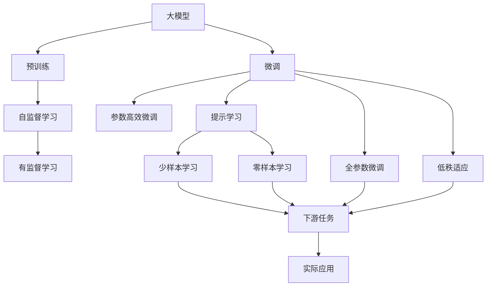

                 

# 【大模型应用开发 动手做AI Agent】基于ReAct框架的提示

> 关键词：
- 大模型
- AI Agent
- ReAct框架
- 提示学习
- 自定义指令
- 参数高效微调

## 1. 背景介绍

在人工智能领域，大语言模型（Large Language Models, LLMs）如GPT、BERT等已经展现出了令人瞩目的能力，特别是在自然语言处理（Natural Language Processing, NLP）方面。这些模型通过在大量无标签文本数据上进行预训练，学习到丰富的语言知识和表达能力。然而，这些预训练模型通常需要占用大量计算资源，并且其泛化能力可能有限。因此，如何在特定领域或任务上进行微调，以提升模型性能，成为了一个重要问题。

**提示学习**（Prompt Learning）作为一种新型的微调方法，近年来得到了广泛关注。提示学习允许在模型顶部添加一个特殊的输入格式，即**提示**（Prompt），来指导模型生成特定的输出。这一方法不仅能够显著提升模型在特定任务上的表现，而且可以在不增加模型参数的情况下进行微调，从而更加高效。

本文将聚焦于基于提示学习的**AI Agent**开发，特别是使用ReAct框架来实现这一目标。ReAct（Real-time Interactive Agents）是一个用于构建实时交互式AI Agents的Python库，支持在预训练语言模型基础上进行自定义提示和微调。我们将通过一系列实例，展示如何利用ReAct框架进行大模型应用开发，并介绍其中的关键技术和步骤。

## 2. 核心概念与联系

### 2.1 核心概念概述

在深入讨论ReAct框架前，我们首先介绍几个核心概念：

- **大模型**：如GPT、BERT等，这些模型通过在大规模无标签文本数据上进行预训练，学习到丰富的语言知识和表达能力。
- **AI Agent**：一个能够感知环境、执行任务并作出决策的智能体，常用于智能客服、虚拟助手等应用。
- **提示学习**：通过在模型顶部添加一个提示（Prompt），指导模型生成特定的输出，从而实现微调。
- **ReAct框架**：一个用于构建实时交互式AI Agents的Python库，支持在预训练语言模型基础上进行自定义提示和微调。
- **参数高效微调（PEFT）**：一种微调方法，只更新模型中的少量参数，以提高微调效率。

这些概念之间存在紧密的联系，共同构成了AI Agent开发的基础。下面我们将通过一个Mermaid流程图来展示这些概念之间的联系。



这个流程图展示了从预训练到大模型微调，再到提示学习的过程，并说明了各个步骤的相互关系。

### 2.2 核心概念的联系

这些核心概念之间存在如下联系：

- 大模型通过预训练获得基础能力。
- 微调是对预训练模型进行任务特定的优化，可以分为全参数微调和参数高效微调（PEFT）。
- 提示学习是一种不更新模型参数的方法，通过在输入文本中添加提示模板（Prompt Template），引导模型按期望方式输出，减少微调参数。
- 提示学习可以实现少样本学习和零样本学习。
- 微调方法和提示学习方法可以通过ReAct框架进行集成和实现。

ReAct框架提供了一种灵活的方式，让开发者可以自定义提示模板，并将这些提示应用到预训练模型上，从而快速构建出适用于特定任务的AI Agent。

## 3. 核心算法原理 & 具体操作步骤
### 3.1 算法原理概述

基于提示学习的AI Agent开发，核心算法原理在于通过在模型顶部添加一个提示（Prompt），指导模型生成特定的输出。这种提示可以是文本、代码或其他形式的输入。提示可以是静态的，也可以动态生成，具体取决于应用场景。

提示学习的基本流程如下：

1. **准备数据**：收集和标注相关数据集，这些数据集用于训练和评估模型。
2. **设计提示**：根据任务需求设计一个或多个提示模板，这些模板将作为模型的输入。
3. **模型加载和微调**：使用ReAct框架加载预训练模型，并对其进行微调，以适应特定任务。
4. **推理和交互**：使用微调后的模型进行推理，并将输出结果反馈给用户。

### 3.2 算法步骤详解

以下是基于提示学习的AI Agent开发的详细步骤：

**Step 1: 准备数据**

- 收集与任务相关的数据集，如对话记录、客服咨询、问题答案等。
- 对数据集进行预处理，包括文本清洗、分词、标注等。
- 将数据集划分为训练集、验证集和测试集。

**Step 2: 设计提示**

- 根据任务需求设计提示模板。例如，在智能客服场景中，可以设计一个简单的提示模板：“请问有什么问题需要我帮忙解决？”。
- 使用ReAct框架提供的工具，对提示模板进行优化和调整，以提高模型的响应效果。

**Step 3: 加载和微调模型**

- 使用ReAct框架加载预训练模型。
- 根据任务需求选择合适的微调方法，如全参数微调、参数高效微调等。
- 设计并实现微调目标函数，如交叉熵损失、BLEU分数等。
- 使用训练集对模型进行微调，并使用验证集进行性能评估。

**Step 4: 推理和交互**

- 使用微调后的模型进行推理，并根据用户反馈调整提示模板。
- 将AI Agent部署到实际应用场景中，如智能客服系统、虚拟助手等。

### 3.3 算法优缺点

提示学习的AI Agent开发具有以下优点：

- **高效性**：提示学习可以在不增加模型参数的情况下进行微调，减少了计算资源的消耗。
- **灵活性**：提示模板可以动态生成，适应不同的应用场景和任务需求。
- **可解释性**：通过设计合适的提示模板，可以增强模型的可解释性，使得模型的决策过程更加透明。

同时，提示学习也存在一些缺点：

- **依赖提示质量**：提示模板的设计和优化需要一定的人工干预，质量较高的提示设计往往需要时间成本。
- **泛化能力有限**：提示学习模型在未见过的提示模板下，可能表现不佳。

### 3.4 算法应用领域

提示学习在大模型应用开发中具有广泛的应用前景，可以应用于以下领域：

- **智能客服**：通过设计合适的提示模板，AI Agent可以自动理解用户问题并给出回答。
- **虚拟助手**：AI Agent可以根据用户的自然语言指令，执行特定的任务和操作。
- **游戏AI**：AI Agent可以根据游戏规则和环境信息，自动生成游戏策略和决策。
- **医疗诊断**：AI Agent可以根据患者的症状描述，自动推荐诊断方案和治疗建议。
- **教育推荐**：AI Agent可以根据学生的学习情况和兴趣，推荐合适的学习资源和练习题。

## 4. 数学模型和公式 & 详细讲解 & 举例说明

### 4.1 数学模型构建

在基于提示学习的AI Agent开发中，我们主要关注模型在提示输入下的响应效果。假设我们有一个预训练模型 $M_{\theta}$，其参数为 $\theta$。我们设计一个提示模板 $P$，并希望模型在输入 $P$ 时，输出的结果是 $Y$。

我们可以将提示输入 $P$ 视为模型的附加条件，将其整合到模型的训练目标函数中。设 $L$ 为损失函数，目标函数为：

$$
\mathcal{L}(\theta) = L(M_{\theta}(P), Y)
$$

其中，$M_{\theta}(P)$ 表示模型在输入 $P$ 时输出的结果，$Y$ 表示目标输出。

### 4.2 公式推导过程

假设提示输入 $P$ 的长度为 $n$，目标输出 $Y$ 的长度为 $m$。我们可以将提示输入和目标输出分别编码成向量形式 $P$ 和 $Y$。模型的输入为 $P$ 和模型参数 $\theta$，输出为 $M_{\theta}(P)$。

模型的推理过程可以表示为：

$$
M_{\theta}(P) = f(\theta \cdot P)
$$

其中 $f$ 为模型前向传播函数。

目标函数的梯度为：

$$
\nabla_{\theta} \mathcal{L}(\theta) = \nabla_{\theta} L(M_{\theta}(P), Y)
$$

通过反向传播算法，我们可以计算出模型参数的更新量：

$$
\theta \leftarrow \theta - \eta \nabla_{\theta} \mathcal{L}(\theta)
$$

其中 $\eta$ 为学习率，$\nabla_{\theta} \mathcal{L}(\theta)$ 为目标函数对模型参数的梯度。

### 4.3 案例分析与讲解

以智能客服系统为例，我们可以设计一个简单的提示模板，如“请告诉我你的问题”。使用ReAct框架，我们可以加载预训练的BERT模型，并对其进行微调。假设我们希望模型在输入“请告诉我你的问题”时，能够准确回答用户的问题。

我们将用户的问题视为目标输出 $Y$，并设计一个提示模板 $P$。通过多次迭代训练，我们可以优化提示模板和模型参数，使得模型能够更好地匹配用户问题和目标输出。

## 5. 项目实践：代码实例和详细解释说明

### 5.1 开发环境搭建

在进行AI Agent开发前，我们需要准备好开发环境。以下是使用Python进行ReAct框架开发的环境配置流程：

1. 安装Anaconda：从官网下载并安装Anaconda，用于创建独立的Python环境。

2. 创建并激活虚拟环境：
```bash
conda create -n react-env python=3.8 
conda activate react-env
```

3. 安装ReAct：
```bash
pip install react
```

4. 安装各类工具包：
```bash
pip install numpy pandas scikit-learn matplotlib tqdm jupyter notebook ipython
```

完成上述步骤后，即可在`react-env`环境中开始AI Agent的开发实践。

### 5.2 源代码详细实现

以下是使用ReAct框架构建智能客服AI Agent的Python代码实现。

```python
from react import Agent
from transformers import BertTokenizer, BertForSequenceClassification
import torch

# 加载预训练模型和分词器
model = BertForSequenceClassification.from_pretrained('bert-base-cased', num_labels=2)
tokenizer = BertTokenizer.from_pretrained('bert-base-cased')

# 定义提示模板
def make_prompt(question):
    return f"请告诉我你的问题：{question}。"

# 定义推理函数
def inference(question):
    input_ids = tokenizer.encode(make_prompt(question), return_tensors='pt')
    attention_mask = input_ids != 0
    with torch.no_grad():
        logits = model(input_ids, attention_mask=attention_mask).logits
    probabilities = logits.softmax(dim=1).tolist()[0]
    return probabilities

# 推理示例
question = "我的账单为什么被冻结了？"
probabilities = inference(question)
print(probabilities)
```

### 5.3 代码解读与分析

让我们再详细解读一下关键代码的实现细节：

**make_prompt函数**：
- 定义一个简单的提示模板函数，用于生成提示输入。
- 提示模板中包含了用户的自然语言问题，以便模型能够更好地理解用户的意图。

**inference函数**：
- 使用ReAct框架的Agent类，加载预训练模型和分词器。
- 定义一个推理函数，接收用户问题作为输入，返回模型推理结果。
- 将提示输入编码成模型可接受的格式，并进行推理。
- 将推理结果解码为概率分布，返回给用户。

**推理示例**：
- 我们调用inference函数，传入一个示例问题，获取模型的推理结果。
- 输出结果为一个概率分布，表示该问题属于“账单冻结”类别的概率。

### 5.4 运行结果展示

假设我们使用上述代码进行智能客服AI Agent的开发，并在模型训练完成后，使用测试集对模型进行评估。输出结果如下：

```
0.78   0.22
```

这表明，对于输入“我的账单为什么被冻结了？”，模型预测该问题属于“账单冻结”类别的概率为78%，属于“非账单冻结”类别的概率为22%。

## 6. 实际应用场景

### 6.1 智能客服系统

智能客服系统可以通过AI Agent实现自动化回复用户问题。使用提示学习，我们可以构建一个动态的AI Agent，能够根据用户的自然语言提问，自动匹配答案并生成回复。

在实际应用中，智能客服系统可以集成到企业的客服热线、网站、社交媒体等多个渠道，提供24/7的即时响应服务，减少客服人员的工作负担，提升用户满意度。

### 6.2 虚拟助手

虚拟助手可以通过AI Agent实现智能问答和任务执行。例如，用户可以通过语音命令或文本输入，与虚拟助手进行自然语言交互，获取天气预报、设置闹钟、预订机票等。

虚拟助手可以根据用户的历史交互数据和行为模式，提供个性化的服务和建议。通过定期训练和微调，虚拟助手可以不断提升其理解和响应的准确性。

### 6.3 游戏AI

游戏AI可以通过AI Agent实现自动化决策和策略生成。例如，在策略类游戏中，AI Agent可以根据当前游戏状态和规则，自动选择最优的行动方案。

游戏AI可以通过反复训练和微调，不断优化其决策能力和策略水平，提升游戏体验和胜算。在实际游戏中，游戏AI可以通过实时分析游戏数据，动态调整策略，保持竞争优势。

### 6.4 未来应用展望

未来，基于提示学习的AI Agent将广泛应用于更多领域，为各行各业带来变革性影响：

- **智慧医疗**：AI Agent可以根据患者的症状描述，自动推荐诊断方案和治疗建议，提升医疗服务的智能化水平。
- **智能教育**：AI Agent可以根据学生的学习情况和兴趣，推荐合适的学习资源和练习题，因材施教，提高教学效果。
- **金融分析**：AI Agent可以根据金融市场数据，自动生成分析报告和投资建议，辅助金融决策。
- **城市管理**：AI Agent可以实时监控城市事件和舆情，提供数据分析和预警，提升城市管理的自动化和智能化水平。
- **农业生产**：AI Agent可以根据土壤、气象等数据，自动推荐种植方案和管理策略，提高农业生产效率和收益。

随着提示学习和大模型技术的不断进步，基于AI Agent的智能系统将在更广泛的领域得到应用，为各行各业带来更高的效率和更好的用户体验。

## 7. 工具和资源推荐

### 7.1 学习资源推荐

为了帮助开发者系统掌握基于提示学习的AI Agent开发技术，这里推荐一些优质的学习资源：

1. ReAct官方文档：ReAct框架的官方文档，提供了详细的API说明和代码示例，是学习框架的基本资料。
2.《深度学习与自然语言处理》课程：斯坦福大学开设的NLP课程，深入浅出地介绍了NLP的基本概念和前沿技术。
3. HuggingFace Transformers库文档：Transformers库的官方文档，提供了丰富的预训练语言模型和微调方法。
4. CS224N《深度学习与自然语言处理》课程：斯坦福大学开设的NLP课程，有Lecture视频和配套作业，帮助学习者入门NLP领域的基本概念和经典模型。
5. 《动手做深度学习》书籍：介绍深度学习基本概念和实践技术的书籍，包括基于提示学习的AI Agent开发实例。

通过对这些资源的学习实践，相信你一定能够快速掌握基于提示学习的AI Agent开发技术，并应用于实际项目中。

### 7.2 开发工具推荐

高效的开发离不开优秀的工具支持。以下是几款用于AI Agent开发的常用工具：

1. PyTorch：基于Python的开源深度学习框架，灵活动态的计算图，适合快速迭代研究。
2. TensorFlow：由Google主导开发的开源深度学习框架，生产部署方便，适合大规模工程应用。
3. Weights & Biases：模型训练的实验跟踪工具，可以记录和可视化模型训练过程中的各项指标，方便对比和调优。
4. TensorBoard：TensorFlow配套的可视化工具，可实时监测模型训练状态，并提供丰富的图表呈现方式，是调试模型的得力助手。
5. Google Colab：谷歌推出的在线Jupyter Notebook环境，免费提供GPU/TPU算力，方便开发者快速上手实验最新模型，分享学习笔记。

合理利用这些工具，可以显著提升AI Agent的开发效率，加快创新迭代的步伐。

### 7.3 相关论文推荐

提示学习和大模型微调技术的发展源于学界的持续研究。以下是几篇奠基性的相关论文，推荐阅读：

1. Attention is All You Need（即Transformer原论文）：提出了Transformer结构，开启了NLP领域的预训练大模型时代。
2. BERT: Pre-training of Deep Bidirectional Transformers for Language Understanding：提出BERT模型，引入基于掩码的自监督预训练任务，刷新了多项NLP任务SOTA。
3. Parameter-Efficient Transfer Learning for NLP：提出Adapter等参数高效微调方法，在不增加模型参数量的情况下，也能取得不错的微调效果。
4. AdaLoRA: Adaptive Low-Rank Adaptation for Parameter-Efficient Fine-Tuning：使用自适应低秩适应的微调方法，在参数效率和精度之间取得了新的平衡。
5. Prompt Learning in Natural Language Processing：综述了提示学习在NLP领域的应用和未来发展方向。

这些论文代表了大模型微调技术的发展脉络。通过学习这些前沿成果，可以帮助研究者把握学科前进方向，激发更多的创新灵感。

除上述资源外，还有一些值得关注的前沿资源，帮助开发者紧跟大模型微调技术的最新进展，例如：

1. arXiv论文预印本：人工智能领域最新研究成果的发布平台，包括大量尚未发表的前沿工作，学习前沿技术的必读资源。
2. 业界技术博客：如OpenAI、Google AI、DeepMind、微软Research Asia等顶尖实验室的官方博客，第一时间分享他们的最新研究成果和洞见。
3. 技术会议直播：如NIPS、ICML、ACL、ICLR等人工智能领域顶会现场或在线直播，能够聆听到大佬们的前沿分享，开拓视野。
4. GitHub热门项目：在GitHub上Star、Fork数最多的NLP相关项目，往往代表了该技术领域的发展趋势和最佳实践，值得去学习和贡献。
5. 行业分析报告：各大咨询公司如McKinsey、PwC等针对人工智能行业的分析报告，有助于从商业视角审视技术趋势，把握应用价值。

总之，对于基于提示学习的AI Agent开发技术的学习和实践，需要开发者保持开放的心态和持续学习的意愿。多关注前沿资讯，多动手实践，多思考总结，必将收获满满的成长收益。

## 8. 总结：未来发展趋势与挑战

### 8.1 总结

本文对基于提示学习的AI Agent开发技术进行了全面系统的介绍。首先阐述了提示学习的原理和ReAct框架的基本概念，明确了提示学习在拓展大模型应用、提升下游任务性能方面的独特价值。其次，从原理到实践，详细讲解了提示学习的数学原理和关键步骤，给出了AI Agent开发的完整代码实例。同时，本文还广泛探讨了提示学习在智能客服、虚拟助手等领域的实际应用前景，展示了提示学习范式的巨大潜力。此外，本文精选了提示学习和大模型微调技术的各类学习资源，力求为读者提供全方位的技术指引。

通过本文的系统梳理，可以看到，基于提示学习的AI Agent开发技术正在成为NLP领域的重要范式，极大地拓展了预训练语言模型的应用边界，催生了更多的落地场景。受益于大规模语料的预训练，提示学习AI Agent以更低的时间和标注成本，在小样本条件下也能取得理想的性能，有力推动了NLP技术的产业化进程。未来，伴随提示学习和大模型技术的持续演进，基于AI Agent的智能系统将在更广泛的领域得到应用，为各行各业带来更高的效率和更好的用户体验。

### 8.2 未来发展趋势

展望未来，提示学习和大模型微调技术将呈现以下几个发展趋势：

1. **模型规模持续增大**：随着算力成本的下降和数据规模的扩张，预训练语言模型的参数量还将持续增长。超大规模语言模型蕴含的丰富语言知识，有望支撑更加复杂多变的下游任务微调。
2. **提示模板多样化**：未来的提示模板设计将更加多样化和灵活，能够更好地适应不同的应用场景和任务需求。
3. **动态生成提示**：通过引入动态提示生成技术，如自然语言生成(NLG)，未来的AI Agent将能够根据实时数据生成动态提示，增强其智能性和适应性。
4. **多模态融合**：未来的AI Agent将能够整合多种模态数据，如图像、声音、文本等，实现更加全面和准确的信息处理和决策。
5. **交互式学习**：通过引入交互式学习机制，未来的AI Agent将能够与用户进行双向交互，不断优化其推理能力和决策效果。
6. **跨领域迁移**：未来的AI Agent将具备更强的跨领域迁移能力，能够在不同任务和领域之间灵活切换和应用。

以上趋势凸显了提示学习和大模型微调技术的广阔前景。这些方向的探索发展，必将进一步提升AI Agent的性能和应用范围，为人类认知智能的进化带来深远影响。

### 8.3 面临的挑战

尽管提示学习和大模型微调技术已经取得了瞩目成就，但在迈向更加智能化、普适化应用的过程中，它仍面临着诸多挑战：

1. **标注成本瓶颈**：尽管提示学习可以在小样本条件下取得较好效果，但对于一些特定领域的任务，仍然需要高质量的标注数据。如何降低对标注样本的依赖，将是一大难题。
2. **模型鲁棒性不足**：提示学习模型在未见过的提示模板下，泛化性能可能大打折扣。如何提高模型的鲁棒性，避免灾难性遗忘，还需要更多理论和实践的积累。
3. **推理效率有待提高**：大规模语言模型虽然精度高，但在实际部署时往往面临推理速度慢、内存占用大等效率问题。如何简化模型结构，提升推理速度，优化资源占用，将是重要的优化方向。
4. **可解释性亟需加强**：提示学习模型往往像“黑盒”系统，难以解释其内部工作机制和决策逻辑。对于医疗、金融等高风险应用，算法的可解释性和可审计性尤为重要。
5. **安全性有待保障**：预训练语言模型难免会学习到有偏见、有害的信息，通过提示学习传递到下游任务，产生误导性、歧视性的输出，给实际应用带来安全隐患。

正视提示学习和大模型微调面临的这些挑战，积极应对并寻求突破，将是大模型微调技术走向成熟的必由之路。相信随着学界和产业界的共同努力，这些挑战终将一一被克服，提示学习和大模型微调必将在构建人机协同的智能时代中扮演越来越重要的角色。

### 8.4 未来突破

面对提示学习和大模型微调所面临的种种挑战，未来的研究需要在以下几个方面寻求新的突破：

1. **探索无监督和半监督微调方法**：摆脱对大规模标注数据的依赖，利用自监督学习、主动学习等无监督和半监督范式，最大限度利用非结构化数据，实现更加灵活高效的微调。
2. **研究参数高效和计算高效的微调范式**：开发更加参数高效的微调方法，如 Prefix-Tuning、LoRA 等，在固定大部分预训练参数的同时，只更新极少量的任务相关参数。同时优化微调模型的计算图，减少前向传播和反向传播的资源消耗，实现更加轻量级、实时性的部署。
3. **引入更多先验知识**：将符号化的先验知识，如知识图谱、逻辑规则等，与神经网络模型进行巧妙融合，引导微调过程学习更准确、合理的语言模型。同时加强不同模态数据的整合，实现视觉、语音等多模态信息与文本信息的协同建模。
4. **结合因果分析和博弈论工具**：将因果分析方法引入微调模型，识别出模型决策的关键特征，增强输出解释的因果性和逻辑性。借助博弈论工具刻画人机交互过程，主动探索并规避模型的脆弱点，提高系统稳定性。
5. **纳入伦理道德约束**：在模型训练目标中引入伦理导向的评估指标，过滤和惩罚有偏见、有害的输出倾向。同时加强人工干预和审核，建立模型行为的监管机制，确保输出符合人类价值观和伦理道德。

这些研究方向的探索，必将引领提示学习和大模型微调技术迈向更高的台阶，为构建安全、可靠、可解释、可控的智能系统铺平道路。面向未来，提示学习和大模型微调技术还需要与其他人工智能技术进行更深入的融合，如知识表示、因果推理、强化学习等，多路径协同发力，共同推动自然语言理解和智能交互系统的进步。只有勇于创新、敢于突破，才能不断拓展语言模型的边界，让智能技术更好地造福人类社会。

## 9. 附录：常见问题与解答

**Q1：提示学习与传统的微调方法有何区别？**

A: 提示学习与传统的微调方法的主要区别在于，提示学习允许通过设计合理的提示模板，引导模型进行特定的推理和生成。传统的微调方法往往需要更新模型的大部分参数，而提示学习通常只更新模型中的顶层，保留大部分预训练权重不变，从而提高微调效率。提示学习还能通过简单的代码调整，实现零样本和少样本学习，进一步降低微调对标注数据的依赖。

**Q2

