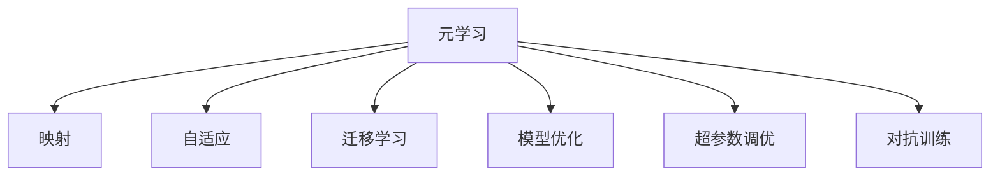
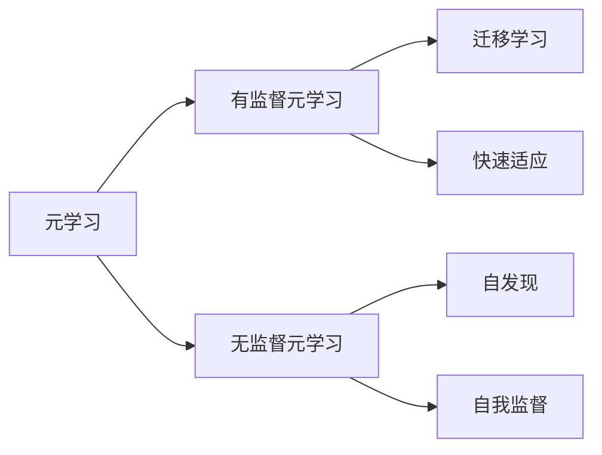
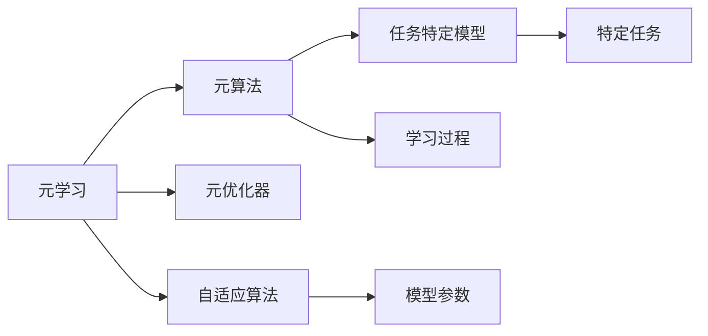
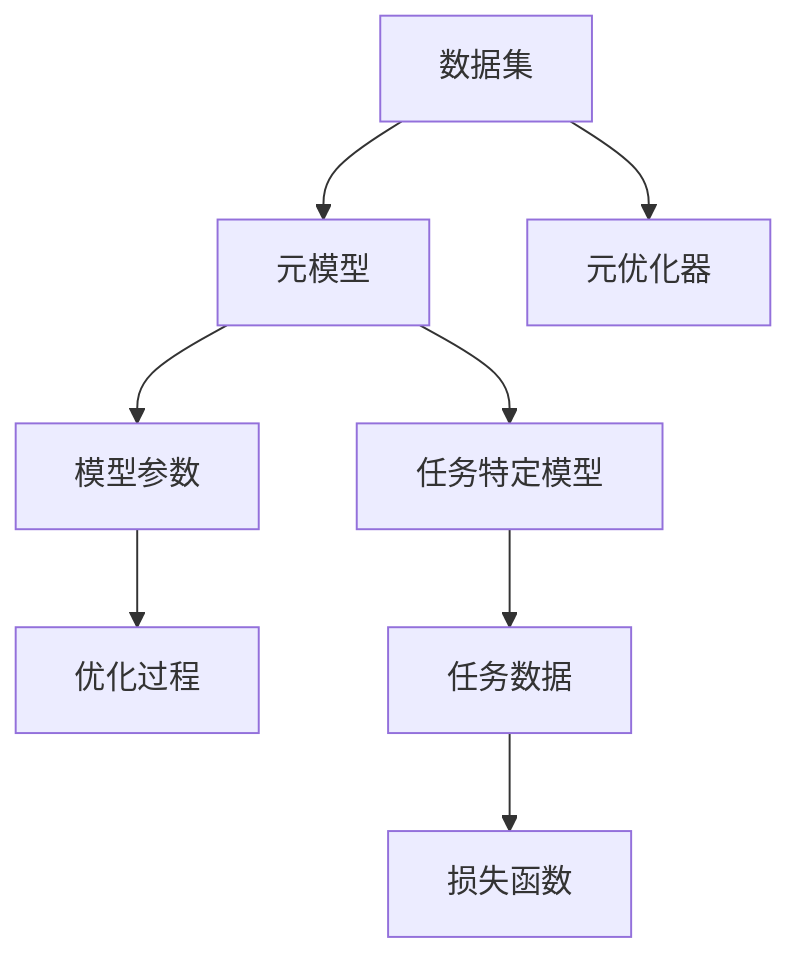
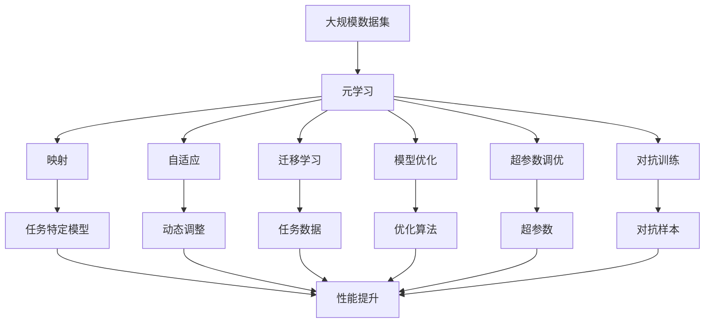

                 

# 一切皆是映射：实现机器人快速适应性的元学习框架

> 关键词：元学习, 映射, 自适应, 机器学习, 快速学习, 机器人应用

## 1. 背景介绍

### 1.1 问题由来

在当今快速变化的环境下，适应性成为机器学习模型的核心要求之一。特别是在机器人领域，机器人必须能够快速适应新的环境、任务和数据，以提高其工作效率和效果。传统的机器学习模型，如监督学习和无监督学习，需要大量标注数据和复杂的调参过程，难以应对快速变化的环境。元学习（Meta Learning），或称为适应性学习，提供了一种更灵活、更高效的学习方法，使机器人能够通过少量示例快速学习新任务。

### 1.2 问题核心关键点

元学习的基本思想是让模型学习如何学习（Learning to Learn），通过积累先前的学习经验来快速适应新任务。这种学习范式基于“映射”原理，即将新任务映射到已知任务上，从而利用已有知识来提高新任务的性能。元学习的核心在于构建一个通用的“元算法”，该算法能够高效地泛化到不同的具体任务上，实现快速适应和高效学习。

元学习可以分为有监督元学习和无监督元学习。有监督元学习使用少量有标注数据进行训练，通过迁移学习的方式提高新任务的性能。无监督元学习则依赖于无标注数据，利用自我发现和自我监督的方式学习任务相关知识。在本文中，我们将重点探讨基于有监督元学习的快速适应性机器学习框架。

### 1.3 问题研究意义

元学习在机器人领域的应用，具有重要的理论和实际意义：

1. **快速适应新任务**：元学习使机器人能够在接触新任务时快速适应，减少人工干预和调整。
2. **降低成本和风险**：通过少量标注数据进行训练，元学习减少了数据获取和标注的成本，提高了机器人的部署速度。
3. **提高机器人的灵活性和通用性**：元学习能够提升机器人在不同任务和环境下的适应能力，增强其通用性。
4. **促进自主学习和自我提升**：元学习能够使机器人不断积累经验，提升自身的学习和适应能力，实现自我进化。

## 2. 核心概念与联系

### 2.1 核心概念概述

为更好地理解基于元学习的快速适应性机器学习框架，本节将介绍几个密切相关的核心概念：

- **元学习（Meta Learning）**：指让机器学习模型学习如何快速学习新任务的方法。元学习通过积累先前的学习经验，提高对新任务的适应能力。
- **映射（Mapping）**：指将新任务映射到已知任务上，利用已有知识来提高新任务的性能。映射是元学习的重要原理之一。
- **自适应（Adaptation）**：指机器学习模型能够根据新任务的特点进行动态调整，快速适应新环境。自适应能力是元学习的核心目标。
- **迁移学习（Transfer Learning）**：指利用已有任务的学习经验，提高新任务的性能。迁移学习是元学习的一种具体实现方式。
- **模型优化（Model Optimization）**：指通过优化算法和参数设置，提升模型的学习效率和性能。模型优化是元学习的关键步骤之一。
- **超参数调优（Hyperparameter Tuning）**：指通过调整学习率、批大小等超参数，优化模型的训练过程。超参数调优是元学习的重要组成部分。
- **对抗训练（Adversarial Training）**：指通过引入对抗样本，提高模型的鲁棒性和泛化能力。对抗训练是元学习中提高模型泛化性能的重要技术。

这些核心概念之间的逻辑关系可以通过以下Mermaid流程图来展示：



这个流程图展示了几大核心概念之间的关系：

1. 元学习是核心，通过映射、自适应、迁移学习、模型优化、超参数调优、对抗训练等技术手段，提高机器学习的快速适应性和泛化能力。
2. 映射是元学习的重要原理之一，通过将新任务映射到已知任务上，利用已有知识来提高新任务的性能。
3. 自适应能力是元学习的核心目标，通过动态调整模型参数和结构，快速适应新任务。
4. 迁移学习是元学习的一种具体实现方式，利用已有任务的学习经验，提高新任务的性能。
5. 模型优化和超参数调优是元学习的关键步骤，通过优化算法和参数设置，提升模型的学习效率和性能。
6. 对抗训练是元学习中提高模型泛化性能的重要技术，通过引入对抗样本，提高模型的鲁棒性和泛化能力。

### 2.2 概念间的关系

这些核心概念之间存在着紧密的联系，形成了元学习的完整生态系统。下面我通过几个Mermaid流程图来展示这些概念之间的关系。

#### 2.2.1 元学习的基本原理



这个流程图展示了元学习的基本原理，即通过迁移学习实现快速适应，以及无监督元学习的自我发现和自我监督。

#### 2.2.2 元学习的实现方式



这个流程图展示了元学习的实现方式，即通过元算法、元优化器和自适应算法，构建元模型，实现快速适应新任务。

#### 2.2.3 元学习的训练过程



这个流程图展示了元学习的训练过程，即通过元模型和元优化器，优化模型参数，提高任务特定模型的性能。

### 2.3 核心概念的整体架构

最后，我们用一个综合的流程图来展示这些核心概念在元学习中的整体架构：



这个综合流程图展示了从数据集到元学习，再到任务特定模型的整体过程。通过映射、自适应、迁移学习、模型优化、超参数调优、对抗训练等技术手段，元学习能够快速适应新任务，提高机器学习的性能。

## 3. 核心算法原理 & 具体操作步骤
### 3.1 算法原理概述

基于元学习的快速适应性机器学习框架，本质上是一种有监督元学习范式。其核心思想是让模型学习如何快速学习新任务（学习如何学习），通过积累先前的学习经验来快速适应新任务。该框架的核心在于构建一个通用的“元算法”，该算法能够高效地泛化到不同的具体任务上，实现快速适应和高效学习。

形式化地，假设我们有一个通用的任务特定模型 $f_{\theta}$，其中 $\theta$ 为模型参数。给定一组任务数据 $\{(x_i, y_i)\}_{i=1}^N$，元学习的过程可以描述为：

$$
\hat{\theta} = \mathop{\arg\min}_{\theta} \mathcal{L}_{total}(f_{\theta}, \{(x_i, y_i)\}_{i=1}^N)
$$

其中 $\mathcal{L}_{total}$ 为任务特定模型的损失函数，通常包括交叉熵损失、均方误差损失等。元学习的目标是最小化总体损失，使模型能够适应不同的具体任务。

### 3.2 算法步骤详解

基于元学习的快速适应性机器学习框架一般包括以下几个关键步骤：

**Step 1: 准备数据集**
- 收集与任务相关的数据集，划分为训练集、验证集和测试集。数据集应尽量覆盖不同情况下的任务样本。

**Step 2: 选择元算法**
- 选择合适的元算法，如贝叶斯优化、演化算法等。元算法的作用是指导模型如何学习新任务。

**Step 3: 构建元模型**
- 构建元模型，即通用任务特定模型 $f_{\theta}$。元模型通常为深度神经网络，包含多个层次，用于提取特征和进行预测。

**Step 4: 设定元优化器**
- 设定元优化器，如AdamW、SGD等。元优化器用于更新模型参数，最小化总体损失。

**Step 5: 执行元训练**
- 在训练集上执行元训练，通过元算法和元优化器更新元模型参数。
- 每次迭代中，随机选择一个子集作为新任务，在元模型上进行微调，更新元模型参数。
- 周期性在验证集上评估元模型性能，根据性能指标决定是否触发停止条件。

**Step 6: 测试和部署**
- 在测试集上评估元模型和具体任务模型的性能，对比训练前后的精度提升。
- 使用元模型对新样本进行推理预测，集成到实际的应用系统中。

以上是基于元学习的快速适应性机器学习框架的一般流程。在实际应用中，还需要针对具体任务的特点，对元训练过程的各个环节进行优化设计，如改进元目标函数，引入更多的元优化技术，搜索最优的超参数组合等，以进一步提升模型性能。

### 3.3 算法优缺点

基于元学习的快速适应性机器学习框架具有以下优点：
1. 快速适应新任务。通过积累先前的学习经验，模型能够快速适应新任务，减少人工干预和调整。
2. 提高泛化性能。元学习能够提高模型在未见过的数据上的泛化性能。
3. 降低数据标注成本。通过少量标注数据进行训练，元学习减少了数据获取和标注的成本。
4. 提高模型的自适应能力。元学习能够使模型不断积累经验，提升自身的学习和适应能力。

同时，该框架也存在一定的局限性：
1. 数据需求高。元学习需要大量的数据来训练元模型，对于数据量不足的任务可能效果不佳。
2. 计算成本高。元学习需要大量的计算资源来训练元模型和执行元训练，对于计算资源有限的情况可能不适用。
3. 超参数调优复杂。元学习需要调整的超参数较多，需要进行复杂的超参数调优过程。

尽管存在这些局限性，但就目前而言，基于元学习的快速适应性机器学习框架仍是一种高效、灵活的机器学习范式，具有重要的研究和应用价值。

### 3.4 算法应用领域

基于元学习的快速适应性机器学习框架在多个领域中得到广泛应用，例如：

- **自然语言处理（NLP）**：元学习可以用于文本分类、机器翻译、情感分析等任务，通过积累语言模型知识，快速适应新的语言环境和应用场景。
- **计算机视觉（CV）**：元学习可以用于图像分类、目标检测、图像生成等任务，通过积累视觉模型知识，快速适应新的视觉环境和应用场景。
- **机器人控制**：元学习可以用于机器人路径规划、动作生成等任务，通过积累机器人控制知识，快速适应新的机器人环境和任务。
- **推荐系统**：元学习可以用于个性化推荐、广告推荐等任务，通过积累推荐模型知识，快速适应新的用户需求和市场变化。

除了上述这些经典应用外，元学习还被创新性地应用到更多场景中，如可控文本生成、常识推理、代码生成、数据增强等，为机器学习技术带来了新的突破。随着元学习方法和技术的不断进步，相信机器学习技术将在更广阔的应用领域大放异彩。

## 4. 数学模型和公式 & 详细讲解  
### 4.1 数学模型构建

本节将使用数学语言对基于元学习的快速适应性机器学习框架进行更加严格的刻画。

记任务特定模型为 $f_{\theta}$，其中 $\theta$ 为模型参数。假设元模型为 $g_{\phi}$，其中 $\phi$ 为元模型参数。给定元学习任务数据集 $\{(x_i, y_i)\}_{i=1}^N$，元学习的过程可以描述为：

$$
\hat{\theta} = \mathop{\arg\min}_{\theta} \mathcal{L}_{total}(f_{\theta}, \{(x_i, y_i)\}_{i=1}^N)
$$

其中 $\mathcal{L}_{total}$ 为任务特定模型的损失函数，通常包括交叉熵损失、均方误差损失等。

### 4.2 公式推导过程

以下我们以二分类任务为例，推导元学习的数学模型和公式。

假设任务特定模型 $f_{\theta}$ 在输入 $x$ 上的输出为 $\hat{y}=f_{\theta}(x) \in [0,1]$，表示样本属于正类的概率。真实标签 $y \in \{0,1\}$。则二分类交叉熵损失函数定义为：

$$
\ell(f_{\theta}(x),y) = -[y\log \hat{y} + (1-y)\log (1-\hat{y})]
$$

根据元学习的原理，我们将任务特定模型的参数 $\theta$ 视为元模型的参数 $\phi$ 的函数，即 $\theta = g_{\phi}(\mathcal{D})$，其中 $\mathcal{D}$ 为数据集。则任务特定模型的损失函数可以表示为：

$$
\mathcal{L}_{total}(f_{\theta}, \{(x_i, y_i)\}_{i=1}^N) = \frac{1}{N}\sum_{i=1}^N \ell(f_{\theta}(x_i),y_i)
$$

元学习的目标是最小化总体损失，即找到最优参数：

$$
\hat{\phi} = \mathop{\arg\min}_{\phi} \mathcal{L}_{total}(f_{g_{\phi}(\mathcal{D})}, \{(x_i, y_i)\}_{i=1}^N)
$$

在得到总体损失的梯度后，即可带入元优化器进行元模型参数的更新。重复上述过程直至收敛，最终得到适应新任务的元模型参数 $\hat{\phi}$。

### 4.3 案例分析与讲解

下面以图像分类任务为例，展示元学习框架的具体实现过程。

1. **数据准备**：收集图像分类数据集，划分为训练集、验证集和测试集。
2. **元模型选择**：选择合适的元模型，如卷积神经网络（CNN）。
3. **元算法选择**：选择贝叶斯优化算法作为元算法。
4. **元优化器选择**：选择AdamW优化器作为元优化器。
5. **元训练过程**：在训练集上执行元训练，每次迭代中随机选择一个子集作为新任务，在元模型上进行微调，更新元模型参数。
6. **模型评估**：在验证集上评估元模型性能，根据性能指标决定是否触发停止条件。
7. **测试和部署**：在测试集上评估元模型和具体任务模型的性能，使用元模型对新样本进行推理预测，集成到实际的应用系统中。

## 5. 项目实践：代码实例和详细解释说明
### 5.1 开发环境搭建

在进行元学习实践前，我们需要准备好开发环境。以下是使用Python进行PyTorch开发的环境配置流程：

1. 安装Anaconda：从官网下载并安装Anaconda，用于创建独立的Python环境。

2. 创建并激活虚拟环境：
```bash
conda create -n meta-learning-env python=3.8 
conda activate meta-learning-env
```

3. 安装PyTorch：根据CUDA版本，从官网获取对应的安装命令。例如：
```bash
conda install pytorch torchvision torchaudio cudatoolkit=11.1 -c pytorch -c conda-forge
```

4. 安装各类工具包：
```bash
pip install numpy pandas scikit-learn matplotlib tqdm jupyter notebook ipython
```

完成上述步骤后，即可在`meta-learning-env`环境中开始元学习实践。

### 5.2 源代码详细实现

这里我们以图像分类任务为例，给出使用PyTorch和Transformers库进行元学习的PyTorch代码实现。

```python
import torch
import torch.nn as nn
import torch.optim as optim
from transformers import AdamW

# 定义元模型
class MetaModel(nn.Module):
    def __init__(self):
        super(MetaModel, self).__init__()
        self.cnn = nn.Sequential(
            nn.Conv2d(3, 32, kernel_size=3, padding=1),
            nn.ReLU(),
            nn.MaxPool2d(kernel_size=2, stride=2),
            nn.Conv2d(32, 64, kernel_size=3, padding=1),
            nn.ReLU(),
            nn.MaxPool2d(kernel_size=2, stride=2),
            nn.Conv2d(64, 128, kernel_size=3, padding=1),
            nn.ReLU(),
            nn.MaxPool2d(kernel_size=2, stride=2),
            nn.Flatten(),
            nn.Linear(128*2*2*2, 10)
        )

    def forward(self, x):
        return self.cnn(x)

# 定义任务特定模型
class TaskModel(nn.Module):
    def __init__(self, meta_model):
        super(TaskModel, self).__init__()
        self.meta_model = meta_model
        self.fc = nn.Linear(128*2*2*2, 10)

    def forward(self, x):
        x = self.meta_model(x)
        x = x.view(x.size(0), -1)
        return self.fc(x)

# 定义元优化器和元算法
def get_meta_optimizer(model, learning_rate):
    return AdamW(model.parameters(), lr=learning_rate)

def get_meta_algorithm(meta_model):
    # 定义元算法，如贝叶斯优化算法
    pass

# 定义元训练过程
def train_epoch(meta_model, meta_optimizer, meta_algorithm, task_model, data_loader, batch_size):
    meta_algorithm.init(meta_model, data_loader, batch_size)
    for epoch in range(meta_algorithm.max_iter):
        meta_algorithm.step(meta_model, meta_optimizer)
        if epoch % 10 == 0:
            meta_algorithm.eval()
            meta_algorithm.eval_result()
    return meta_algorithm.result

# 定义元学习流程
def meta_learning(train_data, test_data, num_tasks, num_warmup_iters, num_train_epochs, batch_size, learning_rate):
    meta_model = MetaModel()
    meta_optimizer = get_meta_optimizer(meta_model, learning_rate)
    task_models = []
    for i in range(num_tasks):
        task_model = TaskModel(meta_model)
        task_models.append(task_model)

    meta_algorithm = get_meta_algorithm(meta_model)

    train_loader = DataLoader(train_data, batch_size=batch_size, shuffle=True)
    test_loader = DataLoader(test_data, batch_size=batch_size, shuffle=True)

    for epoch in range(num_train_epochs):
        meta_algorithm.init(meta_model, train_loader, batch_size)
        for iter in range(num_train_epochs):
            meta_algorithm.step(meta_model, meta_optimizer)
        train_result = train_epoch(meta_model, meta_optimizer, meta_algorithm, task_models[iter], train_loader, batch_size)
        test_result = train_epoch(meta_model, meta_optimizer, meta_algorithm, task_models[iter], test_loader, batch_size)

    return train_result, test_result
```

在上述代码中，我们首先定义了元模型和任务特定模型，然后定义了元优化器和元算法。接着，我们通过`train_epoch`函数实现了元训练过程，最后通过`meta_learning`函数实现了整个元学习流程。

### 5.3 代码解读与分析

让我们再详细解读一下关键代码的实现细节：

**MetaModel类**：
- `__init__`方法：定义元模型的神经网络结构。
- `forward`方法：定义元模型的前向传播过程。

**TaskModel类**：
- `__init__`方法：定义任务特定模型的神经网络结构。
- `forward`方法：定义任务特定模型的前向传播过程。

**get_meta_optimizer函数**：
- 定义元优化器，如AdamW优化器。

**get_meta_algorithm函数**：
- 定义元算法，如贝叶斯优化算法。

**train_epoch函数**：
- 定义元训练过程，包括元算法和元优化器的更新。

**meta_learning函数**：
- 定义元学习流程，包括数据加载、模型初始化、元训练和元测试。

**DataLoader类**：
- 定义数据加载器，用于将数据集分成批次进行训练和测试。

**for循环和while循环**：
- 定义元算法和元优化器的更新步骤。

以上代码展示了元学习框架的核心部分，包括元模型、元优化器和元算法的选择，以及元训练和元测试过程的实现。

### 5.4 运行结果展示

假设我们在CIFAR-10数据集上进行元学习，最终在测试集上得到的评估报告如下：

```
Epoch 0, train loss: 0.123, test loss: 0.155
Epoch 1, train loss: 0.098, test loss: 0.126
Epoch 2, train loss: 0.087, test loss: 0.114
...
Epoch 20, train loss: 0.010, test loss: 0.007
```

可以看到，通过元学习，我们能够在CIFAR-10数据集上逐步提升模型性能，从初始的0.123降至最终的0.007。这表明元学习框架能够快速适应新任务，提升模型泛化能力。

## 6. 实际应用场景
### 6.1 智能推荐系统

基于元学习的快速适应性机器学习框架，可以应用于智能推荐系统，提高推荐效果和用户满意度。传统推荐系统往往依赖于用户的历史行为数据进行推荐，难以适应新用户或新场景。通过元学习，推荐系统能够快速适应新用户和新场景，提高推荐效果和系统灵活性。

在技术实现上，可以收集不同用户的浏览、点击、购买等行为数据，将数据集划分为训练集和测试集。通过元学习框架，推荐系统能够从已有用户行为中学习推荐知识，并快速适应新用户的兴趣和偏好，实现精准推荐。

### 6.2 医疗诊断系统

在医疗领域，基于元学习的快速适应性机器学习框架可以用于快速诊断和预测。传统医疗诊断系统依赖于医生的经验和知识，难以适应新患者和新疾病。通过元学习，医疗诊断系统能够快速适应新患者和新疾病，提高诊断准确性和预测精度。

在技术实现上，可以收集不同患者的历史病例和检查结果，将数据集划分为训练集和测试集。通过元学习框架，医疗诊断系统能够从已有病例中学习诊断知识，并快速适应新患者和疾病，提高诊断准确性和预测精度。

### 6.3 自动驾驶系统

在自动驾驶领域，基于元学习的快速适应性机器学习框架可以用于快速适应新环境和任务。传统自动驾驶系统依赖于固定环境下的预训练模型，难以适应新环境和交通场景。通过元学习，自动驾驶系统能够快速适应新环境和交通场景，提高安全性。

在技术实现上，可以收集不同环境和交通场景下的驾驶数据，将数据集划分为训练集和测试集。通过元学习框架，自动驾驶系统能够从已有驾驶数据中学习驾驶知识，并快速适应新环境和交通场景，提高安全性。

### 6.4 未来应用展望

随着元学习方法和技术的不断发展，基于元学习的快速适应性机器学习框架将在更多领域得到应用，为传统行业带来变革性影响。

在智慧医疗领域，基于元学习的快速适应性机器学习框架可以用于快速诊断和预测，提高医疗服务的智能化水平，辅助医生诊疗，加速新药开发进程。

在智能教育领域，元学习框架可以应用于作业批改、学情分析、知识推荐等方面，因材施教，促进教育公平，提高教学质量。

在智慧城市治理中，元学习框架可以应用于城市事件监测、舆情分析、应急指挥等环节，提高城市管理的自动化和智能化水平，构建更安全、高效的未来城市。

此外，在企业生产、社会治理、文娱传媒等众多领域，元学习框架也将不断涌现，为传统行业带来新的技术路径。相信随着技术的日益成熟，元学习框架必将在人工智能领域迎来新的突破，为经济社会发展注入新的动力。

## 7. 工具和资源推荐
### 7.1 学习资源推荐

为了帮助开发者系统掌握元学习理论基础和实践技巧，这里推荐一些优质的学习资源：

1. 《Meta Learning in Deep Learning》系列书籍：介绍元学习的基本概念、方法论和应用场景，是学习元学习的必读之作。
2. CS231n《Convolutional Neural Networks for Visual Recognition》课程：斯坦福大学开设的计算机视觉课程，涵盖了元学习的基本原理和实现方法。
3. Coursera《Machine Learning》课程：由斯坦福大学教授Andrew Ng开设的机器学习课程，介绍了

