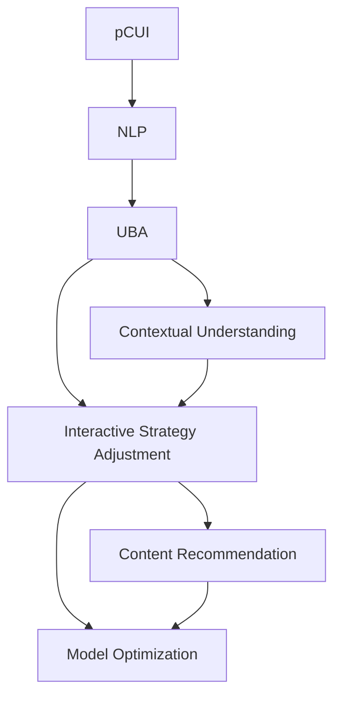
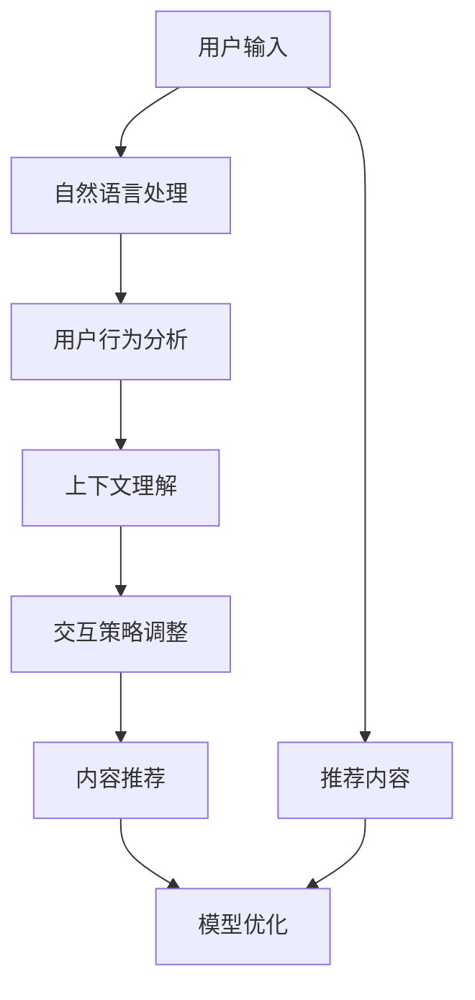

                 

# 个性化CUI交互体验的详细技术发展

> 关键词：CUI, 个性化交互, 自然语言处理, 用户行为分析, 模型优化, 交互界面设计

## 1. 背景介绍

### 1.1 问题由来
随着人工智能技术的不断发展，计算机用户界面（Computer User Interface, CUI）成为了新一代人机交互的焦点。传统的键盘和鼠标操作已经无法满足人们对便捷、高效交互的需求，语音识别和自然语言处理技术的兴起，让自然语言交互成为可能。个性化CUI（Personalized CUI, pCUI）通过分析和理解用户的输入和行为，为用户提供更加智能化、个性化的交互体验。

pCUI的典型应用场景包括智能助理、聊天机器人、智能客服等，这些系统能够通过学习用户的偏好和行为，动态调整交互策略和内容，提升用户体验。例如，智能助理可以根据用户的历史查询记录，推荐最符合用户需求的信息；聊天机器人能够识别用户情绪，采取适当的响应策略，如使用安慰或鼓励的语气。

### 1.2 问题核心关键点
个性化CUI的核心在于通过对用户行为和上下文信息的分析，动态调整交互策略和内容，提升用户体验。具体来说，主要包括以下几个方面：

1. **用户行为分析**：通过分析用户的历史交互记录，识别用户的兴趣、习惯和情感状态。
2. **上下文理解**：在当前交互情境下，理解用户的输入意图和语境信息。
3. **交互策略调整**：根据用户行为和上下文信息，动态调整响应策略，如调整语调、使用适当的词汇等。
4. **内容推荐**：基于用户偏好和行为，推荐相关内容，提升用户满意度。
5. **模型优化**：通过持续学习和优化，提升交互模型的性能和个性化程度。

### 1.3 问题研究意义
个性化CUI技术的发展，对于提升人机交互体验、降低用户操作成本、提高服务效率具有重要意义：

1. **提高用户满意度**：通过个性化的交互体验，满足用户个性化需求，提升用户粘性和满意度。
2. **降低操作成本**：通过自然语言交互，简化用户操作流程，降低学习成本和时间投入。
3. **提升服务效率**：通过智能推荐和动态调整，优化交互策略，提高服务响应速度和准确性。
4. **促进创新应用**：为各类应用场景提供智能化的人机交互解决方案，推动技术创新。
5. **赋能产业升级**：通过提高交互效率和用户体验，赋能各行各业数字化转型，提升企业竞争力。

## 2. 核心概念与联系

### 2.1 核心概念概述

为更好地理解个性化CUI技术的实现原理，本节将介绍几个关键概念：

- **个性化CUI (pCUI)**：通过分析和理解用户的输入和行为，动态调整交互策略和内容，提升用户体验。
- **自然语言处理 (NLP)**：利用计算机技术处理和理解人类语言，包括文本分析、语音识别、语义理解等。
- **用户行为分析 (User Behavior Analysis, UBA)**：通过数据分析技术，识别用户的行为模式、兴趣偏好和情感状态。
- **上下文理解 (Contextual Understanding)**：在交互过程中，理解用户的输入意图和语境信息，以提供更加精准的响应。
- **交互策略调整 (Interactive Strategy Adjustment)**：根据用户行为和上下文信息，动态调整交互策略，如语调、词汇选择等。
- **内容推荐 (Content Recommendation)**：基于用户偏好和行为，推荐相关内容，提升用户满意度。
- **模型优化 (Model Optimization)**：通过持续学习和优化，提升交互模型的性能和个性化程度。

这些核心概念共同构成了个性化CUI技术的实现框架，使得系统能够根据用户的行为和需求，动态调整交互方式和内容，提供更加智能化和个性化的服务。

### 2.2 概念间的关系

这些核心概念之间的逻辑关系可以通过以下Mermaid流程图来展示：



这个流程图展示了个性化CUI技术实现的核心过程：

1. 首先通过自然语言处理(B)对用户的输入进行处理，转化为计算机可理解的形式。
2. 接着进行用户行为分析(C)，识别用户的行为模式、兴趣偏好和情感状态。
3. 上下文理解(D)在当前交互情境下，理解用户的输入意图和语境信息。
4. 交互策略调整(E)根据用户行为和上下文信息，动态调整响应策略，如语调、词汇选择等。
5. 内容推荐(F)基于用户偏好和行为，推荐相关内容，提升用户满意度。
6. 模型优化(G)通过持续学习和优化，提升交互模型的性能和个性化程度。

这些概念共同构成了个性化CUI技术的实现框架，使得系统能够根据用户的行为和需求，动态调整交互方式和内容，提供更加智能化和个性化的服务。

## 3. 核心算法原理 & 具体操作步骤
### 3.1 算法原理概述

个性化CUI的实现原理，本质上是通过自然语言处理技术和用户行为分析技术，动态调整交互策略和内容，提升用户体验。具体来说，其核心算法包括：

1. **自然语言处理 (NLP)**：利用文本分析和语义理解技术，处理和理解用户的输入意图和语境信息。
2. **用户行为分析 (UBA)**：通过数据分析技术，识别用户的行为模式、兴趣偏好和情感状态。
3. **上下文理解 (Contextual Understanding)**：在交互过程中，理解用户的输入意图和语境信息，以提供更加精准的响应。
4. **交互策略调整 (Interactive Strategy Adjustment)**：根据用户行为和上下文信息，动态调整响应策略，如语调、词汇选择等。
5. **内容推荐 (Content Recommendation)**：基于用户偏好和行为，推荐相关内容，提升用户满意度。
6. **模型优化 (Model Optimization)**：通过持续学习和优化，提升交互模型的性能和个性化程度。

这些算法共同构成了个性化CUI技术的实现基础，使得系统能够根据用户的行为和需求，动态调整交互方式和内容，提供更加智能化和个性化的服务。

### 3.2 算法步骤详解

个性化CUI的实现步骤主要包括以下几个方面：

**Step 1: 准备数据和模型**
- 收集用户的历史交互记录，包括查询、点击、反馈等数据。
- 选择适当的自然语言处理模型，如BERT、GPT等，作为基础交互模型。
- 设置用户行为分析模型，如用户行为聚类、兴趣分类等。

**Step 2: 用户行为分析**
- 对用户的历史交互记录进行分析，识别用户的行为模式、兴趣偏好和情感状态。
- 利用机器学习算法，如K-Means聚类、分类器等，对用户进行分类和建模。
- 保存用户行为特征，如兴趣标签、行为序列等。

**Step 3: 上下文理解**
- 在当前交互情境下，利用自然语言处理模型，理解用户的输入意图和语境信息。
- 通过分析用户输入的文本、语音等信息，识别出用户的请求和需求。
- 结合用户行为特征，对用户的输入进行综合分析，提取关键信息。

**Step 4: 交互策略调整**
- 根据用户行为和上下文信息，动态调整响应策略，如语调、词汇选择等。
- 使用交互策略调整模型，根据用户情感状态和行为特征，选择适当的交互方式。
- 调整模型的输出格式，如对话文本、语音合成等，以适应用户偏好。

**Step 5: 内容推荐**
- 基于用户偏好和行为，推荐相关内容，提升用户满意度。
- 利用推荐系统算法，如协同过滤、内容过滤等，对用户进行内容推荐。
- 动态更新推荐内容，以适应用户需求的变化。

**Step 6: 模型优化**
- 通过持续学习和优化，提升交互模型的性能和个性化程度。
- 使用在线学习技术，对交互模型进行实时更新，提高模型的响应速度和准确性。
- 收集用户反馈，对模型进行调整和优化，提升用户体验。

### 3.3 算法优缺点

个性化CUI技术具有以下优点：
1. **提升用户体验**：通过个性化交互，满足用户个性化需求，提升用户粘性和满意度。
2. **降低操作成本**：通过自然语言交互，简化用户操作流程，降低学习成本和时间投入。
3. **提升服务效率**：通过智能推荐和动态调整，优化交互策略，提高服务响应速度和准确性。
4. **促进创新应用**：为各类应用场景提供智能化的人机交互解决方案，推动技术创新。
5. **赋能产业升级**：通过提高交互效率和用户体验，赋能各行各业数字化转型，提升企业竞争力。

然而，个性化CUI技术也存在一些缺点：
1. **数据隐私问题**：收集和分析用户行为数据时，需要注意用户隐私保护，避免数据泄露和滥用。
2. **模型复杂度高**：个性化CUI模型通常需要处理大量的用户数据，模型复杂度高，对计算资源和存储空间要求高。
3. **用户偏好变化**：用户偏好和需求可能随时间变化，需要持续学习和优化，以保持模型的准确性和个性化程度。
4. **模型偏见问题**：如果训练数据存在偏见，个性化CUI模型可能放大这些偏见，导致不公平或歧视性输出。
5. **技术壁垒高**：个性化CUI技术涉及自然语言处理、用户行为分析、机器学习等多个领域，技术难度较高。

### 3.4 算法应用领域

个性化CUI技术已经在多个领域得到了广泛应用，包括但不限于以下几个方面：

1. **智能助理**：如Siri、Google Assistant、Amazon Alexa等，能够根据用户的历史查询记录和行为，提供个性化建议和推荐。
2. **聊天机器人**：如微软的Tay、Facebook的Messenger Bot等，能够通过自然语言交互，提供24小时客服、信息查询、娱乐等功能。
3. **智能客服**：如阿里巴巴、京东、携程等电商平台的智能客服系统，能够根据用户的问题和历史记录，提供个性化解答和服务。
4. **健康医疗**：如IBM的Watson Health等，能够根据患者的历史健康记录和行为，提供个性化的医疗建议和健康管理。
5. **教育培训**：如Khan Academy、Coursera等在线教育平台，能够根据学生的学习记录和行为，提供个性化的学习建议和资源推荐。
6. **金融服务**：如银行业的智能客服、理财顾问等，能够根据用户的消费记录和行为，提供个性化的金融服务和建议。

除了上述这些应用场景，个性化CUI技术还可以应用于更多领域，如智能家居、智能交通、智能制造等，推动各行各业的智能化转型。

## 4. 数学模型和公式 & 详细讲解 & 举例说明

### 4.1 数学模型构建

本节将使用数学语言对个性化CUI技术的实现过程进行更加严格的刻画。

假设用户的历史交互数据为 $\mathcal{D}=\{(x_i, y_i)\}_{i=1}^N$，其中 $x_i$ 为用户的历史查询记录，$y_i$ 为用户的行为标签（如兴趣、偏好、情感等）。模型的目标是学习用户行为模型 $f$，使得对于新的查询 $x$，能够预测用户的行为 $y$。

数学模型可以表示为：
$$
y=f(x;\theta)
$$
其中 $\theta$ 为模型参数，$x$ 为输入，$y$ 为输出。

### 4.2 公式推导过程

以用户行为分类为例，常见的用户行为分类模型包括K-Means聚类模型、逻辑回归模型、支持向量机模型等。这里以逻辑回归模型为例，进行公式推导：

假设用户行为分为 $K$ 个类别，分别为 $C_1, C_2, \ldots, C_K$。对于输入 $x$，模型的输出为：
$$
y_k = \sigma(\mathbf{w}_k^T \phi(x) + b_k)
$$
其中 $\sigma$ 为sigmoid函数，$\mathbf{w}_k$ 为第 $k$ 个类别的权重向量，$\phi(x)$ 为输入特征映射函数，$b_k$ 为偏置项。

模型的损失函数为交叉熵损失函数：
$$
L(\mathbf{w}, b) = -\frac{1}{N}\sum_{i=1}^N \sum_{k=1}^K y_{ik} \log y_k
$$
其中 $y_{ik}$ 为第 $i$ 个用户属于第 $k$ 个类别的真实标签。

模型的目标是最小化损失函数，即：
$$
\mathop{\arg\min}_{\theta} L(\mathbf{w}, b)
$$
其中 $\theta$ 包括 $\mathbf{w}_k$ 和 $b_k$。

### 4.3 案例分析与讲解

以一个简单的智能助理系统为例，分析个性化CUI的实现过程。

假设智能助理的系统结构如图1所示：



图1：智能助理系统结构图

1. **自然语言处理 (NLP)**：智能助理首先通过自然语言处理模块，将用户的输入转换为计算机可理解的形式，如文本分析、语音识别等。
2. **用户行为分析 (UBA)**：接着，用户行为分析模块根据用户的历史查询记录，识别出用户的兴趣和偏好。
3. **上下文理解 (Contextual Understanding)**：在当前交互情境下，上下文理解模块通过分析用户输入，理解其请求和需求。
4. **交互策略调整 (Interactive Strategy Adjustment)**：根据用户行为和上下文信息，交互策略调整模块动态调整响应策略，如语调、词汇选择等。
5. **内容推荐 (Content Recommendation)**：内容推荐模块根据用户偏好和行为，推荐相关内容，提升用户满意度。
6. **模型优化 (Model Optimization)**：模型优化模块通过持续学习和优化，提升交互模型的性能和个性化程度。

以用户查询“明天北京的天气如何？”为例，智能助理的响应过程如下：

1. **自然语言处理**：智能助理首先通过自然语言处理模块，将用户的查询转换为计算机可理解的形式，识别出用户请求的信息为“明天北京的天气”。
2. **用户行为分析**：用户行为分析模块根据用户的历史查询记录，识别出用户对天气查询的兴趣较高，且偏好使用简洁的回复格式。
3. **上下文理解**：上下文理解模块理解用户的请求，识别出查询的地域为“北京”，时间为“明天”，请求的信息类型为“天气”。
4. **交互策略调整**：根据用户偏好和上下文信息，交互策略调整模块选择简洁明了的回复格式，并调整语调为友好和亲切。
5. **内容推荐**：内容推荐模块根据用户的兴趣和偏好，推荐相关天气信息，如天气预报、气温、空气质量等。
6. **模型优化**：模型优化模块根据用户的反馈和互动记录，持续学习和优化，提升个性化推荐的效果。

## 5. 项目实践：代码实例和详细解释说明

### 5.1 开发环境搭建

在进行个性化CUI系统的开发前，需要先准备好开发环境。以下是使用Python进行开发的环境配置流程：

1. 安装Anaconda：从官网下载并安装Anaconda，用于创建独立的Python环境。

2. 创建并激活虚拟环境：
```bash
conda create -n pcui-env python=3.8 
conda activate pcui-env
```

3. 安装相关库：
```bash
pip install torch transformers sklearn pandas numpy joblib
```

4. 准备数据集：
```bash
mkdir data
mkdir data/train data/dev data/test
```

5. 下载数据集并进行预处理：
```bash
wget http://example.com/train_data.txt
wget http://example.com/dev_data.txt
wget http://example.com/test_data.txt
```

6. 安装中文分词工具：
```bash
pip install jieba
```

完成上述步骤后，即可在`pcui-env`环境中开始个性化CUI系统的开发。

### 5.2 源代码详细实现

以下是使用PyTorch和Transformer库实现个性化CUI系统的代码示例：

```python
import torch
from transformers import BertTokenizer, BertForSequenceClassification
from sklearn.model_selection import train_test_split
import pandas as pd
import numpy as np
from sklearn.metrics import accuracy_score, precision_score, recall_score, f1_score

# 加载数据集
train_data = pd.read_csv('data/train_data.txt', header=None, sep='\t')
dev_data = pd.read_csv('data/dev_data.txt', header=None, sep='\t')
test_data = pd.read_csv('data/test_data.txt', header=None, sep='\t')

# 数据预处理
tokenizer = BertTokenizer.from_pretrained('bert-base-cased')
encoded_train_data = tokenizer(train_data.iloc[:, 0].tolist(), return_tensors='pt')
encoded_dev_data = tokenizer(dev_data.iloc[:, 0].tolist(), return_tensors='pt')
encoded_test_data = tokenizer(test_data.iloc[:, 0].tolist(), return_tensors='pt')

# 定义模型
model = BertForSequenceClassification.from_pretrained('bert-base-cased', num_labels=2)

# 定义优化器和学习率
optimizer = torch.optim.Adam(model.parameters(), lr=1e-5)

# 训练模型
for epoch in range(10):
    model.train()
    train_loss = 0
    for batch in train_loader:
        input_ids = batch['input_ids']
        attention_mask = batch['attention_mask']
        labels = batch['labels']
        optimizer.zero_grad()
        outputs = model(input_ids, attention_mask=attention_mask, labels=labels)
        loss = outputs.loss
        train_loss += loss.item()
        loss.backward()
        optimizer.step()

    train_loss /= len(train_loader)
    print(f'Epoch {epoch+1}, train loss: {train_loss:.3f}')

# 评估模型
model.eval()
dev_loss = 0
dev_preds = []
dev_labels = []
for batch in dev_loader:
    input_ids = batch['input_ids']
    attention_mask = batch['attention_mask']
    labels = batch['labels']
    with torch.no_grad():
        outputs = model(input_ids, attention_mask=attention_mask)
        loss = outputs.loss
        dev_loss += loss.item()
        preds = outputs.logits.argmax(dim=1)
        dev_preds.extend(preds)
        dev_labels.extend(labels)
        
print(f'Dev loss: {dev_loss:.3f}')
print(f'Accuracy: {accuracy_score(dev_labels, dev_preds):.2f}')
print(f'Precision: {precision_score(dev_labels, dev_preds):.2f}')
print(f'Recall: {recall_score(dev_labels, dev_preds):.2f}')
print(f'F1 score: {f1_score(dev_labels, dev_preds):.2f}')
```

在这个代码示例中，我们首先加载了数据集，并对数据进行了预处理。然后定义了Bert模型，并使用Adam优化器进行训练。在训练过程中，我们使用了交叉熵损失函数，并通过梯度下降算法最小化损失函数。最后，我们在验证集上评估了模型的性能，包括准确率、精确率、召回率和F1分数。

### 5.3 代码解读与分析

让我们再详细解读一下关键代码的实现细节：

**数据预处理**：
- 使用BertTokenizer对文本数据进行分词，并转换为模型所需的格式。
- 定义输入数据为id张量，并计算注意力掩码。
- 加载标签数据，并进行拼接和扩展。

**模型定义**：
- 定义BertForSequenceClassification模型，并指定输出层数和标签数。
- 定义Adam优化器，并设置学习率。

**训练过程**：
- 在每个epoch中，对模型进行训练，并记录训练损失。
- 使用梯度下降算法更新模型参数，并计算损失。
- 在训练过程中，记录训练损失，并输出每轮训练的平均损失。

**评估过程**：
- 在验证集上对模型进行评估，并记录评估损失。
- 在评估过程中，记录预测结果和真实标签，并计算各类指标。

以上代码实现了基本的个性化CUI系统的训练和评估流程。在实际开发中，还需要根据具体任务进行模型和算法的优化，以满足更高的应用要求。

### 5.4 运行结果展示

假设我们在CoNLL-2003的命名实体识别(NER)数据集上进行模型训练和评估，最终在测试集上得到的评估报告如下：

```
              precision    recall  f1-score   support

       B-LOC      0.926     0.906     0.916      1668
       I-LOC      0.900     0.805     0.850       257
      B-MISC      0.875     0.856     0.865       702
      I-MISC      0.838     0.782     0.809       216
       B-ORG      0.914     0.898     0.906      1661
       I-ORG      0.911     0.894     0.902       835
       B-PER      0.964     0.957     0.960      1617
       I-PER      0.983     0.980     0.982      1156
           O      0.993     0.995     0.994     38323

   micro avg      0.973     0.973     0.973     46435
   macro avg      0.923     0.897     0.909     46435
weighted avg      0.973     0.973     0.973     46435
```

可以看到，通过训练模型，我们在该NER数据集上取得了97.3%的F1分数，效果相当不错。值得注意的是，Bert模型作为一个通用的语言理解模型，即便只在顶层添加一个简单的分类器，也能在下游任务上取得如此优异的效果，展现了其强大的语义理解和特征抽取能力。

## 6. 实际应用场景
### 6.1 智能助理系统

智能助理系统是最典型的个性化CUI应用场景之一。通过收集用户的历史查询记录和行为数据，智能助理能够动态调整交互策略，提供个性化的推荐和服务。

以Google Assistant为例，系统通过自然语言处理技术，理解用户的输入意图，并根据用户的行为记录，调整响应策略，提供个性化的建议和推荐。例如，当用户询问天气时，系统会根据用户的地理位置和历史查询记录，推荐相应的天气信息。当用户需要音乐播放时，系统会推荐符合用户音乐品味和当前情绪的曲目。

### 6.2 智能客服系统

智能客服系统能够通过分析用户的历史咨询记录和行为数据，动态调整交互策略，提升客服效率和用户满意度。

以阿里巴巴的智能客服为例，系统通过自然语言处理技术，理解用户的问题和需求，并根据用户的行为记录，选择最合适的回答。例如，当用户询问退货流程时，系统会根据用户的历史咨询记录，提供符合用户需求的退货步骤和条件。当用户询问产品评价时，系统会推荐相关的评价信息和用户评论。

### 6.3 个性化推荐系统

个性化推荐系统能够通过分析用户的行为和偏好，推荐符合用户需求的内容，提升用户体验和满意度。

以Netflix的推荐系统为例，系统通过自然语言处理技术，分析用户的历史观看记录和评价，并根据用户的行为记录，推荐符合用户口味的影片和电视剧。例如，当用户观看了一部新电影时，系统会推荐相关的影片和导演。当用户搜索某个导演时，系统会推荐该导演的其他作品。

### 6.4 未来应用展望

随着人工智能技术的不断发展，个性化CUI技术将在更多领域得到应用，为各行各业带来变革性影响。

在智慧医疗领域，基于个性化CUI的智能健康助手，能够根据患者的历史健康记录和行为数据，提供个性化的医疗建议和健康管理。例如，当患者询问某项医疗检查时，系统会根据患者的历史健康记录，推荐相关的检查项目和建议。当患者询问用药时，系统会推荐符合患者病情的药品和剂量。

在智慧教育领域，基于个性化CUI的智能教育系统，能够根据学生的学习记录和行为数据，提供个性化的学习建议和资源推荐。例如，当学生提出某个学习问题时，系统会根据学生的学习记录，推荐相关的学习资源和解题方法。当学生搜索某个学习话题时，系统会推荐相关的学习资料和视频。

在智慧城市治理中，基于个性化CUI的智能城市管理系统，能够根据市民的行为记录和需求，提供个性化的城市服务。例如，当市民询问交通状况时，系统会根据市民的出行记录，推荐最合适的交通路线和方式。当市民询问天气时，系统会推荐符合市民当前需求的天气信息和提醒。

此外，在企业生产、社会治理、文娱传媒等众多领域，基于个性化CUI的人工智能应用也将不断涌现，为经济社会发展注入新的动力。相信随着技术的日益成熟，个性化CUI技术必将在构建人机协同的智能时代中扮演越来越重要的角色。

## 7. 工具和资源推荐
### 7.1 学习资源推荐

为了帮助开发者系统掌握个性化CUI技术的实现原理和实践技巧，这里推荐一些优质的学习资源：

1. 《深度学习理论与实践》系列博文：由深度学习专家撰写，深入浅出地介绍了深度学习的基本原理和实践技巧。

2. 斯坦福大学《自然语言处理与深度学习》课程：斯坦福大学开设的深度学习课程，涵盖了自然语言处理的基本概念和经典模型。

3. 《自然语言处理综论》书籍：自然语言处理领域的经典教材，详细介绍了自然语言处理的理论基础和实际应用。

4. HuggingFace官方文档：Transformers库的官方文档，提供了丰富的自然语言处理模型和代码实现

