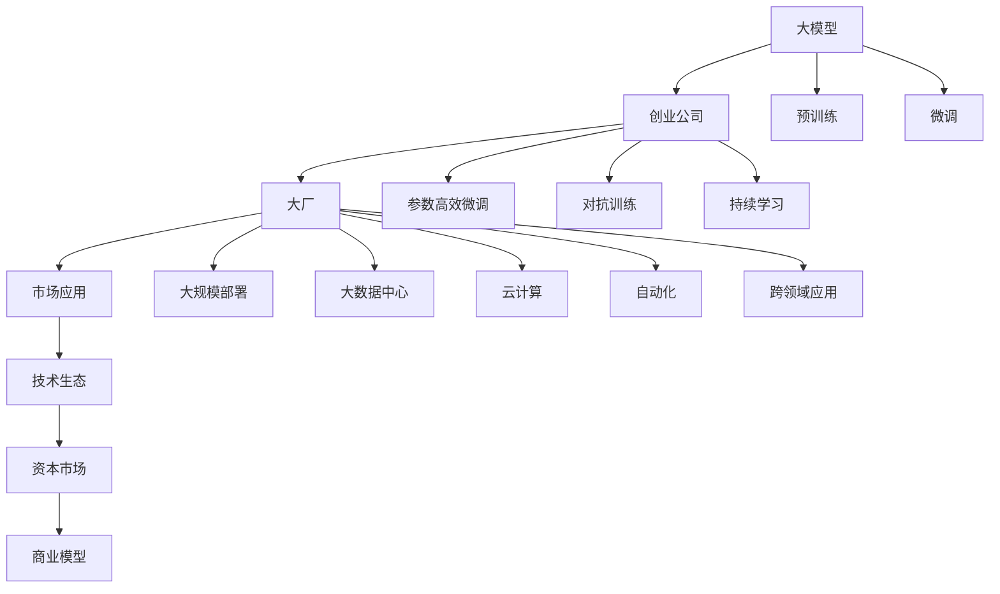
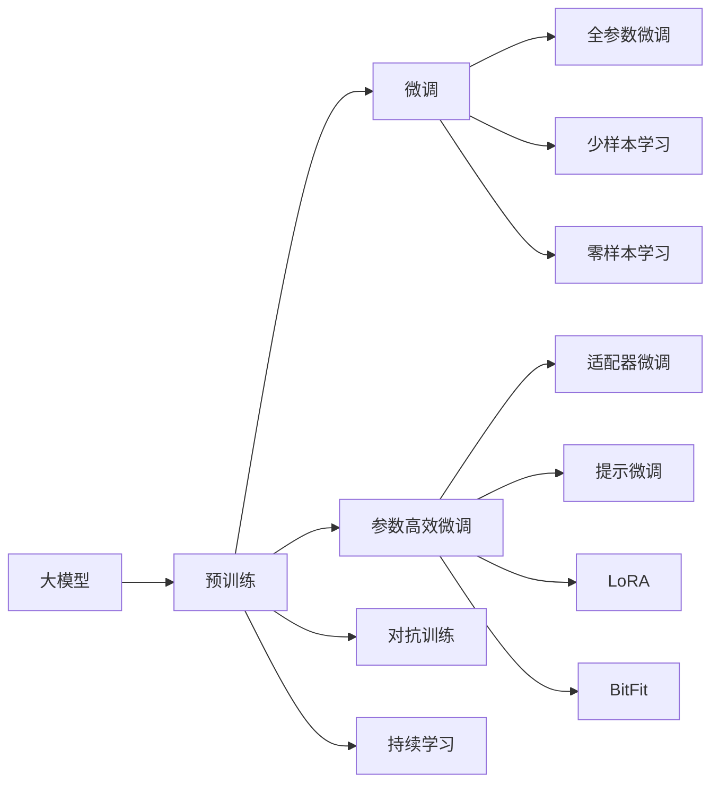
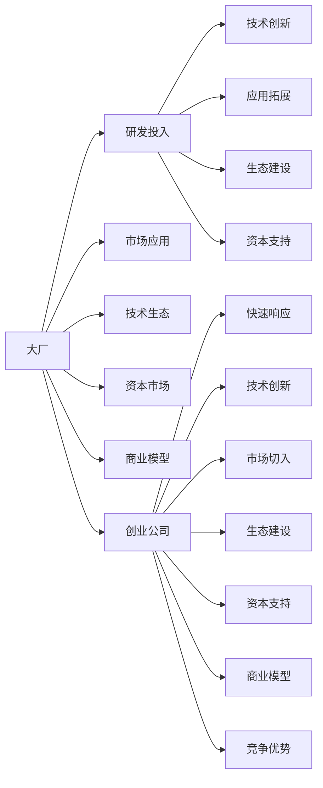
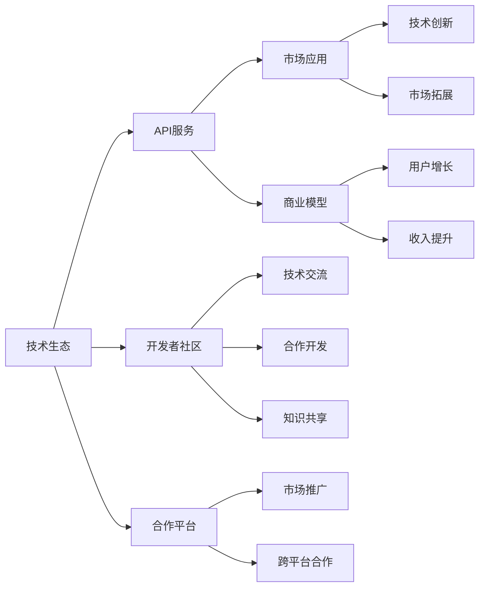
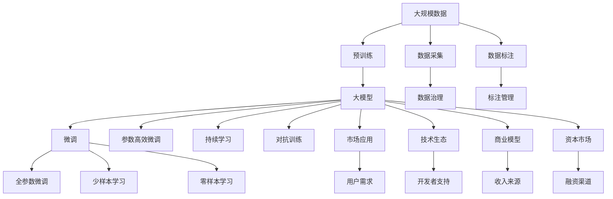

                 

# 中国大厂与大模型创业公司的竞争

> 关键词：大厂、大模型、创业公司、竞争、技术创新、商业生态

## 1. 背景介绍

### 1.1 问题由来
近年来，随着人工智能（AI）技术的快速发展和普及，大模型（如GPT、BERT等）作为AI领域的一项关键技术，其研究和应用成为了各大科技公司的争相抢夺的焦点。不仅谷歌、微软、Facebook等国际巨头在积极布局，中国的科技巨头们也纷纷加入了这场争夺战。与此同时，一大批大模型创业公司也应运而生，依托其快速响应市场需求的灵活性，快速崛起。大厂和创业公司间的竞争，不仅体现在技术实力上，更体现在商业模式、市场应用、生态系统建设等方面。本文将从多个角度分析这种竞争，以期为相关企业提供有益的借鉴和启示。

### 1.2 问题核心关键点
中国大厂与大模型创业公司之间的竞争，主要集中在以下几个方面：
- **技术研发能力**：哪家公司能够率先研发出高性能、高可扩展性的大模型，以及在特定任务上的性能优势。
- **商业模式的创新**：大厂和创业公司如何通过不同的商业模式，将技术转化为生产力，获取更多的市场份额。
- **市场应用的广度与深度**：谁能将大模型技术应用到更多的实际场景中，并提供更加高效、易用的解决方案。
- **生态系统的建设**：构建完善的技术生态，吸引更多的开发者、用户和合作伙伴，形成良性循环。
- **资本市场的表现**：大厂和创业公司上市表现、融资情况等，反映了市场对各自技术的认可和期待。

这些核心关键点，共同决定了中国大厂与大模型创业公司竞争的胜负。

### 1.3 问题研究意义
对大厂与创业公司竞争的研究，不仅有助于我们更好地理解人工智能技术的市场化应用路径，还能够揭示技术、市场、资本等各因素之间的互动关系。这种研究对于引导AI技术的发展方向，促进产业创新，以及为企业的战略决策提供参考，都具有重要意义。

## 2. 核心概念与联系

### 2.1 核心概念概述

为更好地理解大厂与大模型创业公司竞争的核心概念，本节将介绍几个关键概念及其之间的关系：

- **大模型（Large Model）**：指能够处理大规模数据、具备复杂深度学习能力的模型，如GPT-3、BERT等。这些模型通常参数量巨大，通过在大规模无标签数据上进行预训练，学习丰富的语言知识和常识。
- **创业公司（Startup）**：指成立时间较短、拥有高成长潜力的新兴公司，这些公司通常拥有灵活的市场响应能力和创新性技术。
- **大厂（Big Tech）**：指在全球市场占据主导地位的大型科技公司，如谷歌、微软、亚马逊等，这些公司在技术研发、市场应用、生态系统建设等方面拥有强大的实力。
- **商业模型（Business Model）**：指公司获取收入、提供价值的方式，如广告收入、订阅服务、软件即服务（SaaS）等。
- **市场应用（Market Application）**：指大模型在具体领域的应用场景，如自然语言处理、图像识别、智能推荐等。
- **技术生态（Technology Ecosystem）**：指围绕大模型技术的各类资源、工具、服务组成的生态系统，包括开发者社区、第三方API、合作伙伴等。
- **资本市场（Capital Market）**：指通过资本投资（如风投、IPO等）获取资金支持，以支持技术研发和市场推广的市场。

这些核心概念之间的逻辑关系可以通过以下Mermaid流程图来展示：



这个流程图展示了各大模型、创业公司、大厂、市场应用、技术生态和资本市场之间的联系：

1. 大模型通过预训练和微调获得基础能力。
2. 创业公司通过快速响应市场需求，研发出创新性的技术方案。
3. 大厂凭借其技术积累和资源优势，实现大规模部署和广泛应用。
4. 市场应用展示了不同模型在不同场景中的应用效果。
5. 技术生态和资本市场为模型研发和应用提供了必要支持。
6. 商业模型反映了公司获取收入和创造价值的方式。

通过理解这些核心概念，我们可以更好地把握中国大厂与大模型创业公司竞争的全貌。

### 2.2 概念间的关系

这些核心概念之间存在着紧密的联系，形成了中国大厂与大模型创业公司竞争的完整生态系统。下面通过几个Mermaid流程图来展示这些概念之间的关系。

#### 2.2.1 大模型的学习范式



这个流程图展示了大模型的预训练、微调、参数高效微调、对抗训练、持续学习等不同范式之间的关系。

#### 2.2.2 大厂与创业公司间的竞争关系



这个流程图展示了大厂与创业公司在研发投入、市场应用、技术生态、资本市场和商业模型等方面的竞争关系。

#### 2.2.3 技术生态与商业模式的互动



这个流程图展示了技术生态和商业模式的互动关系，包括API服务、开发者社区、合作平台等功能如何促进市场应用和技术创新。

### 2.3 核心概念的整体架构

最后，我们用一个综合的流程图来展示这些核心概念在大厂与大模型创业公司竞争过程中的整体架构：



这个综合流程图展示了从数据采集到市场应用的完整流程，以及技术生态、商业模型和资本市场在大厂与创业公司竞争中的作用。

## 3. 核心算法原理 & 具体操作步骤
### 3.1 算法原理概述

大厂与大模型创业公司之间的竞争，本质上是一场技术实力的较量。然而，这种较量不仅仅是单纯的技术研发能力比拼，还包括了市场应用、商业模式、技术生态和资本市场的综合较量。因此，本文将从以下几个方面展开分析：

1. **技术研发能力**：哪家公司能够率先研发出高性能、高可扩展性的大模型。
2. **市场应用的广度与深度**：谁能将大模型技术应用到更多的实际场景中，并提供更加高效、易用的解决方案。
3. **商业模式的创新**：大厂和创业公司如何通过不同的商业模式，将技术转化为生产力，获取更多的市场份额。
4. **技术生态的建设**：构建完善的技术生态，吸引更多的开发者、用户和合作伙伴，形成良性循环。
5. **资本市场的表现**：大厂和创业公司上市表现、融资情况等，反映了市场对各自技术的认可和期待。

### 3.2 算法步骤详解

为了更好地理解大厂与大模型创业公司竞争的全过程，我们将通过几个具体的步骤来详细讲解：

#### 3.2.1 技术研发能力

1. **研发投入**：大厂通常拥有更多的资源和技术积累，可以进行大规模的研发投入。创业公司则依赖其灵活性，迅速响应市场需求，推出创新性的解决方案。
2. **技术创新**：大厂和创业公司都在不断进行技术创新，试图在特定任务上取得优势。例如，谷歌的BERT和OpenAI的GPT系列模型，都在各自的领域内取得了突破性的进展。
3. **应用拓展**：通过将技术应用于多个领域，提高模型的市场覆盖面。例如，BERT不仅在自然语言处理领域表现优异，还被广泛应用于医疗、金融等多个行业。

#### 3.2.2 市场应用的广度与深度

1. **场景覆盖**：大厂和创业公司都在积极探索大模型的应用场景，以提高市场份额。例如，百度的文心大模型已经在搜索引擎、智能客服、语音识别等多个场景中取得了广泛应用。
2. **解决方案的优化**：通过不断优化解决方案，提升用户体验。例如，亚马逊的Dynamo大模型在自然语言生成和图像描述方面表现优异，广泛应用于电商推荐系统。
3. **用户需求的满足**：更好地满足用户的实际需求，提高用户粘性。例如，阿里巴巴的PGL大模型在推荐系统和智能客服中表现出色，提升了用户购物体验。

#### 3.2.3 商业模式的创新

1. **广告收入**：大厂通常依赖广告收入，如谷歌的搜索引擎广告和Facebook的社交广告。创业公司则通过订阅服务和SaaS模式，获取稳定收入。
2. **数据驱动**：利用大数据和人工智能技术，提供个性化的服务和产品。例如，阿里巴巴的阿里云利用大模型提供智能数据分析和决策支持。
3. **生态合作**：通过与第三方合作伙伴的合作，扩展市场应用和收入来源。例如，腾讯的AI开放平台与众多开发者和企业合作，提供丰富的AI服务和解决方案。

#### 3.2.4 技术生态的建设

1. **开发者社区**：吸引更多的开发者使用和贡献代码，提高模型应用的多样性和稳定性。例如，TensorFlow和PyTorch拥有庞大的开发者社区，推动了大模型的广泛应用。
2. **API服务**：通过提供标准化的API接口，方便用户集成和使用大模型。例如，OpenAI的GPT模型提供了多种API服务，支持自然语言处理和生成。
3. **合作平台**：建立平台促进生态内各方的交流和合作。例如，华为的昇腾AI开放平台提供丰富的AI工具和解决方案，支持合作伙伴的创新应用。

#### 3.2.5 资本市场的表现

1. **融资情况**：通过融资获取资金支持，支持技术研发和市场推广。例如，OpenAI通过多次融资，获取了大量的资本支持，推动了GPT系列模型的开发和应用。
2. **上市表现**：通过上市获得更多的市场认可和资本支持。例如，百度、阿里和腾讯等多家大厂通过IPO成功上市，获得了更大的市场资源。
3. **市场预期**：资本市场的预期反映了投资者对公司未来发展的信心。例如，谷歌的股价表现，反映了市场对谷歌在人工智能领域的信心和期待。

### 3.3 算法优缺点

大厂与大模型创业公司之间的竞争，既有各自的优势，也有相应的劣势：

**大厂的优势**：
1. **资源丰富**：拥有更多的研发资源和技术积累，可以进行大规模的研发投入。
2. **市场规模**：已有的市场规模和用户基础，有助于快速推广新模型。
3. **品牌效应**：大厂的品牌影响力，更容易获取用户和客户的信任。
4. **资本支持**：通过资本市场获取大量的融资支持，保障技术研发和市场推广。

**大厂的劣势**：
1. **灵活性不足**：大规模的组织结构和管理层级，可能难以快速响应市场需求。
2. **成本高昂**：大规模的研发投入和市场推广，可能带来较高的成本压力。
3. **创新难度**：大厂内部存在利益竞争和资源分配的复杂性，可能影响创新速度。

**创业公司的优势**：
1. **灵活性高**：可以快速响应市场需求，推出创新性的解决方案。
2. **成本较低**：相对较小的组织结构，管理成本较低。
3. **市场前景**：新进入者往往拥有更多的市场空白和潜在机会。

**创业公司的劣势**：
1. **资源有限**：研发资源和市场资源相对有限，可能难以与大厂竞争。
2. **品牌影响力**：创业公司的品牌影响力较弱，可能难以获得用户信任。
3. **融资难度**：创业公司需要通过融资获取资本支持，面临较高的不确定性。

### 3.4 算法应用领域

大厂与大模型创业公司在多个领域展开竞争，主要集中在以下几个方面：

1. **自然语言处理**：包括文本分类、情感分析、机器翻译、问答系统等，大厂和创业公司都在积极布局。例如，谷歌的BERT和OpenAI的GPT-3在自然语言处理领域表现优异。
2. **计算机视觉**：大模型在图像识别、视频分析、人脸识别等方面表现出色，广泛应用于智能监控、安防、医疗等领域。例如，百度的PGL大模型在图像分类和目标检测方面表现优异。
3. **语音识别**：大模型在语音识别、语音合成、情感识别等方面取得了突破性进展。例如，亚马逊的Alexa和谷歌的Google Assistant在语音助手领域取得了广泛应用。
4. **推荐系统**：利用大模型进行个性化推荐，提升用户体验和平台粘性。例如，阿里巴巴的PGL大模型在电商推荐系统中的应用效果显著。
5. **智能客服**：通过大模型提供智能客服解决方案，提高客户满意度和企业效率。例如，华为的昇腾AI开放平台提供智能客服解决方案。

## 4. 数学模型和公式 & 详细讲解  
### 4.1 数学模型构建

本文将从数学角度对大厂与大模型创业公司竞争的各个环节进行详细讲解，涉及的技术模型包括：

1. **预训练模型**：通过大规模无标签数据进行预训练，学习丰富的语言知识和常识。
2. **微调模型**：在预训练模型的基础上，使用下游任务的少量标注数据进行有监督学习，优化模型在特定任务上的性能。
3. **参数高效微调**：仅调整部分模型参数，以提高微调效率，避免过拟合。
4. **对抗训练**：引入对抗样本，提高模型的鲁棒性和泛化能力。
5. **持续学习**：模型需要不断学习新知识，以保持性能和适应性。

### 4.2 公式推导过程

以下是对上述模型的数学推导过程：

#### 4.2.1 预训练模型

大模型的预训练模型通常采用自监督学习任务，如语言建模、掩码语言模型等。以BERT模型为例，其预训练目标函数为：

$$
\mathcal{L} = \sum_{i=1}^{N} \frac{1}{2} \sum_{j=1}^{m} (y_j - \sigma(h_j^{\text{bert}}))^2
$$

其中，$h_j^{\text{bert}}$为BERT模型的输出，$y_j$为掩码标签，$\sigma$为激活函数，$m$为掩码位置数量。

#### 4.2.2 微调模型

微调模型在预训练模型的基础上，使用下游任务的少量标注数据进行有监督学习。以文本分类为例，其目标函数为：

$$
\mathcal{L} = -\frac{1}{N}\sum_{i=1}^{N} \log P(y_i|x_i; \theta)
$$

其中，$P(y_i|x_i; \theta)$为模型在输入$x_i$上的条件概率分布，$\theta$为微调后的模型参数。

#### 4.2.3 参数高效微调

参数高效微调（PEFT）仅调整部分模型参数，以提高微调效率。例如，使用Adapter层仅微调顶层参数，固定底层参数不变：

$$
\mathcal{L} = \sum_{i=1}^{N} \frac{1}{2} \sum_{j=1}^{m} (y_j - \sigma(h_j^{\text{adapter}}))^2
$$

其中，$h_j^{\text{adapter}}$为Adapter层的输出，$m$为掩码位置数量。

#### 4.2.4 对抗训练

对抗训练通过引入对抗样本，提高模型的鲁棒性和泛化能力。例如，在图像识别任务中，通过对抗样本的反向传播，增加模型的对抗性：

$$
\mathcal{L} = \mathcal{L}_{\text{original}} + \alpha \mathcal{L}_{\text{adversarial}}
$$

其中，$\mathcal{L}_{\text{original}}$为原始模型损失，$\mathcal{L}_{\text{adversarial}}$为对抗损失，$\alpha$为对抗损失的权重。

#### 4.2.5 持续学习

持续学习模型需要不断学习新知识，以保持性能和适应性。例如，利用增量学习算法，在新增数据上重新训练模型：

$$
\theta_{t+1} = \mathop{\arg\min}_{\theta} \mathcal{L}_t + \lambda \mathcal{L}_{t+1}(\theta)
$$

其中，$\theta_{t+1}$为更新后的模型参数，$\mathcal{L}_t$为历史模型的损失，$\mathcal{L}_{t+1}(\theta)$为新增数据的损失，$\lambda$为学习率。

### 4.3 案例分析与讲解

#### 4.3.1 大厂与创业公司的技术竞争

以BERT和OpenAI的GPT-3为例，比较两家公司在技术研发上的优势和劣势。BERT在大规模预训练和自然语言理解方面表现出色，而GPT-3则在少样本学习和自然语言生成方面具有优势。两者在不同的任务上各有所长，大厂和创业公司应根据自身优势，选择合适的大模型进行应用。

#### 4.3.2 市场应用的广度和深度

以百度的文心大模型和OpenAI的GPT-3为例，比较两者在市场应用上的广度和深度。百度的文心大模型在搜索引擎、智能客服、语音识别等多个场景中取得了广泛应用，而OpenAI的GPT-3则广泛应用于自然语言生成、机器翻译、智能推荐等任务中。两者在市场应用的广度和深度上各有优势，大厂和创业公司应根据市场需求，选择合适的大模型进行应用。

#### 4.3.3 商业模式的创新

以谷歌和OpenAI为例，比较两家公司在商业模式上的创新。谷歌通过搜索引擎广告和云服务获取收入，而OpenAI通过AI应用开发和订阅服务获取收入。两者在商业模式上各有特色，大厂和创业公司应根据自身业务，选择合适的大模型进行应用。

## 5. 项目实践：代码实例和详细解释说明
### 5.1 开发环境搭建

在进行大厂与大模型创业公司竞争的研究前，我们需要准备好开发环境。以下是使用Python进行PyTorch开发的环境配置流程：

1. 安装Anaconda：从官网下载并安装Anaconda，用于创建独立的Python环境。

2. 创建并激活虚拟环境：
```bash
conda create -n pytorch-env python=3.8 
conda activate pytorch-env
```

3. 安装PyTorch：根据CUDA版本，从官网获取对应的安装命令。例如：
```bash
conda install pytorch torchvision torchaudio cudatoolkit=11.1 -c pytorch -c conda-forge
```

4. 安装Transformers库：
```bash
pip install transformers
```

5. 安装各类工具包：
```bash
pip install numpy pandas scikit-learn matplotlib tqdm jupyter notebook ipython
```

完成上述步骤后，即可在`pytorch-env`环境中开始竞争研究实践。

### 5.2 源代码详细实现

这里我们以自然语言处理（NLP）为例，给出使用Transformers库对BERT模型进行微调的PyTorch代码实现。

首先，定义NLP任务的数据处理函数：

```python
from transformers import BertTokenizer
from torch.utils.data import Dataset
import torch

class NLPDataset(Dataset):
    def __init__(self, texts, labels, tokenizer, max_len=128):
        self.texts = texts
        self.labels = labels
        self.tokenizer = tokenizer
        self.max_len = max_len
        
    def __len__(self):
        return len(self.texts)
    
    def __getitem__(self, item):
        text = self.texts[item]
        label = self.labels[item]
        
        encoding = self.tokenizer(text, return_tensors='pt', max_length=self.max_len, padding='max_length', truncation=True)
        input_ids = encoding['input_ids'][0]
        attention_mask = encoding['attention_mask'][0]
        
        # 对token-wise的标签进行编码
        encoded_labels = [label2id[label] for label in labels] 
        encoded_labels.extend([label2id['O']] * (self.max_len - len(encoded_labels)))
        labels = torch.tensor(encoded_labels, dtype=torch.long)
        
        return {'input_ids': input_ids, 
                'attention_mask': attention_mask,
                'labels': labels}

# 标签与id的映射
label2id = {'O': 0, 'A': 1, 'B': 2, 'C': 3, 'D': 4, 'E': 5}
id2label = {v: k for k, v in label2id.items()}

# 创建dataset
tokenizer = BertTokenizer.from_pretrained('bert-base-cased')

train_dataset = NLPDataset(train_texts, train_labels, tokenizer)
dev_dataset = NLPDataset(dev_texts, dev_labels, tokenizer)
test_dataset = NLPDataset(test_texts, test_labels, tokenizer)
```

然后，定义模型和优化器：

```python
from transformers import BertForTokenClassification, AdamW

model = BertForTokenClassification.from_pretrained('bert-base-cased', num_labels=len(label2id))

optimizer = AdamW(model.parameters(), lr=2e-5)
```

接着，定义训练和评估函数：

```python
from torch.utils.data import DataLoader
from tqdm import tqdm
from sklearn.metrics import classification_report

device = torch.device('cuda') if torch.cuda.is_available() else torch.device('cpu')
model.to(device)

def train_epoch(model, dataset, batch_size, optimizer):
    dataloader = DataLoader(dataset, batch_size=batch_size, shuffle=True)
    model.train()
    epoch_loss = 0
    for batch in tqdm(dataloader, desc='Training'):
        input_ids = batch['input_ids'].to(device)
        attention_mask = batch['attention_mask'].to(device)
        labels = batch['labels'].to(device)
        model.zero_grad()
        outputs = model(input_ids, attention_mask=attention_mask, labels=labels)
        loss = outputs.loss
        epoch_loss += loss.item()
        loss.backward()
        optimizer.step()
    return epoch_loss / len(dataloader)

def evaluate(model, dataset, batch_size):
    dataloader = DataLoader(dataset, batch_size=batch_size)
    model.eval()
    preds, labels = [], []
    with torch.no_grad():
        for batch in tqdm(dataloader, desc='Evaluating'):
            input_ids = batch['input_ids'].to(device)
            attention_mask = batch['attention_mask'].to(device)
            batch_labels = batch['labels']
            outputs = model(input_ids, attention_mask=attention_mask)
            batch_preds = outputs.logits.argmax(dim=2).to('cpu').tolist()
            batch_labels = batch_labels.to('cpu').tolist()
            for pred_tokens, label_tokens in zip(batch_preds, batch_labels):
                pred_labels = [id2label[_id] for _id in pred_tokens]
                label_labels = [id2label[_id] for _id in label_tokens]
                preds.append(pred_labels[:len(label_tokens)])
                labels.append(label_labels)
                
    print(classification_report(labels, preds))
```

最后，启动训练流程并在测试集上评估：

```python
epochs = 5
batch_size = 16

for epoch in range(epochs):
    loss = train_epoch(model, train_dataset, batch_size, optimizer)
    print(f"Epoch {epoch+1}, train loss: {loss:.3f}")
    
    print(f"Epoch {epoch+1}, dev results

