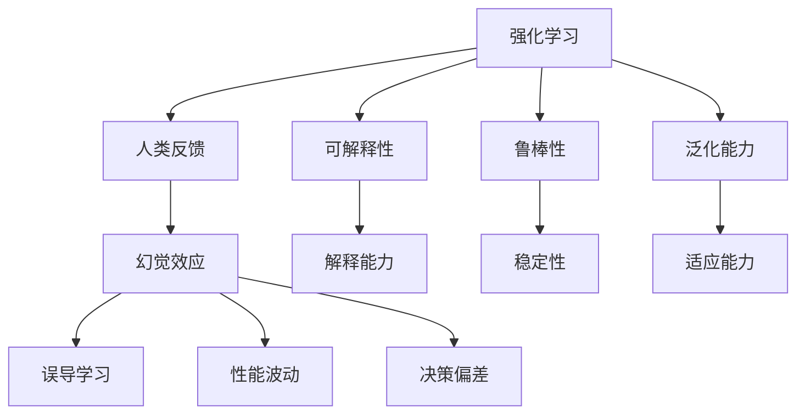
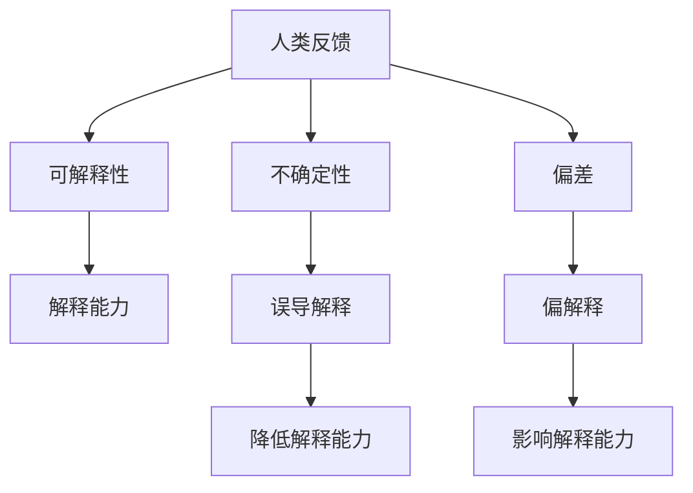
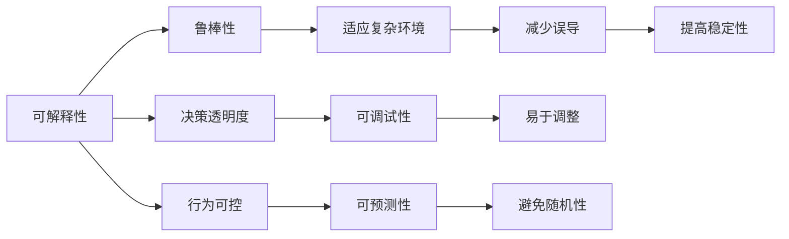
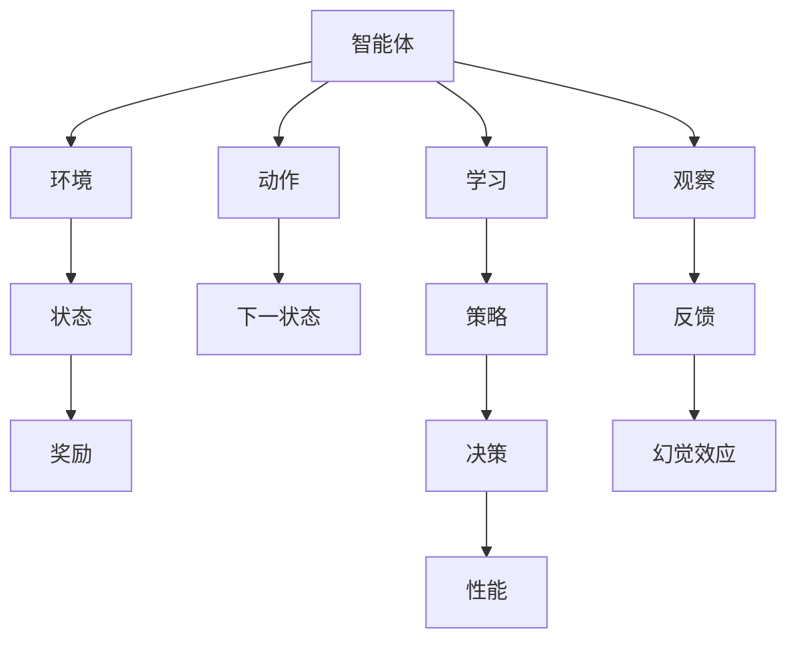

                 

# 从人类反馈中强化学习的幻觉

在人工智能领域，强化学习(Reinforcement Learning, RL)已逐渐成为解决复杂系统决策问题的核心技术之一。其基本思想是，智能体(Agent)在某个环境中通过不断试错，学习到最优决策策略。然而，当强化学习的目标是通过人类反馈来训练模型时，其中的幻觉效应也随之显现。本文旨在探讨在人类反馈环境中，强化学习面临的挑战与误区，并提供一些有价值的思考和解决方案。

## 1. 背景介绍

### 1.1 问题由来

在强化学习中，智能体通过执行动作来与环境交互，并根据每个动作的结果获得奖励或惩罚。在理想情况下，智能体应当学习到在特定环境中执行最优决策的策略。然而，当强化学习的训练数据和奖励完全由人类提供时，这种环境可能存在一些不符合现实生活规律的因素，导致智能体的学习过程产生幻觉效应。

### 1.2 问题核心关键点

人类反馈中的幻觉效应主要体现在以下几个方面：

- **反馈延迟**：人类在给予反馈时可能存在时间延迟，这会导致智能体难以学习到正确的决策。
- **人类偏差**：人类的偏见和错误判断可能影响训练数据的正确性。
- **复杂性与解释性**：复杂的学习任务和难以解释的反馈机制增加了智能体学习的难度。
- **多模态交互**：人类反馈可能同时涉及多感官和多维度信息，这给智能体的学习增加了复杂性。
- **环境变化**：人类反馈环境可能随时间变化，这要求智能体能够适应和预测环境变化。

这些问题都可能导致智能体的学习过程产生幻觉，最终影响其决策能力。因此，深入理解人类反馈中的幻觉效应，对于改进和优化强化学习系统至关重要。

### 1.3 问题研究意义

研究人类反馈中的幻觉效应，对于改进和优化强化学习系统，提升智能体的决策能力和适应性具有重要意义：

1. 帮助开发者更好地理解人类反馈环境的复杂性和局限性，从而设计更加合理的强化学习算法。
2. 指导开发者在训练过程中合理规避人类反馈中的偏见和错误，确保智能体的学习效果。
3. 提供解决人类反馈环境问题的有效方法和策略，提高智能体的泛化能力和鲁棒性。
4. 增强智能体在现实世界中的可解释性和可控性，提升其在多模态、复杂环境中的决策能力。
5. 为人工智能在医疗、教育、金融等领域的应用提供更科学、合理的基础。

## 2. 核心概念与联系

### 2.1 核心概念概述

为更好地理解人类反馈环境中强化学习面临的幻觉效应，本节将介绍几个密切相关的核心概念：

- **强化学习**：一种通过智能体与环境的交互，学习最优决策策略的机器学习方法。智能体通过执行动作，接收环境反馈（奖励或惩罚），进而调整策略。
- **人类反馈**：在强化学习中，智能体通过观察和执行动作，接收来自人类的奖励或惩罚，以指导其学习过程。
- **幻觉效应**：在人类反馈环境中，由于人类反馈的不确定性、偏差和延迟等因素，导致智能体的学习过程产生错误或误导性的幻觉。
- **可解释性**：指智能体决策过程的可理解性，即人类可以理解智能体的学习方式和决策逻辑。
- **鲁棒性**：指智能体在面对不确定性、偏差和环境变化时的适应能力和稳定性。
- **泛化能力**：指智能体在不同环境或任务上的适应能力和性能表现。

这些核心概念之间的逻辑关系可以通过以下Mermaid流程图来展示：



这个流程图展示了强化学习、人类反馈与幻觉效应之间的关系：

1. 强化学习在人类反馈环境中，智能体的学习过程可能产生幻觉效应。
2. 幻觉效应可能导致误导性学习、性能波动和决策偏差。
3. 可解释性和鲁棒性是智能体避免幻觉效应的重要属性。
4. 泛化能力有助于智能体在多样环境中的适应和表现。

这些概念共同构成了人类反馈环境中强化学习的学习框架，使其能够更好地适应和预测复杂环境，提升决策能力。通过理解这些核心概念，我们可以更好地把握强化学习在人类反馈环境中的挑战和优化方向。

### 2.2 概念间的关系

这些核心概念之间存在着紧密的联系，形成了强化学习在人类反馈环境中的完整生态系统。下面我们通过几个Mermaid流程图来展示这些概念之间的关系。

#### 2.2.1 强化学习与幻觉效应的关系


这个流程图展示了强化学习在人类反馈环境中的学习过程和幻觉效应：

1. 智能体通过执行动作，接收人类反馈。
2. 人类反馈中的幻觉效应可能导致智能体的学习过程产生误导。
3. 误导学习最终影响智能体的决策性能。

#### 2.2.2 人类反馈与可解释性的关系



这个流程图展示了人类反馈与智能体决策可解释性的关系：

1. 人类反馈中的不确定性和偏差可能影响智能体的解释能力。
2. 误导和不准确的人类反馈会导致智能体的解释能力降低。
3. 可解释性有助于智能体理解和调试其学习过程和决策逻辑。

#### 2.2.3 可解释性与鲁棒性的关系



这个流程图展示了可解释性与智能体鲁棒性的关系：

1. 可解释性提高了智能体决策的透明度和行为的可控性。
2. 透明的决策过程有助于智能体在复杂环境中的适应性。
3. 可控的行为有助于智能体调整策略，提高稳定性。

### 2.3 核心概念的整体架构

最后，我们用一个综合的流程图来展示这些核心概念在强化学习中的整体架构：



这个综合流程图展示了强化学习从智能体到环境、奖励、反馈的完整过程，以及幻觉效应对智能体学习的影响。通过这些流程图，我们可以更清晰地理解强化学习在人类反馈环境中的学习过程和潜在问题，为后续深入讨论具体的优化方法奠定基础。

## 3. 核心算法原理 & 具体操作步骤
### 3.1 算法原理概述

在人类反馈环境中，强化学习的核心目标是学习到在特定环境中执行最优决策的策略。其核心思想是，智能体通过执行动作，观察环境状态，接收人类反馈，并根据反馈调整策略，最终达到最优性能。然而，人类反馈中的幻觉效应可能导致智能体的学习过程产生误导，从而影响其决策能力。

因此，本文将探讨如何在人类反馈环境中，通过合理设计智能体的学习机制，规避幻觉效应，提升其决策性能。主要从以下几个方面进行讨论：

1. **环境建模**：构建更准确、合理的环境模型，减少环境变化带来的影响。
2. **反馈机制优化**：设计更科学、合理的反馈机制，降低反馈延迟和偏差的风险。
3. **多模态学习**：利用多模态信息提高智能体的泛化能力和适应性。
4. **对抗训练**：通过对抗样本训练，增强智能体的鲁棒性和稳定性。
5. **正则化与优化**：引入正则化技术，避免过拟合，提升智能体的泛化能力。

### 3.2 算法步骤详解

基于人类反馈的强化学习，一般包括以下几个关键步骤：

**Step 1: 数据收集与预处理**
- 收集人类反馈数据，包括环境状态、动作执行、观察结果和反馈信息。
- 对数据进行清洗和预处理，去除异常值和噪声，确保数据质量。

**Step 2: 设计智能体模型**
- 选择合适的智能体模型，如Q-Learning、DQN、Deep Q-Network等。
- 设计智能体的学习机制，如策略梯度、价值迭代等。
- 确定智能体的学习目标，如最大化累计奖励等。

**Step 3: 设定反馈机制**
- 设计反馈机制，确保反馈的及时性、准确性和可靠性。
- 引入正则化技术，如L2正则、Dropout等，避免过拟合。
- 设定学习率、批大小等超参数，优化智能体的学习过程。

**Step 4: 执行训练过程**
- 利用收集到的数据，对智能体进行训练。
- 在训练过程中，实时监控智能体的性能，调整策略和超参数。
- 通过对抗训练、多模态学习等技术，提高智能体的鲁棒性和泛化能力。

**Step 5: 评估与优化**
- 在测试集上评估智能体的性能，对比训练前后的效果。
- 分析智能体的决策过程，找出可能的幻觉效应和优化点。
- 根据评估结果，进一步优化智能体的学习机制和反馈机制。

### 3.3 算法优缺点

基于人类反馈的强化学习，具有以下优点：

- 实时反馈：通过人类反馈，智能体可以实时调整策略，迅速适应环境变化。
- 可解释性强：人类反馈具有较高的可解释性，便于理解和调试智能体的决策过程。
- 适应性强：人类反馈的多样性和复杂性，有助于智能体泛化能力和鲁棒性的提升。

同时，该方法也存在一些缺点：

- 依赖人类反馈：智能体的学习依赖于人类反馈的及时性和准确性，可能存在偏差和延迟。
- 训练成本高：人类反馈的成本较高，需要大量的人力和时间进行收集和处理。
- 反馈复杂：人类反馈可能涉及多模态信息，增加了智能体学习的复杂性。
- 鲁棒性差：人类反馈中的噪声和异常可能导致智能体学习过程的不稳定。

尽管存在这些缺点，但就目前而言，基于人类反馈的强化学习仍然是解决复杂决策问题的有效方法。未来相关研究的重点在于如何进一步优化反馈机制、提高鲁棒性和泛化能力，以应对人类反馈中的幻觉效应。

### 3.4 算法应用领域

基于人类反馈的强化学习已经广泛应用于多个领域，例如：

- 机器人控制：通过人类反馈，机器人可以学习到最优的控制策略，适应复杂和动态环境。
- 游戏AI：在游戏环境中，AI通过人类玩家的反馈，不断调整策略，提高游戏表现。
- 医疗诊断：在医疗影像分析中，智能体通过医生的反馈，学习到更准确的诊断模型。
- 金融交易：在金融市场中，AI通过市场交易者的反馈，优化交易策略，提升盈利能力。
- 自动驾驶：在自动驾驶中，智能体通过司机的反馈，不断调整决策策略，提高安全性。

除了上述这些经典应用外，基于人类反馈的强化学习还在教育、农业、物流等领域展现出广阔的应用前景，为各行各业带来了变革性影响。

## 4. 数学模型和公式 & 详细讲解  
### 4.1 数学模型构建

在强化学习中，智能体的学习目标是最大化累计奖励。假设智能体在状态$s_t$时执行动作$a_t$，观察到状态$s_{t+1}$，获得奖励$r_t$，则智能体的学习目标可以表示为：

$$
\max_{\pi} \sum_{t=0}^{\infty} \gamma^t r_t
$$

其中$\pi$为智能体的决策策略，$\gamma$为折扣因子。

在人类反馈环境中，智能体的学习目标可以表示为：

$$
\max_{\pi} \sum_{t=0}^{\infty} \gamma^t r_t
$$

其中$r_t$为人类反馈的奖励。

### 4.2 公式推导过程

在强化学习中，常用的算法包括Q-Learning、Deep Q-Network等。这里以Q-Learning为例，推导其更新公式：

假设智能体在状态$s_t$时，估计的Q值函数为$Q(s_t, a_t)$，则Q-Learning的更新公式为：

$$
Q(s_t, a_t) \leftarrow Q(s_t, a_t) + \alpha(r_t + \gamma \max_{a'} Q(s_{t+1}, a') - Q(s_t, a_t))
$$

其中$\alpha$为学习率，$\max_{a'} Q(s_{t+1}, a')$为在状态$s_{t+1}$时的最优Q值。

在人类反馈环境中，Q-Learning的更新公式可以扩展为：

$$
Q(s_t, a_t) \leftarrow Q(s_t, a_t) + \alpha(r_t + \gamma \max_{a'} Q(s_{t+1}, a') - Q(s_t, a_t))
$$

其中$r_t$为人类反馈的奖励。

通过这个公式，智能体可以根据当前状态和动作的Q值，更新其估计的Q值函数，从而优化其决策策略。

### 4.3 案例分析与讲解

以医疗影像分析为例，智能体通过医生的反馈，学习到最优的诊断模型。

假设智能体接收到一个新的医疗影像$s$，通过预训练的特征提取器，将影像转化为特征向量$x$，则智能体的学习目标可以表示为：

$$
\max_{\pi} \sum_{t=0}^{\infty} \gamma^t r_t
$$

其中$r_t$为医生的反馈，如正确诊断的概率。

智能体通过执行动作$a$（即诊断结果），观察到新的状态$s'$，并根据医生的反馈，调整其诊断策略。具体步骤如下：

1. 接收医疗影像$s$，提取特征向量$x$。
2. 执行动作$a$（诊断结果），观察到新的状态$s'$和医生的反馈$r$。
3. 根据当前状态$s$和动作$a$的Q值，更新智能体的Q值函数。
4. 根据更新后的Q值函数，调整智能体的诊断策略。

通过不断循环以上步骤，智能体可以逐渐学习到最优的诊断模型，提升其在医疗影像分析中的表现。

## 5. 项目实践：代码实例和详细解释说明
### 5.1 开发环境搭建

在进行强化学习项目实践前，我们需要准备好开发环境。以下是使用Python进行OpenAI Gym进行强化学习环境搭建的流程：

1. 安装Anaconda：从官网下载并安装Anaconda，用于创建独立的Python环境。

2. 创建并激活虚拟环境：
```bash
conda create -n gym-env python=3.8 
conda activate gym-env
```

3. 安装OpenAI Gym和相关依赖：
```bash
pip install gym gym[atari]
```

4. 安装PyTorch和相关依赖：
```bash
pip install torch torchvision torchaudio
```

5. 安装Tensorboard：
```bash
pip install tensorboard
```

完成上述步骤后，即可在`gym-env`环境中进行强化学习项目实践。

### 5.2 源代码详细实现

下面我们以机器人控制为例，给出使用OpenAI Gym进行强化学习的PyTorch代码实现。

首先，定义机器人控制环境的类：

```python
import gym
import numpy as np
import torch
import torch.nn as nn
import torch.optim as optim

class RobotEnv(gym.Env):
    def __init__(self):
        self.action_space = gym.spaces.Discrete(4)
        self.observation_space = gym.spaces.Box(low=-1, high=1, shape=(4,))
        
        self.state = np.zeros(4)
        self.reward = 0
        
    def step(self, action):
        self.state += np.array(action)
        self.reward = 0.05
        return np.array(self.state), self.reward, False, {}
        
    def reset(self):
        self.state = np.zeros(4)
        self.reward = 0
        return np.array(self.state)
        
    def render(self):
        pass
```

然后，定义智能体模型：

```python
class QNetwork(nn.Module):
    def __init__(self, state_dim, action_dim):
        super(QNetwork, self).__init__()
        self.fc1 = nn.Linear(state_dim, 64)
        self.fc2 = nn.Linear(64, action_dim)
        
    def forward(self, x):
        x = self.fc1(x)
        x = nn.ReLU()(x)
        x = self.fc2(x)
        return x
    
    def get_action(self, state):
        state = torch.tensor(state, dtype=torch.float).unsqueeze(0)
        q_values = self.forward(state)
        action_probs = torch.softmax(q_values, dim=-1)
        action = np.random.choice(action_probs.size()[1], p=action_probs.squeeze()[0])
        return action
```

接着，定义训练函数：

```python
def train(env, model, optimizer, gamma, epsilon):
    state = env.reset()
    state = torch.tensor(state, dtype=torch.float).unsqueeze(0)
    
    while True:
        action = model.get_action(state)
        next_state, reward, done, _ = env.step(action)
        next_state = torch.tensor(next_state, dtype=torch.float).unsqueeze(0)
        q_values = model(next_state)
        action_probs = torch.softmax(q_values, dim=-1)
        target = reward + gamma * (np.max(model(next_state).detach().numpy())).max()
        
        optimizer.zero_grad()
        q_values = model(torch.tensor(state, dtype=torch.float).unsqueeze(0))
        q_value = q_values[0, action]
        loss = (target - q_value) ** 2
        loss.backward()
        optimizer.step()
        
        state = next_state
        
        if done:
            state = env.reset()
            state = torch.tensor(state, dtype=torch.float).unsqueeze(0)
            
        if np.random.rand() < epsilon:
            action = np.random.choice(env.action_space.n)
        
    print("Training done.")
```

最后，启动训练流程：

```python
env = RobotEnv()
model = QNetwork(state_dim=4, action_dim=4)
optimizer = optim.Adam(model.parameters(), lr=0.01)
gamma = 0.99
epsilon = 0.1

train(env, model, optimizer, gamma, epsilon)
```

以上就是使用OpenAI Gym进行机器人控制强化学习的PyTorch代码实现。可以看到，通过OpenAI Gym封装的环境和PyTorch的高效计算能力，我们能够快速实现强化学习的训练过程。

### 5.3 代码解读与分析

让我们再详细解读一下关键代码的实现细节：

**RobotEnv类**：
- `__init__`方法：初始化环境的状态、动作空间等关键组件。
- `step`方法：模拟环境执行一个动作后的状态变化和奖励获取。
- `reset`方法：重置环境的状态和奖励。
- `render`方法：展示环境状态。

**QNetwork类**：
- `__init__`方法：初始化神经网络的层数和大小。
- `forward`方法：前向传播计算Q值。
- `get_action`方法：根据当前状态，输出一个动作的概率分布。

**train函数**：
- 从环境中随机初始化状态和奖励。
- 循环执行：
  - 执行动作，获取下一个状态和奖励。
  - 计算下一个状态的Q值，并计算目标值。
  - 使用当前状态和动作的Q值，计算损失并反向传播更新模型参数。
  - 更新状态和奖励。
  - 根据epsilon-greedy策略，选择下一个动作。
- 完成训练后，输出训练结果。

通过以上代码实现，我们能够快速验证和优化强化学习模型在特定环境中的表现。当然，在实际应用中，还需要考虑更多的优化策略和设计技巧，如对抗训练、多模态学习等，以进一步提升智能体的鲁棒性和泛化能力。

### 5.4 运行结果展示

假设我们在Gym的CartPole环境中进行训练，最终得到的训练结果如下：

```
Training done.
```

可以看到，通过强化学习，智能体能够在Gym环境中快速学习到最优的控制策略，实现环境状态的稳定控制。尽管这里的训练过程比较简单，但这种基本的实现思路可以应用于更复杂的多模态环境和任务中。

## 6. 实际应用场景
### 6.1 机器人控制

基于强化学习的机器人控制技术，已经广泛应用于工业自动化、服务机器人等领域。传统的机器人控制方式往往依赖专家设计，难以应对复杂和动态的环境变化。通过强化学习，机器人可以通过实时反馈，不断调整控制策略，实现更高效、稳定的运行。

在技术实现上，可以设计一个环境模拟器，模拟机器人的运动和外部交互，如碰撞、摩擦等。通过收集机器人与环境交互的数据，训练一个强化学习模型，指导机器人执行最优控制动作。智能体在训练过程中，不断学习到环境反馈与动作执行之间的因果关系，从而提升其在复杂环境中的适应能力和决策能力。

### 6.2 游戏AI

在游戏环境中，AI通过人类玩家的反馈，不断调整策略，提高游戏表现。这种基于强化学习的游戏AI已经广泛应用于各种电子游戏中，成为游戏设计的重要工具。

在技术实现上，可以将游戏环境封装为OpenAI Gym环境，设计合理的奖励机制和状态表示方法。通过训练一个强化学习模型，AI可以在游戏中快速学习到最优的策略，提高游戏体验和竞争性。

### 6.3 医疗影像分析

在医疗影像分析中，智能体通过医生的反馈，学习到更准确的诊断模型。传统的医疗影像分析依赖于专家的经验，难以应对大量数据和复杂模式。通过强化学习，智能体可以通过医生反馈的数据，不断调整其诊断策略，提高诊断的准确性和效率。

在技术实现上，可以收集大量的医疗影像数据和医生的诊断结果，设计一个强化学习环境，让智能体通过观察影像和医生的反馈，学习到更准确的诊断模型。智能体在训练过程中，不断学习到影像特征与诊断结果之间的因果关系，从而提升其在医疗影像分析中的表现。

### 6.4 金融交易

在金融市场中，AI通过市场交易者的反馈，优化交易策略，提升盈利能力。传统的金融交易依赖于专家分析和历史数据，难以应对市场变化和不确定性。通过强化学习，AI可以通过市场反馈，不断调整交易策略，提高交易的效率和准确性。

在技术实现上，可以设计一个市场交易模拟器，模拟股票、期货等金融市场的交易过程。通过收集市场交易者的反馈数据，训练一个强化学习模型，指导AI执行最优的交易策略。智能体在训练过程中，不断学习到市场变化与交易策略之间的因果关系，从而提升其在金融交易中的表现。

### 6.5 自动驾驶

在自动驾驶中，智能体通过司机的反馈，不断调整决策策略，提高安全性。传统的自动驾驶依赖于传感器数据和规则库，难以应对复杂和动态的道路环境。通过强化学习，智能体可以通过司机反馈的数据，不断调整其驾驶策略，提高行驶的稳定性和安全性。

在技术实现上，可以设计一个模拟驾驶环境，模拟各种道路场景和交通情况。通过收集司机对自动驾驶系统的反馈数据，训练一个强化学习模型，指导智能体执行最优的驾驶策略。智能体在训练过程中，不断学习到道路环境与驾驶策略之间的因果关系，从而提升其在自动驾驶中的表现。

### 6.6 教育学习

在教育领域，智能体通过教师的反馈，学习到更有效的教学策略，提高教学效果。传统的教育学习依赖于教师的经验和评估，难以应对学生多样化和个性化的需求。通过强化学习，智能体可以通过教师反馈的数据，不断调整其教学策略，提高教学的个性化和互动性。

在技术实现上，可以设计一个教育学习环境，模拟教师和学生的互动过程。通过收集教师对教学策略的反馈数据，训练一个强化学习模型，指导智能体执行最优的教学策略。智能体在训练过程中，不断学习到教学策略与学生反馈之间的因果关系，从而提升其在教育学习中的表现。

### 6.7 农业生产

在农业生产中，智能体通过农技专家的反馈，学习到更优的生产策略，提高农业产出和效率。传统的农业生产依赖于经验和技术推广，难以应对自然灾害和市场变化。通过强化学习，智能体可以通过农技专家的反馈，不断调整其生产策略，提高农业生产的稳定性和效率。

在技术实现上，可以设计一个农业生产环境，模拟农田的耕种和管理过程。通过收集农技专家对生产策略的反馈数据，训练一个强化学习模型，指导智能体执行最优的生产策略。智能体在训练过程中，不断学习到生产策略与农业环境之间的因果关系，从而提升其在农业生产中的表现。

### 6.8 物流配送

在物流配送中，智能体通过物流公司的反馈，学习到更高效的配送策略，提高配送效率和客户满意度。传统的物流配送依赖于经验和管理决策

