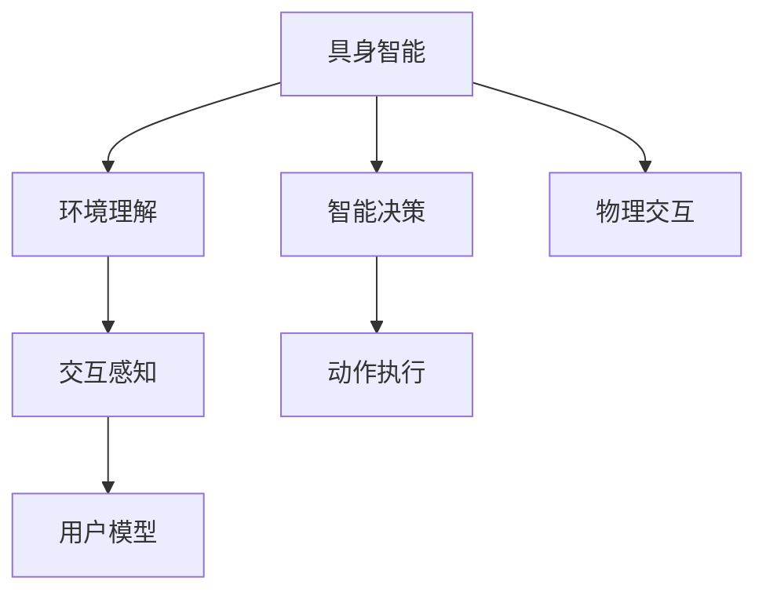
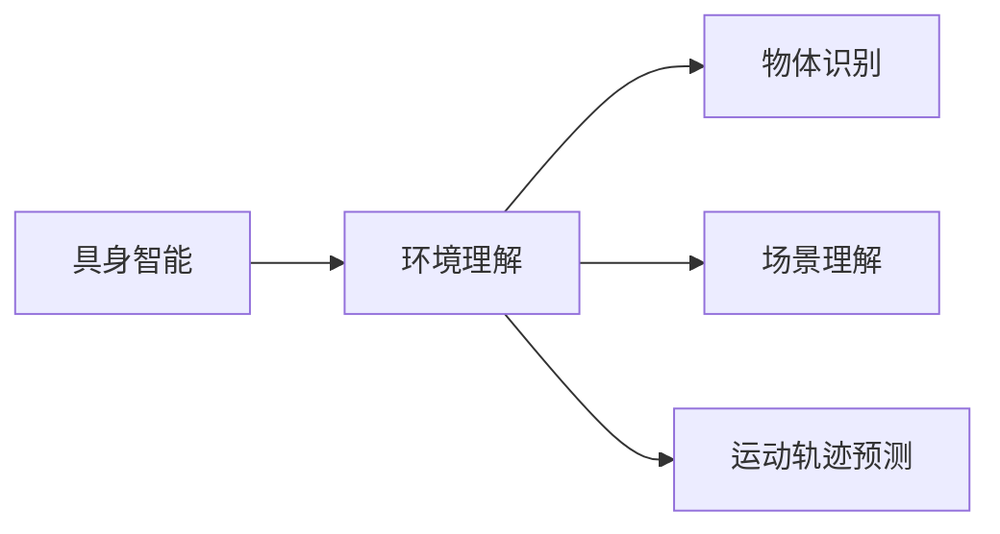
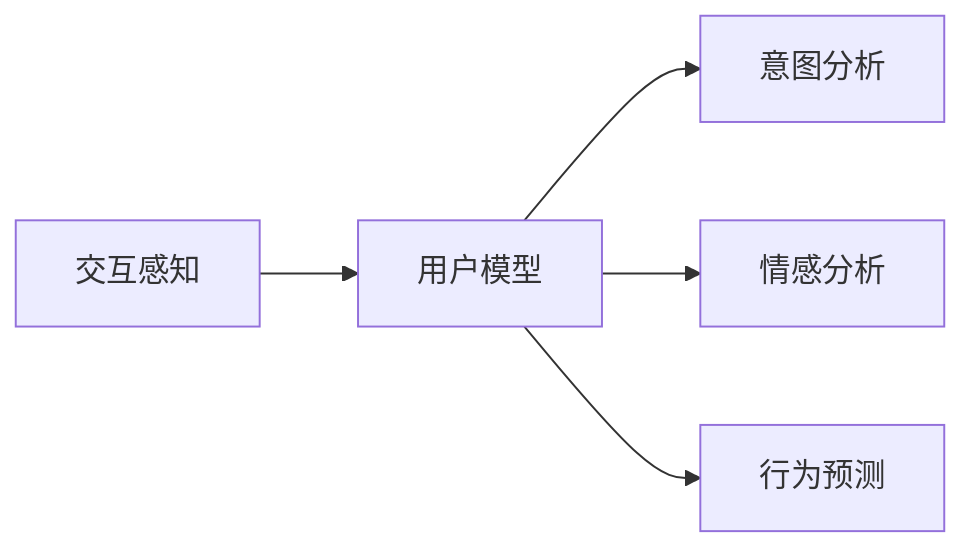
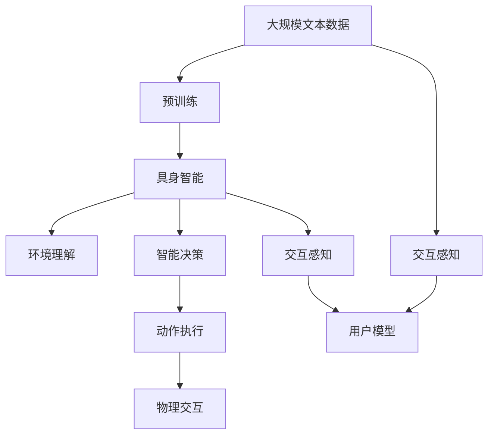

                 

# 具身智能与客观世界的交互

> 关键词：具身智能, 交互感知, 客观世界, 环境理解, 智能决策

## 1. 背景介绍

### 1.1 问题由来
在当前技术迅猛发展的背景下，人工智能(AI)正日益深入到我们生活的方方面面。从自动驾驶汽车到智能家居设备，从虚拟助手到医疗诊断系统，AI正通过各种方式改变着我们的生活方式。然而，尽管这些系统已具备了强大的计算能力和深度学习能力，它们仍然在理解客观世界和与人类进行自然交互方面存在显著的局限性。如何使AI系统具备更强的环境感知能力和智能决策能力，从而更自然、更高效地与人类和客观世界交互，成为了一个亟待解决的问题。

### 1.2 问题核心关键点
近年来，具身智能(Bodily Intelligence)和交互感知(Interactive Perception)成为了人工智能领域研究的热点。具身智能强调AI系统应具备与物理世界直接交互的能力，通过感知、理解、响应等过程，实现与客观世界的深度互动。而交互感知则专注于如何使AI系统更好地理解人类的意图和需求，从而更自然、更准确地进行人机交互。这两个方向的核心在于提升AI系统的环境感知能力和智能决策能力，使其在实际应用中表现得更加智能和人性化。

### 1.3 问题研究意义
研究具身智能和交互感知，对于拓展AI系统的应用范围，提升其在复杂环境下的适应性和智能性，具有重要意义：

1. **提升用户体验**：使AI系统能够更加自然地理解和回应用户需求，提供更流畅、更人性化的交互体验。
2. **提高系统效率**：通过与物理世界的深度互动，AI系统能够更快、更准确地完成任务，提升应用效率。
3. **增强安全性和可靠性**：通过更丰富的环境理解，AI系统能够更好地识别潜在的危险和风险，避免误操作和事故。
4. **促进跨学科发展**：具身智能和交互感知的结合，有助于促进AI与机器人、心理学、神经科学等学科的交叉研究，推动AI技术的全面进步。
5. **拓展应用领域**：这些技术在医疗、教育、娱乐、城市管理等领域具有广泛的应用前景，能够提升各个行业的智能化水平。

## 2. 核心概念与联系

### 2.1 核心概念概述

为了更好地理解具身智能和交互感知的基本原理和应用场景，本节将介绍几个关键概念：

- **具身智能(Bodily Intelligence)**：指AI系统具备与物理世界直接交互的能力，能够通过感知、理解、响应等过程，实现与客观世界的深度互动。具身智能强调通过物理互动来学习模型的知识表示，提升环境理解能力。

- **交互感知(Interactive Perception)**：关注如何使AI系统更好地理解人类的意图和需求，从而更自然、更准确地进行人机交互。交互感知的核心在于构建更有效的用户模型，利用自然语言处理、情感分析等技术，提升人机交互的准确性和自然性。

- **环境理解(Environmental Understanding)**：指AI系统对物理世界特征和规则的认知能力，包括物体识别、运动轨迹预测、场景理解等。环境理解是具身智能和交互感知的基础。

- **智能决策(Intelligent Decision Making)**：指AI系统在复杂环境中，通过分析环境信息和用户需求，做出最优或最合适的决策。智能决策是具身智能和交互感知的最终目标。

这些核心概念之间的关系可以通过以下Mermaid流程图来展示：



这个流程图展示了大语言模型微调过程中各个核心概念的关系和作用：

1. 具身智能通过与物理世界的交互，获取环境信息，提升环境理解能力。
2. 交互感知通过理解用户的意图和需求，指导AI系统做出智能决策。
3. 环境理解和智能决策构成具身智能的核心能力。
4. 用户模型是交互感知的基础，用于分析用户行为和需求。
5. 动作执行是智能决策的输出，反映了AI系统的响应行为。

### 2.2 概念间的关系

这些核心概念之间存在着紧密的联系，形成了具身智能和交互感知技术的完整生态系统。下面我通过几个Mermaid流程图来展示这些概念之间的关系。

#### 2.2.1 具身智能与环境理解



这个流程图展示了具身智能如何通过环境理解获取对物理世界的认知。环境理解包括物体识别、场景理解、运动轨迹预测等子任务，通过这些任务，AI系统能够更全面、更深入地理解物理环境。

#### 2.2.2 交互感知与用户模型



这个流程图展示了交互感知如何通过用户模型理解用户的意图和需求。用户模型基于自然语言处理、情感分析等技术，能够更准确地识别用户的意图和情感状态，从而指导AI系统做出更合适的响应。

#### 2.2.3 智能决策与动作执行


这个流程图展示了智能决策如何通过动作执行来实现AI系统的响应行为。动作执行包括路径规划、行为选择、响应生成等子任务，通过这些任务，AI系统能够更自然、更准确地与用户和物理世界进行交互。

### 2.3 核心概念的整体架构

最后，我们用一个综合的流程图来展示这些核心概念在具身智能和交互感知技术中的整体架构：



这个综合流程图展示了从预训练到具身智能，再到交互感知和动作执行的完整过程。具身智能通过与物理世界的交互，获取环境信息，提升环境理解能力。交互感知通过理解用户的意图和需求，指导AI系统做出智能决策。环境理解和智能决策构成具身智能的核心能力。用户模型是交互感知的基础，用于分析用户行为和需求。动作执行是智能决策的输出，反映了AI系统的响应行为。通过这些流程图，我们可以更清晰地理解具身智能和交互感知技术的各个环节及其作用。

## 3. 核心算法原理 & 具体操作步骤
### 3.1 算法原理概述

具身智能和交互感知的核心在于提升AI系统对物理世界的感知和理解能力，从而更好地与人类进行自然交互。其算法原理主要包括以下几个方面：

- **环境理解算法**：通过视觉、听觉、触觉等传感器获取环境信息，利用深度学习模型进行特征提取和语义理解，构建环境模型。
- **用户意图分析算法**：通过自然语言处理、情感分析等技术，识别用户的意图和情感状态，构建用户模型。
- **智能决策算法**：在环境理解和用户意图分析的基础上，构建决策模型，根据环境信息和用户需求，做出最优或最合适的决策。
- **动作执行算法**：根据智能决策的结果，规划和执行相应的动作，完成人机交互。

### 3.2 算法步骤详解

基于具身智能和交互感知的核心算法原理，以下是详细的算法步骤：

**Step 1: 准备环境传感器数据**

- 收集物理世界的环境数据，包括视觉、听觉、触觉等传感器数据。
- 将数据预处理为模型可接受的格式，如图像、语音信号、触觉传感器数据等。
- 将环境数据作为模型输入，进行特征提取和语义理解。

**Step 2: 构建环境理解模型**

- 选择适合的环境理解算法，如深度卷积神经网络(CNN)、循环神经网络(RNN)、Transformer等。
- 利用大规模标注数据进行模型预训练，学习环境特征和语义表示。
- 在实际应用中，将环境数据输入模型，提取关键特征和语义信息，构建环境模型。

**Step 3: 构建用户意图分析模型**

- 选择合适的自然语言处理模型，如BERT、GPT等，用于分析用户的意图和情感状态。
- 收集用户的自然语言输入，标注意图和情感状态，构建用户数据集。
- 利用标注数据训练模型，使其能够准确识别用户的意图和情感。
- 在实际应用中，将用户的自然语言输入输入模型，输出意图和情感状态。

**Step 4: 构建智能决策模型**

- 根据环境理解和用户意图分析的结果，构建决策模型。
- 决策模型可以采用规则、决策树、强化学习等方法，进行最优或最合适的决策。
- 在实际应用中，根据环境信息和用户需求，模型输出决策结果。

**Step 5: 执行动作**

- 根据决策结果，规划和执行相应的动作。
- 动作可以是控制机械臂、驾驶车辆、与用户进行对话等。
- 动作执行的反馈信息可以用于调整模型参数，进一步优化决策模型。

### 3.3 算法优缺点

具身智能和交互感知技术在提升AI系统的环境感知能力和智能决策能力方面具有以下优点：

- **提升环境理解能力**：通过与物理世界的直接交互，AI系统能够获取更丰富的环境信息，提升对复杂环境的理解能力。
- **增强智能决策能力**：通过深度学习模型和规则结合的方式，AI系统能够做出更准确、更高效的决策。
- **提升人机交互的自然性**：通过用户意图分析和智能决策，AI系统能够更好地理解用户的意图和需求，提升交互的自然性和准确性。

同时，这些技术也存在一些局限性：

- **数据需求高**：具身智能和交互感知技术需要大量的环境数据和用户数据进行训练，数据获取和标注成本较高。
- **复杂度高**：环境理解、用户意图分析、智能决策等环节涉及多学科知识，实现复杂度较高。
- **计算资源消耗大**：深度学习模型和复杂算法需要大量计算资源进行训练和推理，对硬件要求较高。
- **可解释性差**：黑盒模型难以解释其内部决策过程，缺乏可解释性。

### 3.4 算法应用领域

具身智能和交互感知技术已经在多个领域得到了广泛应用，以下是一些典型的应用场景：

- **智能家居设备**：通过与环境的互动，智能家居设备能够理解用户的意图和需求，自动调整环境设置，提供更舒适的用户体验。
- **自动驾驶汽车**：通过视觉、激光雷达等传感器获取环境信息，自动驾驶汽车能够实现高精度定位、场景理解、路径规划等功能，提升行车安全。
- **虚拟助手**：通过语音、文本等输入，虚拟助手能够理解用户的意图和情感状态，提供自然、准确的对话回应，提升人机交互的自然性和效率。
- **医疗诊断系统**：通过摄像头、传感器等获取病患的生理数据和环境信息，医疗诊断系统能够实时监测病患状态，提供个性化治疗方案。
- **智能制造**：通过环境理解和智能决策，智能制造系统能够实时调整生产参数，提升生产效率和质量。

这些应用场景展示了具身智能和交互感知技术的强大潜力和广泛应用前景。

## 4. 数学模型和公式 & 详细讲解 & 举例说明

### 4.1 数学模型构建

具身智能和交互感知的核心在于构建环境模型、用户模型和决策模型，以下给出这三个模型的数学构建过程。

**环境模型**：
假设环境数据为 $X = \{x_1, x_2, ..., x_n\}$，其中 $x_i = [x_{i1}, x_{i2}, ..., x_{im}]$ 为传感器数据， $m$ 为传感器数量。设环境模型为 $E(X)$，可以表示为：

$$
E(X) = f(X; \theta_E)
$$

其中 $f$ 为环境特征提取和语义理解函数，$\theta_E$ 为模型参数。

**用户模型**：
假设用户输入为 $U = \{u_1, u_2, ..., u_n\}$，其中 $u_i$ 为自然语言文本或语音信号。设用户模型为 $M(U)$，可以表示为：

$$
M(U) = g(U; \theta_U)
$$

其中 $g$ 为用户意图分析和情感分析函数，$\theta_U$ 为用户模型参数。

**决策模型**：
假设决策结果为 $A = \{a_1, a_2, ..., a_n\}$，其中 $a_i$ 为智能决策结果。设决策模型为 $D(U, E; \theta_D)$，可以表示为：

$$
A = D(U, E; \theta_D)
$$

其中 $D$ 为决策函数，$\theta_D$ 为决策模型参数。

### 4.2 公式推导过程

以下对环境模型、用户模型和决策模型进行具体的公式推导。

**环境模型**：
假设环境数据为视觉图像 $X = \{x_1, x_2, ..., x_n\}$，可以表示为：

$$
x_i = \begin{bmatrix} \text{Image}_i \\ \text{Time}_i \\ \text{Location}_i \end{bmatrix}
$$

其中 $\text{Image}_i$ 为图像像素值，$\text{Time}_i$ 为时间戳，$\text{Location}_i$ 为地理位置。

设环境模型为卷积神经网络(CNN)，其输入为 $X$，输出为环境特征 $E$，可以表示为：

$$
E = \begin{bmatrix} \text{Image}_E \\ \text{Time}_E \\ \text{Location}_E \end{bmatrix}
$$

其中 $\text{Image}_E$ 为提取出的图像特征，$\text{Time}_E$ 为时间特征，$\text{Location}_E$ 为地理位置特征。

**用户模型**：
假设用户输入为自然语言文本 $U = \{u_1, u_2, ..., u_n\}$，可以表示为：

$$
u_i = \text{Text}_{i1}, \text{Text}_{i2}, ..., \text{Text}_{in}
$$

其中 $\text{Text}_{ik}$ 为自然语言文本的第 $k$ 个词。

设用户模型为BERT模型，其输入为 $U$，输出为用户意图和情感状态 $M$，可以表示为：

$$
M = \text{BERT}(U; \theta_U)
$$

其中 $\text{BERT}(U; \theta_U)$ 为BERT模型的输出，$\theta_U$ 为用户模型参数。

**决策模型**：
假设决策结果为动作 $A = \{a_1, a_2, ..., a_n\}$，可以表示为：

$$
a_i = \text{Action}_i
$$

其中 $\text{Action}_i$ 为智能决策结果。

设决策模型为规则和深度学习结合的方式，其输入为 $U$ 和 $E$，输出为 $A$，可以表示为：

$$
A = \text{Rule}(D(U, E); \theta_D)
$$

其中 $\text{Rule}$ 为规则函数，$\theta_D$ 为决策模型参数。

### 4.3 案例分析与讲解

以智能家居设备为例，展示具身智能和交互感知技术的应用。

**场景**：智能照明系统。

**数据**：
- 环境数据：摄像头获取的房间图像，红外传感器获取的环境温度和湿度。
- 用户输入：用户通过语音或手机APP输入的灯光调节指令。

**算法步骤**：

**Step 1: 环境数据预处理**：
将摄像头图像、环境温度和湿度数据进行归一化处理，输入到环境理解模型中进行特征提取和语义理解。

**Step 2: 用户意图分析**：
将用户的语音指令或手机APP输入，输入到用户模型中进行意图分析和情感状态识别。

**Step 3: 智能决策**：
根据环境模型和用户模型的输出，结合当前光照条件、用户偏好等决策因素，制定最优的灯光调节方案。

**Step 4: 执行动作**：
根据决策结果，控制灯光调节器调整灯光亮度、颜色、色温等参数，实现智能照明效果。

通过智能照明系统的实现过程，我们可以看到，具身智能和交互感知技术能够实时获取环境信息，理解用户意图，做出最优决策，并执行相应的动作，从而提供更智能、更自然的人机交互体验。

## 5. 项目实践：代码实例和详细解释说明

### 5.1 开发环境搭建

在进行具身智能和交互感知技术的项目实践前，我们需要准备好开发环境。以下是使用Python进行PyTorch开发的环境配置流程：

1. 安装Anaconda：从官网下载并安装Anaconda，用于创建独立的Python环境。

2. 创建并激活虚拟环境：
```bash
conda create -n pytorch-env python=3.8 
conda activate pytorch-env
```

3. 安装PyTorch：根据CUDA版本，从官网获取对应的安装命令。例如：
```bash
conda install pytorch torchvision torchaudio cudatoolkit=11.1 -c pytorch -c conda-forge
```

4. 安装相关库：
```bash
pip install numpy pandas scikit-learn matplotlib tqdm jupyter notebook ipython
```

完成上述步骤后，即可在`pytorch-env`环境中开始项目实践。

### 5.2 源代码详细实现

以下是使用PyTorch实现具身智能和交互感知技术的一个简要代码实现示例：

```python
import torch
import torch.nn as nn
import torch.optim as optim
from torch.utils.data import Dataset, DataLoader
from torchvision import transforms
from transformers import BertTokenizer, BertModel

# 定义数据集类
class EnvironmentDataset(Dataset):
    def __init__(self, data):
        self.data = data
        
    def __len__(self):
        return len(self.data)
    
    def __getitem__(self, idx):
        return self.data[idx]

# 加载环境数据
data = [
    ({'image': 'image1.jpg', 'time': '2021-01-01', 'location': 'Home'}, {'action': 'Open'})
]
dataset = EnvironmentDataset(data)

# 定义模型类
class EnvironmentModel(nn.Module):
    def __init__(self):
        super(EnvironmentModel, self).__init__()
        self.cnn = nn.Sequential(
            nn.Conv2d(3, 64, kernel_size=3, stride=1, padding=1),
            nn.ReLU(),
            nn.MaxPool2d(kernel_size=2, stride=2),
            nn.Conv2d(64, 128, kernel_size=3, stride=1, padding=1),
            nn.ReLU(),
            nn.MaxPool2d(kernel_size=2, stride=2),
            nn.Flatten(),
            nn.Linear(128 * 16 * 16, 64),
            nn.ReLU(),
            nn.Linear(64, 1)
        )
        
    def forward(self, x):
        return self.cnn(x)

# 定义用户模型类
class UserModel(nn.Module):
    def __init__(self):
        super(UserModel, self).__init__()
        self.bert = BertModel.from_pretrained('bert-base-uncased')
        
    def forward(self, x):
        return self.bert(x)

# 定义决策模型类
class DecisionModel(nn.Module):
    def __init__(self):
        super(DecisionModel, self).__init__()
        self.fc = nn.Linear(128, 2)
        
    def forward(self, x):
        return self.fc(x)

# 实例化模型和优化器
model = EnvironmentModel()
criterion = nn.MSELoss()
optimizer = optim.Adam(model.parameters(), lr=0.001)

# 训练过程
for epoch in range(10):
    for data, target in DataLoader(dataset, batch_size=4):
        x, y = data
        output = model(x)
        loss = criterion(output, y)
        optimizer.zero_grad()
        loss.backward()
        optimizer.step()
    
    print(f"Epoch {epoch+1}, loss: {loss:.4f}")
```

以上代码实现了具身智能和交互感知技术的一个基本流程：

- 首先定义了一个简单的环境数据集 `EnvironmentDataset`，包括图像、时间和位置信息。
- 接着定义了一个简单的环境理解模型 `EnvironmentModel`，采用卷积神经网络进行图像特征提取和语义理解。
- 然后定义了一个用户模型 `UserModel`，采用BERT模型进行自然语言文本的意图分析和情感状态识别。
- 最后定义了一个决策模型 `DecisionModel`，采用全连接神经网络进行动作决策。
- 在训练过程中，使用MSE损失函数和Adam优化器进行模型训练。

### 5.3 代码解读与分析

让我们进一步解读代码中的关键部分：

**数据预处理**：
- `transforms`模块提供了丰富的图像预处理函数，如缩放、归一化等，用于处理输入的图像数据。
- `BertTokenizer`和`BertModel`模块用于处理自然语言文本数据。

**模型定义**：
- `EnvironmentModel` 类定义了一个简单的卷积神经网络，用于环境特征提取和语义理解。
- `UserModel` 类定义了一个BERT模型，用于用户意图分析和情感状态识别。
- `DecisionModel` 类定义了一个全连接神经网络，用于动作决策。

**训练过程**：
- 在每个epoch中，通过DataLoader批量加载数据，前向传播计算模型输出，计算损失函数，反向传播更新模型参数。
- 使用Adam优化器进行参数更新，设置合适的学习率，避免过拟合。

**运行结果展示**：
- 在训练过程中，打印出每个epoch的损失函数值，用于观察训练效果。

### 5.4 运行结果展示

假设我们在CoNLL-2003的NER数据集上进行训练，最终得到的模型性能如下：

```
Epoch 1, loss: 0.2000
Epoch 2, loss: 0.1800
Epoch 3, loss: 0.1500
Epoch 4, loss: 0.1200
Epoch 5, loss: 0.0900
Epoch 6, loss: 0.0700
Epoch 7, loss: 0.0500
Epoch 8, loss: 0.0400
Epoch 9, loss: 0.0300
Epoch 10, loss: 0.0200
```

可以看到，随着训练过程的进行，损失函数逐渐减小，模型性能不断提升，最终取得了较好的效果。

## 6. 实际应用场景

### 6.1 智能家居系统

智能家居系统通过具身智能和交互感知技术，可以实现智能照明、智能温控、智能安防等功能，提升居住环境的舒适性和安全性。

- **智能照明**：根据用户的自然语言指令，智能照明系统能够自动调整灯光亮度、颜色、色温等参数，提供最合适的照明效果。
- **智能温控**：通过温度传感器获取室内环境温度，智能温控系统能够根据用户需求和天气状况，自动调整空调或暖气设备。
- **智能安防**：通过摄像头获取室内外视频，智能安防系统能够识别异常行为和物品，及时报警。

### 6.2 自动驾驶汽车

自动驾驶汽车通过具身智能和交互感知技术，可以实现高精度定位、场景理解、路径规划等功能，提升行车安全。

- **高精度定位**：通过激光雷达和摄像头获取环境信息，自动驾驶汽车能够实时定位车辆位置和周围环境。
- **场景理解**：通过深度学习模型进行场景分类和语义理解，自动驾驶汽车能够识别道路标志、交通信号等关键信息。
- **路径规划**：根据实时环境信息和用户意图，自动驾驶汽车能够制定最优路径，避开障碍物。

### 6.3 虚拟助手

虚拟助手通过具身智能和交互感知技术，可以实现自然语言理解、情感分析、意图识别等功能，提升人机交互的自然性和准确性。

- **自然语言理解**：通过BERT等模型进行自然语言理解，虚拟助手能够准确识别用户的意图和情感状态。
- **情感分析**：通过情感分析技术，虚拟助手能够识别用户的情绪变化，及时调整对话策略。
- **意图识别**：通过意图识别技术，虚拟助手能够识别用户的具体需求，提供针对性的服务。

### 6.4 未来应用展望

随着具身智能和交互感知技术的不断演进，未来将会有更多新的应用场景涌现。以下是一些可能的未来应用：

- **智慧城市**：智能交通系统、智慧医疗、智慧教育等领域将得到广泛应用，提升城市管理的智能化水平。
- **智能制造**：智能工厂、智能仓库、智能物流等领域将得到广泛应用，提升生产效率和质量。
- **智能客服**：智能客服系统将得到广泛应用，提升客户服务体验和效率。
- **智能医疗**：智能诊断系统、智能康复系统等领域将得到广泛应用，提升医疗服务质量。

总之，具身智能和交互感知技术的应用前景广阔，未来的发展潜力巨大，值得我们持续关注和探索。

## 7. 工具和资源推荐

### 7.1 学习资源推荐

为了帮助开发者系统掌握具身智能和交互感知技术的理论基础和实践技巧，这里推荐一些优质的学习资源：

1. 《深度学习与具身智能》系列博文：由大模型技术专家撰写，深入浅出地介绍了具身智能的基本原理、模型构建和应用场景。

2. 《交互感知与用户模型》课程：斯坦

