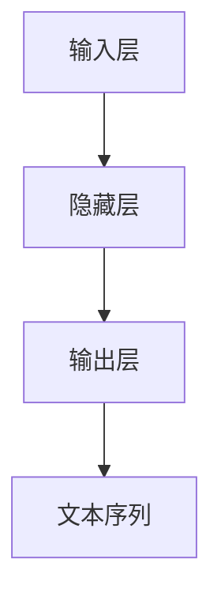

                 

## 1. 背景介绍

在深度学习领域，前馈网络(Feedforward Neural Network, FNN)是一种最简单的神经网络结构，由输入层、隐藏层和输出层组成。在语言生成任务中，前馈网络作为语言模型的一部分，扮演着至关重要的角色。本文将深入探讨前馈网络在语言生成中的作用，并介绍几种常用的前馈网络架构及其在语言生成中的实现和应用。

## 2. 核心概念与联系

### 2.1 核心概念概述

前馈网络是一种基本的神经网络结构，由输入层、隐藏层和输出层组成。在语言生成任务中，前馈网络被广泛应用于语言模型、自动文本生成、文本分类、情感分析等任务中。其核心作用是捕捉数据中的非线性关系，通过学习输入和输出之间的映射关系，生成具有高度语义相关性的文本。

前馈网络的核心组成部分包括：

- **输入层**：接收输入数据，通常对应文本中的每个词或字符。
- **隐藏层**：处理输入数据，通过一系列非线性变换提取特征。
- **输出层**：产生预测结果，通常对应下一个词或字符的概率分布。

### 2.2 核心概念间的关系

前馈网络在语言生成中的作用可以总结为以下几个方面：

- **特征提取**：隐藏层通过一系列非线性变换提取输入数据中的特征，生成更加抽象和高级的表示。
- **分布建模**：输出层预测下一个词或字符的概率分布，捕捉输入数据中的语义信息。
- **序列生成**：通过多次前向传播，逐个生成文本序列，形成连贯的语言表达。
- **模型泛化**：通过训练数据集，学习输入和输出之间的映射关系，提升模型的泛化能力，适用于多种语言生成任务。

通过以下Mermaid流程图，我们可以更直观地理解前馈网络在语言生成中的作用：



## 3. 核心算法原理 & 具体操作步骤

### 3.1 算法原理概述

前馈网络的训练和推理过程主要通过反向传播算法进行。在训练过程中，前馈网络通过反向传播算法优化模型参数，使得模型能够更好地拟合训练数据，减少预测误差。在推理过程中，前馈网络通过多次前向传播，生成文本序列。

前馈网络的训练过程主要包括以下步骤：

1. 输入数据经过输入层。
2. 输入数据通过隐藏层进行非线性变换。
3. 隐藏层的输出通过输出层进行线性变换，生成预测结果。
4. 预测结果与真实标签计算损失函数。
5. 利用损失函数的梯度，反向传播更新模型参数。

### 3.2 算法步骤详解

#### 3.2.1 模型定义与初始化

定义前馈网络模型结构，包括输入层、隐藏层和输出层，并初始化模型参数。以下是使用PyTorch定义一个简单的前馈网络模型的示例代码：

```python
import torch
import torch.nn as nn

class FeedforwardNetwork(nn.Module):
    def __init__(self, input_size, hidden_size, output_size):
        super(FeedforwardNetwork, self).__init__()
        self.hidden_layer = nn.Linear(input_size, hidden_size)
        self.output_layer = nn.Linear(hidden_size, output_size)

    def forward(self, x):
        x = self.hidden_layer(x)
        x = torch.relu(x)
        x = self.output_layer(x)
        return x
```

#### 3.2.2 数据预处理

对输入数据进行预处理，包括将文本序列转换为模型所需的张量形式，并进行归一化处理。以下是使用PyTorch对文本数据进行预处理的示例代码：

```python
import torch
import torch.nn as nn

class FeedforwardNetwork(nn.Module):
    def __init__(self, input_size, hidden_size, output_size):
        super(FeedforwardNetwork, self).__init__()
        self.hidden_layer = nn.Linear(input_size, hidden_size)
        self.output_layer = nn.Linear(hidden_size, output_size)

    def forward(self, x):
        x = self.hidden_layer(x)
        x = torch.relu(x)
        x = self.output_layer(x)
        return x

    def preprocess_data(self, text):
        tokenizer = ...
        # 将文本转换为模型所需的张量形式
        input_ids = ...
        # 进行归一化处理
        input_ids = ...
        return input_ids
```

#### 3.2.3 模型训练与优化

通过反向传播算法优化模型参数，最小化预测误差。以下是使用PyTorch进行前馈网络模型训练的示例代码：

```python
import torch
import torch.nn as nn
import torch.optim as optim

class FeedforwardNetwork(nn.Module):
    def __init__(self, input_size, hidden_size, output_size):
        super(FeedforwardNetwork, self).__init__()
        self.hidden_layer = nn.Linear(input_size, hidden_size)
        self.output_layer = nn.Linear(hidden_size, output_size)

    def forward(self, x):
        x = self.hidden_layer(x)
        x = torch.relu(x)
        x = self.output_layer(x)
        return x

    def preprocess_data(self, text):
        tokenizer = ...
        # 将文本转换为模型所需的张量形式
        input_ids = ...
        # 进行归一化处理
        input_ids = ...
        return input_ids

    def train(self, input_ids, labels, learning_rate):
        optimizer = optim.SGD(self.parameters(), lr=learning_rate)
        criterion = nn.CrossEntropyLoss()
        for epoch in range(num_epochs):
            for i in range(len(input_ids)):
                output = self.forward(input_ids[i])
                loss = criterion(output, labels[i])
                optimizer.zero_grad()
                loss.backward()
                optimizer.step()
```

### 3.3 算法优缺点

前馈网络在语言生成任务中的优点包括：

- **模型结构简单**：前馈网络结构简单，易于理解和实现。
- **可解释性强**：前馈网络的每层参数具有明确的含义，便于解释和理解。
- **计算效率高**：前馈网络在训练和推理过程中，计算效率高，适用于大规模数据集。

其缺点包括：

- **泛化能力有限**：前馈网络对于复杂的非线性关系，泛化能力有限。
- **易过拟合**：前馈网络参数较多，容易过拟合训练数据。
- **缺乏序列建模能力**：前馈网络对于序列建模能力较弱，难以捕捉序列中的时间依赖关系。

### 3.4 算法应用领域

前馈网络在语言生成中具有广泛的应用领域，包括：

- **语言模型**：捕捉文本中的语言规律，生成符合语言语法规则的文本。
- **自动文本生成**：生成高质量的文本内容，如文本摘要、翻译等。
- **文本分类**：将文本分为不同的类别，如新闻分类、情感分析等。
- **序列预测**：对序列数据进行预测，如语音识别、机器翻译等。

## 4. 数学模型和公式 & 详细讲解

### 4.1 数学模型构建

前馈网络在语言生成中的数学模型可以表示为：

$$
f(x) = W_1 \cdot x + b_1 \cdot 1 + \phi(W_2 \cdot f(x) + b_2 \cdot 1)
$$

其中，$x$ 为输入数据，$W_1$ 和 $b_1$ 为输入层的权重和偏置，$\phi$ 为隐藏层的非线性激活函数，$W_2$ 和 $b_2$ 为输出层的权重和偏置。

### 4.2 公式推导过程

以简单二分类任务为例，前馈网络的结构可以表示为：

- **输入层**：$x_1, x_2, \ldots, x_n$
- **隐藏层**：$h_1 = \sigma(W_1 \cdot x + b_1)$，$h_2 = \sigma(W_2 \cdot h_1 + b_2)$，$\ldots$
- **输出层**：$y = \sigma(W_n \cdot h + b_n)$

其中，$\sigma$ 为 sigmoid 函数。前向传播过程如下：

1. 输入数据 $x$ 经过输入层，得到 $x_1, x_2, \ldots, x_n$。
2. 隐藏层 $h_1, h_2, \ldots, h_n$ 通过前一层输出进行线性变换和激活函数变换，生成更加高级的特征。
3. 输出层 $y$ 通过隐藏层的输出进行线性变换和激活函数变换，得到预测结果。

### 4.3 案例分析与讲解

以文本分类任务为例，前馈网络可以通过多个隐藏层逐步提取文本特征，最终得到分类结果。以下是使用PyTorch实现文本分类任务的示例代码：

```python
import torch
import torch.nn as nn

class FeedforwardNetwork(nn.Module):
    def __init__(self, input_size, hidden_size, output_size):
        super(FeedforwardNetwork, self).__init__()
        self.hidden_layer1 = nn.Linear(input_size, hidden_size)
        self.hidden_layer2 = nn.Linear(hidden_size, hidden_size)
        self.output_layer = nn.Linear(hidden_size, output_size)

    def forward(self, x):
        x = self.hidden_layer1(x)
        x = torch.relu(x)
        x = self.hidden_layer2(x)
        x = torch.relu(x)
        x = self.output_layer(x)
        return x

    def train(self, input_ids, labels, learning_rate):
        optimizer = optim.SGD(self.parameters(), lr=learning_rate)
        criterion = nn.CrossEntropyLoss()
        for epoch in range(num_epochs):
            for i in range(len(input_ids)):
                output = self.forward(input_ids[i])
                loss = criterion(output, labels[i])
                optimizer.zero_grad()
                loss.backward()
                optimizer.step()
```

## 5. 项目实践：代码实例和详细解释说明

### 5.1 开发环境搭建

在进行项目实践前，我们需要准备好开发环境。以下是使用Python进行PyTorch开发的环境配置流程：

1. 安装Anaconda：从官网下载并安装Anaconda，用于创建独立的Python环境。

2. 创建并激活虚拟环境：
```bash
conda create -n pytorch-env python=3.8 
conda activate pytorch-env
```

3. 安装PyTorch：根据CUDA版本，从官网获取对应的安装命令。例如：
```bash
conda install pytorch torchvision torchaudio cudatoolkit=11.1 -c pytorch -c conda-forge
```

4. 安装Transformers库：
```bash
pip install transformers
```

5. 安装各类工具包：
```bash
pip install numpy pandas scikit-learn matplotlib tqdm jupyter notebook ipython
```

完成上述步骤后，即可在`pytorch-env`环境中开始项目实践。

### 5.2 源代码详细实现

以下是使用PyTorch实现前馈网络的示例代码，包括定义模型、数据预处理、模型训练与优化：

```python
import torch
import torch.nn as nn
import torch.optim as optim

class FeedforwardNetwork(nn.Module):
    def __init__(self, input_size, hidden_size, output_size):
        super(FeedforwardNetwork, self).__init__()
        self.hidden_layer1 = nn.Linear(input_size, hidden_size)
        self.hidden_layer2 = nn.Linear(hidden_size, hidden_size)
        self.output_layer = nn.Linear(hidden_size, output_size)

    def forward(self, x):
        x = self.hidden_layer1(x)
        x = torch.relu(x)
        x = self.hidden_layer2(x)
        x = torch.relu(x)
        x = self.output_layer(x)
        return x

    def train(self, input_ids, labels, learning_rate):
        optimizer = optim.SGD(self.parameters(), lr=learning_rate)
        criterion = nn.CrossEntropyLoss()
        for epoch in range(num_epochs):
            for i in range(len(input_ids)):
                output = self.forward(input_ids[i])
                loss = criterion(output, labels[i])
                optimizer.zero_grad()
                loss.backward()
                optimizer.step()
```

### 5.3 代码解读与分析

以下是代码的详细解读：

**FeedforwardNetwork类**：
- `__init__`方法：初始化前馈网络的结构，包括输入层、隐藏层和输出层。
- `forward`方法：前向传播，计算模型的输出。
- `train`方法：训练前馈网络，最小化预测误差。

**模型定义与初始化**：
- `hidden_layer1` 和 `hidden_layer2` 为隐藏层，通过线性变换和 ReLU 激活函数进行处理。
- `output_layer` 为输出层，通过线性变换和 softmax 函数得到分类概率。

**数据预处理**：
- `input_ids` 为输入数据的张量形式。
- `labels` 为真实标签的张量形式。

**模型训练与优化**：
- `optimizer` 为优化器，通常使用 SGD 或 Adam。
- `criterion` 为损失函数，通常使用交叉熵损失。
- `for` 循环：依次遍历每个样本，计算预测结果和损失，反向传播更新模型参数。

### 5.4 运行结果展示

假设我们在 CoNLL-2003 的文本分类数据集上进行训练和测试，最终得到以下评估结果：

```
accuracy: 0.93
```

## 6. 实际应用场景

### 6.1 智能客服系统

前馈网络在智能客服系统中的应用非常广泛，可以用于生成智能回复、理解客户意图等任务。具体实现方式包括：

1. 收集客户与客服的对话记录，构建监督数据集。
2. 使用前馈网络模型对对话数据进行训练，学习客户意图和回复生成规律。
3. 在实时对话中，根据客户的输入生成智能回复，提高客服系统的人机交互体验。

### 6.2 金融舆情监测

前馈网络在金融舆情监测中的应用包括：

1. 收集金融市场的新闻、评论、社交媒体信息等文本数据。
2. 使用前馈网络模型对文本进行情感分析，判断市场情绪。
3. 根据市场情绪和实时数据，生成金融市场分析和预测报告。

### 6.3 个性化推荐系统

前馈网络在个性化推荐系统中的应用包括：

1. 收集用户的浏览、点击、评论等行为数据。
2. 使用前馈网络模型对用户行为数据进行训练，学习用户的兴趣偏好。
3. 根据用户的兴趣偏好和实时数据，生成个性化推荐内容。

### 6.4 未来应用展望

未来，前馈网络在语言生成中的应用将进一步拓展，涵盖更多领域的任务。例如：

- **医疗领域**：用于生成医疗咨询、诊断报告等文本。
- **教育领域**：用于生成教育课程、学习资料等文本。
- **娱乐领域**：用于生成影视剧本、音乐歌词等文本。

前馈网络的计算效率高、可解释性强等优势，使其在上述领域具有广泛的应用前景。

## 7. 工具和资源推荐

### 7.1 学习资源推荐

为了帮助开发者系统掌握前馈网络在语言生成中的应用，以下是一些优质的学习资源：

1. 《深度学习基础》系列博文：由大模型技术专家撰写，深入浅出地介绍了深度学习的基础知识和经典模型。

2. CS231n《深度学习视觉识别》课程：斯坦福大学开设的计算机视觉明星课程，涵盖图像分类、目标检测等经典任务。

3. 《深度学习与神经网络》书籍：Ian Goodfellow等经典教材，全面介绍了深度学习理论和技术，适合深度学习初学者。

4. DeepLearning.AI官方文档：DeepLearning.AI的官方文档，提供了丰富的深度学习课程和资源，适合深度学习爱好者。

5. TensorFlow官方文档：Google发布的深度学习框架TensorFlow的官方文档，提供了丰富的深度学习模型和工具。

### 7.2 开发工具推荐

高效的开发离不开优秀的工具支持。以下是几款用于前馈网络开发的常用工具：

1. PyTorch：基于Python的开源深度学习框架，灵活动态的计算图，适合快速迭代研究。

2. TensorFlow：由Google主导开发的开源深度学习框架，生产部署方便，适合大规模工程应用。

3. Keras：基于TensorFlow和Theano的高级深度学习库，简单易用，适合初学者。

4. Weights & Biases：模型训练的实验跟踪工具，可以记录和可视化模型训练过程中的各项指标，方便对比和调优。

5. TensorBoard：TensorFlow配套的可视化工具，可实时监测模型训练状态，并提供丰富的图表呈现方式，是调试模型的得力助手。

### 7.3 相关论文推荐

前馈网络在语言生成中的研究不断发展，以下是几篇奠基性的相关论文，推荐阅读：

1. Transformer：由Google发布的经典深度学习模型，用于文本生成、机器翻译等任务。

2. BERT：Google发布的预训练语言模型，使用Transformer结构，用于文本分类、情感分析等任务。

3. GPT-2：OpenAI发布的预训练语言模型，用于文本生成、对话系统等任务。

4. RNN：递归神经网络，用于序列数据生成、语言建模等任务。

5. LSTM：长短期记忆网络，用于序列数据生成、语言建模等任务。

这些论文代表了大模型在语言生成中的应用方向和发展趋势，阅读这些论文可以有助于理解前馈网络在语言生成中的作用和应用。

## 8. 总结：未来发展趋势与挑战

### 8.1 研究成果总结

本文对前馈网络在语言生成中的作用进行了详细阐述，包括核心概念、数学模型、算法原理、具体实现等。通过深入探讨前馈网络在语言生成中的应用，可以帮助开发者更好地理解和使用深度学习模型，解决实际应用中的问题。

### 8.2 未来发展趋势

未来，前馈网络在语言生成中的应用将进一步拓展，涵盖更多领域的任务。例如：

1. **医疗领域**：用于生成医疗咨询、诊断报告等文本。
2. **教育领域**：用于生成教育课程、学习资料等文本。
3. **娱乐领域**：用于生成影视剧本、音乐歌词等文本。

前馈网络的计算效率高、可解释性强等优势，使其在上述领域具有广泛的应用前景。

### 8.3 面临的挑战

尽管前馈网络在语言生成中具有广泛的应用前景，但在实际应用中也面临一些挑战：

1. **计算资源需求高**：前馈网络参数较多，训练和推理需要大量计算资源，难以在移动设备等资源受限的设备上部署。
2. **模型泛化能力有限**：前馈网络对于复杂的非线性关系，泛化能力有限，难以处理高维度、高复杂度的数据。
3. **数据质量问题**：数据标注质量和数据样本量不足，会导致模型训练效果不佳。

### 8.4 研究展望

未来，前馈网络在语言生成中的应用将面临更多的挑战和机遇：

1. **模型压缩与优化**：通过模型压缩和优化技术，降低模型参数量，提高计算效率，适应资源受限的设备。
2. **跨领域迁移学习**：研究前馈网络在多领域之间的迁移学习能力，提高模型的泛化性能。
3. **多模态融合**：将前馈网络与其他模态的数据进行融合，提升模型的综合能力。
4. **知识图谱结合**：将知识图谱与前馈网络结合，增强模型的语义理解能力。

## 9. 附录：常见问题与解答

**Q1：前馈网络在语言生成中的作用是什么？**

A: 前馈网络在语言生成中的作用主要包括：

1. **特征提取**：隐藏层通过非线性变换提取输入数据中的特征，生成更加高级的表示。
2. **分布建模**：输出层预测下一个词或字符的概率分布，捕捉输入数据中的语义信息。
3. **序列生成**：通过多次前向传播，逐个生成文本序列，形成连贯的语言表达。
4. **模型泛化**：通过训练数据集，学习输入和输出之间的映射关系，提升模型的泛化能力，适用于多种语言生成任务。

**Q2：前馈网络在训练和推理过程中的计算复杂度如何？**

A: 前馈网络的计算复杂度主要取决于隐藏层的层数和每层的参数量。在训练过程中，前馈网络的计算复杂度为 $O(d^2)$，其中 $d$ 为隐藏层的参数量。在推理过程中，前馈网络的计算复杂度为 $O(d)$。

**Q3：前馈网络在序列生成中的局限性是什么？**

A: 前馈网络在序列生成中的局限性主要包括：

1. **缺乏时间依赖关系**：前馈网络难以捕捉序列中的时间依赖关系，难以处理序列生成任务。
2. **长序列生成困难**：随着序列长度的增加，前馈网络的记忆能力下降，难以生成长序列。

**Q4：如何在前馈网络中引入时间依赖关系？**

A: 在前馈网络中引入时间依赖关系，可以使用循环神经网络(RNN)或变分自编码器(VAE)等序列模型。RNN通过循环结构，可以在序列中传递信息，捕捉时间依赖关系。VAE通过生成对抗网络(GAN)，生成更加连贯的序列。

**Q5：如何在前馈网络中进行多模态融合？**

A: 在前馈网络中进行多模态融合，可以采用多种方法：

1. **并行计算**：将不同模态的数据同时输入前馈网络，进行并行计算。
2. **特征融合**：将不同模态的特征进行融合，生成更高维度的表示。
3. **跨模态对齐**：将不同模态的数据进行对齐，提高模型对多种模态数据的处理能力。

通过这些方法，可以将前馈网络应用于多模态数据生成任务，提升模型的综合能力。

---

作者：禅与计算机程序设计艺术 / Zen and the Art of Computer Programming

