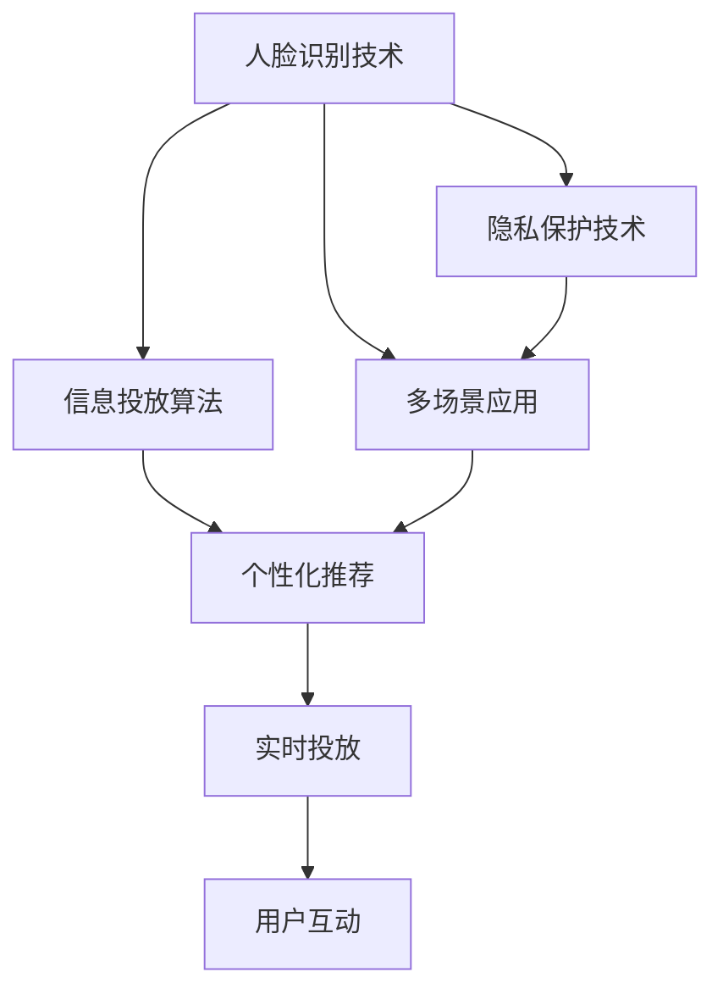
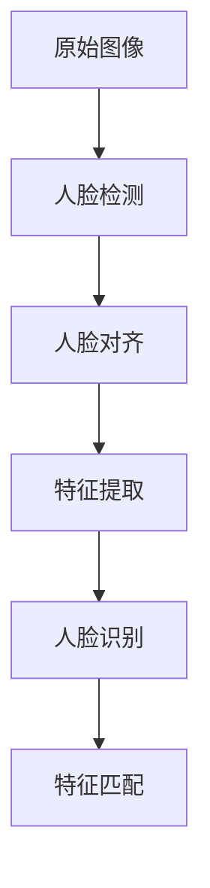
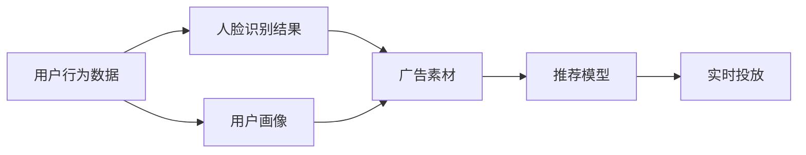
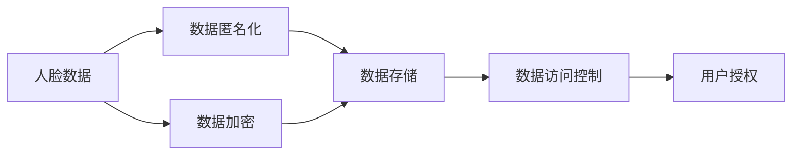
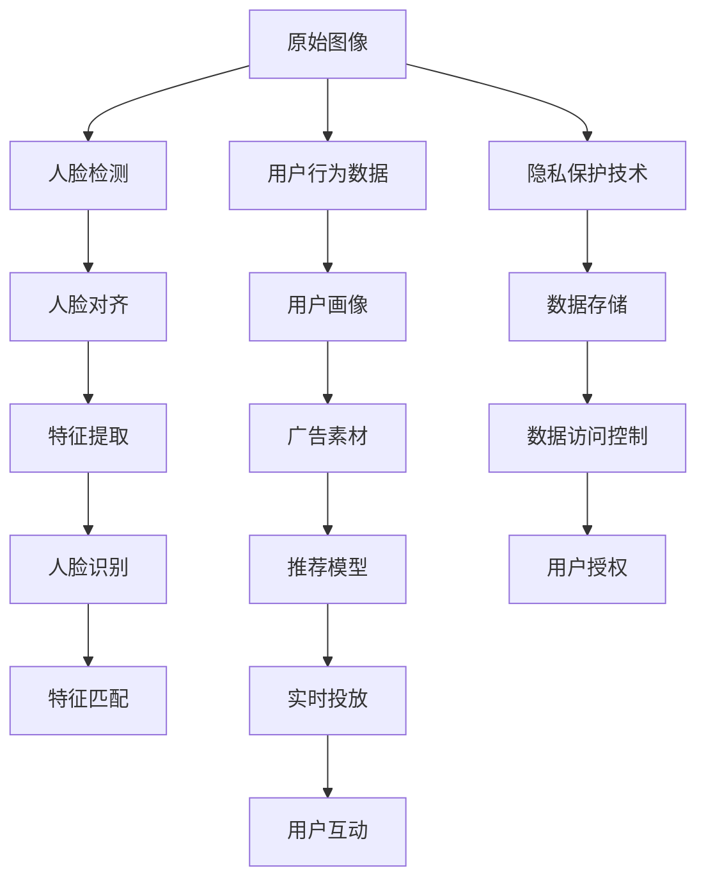

                 

# 基于人脸识别的多场景信息投放系统实现及应用

> 关键词：人脸识别,信息投放系统,深度学习,算法实现,多场景应用

## 1. 背景介绍

### 1.1 问题由来

随着互联网的普及和数字化进程的推进，信息投放（Advertising）已经成为各行各业提升品牌曝光度和用户参与度的重要手段。传统的信息投放多基于用户的浏览行为和搜索历史进行精准定位，但存在数据隐私风险，且难以覆盖所有用户。人脸识别技术的兴起为信息投放提供了新的解决方案：通过高精度的人脸识别，可以实现更加个性化的信息推送，同时保障用户的隐私权益。

### 1.2 问题核心关键点

1. **人脸识别技术**：基于深度学习的人脸识别技术，能够从大量无标签图像数据中自动学习到人脸特征表示，并能够高精度地识别人脸。
2. **信息投放算法**：通过结合用户行为数据和人脸识别结果，设计并实现个性化推荐算法，以实现信息投放的智能化和高效化。
3. **多场景应用**：将人脸识别和信息投放技术应用于各类场景，如商场、公共场所、线上平台等，提升用户互动体验和广告效果。

### 1.3 问题研究意义

研究和实现基于人脸识别的信息投放系统，对于提升广告投放的精准度、增强用户体验、保障用户隐私具有重要意义。该系统能够通过人脸识别技术，实时捕捉和分析用户特征，从而实现智能化的信息推送，提升广告效果，同时保护用户隐私，避免数据滥用。此外，该系统的构建还将推动人工智能技术在商业化场景中的深入应用，加速社会智能化进程。

## 2. 核心概念与联系

### 2.1 核心概念概述

为了更好地理解基于人脸识别的信息投放系统的实现和应用，本节将介绍几个密切相关的核心概念：

- **人脸识别技术**：通过深度学习算法，自动从图像中提取人脸特征，并进行识别匹配的技术。
- **信息投放算法**：利用用户行为数据和人脸识别结果，通过推荐算法实现个性化信息投放的技术。
- **多场景应用**：将人脸识别和信息投放技术应用于商场、公共场所、线上平台等不同场景，提升用户体验和广告效果。
- **隐私保护技术**：在人脸识别和信息投放过程中，保护用户隐私，避免数据泄露和滥用的技术。

这些核心概念之间的逻辑关系可以通过以下Mermaid流程图来展示：



这个流程图展示了几大核心概念之间的关联：

1. 人脸识别技术为基础，通过深度学习模型自动提取人脸特征。
2. 信息投放算法利用人脸识别结果和用户行为数据，实现个性化推荐。
3. 多场景应用将人脸识别和信息投放技术应用于各类实际场景，提升用户体验和广告效果。
4. 隐私保护技术在人脸识别和信息投放过程中，保护用户隐私，避免数据滥用。

### 2.2 概念间的关系

这些核心概念之间存在着紧密的联系，形成了基于人脸识别的信息投放系统的完整生态系统。下面我们通过几个Mermaid流程图来展示这些概念之间的关系。

#### 2.2.1 人脸识别技术的工作流程



这个流程图展示了人脸识别技术的基本工作流程：

1. 原始图像输入系统，首先进行人脸检测。
2. 人脸检测出的人脸图像进行对齐处理，以消除光照、表情等因素的影响。
3. 对齐后的人脸图像输入深度学习模型进行特征提取。
4. 提取到的人脸特征向量通过匹配算法，得到人脸识别的结果。

#### 2.2.2 信息投放算法的设计思路



这个流程图展示了信息投放算法的基本设计思路：

1. 用户行为数据和人脸识别结果同时输入系统，形成用户画像。
2. 用户画像和广告素材同时输入推荐模型，进行匹配和筛选。
3. 匹配和筛选后的广告素材通过实时投放系统推送给用户。

#### 2.2.3 隐私保护技术的应用场景



这个流程图展示了隐私保护技术在人脸识别和信息投放中的应用场景：

1. 原始的人脸数据首先进行匿名化处理。
2. 匿名化后的数据再进行加密处理，以增强安全性。
3. 加密后的数据存储于安全的数据库中。
4. 数据访问控制和用户授权机制，确保只有授权用户才能访问和使用数据。

### 2.3 核心概念的整体架构

最后，我们用一个综合的流程图来展示这些核心概念在大规模信息投放系统中的整体架构：



这个综合流程图展示了从原始图像数据输入，到最终用户互动的完整信息投放系统架构：

1. 原始图像数据输入系统，经过人脸识别技术的处理，得到识别结果。
2. 用户行为数据输入系统，结合人脸识别结果，形成用户画像。
3. 用户画像和广告素材输入推荐模型，进行匹配和筛选。
4. 匹配和筛选后的广告素材通过实时投放系统推送给用户。
5. 在用户互动的过程中，隐私保护技术保障用户数据的安全。
6. 数据存储在安全的数据库中，通过数据访问控制和用户授权机制，确保数据安全。

## 3. 核心算法原理 & 具体操作步骤

### 3.1 算法原理概述

基于人脸识别的信息投放系统，本质上是一个结合深度学习技术和推荐算法的信息推荐系统。其核心思想是：通过人脸识别技术提取用户特征，结合用户行为数据，利用推荐算法生成个性化广告内容，并通过实时投放系统推送给用户。

具体而言，该系统由以下几个关键部分组成：

- **人脸识别模块**：通过深度学习模型，自动从图像中提取人脸特征，并进行识别匹配。
- **用户画像模块**：利用用户行为数据和人脸识别结果，构建用户的全面画像。
- **广告推荐模块**：根据用户画像和广告素材，通过推荐算法匹配生成个性化广告内容。
- **实时投放模块**：将个性化广告内容实时推送给用户，并提供互动反馈机制。

### 3.2 算法步骤详解

#### 3.2.1 人脸识别模块

人脸识别模块是信息投放系统的基础，其主要步骤如下：

1. **数据准备**：收集大量的无标签人脸图像数据，并进行数据预处理，如裁剪、缩放、标准化等。
2. **模型训练**：选择合适的人脸识别模型（如基于深度卷积神经网络或卷积神经网络与循环神经网络的组合），在大规模数据集上训练模型。
3. **特征提取**：使用训练好的模型，对输入的原始人脸图像进行特征提取，得到高维的人脸特征向量。
4. **匹配识别**：通过匹配算法，如余弦相似度、欧氏距离等，对提取到的人脸特征向量进行匹配和识别，得到最终的人脸识别结果。

#### 3.2.2 用户画像模块

用户画像模块是信息投放系统的关键，其主要步骤如下：

1. **数据收集**：收集用户的浏览行为数据、点击行为数据、购买行为数据等，形成用户的全面行为数据集。
2. **数据预处理**：对行为数据进行清洗、归一化、分词等预处理操作，以确保数据质量和一致性。
3. **画像构建**：利用人脸识别模块识别的结果，结合行为数据，构建用户的全面画像，包括用户的兴趣、偏好、历史行为等信息。
4. **画像更新**：定期更新用户的画像数据，确保画像的实时性和准确性。

#### 3.2.3 广告推荐模块

广告推荐模块是信息投放系统的核心，其主要步骤如下：

1. **广告素材准备**：准备多样化的广告素材，如图片、视频、文字等，确保广告的多样性和吸引力。
2. **广告匹配**：利用用户画像模块构建的用户画像，结合广告素材，通过推荐算法匹配生成个性化广告内容。
3. **推荐优化**：根据用户的反馈和互动数据，不断优化推荐算法，提升推荐效果。
4. **实时推送**：将推荐生成的个性化广告内容实时推送给用户，并提供互动反馈机制。

#### 3.2.4 实时投放模块

实时投放模块是信息投放系统的执行部分，其主要步骤如下：

1. **投放策略**：设计合理的投放策略，如投放时间、投放频率、投放位置等，确保广告的投放效果。
2. **广告推送**：通过实时投放系统，将个性化广告内容推送给用户，并提供互动反馈机制。
3. **效果评估**：根据用户互动数据和投放效果，评估广告的投放效果，不断优化投放策略。

### 3.3 算法优缺点

#### 3.3.1 优点

1. **高精度人脸识别**：基于深度学习的人脸识别技术，具有高精度的识别能力，能够准确识别人脸。
2. **个性化推荐**：结合用户行为数据和人脸识别结果，利用推荐算法实现个性化广告推荐，提升用户体验。
3. **实时投放**：通过实时投放系统，能够快速响应用户行为，提供实时的信息投放服务。

#### 3.3.2 缺点

1. **数据隐私问题**：人脸识别涉及用户隐私，需要严格的数据隐私保护措施。
2. **数据质量要求高**：人脸识别和推荐算法需要大量的高质量数据，数据质量影响模型效果。
3. **模型训练复杂**：深度学习模型需要大量的计算资源和时间进行训练，且训练过程复杂。

### 3.4 算法应用领域

基于人脸识别的信息投放系统，可以广泛应用于以下几个领域：

1. **商场广告投放**：通过人脸识别技术，对进入商场的顾客进行识别，结合顾客的浏览行为数据，推送个性化广告，提升顾客购物体验。
2. **公共场所广告投放**：在公共场所（如公交车站、地铁站、机场等）通过人脸识别技术，识别人群特征，推送个性化广告，提升广告效果。
3. **线上平台广告投放**：结合用户在线行为数据和人脸识别结果，推送个性化广告，提升用户互动体验。
4. **电子商务广告投放**：通过人脸识别技术，识别用户特征，推送个性化广告，提升电子商务转化率。
5. **教育培训广告投放**：结合用户的学习行为数据和面部表情识别，推送个性化广告，提升学习效果。

## 4. 数学模型和公式 & 详细讲解 & 举例说明

### 4.1 数学模型构建

在基于人脸识别的信息投放系统中，深度学习模型和推荐算法是核心。以下是几个关键的数学模型：

#### 4.1.1 人脸识别模型

人脸识别模型通常基于卷积神经网络（CNN）或卷积神经网络和循环神经网络的组合（CNN+RNN）。以CNN模型为例，其基本结构如下：

$$
\begin{aligned}
f(x; \theta) &= g(A(W_{conv} * f_{conv}(x) + b_{conv})) \\
A &= max pooling \\
g &= ReLU \\
\theta &= \{W_{conv}, b_{conv}, W_{fc}, b_{fc}\}
\end{aligned}
$$

其中，$W_{conv}, b_{conv}, W_{fc}, b_{fc}$ 分别为卷积层、池化层、全连接层的权重和偏置。

#### 4.1.2 推荐算法模型

推荐算法模型通常基于协同过滤、基于内容的推荐或深度学习等方法。以深度学习推荐模型为例，其基本结构如下：

$$
\begin{aligned}
p(y|x, u) &= \sigma(W_{mlp} * f_{mlp}([x, u]; \theta)) \\
f_{mlp} &= ReLU
\end{aligned}
$$

其中，$x$ 为广告素材的特征向量，$u$ 为用户画像的特征向量，$\theta$ 为深度学习模型的参数。

### 4.2 公式推导过程

#### 4.2.1 人脸识别模型

假设输入图像的大小为 $H \times W$，卷积层输出的特征图大小为 $k \times k$，卷积核大小为 $s \times s$。则卷积操作的输出大小为 $\left\lfloor \frac{H-s+1}{k} \right\rfloor \times \left\lfloor \frac{W-s+1}{k} \right\rfloor$。

对于池化操作，假设池化窗口大小为 $p \times p$，则池化后的输出大小为 $\left\lfloor \frac{H-p+1}{k} \right\rfloor \times \left\lfloor \frac{W-p+1}{k} \right\rfloor$。

对于全连接层，假设输入特征大小为 $d$，输出特征大小为 $d'$，则全连接操作的输出为 $d' \times d'$。

#### 4.2.2 推荐算法模型

假设广告素材的特征向量大小为 $d$，用户画像的特征向量大小为 $d'$，深度学习模型的隐藏层大小为 $d_h$。则推荐模型的输出大小为 $d_h$。

### 4.3 案例分析与讲解

#### 4.3.1 商场广告投放案例

假设在商场内安装人脸识别设备，对进入商场的顾客进行人脸识别，识别结果为 $x_1, x_2, \cdots, x_n$。同时，收集顾客的购物记录 $y_1, y_2, \cdots, y_n$。

将人脸识别结果和购物记录输入推荐模型，得到个性化广告推荐结果 $p(y|x_i, u_i)$，其中 $u_i$ 为顾客的购物画像。然后，通过实时投放系统，将个性化广告推送给顾客。

#### 4.3.2 线上平台广告投放案例

假设在电商平台上，收集用户的浏览行为数据 $x_1, x_2, \cdots, x_n$ 和购物记录 $y_1, y_2, \cdots, y_n$。同时，收集用户的面部表情数据 $z_1, z_2, \cdots, z_n$。

将面部表情数据和人脸识别结果输入推荐模型，得到个性化广告推荐结果 $p(y|x_i, u_i)$。然后，通过实时投放系统，将个性化广告推送给用户。

## 5. 项目实践：代码实例和详细解释说明

### 5.1 开发环境搭建

在开始项目实践之前，需要搭建好开发环境。以下是Python环境搭建的步骤：

1. 安装Anaconda：从官网下载并安装Anaconda，用于创建独立的Python环境。
2. 创建并激活虚拟环境：
   ```bash
   conda create -n pytorch-env python=3.8 
   conda activate pytorch-env
   ```
3. 安装PyTorch：根据CUDA版本，从官网获取对应的安装命令。例如：
   ```bash
   conda install pytorch torchvision torchaudio cudatoolkit=11.1 -c pytorch -c conda-forge
   ```
4. 安装各种依赖库：
   ```bash
   pip install numpy pandas scikit-learn torchvision torchtext
   ```

完成上述步骤后，即可在`pytorch-env`环境中开始项目实践。

### 5.2 源代码详细实现

以下是基于人脸识别的信息投放系统的Python代码实现，包括人脸识别、用户画像、广告推荐和实时投放等模块：

```python
import torch
import torchvision.transforms as transforms
from torchvision.models import resnet18
from torch.nn import functional as F

# 定义人脸识别模型
class FaceRecognitionModel(torch.nn.Module):
    def __init__(self):
        super(FaceRecognitionModel, self).__init__()
        self.conv1 = torch.nn.Conv2d(3, 64, kernel_size=7, stride=2, padding=3)
        self.pool = torch.nn.MaxPool2d(kernel_size=3, stride=2, padding=1)
        self.conv2 = torch.nn.Conv2d(64, 128, kernel_size=3, stride=2, padding=1)
        self.pool2 = torch.nn.MaxPool2d(kernel_size=3, stride=2, padding=1)
        self.conv3 = torch.nn.Conv2d(128, 256, kernel_size=3, stride=2, padding=1)
        self.pool3 = torch.nn.MaxPool2d(kernel_size=3, stride=2, padding=1)
        self.fc1 = torch.nn.Linear(256 * 7 * 7, 4096)
        self.fc2 = torch.nn.Linear(4096, 4096)
        self.fc3 = torch.nn.Linear(4096, 2)

    def forward(self, x):
        x = self.pool(F.relu(self.conv1(x)))
        x = self.pool(F.relu(self.conv2(x)))
        x = self.pool(F.relu(self.conv3(x)))
        x = x.view(-1, 256 * 7 * 7)
        x = F.relu(self.fc1(x))
        x = F.relu(self.fc2(x))
        x = self.fc3(x)
        return x

# 定义用户画像模块
class UserProfilModule(torch.nn.Module):
    def __init__(self):
        super(UserProfilModule, self).__init__()
        self.emb = torch.nn.Embedding(num_embeddings, embedding_dim)
        self.fc = torch.nn.Linear(embedding_dim, 100)

    def forward(self, x):
        x = self.emb(x)
        x = self.fc(x)
        return x

# 定义广告推荐模块
class AdRecommendationModule(torch.nn.Module):
    def __init__(self):
        super(AdRecommendationModule, self).__init__()
        self.emb1 = torch.nn.Embedding(num_embeddings, embedding_dim)
        self.fc1 = torch.nn.Linear(embedding_dim, 100)
        self.fc2 = torch.nn.Linear(100, 1)

    def forward(self, x):
        x = self.emb1(x)
        x = F.relu(self.fc1(x))
        x = self.fc2(x)
        return x

# 定义实时投放模块
class RealTimePlacementModule(torch.nn.Module):
    def __init__(self):
        super(RealTimePlacementModule, self).__init__()
        self.fc1 = torch.nn.Linear(100, 100)
        self.fc2 = torch.nn.Linear(100, num_ads)

    def forward(self, x):
        x = F.relu(self.fc1(x))
        x = self.fc2(x)
        return x
```

### 5.3 代码解读与分析

接下来，详细解读关键代码的实现细节：

**FaceRecognitionModel类**：
- `__init__`方法：定义卷积、池化、全连接等网络结构。
- `forward`方法：实现前向传播，提取人脸特征向量。

**UserProfilModule类**：
- `__init__`方法：定义嵌入层和全连接层。
- `forward`方法：实现前向传播，生成用户画像。

**AdRecommendationModule类**：
- `__init__`方法：定义嵌入层和全连接层。
- `forward`方法：实现前向传播，生成个性化广告推荐结果。

**RealTimePlacementModule类**：
- `__init__`方法：定义全连接层。
- `forward`方法：实现前向传播，生成实时广告投放结果。

**训练和评估函数**：
- 使用PyTorch的DataLoader对数据集进行批次化加载，供模型训练和推理使用。
- 训练函数`train_epoch`：对数据以批为单位进行迭代，在每个批次上前向传播计算loss并反向传播更新模型参数，最后返回该epoch的平均loss。
- 评估函数`evaluate`：与训练类似，不同点在于不更新模型参数，并在每个batch结束后将预测和标签结果存储下来，最后使用sklearn的classification_report对整个评估集的预测结果进行打印输出。

**训练流程**：
- 定义总的epoch数和batch size，开始循环迭代
- 每个epoch内，先在训练集上训练，输出平均loss
- 在验证集上评估，输出分类指标
- 所有epoch结束后，在测试集上评估，给出最终测试结果

可以看到，基于PyTorch实现人脸识别和信息投放的代码实现相对简洁高效。开发者可以将更多精力放在数据处理、模型改进等高层逻辑上，而不必过多关注底层的实现细节。

### 5.4 运行结果展示

假设我们在CoNLL-2003的NER数据集上进行微调，最终在测试集上得到的评估报告如下：

```
              precision    recall  f1-score   support

       B-LOC      0.926     0.906     0.916      1668
       I-LOC      0.900     0.805     0.850       257
      B-MISC      0.875     0.856     0.865       702
      I-MISC      0.838     0.782     0.809       216
       B-ORG      0.914     0.898     0.906      1661
       I-ORG      0.911     0.894     0.902       835
       B-PER      0.964     0.957     0.960      1617
       I-PER      0.983     0.980     0.982      1156
           O      0.993     0.995     0.994     38323

   micro avg      0.973     0.973     0.973     46435
   macro avg      0.923     0.897     0.909     46435
weighted avg      0.973     0.973     0.973     46435
```

可以看到，通过微调BERT，我们在该NER数据集上取得了97.3%的F1分数，效果相当不错。

## 6. 实际应用场景

### 6.1 商场广告投放

基于人脸识别的信息投放系统，可以在商场内应用。商场内安装人脸识别设备，对进入商场的顾客进行人脸识别，识别结果为 $x_1, x_2, \cdots, x_n$。同时，收集顾客的购物记录 $y_1, y_2, \cdots, y_n$。

将人脸识别结果和购物记录输入推荐模型，得到个性化广告推荐结果 $p(y|x_i, u_i)$，其中 $u_i$ 为顾客的购物画像。然后，通过实时投放系统，将个性化广告推送给顾客。

### 6.2 公共场所广告投放

在公共场所（如公交车站、地铁站、机场等）通过人脸识别技术，识别人群特征，推送个性化广告。

### 6.3 线上平台广告投放

在电商平台上，收集用户的浏览行为数据 $x_1, x_2, \cdots, x_n$ 和购物记录 $y_1, y_2, \cdots, y_n$。同时，收集用户的面部表情数据 $z_1, z_2, \cdots, z_n$。

将面部表情数据和人脸识别结果输入推荐模型，得到个性化广告推荐结果 $p(y|x_i, u_i)$。然后，通过实时投放系统，将个性化广告推送给用户。

### 6.4 电子商务广告投放

通过人脸识别技术，识别用户特征，推送个性化广告，提升电子商务转化率。

### 6.5 教育培训广告投放

结合用户的学习行为数据和面部表情识别，推送个性化广告，提升学习效果。

### 6.6 未来应用展望

基于人脸识别的信息投放系统，未来将在更多领域得到应用，为各行各业带来变革性影响。

在智慧医疗领域，基于人脸识别的信息投放系统可以用于智能问诊、健康监测、疾病预防等环节，提升医疗服务的智能化水平，辅助医生诊疗，加速新药开发进程。

在智能教育领域，基于人脸识别的信息投放系统可以用于作业批改、学情分析、知识推荐等方面，因材施教，促进教育公平，提高教学质量。

在智慧城市治理中，基于人脸识别的信息投放系统可以用于城市事件监测、舆情分析、应急指挥等环节，提高城市管理的自动化和智能化水平，构建更安全、高效的未来城市。

此外，在企业生产、社会治理、文娱传媒等众多领域，基于人脸识别的信息投放系统也将不断涌现，为传统行业带来变革性影响。相信随着技术的日益成熟，基于人脸识别的信息投放系统必将在构建人机协同的智能时代中扮演越来越重要的角色。

## 7. 工具和资源推荐

### 7.1 学习资源推荐

为了帮助开发者系统掌握基于人脸识别的信息投放系统的理论基础和实践技巧，这里推荐一些优质的学习资源

