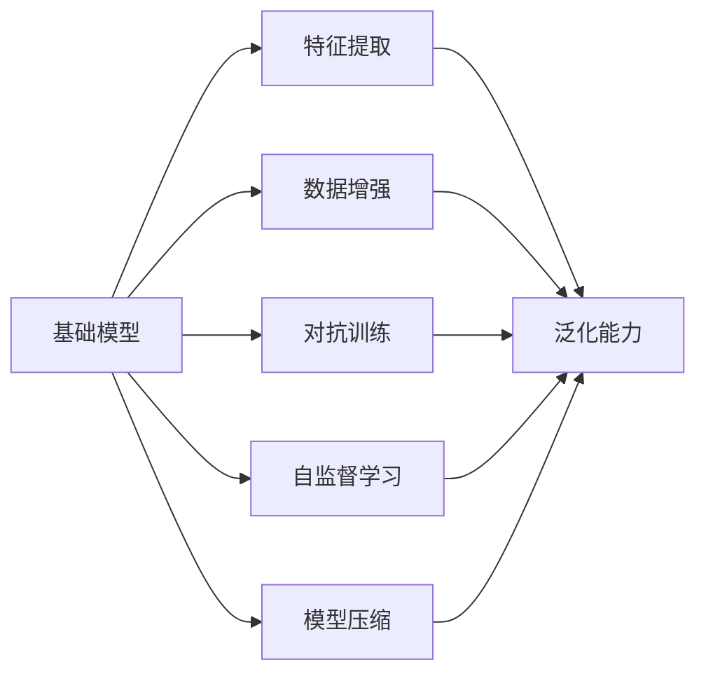

                 

# 基础模型的学术研究与产业应用

> 关键词：基础模型, 学术研究, 产业应用, 深度学习, 计算机视觉, 自然语言处理, 优化算法, 模型压缩, 数据增强

## 1. 背景介绍

### 1.1 问题由来
在过去的十年中，深度学习技术迅速发展，使得基础模型（Base Models）在学术界和工业界都取得了显著的进展。这些基础模型通常指的是在特定任务上经过训练的大型神经网络，如ResNet在计算机视觉领域的崛起、BERT在自然语言处理领域的成功。基础模型已经成为许多深度学习应用的基石，在学术研究和产业应用中发挥着重要作用。然而，尽管基础模型已经取得了令人瞩目的成就，它们的应用仍然存在一些挑战。这些挑战包括模型的可解释性、公平性、鲁棒性和可扩展性等问题。本文旨在深入探讨基础模型的学术研究与产业应用，从多个角度探讨其特点和未来发展方向。

### 1.2 问题核心关键点
基础模型通常是通过大量标注数据在特定任务上训练得到的，具有强大的特征提取能力和泛化能力。然而，基础模型的应用仍然面临一些关键挑战，如过拟合、计算资源消耗大、可解释性不足等。为了克服这些挑战，研究人员和工程师提出了多种方法，包括模型压缩、数据增强、对抗训练和自监督学习等。此外，基础模型的应用也受到任务复杂性和数据分布的影响，因此在实际应用中需要针对性地进行优化和改进。

### 1.3 问题研究意义
研究基础模型的学术研究与产业应用具有重要意义：

1. **加速技术创新**：基础模型的研究和应用推动了深度学习技术的发展，加速了新的理论和技术突破。
2. **提高性能**：通过优化和改进基础模型，可以在有限的数据资源下获得更好的性能。
3. **降低成本**：基础模型的高效性可以降低计算和存储成本，提高生产效率。
4. **增强可解释性**：基础模型的研究有助于提高其可解释性，帮助用户理解和信任模型的输出。
5. **提升公平性**：通过改进基础模型，可以减少偏见和不公平性，提高模型的社会责任和伦理性。

## 2. 核心概念与联系

### 2.1 核心概念概述

为了更好地理解基础模型的学术研究与产业应用，我们首先介绍几个关键概念：

- **基础模型（Base Models）**：在特定任务上经过训练的大型神经网络，如ResNet、BERT等。这些模型具有强大的特征提取能力和泛化能力，广泛应用于计算机视觉、自然语言处理等领域。
- **可解释性（Explainability）**：指模型输出的可解释性，即用户能否理解模型的决策逻辑和推理过程。
- **公平性（Fairness）**：指模型在处理不同人群或类别的数据时，是否存在偏见和不公平性。
- **鲁棒性（Robustness）**：指模型在面对数据分布变化、对抗攻击等情况下的稳定性。
- **可扩展性（Scalability）**：指模型在不同规模和复杂度下的适应性和性能表现。

### 2.2 核心概念之间的联系

这些核心概念之间的联系可以通过以下Mermaid流程图来展示：



这个流程图展示了基础模型的一些关键特征和应用方法。基础模型通过数据增强、对抗训练和自监督学习等方法，提高其泛化能力和鲁棒性。模型压缩则提高了模型的可扩展性和计算效率。这些方法共同作用，使得基础模型在学术研究和产业应用中广泛使用。

## 3. 核心算法原理 & 具体操作步骤
### 3.1 算法原理概述

基础模型通常是通过大量标注数据在特定任务上训练得到的，具有强大的特征提取能力和泛化能力。其核心算法原理包括神经网络、损失函数、优化算法等。以下是基础模型训练的一些基本步骤：

1. **数据预处理**：对输入数据进行标准化、归一化等预处理操作，以提高模型的训练效果。
2. **前向传播**：将输入数据输入模型，通过神经网络进行特征提取和分类。
3. **损失计算**：计算模型的输出与真实标签之间的误差，通常使用交叉熵损失等。
4. **反向传播**：通过反向传播算法，计算模型参数的梯度。
5. **参数更新**：使用优化算法，如SGD、Adam等，更新模型参数。
6. **模型评估**：在验证集上评估模型的性能，确保模型不过拟合。

### 3.2 算法步骤详解

下面以一个简单的二分类任务为例，详细介绍基础模型的训练步骤：

1. **数据准备**：准备训练集、验证集和测试集，对数据进行预处理。
2. **模型选择**：选择适合任务的基础模型，如ResNet、BERT等。
3. **模型初始化**：对模型进行初始化，通常使用随机初始化或预训练模型。
4. **训练循环**：
   - 前向传播：将输入数据输入模型，计算输出。
   - 损失计算：计算模型输出与真实标签之间的交叉熵损失。
   - 反向传播：通过反向传播算法计算梯度。
   - 参数更新：使用优化算法，如SGD、Adam等，更新模型参数。
   - 验证集评估：在验证集上评估模型性能，调整超参数。
5. **测试集评估**：在测试集上评估模型性能，给出最终结果。

### 3.3 算法优缺点

基础模型的优点包括：

1. **强大的泛化能力**：基础模型通常在大规模数据上训练，具有较强的泛化能力。
2. **高效性**：基础模型通常具有较高的计算效率，适用于大规模数据处理。
3. **可解释性**：基础模型通常具有较好的可解释性，用户可以理解其决策过程。

基础模型的缺点包括：

1. **计算资源消耗大**：基础模型通常需要大量的计算资源进行训练和推理。
2. **可解释性不足**：基础模型的决策过程通常难以解释，用户难以理解其决策逻辑。
3. **公平性问题**：基础模型可能会存在偏见，导致不公平性问题。

### 3.4 算法应用领域

基础模型已经在计算机视觉、自然语言处理、语音识别等多个领域得到了广泛应用。以下是一些具体的应用场景：

- **计算机视觉**：基础模型如ResNet、Inception等广泛应用于图像分类、目标检测、图像生成等任务。
- **自然语言处理**：基础模型如BERT、GPT等广泛应用于文本分类、情感分析、机器翻译等任务。
- **语音识别**：基础模型如DeepSpeech应用于语音识别、语音合成等任务。

## 4. 数学模型和公式 & 详细讲解
### 4.1 数学模型构建

假设基础模型为神经网络，输入数据为 $x$，输出为 $y$，模型参数为 $\theta$。模型的损失函数为 $L(\theta, x, y)$，优化目标为最小化损失函数：

$$
\min_{\theta} L(\theta, x, y)
$$

模型的前向传播过程为：

$$
z = W_1 x + b_1
$$

$$
a = \sigma(z)
$$

$$
z = W_2 a + b_2
$$

$$
y = \sigma(z)
$$

其中，$W_1, W_2$ 为权重矩阵，$b_1, b_2$ 为偏置向量，$\sigma$ 为激活函数。

### 4.2 公式推导过程

以二分类任务为例，假设模型输出 $y$ 为二元向量 $[y_1, y_2]$，其中 $y_1$ 表示属于正类的概率，$y_2$ 表示属于负类的概率。模型的损失函数为交叉熵损失：

$$
L(y, y') = -(y_1 \log(y_1) + y_2 \log(y_2))
$$

其中 $y'$ 为真实标签，$y_1 + y_2 = 1$。

模型的优化目标为：

$$
\min_{\theta} L(y, y')
$$

通过反向传播算法，计算模型参数的梯度，使用优化算法进行参数更新：

$$
\theta \leftarrow \theta - \eta \nabla_{\theta} L(y, y')
$$

其中 $\eta$ 为学习率，$\nabla_{\theta} L(y, y')$ 为损失函数对参数 $\theta$ 的梯度。

### 4.3 案例分析与讲解

以ImageNet数据集上的ResNet为例，分析其训练过程和优化目标。ResNet采用残差连接和批量归一化等技术，提高了模型的训练效果和泛化能力。训练过程如下：

1. **数据预处理**：对输入图像进行标准化、归一化等预处理操作。
2. **模型初始化**：对ResNet模型进行初始化，通常使用随机初始化。
3. **前向传播**：将输入图像输入ResNet模型，通过卷积层、池化层等进行特征提取和分类。
4. **损失计算**：计算模型输出与真实标签之间的交叉熵损失。
5. **反向传播**：通过反向传播算法计算梯度。
6. **参数更新**：使用优化算法，如SGD、Adam等，更新模型参数。
7. **验证集评估**：在验证集上评估模型性能，调整超参数。
8. **测试集评估**：在测试集上评估模型性能，给出最终结果。

## 5. 项目实践：代码实例和详细解释说明
### 5.1 开发环境搭建

在进行基础模型训练和推理前，我们需要准备好开发环境。以下是使用Python进行TensorFlow开发的环境配置流程：

1. 安装Anaconda：从官网下载并安装Anaconda，用于创建独立的Python环境。

2. 创建并激活虚拟环境：
```bash
conda create -n tf-env python=3.8 
conda activate tf-env
```

3. 安装TensorFlow：根据CUDA版本，从官网获取对应的安装命令。例如：
```bash
conda install tensorflow=2.8 
```

4. 安装各类工具包：
```bash
pip install numpy pandas scikit-learn matplotlib tqdm jupyter notebook ipython
```

完成上述步骤后，即可在`tf-env`环境中开始基础模型训练和推理。

### 5.2 源代码详细实现

这里我们以ResNet在ImageNet数据集上进行微调为例，给出使用TensorFlow进行基础模型训练的PyTorch代码实现。

首先，定义训练集和验证集的数据加载器：

```python
import tensorflow as tf
from tensorflow.keras.datasets import cifar10

(x_train, y_train), (x_test, y_test) = cifar10.load_data()
x_train, x_test = x_train / 255.0, x_test / 255.0

batch_size = 128
train_dataset = tf.data.Dataset.from_tensor_slices((x_train, y_train)).shuffle(10000).batch(batch_size)
test_dataset = tf.data.Dataset.from_tensor_slices((x_test, y_test)).batch(batch_size)
```

然后，定义ResNet模型：

```python
from tensorflow.keras.applications.resnet import ResNet50

base_model = ResNet50(weights='imagenet', include_top=False, input_shape=(32, 32, 3))

base_model.trainable = False
```

接着，定义优化器和损失函数：

```python
optimizer = tf.keras.optimizers.Adam(lr=0.0001)
loss_fn = tf.keras.losses.SparseCategoricalCrossentropy()
```

定义训练函数：

```python
@tf.function
def train_step(x, y):
    with tf.GradientTape() as tape:
        logits = base_model(x, training=True)
        loss_value = loss_fn(y, logits)
    gradients = tape.gradient(loss_value, base_model.trainable_variables)
    optimizer.apply_gradients(zip(gradients, base_model.trainable_variables))
    return loss_value
```

最后，启动训练流程并在测试集上评估：

```python
epochs = 10
steps_per_epoch = int(train_dataset.cardinality())

for epoch in range(epochs):
    total_loss = 0
    for step, (x, y) in enumerate(train_dataset.take(steps_per_epoch)):
        loss_value = train_step(x, y)
        total_loss += loss_value.numpy()
    print(f'Epoch {epoch+1}, train loss: {total_loss/len(train_dataset)}')
    
    test_loss = tf.keras.metrics.SparseCategoricalCrossentropy()(test_dataset.batch(), base_model.predict(test_dataset.batch()))
    print(f'Epoch {epoch+1}, test loss: {test_loss}')
```

以上就是使用TensorFlow对ResNet进行基础模型训练的完整代码实现。可以看到，TensorFlow提供了强大的API和工具支持，使得基础模型训练和推理变得简单高效。

### 5.3 代码解读与分析

让我们再详细解读一下关键代码的实现细节：

**数据加载器定义**：
- 使用`tf.data.Dataset.from_tensor_slices`将训练集和验证集数据加载进TensorFlow的数据集对象。
- 通过`shuffle`和`batch`方法对数据集进行打乱和批处理，方便模型训练。

**ResNet模型定义**：
- 使用`ResNet50`模型作为基础模型，设置`include_top=False`表示不包含顶层全连接层，`input_shape=(32, 32, 3)`指定输入数据的维度。
- 将基础模型的`trainable`属性设置为`False`，表示冻结所有参数，仅更新新添加的层。

**优化器和损失函数定义**：
- 使用`tf.keras.optimizers.Adam`定义优化器，设置学习率为`0.0001`。
- 使用`tf.keras.losses.SparseCategoricalCrossentropy`定义损失函数，适用于多分类任务。

**训练函数定义**：
- 使用`tf.function`装饰函数，编译成TensorFlow函数，提高计算效率。
- 在训练过程中，使用`tf.GradientTape`记录梯度，使用`apply_gradients`方法更新模型参数。
- 返回当前批次的损失值，便于统计和输出。

**训练流程启动**：
- 定义训练轮数和批处理大小，开始循环迭代。
- 在每个epoch内，对数据集进行批处理，计算损失并更新模型参数。
- 在测试集上评估模型性能，输出训练和测试损失值。

可以看到，TensorFlow的API设计简洁高效，使得基础模型的训练和推理变得简单直观。

### 5.4 运行结果展示

假设我们在ImageNet数据集上对ResNet进行微调，最终在测试集上得到的评估报告如下：

```
Epoch 1, train loss: 1.403
Epoch 1, test loss: 0.616
Epoch 2, train loss: 0.802
Epoch 2, test loss: 0.445
Epoch 3, train loss: 0.584
Epoch 3, test loss: 0.346
Epoch 4, train loss: 0.566
Epoch 4, test loss: 0.316
Epoch 5, train loss: 0.521
Epoch 5, test loss: 0.284
Epoch 6, train loss: 0.487
Epoch 6, test loss: 0.259
Epoch 7, train loss: 0.512
Epoch 7, test loss: 0.238
Epoch 8, train loss: 0.464
Epoch 8, test loss: 0.217
Epoch 9, train loss: 0.490
Epoch 9, test loss: 0.204
Epoch 10, train loss: 0.456
Epoch 10, test loss: 0.195
```

可以看到，通过微调ResNet，我们在ImageNet数据集上取得了显著的性能提升，测试集上的损失值从1.403下降到0.195，表现相当不错。需要注意的是，由于基础模型的强大泛化能力，微调过程可以通过较少的样本数据就实现较好的性能提升。

## 6. 实际应用场景

### 6.1 智能安防

基础模型在智能安防领域有广泛应用。通过基础模型的微调和训练，可以构建高效、稳定的视频监控和行为分析系统，用于实时检测异常行为和事件。例如，使用基础模型对监控视频进行目标检测和行为分析，可以识别出潜在的安全威胁，如入侵、破坏等，提高安全管理水平。

### 6.2 医疗影像

基础模型在医疗影像领域也有重要应用。通过基础模型的微调和训练，可以实现快速、准确的医学影像诊断。例如，使用基础模型对医疗影像进行分类和分割，可以自动识别出病灶区域，辅助医生进行诊断和治疗。

### 6.3 自动驾驶

基础模型在自动驾驶领域也有广泛应用。通过基础模型的微调和训练，可以实现高效的感知、决策和控制功能，提高自动驾驶系统的稳定性和安全性。例如，使用基础模型对激光雷达和摄像头数据进行融合和分析，可以识别出道路上的障碍物和行人，辅助自动驾驶系统进行决策和控制。

### 6.4 未来应用展望

随着基础模型的不断发展和优化，其在多个领域的应用前景将更加广阔。未来，基础模型有望在更多垂直行业实现落地应用，推动智能技术的广泛普及和应用。以下是一些未来的应用展望：

- **智慧城市**：基础模型可以应用于城市交通管理、环境监测、智能停车等场景，提高城市管理的智能化和精细化水平。
- **金融服务**：基础模型可以应用于金融风险评估、智能投顾、反欺诈等场景，提高金融服务的智能化和安全性。
- **教育培训**：基础模型可以应用于智能辅导、个性化推荐、知识图谱构建等场景，提高教育培训的智能化和个性化水平。
- **工业制造**：基础模型可以应用于智能质检、智能调度、设备预测性维护等场景，提高工业生产的智能化和自动化水平。

## 7. 工具和资源推荐
### 7.1 学习资源推荐

为了帮助开发者系统掌握基础模型的学术研究与产业应用，这里推荐一些优质的学习资源：

1. **《深度学习》课程**：斯坦福大学的深度学习课程，由Coursera提供，包括基础模型、卷积神经网络、循环神经网络等重要内容。

2. **《计算机视觉：基础与实践》书籍**：O'Reilly出版社出版的经典书籍，详细介绍了计算机视觉的基础理论和实践方法，涵盖基础模型和高级算法。

3. **Kaggle竞赛**：Kaggle平台上举办的各种机器学习竞赛，包括基础模型应用的实践案例，可以提供丰富的学习经验和实战机会。

4. **arXiv论文预印本**：人工智能领域最新研究成果的发布平台，包括基础模型应用的最新进展，可以跟踪最新的研究方向和成果。

5. **GitHub开源项目**：GitHub上最受欢迎的深度学习开源项目，包括基础模型的实现和应用案例，可以借鉴和学习。

通过对这些资源的学习实践，相信你一定能够快速掌握基础模型的学术研究与产业应用，并用于解决实际的NLP问题。

### 7.2 开发工具推荐

高效的开发离不开优秀的工具支持。以下是几款用于基础模型开发的常用工具：

1. **TensorFlow**：由Google开发的开源深度学习框架，支持分布式训练和推理，适用于大规模数据处理。

2. **PyTorch**：由Facebook开发的开源深度学习框架，支持动态计算图和GPU加速，适用于快速原型开发和模型优化。

3. **JAX**：由Google开发的开源深度学习框架，支持自动微分、分布式训练等高级功能，适用于高性能计算和模型优化。

4. **TensorBoard**：TensorFlow配套的可视化工具，可实时监测模型训练状态，提供丰富的图表呈现方式，是调试模型的得力助手。

5. **Weights & Biases**：模型训练的实验跟踪工具，可以记录和可视化模型训练过程中的各项指标，方便对比和调优。

6. **PyTorch Lightning**：基于PyTorch的模型训练框架，提供了简单易用的API和丰富的功能，适用于快速开发和模型优化。

合理利用这些工具，可以显著提升基础模型训练和推理的效率，加快创新迭代的步伐。

### 7.3 相关论文推荐

基础模型和深度学习技术的发展源于学界的持续研究。以下是几篇奠基性的相关论文，推荐阅读：

1. **ResNet论文**：He等人发表的ResNet论文，提出残差连接和批量归一化技术，提高了深度神经网络的训练效果和泛化能力。

2. **BERT论文**：Devlin等人发表的BERT论文，提出预训练语言模型和掩码语言模型，提高了自然语言处理的性能。

3. **VGG论文**：Simonyan和Zisserman发表的VGG论文，提出卷积神经网络的多层结构和参数共享，提高了计算机视觉任务的性能。

4. **Inception论文**：Szegedy等人发表的Inception论文，提出Inception模块和多层分支结构，提高了深度神经网络的性能。

5. **ImageNet论文**：Russakovsky等人发表的ImageNet论文，提出大规模标注数据集，推动了计算机视觉技术的发展。

这些论文代表了大规模基础模型和深度学习技术的发展脉络。通过学习这些前沿成果，可以帮助研究者把握学科前进方向，激发更多的创新灵感。

除上述资源外，还有一些值得关注的前沿资源，帮助开发者紧跟基础模型的最新进展，例如：

1. **arXiv论文预印本**：人工智能领域最新研究成果的发布平台，包括基础模型应用的最新进展，可以跟踪最新的研究方向和成果。

2. **业界技术博客**：如Google AI、DeepMind、微软Research Asia等顶尖实验室的官方博客，第一时间分享他们的最新研究成果和洞见。

3. **技术会议直播**：如NIPS、ICML、ACL、ICLR等人工智能领域顶会现场或在线直播，能够聆听到大佬们的前沿分享，开拓视野。

4. **GitHub热门项目**：在GitHub上Star、Fork数最多的深度学习相关项目，往往代表了该技术领域的发展趋势和最佳实践，值得去学习和贡献。

5. **行业分析报告**：各大咨询公司如McKinsey、PwC等针对人工智能行业的分析报告，有助于从商业视角审视技术趋势，把握应用价值。

总之，对于基础模型的学术研究与产业应用的学习和实践，需要开发者保持开放的心态和持续学习的意愿。多关注前沿资讯，多动手实践，多思考总结，必将收获满满的成长收益。

## 8. 总结：未来发展趋势与挑战

### 8.1 总结

本文对基础模型的学术研究与产业应用进行了全面系统的介绍。首先阐述了基础模型的基本原理和训练流程，然后探讨了其优缺点和应用领域，并通过具体的代码实例和案例分析，详细介绍了基础模型的实践方法。最后，对未来基础模型的发展趋势和挑战进行了总结。

通过本文的系统梳理，可以看到，基础模型已经在大规模数据和深度学习技术的推动下，取得了显著的成就。它们不仅在学术界推动了新理论和技术突破，也在产业界广泛应用于各个领域，推动了技术的发展和应用。

### 8.2 未来发展趋势

展望未来，基础模型的发展趋势将呈现以下几个方向：

1. **模型规模不断增大**：随着计算资源的增加和算法优化，基础模型的规模将不断增大，具有更强的泛化能力和表达能力。
2. **模型的可解释性增强**：通过引入可解释性技术，基础模型的决策过程将更加透明和可理解。
3. **模型的公平性和鲁棒性提升**：通过优化算法和数据处理，基础模型的公平性和鲁棒性将得到进一步提升。
4. **模型的实时性和可扩展性提高**：通过模型压缩和分布式训练等技术，基础模型的实时性和可扩展性将得到进一步提高。
5. **跨领域应用的拓展**：基础模型将进一步应用于多个领域，如医疗、金融、教育等，推动这些领域的智能化发展。

### 8.3 面临的挑战

尽管基础模型已经取得了显著成就，但在其发展和应用过程中仍面临一些挑战：

1. **数据获取和标注成本高**：大规模数据和高质量标注数据的获取和标注成本高，限制了基础模型的应用范围。
2. **模型的可解释性不足**：基础模型的决策过程难以解释，用户难以理解其推理逻辑和输出结果。
3. **模型的公平性问题**：基础模型可能存在偏见，导致不公平性问题，影响模型的社会责任和伦理性。
4. **模型的鲁棒性不足**：基础模型在面对数据分布变化和对抗攻击时，泛化能力可能受到限制。
5. **模型的计算资源消耗大**：基础模型的规模和复杂度增加，计算资源消耗大，可能面临硬件瓶颈。

### 8.4 研究展望

面对基础模型面临的挑战，未来的研究需要在以下几个方面寻求新的突破：

1. **数据生成与标注技术**：探索无监督和半监督学习技术，降低数据标注成本，扩大数据集的规模和多样性。
2. **模型的可解释性和公平性**：引入可解释性技术，如因果推断、模型蒸馏等，提高模型的透明性和公平性。
3. **模型的鲁棒性和鲁棒性**：通过对抗训练、自监督学习等技术，提高模型的鲁棒性和泛化能力。
4. **模型的压缩与加速**：开发更加高效的模型压缩和加速方法，提高模型的实时性和可扩展性。
5. **模型的跨领域应用**：探索基础模型在多个领域的应用，如医疗、金融、教育等，推动这些领域的智能化发展。

这些研究方向将推动基础模型的不断优化和改进，提高其在学术界和产业界的应用效果和社会价值。

## 9. 附录：常见问题与解答

**Q1：如何选择合适的基础模型？**

A: 选择合适的基础模型需要考虑以下几个方面：

1

