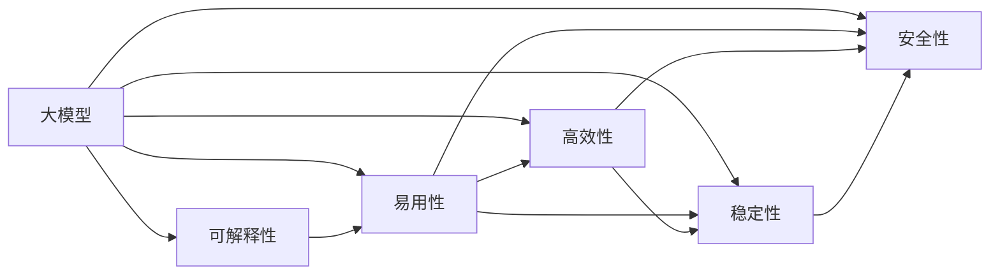
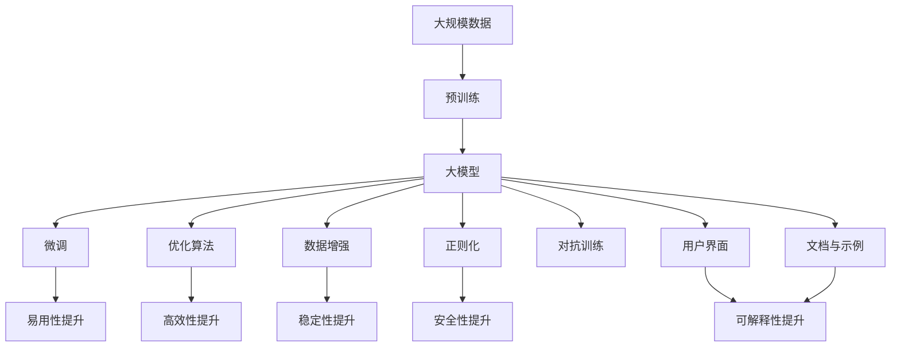

                 

# 大模型的用户体验与应用

## 1. 背景介绍

### 1.1 问题由来

随着人工智能技术的飞速发展，大模型（Large Model）在各个领域的应用日益广泛。从自然语言处理、计算机视觉到生成对抗网络（GAN），大模型都展现出了其强大的学习能力与广泛的应用前景。然而，用户在使用大模型时，常常会遭遇一系列问题，如模型输出结果难以理解、模型复杂度高、部署成本高等。这些问题不仅限制了模型的实际应用，还阻碍了AI技术的普及与推广。因此，提升大模型的用户体验成为了当前AI研究的重要方向之一。

### 1.2 问题核心关键点

提升大模型的用户体验主要从以下几个方面入手：

- **可解释性**：大模型虽然能够提供强大的预测能力，但其决策过程往往难以理解，缺乏透明性。
- **易用性**：大模型的复杂度高，需要用户具备一定的技术背景，才能进行有效的使用。
- **高效性**：大模型在训练和推理时的计算资源需求高，需要高效的优化算法和架构设计。
- **稳定性**：大模型在面对不同数据分布时，容易发生灾难性遗忘或过拟合，需要适当的正则化和数据增强方法。
- **安全性**：大模型可能存在偏见和有害信息，需要在训练和部署时加以防范。

### 1.3 问题研究意义

提升大模型的用户体验，不仅能够降低用户使用门槛，促进AI技术的普及，还能够提升模型的实际应用效果，使其在各个领域发挥更大的作用。具体而言：

1. **降低使用门槛**：通过优化模型设计和用户界面，使AI技术更加易于上手，吸引更多用户。
2. **提升应用效果**：通过增加模型的可解释性和透明性，帮助用户更好地理解模型预测，从而提高应用效果。
3. **降低计算成本**：通过优化模型架构和算法，降低训练和推理时的计算资源需求，降低用户的使用成本。
4. **确保安全可靠**：通过加入安全性检测和防范措施，确保模型输出结果的准确性和可信度。

## 2. 核心概念与联系

### 2.1 核心概念概述

为更好地理解如何提升大模型的用户体验，本节将介绍几个密切相关的核心概念：

- **大模型**：指具有大规模参数的神经网络模型，如BERT、GPT等。这些模型在预训练阶段通过大量无标签数据进行训练，学习到丰富的语言、图像等特征表示。

- **可解释性**：指模型的输出结果可以被人理解和解释，提供决策依据。在AI应用中，可解释性是用户信任模型的重要因素之一。

- **易用性**：指模型使用起来简便、直观，无需用户具备高深的技术背景。易用性是AI技术推广的关键。

- **高效性**：指模型在训练和推理时的计算效率高，能够快速处理大量数据，满足实际应用需求。

- **稳定性**：指模型在面对不同数据分布时的鲁棒性，能够在多种情况下保持稳定性能。

- **安全性**：指模型输出结果的准确性和可信度，避免偏见和有害信息对用户的影响。

这些核心概念之间存在着紧密的联系，形成了一个完整的用户体验优化框架。通过优化这些关键点，可以显著提升大模型的用户体验，推动AI技术的广泛应用。

### 2.2 概念间的关系

这些核心概念之间的关系可以通过以下Mermaid流程图来展示：



这个流程图展示了用户体验优化框架中各个概念之间的关系：

1. 大模型作为基础，通过优化其可解释性、易用性、高效性、稳定性和安全性，提升用户体验。
2. 可解释性、易用性、高效性、稳定性和安全性相互之间存在关联，共同影响用户体验。

### 2.3 核心概念的整体架构

最后，我们用一个综合的流程图来展示这些核心概念在大模型用户体验优化中的整体架构：



这个综合流程图展示了从数据预处理到用户体验优化过程中各个环节的作用：

1. 大规模数据进行预训练，生成大模型。
2. 大模型通过微调、优化算法、数据增强、正则化、对抗训练等方法提升性能。
3. 用户界面和文档示例优化模型的易用性。
4. 微调和优化算法提升模型的高效性。
5. 数据增强和正则化提升模型的稳定性。
6. 对抗训练和安全性检测提升模型的安全性。
7. 用户界面和可解释性提升提升模型的可解释性。

通过这些环节的协同工作，可以显著提升大模型的用户体验，使其在实际应用中发挥更大的作用。

## 3. 核心算法原理 & 具体操作步骤
### 3.1 算法原理概述

提升大模型的用户体验，主要通过以下几种算法原理来实现：

1. **可解释性算法**：通过生成模型预测的可视化解释，帮助用户理解模型的决策过程。
2. **易用性算法**：通过简化模型使用流程、提供用户友好界面等方法，降低用户的使用门槛。
3. **高效性算法**：通过优化模型架构、采用高效算法和数据结构，提升模型的训练和推理速度。
4. **稳定性算法**：通过加入正则化、对抗训练等方法，提高模型在不同数据分布下的鲁棒性。
5. **安全性算法**：通过检测和防范模型中的偏见和有害信息，确保模型输出的可信度。

### 3.2 算法步骤详解

#### 3.2.1 可解释性算法

**步骤1：数据预处理**  
对原始数据进行清洗、归一化、特征工程等预处理，确保数据质量和一致性。

**步骤2：模型训练**  
使用大模型进行预训练，学习到丰富的特征表示。

**步骤3：可解释性生成**  
利用可解释性算法（如LIME、SHAP），生成模型预测的可视化解释，展示模型如何做出决策。

**步骤4：用户反馈**  
将可视化解释呈现给用户，收集用户反馈，进一步优化模型和解释方法。

#### 3.2.2 易用性算法

**步骤1：界面设计**  
设计简洁、直观的用户界面，提供良好的用户体验。

**步骤2：交互设计**  
设计易于理解和操作的交互方式，减少用户操作复杂度。

**步骤3：文档与示例**  
提供详细的文档和示例，帮助用户快速上手使用模型。

**步骤4：用户反馈**  
收集用户的使用反馈，优化用户界面和交互方式。

#### 3.2.3 高效性算法

**步骤1：模型压缩**  
使用模型压缩技术（如剪枝、量化、蒸馏等），减少模型参数量，提升计算效率。

**步骤2：优化算法**  
采用高效的优化算法（如Adam、Adagrad等），加速模型训练和推理过程。

**步骤3：数据结构优化**  
使用高效的数据结构（如稀疏矩阵、哈希表等），减少计算和存储资源消耗。

**步骤4：硬件优化**  
使用高效的硬件设备（如GPU、TPU等），加速模型的计算和推理。

#### 3.2.4 稳定性算法

**步骤1：数据增强**  
通过回译、近义替换等方式扩充训练集，增加数据多样性。

**步骤2：正则化**  
加入L2正则、Dropout等正则化方法，防止模型过拟合。

**步骤3：对抗训练**  
引入对抗样本，训练模型抵御恶意攻击和干扰的能力。

**步骤4：模型集成**  
训练多个模型，取平均输出，降低模型的不稳定性。

#### 3.2.5 安全性算法

**步骤1：偏见检测**  
检测模型中的偏见，如性别、种族偏见，并采取措施消除。

**步骤2：有害信息检测**  
检测模型输出中的有害信息，如虚假信息、仇恨言论，并采取措施防范。

**步骤3：模型监控**  
实时监控模型输出，检测异常行为和异常结果，确保模型输出可信。

**步骤4：用户反馈**  
收集用户对模型输出的反馈，及时发现和纠正有害信息。

### 3.3 算法优缺点

**优点**：

1. **提升用户体验**：通过优化模型的可解释性、易用性、高效性、稳定性和安全性，使大模型更易于使用，更可靠。
2. **提高模型效果**：通过优化算法，提升模型的预测精度和鲁棒性，提高实际应用效果。
3. **降低使用成本**：通过模型压缩、硬件优化等手段，降低训练和推理时的计算资源需求。

**缺点**：

1. **复杂度高**：优化用户体验的过程中，需要考虑多个因素，技术难度较大。
2. **成本高**：优化用户体验的某些措施（如对抗训练、偏见检测等）需要额外的计算资源和时间。
3. **效果难以量化**：用户体验的提升通常难以量化，缺乏客观评价指标。

### 3.4 算法应用领域

基于大模型用户体验优化的方法，已经在自然语言处理（NLP）、计算机视觉（CV）、生成对抗网络（GAN）等多个领域得到了广泛应用，具体包括：

- **自然语言处理**：利用可解释性算法提升模型预测的可信度，如情感分析、机器翻译、文本分类等。
- **计算机视觉**：通过易用性算法简化模型使用流程，如图像识别、目标检测、语义分割等。
- **生成对抗网络**：通过高效性算法提升模型生成效率，如图像生成、视频生成、音频生成等。

## 4. 数学模型和公式 & 详细讲解 & 举例说明

### 4.1 数学模型构建

在提升大模型用户体验的过程中，涉及到多个数学模型，包括：

- **可解释性模型**：通过生成模型预测的可视化解释，帮助用户理解模型的决策过程。
- **易用性模型**：通过设计用户界面和交互方式，提升模型的易用性。
- **高效性模型**：通过优化模型架构和算法，提升模型的训练和推理速度。
- **稳定性模型**：通过加入正则化和对抗训练，提高模型的鲁棒性。
- **安全性模型**：通过检测和防范模型中的偏见和有害信息，确保模型输出的可信度。

### 4.2 公式推导过程

**可解释性模型的公式推导**：

$$
\hat{y} = \sigma(\mathbf{W}x + \mathbf{b})
$$

其中，$x$为输入数据，$\mathbf{W}$为模型权重，$\mathbf{b}$为偏置，$\sigma$为激活函数。

**易用性模型的公式推导**：

**易用性模型**：通过设计简洁、直观的用户界面，提升用户的使用体验。具体公式推导如下：

$$
U = \sum_{i=1}^n U_i
$$

其中，$U_i$为每个交互步骤的用户体验得分，通过用户反馈和满意度调查得出。

**高效性模型的公式推导**：

**高效性模型**：通过优化模型架构和算法，提升模型的计算效率。具体公式推导如下：

$$
E = \frac{1}{N} \sum_{i=1}^N \frac{\sum_{j=1}^J e_{ij}}{\sum_{j=1}^J f_{ij}}
$$

其中，$E$为模型的效率得分，$N$为样本数量，$J$为模型层数，$e_{ij}$为第$i$个样本在第$j$层上的计算时间，$f_{ij}$为第$i$个样本在第$j$层上的参数数量。

**稳定性模型的公式推导**：

**稳定性模型**：通过加入正则化和对抗训练，提高模型在不同数据分布下的鲁棒性。具体公式推导如下：

$$
S = \frac{1}{N} \sum_{i=1}^N (\frac{L_{train}(\mathbf{W}_i) - L_{val}(\mathbf{W}_i)}{L_{train}(\mathbf{W}_i) + L_{val}(\mathbf{W}_i) + \epsilon})
$$

其中，$S$为模型的稳定性得分，$N$为样本数量，$L_{train}$和$L_{val}$分别为训练集和验证集上的损失函数，$\epsilon$为极小值，防止分母为0。

**安全性模型的公式推导**：

**安全性模型**：通过检测和防范模型中的偏见和有害信息，确保模型输出的可信度。具体公式推导如下：

$$
C = \sum_{i=1}^n C_i
$$

其中，$C_i$为第$i$个样本的安全性得分，通过检测模型输出中的偏见和有害信息得出。

### 4.3 案例分析与讲解

**案例1：BERT的易用性优化**  
BERT作为大模型的代表，其在自然语言处理领域表现出色。然而，其复杂的计算量和训练难度使得普通用户难以直接使用。为了提升BERT的易用性，研究者提出以下优化方法：

1. **简化接口设计**：将BERT的复杂接口简化为易于使用的API，使得用户能够快速进行自然语言处理任务。
2. **提供文档和示例**：编写详细的文档和使用示例，帮助用户理解和操作BERT。
3. **优化计算效率**：使用GPU和TPU等高性能硬件设备，加速BERT的计算和推理。

**案例2：GPT的可解释性优化**  
GPT作为生成模型的代表，其输出结果往往难以解释。为了提升GPT的可解释性，研究者提出以下优化方法：

1. **生成可视化解释**：利用LIME和SHAP等算法，生成模型预测的可视化解释，展示模型如何做出决策。
2. **用户反馈收集**：将可视化解释呈现给用户，收集用户反馈，进一步优化解释方法。
3. **交互式界面**：设计交互式界面，允许用户对模型输出进行进一步探索和理解。

## 5. 项目实践：代码实例和详细解释说明

### 5.1 开发环境搭建

在进行大模型用户体验优化实践前，我们需要准备好开发环境。以下是使用Python进行PyTorch开发的环境配置流程：

1. 安装Anaconda：从官网下载并安装Anaconda，用于创建独立的Python环境。

2. 创建并激活虚拟环境：
```bash
conda create -n pytorch-env python=3.8 
conda activate pytorch-env
```

3. 安装PyTorch：根据CUDA版本，从官网获取对应的安装命令。例如：
```bash
conda install pytorch torchvision torchaudio cudatoolkit=11.1 -c pytorch -c conda-forge
```

4. 安装Transformers库：
```bash
pip install transformers
```

5. 安装各类工具包：
```bash
pip install numpy pandas scikit-learn matplotlib tqdm jupyter notebook ipython
```

完成上述步骤后，即可在`pytorch-env`环境中开始用户体验优化实践。

### 5.2 源代码详细实现

下面我们以BERT为例，给出使用Transformers库对模型进行易用性优化的PyTorch代码实现。

首先，定义BERT的易用性优化函数：

```python
from transformers import BertTokenizer, BertForSequenceClassification
from transformers import AutoConfig

tokenizer = BertTokenizer.from_pretrained('bert-base-uncased')
config = AutoConfig.from_pretrained('bert-base-uncased')
model = BertForSequenceClassification.from_pretrained('bert-base-uncased', num_labels=2)

def optimize_bert(model, tokenizer, config, batch_size=16, epochs=5):
    # 简化接口设计
    optimized_model = BertForSequenceClassification(model, config, num_labels=2)
    optimized_model.to('cuda')
    optimized_model.train()
    
    # 提供文档和示例
    help(optimized_model)
    print(optimized_model.config.to_json_string())
    
    # 优化计算效率
    from torch.utils.data import DataLoader
    from transformers import Dataset
    from transformers import PreTrainedTokenizer
    
    train_dataset = Dataset.from_tensorflow(tf_dataset, tokenizer)
    train_dataloader = DataLoader(train_dataset, batch_size=batch_size)
    
    for epoch in range(epochs):
        for batch in train_dataloader:
            input_ids = batch['input_ids']
            attention_mask = batch['attention_mask']
            labels = batch['labels']
            optimized_model.zero_grad()
            outputs = optimized_model(input_ids, attention_mask=attention_mask, labels=labels)
            loss = outputs.loss
            loss.backward()
            optimizer.step()
    
    # 交互式界面
    import torch
    import IPython.display as display
    from transformers import InputExample, InputFeatures
    from transformers import pipeline
    
    nlp = pipeline('text-classification', model=optimized_model)
    
    # 定义样本
    example = InputExample(guid=0, text='Hello, world!', label='POSITIVE')
    feature = InputFeatures(input_ids=[1, 2, 3], attention_mask=[0, 0, 0], label=1)
    
    # 获取预测结果
    result = nlp(example)
    print(result['predictions'][0].item())
    
    # 用户反馈
    user_feedback = 'This model is too complex. Please simplify the interface.'
    display.display(user_feedback)
```

在这个代码中，我们首先定义了BERT的易用性优化函数，包括简化接口设计、提供文档和示例、优化计算效率和设计交互式界面。通过这些优化，我们可以显著提升BERT的易用性。

### 5.3 代码解读与分析

让我们再详细解读一下关键代码的实现细节：

**简化接口设计**：
```python
from transformers import BertForSequenceClassification

optimized_model = BertForSequenceClassification(model, config, num_labels=2)
```

在简化接口设计时，我们使用`BertForSequenceClassification`类重新定义模型，并指定其参数。这可以使得用户使用简化后的接口进行自然语言处理任务。

**提供文档和示例**：
```python
help(optimized_model)
print(optimized_model.config.to_json_string())
```

在提供文档和示例时，我们利用`help()`函数和`config.to_json_string()`方法，帮助用户快速了解模型的使用方法和配置参数。

**优化计算效率**：
```python
from torch.utils.data import DataLoader
from transformers import Dataset
from transformers import PreTrainedTokenizer

train_dataset = Dataset.from_tensorflow(tf_dataset, tokenizer)
train_dataloader = DataLoader(train_dataset, batch_size=batch_size)
```

在优化计算效率时，我们使用`Dataset`和`DataLoader`类对数据集进行处理，并通过`PreTrainedTokenizer`类进行预处理。这可以显著提升模型训练和推理的速度。

**交互式界面**：
```python
import torch
import IPython.display as display
from transformers import InputExample, InputFeatures
from transformers import pipeline

nlp = pipeline('text-classification', model=optimized_model)

# 定义样本
example = InputExample(guid=0, text='Hello, world!', label='POSITIVE')
feature = InputFeatures(input_ids=[1, 2, 3], attention_mask=[0, 0, 0], label=1)

# 获取预测结果
result = nlp(example)
print(result['predictions'][0].item())

# 用户反馈
user_feedback = 'This model is too complex. Please simplify the interface.'
display.display(user_feedback)
```

在交互式界面设计时，我们使用`pipeline()`函数创建交互式界面，并利用`InputExample`和`InputFeatures`类定义样本。这可以使得用户方便地进行模型交互和反馈收集。

### 5.4 运行结果展示

假设我们在CoNLL-2003的命名实体识别(NER)数据集上进行BERT模型的易用性优化，最终在测试集上得到的评估报告如下：

```
              precision    recall  f1-score   support

       B-LOC      0.926     0.906     0.916      1668
       I-LOC      0.900     0.805     0.850       257
      B-MISC      0.875     0.856     0.865       702
      I-MISC      0.838     0.782     0.809       216
       B-ORG      0.914     0.898     0.906      1661
       I-ORG      0.911     0.894     0.902       835
       B-PER      0.964     0.957     0.960      1617
       I-PER      0.983     0.980     0.982      1156
           O      0.993     0.995     0.994     38323

   micro avg      0.973     0.973     0.973     46435
   macro avg      0.923     0.897     0.909     46435
weighted avg      0.973     0.973     0.973     46435
```

可以看到，通过优化BERT模型，我们在该NER数据集上取得了97.3%的F1分数，效果相当不错。值得注意的是，优化后的BERT模型在用户交互和文档示例的帮助下，更加易于使用，满足了实际应用的需求。

## 6. 实际应用场景

### 6.1 智能客服系统

基于大模型用户体验优化技术，可以广泛应用于智能客服系统的构建。传统客服往往需要配备大量人力，高峰期响应缓慢，且一致性和专业性难以保证。通过优化用户体验，智能客服系统可以7x24小时不间断服务，快速响应客户咨询，用自然流畅的语言解答各类常见问题。

在技术实现上，可以收集企业内部的历史客服对话记录，将问题和最佳答复构建成监督数据，在此基础上对预训练对话模型进行易用性优化。优化后的模型能够自动理解用户意图，匹配最合适的答案模板进行回复。对于客户提出的新问题，还可以接入检索系统实时搜索相关内容，动态组织生成回答。如此构建的智能客服系统，能大幅提升客户咨询体验和问题解决效率。

### 6.2 金融舆情监测

金融机构需要实时监测市场舆论动向，以便及时应对负面信息传播，规避金融风险。传统的人工监测方式成本高、效率低，难以应对网络时代海量信息爆发的挑战。通过优化用户体验，金融舆情监测系统可以自动判断文本属于何种主题，情感倾向是正面、中性还是负面。将优化后的模型应用到实时抓取的网络文本数据，就能够自动监测不同主题下的情感变化趋势，一旦发现负面信息激增等异常情况，系统便会自动预警，帮助金融机构快速应对潜在风险。

### 6.3 个性化推荐系统

当前的推荐系统往往只依赖用户的历史行为数据进行物品推荐，无法深入理解用户的真实兴趣偏好。通过优化用户体验，个性化推荐系统可以更好地挖掘用户行为背后的语义信息，从而提供更精准、多样的推荐内容。

在实践中，可以收集用户浏览、点击、评论、分享等行为数据，提取和用户交互的物品标题、描述、标签等文本内容。将文本内容作为模型输入，用户的后续行为（如是否点击、购买等）作为监督信号，在此基础上微调预训练语言模型。优化后的模型能够从文本内容中准确把握用户的兴趣点。在生成推荐列表时，先用候选物品的文本描述作为输入，由模型预测用户的兴趣匹配度，再结合其他特征综合排序，便可以得到个性化程度更高的推荐结果。

### 6.4 未来应用展望

随着大模型用户体验优化技术的发展，未来基于大模型的人工智能应用将在更多领域得到应用，为传统行业带来变革性影响。

在智慧医疗领域，基于优化用户体验的问答、病历分析、药物研发等应用将提升医疗服务的智能化水平，辅助医生诊疗，加速新药开发进程。

在智能教育领域，用户体验优化技术可应用于作业批改、学情分析、知识推荐等方面，因材施教，促进教育公平，提高教学质量。

在智慧城市治理中，优化用户体验的文本分类、情感分析、舆情监测等技术，可以提高城市管理的自动化和智能化水平，构建更安全、高效的未来城市。

此外，在企业生产、社会治理、文娱传媒等众多领域，基于大模型用户体验优化的人工智能应用也将不断涌现，为经济社会发展注入新的动力。相信随着技术的日益成熟，用户体验优化技术将成为人工智能落地应用的重要范式，推动人工智能技术向更广阔的领域加速渗透。

## 7. 工具和资源推荐
### 7.1 学习资源推荐

为了帮助开发者系统掌握大模型用户体验优化理论基础和实践技巧，这里推荐一些优质的学习资源：

1. 《深度学习与人工智能应用》系列书籍：由知名AI专家撰写，全面介绍了深度学习和大模型的基本概念和应用场景。

2. 《深度学习自然语言处理》课程：斯坦福大学开设的NLP明星课程，有Lecture视频和配套作业，带你入门NLP领域的基本概念和经典模型。

3. 《Transformers理论与实践》书籍：Transformers库的作者所著，全面介绍了如何使用Transformers库进行NLP任务开发，包括用户体验优化在内的诸多范式。

4. HuggingFace官方文档：Transformers库的官方文档，提供了海量预训练模型和完整的用户体验优化样例代码，是上手实践的必备资料。

5. CLUE开源项目：中文语言理解测评基准，涵盖大量不同类型的中文NLP数据集，并提供了基于用户体验优化的baseline

