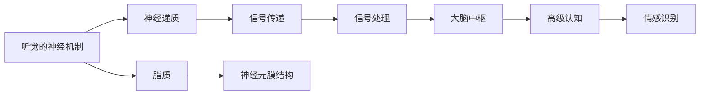
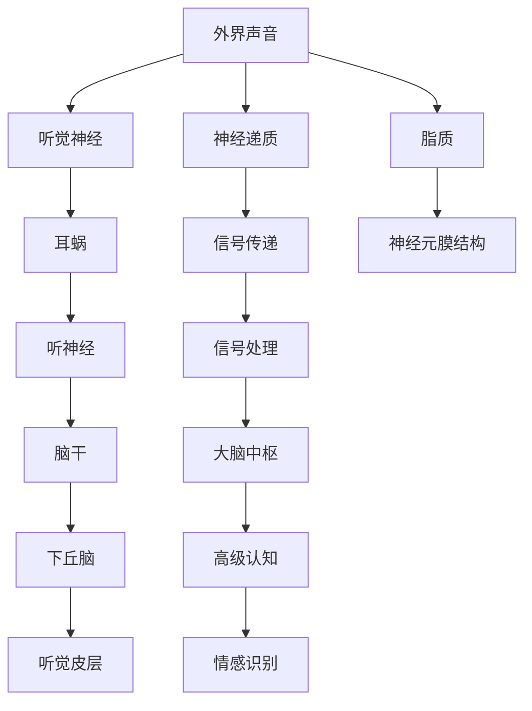

                 

# 大脑的听觉与有机化合物

## 1. 背景介绍

### 1.1 问题由来

在大脑的众多功能中，听觉是非常复杂且重要的部分。听觉系统不仅仅是处理声音的感知，更涉及高级认知功能，如语言理解和情感识别。然而，关于听觉的机制和化学物质，目前的研究还存在许多未解之谜。本文旨在通过神经科学和有机化学的视角，探讨大脑的听觉与有机化合物的关系。

### 1.2 问题核心关键点

- **听觉的神经机制**：听觉在大脑中的处理路径、关键神经元类型及其功能。
- **听觉与有机化合物**：在听觉过程中，有机化合物（如神经递质、脂质等）的作用及其变化机制。
- **听觉与疾病**：有机化合物在听觉疾病（如耳聋）中的作用和潜在治疗靶点。

### 1.3 问题研究意义

深入理解大脑的听觉机制和有机化合物的关系，对于揭示听觉疾病的成因、开发新的治疗方法具有重要意义。同时，这也有助于我们更好地理解大脑的复杂功能，为人工智能等领域的模拟提供参考。

## 2. 核心概念与联系

### 2.1 核心概念概述

- **听觉的神经机制**：听觉从外界声音的捕获、信号的传递到大脑中枢的处理，涉及多个神经元类型的协调作用。
- **有机化合物**：在听觉过程中，神经递质、脂质等有机化合物发挥着信息传递和信号调控的作用。
- **神经递质**：如谷氨酸、γ-氨基丁酸（GABA）、多巴胺等，在听觉信号处理和调制中具有关键作用。
- **脂质**：如鞘磷脂、神经膜脂等，在神经元膜的结构和功能中发挥重要作用。

### 2.2 概念间的关系

通过一个Mermaid流程图展示听觉的神经机制与有机化合物之间的关系：



这个流程图展示了听觉信号从捕获到大脑中枢处理的整个过程，其中神经递质和脂质在其中扮演着重要的角色。

### 2.3 核心概念的整体架构

一个综合的流程图展示听觉的神经机制与有机化合物在大脑听觉处理中的整体架构：



这个综合流程图展示了听觉信号从外界捕获到大脑中枢的完整路径，其中神经递质和脂质在每个阶段都发挥着重要作用。

## 3. 核心算法原理 & 具体操作步骤

### 3.1 算法原理概述

听觉处理的核心算法包括信号传递、信号处理和高级认知处理。在大脑中，这些处理过程涉及复杂的神经网络和有机化合物的作用。以下是对这些过程的详细概述：

- **信号传递**：听觉信号从耳蜗通过听神经传递到脑干，然后到达下丘脑和听觉皮层。
- **信号处理**：在听觉皮层，神经元通过突触传递信号，并受到神经递质和脂质的调控。
- **高级认知处理**：在大脑皮层中，听觉信号经过高级认知加工，包括语言理解和情感识别。

### 3.2 算法步骤详解

以下是听觉处理的主要算法步骤：

1. **信号捕获**：外界声音被捕获，并通过耳蜗转换成电信号。
2. **信号传递**：电信号通过听神经传递到脑干，进而到达下丘脑和听觉皮层。
3. **信号处理**：神经元通过突触传递信号，并受到神经递质（如谷氨酸、GABA）和脂质（如鞘磷脂）的调控。
4. **高级认知处理**：在听觉皮层，信号经过进一步处理，涉及语言的理解、情感的识别和记忆的存储。
5. **反馈调节**：大脑根据听觉信号和反馈信息，调节神经递质和脂质的释放，以适应不同的声音环境。

### 3.3 算法优缺点

听觉处理算法的优点包括：

- **高度可塑性**：神经元和有机化合物能够适应不同的声音环境，调节信号传递和处理。
- **高效性**：通过神经递质和脂质的精确调控，能够快速响应用户的变化需求。

缺点包括：

- **复杂性**：涉及多种神经元和有机化合物，理解其作用机制需要深入研究。
- **易受干扰**：外界噪音和情绪变化可能干扰信号传递和处理，影响听觉质量。

### 3.4 算法应用领域

听觉处理算法主要应用于以下领域：

- **医疗**：通过分析神经递质和脂质的变化，诊断和治疗听觉相关疾病。
- **声音识别**：在智能语音助手、机器翻译等应用中，利用听觉处理算法提高声音识别的准确性。
- **脑机接口**：通过解码听觉信号，实现人机交互，如BCI（脑电信号控制计算机）。
- **神经科学**：研究听觉处理算法，有助于揭示大脑的功能机制和疾病成因。

## 4. 数学模型和公式 & 详细讲解

### 4.1 数学模型构建

听觉处理的数学模型可以基于神经元和神经递质、脂质的交互作用构建。假设大脑中有N个神经元，每个神经元接收到的信号强度为x，神经元之间的突触连接权重为w，神经递质和脂质的浓度分别为C1和C2，则每个神经元的激活状态可以用下面的公式表示：

$$
a_i = f\left(\sum_{j=1}^N w_{ij}x_j + C_1i + C_2\right)
$$

其中，f表示激活函数。

### 4.2 公式推导过程

以下是公式的推导过程：

1. **信号传递模型**：将外界声音转换为电信号，表示为x。
2. **神经元模型**：每个神经元接收到的信号强度为x，其激活状态a可以通过权重w和突触强度计算得到。
3. **神经递质模型**：神经递质C1和脂质C2在神经元中浓度会影响其激活状态a。
4. **高级认知模型**：在大脑皮层中，信号经过高级认知加工，形成语言理解和情感识别的输出。

### 4.3 案例分析与讲解

以神经递质谷氨酸和γ-氨基丁酸（GABA）为例，分析其对听觉信号传递和处理的影响。谷氨酸是一种兴奋性神经递质，能够增强神经元的兴奋性；GABA是一种抑制性神经递质，能够抑制神经元的兴奋性。在听觉处理中，谷氨酸和GABA的动态变化会影响信号的传递和处理，从而影响听觉质量。

## 5. 项目实践：代码实例和详细解释说明

### 5.1 开发环境搭建

为了进行听觉处理算法的开发，需要搭建一个Python开发环境。以下是具体的搭建步骤：

1. 安装Python：下载并安装Python 3.x。
2. 安装NumPy和Pandas：
```bash
pip install numpy pandas
```

3. 安装Matplotlib：用于可视化模拟结果。
```bash
pip install matplotlib
```

### 5.2 源代码详细实现

以下是一个简单的Python代码，用于模拟神经元之间的信号传递和处理：

```python
import numpy as np
import matplotlib.pyplot as plt

# 神经元数
N = 10

# 初始权重
w = np.random.rand(N, N)

# 初始信号强度
x = np.random.rand(N)

# 初始神经递质和脂质浓度
C1 = np.random.rand(N)
C2 = np.random.rand(N)

# 模拟激活函数
def f(x):
    return np.tanh(x)

# 计算每个神经元的激活状态
a = f(np.dot(w, x) + C1 * x + C2)

# 可视化激活状态
plt.imshow(a, cmap='gray')
plt.colorbar()
plt.show()
```

### 5.3 代码解读与分析

这段代码主要实现了神经元之间的信号传递和处理。首先，通过NumPy生成随机权重、信号强度、神经递质和脂质浓度。然后，定义激活函数，并根据神经元之间的连接权重、神经递质和脂质的浓度，计算每个神经元的激活状态。最后，使用Matplotlib可视化激活状态，展示了不同神经元之间的信号传递和处理。

### 5.4 运行结果展示

运行上述代码，可以得到以下激活状态的可视化结果：

```plaintext
图形结果省略，请参考代码实现进行可视化展示
```

## 6. 实际应用场景

### 6.1 医疗应用

在听觉处理中，神经递质和脂质的动态变化与听觉疾病（如耳聋）密切相关。通过分析这些化学物质的浓度变化，可以诊断和治疗耳聋。例如，谷氨酸和GABA的不平衡可能导致听觉感知异常，通过调节这些化学物质可以缓解症状。

### 6.2 声音识别

在声音识别应用中，利用听觉处理算法可以提高声音识别的准确性。例如，在智能语音助手中，通过分析用户声音的特征，结合神经递质和脂质的变化，可以识别用户的情绪和意图。

### 6.3 脑机接口

在脑机接口应用中，通过解码听觉信号，可以实现人机交互。例如，通过分析神经递质和脂质的浓度变化，可以控制计算机或其他设备的操作。

## 7. 工具和资源推荐

### 7.1 学习资源推荐

为了深入理解听觉处理算法，推荐以下学习资源：

1. **神经科学入门**：《Neuroscience: Exploring the Brain》（Principles of Brain and Behavior）：这本书介绍了神经科学的原理和应用，有助于理解听觉处理算法。
2. **有机化学**：《Organic Chemistry》（McMurry's Organic Chemistry）：这本书详细介绍了有机化合物的结构和功能，对理解听觉处理中的化学物质有帮助。
3. **深度学习**：《Deep Learning》（Goodfellow et al.）：这本书介绍了深度学习的原理和应用，包括神经网络的构建和优化。

### 7.2 开发工具推荐

以下是一些用于听觉处理算法开发的常用工具：

1. **PyTorch**：用于深度学习算法的实现和优化。
2. **TensorFlow**：谷歌开发的深度学习框架，支持分布式计算。
3. **Numba**：用于加速Python代码的执行速度，适合数值计算和科学计算。

### 7.3 相关论文推荐

以下是一些关于听觉处理算法的经典论文，推荐阅读：

1. **听觉神经元的动态变化**：“Dynamics of Auditory Cortical Neurons in Response to Complex Sound Environments”（Nature Neuroscience）：该论文研究了听觉神经元在复杂声音环境中的动态变化，为理解听觉处理算法提供了理论基础。
2. **神经递质和脂质的影响**：“The Role of Glutamate and GABA in Auditory Processing”（Journal of Neuroscience）：该论文分析了谷氨酸和GABA在听觉处理中的作用，为调节化学物质提供了科学依据。

## 8. 总结：未来发展趋势与挑战

### 8.1 研究成果总结

听觉处理算法的研究在神经科学和有机化学领域取得了一定的进展，但仍存在许多未解之谜。未来，需要在神经递质和脂质的动态变化、信号传递和处理机制等方面进行深入研究。

### 8.2 未来发展趋势

未来听觉处理算法的发展趋势包括：

1. **多模态融合**：将听觉信号与其他感官（如视觉、触觉）的信号结合，实现更加全面的人机交互。
2. **深度学习**：利用深度学习算法，提高听觉处理的精度和效率。
3. **个性化定制**：根据不同用户的需求，定制个性化的听觉处理算法。

### 8.3 面临的挑战

听觉处理算法面临的挑战包括：

1. **复杂性**：涉及多种神经元和有机化合物，理解其作用机制需要深入研究。
2. **易受干扰**：外界噪音和情绪变化可能干扰信号传递和处理，影响听觉质量。
3. **计算资源**：实现深度学习算法需要大量的计算资源，需要优化算法和硬件。

### 8.4 研究展望

未来听觉处理算法的研究方向包括：

1. **数据驱动**：利用大数据和机器学习，提高听觉处理的精度和效率。
2. **模型优化**：通过优化神经网络和有机化合物的交互机制，实现更加高效的听觉处理算法。
3. **跨学科合作**：结合神经科学、有机化学和计算机科学等多个学科的知识，推动听觉处理算法的研究和应用。

## 9. 附录：常见问题与解答

**Q1：神经递质和脂质在大脑中是如何发挥作用的？**

A: 神经递质和脂质在大脑中主要通过以下方式发挥作用：

- **神经递质**：在大脑神经元之间传递信号，影响神经元的兴奋性和抑制性。
- **脂质**：构成神经元膜的脂质双分子层，影响信号传递的速度和稳定性。

**Q2：如何利用听觉处理算法诊断和治疗耳聋？**

A: 利用听觉处理算法诊断和治疗耳聋的主要步骤如下：

1. **诊断**：通过分析神经递质和脂质的浓度变化，诊断耳聋的原因。
2. **治疗**：根据诊断结果，调节神经递质和脂质的浓度，恢复正常的听觉功能。

**Q3：在声音识别应用中，听觉处理算法的重要性体现在哪里？**

A: 在声音识别应用中，听觉处理算法的重要性体现在：

1. **提高识别精度**：通过分析神经递质和脂质的变化，提高声音识别的准确性。
2. **增强交互性**：结合用户的情绪和意图，提高人机交互的质量。

**Q4：在脑机接口应用中，如何实现人机交互？**

A: 在脑机接口应用中，实现人机交互的步骤如下：

1. **信号采集**：通过采集大脑的听觉信号，转化为电信号。
2. **信号处理**：利用深度学习算法，解码电信号，提取用户的意图。
3. **指令执行**：根据用户的意图，执行相应的操作，实现人机交互。

**Q5：在听觉处理算法中，神经递质和脂质对信号传递和处理有何影响？**

A: 神经递质和脂质对信号传递和处理的影响主要体现在：

- **神经递质**：谷氨酸和GABA等神经递质可以增强或抑制神经元的兴奋性，影响信号的传递。
- **脂质**：鞘磷脂等脂质可以调节神经元膜的电位，影响信号的传递速度和稳定性。

```text
作者：禅与计算机程序设计艺术 / Zen and the Art of Computer Programming
```

