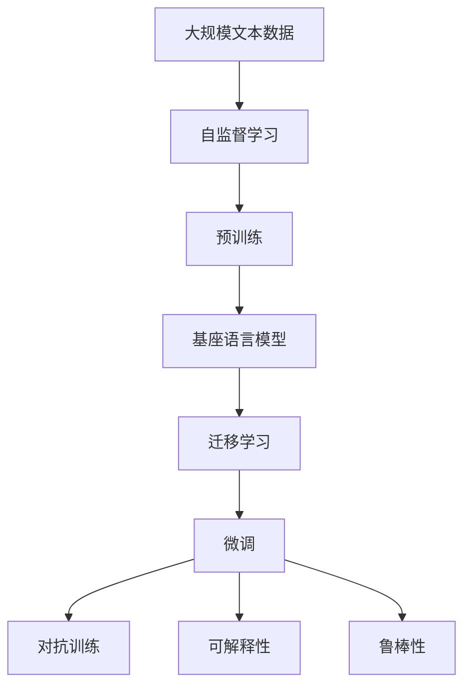
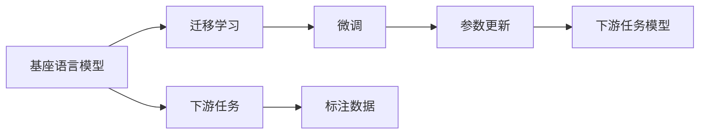
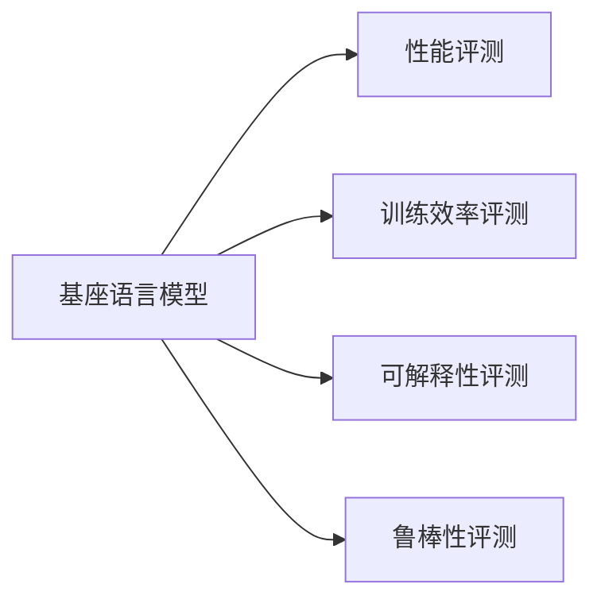
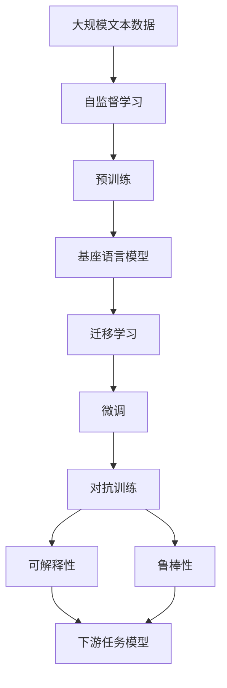

                 

# 大语言模型原理与工程实践：基座语言模型的评测

> 关键词：大语言模型, 基座语言模型, 评测, 工程实践, 自监督学习, 迁移学习, Transformer, BERT, RoBERTa

## 1. 背景介绍

### 1.1 问题由来
近年来，深度学习技术在自然语言处理(NLP)领域取得了巨大的突破，尤其是预训练大语言模型(LLMs)的出现，使得模型在通用语言理解与生成能力上迈出了重要的一步。这些大模型如GPT、BERT、RoBERTa等，经过在大规模无标签文本语料上的预训练，学习到了丰富的语言知识和常识，成为解决多种NLP任务的基础。

这些基座语言模型在各类NLP任务的评测中表现出色，显著提升了模型在特定任务上的性能。然而，在基座语言模型的评测过程中，需要综合考虑模型在多个维度的表现，而不仅仅是最终任务的精度。因此，本文将从模型的性能、效率、可解释性等多个方面，深入分析基座语言模型的评测方法与工程实践。

### 1.2 问题核心关键点
在基座语言模型的评测中，需要考虑以下几个核心关键点：

- **模型性能**：包括模型在不同NLP任务上的表现，如分类、匹配、生成等。
- **训练效率**：模型在训练和推理过程中的计算资源消耗情况，如训练时间、推理时间、内存占用等。
- **可解释性**：模型输出的决策过程是否可解释，能否提供可靠的推理依据。
- **鲁棒性**：模型面对噪声、对抗样本等负面因素的鲁棒性，能否保持稳定性能。

这些关键点涵盖了基座语言模型评测的各个维度，有助于全面评估模型的性能与适用性。

### 1.3 问题研究意义
基座语言模型的评测对于推动模型性能的提升、指导模型设计、优化模型工程实践具有重要意义：

1. **指导模型优化**：通过评测分析，可以找到模型在哪些方面存在不足，从而指导后续的模型优化与改进。
2. **评估算法有效性**：不同预训练算法（如自监督、对抗训练等）的效果可以通过评测比较，找出最有效的训练方法。
3. **促进模型应用**：评测结果可以为不同应用场景选择合适的基座语言模型提供依据，加速模型在实际应用中的落地。
4. **提升开发效率**：系统全面的评测流程可以减少模型开发和调优的成本，提高模型迭代效率。
5. **增强模型可信度**：通过透明的评测方法，可以增强模型输出的可信度，提升用户对模型的信任感。

## 2. 核心概念与联系

### 2.1 核心概念概述

为更好地理解基座语言模型的评测方法，本节将介绍几个密切相关的核心概念：

- **大语言模型(LLMs)**：以自回归(如GPT)或自编码(如BERT)模型为代表的大规模预训练语言模型。通过在大规模无标签文本语料上进行预训练，学习通用的语言表示，具备强大的语言理解和生成能力。

- **基座语言模型(Seeded Language Models, SLMs)**：在大规模预训练语言模型的基础上，根据特定任务需求进行微调或修改得到的语言模型。基座语言模型通常保留预训练语言模型的通用能力，同时具备针对特定任务的定制能力。

- **自监督学习(Self-Supervised Learning)**：使用未标注数据进行学习，通过构造出许多由真实数据衍生出来的“伪标签”，从而让模型学习到通用的语言特征。自监督学习在大规模预训练过程中起到关键作用。

- **迁移学习(Transfer Learning)**：将一个领域学习到的知识，迁移应用到另一个不同但相关的领域的学习范式。基座语言模型通常通过迁移学习，将预训练知识应用到下游任务。

- **对抗训练(Adversarial Training)**：通过在模型训练过程中加入对抗样本，使模型在面对噪声、对抗攻击时仍能保持稳定性能。

- **可解释性(Interpretability)**：模型输出的决策过程是否可解释，能否提供可靠的推理依据。可解释性在大规模预训练语言模型的应用中尤为重要。

- **鲁棒性(Robustness)**：模型面对噪声、对抗样本等负面因素的鲁棒性，能否保持稳定性能。鲁棒性在大规模预训练语言模型的部署与实际应用中具有重要意义。

这些核心概念之间的逻辑关系可以通过以下Mermaid流程图来展示：



这个流程图展示了大语言模型和基座语言模型之间的关系：

1. 大语言模型通过自监督学习，在大规模无标签数据上进行预训练。
2. 预训练模型作为基座语言模型的基础，经过迁移学习、微调、对抗训练等过程，成为适合特定任务的基座语言模型。
3. 基座语言模型在迁移学习过程中，可以保持预训练模型的通用能力，同时针对特定任务进行微调，提升性能。
4. 对抗训练和可解释性方法进一步提升基座语言模型的鲁棒性和可信度。

这些概念共同构成了基座语言模型的学习框架，使其能够在各种场景下发挥强大的语言理解和生成能力。通过理解这些核心概念，我们可以更好地把握基座语言模型的工作原理和优化方向。

### 2.2 概念间的关系

这些核心概念之间存在着紧密的联系，形成了基座语言模型的完整生态系统。下面我们通过几个Mermaid流程图来展示这些概念之间的关系。

#### 2.2.1 基座语言模型的训练过程


这个流程图展示了基座语言模型的训练过程，从自监督学习、预训练到迁移学习、微调，再到对抗训练、可解释性和鲁棒性的提升，逐步优化模型性能。

#### 2.2.2 基座语言模型与下游任务的关系



这个流程图展示了基座语言模型与下游任务的关系，从基座语言模型到迁移学习、微调，最终得到适合下游任务的高性能模型。

#### 2.2.3 基座语言模型的多维度评测



这个流程图展示了基座语言模型在多维度评测中的关系，从性能、训练效率、可解释性、鲁棒性等不同维度进行全面评估。

### 2.3 核心概念的整体架构

最后，我们用一个综合的流程图来展示这些核心概念在大语言模型基座训练过程中的整体架构：



这个综合流程图展示了从预训练到大规模文本数据，再到基座语言模型，最后到下游任务的完整过程。基座语言模型通过自监督学习、预训练、迁移学习、微调等过程，逐步优化模型性能，并最终应用于下游任务。

## 3. 核心算法原理 & 具体操作步骤
### 3.1 算法原理概述

基座语言模型的评测方法本质上是对模型在多个维度上进行综合评估，通过评测指标的计算和分析，得出模型的性能、效率、可解释性和鲁棒性等关键指标。

基座语言模型的评测可以分为以下几个步骤：

1. **数据准备**：收集基座语言模型所需的大规模无标签文本数据，并进行预处理。
2. **自监督学习**：在大规模无标签文本数据上进行自监督学习，获得通用语言知识。
3. **基座语言模型训练**：根据下游任务需求，对预训练模型进行微调，形成基座语言模型。
4. **性能评测**：使用下游任务的标注数据集，评估基座语言模型在各个任务上的性能指标。
5. **训练效率评测**：评估基座语言模型在训练和推理过程中的计算资源消耗情况。
6. **可解释性评测**：评估模型输出的可解释性，提供决策依据。
7. **鲁棒性评测**：评估模型面对噪声、对抗样本等负面因素的鲁棒性，确保稳定性。

通过这些步骤，可以全面评估基座语言模型的性能和适用性。

### 3.2 算法步骤详解

#### 3.2.1 数据准备

基座语言模型评测的数据准备包括：

1. **数据收集**：收集大规模无标签文本数据，如Wikipedia、新闻语料库、公开的书籍等。
2. **数据清洗**：去除无用信息、噪声和重复数据，确保数据质量。
3. **分词与标注**：对文本进行分词和标注，形成可用于训练的数据集。

#### 3.2.2 自监督学习

自监督学习是基座语言模型评测的基础，通过无标签数据进行预训练，学习通用的语言知识。

1. **预训练模型选择**：选择适合任务的预训练模型，如BERT、RoBERTa、GPT等。
2. **预训练任务设计**：根据预训练模型的结构，设计相应的自监督学习任务，如掩码语言模型、下一句预测、句子分类等。
3. **预训练模型训练**：使用大规模无标签文本数据对预训练模型进行训练，学习通用的语言知识。

#### 3.2.3 基座语言模型训练

基座语言模型的训练分为以下几个步骤：

1. **下游任务选择**：根据任务需求，选择合适的下游任务，如文本分类、命名实体识别、情感分析等。
2. **微调策略设计**：选择合适的微调策略，如全参数微调、适配器微调等。
3. **标注数据准备**：准备下游任务的标注数据集，划分为训练集、验证集和测试集。
4. **微调模型训练**：使用标注数据集对预训练模型进行微调，得到基座语言模型。
5. **微调参数设置**：设置微调的超参数，如学习率、批大小、迭代轮数等。
6. **模型评估**：使用测试集评估微调后模型的性能。

#### 3.2.4 性能评测

性能评测通过评估模型在各个下游任务上的表现，来评估基座语言模型的性能。

1. **选择评估指标**：根据任务类型，选择合适的评估指标，如准确率、精确率、召回率、F1分数等。
2. **划分数据集**：将标注数据集划分为训练集、验证集和测试集，用于模型的训练、调参和最终评测。
3. **模型评测**：使用测试集评估基座语言模型在各个任务上的性能。

#### 3.2.5 训练效率评测

训练效率评测通过评估模型在训练和推理过程中的计算资源消耗情况，来评估基座语言模型的训练效率。

1. **计算资源测量**：使用工具测量模型在训练和推理过程中的计算资源消耗，如CPU/GPU使用率、内存占用等。
2. **训练时间计算**：计算模型在训练和推理过程中的时间消耗，包括预训练和微调时间。
3. **模型优化**：根据计算资源消耗情况，优化模型结构和超参数，提高训练效率。

#### 3.2.6 可解释性评测

可解释性评测通过评估模型输出的可解释性，来确保模型的可信度和透明度。

1. **可解释性指标设计**：根据任务类型，设计可解释性指标，如LIME、SHAP等。
2. **模型输出解释**：使用可解释性工具解释模型输出，提供决策依据。
3. **可解释性改进**：根据模型输出的可解释性，优化模型结构和训练方法。

#### 3.2.7 鲁棒性评测

鲁棒性评测通过评估模型面对噪声、对抗样本等负面因素的鲁棒性，来确保模型的稳定性。

1. **对抗样本生成**：使用对抗样本生成工具，生成对抗样本。
2. **模型鲁棒性评估**：使用对抗样本评估模型的鲁棒性，确保模型面对噪声和对抗样本仍能保持稳定性能。
3. **鲁棒性改进**：根据模型鲁棒性评估结果，优化模型结构和训练方法，提高模型鲁棒性。

### 3.3 算法优缺点

基座语言模型的评测方法具有以下优点：

1. **全面性**：涵盖模型性能、训练效率、可解释性和鲁棒性等多个维度，全面评估模型。
2. **实用性**：通过评测方法，可以优化模型设计和训练过程，提升模型性能。
3. **可扩展性**：可以根据不同任务需求，设计不同的评测方法，扩展到更多领域。

但同时，基座语言模型的评测方法也存在以下缺点：

1. **计算成本高**：大规模无标签数据和对抗样本的生成需要大量计算资源，成本较高。
2. **模型复杂度高**：基座语言模型涉及多个训练和评测环节，模型复杂度高。
3. **结果分析复杂**：需要综合考虑多个维度的评测结果，分析难度较大。

尽管存在这些局限性，但基座语言模型的评测方法在评估模型性能和适用性方面仍然具有不可替代的作用，是推动模型优化和应用的重要工具。

### 3.4 算法应用领域

基座语言模型的评测方法在NLP领域已经得到了广泛应用，覆盖了几乎所有常见任务，例如：

- **文本分类**：如情感分析、主题分类、意图识别等。通过评测模型在分类任务上的表现，评估其分类能力和泛化性能。
- **命名实体识别**：识别文本中的人名、地名、机构名等特定实体。通过评测模型在命名实体识别任务上的表现，评估其实体边界和类型识别能力。
- **关系抽取**：从文本中抽取实体之间的语义关系。通过评测模型在关系抽取任务上的表现，评估其关系抽取能力和准确性。
- **问答系统**：对自然语言问题给出答案。通过评测模型在问答任务上的表现，评估其问题理解和答案生成能力。
- **机器翻译**：将源语言文本翻译成目标语言。通过评测模型在机器翻译任务上的表现，评估其翻译能力和语言理解能力。
- **文本摘要**：将长文本压缩成简短摘要。通过评测模型在文本摘要任务上的表现，评估其文本压缩能力和语义理解能力。
- **对话系统**：使机器能够与人自然对话。通过评测模型在对话任务上的表现，评估其对话能力和上下文理解能力。

除了上述这些经典任务外，基座语言模型的评测方法也被创新性地应用到更多场景中，如可控文本生成、常识推理、代码生成、数据增强等，为NLP技术带来了全新的突破。随着基座语言模型的不断进步，相信NLP技术将在更广阔的应用领域大放异彩。

## 4. 数学模型和公式 & 详细讲解

### 4.1 数学模型构建

基座语言模型的评测方法主要涉及以下几个数学模型：

1. **自监督学习模型**：在无标签文本数据上进行自监督学习，获得通用语言知识。
2. **基座语言模型训练模型**：根据下游任务需求，对预训练模型进行微调，形成基座语言模型。
3. **性能评测模型**：评估基座语言模型在各个下游任务上的性能指标。
4. **训练效率评测模型**：评估基座语言模型在训练和推理过程中的计算资源消耗情况。
5. **可解释性评测模型**：评估模型输出的可解释性。
6. **鲁棒性评测模型**：评估模型面对噪声、对抗样本等负面因素的鲁棒性。

下面将详细介绍这些数学模型及其构建方法。

### 4.2 公式推导过程

#### 4.2.1 自监督学习模型

自监督学习模型的构建如下：

假设大规模无标签文本数据为 $\mathcal{D}$，自监督学习任务为 $\mathcal{T}$，基座语言模型为 $M$。

基座语言模型 $M$ 在文本 $x$ 上的自监督学习目标函数为：

$$
\mathcal{L}_{\mathcal{T}}(M) = \mathbb{E}_{(x,y) \sim \mathcal{D}}[\ell(M(x),y)]
$$

其中 $\ell$ 为损失函数，$y$ 为自监督学习任务的标签。

#### 4.2.2 基座语言模型训练模型

基座语言模型训练模型的构建如下：

假设下游任务 $\mathcal{T}'$ 的标注数据集为 $\mathcal{D}'$，基座语言模型为 $M$，微调后的模型为 $M'$。

基座语言模型 $M'$ 在标注数据集 $\mathcal{D}'$ 上的训练目标函数为：

$$
\mathcal{L}_{\mathcal{T}'}(M') = \mathbb{E}_{(x,y) \sim \mathcal{D}'}[\ell(M'(x),y)]
$$

其中 $\ell$ 为损失函数，$y$ 为下游任务的标签。

#### 4.2.3 性能评测模型

性能评测模型的构建如下：

假设下游任务 $\mathcal{T}'$ 的测试集为 $\mathcal{D}''$，基座语言模型为 $M'$。

基座语言模型 $M'$ 在测试集 $\mathcal{D}''$ 上的性能评测目标函数为：

$$
\mathcal{L}_{\mathcal{T}'}(M') = \mathbb{E}_{(x,y) \sim \mathcal{D}''}[\ell(M'(x),y)]
$$

其中 $\ell$ 为损失函数，$y$ 为下游任务的标签。

#### 4.2.4 训练效率评测模型

训练效率评测模型的构建如下：

假设基座语言模型为 $M'$，训练时间、推理时间分别为 $t_{train}$、$t_{inference}$。

基座语言模型 $M'$ 的训练效率评测目标函数为：

$$
\mathcal{L}_{efficiency}(M') = \frac{t_{train}}{N_{train}} + \frac{t_{inference}}{N_{inference}}
$$

其中 $N_{train}$、$N_{inference}$ 分别为训练样本数和推理样本数。

#### 4.2.5 可解释性评测模型

可解释性评测模型的构建如下：

假设基座语言模型为 $M'$，可解释性工具为 $\mathcal{I}$。

基座语言模型 $M'$ 的可解释性评测目标函数为：

$$
\mathcal{L}_{interpretable}(M', \mathcal{I}) = \mathbb{E}_{x \sim \mathcal{D}''}[\mathcal{I}(M'(x))]
$$

其中 $\mathcal{I}(M'(x))$ 为可解释性工具对模型输出的解释结果。

#### 4.2.6 鲁棒性评测模型

鲁棒性评测模型的构建如下：

假设基座语言模型为 $M'$，对抗样本生成工具为 $\mathcal{G}$。

基座语言模型 $M'$ 的鲁棒性评测目标函数为：

$$
\mathcal{L}_{robust}(M') = \mathbb{E}_{(x,y) \sim \mathcal{D}'}[\ell(M'(x),y')] + \mathbb{E}_{x \sim \mathcal{D}'}[\ell(M'(x),y'')]
$$

其中 $y'$ 为对抗样本，$y'$ 为对抗样本标签。

### 4.3 案例分析与讲解

以BERT基座语言模型在中文命名实体识别任务上的评测为例，介绍基座语言模型的评测方法：

1. **数据准备**：收集大规模中文无标签文本数据，并进行预处理，如分词、去噪等。
2. **自监督学习**：在收集到的无标签文本数据上，使用掩码语言模型对BERT进行预训练。
3. **基座语言模型训练**：使用中文命名实体识别任务的标注数据集，对预训练后的BERT进行微调，得到基座语言模型。
4. **性能评测**：使用测试集对基座语言模型在命名实体识别任务上的表现进行评测，评估其实体边界和类型识别能力。
5. **训练效率评测**：测量基座语言模型在训练和推理过程中的计算资源消耗情况，评估其训练效率。
6. **可解释性评测**：使用可解释性工具，如LIME、SHAP，对基座语言模型在命名实体识别任务上的输出进行解释，提供决策依据。
7. **鲁棒性评测**：使用对抗样本生成工具，生成对抗样本，对基座语言模型进行鲁棒性评估，确保模型面对噪声和对抗样本仍能保持稳定性能。

## 5. 项目实践：代码实例和详细解释说明

### 5.1 开发环境搭建

在进行基座语言模型评测实践前，我们需要准备好开发环境。以下是使用Python进行PyTorch开发的环境配置流程：

1. 安装Anaconda：从官网下载并安装Anaconda，用于创建独立的Python环境。

2. 创建并激活虚拟环境：
```bash
conda create -n pytorch-env python=3.8 
conda activate pytorch-env
```

3. 安装PyTorch：根据CUDA版本，从官网获取对应的安装命令。例如：
```bash
conda install pytorch torchvision torchaudio cudatoolkit=11.1 -c pytorch -c conda-forge
```

4. 安装Transformers库：
```bash
pip install transformers
```

5. 安装各类工具包：
```bash
pip install numpy pandas scikit-learn matplotlib tqdm jupyter notebook ipython
```

完成上述步骤后，即可在`pytorch-env`环境中开始基座语言模型评测实践。

### 5.2 源代码详细实现

这里以中文命名实体识别任务为例，给出使用Transformers库对BERT基座语言模型进行评测的PyTorch代码实现。

首先，定义中文命名实体识别任务的数据处理函数：

```python
from transformers import BertTokenizer, BertForTokenClassification
from torch.utils.data import Dataset
import torch

class ChineseNERDataset(Dataset):
    def __init__(self, texts, tags, tokenizer, max_len=128):
        self.texts = texts
        self.tags = tags
        self.tokenizer = tokenizer
        self.max_len = max_len
        
    def __len__(self):
        return len(self.texts)
    
    def __getitem__(self, item):
        text = self.texts[item]
        tags = self.tags[item]
        
        encoding = self.tokenizer(text, return_tensors='pt', max_length=self.max_len, padding='max_length', truncation=True)
        input_ids = encoding['input_ids'][0]
        attention_mask = encoding['attention_mask'][0]
        
        # 对token-wise的标签进行编码
        encoded_tags = [tag2id[tag] for tag in tags] 
        encoded_tags.extend([tag2id['O']] * (self.max_len - len(encoded_tags)))
        labels = torch.tensor(encoded_tags, dtype=torch.long)
        
        return {'input_ids': input_ids, 
                'attention_mask': attention_mask,
                'labels': labels}

# 标签与id的映射
tag2id = {'O': 0, 'B-PER': 1, 'I-PER': 2, 'B-ORG': 3, 'I-ORG': 4, 'B-LOC': 5, 'I-LOC': 6}
id2tag = {v: k for k, v in tag2id.items()}

# 创建dataset
tokenizer = BertTokenizer.from_pretrained('bert-base-cased')

train_dataset = ChineseNERDataset(train_texts, train_tags, tokenizer)
dev_dataset = ChineseNERDataset(dev_texts, dev_tags, tokenizer)
test_dataset = ChineseNERDataset(test_texts, test_tags, tokenizer)
```

然后，定义模型和优化器：

```python
from transformers import BertForTokenClassification, AdamW

model = BertForTokenClassification.from_pretrained('bert-base-cased', num_labels=len(tag2id))

optimizer = AdamW(model.parameters(), lr=2e-5)
```

接着，定义训练和评估函数：

```python
from torch.utils.data import DataLoader
from tqdm import tqdm
from sklearn.metrics import classification_report

device = torch.device('cuda') if torch.cuda.is_available() else torch.device('cpu')
model.to(device)

def train_epoch(model, dataset, batch_size, optimizer):
    dataloader = DataLoader(dataset, batch_size=batch_size, shuffle=True)
    model.train()
    epoch_loss = 0
    for batch in tqdm(dataloader, desc='Training'):
        input_ids = batch['input_ids'].to(device)
        attention_mask = batch['attention_mask'].to(device)
        labels = batch['labels'].to(device)
        model.zero_grad()
        outputs = model(input_ids, attention_mask=attention_mask, labels

