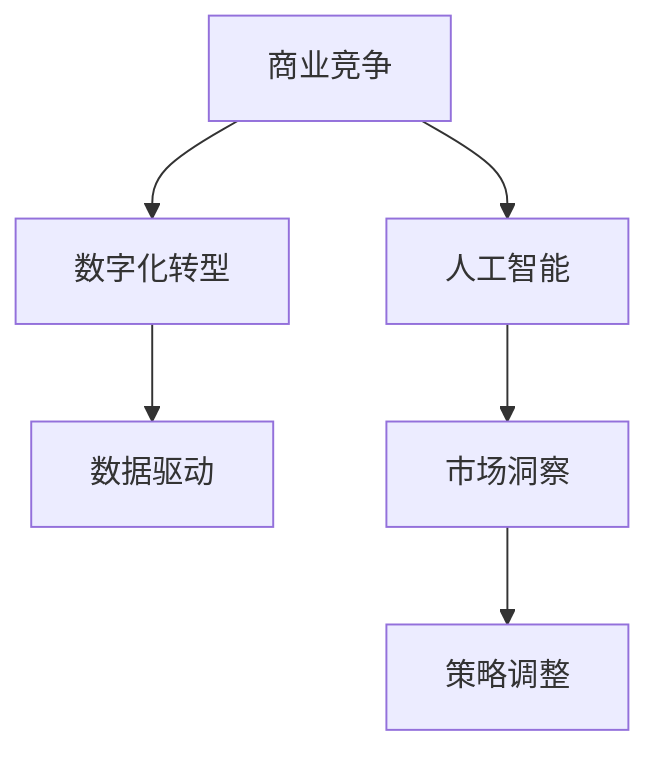
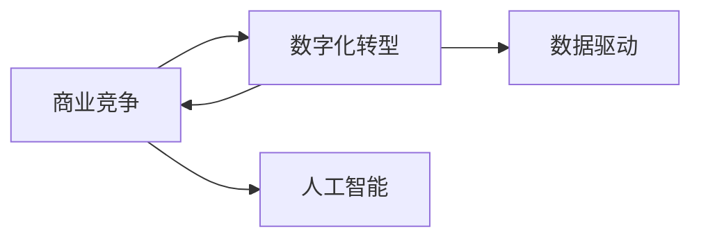
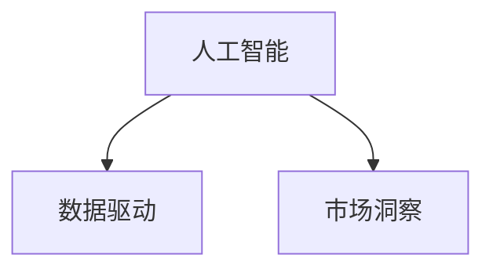
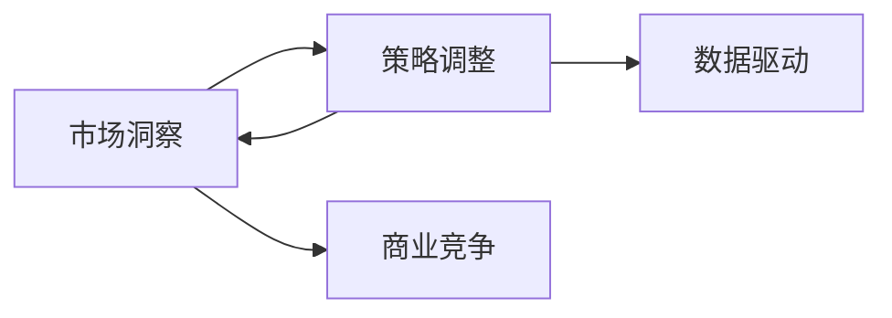
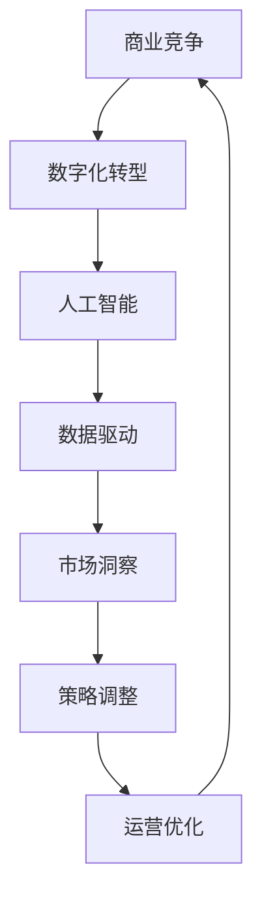

                 

# 天下没有好做的生意：商业竞争加剧的真相

> 关键词：商业竞争, 数字化转型, 人工智能, 数据驱动, 策略调整, 市场洞察

## 1. 背景介绍

### 1.1 问题由来
在全球化的今天，商业环境瞬息万变，传统的商业模式和经营策略已经难以适应激烈的市场竞争。尤其是在数字化转型的大背景下，企业不得不重新审视自身的竞争优势和策略布局。然而，面对愈发复杂和不确定的市场环境，许多企业在制定和执行商业策略时往往感到无从下手。

### 1.2 问题核心关键点
如何应对不断加剧的商业竞争？如何在数字化浪潮中保持竞争力？如何通过数据驱动和人工智能技术提升商业决策的科学性和精准性？本文旨在从商业竞争的角度出发，结合数字化转型和人工智能技术，探讨这些关键问题，为企业管理者提供有价值的策略建议。

### 1.3 问题研究意义
研究商业竞争的本质和应对策略，对于企业制定和优化其商业计划、提升市场竞争力具有重要意义。了解商业竞争的真相，可以帮助企业制定更具前瞻性和执行力的策略，增强应对市场变化的能力。此外，随着数字化转型和人工智能技术的不断进步，将数据和智能技术融入商业决策，能够进一步提高企业的决策效率和精准度。

## 2. 核心概念与联系

### 2.1 核心概念概述

- **商业竞争**：指企业在市场中为了争夺资源、市场份额和客户而进行的竞争行为。商业竞争的目标是通过提高效率、降低成本、创新产品和服务等方式，在市场上获得优势。

- **数字化转型**：指企业通过应用数字技术，特别是信息技术、大数据和人工智能技术，实现业务流程和商业模式的重构。数字化转型旨在提升企业的效率、灵活性和竞争力。

- **人工智能**：一种通过模拟人类智能行为，使计算机具备自主学习和决策能力的高级计算技术。在商业竞争中，人工智能可用于市场分析、客户行为预测、供应链优化等多个方面。

- **数据驱动**：指利用数据和技术分析来驱动业务决策和运营的过程。数据驱动有助于企业更好地理解市场和客户需求，优化业务流程，提高决策准确性和效率。

- **策略调整**：根据市场环境的变化和内部资源的变化，及时调整企业的商业策略和运营模式，以适应新的发展需求。

- **市场洞察**：通过对市场趋势、客户需求、竞争格局等信息的分析和解读，为企业提供全面的市场理解，支持策略调整和决策制定。

这些核心概念之间的联系可以通过以下Mermaid流程图来展示：



这个流程图展示了商业竞争、数字化转型、人工智能、数据驱动、市场洞察和策略调整之间的联系：

1. 商业竞争的加剧促使企业进行数字化转型，通过应用先进技术提升竞争力。
2. 在数字化转型的过程中，人工智能技术提供强大的计算和分析能力，支持企业的数据驱动决策。
3. 数据驱动的商业决策需要市场洞察作为支持，通过分析市场趋势和客户需求，企业能够更准确地调整策略。
4. 策略调整是应对市场变化和内部资源调整的关键，有助于企业保持竞争力和适应性。

### 2.2 概念间的关系

这些核心概念之间存在着紧密的联系，构成了商业竞争和数字化转型的完整生态系统。

#### 2.2.1 商业竞争与数字化转型



这个流程图展示了商业竞争和数字化转型之间的关系：

1. 商业竞争驱动企业进行数字化转型，利用先进技术提升自身能力。
2. 数字化转型通过引入人工智能和数据驱动技术，提升企业的竞争力。

#### 2.2.2 人工智能与数据驱动



这个流程图展示了人工智能和数据驱动之间的关系：

1. 人工智能依赖于大量的数据进行训练和优化，从而提供更加精准的预测和决策。
2. 数据驱动的核心是利用数据分析技术支持人工智能的训练和应用，提升其效果和准确性。

#### 2.2.3 市场洞察与策略调整



这个流程图展示了市场洞察和策略调整之间的关系：

1. 市场洞察通过分析市场数据，为企业提供全面的市场理解。
2. 策略调整根据市场洞察的结果，优化企业的商业竞争策略，提升市场适应性。

### 2.3 核心概念的整体架构

最后，我们用一个综合的流程图来展示这些核心概念在大规模商业竞争中的整体架构：



这个综合流程图展示了从商业竞争到策略调整的完整过程：

1. 商业竞争推动企业进行数字化转型，引入人工智能技术。
2. 数字化转型通过数据驱动支持人工智能的应用，提升决策效率和效果。
3. 市场洞察通过数据分析提供全面的市场理解，支持策略调整。
4. 策略调整优化企业的运营模式，提升竞争力。
5. 运营优化进一步提升企业的运营效率和客户体验，增强市场竞争力。

## 3. 核心算法原理 & 具体操作步骤
### 3.1 算法原理概述

商业竞争的应对策略可以概括为数据驱动的竞争分析和智能决策过程。其核心算法原理包括：

1. **数据收集与清洗**：从不同渠道收集相关的市场数据，清洗和预处理数据，为后续分析奠定基础。
2. **市场分析**：利用数据分析技术，如聚类分析、回归分析、时间序列分析等，挖掘市场趋势和客户需求。
3. **竞争分析**：通过分析竞争对手的行为、市场份额、产品特点等信息，评估自身的竞争优势和劣势。
4. **客户洞察**：通过分析客户行为数据，了解客户偏好和需求，优化产品和服务。
5. **策略调整**：基于市场分析和竞争分析的结果，制定和调整企业的商业策略。

### 3.2 算法步骤详解

以下是详细的算法步骤：

#### 步骤1：数据收集与清洗

1. **数据来源**：包括企业内部数据（如销售数据、客户行为数据）、公开数据（如市场报告、社交媒体数据）和第三方数据（如行业分析报告）。
2. **数据清洗**：处理缺失值、异常值和重复数据，确保数据的完整性和一致性。
3. **数据整合**：将不同来源的数据进行整合，构建统一的数据视图。

#### 步骤2：市场分析

1. **数据探索性分析**：利用统计分析工具，如描述性统计、直方图、散点图等，初步了解数据的分布和特征。
2. **聚类分析**：使用K-means、层次聚类等方法，将市场划分为不同的细分市场。
3. **回归分析**：建立市场趋势的数学模型，预测未来的市场变化。
4. **时间序列分析**：分析市场数据随时间的变化规律，识别周期性趋势和季节性波动。

#### 步骤3：竞争分析

1. **竞争对手分析**：收集竞争对手的产品、价格、市场份额等信息，分析其市场表现和策略。
2. **SWOT分析**：通过分析企业的优势、劣势、机会和威胁，制定竞争策略。
3. **波特五力分析**：分析市场中的竞争者、供应商、买家、替代品和潜在进入者，评估市场竞争程度。

#### 步骤4：客户洞察

1. **客户行为分析**：分析客户的购买行为、偏好、反馈等数据，了解客户需求和行为模式。
2. **情感分析**：利用自然语言处理技术，对社交媒体和客户反馈数据进行情感分析，了解客户情感倾向。
3. **客户细分**：根据客户行为和偏好，进行市场细分，制定个性化营销策略。

#### 步骤5：策略调整

1. **目标市场选择**：基于市场分析和客户洞察的结果，选择有潜力的目标市场。
2. **产品和服务优化**：根据市场趋势和客户需求，优化产品和服务，提升客户满意度。
3. **价格策略制定**：利用价格弹性分析，制定灵活的价格策略，提升竞争力。
4. **营销渠道优化**：分析不同渠道的客户反应和效果，优化营销渠道布局，提升营销效率。

### 3.3 算法优缺点

#### 优点

1. **数据驱动**：通过数据分析，企业能够更加精准地理解市场和客户需求，优化决策。
2. **效率提升**：利用先进的数据处理和分析技术，提升运营效率和决策速度。
3. **策略灵活**：数据驱动和人工智能技术支持，使企业能够灵活调整策略，适应市场变化。

#### 缺点

1. **数据依赖**：数据质量直接影响分析结果，数据不完整或不准确可能导致错误的决策。
2. **技术门槛**：需要一定的技术能力和专业知识，普通企业难以独立实施。
3. **隐私和合规**：在数据收集和处理过程中，需要严格遵守数据隐私和法律法规，确保数据安全和合规。

### 3.4 算法应用领域

商业竞争和数字化转型涉及多个领域，主要包括：

- **零售和消费品**：通过客户洞察和市场分析，优化产品和服务，提升销售效率。
- **金融服务**：利用数据分析和人工智能技术，提升客户体验，优化风险管理。
- **制造业**：通过市场分析和供应链优化，提高生产效率和产品质量。
- **医疗健康**：通过客户行为分析和市场洞察，提升医疗服务质量和客户满意度。
- **能源和公用事业**：通过数据分析和智能决策，优化能源消耗和资源利用。

## 4. 数学模型和公式 & 详细讲解  
### 4.1 数学模型构建

商业竞争的应对策略可以建立数学模型进行分析。以下是一个简化的数学模型：

假设市场规模为 $M$，企业 $i$ 的市场份额为 $s_i$，平均市场增长率为 $\mu$，则企业 $i$ 的市场份额 $s_i$ 可以表示为：

$$
s_i = \frac{a_i}{a_1} e^{-\lambda_i t}
$$

其中 $a_i$ 为企业的初始市场份额，$\lambda_i$ 为企业的市场份额衰减率，$t$ 为时间。

企业 $i$ 的利润 $P_i$ 可以表示为：

$$
P_i = r_i \cdot s_i \cdot M
$$

其中 $r_i$ 为企业 $i$ 的平均利润率。

### 4.2 公式推导过程

以下是对上述模型的推导过程：

#### 1. 市场份额模型

企业 $i$ 的市场份额 $s_i$ 可以通过以下模型推导：

$$
\frac{ds_i}{dt} = \frac{a_i}{a_1} \lambda_i (s_i - s_i^\prime) e^{-\lambda_i t}
$$

其中 $s_i^\prime$ 为企业的市场份额上限。通过解上述微分方程，可以得出企业 $i$ 的市场份额随时间的变化规律。

#### 2. 利润模型

企业 $i$ 的利润 $P_i$ 可以通过以下模型推导：

$$
\frac{dP_i}{dt} = r_i \cdot s_i \cdot M \mu - r_i \cdot P_i
$$

通过解上述微分方程，可以得出企业 $i$ 的利润随时间的变化规律。

### 4.3 案例分析与讲解

#### 案例分析

某零售企业通过市场分析和客户洞察，发现其在目标市场的市场份额在过去五年中呈现逐年下降的趋势。企业采用人工智能技术对市场趋势进行预测，发现市场规模在未来五年将保持稳定增长，但竞争对手的市场份额将有所上升。因此，企业决定调整市场策略，优化产品线，并引入智能推荐系统提升客户体验。

通过这些措施，企业成功将市场份额保持在行业前列，并在未来五年内实现了利润的稳定增长。

#### 讲解

1. **市场分析**：通过聚类分析，企业将目标市场分为三个细分市场，并识别出不同市场的需求和竞争态势。
2. **竞争分析**：利用波特五力分析，评估竞争对手的市场策略和优势，制定相应的竞争策略。
3. **客户洞察**：通过情感分析和客户行为分析，企业发现客户的反馈和需求，优化产品和服务。
4. **策略调整**：根据市场趋势和客户需求，企业调整产品线，并引入智能推荐系统，提升客户体验。

## 5. 项目实践：代码实例和详细解释说明
### 5.1 开发环境搭建

在进行商业竞争分析的项目实践前，需要先准备好开发环境。以下是使用Python进行数据分析的开发环境配置流程：

1. 安装Anaconda：从官网下载并安装Anaconda，用于创建独立的Python环境。

2. 创建并激活虚拟环境：
```bash
conda create -n pythond-env python=3.8 
conda activate pythond-env
```

3. 安装必要的Python库：
```bash
pip install pandas numpy matplotlib scikit-learn statsmodels
```

4. 安装可视化工具：
```bash
pip install seaborn
```

5. 安装分布式计算库：
```bash
pip install dask
```

6. 安装机器学习库：
```bash
pip install scikit-learn
```

完成上述步骤后，即可在`pythond-env`环境中开始数据分析实践。

### 5.2 源代码详细实现

以下是一个使用Python进行商业竞争分析的代码实例：

```python
import pandas as pd
import numpy as np
import matplotlib.pyplot as plt
from sklearn.cluster import KMeans
from sklearn.linear_model import LinearRegression

# 读取数据
data = pd.read_csv('sales_data.csv')

# 数据清洗
data = data.dropna()
data = data.drop_duplicates()

# 特征工程
X = data[['year', 'month', 'sales', 'cost']]
y = data['sales']

# 市场分析
X_train, X_test, y_train, y_test = train_test_split(X, y, test_size=0.3, random_state=0)
model = LinearRegression()
model.fit(X_train, y_train)
y_pred = model.predict(X_test)

# 绘制市场趋势图
plt.plot(y_test, label='Actual Sales')
plt.plot(y_pred, label='Predicted Sales')
plt.legend()
plt.show()

# 聚类分析
kmeans = KMeans(n_clusters=3)
kmeans.fit(X)
labels = kmeans.labels_

# 绘制聚类图
plt.scatter(X['year'], X['sales'], c=labels, s=50, cmap='viridis')
plt.show()
```

### 5.3 代码解读与分析

让我们再详细解读一下关键代码的实现细节：

#### 数据读取和清洗

1. **数据读取**：使用Pandas库读取CSV文件，其中包含了企业的销售数据。
2. **数据清洗**：使用Pandas库的dropna和drop_duplicates方法，删除缺失值和重复数据，确保数据的完整性和一致性。

#### 特征工程

1. **特征选择**：选择销售额、成本等关键特征，建立数据模型。
2. **数据拆分**：使用train_test_split方法将数据分为训练集和测试集。
3. **模型训练**：使用LinearRegression模型训练市场趋势模型，预测未来的销售数据。

#### 市场分析和聚类分析

1. **线性回归**：通过线性回归模型，预测未来的销售趋势。
2. **K-means聚类**：使用K-means算法进行市场细分，将市场划分为三个细分市场。

## 6. 实际应用场景
### 6.1 智能零售

智能零售企业利用大数据和人工智能技术，通过对客户行为和市场数据的分析，优化产品和服务，提升客户体验。例如，通过智能推荐系统，根据客户的历史购买记录和行为数据，推荐相关产品，提升客户购买转化率。

### 6.2 金融服务

金融机构通过数据分析和人工智能技术，提升风险管理和客户体验。例如，利用客户行为分析，识别潜在风险客户，采取风险控制措施。利用情感分析，了解客户情感倾向，优化客户服务。

### 6.3 制造业

制造业企业通过市场分析和供应链优化，提升生产效率和产品质量。例如，通过分析市场趋势，优化生产计划和库存管理。利用人工智能技术，实现智能生产线的自动控制和优化。

### 6.4 未来应用展望

随着技术的发展，商业竞争分析的应用将更加广泛和深入。未来，商业竞争分析将更多地与人工智能技术结合，提升数据分析的智能化和自动化水平。例如，通过自然语言处理技术，自动化地分析客户反馈和市场报告，生成分析报告。通过机器学习技术，自动化地进行市场趋势预测和竞争对手分析。

## 7. 工具和资源推荐
### 7.1 学习资源推荐

为了帮助开发者系统掌握商业竞争分析的理论基础和实践技巧，这里推荐一些优质的学习资源：

1. 《商业数据分析实战》系列博文：由数据科学家撰写，深入浅出地介绍了商业数据分析的各个环节，包括数据收集、清洗、分析和可视化等。

2. 《Python商业数据分析》书籍：详细介绍了Python在商业数据分析中的应用，包括Pandas、NumPy、Matplotlib等库的使用。

3. 《商业智能分析》在线课程：由知名大学开设，涵盖商业智能分析的基本概念和实用技能，包括数据仓库、数据挖掘等。

4. Coursera《数据科学专业认证》：由知名大学联合Coursera开设，涵盖数据科学的基础知识和实践技能，包括机器学习、深度学习等。

5. Kaggle：数据科学和机器学习的竞赛平台，提供丰富的实战项目和数据集，帮助开发者提升数据分析和建模能力。

通过对这些资源的学习实践，相信你一定能够快速掌握商业竞争分析的精髓，并用于解决实际的商业问题。

### 7.2 开发工具推荐

高效的开发离不开优秀的工具支持。以下是几款用于商业竞争分析开发的常用工具：

1. Jupyter Notebook：免费的开源数据分析工具，支持Python、R等多种语言，提供直观的数据分析和可视化功能。

2. Tableau：商业智能分析工具，支持数据的可视化和大数据分析，提供丰富的图表和仪表盘。

3. Power BI：微软开发的商业智能分析工具，支持数据的可视化和大数据分析，提供丰富的图表和仪表盘。

4. R Studio：R语言的数据分析工具，提供高效的数据处理和可视化功能。

5. Apache Spark：分布式计算框架，支持大规模数据处理和分析，提供高效的计算和存储能力。

合理利用这些工具，可以显著提升商业竞争分析的开发效率，加快创新迭代的步伐。

### 7.3 相关论文推荐

商业竞争分析涉及多学科的交叉，需要借鉴前沿的研究成果。以下是几篇奠基性的相关论文，推荐阅读：

1. "An Analytic Model for The Influence of Strategy Implementation"：提出了一种战略实施分析模型，用于评估战略决策的效果。

2. "Customer Behavior Prediction Using Data Mining Techniques"：通过数据挖掘技术，预测客户行为，提升客户满意度。

3. "Competitive Market Analysis and Strategy Development"：通过市场分析，制定竞争策略，提升企业竞争力。

4. "AI-Driven Business Intelligence in the Age of Big Data"：探讨了人工智能技术在商业智能中的应用，提升数据分析的智能化水平。

5. "The Power of Big Data in Business Competition Analysis"：探讨了大数据技术在商业竞争分析中的应用，提升决策的科学性和精准度。

这些论文代表了大数据和人工智能技术在商业竞争分析中的应用方向，值得深入学习和研究。

## 8. 总结：未来发展趋势与挑战
### 8.1 研究成果总结

本文对商业竞争和数字化转型的核心概念及其应用进行了全面的介绍。首先，商业竞争和数字化转型是当前企业面临的重要挑战，通过数据分析和人工智能技术，企业能够更好地理解市场和客户需求，优化决策。其次，本文详细阐述了商业竞争分析的算法原理和操作步骤，通过数据驱动和智能决策，提升企业的市场竞争力。最后，本文结合实际应用场景，探讨了未来商业竞争分析的发展趋势和挑战。

通过本文的系统梳理，可以看到，商业竞争分析是大数据和人工智能技术在商业领域的重要应用之一，对于提升企业决策科学性和市场竞争力具有重要意义。

### 8.2 未来发展趋势

展望未来，商业竞争分析将呈现以下几个发展趋势：

1. **智能化和自动化**：通过引入人工智能技术，商业竞争分析将实现更加智能化和自动化的决策支持。例如，利用自然语言处理技术，自动化地分析客户反馈和市场报告。

2. **实时化和动态化**：通过实时数据采集和分析，商业竞争分析将更加动态化和实时化，提升决策的时效性。

3. **多模态融合**：通过融合不同模态的数据，如文本、图像、语音等，商业竞争分析将具备更全面和深入的市场洞察能力。

4. **跨领域应用**：商业竞争分析将跨越多个行业，形成通用的分析方法和工具，提升其在不同领域的应用效果。

5. **个性化和定制化**：通过个性化分析和定制化策略，商业竞争分析将更加适应企业的个性化需求。

6. **数据隐私和安全**：随着数据量的增大和数据隐私意识的提升，数据隐私和安全将成为商业竞争分析的重要保障。

### 8.3 面临的挑战

尽管商业竞争分析技术取得了一定进展，但在实际应用中仍面临诸多挑战：

1. **数据质量和完整性**：数据质量直接影响分析结果，数据不完整或不准确可能导致错误的决策。
2. **技术和资源投入**：需要较高的技术能力和资源投入，普通企业难以独立实施。
3. **数据隐私和合规**：在数据收集和处理过程中，需要严格遵守数据隐私和法律法规，确保数据安全和合规。
4. **算法复杂性和可解释性**：商业竞争分析的算法复杂，难以解释其内部工作机制和决策逻辑。
5. **市场变化和不确定性**：市场环境瞬息万变，商业竞争分析模型需要具备一定的适应性和灵活性。

### 8.4 研究展望

面对商业竞争分析面临的这些挑战，未来的研究需要在以下几个方面寻求新的突破：

1. **数据治理和质量提升**：提升数据的治理水平，确保数据的质量和完整性。

2. **技术栈和工具优化**：选择适合的数据分析和工具，降低技术复杂度和资源投入。

3. **算法可解释性**：开发更具可解释性的算法，提升决策的透明性和可信度。

4. **跨学科融合**：将商业竞争分析与心理学、社会学等学科结合，提升模型的人文理解和应用效果。

5. **模型动态化和实时化**：开发动态化和实时化的分析模型，提高决策的时效性和适应性。

6. **多模态数据融合**：研究多模态数据的融合技术，提升市场洞察的全面性和深度。

总之，商业竞争分析技术需要从数据、算法、工程、管理等多个维度协同发力，才能真正实现其商业价值。只有不断创新和优化，才能应对市场环境的变化，提升企业的竞争力和市场地位。

## 9. 附录：常见问题与解答

**Q1：如何有效提升数据分析的智能化和自动化水平？**

A: 提升数据分析的智能化和自动化水平，可以从以下几个方面入手：

1. **自动化数据处理**：利用自动化工具，如ETL工具（Extract, Transform, Load），自动完成数据清洗、转换和加载，提升数据处理效率。
2. **机器学习和AI技术**：引入机器学习和AI技术，自动化地进行数据分析和建模，提升分析的智能化水平。
3. **自然语言处理**：利用自然语言处理技术，自动化地分析和处理非结构化数据，如客户反馈、市场报告等。
4. **数据可视化**：利用数据可视化工具，如Tableau、Power BI等，自动化地生成图表和仪表盘，提升决策的可视化水平。

通过这些方法，可以有效提升数据分析的智能化和自动化水平，降低人工干预，提高分析效率和决策效果。

**Q2：如何应对数据质量和完整性问题？**

A: 应对数据质量和完整性问题，可以从以下几个方面入手：

1. **数据清洗**：通过数据清洗工具，如Pandas、OpenRefine等，自动化地处理缺失值、异常值和重复数据，确保数据的完整性和一致性。
2. **数据验证**：通过数据验证工具，如数据校验器、数据质量检查器等，自动检测数据的正确性和完整性。
3. **数据治理**：建立数据治理机制，明确数据管理的责任和流程，确保数据的质量和一致性。
4. **数据融合**：通过数据融合技术，将不同来源的数据进行整合，构建统一的数据视图，提升数据的完整性和一致性。

通过这些方法，可以有效提升数据质量和完整性，确保分析结果的准确性和可信度。

**Q3：如何提升算法的可解释性？**

A: 提升算法的可解释性，可以从以下几个方面入手：

1. **透明算法设计**：设计透明、可解释的算法，避免复杂的黑箱模型。
2. **可解释模型训练**：使用可解释的模型训练算法，如线性模型、决策树等，提升模型的透明性。
3. **模型可视化**：利用模型可视化工具，如SHAP、LIME等，可视化算法的决策过程，提升可解释性。
4. **模型解释性评估**：通过模型解释性评估指标，如可解释性度量、误差分析等，评估模型的可解释性。

通过这些方法，可以有效提升算法的可解释性，增强决策的透明性和可信度。

**Q4：如何应对市场变化和不确定性？**

A: 应对市场变化和不确定性，可以从以下几个方面入手：

1. **动态模型构建**：构建动态模型，根据市场

