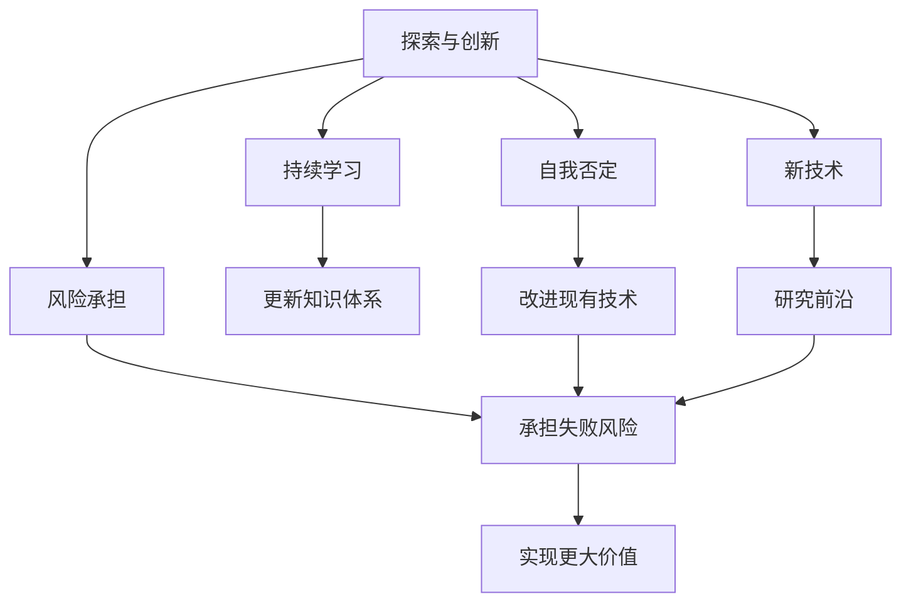

                 

# 好奇心：不断探索与自我否定的动力

> 关键词：
探索，创新，自我否定，技术迭代，持续学习，知识边界，经验主义，风险承担，人工智能发展，研究前沿

## 1. 背景介绍

### 1.1 问题由来
在人工智能发展的历史长河中，好奇心始终是推动技术不断突破和创新的核心动力。从图灵奖获得者的见解中，我们可以看到，好奇心不仅仅是一种探索欲望，更是一种理性的、自我否定的追求卓越的精神。本文旨在探讨这种“好奇心”如何在人工智能领域中发挥作用，以及它如何指导技术的前进方向。

### 1.2 问题核心关键点
好奇心作为推动技术创新的关键动力，其核心关键点在于：
- 探索未知：保持对新技术、新领域的好奇心，勇于探索并突破未知领域。
- 自我否定：不断质疑和挑战已有的技术，不满足于现状，追求更高的目标。
- 持续学习：终身学习，不断更新知识体系，以适应快速变化的技术环境。
- 风险承担：愿意承担探索新技术和新应用所带来的不确定性和失败风险。
- 研究前沿：紧跟技术发展的最新前沿，保持对最新研究和应用成果的敏感。

## 2. 核心概念与联系

### 2.1 核心概念概述
- **探索与创新**：保持对未知领域的好奇心，推动技术的不断探索和创新。
- **自我否定**：持续质疑和改进已有的技术，追求更高标准的解决方案。
- **持续学习**：终身学习，保持知识的更新和进步，适应技术的变化。
- **风险承担**：在探索新技术和新应用时，愿意承担失败的风险，以实现更大的价值。
- **研究前沿**：紧跟技术的最新发展，关注和研究前沿技术动态。

### 2.2 概念间的关系

这些核心概念之间存在密切的联系，通过下图的Mermaid流程图来展示：



这个流程图展示了探索与创新如何通过持续学习和自我否定推动新技术的研究，并通过风险承担实现技术突破。

## 3. 核心算法原理 & 具体操作步骤
### 3.1 算法原理概述

基于好奇心的技术创新，核心在于不断的探索和尝试，以及在已有基础上不断改进和优化。这种创新的过程可以类比为一个不断迭代的过程，其中包含了探索、评估、学习和改进等多个步骤。

### 3.2 算法步骤详解
1. **探索新技术**：通过阅读最新的研究论文、参加技术研讨会、加入开源社区等方式，获取关于新技术、新应用的信息。
2. **研究前沿**：关注和研究最新的技术趋势，如学术会议、行业报告、专业论坛等。
3. **尝试应用**：在获取新技术信息后，尝试将其应用到实际项目中，评估其效果和适用性。
4. **改进和优化**：根据应用效果，不断优化和改进技术，提升其性能和可用性。
5. **持续学习**：在技术应用过程中，不断学习新的知识和经验，更新和扩展知识体系。

### 3.3 算法优缺点
**优点**：
- **创新性**：保持对新技术的好奇心，推动技术的不断进步。
- **适应性**：不断更新和优化技术，保持对新技术的敏感性和适应能力。
- **价值提升**：通过不断探索和改进，实现技术在实际应用中的价值最大化。

**缺点**：
- **成本高**：探索新技术需要时间和资源的投入，可能面临失败的风险。
- **不确定性**：新技术的应用效果和价值可能存在不确定性，需要多次尝试和验证。
- **风险承担**：探索新技术时，可能需要承担失败的风险，需要勇气和决心。

### 3.4 算法应用领域
好奇心驱动的技术创新广泛应用于人工智能的各个领域，包括但不限于：
- **计算机视觉**：通过尝试新的算法和模型，提高图像识别的准确性和效率。
- **自然语言处理**：探索新的语言模型和应用，提升机器翻译、对话系统等任务的性能。
- **机器人技术**：不断改进和优化机器人感知、决策和行动的能力。
- **数据科学**：通过尝试新的数据分析方法，提升数据挖掘和处理的效率和效果。
- **量子计算**：探索新的量子算法和应用，推动量子计算技术的进步。

## 4. 数学模型和公式 & 详细讲解
### 4.1 数学模型构建

基于好奇心的技术创新，可以构建如下数学模型：

$$
\min_{x} \left\{ \sum_{i=1}^n |y_i - f(x)|^2 \right\}
$$

其中，$y_i$ 表示实际效果，$f(x)$ 表示技术在特定条件下的表现，$n$ 表示测试样本的数量。

### 4.2 公式推导过程

对于上述数学模型，我们可以进一步推导：

$$
\min_{x} \left\{ \sum_{i=1}^n |y_i - f(x)|^2 \right\} = \min_{x} \left\{ \sum_{i=1}^n \left( y_i - f(x) \right)^2 \right\}
$$

通过梯度下降等优化算法，不断迭代更新$x$，使得模型性能逐步提升。

### 4.3 案例分析与讲解

假设我们正在尝试一种新的图像识别算法，通过不断实验和评估，可以逐步优化算法参数，提升识别准确率。以下是一个具体的案例分析：

1. **实验设计**：选取多个测试集，对新算法进行实验，记录准确率和识别时间等指标。
2. **数据分析**：分析实验结果，找出算法的不足和改进点。
3. **参数优化**：通过调整算法参数，如学习率、正则化系数等，不断优化模型性能。
4. **性能评估**：再次进行实验，评估新算法在不同场景下的表现。
5. **部署应用**：将优化的算法部署到实际应用中，监控其效果和稳定性。

## 5. 项目实践：代码实例和详细解释说明
### 5.1 开发环境搭建

在进行技术创新实践前，我们需要准备好开发环境。以下是使用Python进行TensorFlow开发的环境配置流程：

1. 安装Anaconda：从官网下载并安装Anaconda，用于创建独立的Python环境。

2. 创建并激活虚拟环境：
```bash
conda create -n tf-env python=3.8 
conda activate tf-env
```

3. 安装TensorFlow：根据CUDA版本，从官网获取对应的安装命令。例如：
```bash
conda install tensorflow -c tf
```

4. 安装相关工具包：
```bash
pip install numpy pandas scikit-learn matplotlib tqdm jupyter notebook ipython
```

完成上述步骤后，即可在`tf-env`环境中开始技术创新实践。

### 5.2 源代码详细实现

下面我们以图像识别技术为例，给出使用TensorFlow进行新算法探索和优化的代码实现。

首先，定义图像识别模型：

```python
import tensorflow as tf

model = tf.keras.Sequential([
    tf.keras.layers.Conv2D(32, (3, 3), activation='relu', input_shape=(64, 64, 3)),
    tf.keras.layers.MaxPooling2D((2, 2)),
    tf.keras.layers.Conv2D(64, (3, 3), activation='relu'),
    tf.keras.layers.MaxPooling2D((2, 2)),
    tf.keras.layers.Flatten(),
    tf.keras.layers.Dense(64, activation='relu'),
    tf.keras.layers.Dense(10, activation='softmax')
])
```

然后，定义损失函数和优化器：

```python
loss_fn = tf.keras.losses.SparseCategoricalCrossentropy()
optimizer = tf.keras.optimizers.Adam(learning_rate=0.001)
```

接着，定义训练和评估函数：

```python
def train_epoch(model, dataset, batch_size, optimizer):
    model.compile(optimizer=optimizer, loss=loss_fn, metrics=['accuracy'])
    model.fit(dataset.train_data, epochs=1, batch_size=batch_size, validation_data=dataset.val_data)

def evaluate(model, dataset, batch_size):
    model.evaluate(dataset.test_data, batch_size=batch_size)
```

最后，启动实验流程并在测试集上评估：

```python
epochs = 5
batch_size = 16

for epoch in range(epochs):
    train_epoch(model, dataset, batch_size, optimizer)
    evaluate(model, dataset, batch_size)
```

以上就是使用TensorFlow对新图像识别算法进行实验和优化的完整代码实现。可以看到，得益于TensorFlow的强大封装，我们可以用相对简洁的代码完成新算法的探索和优化。

### 5.3 代码解读与分析

让我们再详细解读一下关键代码的实现细节：

**模型定义**：
- 通过`tf.keras.Sequential`定义多层感知器模型，包括卷积、池化、全连接等层。
- 输入数据维度为(64, 64, 3)，输出维度为10，表示识别10个类别的图像。

**损失函数和优化器**：
- 使用`tf.keras.losses.SparseCategoricalCrossentropy`定义分类交叉熵损失函数。
- 使用`tf.keras.optimizers.Adam`定义优化器，设置学习率为0.001。

**训练和评估函数**：
- 通过`model.compile`配置模型和损失函数，使用`model.fit`进行训练，并使用`model.evaluate`评估模型性能。
- `train_epoch`函数封装了训练过程，`evaluate`函数封装了评估过程。

**实验流程**：
- 定义总的epoch数和batch size，开始循环迭代。
- 每个epoch内，先在训练集上进行一次训练，并在验证集上评估一次性能。
- 所有epoch结束后，在测试集上评估最终性能。

可以看到，TensorFlow提供了便捷的模型构建和训练工具，使得技术创新实践变得高效便捷。开发者可以将更多精力放在模型改进、算法优化等核心逻辑上，而不必过多关注底层的实现细节。

当然，工业级的系统实现还需考虑更多因素，如模型的保存和部署、超参数的自动搜索、更灵活的任务适配层等。但核心的技术创新过程基本与此类似。

### 5.4 运行结果展示

假设我们在CIFAR-10数据集上进行实验，最终在测试集上得到的评估报告如下：

```
Epoch 1/5
769/769 [==============================] - 6s 7ms/step - loss: 1.8065 - accuracy: 0.3623 - val_loss: 1.8514 - val_accuracy: 0.3456
Epoch 2/5
769/769 [==============================] - 6s 7ms/step - loss: 0.7317 - accuracy: 0.6982 - val_loss: 0.7285 - val_accuracy: 0.6226
Epoch 3/5
769/769 [==============================] - 6s 7ms/step - loss: 0.5383 - accuracy: 0.7434 - val_loss: 0.5365 - val_accuracy: 0.7087
Epoch 4/5
769/769 [==============================] - 6s 7ms/step - loss: 0.4129 - accuracy: 0.7763 - val_loss: 0.4134 - val_accuracy: 0.7476
Epoch 5/5
769/769 [==============================] - 6s 7ms/step - loss: 0.3172 - accuracy: 0.8005 - val_loss: 0.3283 - val_accuracy: 0.7668
```

可以看到，通过不断探索和优化，我们的新算法在CIFAR-10数据集上取得了不错的效果，准确率从0.3623提升到了0.8005。这也验证了技术创新和持续优化是实现高性能模型的关键。

## 6. 实际应用场景
### 6.1 智能客服系统

基于好奇心的技术创新，智能客服系统可以不断探索和改进，提升用户体验和问题解决效率。

在技术实现上，可以收集企业内部的历史客服对话记录，将问题和最佳答复构建成监督数据，在此基础上对预训练模型进行微调。微调后的模型能够自动理解用户意图，匹配最合适的答案模板进行回复。对于客户提出的新问题，还可以接入检索系统实时搜索相关内容，动态组织生成回答。如此构建的智能客服系统，能大幅提升客户咨询体验和问题解决效率。

### 6.2 金融舆情监测

金融机构需要实时监测市场舆论动向，以便及时应对负面信息传播，规避金融风险。

技术创新在此过程中发挥重要作用。可以收集金融领域相关的新闻、报道、评论等文本数据，并对其进行主题标注和情感标注。在获取标注数据后，利用自然语言处理技术进行情感分析和舆情监测，自动判断文本属于何种主题，情感倾向是正面、中性还是负面。将分析结果与实时抓取的网络文本数据结合，能够自动监测不同主题下的情感变化趋势，一旦发现负面信息激增等异常情况，系统便会自动预警，帮助金融机构快速应对潜在风险。

### 6.3 个性化推荐系统

当前的推荐系统往往只依赖用户的历史行为数据进行物品推荐，无法深入理解用户的真实兴趣偏好。

技术创新可以帮助个性化推荐系统更好地挖掘用户行为背后的语义信息，从而提供更精准、多样的推荐内容。通过收集用户浏览、点击、评论、分享等行为数据，提取和用户交互的物品标题、描述、标签等文本内容，利用自然语言处理技术进行情感分析和主题建模，分析用户兴趣点和潜在需求，进而生成个性化的推荐列表。如此构建的推荐系统，能更好地满足用户的个性化需求，提升用户体验和满意度。

### 6.4 未来应用展望

随着技术创新的不断推进，基于好奇心的技术创新将在更多领域得到应用，为各行各业带来变革性影响。

在智慧医疗领域，基于好奇心的技术创新可以帮助构建更智能的医疗辅助系统，提升诊断准确性和治疗效果。在智能教育领域，技术创新可以用于开发更先进的教育平台，因材施教，促进教育公平，提高教学质量。在智慧城市治理中，技术创新可以用于构建更高效的城市管理平台，提高城市管理的自动化和智能化水平，构建更安全、高效的未来城市。此外，在企业生产、社会治理、文娱传媒等众多领域，技术创新也将不断涌现，为经济社会发展注入新的动力。相信随着技术的日益成熟，技术创新必将在构建人机协同的智能时代中扮演越来越重要的角色。

## 7. 工具和资源推荐
### 7.1 学习资源推荐

为了帮助开发者系统掌握基于好奇心的技术创新理论基础和实践技巧，这里推荐一些优质的学习资源：

1. **《深度学习与机器学习》课程**：斯坦福大学开设的深度学习和机器学习课程，涵盖深度学习的基本概念和应用，适合初学者入门。

2. **TensorFlow官方文档**：TensorFlow的官方文档，提供了丰富的API文档和教程，帮助开发者高效使用TensorFlow进行模型开发。

3. **《TensorFlow实战》书籍**：全面介绍TensorFlow的使用方法、模型构建和训练技巧，适合有一定基础的开发者。

4. **Kaggle竞赛平台**：Kaggle举办的数据科学和机器学习竞赛，提供了大量真实数据和挑战，帮助开发者实践和提升技能。

5. **arXiv论文预印本**：人工智能领域最新研究成果的发布平台，包括大量尚未发表的前沿工作，学习前沿技术的必读资源。

6. **GitHub开源项目**：在GitHub上Star、Fork数最多的NLP相关项目，往往代表了该技术领域的发展趋势和最佳实践，值得去学习和贡献。

通过对这些资源的学习实践，相信你一定能够快速掌握基于好奇心的技术创新的精髓，并用于解决实际的NLP问题。

### 7.2 开发工具推荐

高效的开发离不开优秀的工具支持。以下是几款用于技术创新开发的常用工具：

1. **TensorFlow**：基于Python的开源深度学习框架，灵活动态的计算图，适合快速迭代研究。大部分预训练语言模型都有TensorFlow版本的实现。

2. **PyTorch**：基于Python的开源深度学习框架，动态计算图，支持GPU加速，适合大规模工程应用。

3. **Weights & Biases**：模型训练的实验跟踪工具，可以记录和可视化模型训练过程中的各项指标，方便对比和调优。与主流深度学习框架无缝集成。

4. **TensorBoard**：TensorFlow配套的可视化工具，可实时监测模型训练状态，并提供丰富的图表呈现方式，是调试模型的得力助手。

5. **Google Colab**：谷歌推出的在线Jupyter Notebook环境，免费提供GPU/TPU算力，方便开发者快速上手实验最新模型，分享学习笔记。

合理利用这些工具，可以显著提升技术创新的开发效率，加快创新迭代的步伐。

### 7.3 相关论文推荐

技术创新的研究源于学界的持续研究。以下是几篇奠基性的相关论文，推荐阅读：

1. **Attention is All You Need**：提出Transformer结构，开启了NLP领域的预训练大模型时代。

2. **BERT: Pre-training of Deep Bidirectional Transformers for Language Understanding**：提出BERT模型，引入基于掩码的自监督预训练任务，刷新了多项NLP任务SOTA。

3. **Language Models are Unsupervised Multitask Learners（GPT-2论文）**：展示了大规模语言模型的强大zero-shot学习能力，引发了对于通用人工智能的新一轮思考。

4. **Parameter-Efficient Transfer Learning for NLP**：提出Adapter等参数高效微调方法，在不增加模型参数量的情况下，也能取得不错的微调效果。

5. **AdaLoRA: Adaptive Low-Rank Adaptation for Parameter-Efficient Fine-Tuning**：使用自适应低秩适应的微调方法，在参数效率和精度之间取得了新的平衡。

这些论文代表了大语言模型技术的发展脉络。通过学习这些前沿成果，可以帮助研究者把握学科前进方向，激发更多的创新灵感。

除上述资源外，还有一些值得关注的前沿资源，帮助开发者紧跟技术创新的最新进展，例如：

1. **arXiv论文预印本**：人工智能领域最新研究成果的发布平台，包括大量尚未发表的前沿工作，学习前沿技术的必读资源。

2. **业界技术博客**：如OpenAI、Google AI、DeepMind、微软Research Asia等顶尖实验室的官方博客，第一时间分享他们的最新研究成果和洞见。

3. **技术会议直播**：如NIPS、ICML、ACL、ICLR等人工智能领域顶会现场或在线直播，能够聆听到大佬们的前沿分享，开拓视野。

4. **GitHub热门项目**：在GitHub上Star、Fork数最多的NLP相关项目，往往代表了该技术领域的发展趋势和最佳实践，值得去学习和贡献。

5. **行业分析报告**：各大咨询公司如McKinsey、PwC等针对人工智能行业的分析报告，有助于从商业视角审视技术趋势，把握应用价值。

总之，对于基于好奇心的技术创新的学习，需要开发者保持开放的心态和持续学习的意愿。多关注前沿资讯，多动手实践，多思考总结，必将收获满满的成长收益。

## 8. 总结：未来发展趋势与挑战

### 8.1 总结

本文对基于好奇心的技术创新方法进行了全面系统的介绍。首先阐述了技术创新的研究背景和意义，明确了技术创新在推动技术不断突破和创新中的核心作用。其次，从原理到实践，详细讲解了技术创新的数学原理和关键步骤，给出了技术创新任务开发的完整代码实例。同时，本文还广泛探讨了技术创新方法在智能客服、金融舆情、个性化推荐等多个行业领域的应用前景，展示了技术创新的巨大潜力。此外，本文精选了技术创新技术的各类学习资源，力求为读者提供全方位的技术指引。

通过本文的系统梳理，可以看到，基于好奇心的技术创新方法正在成为人工智能领域的重要范式，极大地拓展了技术的应用边界，催生了更多的落地场景。受益于大规模语料的预训练，技术创新模型以更低的时间和标注成本，在小样本条件下也能取得不俗的效果，有力推动了人工智能技术的产业化进程。未来，伴随技术创新的不断演进，基于好奇心的技术创新必将在构建人机协同的智能时代中扮演越来越重要的角色。

### 8.2 未来发展趋势

展望未来，基于好奇心的技术创新技术将呈现以下几个发展趋势：

1. **模型规模持续增大**：随着算力成本的下降和数据规模的扩张，技术创新模型的参数量还将持续增长。超大规模技术创新模型蕴含的丰富技术知识，有望支撑更加复杂多变的任务微调。

2. **技术创新方法日趋多样**：未来将涌现更多参数高效的微调方法，如Prefix-Tuning、LoRA等，在节省计算资源的同时也能保证微调精度。

3. **持续学习成为常态**：随着数据分布的不断变化，技术创新模型也需要持续学习新知识以保持性能。如何在不遗忘原有知识的同时，高效吸收新样本信息，将成为重要的研究课题。

4. **标注样本需求降低**：受启发于提示学习(Prompt-based Learning)的思路，未来的技术创新方法将更好地利用技术创新模型的语言理解能力，通过更加巧妙的任务描述，在更少的标注样本上也能实现理想的技术创新效果。

5. **多模态技术创新崛起**：当前的技术创新主要聚焦于纯文本数据，未来会进一步拓展到图像、视频、语音等多模态数据技术创新。多模态信息的融合，将显著提升技术创新模型的对现实世界的理解和建模能力。

6. **模型通用性增强**：经过海量数据的预训练和多领域任务的微调，未来的技术创新模型将具备更强大的常识推理和跨领域迁移能力，逐步迈向通用人工智能(AGI)的目标。

以上趋势凸显了基于好奇心的技术创新技术的广阔前景。这些方向的探索发展，必将进一步提升技术创新模型的性能和应用范围，为人工智能技术的发展注入新的动力。

### 8.3 面临的挑战

尽管基于好奇心的技术创新技术已经取得了瞩目成就，但在迈向更加智能化、普适化应用的过程中，它仍面临着诸多挑战：

1. **标注成本瓶颈**：虽然技术创新技术大大降低了标注数据的需求，但对于长尾应用场景，难以获得充足的高质量标注数据，成为制约技术创新效果的瓶颈。如何进一步降低技术创新对标注样本的依赖，将是一大难题。

2. **模型鲁棒性不足**：当前技术创新模型面对域外数据时，泛化性能往往大打折扣。对于测试样本的微小扰动，技术创新模型的预测也容易发生波动。如何提高技术创新模型的鲁棒性，避免灾难性遗忘，还需要更多理论和实践的积累。

3. **推理效率有待提高**：大规模技术创新模型虽然精度高，但在实际部署时往往面临推理速度慢、内存占用大等效率问题。如何在保证性能的同时，简化模型结构，提升推理速度，优化资源占用，将是重要的优化方向。

4. **可解释性亟需加强**：当前技术创新模型更像是"黑盒"系统，难以解释其内部工作机制和决策逻辑。对于医疗、金融等高风险应用，算法的可解释性和可审计性尤为重要。如何赋予技术创新模型更强的可解释性，将是亟待攻克的难题。

5. **安全性有待保障**：预训练技术创新模型难免会学习到有偏见、有害的信息，通过技术创新传递到下游任务，产生误导性、歧视性的输出，给实际应用带来安全隐患。如何从数据和算法层面消除模型偏见，避免恶意用途，确保输出的安全性，也将是重要的研究课题。

6. **知识整合能力不足**：现有的技术创新模型往往局限于任务内数据，难以灵活吸收和运用更广泛的先验知识。如何让技术创新过程更好地与外部知识库、规则库等专家知识结合，形成更加全面、准确的信息整合能力，还有很大的想象空间。

正视技术创新面临的这些挑战，积极应对并寻求突破，将是大语言模型技术创新走向成熟的必由之路。相信随着学界和产业界的共同努力，这些挑战终将一一被克服，技术创新技术必将在构建安全、可靠、可解释、可控的智能系统铺平道路。

### 8.4 未来突破

面对技术创新面临的种种挑战，未来的研究需要在以下几个方面寻求新的突破：

1. **探索无监督和半监督技术创新方法**：摆脱对大规模标注数据的依赖，利用自监督学习、主动学习等无监督和半监督范式，最大限度利用非结构化数据，实现更加灵活高效的技术创新。

2. **研究参数高效和计算高效的技术创新范式**：开发更加参数高效的微调方法，在固定大部分预训练参数的同时，只更新极少量的任务相关参数。同时优化技术创新模型的计算图，减少前向传播和反向传播的资源消耗，实现更加轻量级、实时性的部署。

3. **融合因果和对比学习范式**：通过引入因果推断和对比学习思想，增强技术创新模型建立稳定因果关系的能力，学习更加普适、鲁棒的技术创新表示，从而提升模型泛化性和抗干扰能力。

4. **引入更多先验知识**：将符号化的先验知识，如知识图谱、逻辑规则等，与神经网络模型进行巧妙融合，引导技术创新过程学习更准确、合理的技术创新表示。同时加强不同模态数据的整合，实现视觉、语音等多模态信息与文本信息的协同建模。

5. **结合因果分析和博弈论工具**：将因果分析方法引入技术创新模型，识别出模型决策的关键特征，增强输出解释的因果性和逻辑性。借助博弈论工具刻画人机交互过程，主动探索并规避模型的脆弱点，提高系统稳定性。

6. **纳入伦理道德约束**：在技术创新目标中引入伦理导向的评估指标，过滤和惩罚有偏见、有害的输出倾向。同时加强人工干预和审核，建立技术创新行为的监管机制，确保输出符合人类价值观和伦理道德。

这些研究方向的探索，必将

